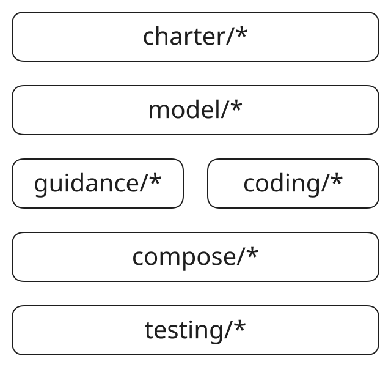

# 规格目录

规格文件用于描述内核本身的约束和内核构造过程的约束。

# 规格类型

按照类型分为两类：

- `*.md` 是说明性规格，采用自然语言和图示，解释对系统的理解和认识、设计意图和目标、构造思路和策略权衡等等。这类规格首先是站在人类视角建立的，优先保证人类易于理解；同时它们也是人类与AI协同工作的起点，类似于人类对AI提出的原始需求。
- `*.spec` 是 model、guidance、compose 和 testing 等需要机器检查层的正式规格，采用规格语言定义。
  coding 是明确例外：它负责把 model 映射到具体 impl，以自然语言 `.md` 为权威来源，不再
  维护并行的 coding formal 语义。

# 规格构成

说明性规格：

- 本文档是规格的概要说明。

- `charter/main.md`：从人类角度定义的总规格入口，约束所有的正式规格定义。后续专题说明文档继续放在 `charter/` 下。
- `charter/` 下长期按 `projects/`、`systems/`、`phases/`、`objects/` 四类组织专题说明；
  `main.md`、`new_charter.md` 和 `pic/` 作为 charter 层公共入口与资产保留。

正式规格：

- `main.spec`：正式规格的顶层索引。而每个包含正式规格的目录都以 `main.spec` 作为本目录的规格索引。

- `model/`：对象、状态、事件、依赖和阶段顺序的正式模型入口。
- `guidance/`：约束 AI/代码生成器使用规格时的上层行为入口。
- `coding/`：从模型映射到对象级代码实现的自然语言编码规则入口。
- `compose/`：对象级实现进入组件封装阶段时的正式约束入口。
- `testing/`：从模型和编码规格生成、指导或审查测试用例的正式约束入口。

`charter/`、`model/` 和 `coding/` 至少保留 `projects/`、`systems/`、`phases/`、`objects/`
四类子目录。该四分层是规格和实现整理的最低公共层次；各目录仍可保留 `pic/`、正式入口文件、
通用说明或其它职责明确的辅助目录。

各个规格层之间自上向下排列，上级约束下级，下级是对上级的明确、细化或后续：

