# Project Charter

## 文档状态

- 状态：草稿
- 维护方式：共同迭代
- 当前体系结构约束：`riscv64`
- 参考内核：`linux-6.12.37`

## 定位

本文是目标内核项目的项目章程，是源头性的自然语言说明文档。它整理人类对本项目的构想、目标、指导思想、核心概念、需求分析和演化规划，说明本项目希望内核应该是什么样子，并为后续 `model`、`coding`、`compose` 等正式规格层建立基础。

本文不是形式化规格本身。文中可以保留概念定义、设计背景、路径规划、对象解释和参考边界；其中需要被工具检查、推导、生成或实现约束化的内容，应逐步沉淀到对应正式规格层。

## 文档用途

本文档不是只用于人工阅读的设计说明，而是后续验证、构建和测试工作的共同输入。文档中的对象模型、阶段模型、状态迁移和检查项，都应尽量以可验证、可实现、可生成测试的形式表达。

1. 验证阶段：基于本规格建立的模型进行验证，发现内核最终行为与预期目标之间的不一致，也发现内核模型内部不同对象、阶段、状态之间的不一致。
2. 构建阶段：基于本规格指挥 `AI` 进行内核编码实现。各级模型在各个阶段中的状态、动作与检查项，将成为代码中内嵌检查规则的来源。
3. 测试阶段：基于本规格自动形成测试用例，使对象状态、阶段边界、上下文约束和错误路径能够被系统性覆盖。在基本的功能、性能、安全等测试基础上，还应基于模型给出的状态点与参考内核进行差分对比测试。差分信息的采集方式包括内核插桩、模拟器采集和硬件采集；对比分析方式包括实时分析和记录后分析。

## 实现阶段划分

基于规格生成或指导内核实现时，应区分两个连续阶段：

1. `Object Coding Phase`：对象级编码阶段。该阶段只考虑模型对象本身如何落到代码中，包括对象状态、对象属性、对象间依赖、事件推进、返回结果、状态检查、checkpoint 以及必要的架构和语言安全边界。
2. `Composition Phase`：组合封装阶段。该阶段在对象级实现语义已经明确的前提下，决定对象如何被组织进 crate、module、公开接口、构建 profile 和应用接入路径。

这一区分用于避免把“对象是否按规格正确推进”和“对象被封装到哪个组件中”混为一谈。对象级编码阶段不以最终 crate/module 边界为优先目标；代码物理上可以暂时放入某个 crate，但该 crate 只作为当前实现载体，不自动成为最终组件边界。组合封装阶段不应改变对象状态、事件迁移和依赖语义，只决定这些对象级实现如何组合、封装和发布。

对 `arceos_ex` 而言，第一轮实现可以为了尽快形成可运行闭环而临时交织对象级代码和 ArceOS 接入代码；但评审、文档解释和后续整理应按 `Object Coding Phase` 与 `Composition Phase` 分开处理。前者优先保证规格对象语义正确，后者才考虑 crate/module 边界、公开接口、adapter、overlay workspace 以及与 ArceOS 组件体系的兼容关系。

## 规格表达约定

为支撑后续验证、构建和测试，本文中的模型条目应尽量采用可引用、可检查、可实现和可生成测试的表达方式。说明性文字可以用于解释建模意图，但不应替代对象、过程、状态、动作和检查项本身。

对象建模应遵循以下约定：

1. 每个对象应具有稳定的中文名、英文名和对象类型；同一对象在图、表和正文中应使用同一名称。
2. 每个对象应说明其父对象、子对象或属性、依赖对象以及作用边界；对象之下可以包含若干属性或子对象，具体选择哪一种取决于所持有信息的大小和独立性。
3. 每个对象过程应尽量按照 `过程名 / 初始状态检查 / 执行动作 / 结束状态检查 / 失败处理` 的形式描述。当前阶段尚未细化的字段可以标为 `暂缺`，但不应与 `无` 混用。
4. `无` 表示当前模型确认不需要额外条件或动作；`空` 表示该过程存在但当前不执行实际动作；`暂缺` 表示模型尚未补充；`待讨论` 表示存在未决设计选择。
5. 检查项分为 `记录` 和 `验证` 两类。`记录` 用于保留后续跟踪需要的状态；`验证` 用于判断当前状态是否符合预期，失败时应使状态机进入 `FAIL` 并报告错误。
6. 对可验证的状态点，应逐步补充可观测方式，包括可观测位置、采集方式、期望值以及是否可与参考内核进行差分对比。
7. 图用于展示对象关系、阶段边界和编排顺序；真正作为验证、构建和测试输入的模型来源，应落到对象条目、过程条目、检查项和状态迁移描述中。
8. 当某一模型条目对应参考内核中的具体实现位置时，可以记录参考位置；但模型本身不要求与参考内核源码逐行对应，允许按对象边界重新组织。

对象粒度存在层次关系。当前层级中不再继续拆分的最小粒度对象可称为原子对象；由更小粒度对象组合而成的对象可称为复合对象。复合对象的状态通常由自身属性和子对象状态共同支撑，复合对象的状态迁移事件通常由其子对象事件支撑。更高粒度对象往往对应更高抽象层次，因此在规格描述中，若能够使用高粒度对象清晰表达依赖、状态和事件，应优先使用高粒度对象，以便逐级封装实现细节和复杂性。

上述对象粒度原则是建议而非硬规则。现实实现中可能受到历史代码、架构边界、性能路径、语言表达能力、验证工具能力或临时实验目标限制，导致某些对象暂时必须以较低粒度展开，或由多个实现实体共同承载一个高粒度对象。遇到这种情况时，应在说明或 coding 规格中记录取舍原因，而不是把该建议解释为必须通过检查器强制执行的规则。

## 范围

- 当前讨论限定于 `riscv64` 体系结构
- 流（Flow）这一基础抽象及其映射关系
- 对象（Object）这一基础抽象及其映射关系
- 流的实体化与资源对象的逐级建立
- 内核领域及其前置环境
- 内核的职责与非职责
- 组件模型与生命周期
- 组件间通信机制
- 配置、扩展与装配方式
- 运行时约束
- 测试与兼容性要求

## 术语

| 术语 | 定义 |
| --- | --- |
| 流（Flow） | 一个抽象概念，用于描述系统在时间维度上的持续运行、状态推进与控制权传递。它贯穿硬件启动、固件执行、引导加载与内核运行全过程。 |
| 类型（Type） | 定义一组对象共同结构、标准生命周期、扩展状态、过程、依赖、上下文约束和 API 语义的抽象规格单元。 |
| 对象（Object） | 与 Flow 相对应的另一基础术语，指在某一层级中具有身份、边界、状态以及可被识别和操作方式的承载体。 |
| 实例（Instance） | 某一 Type 的具名对象，具有自己的实例名称、生命周期状态、扩展状态值、属性、所在环境、上下文和句柄引用。本文在不强调类型/实例区别时，仍可把 object 作为 instance 的简称使用。 |
| 原子对象（Atomic Object） | 在当前建模层级中不再继续拆分的最小粒度对象。它可以仍然具有属性和内部实现细节，但这些细节在当前规格层级不作为独立对象暴露。 |
| 复合对象（Composite Object） | 由更小粒度对象组合而成的对象。复合对象通过属性和子对象状态支撑自身状态，并通常通过驱动子对象事件来完成自身状态迁移。 |
| 扩展状态（Extended State） | Type 自定义的状态域，用于表达标准生命周期状态之外的内部语义状态。扩展状态可由 Type 自定义事件推进，也可被 action 读取或影响属性。 |
| 过程（Process） | Type 定义的可调用事件或动作。每个 process 应说明它是 event 还是 action，并标注对状态与属性的影响。 |
| 上下文（Context） | 介于 Flow 与资源之间的运行环境对象。Flow 总是在某个 Context 中访问资源；Context 用于承载和限定这种访问所依赖的环境条件。 |
| 资源句柄（Resource Handle） | 面向特定 Context 暴露给 Flow 的资源访问句柄。Flow 通过句柄访问资源，而不是直接裸访问资源。 |
| 实体化 | 抽象概念在某一层级获得具体承载形式，并因此变得可执行、可切换、可观测、可操作的过程。 |
| Flow 对象 | 为表述、承载或跟踪某一 Flow 的状态与推进关系而建立的对象。它可视为该 Flow 在内核系统中的对象化代表或表现。 |
| 资源对象 | 在某一层级中被识别、命名、分界、类型化，并可被流作用或被该层管理的对象。 |
| 消息 | 对象之间传递请求、通知、状态变化或协作意图的抽象通信单元。 |
| 前置环境 | 内核领域建立之前，由硬件、固件与引导过程所提供的执行条件、资源基础及控制关系的总和。 |
| 内核领域 | 本规格重点讨论的领域，指内核接管控制权后，用以组织执行流、资源对象与组件关系的对象空间。 |
| 常规流 | 在本规格当前讨论中，指 Flow 在内核领域的一种核心表现形态，表示在默认情况下持续推进、首尾衔接、源源不断的执行状态。 |
| 根流（Root Stream） | 内核接管控制权后建立的第一条、也是引导期内唯一的常规流对象。它是后续常规流建立与早期初始化推进的根源流，负责一路执行早期初始化，直到创建 `kernel_init` 与 `kthreadd` 后，将执行承载 handoff 给 `BootIdleTask`。 |
| 事件流 | 在本规格当前讨论中，指 Flow 在内核领域的一种核心表现形态，表示由事件源触发并导向相应处理路径的离散执行形态。其核心子形态包括中断流与异常流。 |
| 内核 | 软件执行流中的核心阶段。它从前序引导阶段接收控制权，并继续组织系统初始化、组件装配、运行与退出。 |
| 组件 | 内核内部参与某一段执行流的功能单元，具有明确职责、边界、输入输出与生命周期。 |
| 扩展点 | 内核在特定流节点上预留的受控接入位置，允许组件按约定方式插入、接管或观察执行流。 |

## 目录

1. 文档状态
2. 目标
3. 文档用途
4. 规格表达约定
5. 范围
6. 术语
7. 背景与目标
8. 总体架构
9. 基础概念
10. 上下文与资源访问模型
11. 类型规格
12. 对象与消息模型
13. 流模型
14. 启动与实体化
15. 文件系统的分析
16. 组件模型
17. 生命周期
18. 接口与通信
19. 配置与装配
20. 扩展机制
21. 运行时与资源管理
22. 错误处理
23. 安全与隔离
24. Linux 6.12.37 交叉验证
25. 测试与验证
26. 兼容性策略
27. 未决问题

## 背景与目标

本规格不从静态模块图出发，而从 Flow 这一基础抽象出发，描述组件化内核如何承接硬件流与启动流，并在内核内部继续组织执行流。

本规格的核心领域是内核领域，但不把讨论起点限定在内核入口之后。硬件、固件和引导过程并不只是内核之外的背景，它们也是内核领域得以建立的前置环境。内核中的执行流、资源对象与控制关系，均建立在这些前置环境逐级准备的基础之上。

### 方法定位与意义

本项目提出的方法是先建立一种可验证、可推导、可用于构建的内核规格，再基于该规格生成新的内核实现。当前规格以 Linux 为主要来源和参照系，目标不是简单复刻 Linux 源码，而是利用 Linux 已经成熟、可运行、可对照的行为、配置、阶段状态和内部关系，检验一种不同于 Linux 传统演化路径的内核构造方法。

因此，即使生成的新内核在功能上与 Linux 等价，甚至在许多具体配置和内部状态上与 Linux 保持一致，其意义也不在于“重新实现一个相同的 Linux”，而在于验证：在相同或高度相近的目标行为下，是否可以采用规格驱动、对象化、逐级推导验证和自动生成的方式，形成一条完全不同的构造路径。这里的等价性是方法验证的锚点，用于防止目标漂移；真正需要考察的是这种构造路径本身是否带来工程价值。

这种方法的意义主要体现在三个方面：

1. 是否有利于内核开发和持续维护任务的分解。若规格能够把内核行为拆解为对象、状态、事件、约束和阶段边界，那么开发任务就可以被切分成粒度更小、实现更简单、检查更直接的工作单元。这种工作单元更适合由大量初级人员或 AI agents 并行分工协作，也更容易在合入前进行局部验证。
2. 是否有利于从小到大、从简单到复杂地逐级构建内核。规格驱动的构造方式不要求一开始就形成完整内核，而是可以先建立最小对象集合和最小阶段链，再逐步扩展资源对象、上下文、组件和运行机制。这样更有利于按对象或组件粒度裁剪出不同规模、不同功能的内核。
3. 是否有利于问题隔离、定位和修复。若构造过程和验证过程都围绕对象状态、事件推进、阶段边界和证明义务展开，那么错误不只是表现为整体功能失败，而可以进一步定位到具体对象、状态、事件、依赖条件或推导义务，从而降低诊断复杂度。

因此，本规格以 Linux 为来源，并不意味着项目价值取决于是否生成一个“新的 Linux”。Linux 在这里首先是高质量参照物和事实来源；项目的核心目标，是验证一种规格驱动的内核构造方法是否可行、是否可维护、是否便于协作，以及是否能够支持后续更细粒度的裁剪、组合和演化。

本规格的目标包括：

- 建立从硬件加电到内核运行的统一描述框架
- 说明抽象 Flow 如何在启动过程中逐级实体化
- 说明与 Flow 相对应的对象如何在启动过程中逐级建立
- 说明 Flow 所依赖和作用的资源对象如何被逐级建立
- 明确运行阶段对象之间如何通过消息通信相互影响和协作
- 界定内核领域与前置环境之间的边界及其关系
- 明确内核、组件、扩展点在执行流中的位置与边界
- 为初始化、切换、异常与退出等过程提供一致的建模方式
- 为后续组件拆分、接口定义与验证策略提供共同语言

## 总体架构

组件化内核可以初步理解为对内核执行流的显式切分、命名与装配。

在这个视角下，总体架构至少包含三层连续关系：

- 硬件流：从加电、时钟建立到 CPU 持续执行
- 启动流：从 BIOS 到 Bootloader 再到内核入口
- 内核流：从内核入口开始，经初始化、组件装配、常规执行、事件处理直至退出或停机

从实体化视角看，总体架构还包含一条逐级建立链：

- 硬件层提供最初的执行能力与原生资源边界
- 固件层和引导层建立控制权交接、初始配置与内核可接管的运行条件
- 内核早期阶段在前置环境的基础上继续建立内核领域中的 `Flow` 对象、资源对象与组织关系

从运行视角看，总体架构还可理解为一个对象协作结构：

- 引导阶段的重点是逐级建立对象
- 运行阶段的重点是对象之间通过消息通信相互影响和协作

后续规格需要进一步回答一组问题：

- 抽象 Flow 在各层分别通过什么承载体完成实体化
- 哪些对象用于表述和跟踪各层中的 Flow 状态
- 哪些前置环境是内核领域对象建立的必要条件
- 哪些位置是稳定且可定义的流节点
- 哪些组件可以挂接到这些流节点
- 对象之间的消息语义、边界与协作方式如何定义
- 流在跨组件传递时如何保持连续性、可观测性与可恢复性

## 基础概念

### 流（Flow）

流（Flow）是本规格首先建立的一级抽象。

它不是某个具体模块、某条指令或某段代码，而是用于描述系统如何在时间维度上持续推进、如何在不同阶段之间传递控制权的统一概念。

在硬件层面，流起源于硬件加电。硬件加电后，晶振开始工作，CPU 装置在时钟驱动下持续进行取指、译码、执行、访存、回写五个阶段的循环，直至断电。这里的流描述的是系统执行能力被持续驱动的事实，以及这一事实背后的物理承载过程。

在软件栈的各个层面，流会表现为不同形式的执行流。在固件与引导阶段，它体现为控制权的逐级传递，即从 BIOS 到 Bootloader，再到内核；在内核阶段，它可以进一步表现为常规流与事件流之间的组织、切换与恢复。内核并不是软件流的起点，而是前序流的承接者，也是后续系统运行流的组织者。

对于组件化内核而言，Flow 是比“组件”更基础的概念。组件不是静态堆叠的模块集合，而是被安置在特定流节点上的执行单元。组件化的核心目标之一，就是把内核内部原本隐含的执行流切分为可命名、可装配、可观测、可验证的若干段。

后续章节中涉及的初始化顺序、组件生命周期、装配时机、异常传播、停机路径等内容，均应优先从 Flow 的视角理解。

### 对象（Object）

与 Flow 相对应的另一基础术语是对象（Object）。

如果说 Flow 强调的是系统在时间维度上的持续推进、切换与传递，那么 Object 强调的就是系统在某一层级中被建立出来、可被识别、可被跟踪、可被操作的承载体。二者并不是相互排斥的两套描述，而是同一系统在动态侧与承载侧上的两种基础视角。

从本规格的角度看，一方面，抽象意义上的 Flow 本身会建立出一类对象，用来表述、承载和跟踪自己的状态；另一方面，Flow 所需要作用的各类别、各层级客体资源，也需要被建立为对象。前者可称为 Flow 对象，后者可称为资源对象。

因此，系统并不是只有“流”在运动，也不是只有“对象”在静止存在；更准确地说，Flow 通过对象获得状态表述与操作基础，而对象通过 Flow 获得推进、作用与协作关系。

对象并不只有单一粒度。最小粒度对象是原子对象；除此之外的对象都可以视为复合对象，由比自身更小粒度的对象组合而成。复合对象的状态通常不是凭空存在，而是由自身属性和子对象状态共同支撑；复合对象的状态迁移事件也通常通过驱动子对象事件来完成。由此，对象之间不仅有依赖关系，也形成了从低粒度到高粒度、从实现细节到抽象边界的层次关系。

在规格描述中，建议优先选择能够表达当前问题的高粒度对象。这样可以把低层细节封装在子对象中，让上层规格只暴露必要状态、事件和依赖关系，有利于逐级降低复杂性。不过这只是建模和实现的努力方向，不是硬性规则。若某个阶段必须展开较低粒度对象，或者无法立即建立合适的复合对象边界，可以记录原因后继续推进。

### 上下文（Context）

在 `Flow` 与资源对象之间，还需要引入一个新的对象，即上下文（`Context`）。

更准确地说，`Flow` 总是在某个 `Context` 中去访问资源，而不是脱离上下文直接与资源发生关系。因此，`Context` 可理解为某种运行环境。它既承载 `Flow` 当前访问资源所依赖的环境条件，也限定这种访问以何种方式发生。

如果说 `Flow` 强调的是推进和执行，资源对象强调的是被访问和被操作，那么 `Context` 强调的就是“Flow 以何种环境前提去访问资源”这一中间层。它介于 `Flow` 与资源之间，使得二者的关系不是直接裸露的接触关系，而是带有环境条件约束的作用关系。

### 有效上下文（Effective Context）

`Context` 不只是一个静态标签，而是 `Flow` 在某一段执行范围内访问资源时实际受到的环境约束。由于上下文可以嵌套，当前执行流真正处于的约束条件不是某一个单独 `Context` 的名称，而是所有外层与内层上下文叠加后的结果。本文将这一叠加结果称为 `有效上下文`，英文名 `Effective Context`。

`Effective Context` 是推导结果，不应作为一个需要手工维护的普通对象反复声明。规格中可以声明若干具名 `Context`，并用 `within ContextName { ... }` 表示某一段执行范围进入该上下文；工具或后续正式规格应根据当前 `within` 栈逐层叠加约束，计算出当前执行点的 `Effective Context`。对象访问是否合法、某一层资源句柄是否可用、是否允许睡眠、是否允许被中断或抢占、是否存在多核或多任务并发风险，都应以 `Effective Context` 为判断依据。

具名 `Context` 的正式来源由 `guard` 描述。`guard` 表示该上下文为何成立，而不限定为运行时锁操作。它可以对应自旋锁、互斥锁、读写锁、RCU 读侧、关抢占、关中断等显式进入/退出机制，也可以对应阶段边界、启动早期单执行流事实等天然成立的边界。对于后者，`guard` 可以没有独立的 `entered_by` / `exited_by` 动作；`within` 的词法范围本身就是进入和退出边界。

`guard` 可以声明 `holds` 块，用于描述在该 guard 作用域内始终成立的属性。例如，启动早期的阶段边界 guard 可以声明单核、单任务、本地中断关闭、抢占关闭等属性。`holds` 只应写入该 guard 能够明确保证的事实；如果某一维度不由当前 guard 改变或保证，就不应写成 `true` 或其它肯定值。缺省表示该 guard 对该维度不作保证，在上下文叠加时保持中性，不改变外层已经存在的约束，也不能凭空生成新的证明能力。

因此，`effects` 不应作为源规格中必须手工重复维护的块。更合适的规则是：`guard` 的 `lock_ref`、`entered_by` / `exited_by`、`holds`、`obj_refs` 以及上下文类型共同决定该上下文对 `Effective Context` 的贡献；这个贡献可以在工具内部归一化为 effects，用于检查、渲染或调试，但源规格应优先表达“上下文为何成立”和“该 guard 确定保持什么”。若后续正式规格确实暴露 `effects`，也应把它视为从 guard 推导出的结果，而不是与 guard 并列、需要人工保持一致的第二套事实。

上下文叠加应遵循单调加强原则。内层上下文可以进一步增加约束，例如关闭中断、关闭抢占、取得资源独占访问权或提升可用句柄层级；但不能削弱外层已经成立的约束。未被内层 guard 提及的维度，应从外层 `Effective Context` 继承，而不是被解释为允许或禁止。由此可以避免把“未约束”误写成“允许”，也避免把某个 guard 不能证明的属性错误地归入该上下文。

例如，引导期可以定义一个阶段边界上下文：

```spec
context BootPhaseContext: Context {
    guard {
        holds {
            cpu_concurrency: single_cpu;
            task_concurrency: single_task;
            local_interrupts: disabled;
            preemption: disabled;
        }
    }
}
```

随后 `BootPhase` 可用 `within BootPhaseContext { ... }` 包围其阶段驱动序列。这里的 `guard` 没有额外的运行时进入动作；它表达的是该阶段词法范围内由启动事实和阶段边界共同保证的上下文属性。后续若在该范围内再进入自旋锁、RCU 读侧或关中断上下文，新的 guard 只贡献自己能够明确保证的属性，最终执行点的约束由这些贡献与外层约束叠加形成。

`Effective Context` 对后续规格推导和代码生成至少有三类作用。

第一，它用于冲突检查。规格推导阶段应检查嵌套后的上下文是否自洽：内层上下文不能要求或声明会削弱外层已经成立的约束，例如在不可睡眠上下文中进入需要阻塞等待的上下文，或在外层已禁止抢占时进入语义上要求可抢占的上下文。

第二，它用于代码优化。若外层 `Effective Context` 已经提供某项等价保障，内层为获得同一保障而准备生成的部分 guard 代码可以省略。例如外层已经保证本地中断关闭时，内层若只需要“本地中断关闭”这一属性，就不必再次生成关中断动作。但若内层 guard 还承担资源协议、owner 状态、嵌套计数、发布顺序或调试检查等额外语义，则不能仅凭外层上下文省略整个 guard。

第三，它用于缺失检查。对象的 event/action 规格若声明了所需的上下文能力或 guard 要求，工具即可检查当前 `Effective Context` 是否满足这些要求；若不满足，应生成必要 guard、报告规格缺口或拒绝生成代码。需要注意的是，`Effective Context` 只能判断“当前已经具备什么”和“声明的需求是否被满足”，不能凭空知道某个对象操作本来应该需要哪种同步保护。因此，缺失检查依赖对象规格明确写出上下文需求，例如需要互斥锁、读写锁、RCU 读侧、抢占关闭、中断关闭、可睡眠或不可睡眠等条件。

## 上下文与资源访问模型

本规格采取的策略，是将访问对象的机制方式与其所处的访问环境统一考虑。这里所说的访问环境即 `Context`。这意味着，对资源的访问方式不应脱离 `Context` 单独讨论，而应与该 `Context` 所附带的并发、可阻塞性、所有权、生命周期、隔离边界等条件一并设计。

在这一策略下，`Flow` 总是在某个 `Context` 中，通过对象的句柄访问对象，而不是绕过句柄直接访问对象。资源对象在本文后续可简称为对象；句柄依附于对象，并作为对象访问的唯一入口。同一对象可以拥有不同层次的句柄；这些句柄体现的是访问语义和约束条件的差异，而不是对象本体的差异。

这种思路与某些统一、保守的引用机制设计不同。后者倾向于使用一套在广泛场景中都成立的通用安全机制来表达资源访问；而本规格更强调先显式建模 `Context`，再让资源句柄随 `Context` 的不同而变化。由此，哪些访问保护是必要的，哪些是冗余的，就不再是抽象地一概而论，而是由 `Context` 来决定。

<p align="center">
  
</p>

<p align="center">
  图 2 上下文与资源句柄
</p>

图中中间的资源表示同一个被动对象；外围不同虚线框表示不同的 `Context`；资源两侧的圆圈表示该对象在不同上下文中可被使用的句柄。它所强调的是：`Flow` 对对象的访问总是经由某个在当前 `Context` 中合法可用的句柄发生，而不是绕过句柄对对象本体发生。

进一步地，每个对象都至少具有一层基础句柄，也可称为裸句柄，即最接近对象的那一层句柄，图 2a 中记为 `句柄 0`。基础句柄在实现中通常表现为裸指针或等价的低级引用形式。外层可以继续套更高层句柄，例如 `句柄 1`、`句柄 2`；外层句柄依赖内层句柄，并在内层句柄基础上增加约束、保护或其它特殊功能。典型例子是锁：锁不是对象本体，而是提供额外保护的外层访问句柄；它最终仍要依赖被保护对象的内层句柄。

由此，从对象向外可以形成一条句柄链：`对象实例 -> 句柄 0 -> 句柄 1 -> 句柄 2`。不同 `Context` 可以合法访问到不同层次的句柄，因为它们代表不同访问环境、约束和限制条件。有些上下文天然满足独占性或原子性要求，可以直接使用内层句柄；另一些上下文则必须经由外层句柄提供额外保护。例如内核最早启动时处于单任务、系统独占上下文中，可以直接经由裸指针访问对象；进入多任务并发上下文后，对共享对象的访问通常必须经过带锁的外层句柄。

<p align="center">
  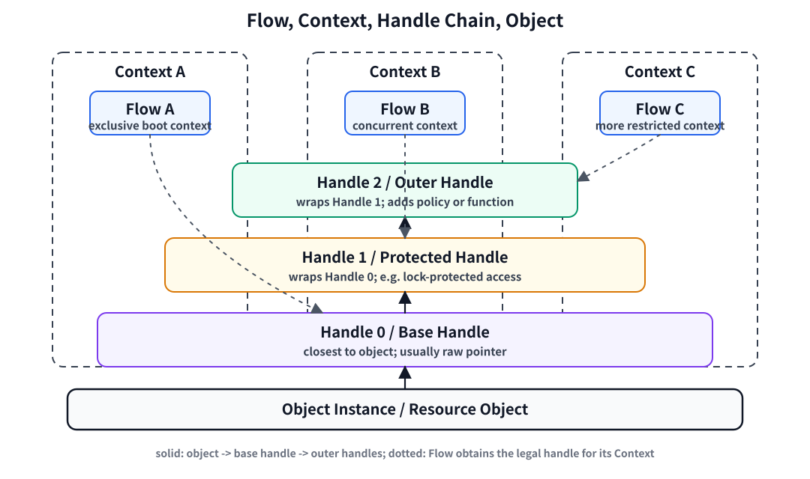
</p>

<p align="center">
  图 2a Flow、Context、句柄链与对象
</p>

图 2a 展示了三条 Flow 分别处在 `Context A/B/C` 中，并经由不同层级的句柄访问同一个对象实例。实线箭头表示句柄依附与包装方向：`对象实例 -> 句柄 0 -> 句柄 1 -> 句柄 2`。虚线箭头表示某条 Flow 在当前 `Context` 中可合法取得哪一层句柄。这个链条表达的是访问关系，而不是对象拥有关系；对象的生命周期仍由对象本身及其所属管理对象维护，句柄链只决定某条 Flow 在某个 Context 下应通过哪一层句柄触达该对象。

作为规格要求，后续在实现机制上需要落实上述理念：在编译时和/或运行时，应有相应机制保证资源句柄与 `Context` 的匹配关系，从而确保句柄被安全且合理地用于资源访问。当前先将这一点作为明确要求记录下来；至于具体采用何种编译时约束、运行时检查、类型机制或其他实现办法，将在后续补充本规格文档时进一步展开。

## 类型规格

本章用于集中归档可复用的 Type 规格。Type 定义一类对象共同遵循的状态、过程、属性和上下文约束；具体对象图和时序图中出现的具名节点则是这些 Type 的实例。后续新增可复用类型时，应优先归入本章，而不是散落在某个阶段或某个对象关系小节中。

### 类型与实例

当某种规格单元在系统中只会出现一个对象实例时，可以暂时不区分 Type 与 Instance；但只要一个 Type 可能定义多个实例，就应把规则写在 Type 上，把具体事实写在 Instance 上：

- Type 定义标准生命周期、扩展状态集合、process 集合、状态迁移规则、属性语义、依赖对象类型、可暴露句柄和上下文约束。
- Instance 具有实例名、所属 Type、当前生命周期状态、当前扩展状态值、属性值、所属环境、上下文绑定、句柄链和与其它实例的引用关系。
- 生命周期事件、扩展事件和 action 的定义主要依附于 Type；对象图和时序图中出现的具名节点通常是 Instance。

后续讨论 Flow、Object、句柄链与 Context 的关系时，应沿用这一分层：Flow 不直接裸访问资源对象，而是在某个 Context 中通过句柄链访问目标 Instance；句柄链负责表达可见性、权限、寻址和转交关系，Context 负责表达该访问发生时依赖的执行环境。

### Completion 类型

`Completion` 是本规格第一个归档的运行期对象 Type，可作为 Type/Instance、扩展状态和条件型事件建模的典型类型。Linux 6.12.37 中它对应 `struct completion`，核心属性包括 `done` 计数和 `wait` 等待队列。`RestInitPhase` 中的 `KthreaddReadyGate` 是该 Type 的典型实例，对应 Linux 静态 completion `kthreadd_done`。

`Completion` 的标准生命周期暂定如下：

| Lifecycle process | state_effect | property_effect | 语义 |
| --- | --- | --- | --- |
| `Completion.preset()` | `always` | 建立实例身份和存储承载 | 使实例从基础存在条件进入 `Prepared`。静态实例表现为符号与静态存储已经存在；动态实例表现为宿主对象字段、栈上对象或分配对象已经获得存储。 |
| `Completion.setup()` | `always` | 写入 `done = 0`，初始化等待队列和锁 | 使实例进入 `Ready`，并把扩展状态置为 `Pending`。 |
| `Completion.enable()` | `always` | 发布可用同步点或绑定引用 | 使实例进入 `Online`，允许相关 Flow 通过句柄执行 wait/complete 类过程；它不表示 `done > 0`。对于静态全局同步点，它可以是无独立 Linux 函数的静态发布事实。 |
| `Completion.disable()` | `always` 或 `conditional` | 撤销同步点引用或退出服务路径 | 当前启动主线通常不需要；正式事件名使用 `disable`，不使用 `handoff` 作为 slot 名。 |

静态定义与动态定义的区别如下：

- 静态实例：例如 Linux 的 `DECLARE_COMPLETION(name)`。规格层可看作所属对象在自身 `preset()` 与 `setup()` 中绑定该静态实例并确认初始化事实，因为静态初始化器同时提供了存储、`done = 0` 和等待队列初始结构。若该实例通过全局符号作为同步句柄暴露，`enable()` 可记录为静态发布事实或在对应 Flow 连接关系建立时完成，不必要求一个独立 Linux 调用。
- 动态实例：例如宿主对象字段、栈上 completion 或分配得到的 completion。`preset()` 发生在存储与实例身份建立时，`setup()` 对应 `init_completion()` 或等价初始化过程；若只是复用已有 completion，则应使用 `reinit()`，不能把等待队列重新初始化为新实例。

后续遇到具体 completion 实例时，默认不把它升格为独立顶层对象，也不再额外命名为 `XxxGate`。实例应归入其所属对象，作为该对象的同步子对象或属性处理：`Completion` Type 负责提供通用生命周期、扩展状态和 `wait` / `complete` / `complete_all` 等过程约束；实例自身只补充所属对象、Linux 字段或符号名、等待方、完成方、是否一次性、是否 per-CPU 或全局复用、以及是否需要 `reinit()` 等实例级约束。只有当某个 completion 具有独立生命周期、长期跨多个对象共享，或本身成为 API 边界时，才考虑显式对象化。

`Completion` 的扩展状态暂定为三类：

| 扩展状态 | Linux 条件 | 语义 |
| --- | --- | --- |
| `Pending` | `done == 0` | completion 尚未完成，wait 过程会阻塞、超时或被信号打断。 |
| `Completed` | `0 < done < UINT_MAX` | 已有有限完成令牌；wait 或 try_wait 成功时可消耗一个令牌。 |
| `CompletedAll` | `done == UINT_MAX` | `complete_all()` 形成的全完成状态；wait 成功但不递减 `done`，复用前需要 `reinit()`。 |

`Completion` 的主要扩展 process 暂定如下：

| Process | 分类 | state_effect | property_effect | 迁移与动作 |
| --- | --- | --- | --- | --- |
| `complete()` | 扩展事件 | `conditional` | 可能递增 `done`，唤醒一个等待方 | `Pending -> Completed`；`Completed -> Completed` 且令牌数增加；`CompletedAll -> CompletedAll` 且不再递增。 |
| `complete_all()` | 扩展事件 | `conditional` | 写入 `done = UINT_MAX`，唤醒全部等待方 | `Pending/Completed -> CompletedAll`；已经是 `CompletedAll` 时保持不变。 |
| `wait()` | 扩展事件 | `conditional` | 可能阻塞，成功时可能递减 `done` | `Pending` 下阻塞、超时或失败返回；`Completed` 下消耗令牌，可能回到 `Pending`；`CompletedAll` 下成功且不递减。 |
| `try_wait()` | 扩展事件 | `conditional` | 成功时可能递减 `done` | `Pending` 下失败且无状态变化；`Completed` 下消耗令牌；`CompletedAll` 下成功且不递减。 |
| `reinit()` | 扩展事件 | `conditional` | 写入 `done = 0`，不重建等待队列 | `Completed/CompletedAll -> Pending`；已经是 `Pending` 时保持不变。`complete_all()` 后复用前必须保证等待方已经被唤醒并完成消费。 |
| `completion_done()` | action | `none` | 只读查询 | 只观察 `done != 0`，不推进生命周期或扩展状态。 |

### SmpbootThread 类型

`SmpbootThread` 表示由 Linux smpboot 框架管理的 per-CPU 内核线程实例。它不是全局注册表对象，而是挂在具体 CPU 下的对象实例，记作 `CpuGroup.Cpu[cpu].SmpbootThread[name]`。Linux 6.12.37 中它由 `struct smp_hotplug_thread` 模板描述，并最终落实为绑定到某个 CPU 的 `task_struct`，典型实例包括 `ksoftirqd/%u`、`migration/%u`、`rcuc/%u`、`irq_work/%u` 以及 `cpuhp/%u`。其中 `CpuHotplugThread` 是来自 `cpuhp/%u` 模板的特化实例；因为它驱动 CPU hotplug 状态机，规格中允许保留显式名称 `CpuGroup.Cpu[cpu].CpuHotplugThread`。

模板只作为实例创建的静态描述和依赖，不在当前规格中建立独立的 `SmpbootThreadRegistry` 顶层对象。模板属性至少包括 `thread_comm`、`store`、`thread_should_run`、`thread_fn`、`setup` / `cleanup` / `park` / `unpark` 回调，以及 `selfparking` 标志。`smpboot_register_percpu_thread()` 在规格层记录为相应 `SmpbootThreadTemplate[name].registered == true`，并为当时已 online 的 CPU 创建可用实例；后续 CPU bringup 通过 CPU hotplug 状态机为目标 CPU 创建实例。

`SmpbootThread` 的标准生命周期暂定如下：

| Lifecycle process | state_effect | property_effect | 语义 |
| --- | --- | --- | --- |
| `SmpbootThread.preset()` | `always` | 绑定 CPU、模板和实例名称 | 形成 `CpuGroup.Cpu[cpu].SmpbootThread[name]` 的实例身份；模板已注册，且所属 CPU 对象存在。 |
| `SmpbootThread.setup()` | `always` | 创建 per-CPU kthread，写入 per-CPU store，并 park | 对应 `CPUHP_CREATE_THREADS` / `smpboot_create_threads(cpu)` / `__smpboot_create_thread()`；线程已绑定到目标 CPU，扩展状态为 `Parked`，标准状态推进到 `Ready`。 |
| `SmpbootThread.enable()` | `conditional` | unpark 线程，使其可被调度执行 | 对应 `CPUHP_AP_SMPBOOT_THREADS` / `smpboot_unpark_threads(cpu)`；普通非 `selfparking` 线程通过 `kthread_unpark()` 进入可运行路径。`selfparking` 线程可能由专门路径显式 unpark，例如 `CpuHotplugThread.enable()`。 |
| `SmpbootThread.disable()` | `conditional` | park 或停止线程 | 当前启动主线不展开；CPU offline / teardown 路径再细化。 |

`SmpbootThread` 的扩展状态至少包括 `Parked` 与 `Active`：创建并 park 后为 `Parked`；被 unpark 并完成模板 `setup` / `unpark` 回调后可进入 `Active`；当线程被 park 时回到 `Parked`。当前规格阶段只要求识别创建/park 与 unpark 的边界，不深入展开每个模板的 `thread_fn` 运行细节。

## 对象与消息模型

### 对象与消息

当对象逐级建立起来之后，系统运行就不再只是“单条流的推进”，而表现为对象之间的相互作用与协作。

在本规格中，对象以及对象之间的关系应优先基于消息模型进行设计。这种相互作用优先抽象为消息通信。消息并不预设某一种具体实现机制，而是泛指对象之间传递请求、通知、状态变化或协作意图的抽象单元。某个对象通过消息影响其他对象，其他对象再以相应消息或状态变化作出响应，由此形成运行阶段中的协作关系。

在最基本的消息模型中，包含两个角色：

- `sender`：发送消息的一方，负责发起请求、通知或其他消息动作。
- `handler`：接收并处理消息的一方，负责对消息作出响应，并根据情况可能返回一个消息。

在这一模型中，消息本身至少包含以下基本组成：

- 目标对象标识：用于指出该消息所作用的目标对象。
- 消息类型：用于指出该消息属于何种语义类别，以决定应采用何种处理方式。
- 消息内容：用于承载该消息的具体数据、参数或上下文信息。

如果 `handler` 需要返回结果，则其返回内容也可继续被视为消息，从而保持整个对象协作过程在统一消息模型中的闭合性。

在更具体的 `handler` 模型中，`handler` 仍然是抽象模型本身，而不预设为单一的最终处理点。首先，模型并不阻止 `sender` 把消息发给 `handler`；但在 `handler` 一侧，可以通过总开关控制消息是否允许进入。消息在通过总开关后，可进入一层分路器，由分路器根据消息类型将消息派发到不同分路上。每条分路上又各自带有分路开关；消息只有在通过对应分路开关后，才会进入相应的分路处理。

<p align="center">
  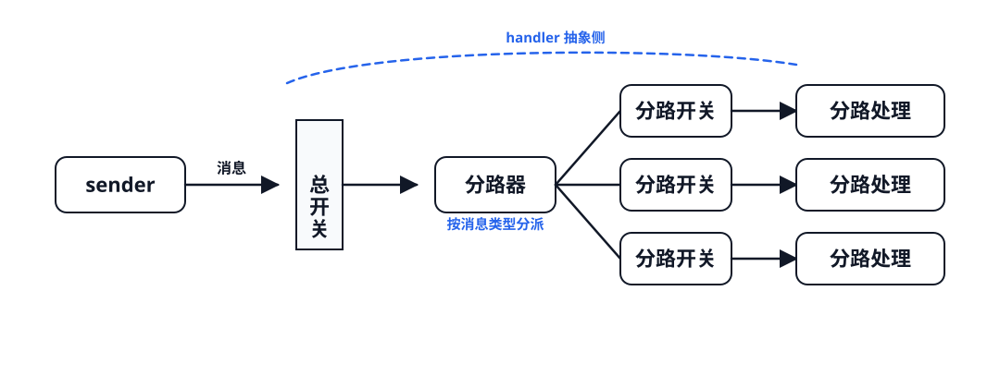
</p>

图 4 Handler 模型

这一 `handler` 抽象模型并不只对应某一种单独机制，而可用于统一表述内核世界中的多种响应机制。典型地，它可以用于描述中断/异常的响应、进程信号 `signal` 的响应，以及文中所提到的各类被动对象在接收到消息、命令或请求后的响应过程。其中，对于中断/异常这类机制，本文档当前阶段以下均按 `riscv64` 的具体语义来理解和展开，以避免讨论发散。

因此，从本规格的视角看，内核引导阶段的核心任务之一是逐级建立对象，而内核运行阶段的核心特征之一则是对象之间以消息通信方式相互影响和协作。

### 对象的通用状态模型

对于对象，需要建立一个通用的状态模型。该模型既包含状态，也包含推动状态迁移的过程。

在本规格当前约定中，可将对象的通用状态模型描述为：

`base -[discover]-> prepared -[setup]-> ready -[enable]-> online`

其中：

- 箭头方括号中的 `discover`、`setup`、`enable` 表示过程
- 其余各项表示状态

状态可作如下理解：

- `base`：当前对象状态模型的基础状态条件，表示低级对象已经处于 `online`，并成为当前对象建立的基础
- `prepared`：当前对象已被发现并完成初步建立
- `ready`：当前对象已完成必要准备，具备进入运行状态的条件
- `online`：当前对象已被使能，可被上层或其他对象继续使用、依赖或协作

过程可作如下理解：

- `discover`，别名 `detect`、`prepare` 或 `preset`：从低级对象的 `online` 状态出发，发现当前对象、探测其基本信息，或者对对象进入受控初始状态所需的最小条件进行预置，使对象从 `base` 进入 `prepared`
- `setup`，别名 `config`：基于上一阶段收集到的信息，建立对象的内部框架、必要配置与初步组织关系，使对象从 `prepared` 进入 `ready`，但尚未真正启用
- `enable`，别名 `start`：使对象上线，使对象从 `ready` 进入 `online`
- `cleanup`，别名 `teardown`：对对象以及在前序阶段中已经建立的框架、配置、绑定关系和占用资源进行清理与销毁，使对象退出当前建立过程。它不是主建立链上的常规前进过程，而是一种特殊过程；对于 `discover/detect/prepare/preset`、`setup/config`、`enable/start` 中的任一步，在执行完成后都可能因为对象已无继续存在的必要而进入 `cleanup/teardown`，也可能因为执行中途出错、取消或回滚而转入该过程。

对于 `discover` 而言，许多对象在建立之前都需要先获取基础信息。以内核中的实例来说，这些信息可能直接来自 `device tree`、`ACPI` 等前置描述，也可能来自基于这些前置描述进一步建立起来的信息收集器对象。因此，`discover` 的重点并不在于信息一定来自哪一种固定来源，而在于当前对象能够从前置环境或既有低级对象中获得其建立所需的最基本信息。

当这一过程并不只是被动发现信息，而是需要把对象预先调整到一个安全、可继续建立的初始状态时，也可以使用 `prepare` 或 `preset` 来命名同一条状态迁移。二者都强调进入 `prepared` 之前的前置预置动作：`prepare` 更偏向一般准备，`preset` 更偏向把某些关键状态位或寄存器设置为预期初值。例如入口前导期的 `中断流` 对象，关闭中断进入路径的动作就更适合放在这一过程，而不是放到后续 `setup` 中。

对于 `setup` 而言，其核心任务始终是基于上一阶段收集到的信息，把对象建立起来，但尚未真正启用。不同对象在完成这一任务时，可以采用不同模式，而且同一对象的 `setup` 过程也可能同时包含多种模式。典型模式包括：

1. `组装`：基于已经存在的较小、较基础对象，组装形成更大规模、更高层级的对象。这是最常见的模式，本质上是由已有对象建立新的组合关系和整体结构。
2. `转换`：对象的内部语义不变，但其表示形式、组织形式或数据结构发生变化。这类模式强调“形式变化而语义不变”。
3. `立体化（unflatten）`：可视为一种更具体的转换，指将某种扁平、序列化或线性展开的信息，反序列化或展开为更直接、易访问、易操作的对象结构。例如，基于磁盘上存储的文件系统元信息建立起“立体化”的文件系统对象；前后都仍然是文件系统，但对象形式已经从扁平走向立体。
4. `映射`：在两个对象空间之间建立对应关系，使一个对象体系能够通过另一对象体系被访问、解释或组织。例如，`namespace` 中多级名字对象之间可以体现映射关系，虚拟地址空间对象与物理地址空间对象之间也体现映射关系。
5. `抽象`：基于较低层对象建立一个新的、更高层级的抽象对象。它的关键不只是组合、变换或映射，而是形成了新的语义层次。例如，进程依赖于一系列低级对象，但最终形成的是一个新的高级抽象。

对于 `enable/start` 而言，这两个名称虽然对应同一状态迁移，但通常分别侧重两类不同对象：

- `enable` 更侧重被动资源对象。这类对象本身不会主动行动，而是等待命令、请求或访问，并在收到后作出响应。对这类对象而言，`enable` 表示它已经进入可接受命令、可响应请求并对外提供服务的状态。
- `start` 更侧重主动对象。这类对象在 `setup` 完成后，虽然其内部框架与运行条件已经建立，但仍处于停止或静止状态。只有经过 `start`，它们才进入可行动、可推进自身行为并开始发挥作用的状态。例如，进程、线程等对象更适合使用 `start` 来描述这一阶段。

对于非常轻量级的对象，不必为了形式完整而强行拆分出复杂的 `discover`、`setup`、`enable` 过程。它们的主要执行动作通常可以集中放在 `setup` 过程中，其余过程或状态可以是空操作，即 `dummy` 或 `no-op`。这类简化不改变对象仍然服从通用状态模型的事实，只是说明该对象在某些状态或迁移上没有实际工作需要完成。

为避免后续运行期对象建模时混淆，本规格进一步区分 Type 层面的 `process`、`event` 与 `action`：

- `process` 表示某个 Type 定义的可调用过程，是 event 与 action 的共同上位概念。标准生命周期过程、自定义操作过程和只读查询过程都应先作为 process 被定义清楚。
- `event` 表示可以参与状态迁移规则的 process。当前启动模型中的 `preset/setup/enable/disable` 是标准生命周期事件，即 `Lifecycle Event`；后续运行期对象还可以引入自定义事件，即 `Operational Event`，例如普通非嵌套自旋锁的 `lock/try_lock/unlock`。
- `action` 表示不推进当前被建模状态的 process。它可以读写属性、触发外部副作用、失败或阻塞，但其 `state_effect` 必须是 `none`。例如控制台对象进入 `online` 后执行 `write`，或者 `EarlyIoremap.Ready` 后执行 `map/unmap`，都可建模为 action。

仅靠“成功时是否推进状态”不足以描述所有过程，因此每个 process 还应显式标注状态与属性影响：

- `state_effect = always`：成功提交时必然引发被建模状态迁移。
- `state_effect = conditional`：成功提交时可能引发状态迁移，也可能因为当前扩展状态、计数值、等待队列或目标对象状态不同而停留在原状态；具体条件必须写入该 Type 的迁移表。
- `state_effect = none`：不引发被建模状态迁移；这类 process 才应归为 action。
- `property_effect`：说明该 process 是否只读、写入哪些属性，或只产生外部副作用。属性写入不必然等价于离散状态迁移。

因此，`event` 不要求每一次成功调用都改变状态；条件型事件可以在某些输入下保持原扩展状态，但它仍属于该 Type 状态规则的一部分。`action` 则用于表达被建模状态外的读写或服务动作。

`event` 与 `action` 都应带返回结果，至少区分成功与失败。更完整的结果集合可包含：

- `Success`：操作成功完成。
- `Blocked(reason)`：当前没有提交成功结果，但也不是语义错误，通常表示条件暂未满足。
- `Failed(code)`：操作失败，且可携带具体错误码或原因。

对于 `event`，只有 `Success` 才提交状态效果，并使对应后置事实成立；`Blocked` 或 `Failed` 都不得使对象进入目标状态，也不得假定该事件的 `ensures` 已经成立。对于 `state_effect = conditional` 的事件，`Success` 后到底是否发生状态迁移，应以该 Type 的条件迁移表为准。对于 `action`，`Success` 表示动作完成，但对象仍停留在动作所属的被建模状态内。

生命周期事件原则上在同一对象生命周期轮次中至多成功触发一次。当前入口启动模型采用先行推进模式，重复触发同一生命周期事件应视为规格错误。操作事件则不同：它们在对象生命周期内可以反复触发，但每次触发都必须符合该对象当前运行状态的迁移规则；反复触发不是重复定义事件。

以普通非嵌套自旋锁为例，`lock` 与 `try_lock` 都应是操作事件，而不是 action，因为它们成功时都会把锁从 `Unlocked` 推进到 `Locked(owner=current)`。`lock` 在锁被别人持有时可以返回 `Blocked(occupied)`，在已经被自己持有时返回 `Failed(nested_lock)`；`try_lock` 在锁被别人持有时返回 `Failed(busy)`，在已经被自己持有时同样返回 `Failed(nested_lock)`。二者可以具有相同的成功源状态和目标状态，但它们是两个不同事件。

后续为具体对象填写某一过程的“初始状态”时，不必重复声明通用状态机已经保证的前置条件。例如，`enable` 必然是 `setup` 的后置过程；只有对象已经到达 `ready`，才允许执行 `enable`。因此，具体对象的 `enable` 初始状态可以只写该对象额外需要检查的条件；如果没有额外条件，也可以写作“无”。

对于 `cleanup/teardown` 而言，它对应的不是对象“向前建立”的语义，而是对象“退出当前建立链”的语义。由于它可能从多个阶段被触发，将其加入主图示会干扰主建立链的阅读，因此本规格对其进行单独文字描述，而不纳入图 5 的主状态链展示。

这里的 `base` 并不表示当前对象自身已经处于某种初始运行状态，而是表示当前对象的建立以低级对象的 `online` 作为基础条件。当当前对象进入 `online` 后，这一状态又可以成为更高一级对象的 `base`。因此，该模型会沿对象层级重复展开，并形成一个连续的逐级建立链。

从这一意义上说，内核并不是一次性完成建立的静态结果，而是不断从低级对象建立高级对象的过程。低级对象进入 `online` 后，会成为更高一级对象的 `base`；更高一级对象完成 `online` 后，又继续成为再上一层对象的基础。由此，内核的建立与运行可被理解为一种沿对象层级不断递进的螺旋上升过程。

当某个对象在通用状态模型中的状态槽位不足以表达其内部建立步骤时，优先考虑把可独立跟踪的部分拆分为子对象，而不是优先引入嵌套子状态或额外的全局状态枚举。也就是说，如果一个管理对象内部实际包含可独立建模、可被其它对象依赖的成员对象，应把这些成员对象显式放入对象树中，由父对象的 `setup` 或其它迁移过程驱动子对象推进。例如 `CPUGroup` 后续可在其下建立 `BootCPU` 子对象和 `logical CPU id -> hartid` 映射对象；CPU 本体状态由 `BootCPU` 跟踪，逻辑映射由映射对象跟踪，`CPUGroup` 只负责组织和驱动这些子对象。嵌套子状态只作为例外机制，用于确实属于同一对象内部且不适合拆成子对象的细粒度状态。

<p align="center">
  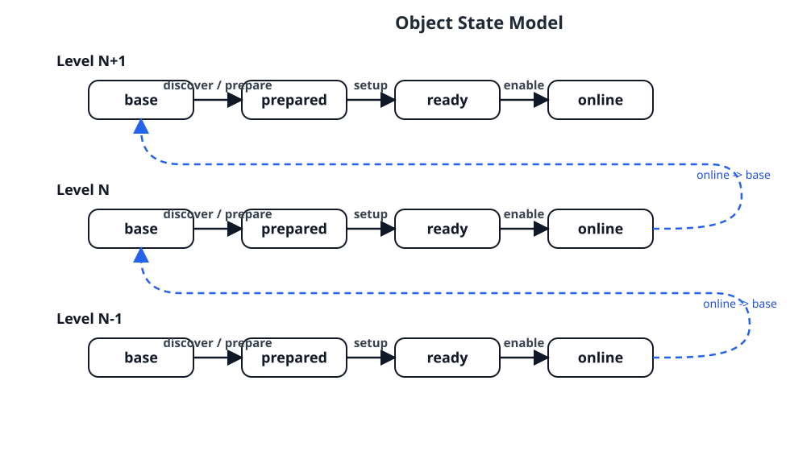
</p>

图 5 对象的通用状态模型

图中的三层串接表示同一状态模型会沿对象层级不断复用：`Level N-1` 的 `online` 构成 `Level N` 的 `base`，`Level N` 的 `online` 又构成 `Level N+1` 的 `base`。每一层内部按状态链横向展开，层与层之间则按对象层级纵向衔接，从而表达它们是同一逐级建立过程中的连续区段。

### 对象状态机建模原则

在更具体的实现建模中，可以参考 `Zephyr SMF` 一类状态机机制的结构思想，但本规格强调的是借鉴而非照搬。模型的建立必须首先服从本规格自身的对象生命周期语义，而不能被某一现成框架的 API 或调用方式反向约束。

对本规格而言，状态机中的 `entry`、`run`、`exit` 三者应承担不同职责：

- `entry`：负责进入某一状态时的检查与确认，确保对象已经具备该状态所要求的前提。
- `run`：负责状态迁移本身，也就是推动对象从当前状态走向下一状态的核心动作。
- `exit`：负责离开某一状态前的检查与确认，确保该状态应完成的工作已经完成。

在执行语义上，`entry` 与 `exit` 都应被视为单次动作：进入某一状态时，`entry` 只执行一次；离开某一状态时，`exit` 也只执行一次。与之不同，`run` 在对象停留于某一状态期间可以被多次调用；每次调用都只表示一次“单步推进尝试”。

同时，`run()` 本身不应设计为内部阻塞等待。无论本次推进是否成功，它都应立即返回结果，并把是否能够继续推进的判断交给上层逻辑。因此，`run()` 的返回结果当前可统一抽象为以下三类：

- `Progressed`：本次调用成功推进了状态迁移。
- `Blocked`：当前并未出错，但条件尚未满足，因此对象仍停留在原状态。
- `Failed`：本次调用发生错误，无法按正常路径继续推进。

与某些典型状态机框架以持续循环调用 `run_state()` 为中心的运行方式不同，本规格中的对象状态推进更基础、更通用的做法，是为对象提供“单步推进”的基本能力，再由更上层逻辑根据不同场景、阶段和上下文来决定何时调用、如何调用这一单步推进能力。也就是说，状态机本身不必天然表现为一个自循环驱动体；更常见的情况是，上层逻辑按需触发对象向前推进一步。

因此，在本规格后续的设计中，状态机的组织原则可概括为：

1. 借鉴通用状态机结构思想，但不照搬具体框架。
2. `entry / exit` 负责状态边界的检查与确认，`run` 负责迁移推进。
3. 对象应提供单步推进的基本能力，而由更上层逻辑负责按不同阶段、上下文和对象关系进行编排。

### 对象的层次

对象并不只是一层扁平集合。一个对象之下可以继续包含若干 `属性` 和若干 `子对象`。二者的区别主要取决于被持有信息的规模、独立性和生命周期：如果某项信息规模较小、语义上依附于父对象、且不需要独立经历状态迁移，通常更适合作为父对象的属性；如果某项信息规模较大、具有清晰身份和边界、需要单独维护状态或参与对象间关系，则更适合作为子对象。

因此，属性与子对象不是两套互斥的建模体系，而是同一对象分解过程中的两种粒度选择。后续在描述具体对象时，应根据对象持有信息的大小和独立程度，决定将其放入属性表，还是提升为单独的子对象。

在对象层次的讨论中，当前先列出三个处于顶级、即最高抽象级的对象。它们不是彼此从属的普通子对象，而是当前对象体系中最上层的组织对象：

1. `Flows`：流组，即流的集合，用于从整体上组织系统中的各类 Flow。
2. `CPUs`：CPU 组，用于对所有物理 CPU 进行统一管理。
3. `System`：系统对象，即内核本身，表示整个内核作为一个整体对象的存在。

后续对象层次的展开，应首先从 `Flows` 开始，而不是从 `System` 开始。原因在于，`Flow` 是本规格的核心概念；它最初是“虚”的抽象，但在内核启动过程中，会首先为自己逐步建立对象并形成管理，然后才在这些基础之上继续展开更具体的对象体系。

因此，这三个顶级对象虽然并列存在，但在叙述顺序上应优先展开 `Flows`，再继续讨论其他顶级对象及其下级体系。

#### Flows

`Flows` 本身先只作简单描述：它仅仅是一个集合管理对象，用于统一管理多个 Flow。

真正需要重点区分的是 `Flow` 本身与其对应的 `Flow` 对象。二者不是同一事物：

- `Flow` 强调的是实际推进和执行的那一侧
- `Flow` 对象强调的是该 `Flow` 在内核对象体系中的对象化代表、表现与状态记录

从内核自身对象体系的视角看，当内核刚刚启动时，最初只有一个 `Flow`。此时还没有任何由内核自己建立起来的对象，包括该 `Flow` 对应的 `Flow` 对象。这个 `Flow` 是当时唯一主动运行着的东西；随后，它要逐步创建各类各级对象，其中既包括它自己对应的 `Flow` 对象，也包括各种被动资源对象。

在内核启动的后期，这个最初的 `Flow` 还会继续创建新的 `Flow` 以及与之对应的 `Flow` 对象。到这一步，系统就不再是单一 `Flow` 的推进，而会逐步进入多个 `Flow` 并发存在的状态。

当多 CPU 支持即 `SMP` 被启用后，这些 `Flow` 又可能进一步分布到多个 CPU 上并行执行。于是，`Flow` 的展开过程就从“单一 `Flow` 推进对象建立”，过渡到“多个 `Flow` 并发推进”，再过渡到“多个 `Flow` 在多个 CPU 上并行推进”的状态。

每个 `Flow` 与其对应的 `Flow` 对象既相互区分，又彼此统一。可以认为，`Flow` 对象是该 `Flow` 在内核系统中的对象化代表或表现，用于记录其状态；而 `Flow` 本身则是那个实际运行、推进并持续建立对象的执行主体。在需要强调二者区别时，可使用“尚未对象化的 `Flow`”这一解释性说法，但不将其单独作为正式术语。

## 流模型

### 系统层次中的主动与被动对象

内核会为“流”和“资源”这两类抽象概念建立对象模型并进行管理。其中，`Flow` 对应主动对象，`Resource` 对应被动对象。

主动对象强调执行推进、控制权流动以及对象建立过程；被动对象强调被访问、被操作、被命令和被响应的一侧。二者共同构成系统中的动态关系，但承担的是不同角色。

这张图主要强调的是涵盖硬件、内核、用户进程等各个层次的 `Flow` 以及与之对应的主动对象。沿着这条主线，可以看出整个系统中执行流、或者说执行控制权的流动关系。

图中有意省略了多数被动对象，即资源对象，只着重提及了作为被动资源角色的硬件层部分。这样做的目的，是先把系统层次中的主动推进关系凸显出来；至于各层中的被动资源对象，则将在后续对具体层次的讨论中逐步识别和展开。

<p align="center">
  
</p>

<p align="center">
  图 6 系统层次的主动与被动关系
</p>

### 流的代表符号

为便于在后续架构图与规格图中统一表达，Flow 允许使用抽象代表符号进行标注。该代表符号表达的是“流”的抽象意义本身，而不是某一特定实现。

<p align="center">
  
</p>

<p align="center">
  图 1 流的代表符号
</p>

在本规格当前约定中，用于描述内核领域中流的核心形态的代表符号主要分为两类：

- 常规流符号：由若干首尾相连的曲线箭头构成，用于表示默认情况下不受外界干扰、会持续不停执行下去的执行状态
- 事件流符号：由一条主干线与若干向外导出的箭头构成，用于表示具有多个预留入口点并分别导向不同处理例程的事件分派结构

图中使用三个曲线箭头或三个分支箭头，仅用于表达“多个”这一抽象含义，并不表示数量被固定为三。符号中的形状、数量与连接方式也都具有象征意义，用来抓住流的高层特征，而不是对底层实现结构作逐项摹写。

### 抽象层与实例层的关系

流是高层次的抽象概念，关注的是多个层面上共同存在的本质特征，而不是某一层中的具体对象。

因此，本规格在不同层面使用实例来解释 Flow 时，强调的是“映射关系”或“借例说明”，而不是“相等关系”。例如，在内核层面引入进程、线程、中断、异常向量表与处理例程，是为了帮助理解流在该层的表现形式；这些对象并不等同于流本身，也不穷尽流的全部构成要素。

同一抽象流概念，在硬件层、固件层、引导层、内核层乃至其他软件层面，都可以有不同的承载体、组织方式与实现边界。本规格讨论 Flow 时，默认优先站在抽象层描述其共性；只有在需要落到某一具体层时，才引入该层的实例进行说明。

### 常规流

在本规格当前讨论中，常规流主要用于描述 Flow 在内核领域中的一种核心表现形态。

常规流表示系统在默认条件下持续推进的执行流。

这里的“默认条件”是指未受到外部中断、异常或其他事件流打断的状态。在这种状态下，执行会沿既有路径持续向前推进，不以单次触发为边界，而以连续运行作为基本特征。

在内核层面，可以借由进程或线程所承载的执行状态来理解常规流，但常规流并不等同于某个进程、线程或调度实体本身。常规流并不要求始终由同一个执行体独占 CPU；相反，它可以表现为多个进程或线程在调度作用下不断切换、交替执行，但从抽象层面看，这仍然属于系统的常规执行状态。

因此，常规流强调的不是某个具体执行体，而是“系统存在一条持续前进的主执行流，并可由多个执行体轮换承载”这一事实。

### 事件流

在本规格当前讨论中，事件流主要用于描述 Flow 在内核领域中的一种核心表现形态。

事件流表示由某类事件触发并导向相应处理路径的执行流。

它的核心特征不是连续循环，而是存在一个统一的入口组织结构，并从中分派到若干具体处理路径。在内核层面，可以借由中断异常向量表及其对应处理例程来理解事件流，但事件流并不等同于向量表这一数据结构本身，也不等同于某一组固定的处理函数集合。

在这一映射下：

- 左侧主干线可理解为向量表本身
- 主干线上预留的若干入口点可理解为不同事件对应的入口
- 右侧导出的多个箭头可理解为各个事件的处理例程

这些事件既可以是中断，也可以是异常，或其他由内核统一接管的事件类型。图中多个箭头同样只表示“若干事件处理路径”的含义，而不限定具体数量。

在本规格当前讨论中，事件流又可以进一步区分为中断流与异常流：

- `中断流`：相对于常规流，它是异步的和随机的。所谓异步，是指它并不要求在当前常规流的某个可预先精确指定的位置发生；所谓随机，是指从常规流的视角看，其中断到来的时间点通常不可事先确定。
- `异常流`：相对于常规流，它是同步的和可预期的。所谓同步，是指它与当前执行路径直接相关，通常由当前执行中的某条指令、某次访问或某种检查结果触发；所谓可预期，是指从执行语义上，可以预见在特定条件满足时它会在相应位置出现。

因此，虽然中断流与异常流都归入事件流，但二者并不相同：前者更强调来自执行流之外的异步打断，后者更强调由执行流内部条件直接导出的同步转入。

异常流的典型实例包括 `page fault`、`syscall` 等。这些实例都体现了异常流的共同特征：它们不是在执行流之外随机插入的，而是由当前执行语义在特定位置、特定条件下直接导出的。

前面的讨论，是按照处理方式来分类：在这一角度下，中断流和异常流都可归入事件流。后续讨论中，还会切换到另一个角度来看待这些流的关系。

在后一种角度下，中断流可被视为相对于常规流的独立流，而异常流则可被视为常规流的扩展。这样一来，系统中通常可以简化地理解为存在两种流：

- `中断流`
- `常规流 + 异常流`

为了讨论方便，后者在后文中可简记为 `常规流+`。这里的 `+` 表示该流不仅包含通常意义上的常规执行推进，也包含由执行流内部条件直接导出的异常流扩展。

下面通过一张图，进一步说明这些流之间的切换关系：

<p align="center">
  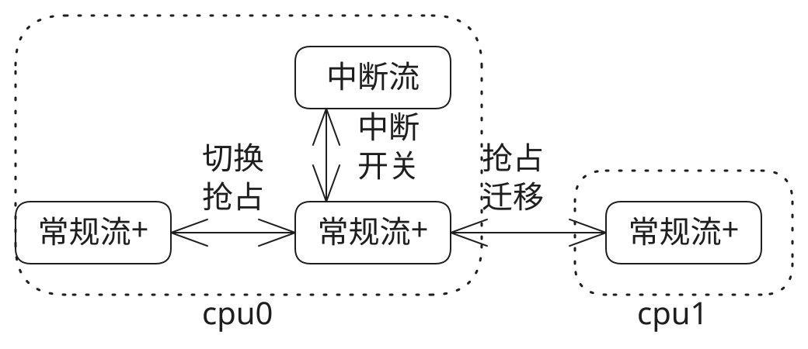
</p>

<p align="center">
  图 7 流的切换
</p>

图 7 所强调的是：`常规流+` 代表了系统中流的常态。系统通常从 `常规流+` 出发，通过中断开关控制能否切换到中断流；而一旦进入中断流，在处理完成后，它又会自动返回到原来的 `常规流+`。

`常规流+` 本身并不要求始终只由一条单独流构成。它可以由一到多个相对独立的流组成，在系统中通常表现为多任务。它们之间可以发生切换，而这种切换至少包括两类：

- 主动切换：由流自身的逻辑控制和发起，因此在语义上可被该流主动安排。
- 被动切换：即抢占。虽然抢占点的位置通常可以被确切知道，但某一抢占点是否真正发生抢占，还会受到诸多外部条件影响，因此从具体发生性上看很难完全准确预测。图中着重强调的正是这一点。

此外，任务切换不仅意味着在同一 CPU 上的执行交替，也意味着存在跨 CPU 迁移的可能性。因此，图中除常规流内部的切换关系之外，还额外强调了流在 CPU 之间迁移这一情况。

### 常规流与事件流的切换

流并不是静止地只属于某一种类型，而是在常规流与事件流之间不断切换。

在内核层面，这种切换可被观察为：系统通常处于常规流所代表的持续执行状态；当中断、异常或其他事件到来时，执行转入事件流，由对应入口和处理例程接管；当事件处理完成后，执行再返回常规流继续推进。

因此，常规流与事件流不是彼此孤立的两套系统，而是同一整体执行流在不同条件下的两种基本表现形式。上述切换关系是 Flow 在内核层面的一种具体体现，而不是对 Flow 全部适用场景的穷尽定义。组件化内核后续对上下文、调度、异常、同步与扩展点的描述，都应建立在这种切换关系之上。

## 启动与实体化

### 核心立场

从本规格的视角看，启动并不是单纯的“把控制权交给内核”，而是一个从硬件到软件逐级建立对象的过程。

在这一过程中，一方面，抽象的 Flow 在不同层级上逐步获得具体承载形式并完成实体化；另一方面，Flow 所依赖和作用的资源也被逐步建立为各层可以识别和管理的资源对象。内核接手的并不是一片空白，而是一个已经被前置环境部分建立、部分约束、部分定义的对象基础。

如果换成对象视角来描述，这一过程同样可以理解为：系统不断建立出新的对象类型、状态边界和相互关系，使后续层级能够在既有对象基础上继续组织更高层的 Flow 与协作结构。

因此，内核本身也可以被理解为一个不断从低级对象建立高级对象的螺旋上升过程，而不是一个仅在启动时线性展开、完成后便静止不变的结构。

### Flow 的实体化

Flow 是一种高阶抽象。它不是天然已经完成的具体对象，而需要在系统启动过程中逐级实体化。

所谓实体化，是指某一抽象概念在特定层级获得了承载形式、入口关系、状态边界与可操作条件，并因此从“可被描述的抽象”转变为“可被该层执行、切换、观测和约束的对象”。

从本规格的视角看，启动过程不仅是控制权的传递链，也是 Flow 的实体化链。抽象的 Flow 会在从硬件到软件的逐级建立过程中，依次获得不同层次的承载体与组织方式，并最终在内核领域中形成可直接组织和操作的执行流。

### 资源对象的逐级建立

Flow 的实体化并不是孤立发生的。与之同步发生的，还有对象的逐级建立，其中既包括 Flow 对象的建立，也包括资源对象的建立。

一类对象用于表述和跟踪 Flow 自身的状态，使得 Flow 在某一层级中不再只是抽象描述，而是具有了可记录、可切换、可恢复和可管理的状态承载体。另一类对象则用于承载 Flow 所要作用的各类客体资源，使这些资源能够在该层中被识别、命名、分界、类型化并纳入管理。

因此，系统并不是先有一套完备对象再有流，也不是先有流再凭空生成对象；更准确地说，Flow 与对象是在从硬件到软件的逐级建立过程中相互制约、共同成形的。

### 逐级建立过程

从粗略层次上看，这一过程可以理解为以下连续阶段：

1. 硬件阶段：系统加电，时钟建立，CPU 获得持续执行能力，最初的物理资源与边界随之出现。
2. 固件阶段：固件在硬件能力基础上完成最初的初始化、探测与组织，使系统具备继续启动的软件条件。
3. 引导阶段：引导程序进一步准备内核映像、入口上下文与控制权移交条件，使内核能够接管执行。
4. 内核早期阶段：内核在前置环境基础上继续建立自身领域中的执行对象、资源对象与控制关系，并逐步进入稳定运行状态。

上述阶段之间并不是相互割裂的模块边界，而是同一条实体化链上的不同区段。每一阶段都既承接前一阶段已经建立的对象条件，又为后一阶段继续建立更高层对象提供基础。

### 阶段划分与上下文

从这一节开始，讨论将不再仅停留于概念层，而会逐步进入设计层，开始分析各阶段中对象如何被建立、Flow 如何推进，以及不同 `Context` 如何约束资源访问。

在讨论各个阶段之前，还需要先补充说明一个资源访问原则。为了避免并发冲突，对资源的访问原则可概括为：`独占写` 与 `共享读`。

- `独占写`：在同一时刻，只能存在一个写者。在其写期间，禁止其他写者和读者访问该资源。
- `共享读`：在没有写请求的情况下，同时允许任意多个读者共享访问该资源。

后续对不同阶段中 `Context` 的讨论，将以这一原则作为资源访问约束的基本参照。

在进入这些运行阶段之前，还需要单独保留一个前置阶段，用于描述内核真正开始执行之前已经形成的基础对象。该阶段称为 `第零阶段：准备期`，英文名 `Prepare Phase`。

`准备期` 并不是内核运行期的一部分，它更接近内核的“史前阶段”：在内核第一条执行流真正开始之前，体系结构约定、链接脚本、编译配置、静态对象和物理资源布局已经共同准备出了一组前置对象。当前先将该阶段末尾为内核启动准备的基础对象列为：

1. `RISCV64`：当前文档所讨论的具体体系结构对象，属于 `ISA` 类对象，用于描述当前内核所依赖的指令集、寄存器、特权级和相关架构约束。
2. `LDS`：链接脚本对象，用于描述内核映像的段布局、关键符号和地址边界。
3. `静态对象集合`：由构建、链接和静态初始化过程提前准备好的内核静态对象集合。
4. `Config`：构建配置对象，用于描述编译期配置、特性开关和影响内核早期路径的静态约束。
5. `物理内存空间`：由硬件/平台设计与生产阶段固化的物理内存和设备 `I/O` 地址资源布局。

这些对象的详细状态、来源和边界检查后续补充。当前先保留该阶段，以便后续说明入口前导期对象建立时依赖哪些更早已经存在的前置条件。

当前先将内核启动到常规运行划分为以下四个运行阶段：

1. 从引导入口到调度准备完成、IRQ/time 设施开始建立之前，称为 `引导期`，英文名 `Boot Phase`。
2. 从 IRQ/time 设施准备开始，到多任务启动之前，称为 `中断期`，英文名 `Interrupt Phase`。其中首个子阶段开始时中断总开关仍关闭，并在该子阶段末尾执行 `local_irq_enable()` 打开 boot CPU 本地中断总入口。
3. 从多任务启动到多核即 `SMP` 启动之前，称为 `单核多任务期`，英文名 `UP Multitask Phase`。
4. 多核即 `SMP` 启动之后的常规运行状态，称为 `多核运行期`，英文名 `SMP Runtime Phase`。

这四个阶段之所以重要，不仅因为它们描述了内核的启动推进顺序，更因为它们直接决定了 `Flow` 所处的 `Context` 以及资源访问所受的环境约束。

从执行语义看，内核启动由概念上的 `根流` 推进。该根流在启动最初表现为对 `StartupTimeline` 的推进；`StartupTimeline` 是形式化推导中的临时启动时间轴对象，用于串接准备期、引导期以及后续启动阶段。

入口前导期中建立的 `根流` 对象，是这个概念根流在内核对象体系中的一个具体承载，只表达当前阶段需要落地的执行语义。因此，形式化模型中的阶段对象不必以 `根流` 对象为父对象；阶段对象可以挂在启动时间轴或上级阶段对象下，并在阶段完成后退出。

阶段对象不是普通数据对象的简单容器，也不只是一个顺序控制器。它至少承载三类信息：当前阶段的初始化逻辑、当前阶段的默认上下文，以及当前阶段与前后阶段之间的边界。阶段对象之间首尾相接：一个阶段对象结束，也就意味着下一个阶段对象开始。每个阶段对象都可以定义自己的默认上下文，用于描述该阶段中普通对象建立和资源访问所处的背景条件。

<p align="center">
  
</p>

<p align="center">
  图 3 内核上下文相关阶段划分
</p>

图中的 `准备期` 发生在引导入口之前。它被画为虚线框，是为了强调本规格在这里并不把它作为内核运行阶段来展开；当前只关心它为内核启动提供了哪些基础对象，例如 `RISCV64`、`LDS`、`静态对象集合`、`Config` 与 `物理内存空间`，不关心该阶段内部包含多少执行流，也不讨论该阶段的上下文情况。

#### 第一阶段：引导期（Boot Phase）

对于 `引导期` 而言，系统中只有唯一的一个 `常规流+`。它独占整个系统，对系统中所有资源的读和写在当前阶段都没有任何并发意义上的限制，也不存在任何并发冲突。

因此，可将这一阶段的环境上下文命名为：`系统独占`，英文名 `System Exclusive`。

需要特别说明的是，`系统独占` 不是一个在启动早期一次性完成的永久属性，而是由一组阶段性限制条件共同构成的上下文结果。在最早的引导阶段，它主要来自“只有一个内核执行流”这一事实；随着阶段推进，模型需要逐步把更多限制条件显式纳入，例如中断仍关闭、普通任务调度尚未开放、secondary hart 尚未进入并发执行路径、相关异步机制尚未开始执行等。也就是说，后续每个启动子阶段在声称自己处于 `System Exclusive` 时，都应说明支撑该判断的限制条件，而不是只沿用一个抽象标签。

#### 第二阶段：中断期（Interrupt Phase）

对于 `中断期` 而言，它的核心目标是建立并开放从 `常规流+` 到 `中断流` 的切换路径。需要注意，`InterruptPhase` 的首个子阶段是边界打开者：它开始时仍处于中断关闭的 `System Exclusive` 上下文，先建立 IRQ/time 控制设施，再在阶段末尾打开 boot CPU 本地中断总入口。自该打开动作完成后，系统中可以交替存在两个流：`常规流+` 和 `中断流`。此时还不存在并行，但由于这种交替具有随机性，因此在资源访问上已经可能出现并发冲突。

先看 `中断流`。它的运行级别天然高于 `常规流+`：一旦进入中断流，它会一直执行直至完成，而不会再被当前阶段的 `常规流+` 打断；相反，`常规流+` 却可能随时被中断流打断，也可以说其执行权会被抢占。

因此，从资源访问的角度看，中断流本身在这一阶段总是处于 `系统独占` 这一上下文中。

对于 `常规流+` 而言，则会在两个上下文之间切换：

1. `可中断上下文`，英文名 `Interruptible Context`：可中断，但没有抢占切换。也就是说，它保持了通向中断流的路径开放，因此可能随时被中断流打断；而由于当前阶段中只有一个 `常规流+`，所以天然保证了不存在多个 `常规流+` 之间的抢占切换。
2. `系统独占上下文`，英文名 `System Exclusive`：通过关闭中断，确保自己处于系统独占状态；等到自己认为时机适当时，再重新打开中断并返回 `可中断上下文`。

#### 第三阶段：单核多任务期（UP Multitask Phase）

对于 `单核多任务期` 而言，中断流的情况与上一阶段相同，因此这里先只讨论 `常规流+`。

本阶段从 `rest_init()` 开始，到 `kernel_init_freeable()` 中 `smp_init()` 执行前结束。选择 `rest_init()` 作为起点，是因为它创建 `kernel_init` 与 `kthreadd`，设置 `system_state = SYSTEM_SCHEDULING`，并让 boot idle thread 进入 scheduler/idle 路径；选择 `smp_init()` 前作为终点，是因为 `smp_init()` 会启动 secondary CPU，一旦执行就进入真正多核并行边界。`sched_init_smp()` 虽然名字上涉及调度 SMP 初始化，但它发生在 `smp_init()` 之后，语义上已经属于后续 `SMP Runtime Phase` 的早期补全过程。

在这一阶段中，系统里会有三个 `常规流+`：

1. `IDLE`：它是前面阶段中那个唯一 `常规流+` 的延续。
2. `INIT`：新的 `常规流+`。它后续要依次完成两个任务：首先完成系统的早期初始化并启动多核；然后在多核已经启动的情况下，切换到用户态去执行第一个用户应用。需要特别注意的是，启动多核这个节点正是当前阶段与下一个阶段之间的分水岭。
3. `KTHREADD`：新的 `常规流+`。它作为守护任务，负责接收创建新内核任务的请求，并创建这些新的内核任务。

与上一阶段相比，这一阶段中的 `常规流+` 多了一个切换方向：除了面向中断流的切换之外，还存在多个 `常规流+` 之间的切换。因此，`常规流+` 在这一阶段可以在四种上下文之间切换：

1. `可中断上下文`，英文名 `Interruptible Context`：可中断，但没有抢占切换。即保持通向中断流的路径开放，但封闭通向其他 `常规流+` 的抢占切换路径。
2. `可抢占上下文`，英文名 `Preemptible Context`：可发生抢占切换，但此时封闭了通向中断流的路径。即可能被动地切换到其他 `常规流+`，因此存在并发冲突风险。
3. `既可中断又可抢占上下文`，英文名 `Interruptible and Preemptible Context`：同时开放通向中断流和其他 `常规流+` 的路径，因此在这两种方向上都不受限制。
4. `系统独占上下文`，英文名 `System Exclusive`：同时封闭中断和抢占两条路径。也就是说，此时既不会被切换到中断流，也不会被切换到其他 `常规流+`。

在继续讨论下一阶段之前，还需要先说明 `Context` 模型的选择。对于本规格而言，上下文的分类将采用平坦模型，也就是说，对外讨论时始终把上下文视为若干清晰、平级的结果状态，而不把不同上下文关系表述为相互重叠和嵌套的层次结构。

但在实现上，这并不意味着只能靠一个单纯的平坦标签完成全部机制。后续在具体实现中，仍然可以引入必要的辅助状态，用于支撑这些平坦上下文的进入、退出与恢复，例如与锁持有状态、中断开关状态、抢占开关状态相关的辅助信息。换言之，规格上的分类是平坦的，而实现上的内部支撑机制可以利用辅助状态来保证这种平坦分类能够被正确维护。

进一步地，在实现层面，部分上下文切换还可能需要借助栈式结构来维护。其原因在于，这类切换通常具有明确的进入前状态、进入后受限状态以及退出后恢复原状态的语义，因此天然适合以后进先出的方式记录和恢复相关辅助信息。但并非所有上下文切换都必须采用栈式实现；对于不具有严格恢复前态语义的切换，仍然可以采用其他实现方式。

#### 第四阶段：多核运行期（SMP Runtime Phase）

对于 `多核运行期` 而言，首先需要说明的是：一旦系统启动了多核，就出现了真正的并行。

在这一阶段中，`系统独占上下文` 事实上已经不存在了。我们不可能再实现一个让整个系统重新回到串行状态的全局锁，否则多核本身就失去了意义。取而代之的是 `锁上下文`。锁是一种特殊的资源，在同一时刻只允许一个 CPU/核占用它；借助锁，可以对一个或多个资源的操作进行互斥保护。

因此，在这一阶段中，需要把上下文理解为由三条维度共同决定：

- 是否持有锁
- 是否允许中断
- 是否允许抢占

其中，`持锁 + 不可中断 + 不可抢占` 这一组合，表示对具体资源形成了类似于前述 `系统独占` 的独占状态，只是独占的粒度已经从“整个系统”缩小到了“被该锁所保护的具体资源”。因此，它可被理解为一种 `资源独占` 语义。为了在后续讨论中避免把这种资源粒度的独占与启动早期的全系统独占混在一起，暂时把这种由锁和执行限制共同形成的等效独占上下文命名为：`资源独占上下文`，英文名 `Resource Exclusive Context`。该名称只是当前规格讨论用名，后续如果对象模型或实现命名需要，可以再调整。

所谓 `系统独占上下文` 或 `资源独占上下文`，需要同时讨论两个性质。第一是 `原子性`：该上下文覆盖的一系列动作应被看作一个完整事务，要么完整执行，要么不执行，中间不能被其它相关执行打断并观察到半完成状态。第二是 `独占性`，也可称为 `排它性`：在该上下文对应的作用域内，同一时刻只能有一个流执行。`系统独占上下文` 的作用域是整个系统，因此它同时具有系统级原子性和系统级独占性。

`资源独占上下文` 则必须区分得更细。资源粒度的原子性本身不自动推出资源粒度的独占性；SMP 多核并行执行就是典型例子：多个 CPU 上的执行流可以各自在本 CPU 上完成不可中断、不可抢占的原子性任务，但这些任务仍可能并行发生，因此并不天然排它。只有当锁的所有权和保护范围保证“对同一组受保护资源只有一个流进入临界区”，并且配套的中断/抢占限制足以防止该资源事务被相关路径打断时，才能把该临界区称为 `资源独占上下文`。换言之，在资源粒度上，原子性不能单独保证独占性；但当排它条件已经成立并覆盖相关执行路径时，才可以进一步保证该资源事务不会被中途打断。

据此，可严格得到以下八种上下文情况：

1. `持锁、不可中断、不可抢占上下文`，英文名 `Locked Non-interruptible and Non-preemptible Context`：持有锁，同时封闭中断与抢占两条路径。此时，当前执行在系统全局范围内独占特定的锁资源，并进一步经由该锁建立起对一个或一组资源进行操作的临界区；这里的独占已不再是对整个系统的独占，而是对锁所保护资源集合的独占。
2. `持锁、不可中断、可抢占上下文`，英文名 `Locked Preemptible Context (No Interrupt)`：持有锁，封闭中断路径，但允许抢占切换。这种情况并不常见，因为一旦允许抢占，就意味着持锁执行体可能在尚未退出临界区时失去执行权，从而带来额外的并发冲突风险、调度延迟和等待关系复杂性。因此，在设计上通常会尽量避免进入这种上下文，除非确有明确必要且其风险已被控制。
3. `持锁、可中断、不可抢占上下文`，英文名 `Locked Interruptible Context (No Preemption)`：持有锁，开放中断路径，但封闭抢占路径。这属于高风险上下文。由于中断流具有异步和随机进入的特征，一旦其可触及当前锁或相关资源，就可能带来比抢占更高的冲突风险。因此，对可能与中断流共享的锁资源，应默认禁止进入该上下文；只有在资源已被明确证明不会被中断流访问时，才可作为受限例外。
4. `持锁、可中断、可抢占上下文`，英文名 `Locked, Interruptible and Preemptible Context`：持有锁，同时开放中断与抢占两条路径。这同样属于受限制使用的上下文。因为一旦在持锁期间同时允许中断和抢占，就意味着当前执行不仅可能被其他 `常规流+` 切走，也可能被中断流异步打断，从而叠加了两类冲突来源。因此，这种上下文通常应被谨慎对待；只有在锁保护对象与中断流不存在共享关系、并且相关等待链与调度影响都已被确认可控时，才可作为受限情形使用。
5. `无锁、不可中断、不可抢占上下文`，英文名 `Non-interruptible and Non-preemptible Context`：不持锁，同时封闭中断与抢占两条路径。这是典型的无锁原子上下文。它使当前流能够在本 CPU 上不被中断、也不被抢占地完整完成某个原子性事务。但需要注意，这种原子性首先是相对于当前 CPU 而言的；如果相关资源仍可能被其他 CPU 并行访问，则仅靠这一上下文本身并不能形成全系统范围的原子保护，仍需进一步借助锁或其他跨 CPU 同步机制。
6. `无锁、不可中断、可抢占上下文`，英文名 `Preemptible Context (No Interrupt)`：不持锁，封闭中断路径，但允许抢占切换。这在语义上就是单纯关中断，即仅仅封闭通向中断流的路径，而不额外封闭通向其他 `常规流+` 的抢占切换路径。
7. `无锁、可中断、不可抢占上下文`，英文名 `Interruptible Context (No Preemption)`：不持锁，开放中断路径，但封闭抢占路径。这在语义上就是单纯关抢占，即仅仅封闭通向其他 `常规流+` 的抢占切换路径，而不额外封闭通向中断流的路径。
8. `无锁、可中断、可抢占上下文`，英文名 `Interruptible and Preemptible Context`：不持锁，同时开放中断与抢占两条路径。这是最宽松、限制最少的上下文，属于内核设计中最希望达到的常规状态，因为在这一状态下，内核的并发性与并行性都能够得到最大程度的发挥。其他上下文通常都只应在确有必要时才被采用。

从更一般的角度看，每一个阶段实际上都可以识别出一个“相对最宽松”的上下文。为便于讨论，可将这种相对于当前阶段而言最宽松的上下文统称为：`自由上下文`，英文名 `Free Context`。在当前的 `多核运行期` 中，这一名称对应的就是第 8 种 `无锁、可中断、可抢占上下文`。

为便于从整体上把握这些上下文之间的关系，可先给出一个跨阶段的上下文总表。该表中的“通用意义”给出上下文在抽象层面的统一解释；“阶段特化”则说明同一上下文在不同阶段中的具体含义或出现方式。

| 上下文名 | 通用意义 | 引导期特化 | 中断期特化 | 单核多任务期特化 | 多核运行期特化 |
| --- | --- | --- | --- | --- | --- |
| `系统独占` | 封闭全部切换路径，形成系统级独占 | 当前阶段唯一 `常规流+` 的天然状态 | 中断流总是处于该状态；`常规流+` 可通过关中断进入 | 中断流仍总是处于该状态；`常规流+` 可通过同时封闭中断与抢占进入 | 不再存在，由资源粒度的锁保护独占替代 |
| `资源独占上下文` | 由锁和执行限制形成资源粒度的原子性与排它性 | 不适用 | 不适用 | 不适用 | 通过持有锁并配合必要的中断/抢占限制，对锁保护资源形成等效独占 |
| `可中断上下文` | 开放中断路径，封闭抢占路径 | 不适用 | 由于只有一个 `常规流+`，天然表现为可中断但无抢占切换 | 成为明确的“可中断、无抢占”上下文 | 对应第 7 种 `无锁、可中断、不可抢占上下文` |
| `可抢占上下文` | 开放抢占路径，封闭中断路径 | 不适用 | 不适用 | 成为明确的“可抢占、无中断”上下文 | 对应第 6 种 `无锁、不可中断、可抢占上下文` |
| `既可中断又可抢占上下文` | 同时开放中断与抢占路径 | 不适用 | 不适用 | 成为该阶段最宽松的 `常规流+` 上下文 | 对应第 8 种 `无锁、可中断、可抢占上下文`，也是该阶段的 `自由上下文` |
| `持锁、不可中断、不可抢占上下文` | 资源粒度的独占临界区 | 不适用 | 不适用 | 不适用 | 第 1 种情况，对锁保护资源形成独占 |
| `持锁、不可中断、可抢占上下文` | 持锁但允许抢占，封闭中断 | 不适用 | 不适用 | 不适用 | 第 2 种情况，不常见，设计上通常尽量避免 |
| `持锁、可中断、不可抢占上下文` | 持锁但允许中断，封闭抢占 | 不适用 | 不适用 | 不适用 | 第 3 种情况，高风险，对可能与中断流共享的锁资源默认禁止 |
| `持锁、可中断、可抢占上下文` | 持锁且同时开放中断与抢占 | 不适用 | 不适用 | 不适用 | 第 4 种情况，受限制使用，需确认中断共享关系与等待链可控 |
| `无锁、不可中断、不可抢占上下文` | 无锁原子上下文 | 不适用 | 不适用 | 不适用 | 第 5 种情况，提供相对当前 CPU 的原子执行语义 |

### 准备期的对象

`准备期` 发生在引导入口之前，因此本节不讨论它内部的执行流、上下文切换或资源访问状态。这里关心的是：当内核真正进入 `引导期` 时，已经有哪些基础对象可以被后续对象建立过程依赖。

在正式建模中，准备期对象是入口前导期推导验证的起点，而不是入口前导期内部需要建立的对象。它们在本推导开始时均视为已经处于 `online` 状态，其属性均可被后续对象过程访问；这些对象在 `online` 之前的状态链和过程链不在本规格当前范围内展开，相关过程可视为空过程或无意义过程。

其中，`LDS`、`Config` 与 `静态对象集合` 分别对应三类内核开发中的预先设定：`LDS` 对应内核映像链接布局，`Config` 对应内核参数与构建配置，`静态对象集合` 对应以内核静态方式预先定义的数据结构和静态存储。它们不是入口前导期运行时构建出来的对象，而是在构建、链接和静态初始化过程中已经形成的推导输入。

当前先识别出以下五类基础对象：

1. `RISCV64`

   `RISCV64` 是当前文档所讨论的具体体系结构对象，属于 `ISA` 类对象。它用于提供当前体系结构的基础知识，包括指令集、通用寄存器、控制状态寄存器、特权级、异常和中断入口约定等。`RISCV64` 的对象构成、属性类型和值域由 `RISC-V` 体系结构规范约束，本规格只引用入口前导期推导所需的属性，不重新定义完整体系结构。入口前导期对 `a0`、`a1`、`sp`、`tp`、`gp`、`sstatus`、`sie`、`sip`、`stvec`、`sscratch` 等寄存器的理解，均依赖该对象提供的语义。后续如果扩展到其他体系结构，可在同一 `ISA` 类下补充 `X86_64` 等对象。

   | 属性 | 作用 | 初始值 |
   | --- | --- | --- |
   | `a0` | 内核入口参数寄存器，用于承载当前启动 hart 的物理标识。 | `hart_id` |
   | `a1` | 内核入口参数寄存器，用于承载设备树物理地址。 | `dtb_pa` |
   | `sp` | 栈指针寄存器，用于指向当前执行流使用的栈位置。 |  |
   | `tp` | 线程指针寄存器，在入口前导期用于指向当前根任务对象。 |  |
   | `gp` | 全局指针寄存器，用于支持 `.sdata` 与 `.sbss` 等小数据段的 `gp` 相对寻址。 |  |
   | `sstatus` | 监管者状态寄存器，用于控制内核态下的状态位，例如 `FPU` 与 `VECTOR` 相关状态。 |  |
   | `sie` | 监管者中断使能寄存器，用于控制各类中断是否允许进入。 |  |
   | `sip` | 监管者中断挂起寄存器，用于表示各类中断挂起状态。 |  |
   | `stvec` | 监管者陷入向量寄存器，用于保存中断和异常入口地址。 |  |
   | `sscratch` | 监管者陷入暂存寄存器，用于在中断或异常入口分叉前辅助保存和识别陷入上下文。 |  |
   | `satp` | 监管者地址转换与保护寄存器，用于选择当前地址空间和页表根。 |  |

2. `LDS`

   `LDS` 是链接脚本对象，对应内核映像链接布局，用于提供内核映像的段布局、关键符号和地址边界。例如 `__global_pointer$`、入口 `_start`、`BSS` 段边界、静态根栈范围等信息，都应从该对象提供的链接结果中取得或解释。`LDS` 由本规格按入口前导期推导需要给出约束，但不展开到具体链接脚本的全部实现细节。

   入口布局有两条硬约束：`__global_pointer$` 必须作为 `gp` 初始化的直接符号来源；`_start` 必须等于内核 text 起点和 ELF entry，确保固件跳入的第一条内核指令就是入口代码，而不是链接布局中的后置符号。

   入口前导期还必须遵守分段访问纪律。链接布局应能识别一段集中放置在内核映像起始处的入口 head text 区域，用于承载 MMU 关闭阶段和 trampoline 临时映射阶段必须执行的代码。该要求类似 Linux RISC-V64 通过 `__HEAD` 将 `head.S` 放入 `.head.text`，再由链接脚本把 `HEAD_TEXT_SECTION` 放在 `_start` 之后；但本规格不强制使用相同宏名或段名，只要求形成等价的布局和访问约束。

   入口前导期的地址访问分为三段：

   1. MMU 关闭阶段：代码和早期函数必须使用 PC-relative 或等价 position-independent 方式访问内核符号，不得依赖尚未建立的虚拟地址访问普通 `.data/.bss/.init.data`。若该阶段调用高级语言函数，相关函数也必须满足无绝对寻址、无不受控 instrumentation 的约束。
   2. trampoline 临时映射阶段：代码必须位于 trampoline 映射覆盖范围内，并且不得访问普通 `.data/.bss/.init.data`；该阶段只允许依赖寄存器、CSR、立即数以及已确认映射的 head/trampoline 代码，目标是尽快切换到 EarlyVM。
   3. EarlyVM 阶段：`EarlyVM.setup/enable` 已经映射整个 `KernelImage` 后，普通 `.data/.bss/.init.data` 才可以按早期虚拟地址访问；此时还应重新建立 `gp` 相对寻址的有效性。

   | 属性 | 作用 | 初始值 |
   | --- | --- | --- |
   | `__global_pointer$` | `gp` 寄存器初始化所依赖的链接符号。 |  |
   | `_start` / text 起点 / ELF entry | 内核入口与 text 起点，三者必须一致。 |  |
   | `head_text_range` | 入口前导期早期代码集中放置范围。 |  |
   | `pre_mmu_text_range` | MMU 关闭阶段允许执行且必须满足 PC-relative 访问纪律的代码范围。 |  |
   | `trampoline_safe_text_range` | trampoline 临时映射阶段允许执行且不得访问普通数据段的代码范围。 |  |
   | `BSS` 段开始地址 | 用于确定需要清零的 `BSS` 段起始边界。 |  |
   | `BSS` 段结束地址 | 用于确定需要清零的 `BSS` 段结束边界。 |  |
   | `init_stack_start` | 用于描述静态根栈的起始地址，供入口前导期初始化 `sp` 使用。 |  |
   | `init_stack_end` | 用于描述静态根栈的结束地址，供入口前导期初始化 `sp` 使用。 |  |

3. `静态对象集合`

   `静态对象集合` 对应以内核静态方式预先定义的数据结构和静态存储，用于描述在内核映像中已经静态分配、并在入口前导期之前就具备稳定身份的对象。这些对象不是入口前导期动态创建出来的，而是由构建、链接和静态初始化过程提前准备好；入口前导期只是取得它们的地址并把它们纳入运行中的对象关系。本规格只定义入口前导期推导必须依赖的静态对象和静态存储，不深入约束其完整实现布局。

   | 成员 | 类型 | 作用 | 初始值 |
   | --- | --- | --- | --- |
   | `init_task` | 子对象 | 静态根任务结构体实例，用于作为入口前导期根任务对象的底层承载。 |  |
   | `trampoline_pg_dir` | 属性 | 静态分配的跳板页表存储，作为 `TrampolineVM` 的底层承载。 |  |
   | `early_pg_dir` | 属性 | 静态分配的早期页表存储，作为 `EarlyVM` 的底层承载。 |  |
   | `swapper_pg_dir` | 属性 | 静态分配的完整内核页表存储，作为后续 `SwapperVM` 的底层承载。 |  |

4. `Config`

   `Config` 是内核参数与构建配置对象，用于提供编译期配置、特性开关和影响早期路径的静态约束。例如页大小、页表映射粒度、内核映像虚拟地址窗口、栈布局约束等，均可由该对象提供约束。`Config` 由本规格自行定义其对入口前导期可见的属性边界；未被当前推导使用的构建配置不在本节展开。

   | 属性 | 作用 | 初始值 |
   | --- | --- | --- |
   | 页大小 | 用于检查静态根栈边界是否页对齐，并约束早期页表和内存映射粒度。 |  |
   | `PT_SIZE_ON_STACK` | 用于计算根栈初始化时 `sp` 应保留的陷入帧或上下文保存区域大小。 |  |

5. `物理内存空间`

   `物理内存空间` 是物理层面的内存与设备 `I/O` 地址资源布局对象。它来自硬件/平台设计与生产阶段的固化事实，而不是入口前导期运行时建立出来的对象。入口前导期可以读取它来验证原始 `dtb` 物理地址等状态点是否落在合法物理资源范围内，但不能修改它。后续解析 `dtb`、建立 `memblock` 或管理可分配物理页，属于更高层次对象，不能与本对象混为一谈。

   | 属性 | 作用 | 初始值 |
   | --- | --- | --- |
   | `ram` | 物理 RAM 地址范围集合。 |  |
   | `iomap` | 设备 `I/O` 地址范围集合。 |  |

这些对象不是入口前导期新建的对象，而是入口前导期对象建立时已经存在的前置基础。后续在细化入口前导期对象的初始状态检查、执行动作和结束状态检查时，应显式说明哪些检查或动作依赖这些准备期对象。

### 引导期对象建立

从这一小节开始，讨论将从阶段与上下文的划分，进一步落实到对象建立本身。`引导期` 还需要继续划分为若干子阶段。

#### 子阶段 1：入口前导期（Entry Prelude Subphase）

第一个子阶段，对应于 `Linux` 中从内核入口到 `init/main.c` 的 `start_kernel()` 入口之前的最初阶段。

这一阶段在 `Linux` 实现中通常以汇编为主，但本规格对它的建模并不以是否使用汇编语言为边界。这里真正重要的，不是实现代码采用何种语言，而是该阶段承担的职责：在最初的唯一 `Flow` 推进下，建立进入后续内核主体初始化所需的最基本执行条件，并把控制权稳定导向 `start_kernel()` 这一更高层初始化入口。

在这一阶段以及后续各阶段中，对象的建立过程原则上都应遵循前文给出的对象通用状态模型。但也需要允许一种简化情况：某些对象本身足够简单，并不需要完整经历全部状态或全部转换过程。对于这类对象，不需要的状态或过程可被视为 `dummy` 或 `no-op`，从而在保持整体模型统一的同时，避免为了形式一致而引入不必要的复杂度。

在当前子阶段中，更合适的讨论顺序，不是先枚举对象内部细节，而是先识别这一子阶段需要建立哪些对象。至于每个对象在当前子阶段中的具体建立过程、初始状态检查与结束状态检查，可在对象集合稳定后再继续细化。

当前先回答以下问题：

1. 当前子阶段需要建立哪些对象。
2. 这些对象分别承担什么基本语义。
3. 每个对象的初始状态检查与结束状态检查后续应如何补充。

需要注意的是，`System Exclusive` 仍是当前子阶段的环境前提，但这里先不把它视为当前子阶段新建立的对象；它首先是这一本子阶段中其他对象得以建立的背景条件。

据此，当前可先识别出十一类本子阶段涉及的核心对象。这里统一采用“中文名 + 英文名”的命名方式；对于约定俗成的工程对象，也可直接使用英文名。需要注意，`物理内存空间` 属于准备期输入对象，不是入口前导期新建立的对象；它在本子阶段中作为只读资源布局被读取和验证。

1. `根流`，英文名 `Root Stream`：内核引导过程中最早出现的执行流对象，表示当前唯一 `常规流+` 的 `Flow`，用于把前置环境交接下来的唯一执行流显式纳入内核对象体系，并作为后续常规流建立与早期初始化推进的根源流。
2. `启动根任务`，英文名 `BootInitTask`：后续建立的流对象父对象，是 `根流` 在内核领域内的具体化对象，后续将主要用于跟踪这一早期执行实体；它对应 Linux 静态 `init_task` / PID 0 / swapper 的启动期身份。
3. `启动根栈`，英文名 `BootInitStack`：`启动根任务` 的对应栈，作为 `启动根任务` 的子对象；它对应 Linux 静态 `init_thread_union` / init stack 存储。
4. `中断流`，英文名 `Interrupt Stream`：当前阶段的中断控制对象。在本子阶段，它还不是一个对外开放、可承担真实处理中断职责的运行流，而首先用于封闭中断进入路径，确保入口前导期在受控条件下继续执行。
5. `事件流`，英文名 `Event Stream`：`中断流` 的下级子对象，维护中断/异常入口表以及中断和异常分叉前的公共流程。
6. `内核映像`，英文名 `Kernel Image`：代表内核映像本身，主要维护其各个 `segment` 的信息与状态。
7. `物理内存空间`，英文名 `Physical Memory Space`，简称 `PM`：准备期输入对象，对物理层面的内存与设备 `I/O` 地址资源布局的抽象。它由硬件/平台设计与生产阶段固化，入口前导期只读取它提供的资源布局约束，不建立或修改它。
8. `虚拟内存空间`，英文名 `VM`：代表内核虚拟内存空间的抽象；入口前导期只建立和使用其中的早期部分。它包含 `跳板虚拟内存空间`（`TrampolineVM`）、`早期虚拟内存空间`（`EarlyVM`）与 `交换虚拟内存空间`（`SwapperVM`）三个页表子对象。
9. `处理器管理`，英文名 `CPUGroup`：`片上系统` 的下级子对象，负责管理所有 `CPU` 的信息与状态，包括物理 `ID` 与逻辑 `ID` 映射等。
10. `片上系统`，英文名 `SoC`：片上系统平台的抽象。
11. `入口前导期对象`：属于阶段对象，是 `引导期` 的子阶段对象，用于承载入口前导期的初始化逻辑、默认上下文和阶段边界，并在该子阶段内编排其他对象过程。

<p align="center">
  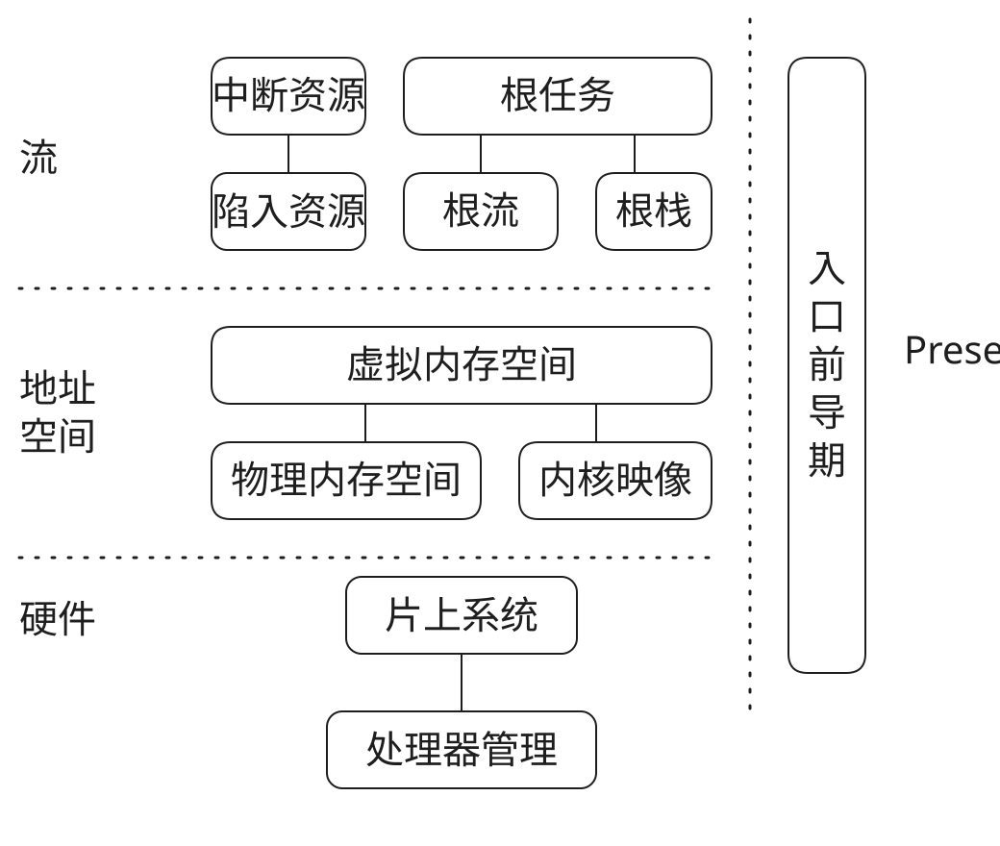
</p>

<p align="center">
  图 8 入口前导期对象分类与相互关系
</p>

图 8 用于说明入口前导期涉及对象的分类与相互关系。该阶段主要涉及四类对象：流对象、地址空间对象、硬件对象和阶段对象。

在流对象中，`根流`（`Root Stream`）是内核引导过程中最早出现的执行流。随后建立的 `启动根任务`（`BootInitTask`）是 `根流` 在内核领域内的具体化对象，未来将主要通过它跟踪这一早期执行实体。因此，在对象层级上，`启动根任务` 是父对象，`根流` 和 `启动根栈`（`BootInitStack`）都是它的子对象。入口后继期还会为 `启动根任务` 补充 `根任务地址空间`（`InitMM`）子对象，用于描述 Linux `init_mm` 这类根任务关联的地址空间元数据。`事件流`（`Event Stream`）是 `中断流`（`Interrupt Stream`）的下级子对象，用于维护中断/异常入口表以及进入中断处理或异常处理之前的公共流程。

在地址空间对象中，`虚拟内存空间`（`VM`）的空间内容先拆为两个子对象，分别是内核映像和物理内存空间。其中，`物理内存空间` 是准备期输入对象，表示只读的物理资源布局；入口前导期不建立或修改它，只读取它提供的约束。`VM` 的建立过程还包含三个页表子对象：`跳板虚拟内存空间`（`TrampolineVM`）维护并使用 `静态对象集合.trampoline_pg_dir`，`早期虚拟内存空间`（`EarlyVM`）维护并使用 `静态对象集合.early_pg_dir`，`交换虚拟内存空间`（`SwapperVM`）维护并使用 `静态对象集合.swapper_pg_dir`。入口前导期只触发前两个子对象，`SwapperVM` 对应的完整虚拟内存空间由后续阶段继续建立。

在硬件对象中，`片上系统`（`SoC`）是片上系统平台的抽象；`处理器管理`（`CPUGroup`）是 `片上系统` 的下级子对象，负责记录和管理处理器相关状态。

阶段对象是一类特殊对象，不只是用于控制其他对象的构建顺序，还用于承载本阶段的初始化逻辑、默认上下文和阶段边界。`入口前导期对象` 是 `引导期` 的子阶段对象，其父对象是 `引导期`；而 `引导期` 在形式化模型中可作为启动时间轴对象的子对象，由启动时间轴负责与准备期及后续阶段衔接。在执行语义上，概念根流通过推进启动时间轴及其中的阶段对象，逐步完成内核启动。

对于这些对象，当前先只确认它们与“入口前导期”相关：其中一部分在本子阶段中建立或推进状态，一部分作为准备期输入被读取。对象在本子阶段中实际覆盖的状态范围，以及 `discover`、`setup`、`enable` 等过程如何展开，后续再单独补充。

因此，当前先给出对象名，并为后续补充初始状态检查与结束状态检查预留位置。

检查项分为两类：

1. `记录`：读取并保存当前状态，用于后续跟踪、对比或诊断。
2. `验证`：检查当前状态是否符合预期；如果不符合预期，则状态机进入 `FAIL` 并报错。

同一对象存在多条状态检查或执行动作时，应在该对象下使用多级序号分段描述。一级序号表示对象，二级序号表示该对象内部相互对应的一组“初始状态检查、执行动作、结束状态检查”。这里的对象描述顺序优先反映入口前导期中的出现和建立顺序，不等同于对象父子层级。

1. `根流`（`Root Stream`）

   描述：内核引导过程中最早出现的执行流对象，表示当前唯一 `常规流+` 的 `Flow`；在对象层级上，它后续会下降为 `根任务` 的子对象。

   * `preset` - 禁止在内核态执行 `FPU` 指令与 `VECTOR` 指令

     * 初始状态：空。
     * 执行动作：通过设置 `sstatus`，禁止在内核态执行 `FPU` 指令与 `VECTOR` 指令。
     * 结束状态：验证 `sstatus` 对应位，确保 `FPU` 指令与 `VECTOR` 指令已被禁止。

2. `启动根任务`（`BootInitTask`）

   描述：后续建立的流对象父对象，是 `根流` 在内核领域内的具体化对象，后续将主要用于跟踪这一早期执行实体；它对应 Linux 静态 `init_task` / PID 0 / swapper 的启动期身份。

   * `setup` - 建立物理地址阶段的根任务指针

     * 初始状态：静态根任务结构体实例 `init_task` 有效，且可通过物理地址访问。
     * 执行动作：设置 `tp` 寄存器，使其指向 `init_task` 的物理地址。
     * 结束状态：验证 `tp` 寄存器指向有效的 `init_task` 物理地址。

   * `enable` - 重置根任务指针到虚拟地址

     * 初始状态：`VM.setup()` 已完成并进入早期虚拟地址阶段，`tp` 寄存器指向 `init_task` 的物理地址。
     * 执行动作：让 `tp` 寄存器指向 `init_task` 的虚拟地址。
     * 结束状态：验证 `tp` 寄存器指向有效的 `init_task` 虚拟地址。

3. `启动根栈`（`BootInitStack`）

   描述：`启动根任务` 的对应栈，作为 `启动根任务` 的子对象。

   * `setup` - 建立物理地址阶段的根栈指针

     * 初始状态：`LDS.init_stack_start` 与 `LDS.init_stack_end` 有效，二者均与页对齐，且 `LDS.init_stack_end - LDS.init_stack_start` 大于等于 `1` 个页。
     * 执行动作：先设置 `sp` 寄存器，使其指向 `LDS.init_stack_end` 对应的栈空间高端；然后将 `sp` 减去 `Config.PT_SIZE_ON_STACK`，为 `PTRACE` 区域留出空间。
     * 结束状态：验证 `sp` 寄存器指向有效的根栈物理地址，即 `LDS.init_stack_end - Config.PT_SIZE_ON_STACK`。

   * `setup` - 重置根栈指针到虚拟地址

     * 初始状态：`VM.setup()` 已完成并进入早期虚拟地址阶段，`sp` 寄存器指向 `LDS.init_stack_end - Config.PT_SIZE_ON_STACK` 的物理地址。
     * 执行动作：让 `sp` 寄存器指向 `LDS.init_stack_end - Config.PT_SIZE_ON_STACK` 的虚拟地址。
     * 结束状态：`根栈` 进入 `Ready`，验证 `sp` 寄存器指向有效的根栈虚拟地址。`Online` 留给后续栈保护机制建立后的正式服务状态。

4. `中断流`（`Interrupt Stream`）

   描述：当前阶段的中断控制对象，用于封闭中断进入路径，避免入口前导期被异步中断打断。

   * `preset` - 屏蔽中断子开关
     * 初始状态：记录 `sie` 与 `sip` 的当前值。
     * 执行动作：清零 `sie` 与 `sip`，作为防御式预置动作。
     * 结束状态：`中断流` 进入 `Prepared`，验证 `sie` 与 `sip` 确实已经清零，确保各类中断子开关与挂起状态已经被清理。

   * `setup` - 关闭中断总开关
     * 初始状态：`中断流` 已进入 `Prepared`，记录 `sstatus` 的当前值。
     * 执行动作：清除 `sstatus` 中控制 supervisor interrupt enable 的总开关位。这里的动作仍属于防御式过程，即即使固件交接时已经关闭中断，内核入口仍再次规范化总开关状态。
     * 结束状态：`中断流` 进入 `Ready`，验证 `sstatus` 的 supervisor interrupt enable 位已经清除，确保中断进入路径在子开关和总开关两个层面都被封闭。

5. `事件流`（`Event Stream`）

   描述：`中断流` 的下级子对象，用于维护中断/异常入口表以及中断和异常分叉前的公共流程。

   * `setup` - 设置事件的临时处理入口

     * 初始状态：空。
     * 执行动作：设置 `RISCV64.stvec` 指向事件的临时处理入口 `early_event_entry`。在参考内核中，该入口对应 `.Lsecondary_park`，其实现是用于调试目的的无限循环。
     * 结束状态：验证 `RISCV64.stvec` 指向 `early_event_entry`，确保误入的中断或异常能够进入受控停机路径。

   * `enable` - 设置事件的正式处理入口

     * 初始状态：`VM.setup()` 已完成并进入早期虚拟地址阶段，`事件流.setup()` 已完成。
     * 执行动作：设置 `RISCV64.stvec` 指向事件的正式处理入口 `formal_event_entry`。在参考内核中，该入口对应 `handle_exception`。该动作建立起中断/异常处理的入口框架，并清零 `RISCV64.sscratch` 指示当前处于内核态。
     * 结束状态：验证 `RISCV64.stvec` 指向 `formal_event_entry`，并验证 `RISCV64.sscratch` 已清零。

6. `内核映像`（`Kernel Image`）

   描述：代表内核映像本身，主要维护其各个 `segment` 的信息与状态。

   * `preset` - 初始化全局指针

     * 初始状态：待补充。
     * 执行动作：用 `global_pointer$` 符号地址初始化 `gp` 寄存器，作为 `preset` 动作。
     * 结束状态：验证 `gp` 寄存器值等于 `global_pointer$` 的符号地址，确保用于快速访问 `.sbss` 与 `.sdata` 的 `gp` 相对寻址方式有效。

   * `setup` - 清零 BSS 段

     * 初始状态：验证 `BSS` 段的开始地址与结束地址有效，基本要求是二者均不为 `0`，且结束地址大于开始地址。
     * 执行动作：清零 `BSS` 段。
     * 结束状态：验证 `BSS` 段已经清零。

   * `enable` - 在虚拟内存空间重置 `gp-relative` 寻址方式

     * 初始状态：`VM.setup()` 正在完成入口前导期页表切换，`global_pointer$` 的虚拟地址可用，`gp` 尚未按当前虚拟内存空间重新设置。
     * 执行动作：在 `VM.setup()` 过程中，用 `global_pointer$` 的虚拟地址重新初始化 `gp` 寄存器，作为 `enable` 动作。
     * 结束状态：验证 `gp` 寄存器值等于 `global_pointer$` 的虚拟地址，确保虚拟内存空间中的 `gp-relative` 快速寻址方式有效。

7. `物理内存空间`（`Physical Memory Space`，`PM`）

   描述：准备期输入对象，对物理层面的内存与设备 `I/O` 地址资源布局的抽象。它不是入口前导期建立出来的对象；入口前导期只读取它提供的资源布局约束。后续解析 `dtb`、建立 `memblock` 或管理可分配物理页，属于更高层次对象，不能与本对象混为一谈。

8. `虚拟内存空间`（`VM`）

   描述：代表内核虚拟内存空间的抽象。`VM` 包含三个页表子对象：`跳板虚拟内存空间`（`TrampolineVM`）、`早期虚拟内存空间`（`EarlyVM`）与 `交换虚拟内存空间`（`SwapperVM`），分别维护和使用 `静态对象集合.trampoline_pg_dir`、`静态对象集合.early_pg_dir` 与 `静态对象集合.swapper_pg_dir`。内核通过依次切换和使用这些页表，最终建立完整的虚拟内存空间。在入口前导期，只涉及 `TrampolineVM` 与 `EarlyVM`；`SwapperVM` 对应的完整虚拟内存空间由后续阶段继续建立。

   `跳板虚拟内存空间`（`TrampolineVM`）负责第一次过渡，把当前控制流从物理地址空间带入虚拟地址空间；`早期虚拟内存空间`（`EarlyVM`）负责入口前导期后半段可用的早期内核虚拟地址空间；`交换虚拟内存空间`（`SwapperVM`）负责后续阶段的完整内核虚拟内存空间。

   * `preset` - 建立入口前导期页表子对象

     * 初始状态：`RISCV64.satp` 尚未指向本阶段要使用的早期页表；`RISCV64.a1` 保存的 `dtb_pa` 可作为设备树物理地址；`内核映像` 与 `物理内存空间` 提供建立早期映射所需的地址边界；`静态对象集合.trampoline_pg_dir` 与 `静态对象集合.early_pg_dir` 有效且按页对齐。
     * 执行动作：依次推进 `TrampolineVM.setup()` 与 `EarlyVM.setup()`，分别初始化 `静态对象集合.trampoline_pg_dir` 与 `静态对象集合.early_pg_dir`，建立入口前导期所需的早期页表与映射关系，并确定 `satp_mode` 等早期地址转换参数。
     * 结束状态：验证 `TrampolineVM` 进入可启用状态，能够支撑第一次地址空间切换；验证 `EarlyVM` 进入可启用状态，能够覆盖入口前导期后续执行所需的内核映像范围与早期访问范围；`VM` 进入可执行 `setup` 的状态，但尚未切换 `RISCV64.satp`。

   * `setup` - 依次启用入口前导期页表子对象

     * 初始状态：`VM.preset()` 已完成，`TrampolineVM` 与 `EarlyVM` 均处于可启用状态，当前控制流仍处于物理地址阶段。
     * 执行动作：依次推进 `TrampolineVM.enable()` 与 `EarlyVM.enable()`。第一步，`TrampolineVM.enable()` 基于 `静态对象集合.trampoline_pg_dir` 完成从物理地址空间到虚拟地址空间的切换；第二步，`EarlyVM.enable()` 借助 `静态对象集合.early_pg_dir` 完成第二次页表切换，扩大虚拟内存空间的管理范围。本过程内部执行 `内核映像.enable()`，在虚拟内存空间中重置 `gp-relative` 寻址方式。
     * 结束状态：验证 `RISCV64.satp` 指向 `静态对象集合.early_pg_dir` 对应的早期内核页表，验证当前控制流已经进入早期虚拟地址阶段，验证 `VM` 对后续 `事件流.enable()`、`根任务.enable()` 与 `根栈.setup()` 可用。

   * `enable` - 建立完整虚拟内存空间

     * 初始状态：`VM.setup()` 已完成并处于早期虚拟地址阶段，`SwapperVM` 尚未进入完整启用状态。
     * 执行动作：依次推进 `SwapperVM.setup()` 与 `SwapperVM.enable()`。`SwapperVM.setup()` 初始化 `静态对象集合.swapper_pg_dir` 并建立后续阶段所需的完整内核页表；`SwapperVM.enable()` 基于 `静态对象集合.swapper_pg_dir` 执行页表切换，建立完整的虚拟内存空间。
     * 结束状态：验证 `RISCV64.satp` 指向 `静态对象集合.swapper_pg_dir` 对应的完整内核页表，验证完整虚拟内存空间可用。
     * 当前阶段：本过程不在入口前导期触发。

   8.1. `跳板虚拟内存空间`（`TrampolineVM`）

   描述：`VM` 的页表子对象，维护并使用 `静态对象集合.trampoline_pg_dir`，用于支撑从物理地址空间到虚拟地址空间的第一次过渡。它的管理范围只覆盖完成过渡所需的最小内核映像范围，不代表完整的早期虚拟内存空间。

   * `setup` - 建立跳板页表

     * 初始状态：`静态对象集合.trampoline_pg_dir` 地址按页对齐，大小为一个页；`内核映像._start` 作为内核的起始物理地址与`Config.PMD_SIZE`对齐；`Config.KERNEL_LINK_ADDR`作为内核的起始虚拟地址有效。`Config.satp_mode`是有效的地址空间模式
     * 执行动作：初始化 `静态对象集合.trampoline_pg_dir`，配合`Config.satp_mode`模式，建立`Config.PMD_SIZE`大小的页表映射区域，支撑从物理地址空间到虚拟地址空间的切换。
     * 结束状态：验证 `静态对象集合.trampoline_pg_dir` 可用于构造临时 `satp` 值，并能够支撑从物理地址空间进入虚拟地址空间的过渡。

   * `enable` - 启用跳板页表

     * 初始状态：无。
     * 执行动作：把 `RISCV64.satp` 切换到 `静态对象集合.trampoline_pg_dir` 对应的临时页表，并执行必要的地址转换同步，使控制流完成第一次过渡。随后触发 `内核映像.enable()`，重置 `gp-relative` 寻址方式。
     * 结束状态：验证控制流已经进入可继续执行的虚拟地址位置。

   8.2. `早期虚拟内存空间`（`EarlyVM`）

   描述：`VM` 的页表子对象，维护并使用 `静态对象集合.early_pg_dir`，用于支撑入口前导期后半段的早期内核虚拟地址空间。空间包括两个虚拟地址区域：完整的内核映像和物理内存中的原始 `dtb`。

   对原始 `dtb` 的头部、完整物理范围以及 `FixMap` 槽位容量检查，属于本规格的前置证明边界。它把固件交接、DTB 有效性和 FDT fixmap 布局这些后续步骤隐含依赖的事实提前收口。Linux 6.12.37 的 RISC-V 实现中，`setup_vm()` 主要先根据 `dtb_pa` 建立 FDT fixmap 映射并记录 `dtb_early_va/dtb_early_pa`；真正的 FDT header 校验和内容扫描发生在后续 `parse_dtb()` / `early_init_dt_scan()` 路径中。因此这里的验证边界强于 Linux 当前源码顺序，不表示 Linux 在 `setup_vm()` 中逐项执行这些检查。

   * `setup` - 建立早期页表

     * 初始状态：`静态对象集合.early_pg_dir` 物理地址按页对齐；内核映像可装入 `KernelImageMap`；`BootArgs.dtb_pa` 指向的原始 `dtb` 已由规格前置证明确认为有效，且其完整物理范围能放入 `FixMap` 的 FDT 槽位。
     * 执行动作：初始化 `静态对象集合.early_pg_dir`，建立入口前导期后续执行所需的完整内核映像映射和 `FixMap` 区域映射，`FixMap` 区域中包括对物理内存中原始 `dtb` 的完整映射。映射要保持与 `satp_mode` 匹配。
     * 结束状态：验证 `静态对象集合.early_pg_dir` 能覆盖入口前导期后续执行所需的完整内核映像范围与通过 FDT fixmap 槽位访问原始 `dtb` 的能力。

   * `enable` - 启用早期页表
     * 初始状态：`TrampolineVM.enable()` 已完成，当前控制流已经具备执行第二次页表切换的条件。
     * 执行动作：把 `RISCV64.satp` 切换到 `静态对象集合.early_pg_dir` 对应的早期内核页表，并执行必要的地址转换同步。
     * 结束状态：验证在虚拟内存空间中能够访问完整的内核映像和物理内存中的完整原始 `dtb`。

9. `处理器管理`（`CPUGroup`）

   描述：`片上系统` 的下级子对象，负责组织所有 `CPU` 相关子对象。当前入口前导期先建立启动 CPU 本体对象 `BootCPU`；逻辑 `ID` 到物理 `hartid` 的映射由后续入口后继期的 `CpuIdMap` 子对象建立。

   * `preset` - 建立启动 CPU 子对象

     * 初始状态：`BootArgs.boot_hartid` 已由 RISC-V 启动 ABI 解释出来。
     * 执行动作：驱动 `BootCPU.preset()`，使 `BootCPU` 记录其物理 `hartid` 来自 `BootArgs.boot_hartid`。
     * 结束状态：`BootCPU` 进入 `Prepared`，`CPUGroup` 进入 `Prepared`，表示启动 CPU 身份已被处理器管理对象组织起来；`CPUGroup` 本身不再长期保存 `boot_cpu_hartid`。启动 hartid 属于平台有效集合的检查延迟到入口后继期 `EarlyDtb.preset()` 建立 `PlatformCpuInfo` 后，再由 `BootCPU.setup()` 依赖该事实确认。

10. `片上系统`（`SoC`）

   描述：片上系统平台的抽象。

   * `preset` - 执行片上系统早期预置

     * 初始状态：`片上系统` 对象可由前置环境或配置识别，平台相关早期预置尚未完成。
     * 执行动作：执行 `片上系统.preset()`，完成片上系统平台相关的早期预置动作。
     * 结束状态：`片上系统` 对象进入 `prepared` 状态，平台相关早期约束已建立；具体检查项后续补充。

11. `入口前导期对象`

   描述：属于阶段对象，是 `引导期` 的子阶段对象，主要用于承载入口前导期的初始化逻辑、默认上下文和阶段边界，并在该子阶段内编排其他对象过程。

   * `setup` - 编排入口前导期初始化逻辑

     * 初始状态：`根流` 已进入 `引导期`，且当前控制点位于入口前导期的起点边界。
     * 执行动作：按照入口前导期对象构建时序，推进本子阶段内各个对象过程，并维持本子阶段的默认上下文；本过程末尾执行 `片上系统.preset()`。
     * 结束状态：入口前导期的初始化逻辑完成，控制权到达下一个子阶段或 `start_kernel()` 对应的起点边界。

   * `enable` - 入口前导期对象使能

     * 初始状态：`入口前导期对象.setup()` 已完成。
     * 执行动作：空。
     * 结束状态：空。

   * `cleanup` - 退出入口前导期

     * 初始状态：不在本子阶段执行。
     * 执行动作：不在本子阶段执行；由下一个子阶段 `入口后继期对象.setup()` 调用 `入口前导期对象.cleanup()`。
     * 结束状态：入口前导期对象退出当前建立链，并确保入口后继期对象接续开始。

##### 入口前导期对象构建时序

本小节用于补充 `入口前导期对象` 如何编排本子阶段中各个对象的建立顺序。`入口前导期对象` 自身属于阶段对象；在当前建模中，可以把它的 `setup` 过程理解为本子阶段初始化逻辑的展开过程。该过程由 `根流` 推进，并在推进过程中调用本子阶段内各个对象过程。等这些对象过程完成，并且控制权能够转入下一个子阶段或 `start_kernel()` 后，入口前导期结束，同时也形成后续阶段的起点边界。`入口前导期对象.cleanup()` 不在本子阶段执行，而是在下一个子阶段 `入口后继期对象.setup()` 中执行，以确保两个子阶段首尾相继。

图 9 将入口前导期对象的 `setup` 过程表示为阶段对象对各个对象过程的编排顺序。该图不逐项标注与参考内核源码行号的精确对应关系；具体源码位置、过程内部展开方式和条件编译路径，后续在细化对应对象过程时再单独说明。

图中的时序节点可采用 `对象名.过程名()` 的简写形式，表示对某个对象执行一次状态迁移过程；具体执行动作和检查项回到对应对象的状态机描述中查看。

<p align="center">
  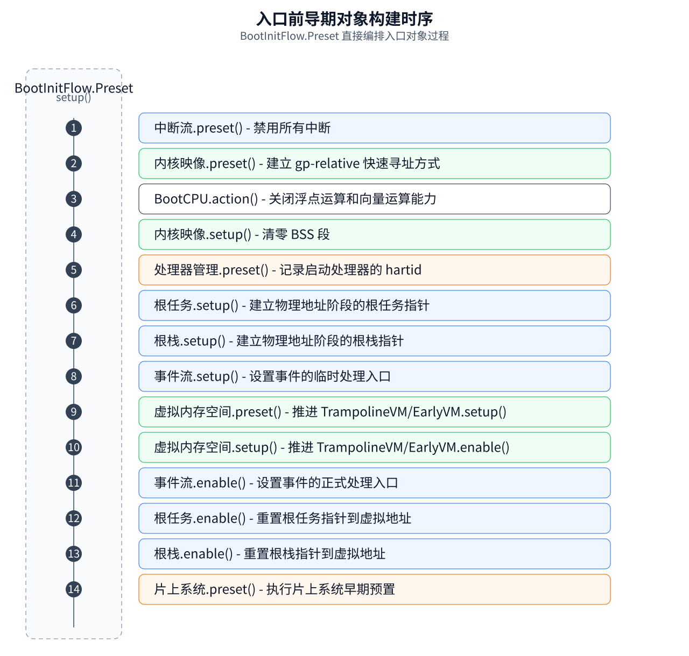
</p>

<p align="center">
  图 9 入口前导期对象构建时序
</p>

从对象角度看，`入口前导期对象` 的 `setup` 并不是单一对象内部字段的简单赋值，而是一个阶段级编排过程。`a0` 与 `a1` 的入口参数识别先保留在对象的初始状态检查中，不作为图 9 中的 `setup` 执行动作。它依次完成以下工作：

1. 建立 `中断流` 的早期受控状态，屏蔽所有中断。
2. 执行 `内核映像.preset()`，用 `global_pointer$` 符号初始化物理地址阶段的 `gp`。
3. 执行 `根流.preset()`，禁止在内核态执行 `FPU` 指令与 `VECTOR` 指令。
4. 执行 `内核映像.setup()`，清零 `BSS` 段，使内核映像进入早期可运行状态。
5. 执行 `处理器管理.preset()`，组织 `BootCPU` 子对象并驱动 `BootCPU.preset()` 记录启动 CPU 的物理 `hartid` 来源。
6. 执行 `根任务.setup()` 与 `根栈.setup()`，建立物理地址阶段的根任务指针与根栈指针。
7. 执行 `事件流.setup()`，设置事件的临时处理入口，使 `VM` 建立过程中误入的中断或异常能够进入受控停机路径。
8. 执行 `虚拟内存空间.preset()`，依次推进 `TrampolineVM.setup()` 与 `EarlyVM.setup()`，初始化 `静态对象集合.trampoline_pg_dir` 与 `静态对象集合.early_pg_dir`，为入口前导期的两次页表切换准备条件。
9. 执行 `虚拟内存空间.setup()`，依次推进 `TrampolineVM.enable()` 与 `EarlyVM.enable()`：先基于 `静态对象集合.trampoline_pg_dir` 完成从物理地址空间到虚拟地址空间的切换，再借助 `静态对象集合.early_pg_dir` 完成第二次页表切换，扩大虚拟内存空间的管理范围；其中，`内核映像.enable()` 作为 `VM.setup()` 的内部调用，用于在虚拟内存空间重置 `gp-relative` 寻址方式。
10. `VM.setup()` 完成后，执行 `事件流.enable()`，设置事件的正式处理入口，使 `RISCV64.stvec` 指向 `formal_event_entry`。
11. 在 `VM.setup()` 完成后，执行 `根任务.enable()` 与 `根栈.setup()`，分别将 `tp` 与 `sp` 重置为虚拟地址。
12. 执行 `片上系统.preset()`，完成片上系统平台相关的早期预置；`入口前导期对象.enable()` 暂时为空，`入口前导期对象.cleanup()` 留到下一个子阶段 `入口后继期对象.setup()` 中执行。

当前时序图主要表达对象过程的编排顺序，不表达逐项源码对应关系。失败时进入 `FAIL` 状态的错误传播方式，以及每一步更细的依赖检查，后续继续补充。

按这一写法，当前子阶段的重点不再是把对象内部字段一次性枚举完，而是先明确本阶段到底要建立哪些对象。

后续如果继续展开 `discover`、`setup`、`enable` 的具体动作，也应在对象集合与检查边界明确后，再去细化中间过程，而不是反过来先从零散字段出发。

##### 入口前导期正式建模规格说明

本小节用于说明入口前导期形式化对象模型的定位、用途和维护方式。具体可被验证器解析、建模和验证的模型条目，已经抽取到 `spec/model` 目录；正式入口是 [`../model/main.spec`](../model/main.spec)。

`spec/model/main.spec` 是当前模型推导验证的规范输入源，覆盖以下内容：

- 状态中心对象模型记法所需的函数、谓词和基础类型声明
- `addr_of`、`phys_addr`、`virt_addr` 及虚拟地址区域相关约束
- 准备期输入对象模型
- `BootPhase` 阶段树，以及已经展开的 `EntryPreludePhase`、`EntrySuccessorPhase`、`CorePreparePhase` 和 `MmCoreInitPhase` 子阶段对象模型
- 当前尚未展开但需要保留边界的 `deferred` 条目

正文中的阶段对象、对象分类、对象关系和构建时序仍作为分析性说明保留，用于解释模型意图和设计背景；验证器工具应以独立模型文件中的条目为准。模型文件中的 `/* ... */` 与 `//` 注释只面向人工阅读，工具解析时应忽略；`deferred` 是模型内的延期定义或占位标记，工具应能够识别并报告。

后续修订时，若某一对象、状态、事件、谓词或类型已经进入形式化模型，应优先修改独立模型文件；正文只在需要同步解释、图示或设计背景时更新。

#### 子阶段 2：入口后继期（Entry Successor Subphase）

第二个子阶段，从 `start_kernel()` 入口开始，到 `setup_arch()` 中 `paging_init()` 完成后结束。它承接入口前导期已经建立的早期执行条件，并在仍然保持系统独占的上下文中，完成完整内核虚拟内存地址空间的建立和切换。

从 Linux 代码边界看，本子阶段的起点是 `init/main.c` 中进入 `start_kernel()`；核心过程发生在 `arch/riscv/kernel/setup.c` 的 `setup_arch()` 内；结束边界是 `arch/riscv/mm/init.c` 的 `paging_init()` 返回。`paging_init()` 内部调用 `setup_vm_final()`，后者建立 `swapper_pg_dir` 中的 fixmap、线性映射和内核映像映射，并将 `RISCV64.satp` 切换到 `swapper_pg_dir` 对应的完整内核页表。

因此，本子阶段的核心目标可以表述为：推进 `SwapperVM` 从 `Base` 经 `Ready` 到 `Online`，并使 `VM` 从入口前导期结束时的早期虚拟地址空间状态推进到完整内核虚拟地址空间状态。该边界中的“完整”只表示内核启动后续阶段所需的完整内核地址空间已经建立并成为当前地址空间；它不表示所有内存管理机制都已经完成，例如 page allocator、NUMA、vmalloc、用户地址空间和后续运行期内存管理仍属于更晚阶段。

本子阶段仍处于 `引导期` 的 `System Exclusive` 上下文中。此时还没有打开中断，也没有启动其它任务或其它 hart 进入内核并发执行路径。因此，本子阶段的对象建立过程仍可按单根流独占推进来理解。

当前先识别出本子阶段的核心对象和边界，不展开完整状态机：

1. `入口后继期对象`：属于阶段对象，是 `引导期` 的第二个子阶段对象。它从 `start_kernel()` 起点边界接续 `入口前导期对象`，负责编排本子阶段内的早期 C 初始化和完整虚拟地址空间建立，并在 `SwapperVM` 进入 `Online` 后形成阶段完成边界。
2. `虚拟内存空间`（`VM`）：在入口前导期已经进入早期虚拟地址空间状态。本子阶段触发 `VM.enable()`，推进完整内核虚拟内存空间建立。
3. `交换虚拟内存空间`（`SwapperVM`）：`VM` 的页表子对象，维护并使用 `静态对象集合.swapper_pg_dir`。本子阶段中，`SwapperVM.setup()` 负责建立完整内核页表，`SwapperVM.enable()` 负责切换 `RISCV64.satp` 到该页表，使其成为当前地址空间。`SwapperVM.setup()` 可以使用临时页表构建 fixmap slots，例如 `FIX_PTE`、`FIX_PMD`、`FIX_PUD`、`FIX_P4D`；它们是内部构建设施，不作为本阶段目标对象展开，但在 `SwapperVM.setup()` 完成后应被清理。
4. `内存块管理`（`MemBlock`，暂定名）：用于描述早期物理内存分配管理对象。它管理的是物理内存区段与保留区段；即使 Linux 后续通过直接线性映射访问其元数据，`MemBlock` 的抽象对象仍应归属于物理内存管理。`MemBlock.preset()` 由 `EarlyDtb.setup()` 触发，用于基于 `EarlyDtb.preset()` 已发布的 `PhysicalMemory` 收集候选可用物理内存区段和初步边界；`MemBlock.setup()` 对应 `setup_bootmem()`，在候选集合基础上施加内核自身占用、FDT 保留区、RawDtb、InitRD、memory limit、对齐和可映射范围等约束，形成可安全用于早期分配的物理内存管理状态；`MemBlock.enable()` 对应 `memblock_allow_resize()`，在完整线性映射可用后允许 `MemBlock` 元数据扩展。固件占用内存不作为 OpenSBI 等具体固件的特例硬编码，而应通过 FDT header `/memreserve/` 与 `/reserved-memory` 节点形成 FDT reserved ranges 后统一排除。它是后续物理页分配器和更完整内存管理对象的前置对象。
5. `早期设备树对象`（`EarlyDtb`）：入口前导期已按规格前置证明验证并映射原始 `RawDtb`；入口后继期短暂建立 `EarlyDtb`。它通过 `preset` 和 `setup` 分担职责：`EarlyDtb.preset()` 先从原始 `dtb` 中提取最小平台事实，解析 `/cpus` 建立 `PlatformCpuInfo` 并检查启动 hartid 合法，解析 `/memory` 建立 `PhysicalMemory`；`EarlyDtb.setup()` 再完成本子阶段对 DTB 的后续使用，提取 kernel command line，解析 FDT header `/memreserve/` 与 `/reserved-memory` 得到固件和平台保留内存范围，并触发 `MemBlock.preset()` 建立候选物理内存区段。Linux 实现中的 FDT header 校验和扫描主要发生在这一后继期路径中；本规格把 `RawDtb` 有效性提前收口，是为了让 `EarlyVm` 的映射前提可证明。本子阶段末尾 `EarlyDtb` 退出服务。后续正式 OF/DeviceTree 对象若建立，应视为基于原始 `dtb` 或早期解析结果重新建立的运行期对象，不是 `EarlyDtb` 的简单延续。
6. `命令行管理对象`（`CommandLine`）：代表启动命令行的文本视图管理对象。入口后继期的 `CommandLine.preset()` 建立 raw view，即 `KernelCmdline`，它来自 `EarlyDtb` 解析结果，只保存启动参数文本和必要边界事实，不负责解释每个参数的语义。完成 `parse_dtb()` 后，`CommandLine.state == Prepared`，`KernelCmdline.state == Ready`，供后续参数解析对象使用。`SavedCommandLine` 与 `StaticCommandLine` 是同一 `CommandLine` 对象在核心准备期建立的 saved/static 子视图，不作为新的顶级命令行管理对象。
7. `参数解析管理对象`（`Params` / `EarlyParam` / `BootParam` / `PayloadParam`）：`Params` 是参数解析类对象的顶层管理者，不属于 `CommandLine`，也不合并命令行文本视图管理。入口后继期由 `Params.preset()` 驱动 `EarlyParam.setup()`，完成第一次 `parse_early_param()`；核心准备期由 `Params.setup()` 驱动 `BootParam.setup()` 和 `PayloadParam.setup()`，实现必须在二者之间保留 `print_unknown_bootoptions()` checkpoint。`EarlyParam.setup()` 依赖 `CommandLine` 的 raw view 和静态 `early_param` handler 表；当前规格要求 `earlycon` handler 必须存在，并在处理 `earlycon=sbi` 时连续驱动 `EarlyCon.preset(config=sbi)`、`EarlyCon.setup()` 和 `EarlyCon.enable()`。这意味着 `EarlyParam` 负责识别并分发参数处理过程，而 `EarlyCon` 仍负责自身后端建立与启用，只是这些对象推进发生在同一个参数处理调用链内部。
8. `启动根栈`（`BootInitStack`）：入口前导期结束时已经进入 `Ready`，即 `sp` 已经切换到早期虚拟地址。入口后继期继续执行 `BootInitStack.enable()`，建立根栈边界和溢出保护事实，使 `BootInitStack` 进入 `Online`。这里的 `guard/保护` 只是 `enable` 的文档别名，不是单独事件名；入口前导期的地址切换事件已经统一为 `setup`。
9. `根任务地址空间`（`InitMM`）：`BootInitTask` 的子对象，代表 Linux `init_mm` 对应的根任务地址空间元数据。Linux 中 `init_task.mm == NULL`，但 `init_task.active_mm == &init_mm`；`init_mm.pgd` 静态指向 `swapper_pg_dir`，而 `setup_initial_init_mm(_stext, _etext, _edata, _end)` 会填入内核代码段、数据段与 `brk` 边界。因此，`InitMM` 不是另一个与 `VM`/`SwapperVM` 竞争的页表对象，而是 `BootInitTask` 关联的 `mm_struct` 抽象，用于把启动根任务与后续完整内核地址空间元数据连接起来。
10. `早期临时映射服务`（`EarlyIoremap`）：代表 `early_ioremap()` / `early_iounmap()` 使用的早期临时映射机制。它依赖 `FixMap` 已经提供 `FIX_BTMAP` 临时映射区，但不是 `FixMap` 的子对象；`FixMap` 是固定虚拟地址槽位布局，`EarlyIoremap` 则是使用这些槽位的服务对象。`EarlyIoremap.setup()` 对应 Linux `early_ioremap_setup()`，负责初始化各个 boot-time mapping slot 的虚拟起点并确认 `prev_map[]` 为空；后续 `early_ioremap()` 与 `early_iounmap()` 应建模为可重复执行的 `map/unmap` action，而不是生命周期事件。
11. `SBI能力视图`（`SBI`）：代表内核基于固件 SBI 接口建立的平台服务能力视图。`SBI.setup()` 对应 Linux `sbi_init()`，只负责探测并记录能力事实，例如 `spec_version`、固件实现标识、以及 `TIME`、`IPI`、`RFENCE`、`SRST`、`DBCN` 等扩展是否可用；它不把 `set_timer`、`send_ipi`、`rfence`、`debug_console_write` 等具体调用建模为自身生命周期事件。后续对象通过依赖这些能力事实来完成自己的建立，例如 `EarlyCon.setup()` 依赖 `SBI.dbcn_available` 或 legacy console 能力来选择输出后端。
12. `静态分支对象`（`StaticBranch`）：对应 RISC-V `setup_arch()` 早段中的第一次有效 `jump_label_init()`。它代表 static key / static branch 的全局基础设施，不直接照搬 Linux `jump_label` 命名。`StaticBranch.setup()` 建立静态分支表、排序分支项，并建立 static key 到分支点的关联，使对象进入 `Ready`。这里使用 `setup()` 而不是 `preset()`，因为该过程不是简单预置初值，而是实际建立后续 `static_branch_enable/disable` action 所需的查询和更新基础。`StaticBranch.set(key, value)` 是后续对象可调用的 action，用于启用或禁用某个已知 static key，不推进 `StaticBranch.state`。通用 `start_kernel()` 中的第二次 `jump_label_init()` 作为 `StaticBranch.setup()` 幂等 checkpoint，不推进状态。后续 `jump_label_init_ro()` 对应 `StaticBranch.enable()`，在内核只读保护建立前 seal `ro_after_init` static keys，使 `StaticBranch.state` 从 `Ready` 推进到 `Online`。当前 `default_config` 中 `CONFIG_JUMP_LABEL=y` 且 `CONFIG_STRICT_KERNEL_RWX=y`，因此本规格只讨论 jump label 启用和只读 seal 路径；禁用配置不进入当前边界。

    编码阶段对 `StaticBranch` 的最低要求是：提供显式 static key registry，能按 key 名或稳定 ID 查询并更新 key 值；`StaticBranch.set(key, value)` 必须要求 `StaticBranch.state == Ready` 或 `Online`，并在重复设置同一值时保持幂等；早期实现可以先用布尔值或计数值承载 key 状态，不要求立即实现指令 patch，但接口边界要保留后续替换为架构 jump-label patch 的空间。`StaticBranch.enable()` 至少要记录 sealed keys 集合，并在启用后禁止修改已 sealed 的 `ro_after_init` key。当前配置固定 `CONFIG_JUMP_LABEL=y`，因此编码规格不要求实现 `CONFIG_JUMP_LABEL=n` 的退化路径。
13. `打印缓冲区`（`PrintkBuffer`）：代表 printk 的中间日志缓冲机制。参考 Linux 在 `setup_arch()` 前打印 banner 的时机，`arceos_ex` 也应在早期输出路径中写入自身启动 banner；该输出首先进入 printk 的静态 ring buffer，而不是立即写到后端设备。启动 banner 不应依赖面向 Unikernel 应用的 `axstd::println!`，而应通过内核启动期内部的 `printk`/`println-like` 前端，或直接通过 `PrintkBuffer.write()` action 写入。因此本子阶段应把 `PrintkBuffer.preset()` 放在 `EarlyCon.setup()` 之前，并把启动 banner 输出建模为状态内 `action`。
14. `早期控制台`（`EarlyCon`）：代表正式 console 建立前的临时输出后端。对于当前 RISC-V64 路径，`EarlyCon.preset/setup/enable` 由 `EarlyParam.setup()` 处理 `earlycon=sbi` 时连续触发；其中 `setup` 基于 SBI DBCN 或 SBI v0.1 console 能力事实建立 SBI 输出后端，`enable` 注册并启用早期控制台，同时把 `PrintkBuffer` 中已经存在的历史输出 replay/flush 到后端。`EarlyCon.handoff/cleanup` 应留给后续正式 `Console` 注册阶段，不属于本子阶段到 `paging_init()` 完成前的核心边界。
15. `处理器管理`（`CPUGroup`）：当前形式化模型中，`CPUGroup` 下已经显式拆出 `BootCPU` 与 `CpuIdMap` 两个子对象。`BootCPU` 的类别是通用 `CPU`，以便将来 secondary CPU 对象复用同一类别；`BootCPU.preset()` 在入口前导期生效，并记录启动 CPU 的物理 `hartid` 来自 `BootArgs.boot_hartid`。这样 `CPUGroup` 本身不再长期保存 `boot_cpu_hartid`。入口后继期先由 `EarlyDtb.preset()` 建立 `PlatformCpuInfo`，再由 `CpuIdMap.preset()` 建立 `logical CPU 0 -> BootCPU` 的基础映射，使 `CpuIdMap` 进入 `Prepared`，并由 `BootCPU.setup/enable` 完成启动 CPU 的 active/online 语义推进；核心准备期中 `CpuGroup.setup()` 建立 CPU 拓扑事实和 secondary CPU 候选集合，随后 `CpuIdMap.setup()` 确认当前阶段可用的 logical CPU 映射边界并进入 `Ready`。`CpuIdMap.enable()` 保留给未来多 CPU 运行期或动态拓扑正式启用时使用。

对 `BootCPU` 而言，Linux `boot_cpu_init()` 会把启动 CPU 同时标记到 `possible`、`present`、`active` 与 `online` 四类 CPU 位图中。规格层不必照搬四个位图实现，但应保留这些语义层次：入口前导期 `BootCPU.preset()` 只记录启动 CPU 的物理 `hartid`；入口后继期 `EarlyDtb.preset()` 建立并发布 `PlatformCpuInfo`，确认该 hartid 属于平台有效集合；随后 `BootCPU.setup()` 对应 present/active 边界，`BootCPU.enable()` 对应 online 边界。

<p align="center">
  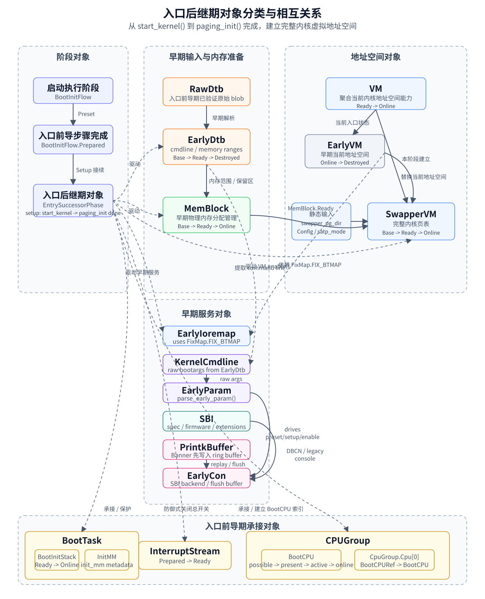
</p>

<p align="center">
  图 10 入口后继期对象分类与相互关系
</p>

图 10 用于说明入口后继期涉及对象的分类与相互关系。`入口后继期对象` 作为阶段对象接续 `入口前导期对象`，并在 `start_kernel()` 之后编排本子阶段核心对象推进。`EarlyDtb` 基于入口前导期已经验证过的 `RawDtb` 先建立基础平台事实：`PlatformCpuInfo` 与 `PhysicalMemory`；随后它建立早期解析结果，驱动 `CommandLine.preset()` 产出 raw view `KernelCmdline`，同时触发 `MemBlock.preset()` 收集候选可用物理内存区段。`MemBlock.setup()` 再施加保留、裁剪和对齐等约束，形成可安全用于早期分配的物理内存管理状态。`Params.preset()` 再驱动 `EarlyParam` 基于 `CommandLine` 的 raw view 和静态 `early_param` handler 表解析早期参数，当前首先要求识别 `earlycon=sbi`，并在参数处理调用链内部连续驱动 `EarlyCon.preset/setup/enable`。`SwapperVM` 基于 `MemBlock` 和静态页表存储建立完整内核页表，并替换 `EarlyVM` 成为当前地址空间。`EarlyIoremap` 依赖 `FixMap.FIX_BTMAP` 临时映射区，提供 `early_ioremap()` / `early_iounmap()` 这类早期临时映射服务，但它不是 `FixMap` 的子对象。`SBI` 记录固件平台服务能力事实，供后续对象依赖；例如 `EarlyCon.setup()` 只负责使用 `SBI.dbcn_available` 或 legacy console 能力选择输出后端，而不重新探测这些能力。`PrintkBuffer` 与 `EarlyCon` 共同描述早期输出路径：启动期内部 `printk`/`println-like` 前端和应用侧 `axstd::println!` 是不同入口，但二者都应首先通过 `PrintkBuffer.write(...)` action 写入统一缓冲区，随后由 `EarlyCon` 或正式 `Console` drain/replay；后续正式 `Console` 建立时，`EarlyCon` 再退出或移交输出后端，而 `PrintkBuffer` 继续作为日志缓冲对象存在。`BootInitTask`、`InterruptStream` 与 `CPUGroup` 作为入口前导期承接对象出现在本图中：`BootInitTask` 下显式列出 `BootInitStack` 与 `InitMM` 两个子对象，分别继续建立根栈保护状态和初始化根任务地址空间元数据；`InterruptStream` 继续防御式关闭中断总开关；`CPUGroup` 下显式列出 `BootCPU` 与 `CpuIdMap` 两个子对象，分别跟踪启动 CPU 本体状态和逻辑 ID 到 CPU 对象的映射。

`CPUGroup` 的形式化迁移边界已经落地：入口前导期由 `BootCPU` 承载启动 CPU 身份，入口后继期由 `CpuIdMap.preset()` 建立 `logical CPU 0 -> BootCPU` 的基础映射并进入 `Prepared`。核心准备期再由 `CpuGroup.setup()` 建立 CPU 拓扑事实，由 `CpuIdMap.setup()` 使当前阶段的逻辑 ID 映射边界进入 `Ready`。这样可以避免 `BootArgs.boot_hartid` 在后续阶段被长期依赖，也避免 `CPUGroup` 同时承担 CPU 对象身份和逻辑映射表两类职责。

形式化模型已经按阶段目录组织：正式入口为 `spec/model/main.spec`，它通过 include 串接 `StartupTimeline`、`BootPhase`、`EntryPreludePhase`、`EntrySuccessorPhase`、`CorePreparePhase` 与 `MmCoreInitPhase` 等分层规格。子阶段 4 的正式模型位于 `spec/model/boot/mm-core-init/`。

本子阶段的结束状态应至少包含：

- `SwapperVM.state == Online`，且用于构建页表的临时 fixmap slots 已经清理
- `VM.state == Online`
- `BootInitStack.state == Online`，表示根栈保护状态已经建立
- `InterruptStream.state == Ready`，表示中断子开关和总开关都已经封闭
- `BootCPU.state == Online`，表示启动 CPU 已记录物理 `hartid`，并基于 `PlatformCpuInfo` 完成 present/active/online 的语义推进
- `CpuIdMap.state == Prepared`，表示已建立 `logical CPU 0 -> BootCPU.hartid` 的基础映射，完整核心准备期 CPU 映射边界留待 `CpuIdMap.setup()`
- `MemBlock.state == Online`，表示候选物理内存区段已经经过保留、裁剪和对齐等约束处理，且完整线性映射可用后已经允许 `MemBlock` 元数据扩展
- `InitMM.state == Ready`，表示 `init_mm` 已记录内核代码段、数据段和 `brk` 边界，并与 `BootInitTask.active_mm` 关系一致
- `EarlyIoremap.state == Ready`，表示 `FIX_BTMAP` 临时映射槽位的服务端元数据已经初始化，后续可执行 `map/unmap` action
- `SBI.state == Ready`，表示 SBI 规范版本、固件标识和扩展能力视图已经建立，至少可供 `EarlyCon` 判断 DBCN 或 legacy console 能力
- `StaticBranch.state == Ready`，表示静态分支表和 static key 到分支点的关系已经建立，后续对象可以执行 `StaticBranch.set(key, value)` action
- `CommandLine.state == Prepared` 且 `KernelCmdline.state == Ready`，表示从早期 DTB 中提取出的 raw kernel command line 已经可供解析
- `Params.state == Prepared` 且 `EarlyParam.state == Ready`，表示早期参数解析与分发已经完成，至少已经处理 `earlycon=sbi` 并驱动 `EarlyCon` 完成 `preset/setup/enable`
- `PrintkBuffer.state == Prepared`，表示 printk 静态缓冲机制已经可接收早期日志写入；`arceos_ex` 启动 banner 等输出通过启动期内部输出前端或直接通过 `PrintkBuffer.write(...)` action 写入缓冲区，不作为 `PrintkBuffer.preset()` 的生命周期后置状态
- `EarlyCon.state == Online`，表示基于 SBI 的 early console 后端已经启用，并可输出 `PrintkBuffer` 中的历史记录
- `RISCV64.satp` 指向 `静态对象集合.swapper_pg_dir` 对应的完整内核页表
- 早期虚拟地址空间 `EarlyVM` 不再作为当前执行地址空间使用
- 后续 `setup_arch()` 中 `paging_init()` 之后的初始化过程可以在完整内核虚拟地址空间下继续推进

当前入口后继期的最小形式化对象模型已经围绕 `BootInitStack`、`InitMM`、`InterruptStream`、`BootCPU`、`CpuIdMap`、`EarlyIoremap`、`SBI`、`CommandLine` raw view、`EarlyParam`、`PrintkBuffer`、`EarlyCon`、`MemBlock`、`EarlyDtb`、`SwapperVM` 和 `VM.enable()` 落地。`jump_label_init()` 在 RISC-V `setup_arch()` 的早段抽象为 `StaticBranch.setup()`；`efi_init()` 暂仍作为当前最小核心路径之外的 deferred 对象。

##### 入口后继期对象构建时序

本小节用于补充 `入口后继期对象` 如何编排本子阶段中各个核心对象的建立顺序。当前先只表达最小核心路径，不逐项覆盖 `setup_arch()` 内的全部调用，也不逐行对应 Linux 源码。

<p align="center">
  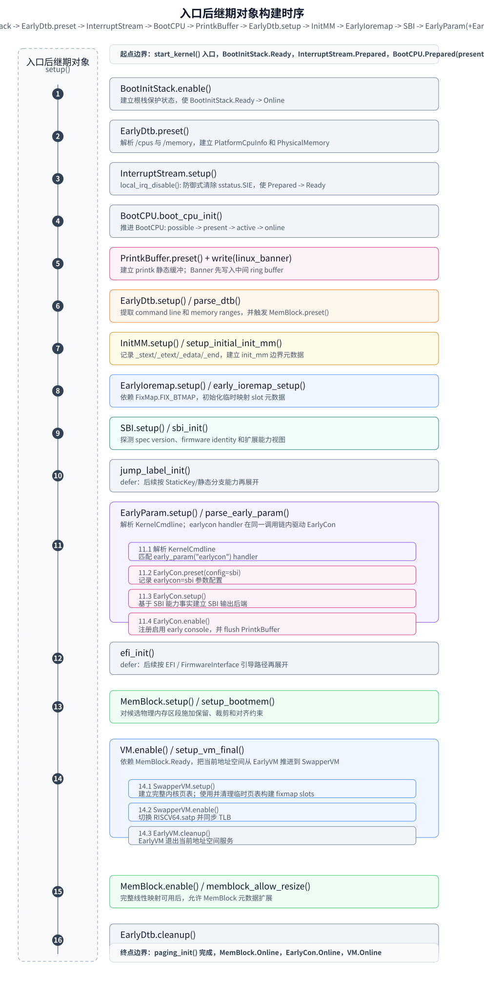
</p>

<p align="center">
  图 11 入口后继期对象构建时序
</p>

图 11 将入口后继期对象的 `setup` 过程表示为阶段对象对核心对象过程的编排顺序：

1. 执行 `BootInitStack.enable()`，在入口前导期已经可用的根栈基础上建立栈溢出保护状态，使 `BootInitStack` 从 `Ready` 推进到 `Online`。
2. 执行 `EarlyDtb.preset()`，从 `RawDtb` 中提取基础平台事实：解析 `/cpus` 建立并发布 `PlatformCpuInfo`，确认启动 hartid 合法；解析 `/memory` 建立并发布 `PhysicalMemory`。
3. 执行 `CpuIdMap.preset()`，建立 `logical CPU 0 -> BootCPU` 的基础映射，使 `CpuIdMap` 进入 `Prepared`。该步骤对应 Linux 中 `smp_setup_processor_id()` 对启动处理器逻辑 ID 的早期确认；CPU 对象自己维护 hartid 和 possible/present/online 等状态事实。
4. 执行 `InterruptStream.setup()`，对应 Linux 中 `local_irq_disable()` 的防御式关中断动作，清除 `sstatus.SIE`，使 `InterruptStream` 从 `Prepared` 推进到 `Ready`。
5. 执行 `BootCPU.boot_cpu_init()`（规格中对应入口后继期的 `BootCPU.setup/enable`），基于 `PlatformCpuInfo` 已确认的启动 hartid，使 `BootCPU` 完成 present/active/online 的语义推进。
6. 执行 `PrintkBuffer.preset()`，建立 printk 静态缓冲机制；随后 `arceos_ex` 启动 banner 可通过启动期内部输出前端或直接通过 `PrintkBuffer.write()` 写入统一 ring buffer。该写入是 `action`，不推进 `PrintkBuffer` 的生命周期状态，也不依赖应用侧 `axstd::println!`。
7. 执行 `EarlyDtb.setup() / parse_dtb()` 的后续解析用途，提取 kernel command line，解析 FDT header `/memreserve/` 与 `/reserved-memory` 形成 FDT reserved ranges，并触发 `MemBlock.preset()` 和 `CommandLine.preset()`，使 raw view `KernelCmdline` 进入 `Ready`，并形成候选可用物理内存区段和初步边界。
8. 执行 `InitMM.setup() / setup_initial_init_mm()`，初始化 `BootInitTask` 的 `InitMM` 子对象，记录 `_stext`、`_etext`、`_edata` 与 `_end` 对应的代码段、数据段和 `brk` 边界；`InitMM.pgd` 仍指向 `swapper_pg_dir`，后续由 `VM.enable()` 使其对应的完整内核页表成为当前地址空间。
9. 执行 `EarlyIoremap.setup() / early_ioremap_setup()`，基于 `FixMap.FIX_BTMAP` 初始化早期临时映射服务的 slot 元数据；后续 `early_ioremap()` 与 `early_iounmap()` 是 `map/unmap` action。
10. 执行 `SBI.setup() / sbi_init()`，探测并记录 SBI 规范版本、固件标识和扩展能力视图。该步骤只产出能力事实，不把具体 SBI 调用建模为 `SBI` 自身的生命周期事件。
11. 执行 RISC-V `setup_arch()` 早段中的 `jump_label_init()`，抽象为 `StaticBranch.setup()`，使 `StaticBranch` 进入 `Ready`。该调用发生在 `parse_early_param()` 之前，使早期参数处理路径可以安全使用 static key。通用 `start_kernel()` 在 `setup_arch()` 返回后还会再次调用 `jump_label_init()`；在当前 RISC-V 路径中第二次调用因 `StaticBranch` 已经 `Ready` 而作为幂等 checkpoint 处理，不再推进对象状态。
12. 执行 `Params.preset() / parse_early_param()`，驱动 `EarlyParam.setup()` 解析 `CommandLine` 的 raw view 并分发早期参数。当前要求 `earlycon` handler 必须存在；处理 `earlycon=sbi` 时，该调用链内部连续触发 `EarlyCon.preset(config=sbi)`、`EarlyCon.setup()` 和 `EarlyCon.enable()`：`preset` 记录参数配置，`setup` 基于 `SBI` 能力事实建立 SBI early console 后端，`enable` 注册并启用后端，同时 drain/replay `PrintkBuffer` 中已经存在的 Banner 等历史输出。
13. 执行 `efi_init()`，当前暂不建模为正式对象，只作为 `defer` 占位记录。对当前 RISC-V64 最小核心路径而言，`efi_init()` 主要涉及 EFI 引导路径与相关运行时信息的早期探测，不直接改变 `SwapperVM` 建立和切换的核心语义；后续若需要支持 EFI 启动路径，再单独抽象为 `EFI` 或 `FirmwareInterface` 一类对象。
14. 执行 `MemBlock.setup()`，对应 `setup_bootmem()`。它在 `MemBlock.preset()` 收集到的候选物理内存区段基础上，排除内核自身、FDT header `/memreserve/`、`/reserved-memory`、RawDtb、InitRD 等不可分配范围，并应用 memory limit、对齐和可映射范围等控制约束，形成可安全用于早期分配的物理内存管理状态。
15. 执行 `VM.enable()`，对应 Linux `setup_vm_final()` 的抽象实施流程。内部依次推进 `SwapperVM.setup()`、`SwapperVM.enable()` 和 `EarlyVM.cleanup()`：`SwapperVM.setup()` 依赖 `MemBlock.Ready` 建立完整内核页表，并使用和清理临时页表构建 fixmap slots；`SwapperVM.enable()` 使完整内核页表成为当前地址空间；`EarlyVM.cleanup()` 使 `EarlyVM` 退出当前地址空间服务。
16. 执行 `MemBlock.enable() / memblock_allow_resize()`，在完整线性映射可用后允许 `MemBlock` 元数据扩展，使 `MemBlock` 从 `Ready` 推进到 `Online`。
17. 执行 `EarlyDtb.cleanup()`，使早期 DTB 解析对象退出服务。这里的 `Destroyed` 不表示 `RawDtb` 物理内容消失，而表示早期解析对象的阶段性使命完成；后续正式 OF/DeviceTree 对象应视为重新建立的运行期对象。

当前入口后继期的最小形式化对象模型已经落地；它的完成边界就是核心准备期的起点。后续围绕 `paging_init()` 之后到 `trap_init()` 之前的讨论，应先落入下面的核心准备期规格，再视稳定程度同步到形式化模型和对象级实现。

#### 子阶段 3：核心准备期（Core Prepare Subphase）

第三个子阶段覆盖从 `paging_init()` 完成到 `trap_init()` 完成的阶段。它承接入口后继期已经建立的完整内核虚拟地址空间，并在仍然保持 `System Exclusive` 的上下文中，继续完成体系结构、平台描述、运行期基础设施和正式异常分发框架的准备。

从 Linux/RISC-V 代码边界看，本阶段横跨两段实现路径：第一段是 `arch/riscv/kernel/setup.c` 中 `setup_arch()` 在 `paging_init()` 返回后的后半段；第二段是 `init/main.c` 中 `setup_arch()` 返回后到 `trap_init()` 完成之间的通用初始化。规格阶段边界不必完全等同于 Linux 函数边界，因此二者可以合并到同一个核心准备期中讨论。

本子阶段仍处于 `引导期` 的 `System Exclusive` 上下文中。此时完整内核页表已经启用，但中断仍未打开，普通任务调度尚未启动，其它 hart 也尚未进入并发执行路径。因此，本阶段中的对象建立过程仍可按单根流独占推进来理解。

当前已经按逐项讨论把本子阶段拆成四类处理：进入 formal model 的对象、保留位置但延后的 deferred 路径、只约束实现阶段的 checkpoint、以及当前规格范围明确不支持的路径。formal model 先描述足以指导实现和验证的抽象语义，不绑定 Linux 的具体结构体布局。

这四类条目的处理原则如下：

- `formal`：已经进入对象模型，需要明确对象状态、生命周期事件、依赖、后置条件和阶段结束状态。
- `deferred`：属于参考启动路径或相关条件路径，但当前不展开对象语义；必须保留调用位置和延期原因，避免被误解为已覆盖。
- `implementation checkpoint`：不推进规格状态，只要求对象级实现保留可观测检查点或顺序约束。
- `不纳入当前规格`：当前目标边界明确排除的路径，不作为 deferred 统计；若未来目标边界改变，应重新讨论并转入 formal 或 deferred。

1. `核心准备期对象`（`CorePreparePhase`）：属于阶段对象，是 `引导期` 的第三个子阶段对象。它从 `paging_init()` 完成边界接续入口后继期，负责编排本阶段内的体系结构和运行期基础准备，并以 `trap_init()` 完成作为阶段边界。
2. `正式设备树对象`（`DeviceTree`）：对应 `unflatten_device_tree()` 或 `unflatten_and_copy_device_tree()`。它不同于早期 `EarlyDtb`：`EarlyDtb` 服务启动早期事实提取，正式 `DeviceTree` 建立运行期 OF/DeviceTree 结构。`DeviceTree` 代表设备树在内存中展开后的形式，是由 `DeviceNode` 组成的树。展开树所需存储应来自 `MemBlock` 早期分配，而不是普通 heap 或固定静态数组；这表示 `DeviceTree.setup()` 对 `MemBlock.Online` 的依赖具有分配语义。参考 Linux 的实现路径，具体编码时应通过两次遍历完成：先遍历 `RawDtb` 校验并计算展开存储规模，再由 `MemBlock` 分配存储，随后第二次遍历填充节点和属性关系。`DeviceTree` 拥有唯一 root；`DeviceNode` 代表树中的节点，包含自身 `name`、`properties`、可选 `parent` 引用和 `children` 集合。root 没有 parent；非 root 节点有且仅有一个 parent；`child in parent.children` 与 `child.parent == parent` 必须一致；从 root 必须可达所有节点且树无环。每个节点内部 property name 必须唯一，节点可通过 path 或 parent/name 关系查询，property 原始值可查询。这里的 `parent`、`children` 和 `properties` 是逻辑关系，不要求实现暴露 C 结构体中的 sibling/child 指针，也不限制实现必须使用指针、数组下标或其它具体内存布局。
3. `分区对象`（`Zones`）：`Zones` 对应 `misc_mem_init()` 中的 `zone_sizes_init()`，按 `Zones -> Zone -> OrderClass -> MigrationType -> FreePageSet` 五层抽象描述 zone、buddy order、迁移类型和空闲页集合边界。当前先固定三类 `ZoneKind`：`DMA32`、`NORMAL` 和 `MOVABLE`，分别代表 32-bit DMA 可寻址区、普通可管理内存区和可迁移内存策略区；三者作为逻辑 zone 总是存在，但允许某类 zone 的物理范围为空。参考 Linux/RISC-V，`DMA32` 边界来自 `CONFIG_ZONE_DMA32` 和 `dma32_phys_limit`，`NORMAL` 覆盖普通 managed memory，`MOVABLE` 先作为策略预留区，后续再由 `movablecore`、memory hotplug 或类似策略切出实际范围。这里必须区分 `ZoneKind::MOVABLE` 和 `MigrationType::MOVABLE`：前者是 zone 层的物理区段类型，后者是每个 zone 下 buddy/pageblock 层的迁移类型。完整页分配器初始化属于后续 `mm_core_init()` 阶段，不在当前核心准备期中以独立对象建模。
4. `资源树`（`ResourceTree`）：对应 `init_resources()`，根据 `MemBlock` 中的 memory/reserved 区段建立系统资源树，并登记 system RAM、reserved resources、kernel image/code/rodata/data/bss 等资源，同时约束子资源必须落在父资源范围内，重叠关系必须合法。
5. `CPU 管理对象`（`CpuGroup` / `CpuIdMap` / `BootCPU` / `SecondaryCPUs`）：`CpuGroup` 是所有 CPU 的抽象管理者；`CpuIdMap` 是逻辑 ID 到 CPU 对象的索引表，其中逻辑 ID 0 总是映射到 `BootCPU`，后续逻辑 ID 映射到 secondary CPU 对象。每个 CPU 对象自己维护 hartid 和 possible/present/online 等状态事实。`SecondaryCPU` 也是 `CPUObject`，`SecondaryCPUs` 直接表示 CPUObject 集合，当前不引入额外的 `CPUSetObject` 中间类型。`CpuGroup.setup()` 对应 `setup_smp()`，只建立拓扑事实和 secondary CPU 候选集合，不启动 secondary CPU，也不开放多 hart 并发；`CpuIdMap.setup()` 在其后确认当前阶段的 logical CPU 映射边界，`CpuIdMap.enable()` 保留给未来运行期正式启用。
6. `RISC-V 缓存块信息`（`CacheBlockInfo`）：对应 Linux 6.12.37 的 `riscv_init_cbo_blocksizes()`，它是独立的平台级事实对象，不是 `CorePreparePhase` 的下级对象。当前模型从正式 `DeviceTree` 的 CPU nodes 收集 `riscv,cbom-block-size` 和 `riscv,cboz-block-size`，结合 `CpuGroup` 限定当前拓扑中的 hart，并收敛为系统级 `CBOM`/`CBOZ` block size 事实。缺失属性表示 unavailable；多个 hart 值不一致只形成诊断事实，不阻止对象进入 `Ready`。`CBOP` 虽然存在 DeviceTree binding，但 Linux 6.12.37 的该初始化点不发布它，暂缓建模。
7. `CPU 能力对象`（`CpuCapabilities`）：对应 `riscv_fill_hwcap()` 的规格抽象，汇总 CPU 集合的 ISA/hwcap 能力事实，供后续 alternatives、DMA/cache policy、上下文管理和用户态 ISA 暴露路径依赖。它是独立事实对象，不是 `CorePreparePhase` 的下级对象；当前从正式 `DeviceTree` 的 CPU nodes 收集 per-hart ISA facts，结合 `CpuGroup` 形成 all-harts common capability facts，并用 `CacheBlockInfo` 校验 Zicbom/Zicboz。FPU/VECTOR 的支持事实属于本对象；入口期禁用 FPU/VECTOR 的执行状态属于 CPU execution context，不由本对象推进。
8. `DMA/cache 策略事实对象`（暂名 `DmaCachePolicy`）：对应 `riscv_noncoherent_supported()` 与 `riscv_set_dma_cache_alignment()`。它消费 `CpuCapabilities.Ready` 与 `CacheBlockInfo.Ready`，收敛当前平台是否支持 non-coherent DMA、是否需要显式 cache maintenance、以及 `dma_cache_alignment` 的最终事实。当前 `default_config` 中 `CONFIG_RISCV_DMA_NONCOHERENT=y` 且 `CONFIG_RISCV_ISA_ZICBOM=y`；若当前 CPU 能力事实显示 Zicbom 可用，则 `riscv_noncoherent_supported()` 记录 non-coherent DMA 支持事实，否则 `riscv_set_dma_cache_alignment()` 会把 `dma_cache_alignment` 降为 1。该对象不是 DMA API 本体，也不分配 DMA bounce buffer；它只为后续 `mem_init()` 中的 SWIOTLB/bounce 决策提供前置事实。
9. `命令行管理对象`（`CommandLine`）：对应启动命令行文本视图管理。`KernelCmdline` 是 raw view，入口后继期由 `CommandLine.preset()` 建立；`SavedCommandLine` 是 saved view，`StaticCommandLine` 是 static/work view，核心准备期由 `CommandLine.setup()` 驱动建立，对应 `setup_command_line()` 中建立命令行副本的部分。`EarlyParam`、`BootParam` 和 `PayloadParam` 属于 `Params` 管理的参数解析类对象，不并入 `CommandLine.setup()`，也不改变它们在 `PerCpuStorage` / `CpuHotplugState` 之后的原有时序。
10. `per-cpu 存储对象`（`PerCpuStorage`）：对应 `setup_per_cpu_areas()`。它是顶层管理对象，聚合 `PerCpuStaticImage`、`PerCpuFirstChunk` 和 `PerCpuOffsetTable`。`PerCpuStaticImage` 来自 `Lds` 中的 `__per_cpu_start`、`__per_cpu_end` 和 `__per_cpu_load`：前二者定义静态 percpu 模板的运行地址范围和大小，`__per_cpu_load` 定义 first chunk 初始化时复制初始内容的加载地址。`PerCpuFirstChunk` 由 `MemBlock` 分配并在线性映射下可访问，每个 possible CPU 对应一个 unit；unit 内部布局为 `static | [reserved] | dynamic | unused tail`。static 区从 `PerCpuStaticImage.load` 复制初始化，reserved 区当前只作为可为零的布局事实保留，后续模块或 reserved percpu allocation 路径再展开；dynamic 区当前表示 first chunk 中的早期动态预留。`PerCpuOffsetTable` 基于 `CpuIdMap.Ready` 建立 logical CPU 到 unit/base offset 的映射，其表项边界和 first chunk unit 个数都基于 `CpuGroup` 中的 possible CPU 集合，而不是 online CPU 集合。当前阶段要求静态 percpu symbol 可以仿照 Linux `per_cpu_ptr()` 风格按 logical CPU 计算对应实例地址；完整动态 percpu allocator 和额外 dynamic chunks 后续再展开。
11. `CPU hotplug 状态对象`（`CpuHotplugState`）：对应 `boot_cpu_hotplug_init()`。它是每个 `CPUObject` 的通用子对象，正式路径写作 `CpuGroup.Cpu[cpu].CpuHotplugState`，适用于 `BootCPU` 和后续 secondary CPU。`CpuHotplugState.state` 只表示对象生命周期，例如 `Prepared`、`Ready` 和后续可能的 `Online`；Linux 的 `CPUHP_*` 枚举属于独立的 hotplug step 域，不与对象生命周期状态混合。当前核心准备期只建立 BootCPU 实例，要求 `BootCPU.CpuHotplugState.state == Ready`，并将 `BootCPU.CpuHotplugState.current_step` 与 `target_step` 初始化为 `CPUHP_ONLINE`，同时记录 booted-once 事实。secondary CPU 的实例创建、step 推进和 hooks 触发留给后续 bringup/teardown 路径建模。
12. `参数解析管理对象`（`Params`）：`Params` 在入口后继期已经由 `preset` 推进到 `Prepared`，表示早期参数解析完成；核心准备期由 `Params.setup()` 驱动 `BootParam.setup()` 和 `PayloadParam.setup()`，并要求实现把 `print_unknown_bootoptions()` checkpoint 保留在二者之间。
13. `普通启动参数对象`（`BootParam`）：对应 `parse_args("Booting kernel", ...)`。它不同于入口后继期的 `EarlyParam`，用于普通 `__param` 解析、未知选项收集以及 `--` 边界记录。
14. `Payload 参数对象`（`PayloadParam`）：对应 `parse_args("Setting init args", after_dashes, ...)`。Linux-like 路径中它对应将来传给第一个用户态 init 的参数；Unikernel 路径中它也可作为 kernel-mode payload 的参数来源。没有 `--` 时允许为空。
15. `随机性对象`（`Randomness`）：本阶段只执行 `Randomness.preset()`，对应 `random_init_early(command_line)`，表示早期架构/非 timekeeping 熵源已经混入；完整 RNG Ready 留给后续 `Randomness.setup()`。
16. `打印缓冲区`（`PrintkBuffer`）：入口后继期已有 `PrintkBuffer.preset()` 建立静态缓冲；本阶段增加 `PrintkBuffer.setup()`，对应 `setup_log_buf()`，表示正式日志缓冲准备完成并保留已有记录，不新建 `LogBuffer` 对象。
17. `异常表`（`ExceptionTable`）：对应 `sort_main_extable()`。`ExceptionTable.setup()` 明确要求主异常表已经排序且查询机制可用，以便指导实现阶段执行排序而不是只记录“已调用”。
18. `异常流`（`ExceptionStream`）及其子异常对象：对应 `trap_init()`，建立正式异常分类、分发和 handler 注册框架。`PageFaultException`、`BreakpointException`、`UnexpectedException` 在本阶段进入 `Ready`；`SyscallException` 保持 `Prepared`，等待后续用户态执行路径。

当前 DSL 还没有稳定的集合类型语法。`SecondaryCPUs`、`Zone/OrderClass/MigrationType/FreePageSet`、`DeviceNode` 这类集合或树关系先用谓词表达；后续需要在工具层补充一组专门的集合/关系类型，再回收这些谓词表达。

<p align="center">
  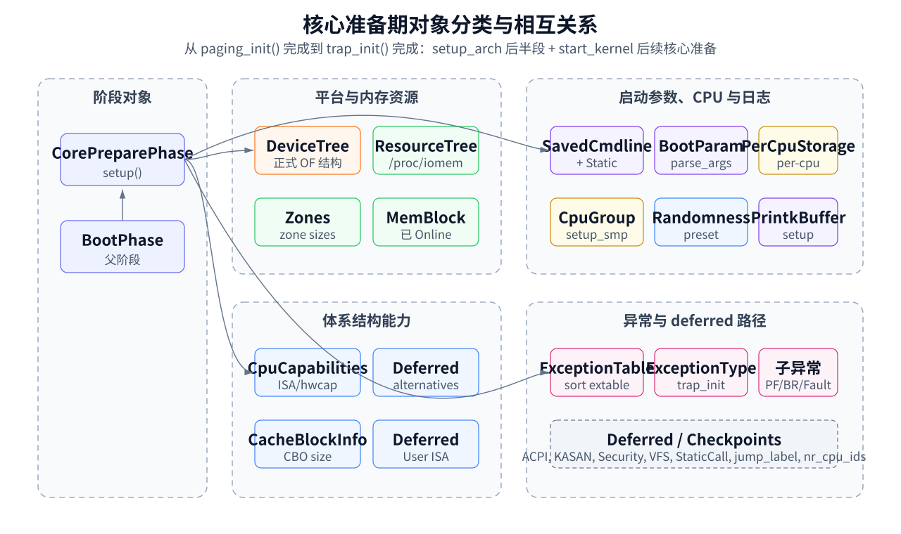
</p>

<p align="center">
  图 12 核心准备期对象分类与相互关系
</p>

图 12 用于说明核心准备期涉及对象的分类与相互关系。`CorePreparePhase` 作为阶段对象承接 `EntrySuccessorPhase`，并在完整内核虚拟地址空间已经启用的前提下，继续推进正式 `DeviceTree`、zone/resource、CPU/per-cpu、命令行与启动参数、随机性、日志、异常表和异常流。图中的 deferred/impl checkpoint 区域表示当前必须保留调用位置和语义约束，但暂不进入 formal object 的路径。

本子阶段的结束状态至少包含：

- `EntrySuccessorPhase.state == Ready`，表示完整内核虚拟地址空间已经启用
- `VM.state == Online`
- `SwapperVM.state == Online`
- `MemBlock.state == Online`
- `DeviceTree.state == Ready`
- `Zones.state == Ready`
- `ResourceTree.state == Ready`
- `CpuGroup.state == Ready`，表示 CPU 拓扑事实和 secondary CPU 候选集合已经建立，但 secondary CPU 尚未 online
- `CacheBlockInfo.state == Ready`
- `CpuCapabilities.state == Ready`
- `DmaCachePolicy.state == Ready`
- `CommandLine.state == Ready`
- `SavedCommandLine.state == Ready`
- `StaticCommandLine.state == Ready`
- `PerCpuStorage.state == Ready`
- `PerCpuStaticImage.state == Ready`
- `PerCpuFirstChunk.state == Ready`
- `PerCpuOffsetTable.state == Ready`
- `BootCPU.CpuHotplugState.state == Ready`
- `Params.state == Ready`
- `BootParam.state == Ready`
- `PayloadParam.state == Ready`
- `Randomness.state == Prepared`
- `PrintkBuffer.state == Ready`
- `ExceptionTable.state == Ready`，表示主异常表已经排序且可查询
- `ExceptionStream.state == Ready`，表示正式异常分类和分发框架已经建立
- `PageFaultException.state == Ready`，表示 page fault 已被正式异常分发框架识别，但不等于 page fault 恢复机制已经可用
- `BreakpointException.state == Ready`
- `UnexpectedException.state == Ready`
- `SyscallException.state == Prepared`，表示 syscall/ecall 仍停留在兜底处理状态，后续用户态路径建立后再推进
- 当前仍保持 `System Exclusive`，中断、任务调度和多 hart 并发进入路径仍未开放

##### 核心准备期对象构建时序

本小节用于补充 `CorePreparePhase` 如何编排本子阶段中已进入 formal model 的对象、deferred 路径和实现 checkpoint。图 13 的顺序按 Linux/RISC-V 启动调用顺序组织，但 formal model 只吸收已经讨论确定的抽象对象；checkpoint 只约束实现生成和 trace，不推进规格状态。

<p align="center">
  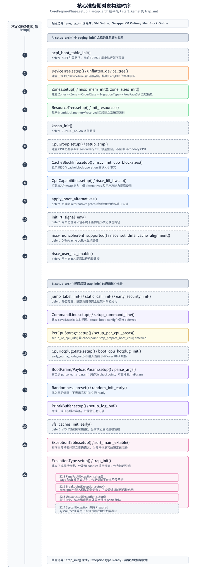
</p>

<p align="center">
  图 13 核心准备期对象构建时序
</p>

图 13 将核心准备期的 `setup` 过程表示为两段连续编排：第一段完成 `setup_arch()` 在 `paging_init()` 之后的体系结构收尾；第二段完成 `setup_arch()` 返回后到 `trap_init()` 的通用核心准备。图中标记为 formal 的项目已经进入模型；标记为 deferred 的项目保留调用位置但延后建模；标记为 checkpoint 的项目只指导实现阶段插入可观测检查。

##### 核心准备期过程处理清单

##### `setup_arch()` 中 `paging_init()` 之后的过程

| Linux 调用 | 规格处理 | 备注 |
|---|---|---|
| `acpi_boot_table_init()` | deferred | 当前最小路径以 FDT/SBI 为主；ACPI 引导路径后续单独建模。 |
| `unflatten_device_tree()` / `unflatten_and_copy_device_tree()` | formal: `DeviceTree.setup()` | 基于 `RawDtb` 建立正式 OF/DeviceTree 运行期结构；展开存储由 `MemBlock` 分配，编码阶段按两次遍历完成校验、计量、分配和填充。 |
| `misc_mem_init(): early_memtest()` | deferred | 可选内存测试路径，不改变当前最小启动语义。 |
| `misc_mem_init(): arch_numa_init()` | 不纳入当前规格 | 当前规格限定 SMP over UMA，不支持 NUMA；该项不是 deferred。 |
| `misc_mem_init(): sparse_init()` | deferred | SPARSEMEM 元数据后续随完整内存模型展开。 |
| `misc_mem_init(): local_flush_tlb_kernel_range(VMEMMAP_START, VMEMMAP_END)` | deferred | SPARSEMEM_VMEMMAP 条件路径。 |
| `misc_mem_init(): zone_sizes_init()` | formal: `Zones.setup()` | 建立 `Zones -> Zone -> OrderClass -> MigrationType -> FreePageSet` 五层抽象；当前固定 `DMA32`、`NORMAL`、`MOVABLE` 三类逻辑 zone，允许空范围。 |
| `misc_mem_init(): arch_reserve_crashkernel()` | deferred | crashkernel 资源保留路径后续展开。 |
| `misc_mem_init(): memblock_dump_all()` | implementation checkpoint | 只观察和输出 `MemBlock` 状态，不推进规格状态。 |
| `init_resources()` | formal: `ResourceTree.setup()` | 建立 system RAM、reserved 和 kernel image/code/data/bss 资源关系。 |
| `kasan_init()` | deferred | `CONFIG_KASAN` 条件路径。 |
| `setup_smp()` | formal: `CpuGroup.setup()` | 建立 CPU 拓扑事实和 secondary CPU 候选集合，不启动 secondary CPU。 |
| `acpi_init_rintc_map()` | deferred | ACPI enabled 时执行，依赖 ACPI 引导模型。 |
| `acpi_map_cpus_to_nodes()` | deferred | ACPI/NUMA/CPU 拓扑相关，依赖前置 ACPI/NUMA 模型。 |
| `riscv_init_cbo_blocksizes()` | formal: `CacheBlockInfo.setup()` | 从 CPU nodes 初始化平台级 CBOM/CBOZ block size 事实；CBOP 暂缓。 |
| `riscv_fill_hwcap()` | formal: `CpuCapabilities.setup()` | 汇总 CPU 集合的 ISA/hwcap 能力事实，并校验 Zicbom/Zicboz 对 CacheBlockInfo 的依赖。 |
| `apply_boot_alternatives()` | deferred | 启动期 alternatives patch 后续抽象为代码补丁设施。 |
| `init_rt_signal_env()` | deferred | 用户态信号环境不属于当前最小核心准备路径。 |
| `riscv_noncoherent_supported()` / `riscv_set_dma_cache_alignment()` | formal: `DmaCachePolicy.setup()` | 建立 non-coherent DMA 支持与 `dma_cache_alignment` 事实，供后续 `mem_init()` 中的 SWIOTLB/bounce 决策消费。 |
| `riscv_user_isa_enable()` | deferred | 用户态 ISA 暴露路径后续建模。 |

##### `setup_arch()` 返回后到 `trap_init()` 的过程

| Linux 调用 | 规格处理 | 备注 |
|---|---|---|
| 通用 `start_kernel(): jump_label_init()` | checkpoint | 当前 RISC-V 路径中 `StaticBranch` 已经 `Ready`，该调用按幂等 checkpoint 处理，不推进状态。 |
| `static_call_init()` | deferred | 静态调用是调用目标代码补丁设施，当前不进入核心模型。 |
| `early_security_init()` | deferred | 当前配置无 early LSM 主线；若后续启用 early LSM，可映射为 `SecurityCore.preset()`，本阶段暂不推进安全对象状态。 |
| `setup_boot_config()` | deferred | bootconfig/XBC/initrd 派生参数后续作为参数来源展开。 |
| `setup_command_line()` | formal: `CommandLine.setup()` | 建立 saved/static 命令行视图；只处理命令行副本，不合并后续 Param 解析时序。 |
| `setup_nr_cpu_ids()` | implementation checkpoint | Linux 中是 cpumask/per-cpu 数组上界；规格模型不需要 `CpuIdMap.nr_ids`。实现只检查 `CpuIdMap[0] == BootCPU` 和 possible CPU 映射边界，不推进状态。 |
| `setup_per_cpu_areas()` | formal: `PerCpuStorage.setup()` | 建立 `PerCpuStaticImage`、`PerCpuFirstChunk` 和 `PerCpuOffsetTable`，完整动态 allocator 后续展开。 |
| `smp_prepare_boot_cpu()` | deferred | RISC-V64 当前弱实现为空，不建立额外对象。 |
| `early_numa_node_init()` | 不纳入当前规格 | 当前规格限定 SMP over UMA，不支持 NUMA；该项不是 deferred。 |
| `boot_cpu_hotplug_init()` | formal: `CpuHotplugState.setup()` | `CpuHotplugState` 是 CPUObject 的子对象；当前先建立 BootCPU 的 hotplug 状态。 |
| `parse_early_param()` | implementation checkpoint | 第二次 early param 调用不得重新推进 `EarlyParam` 或 `EarlyCon`。 |
| `parse_args("Booting kernel", ...)` | formal: `Params.setup()` drives `BootParam.setup()` | 普通内核参数解析，不同于 `EarlyParam`。 |
| `print_unknown_bootoptions()` | implementation checkpoint | 只输出 `BootParam` 收集到的未知选项，不改变 `BootParam` 状态。 |
| `parse_args("Setting init args", ...)` | formal: `Params.setup()` drives `PayloadParam.setup()` | 处理 `--` 后传给最终 payload 的参数，允许为空。 |
| `parse_args("Setting extra init args", ...)` | deferred | bootconfig `init.*` 路径随 `BootConfig` 展开。 |
| `random_init_early()` | formal: `Randomness.preset()` | 混入早期熵源，不表示完整 RNG 已 ready。 |
| `setup_log_buf()` | formal: `PrintkBuffer.setup()` | 完成正式日志缓冲准备并保留已有记录，不新建 `LogBuffer`。 |
| `vfs_caches_init_early()` | deferred | VFS/inode/dentry 缓存不属于当前核心启动模型。 |
| `sort_main_extable()` | formal: `ExceptionTable.setup()` | 必须排序主异常表并建立可查询语义。 |
| `trap_init()` | formal: `ExceptionStream.setup()` 和子异常 setup | 阶段终点；建立正式异常分类、分发和 handler 注册框架。 |

#### 子阶段 4：内存核心初始化期（MM Core Init Subphase）

第四个子阶段对应 Linux 6.12.37 `start_kernel()` 中 `mm_core_init()` 的内部内容。它从 `trap_init()` 完成后开始，在 `mm_core_init()` 返回时结束；后续的 `sched_init()`、IRQ/time/RCU/workqueue 初始化和 `local_irq_enable()` 都不属于本子阶段。

本小节作为 `BootPhase` 子阶段 4 的讨论落点。新增讨论应先在这里明确 `mm_core_init()` 内部对象边界、阶段边界、状态推进和检查项；只有当语义已经稳定，才同步进入形式化模型、图示和对象级实现。若正文解释、形式化模型和实现之间出现差异，应优先回到本节确认设计意图，再更新可验证模型和代码。

本子阶段仍处于 `引导期` 的 `System Exclusive` 上下文中。中断仍关闭，普通任务调度尚未启动，secondary hart 也尚未进入并发执行路径。因此，本阶段中的内存对象建立仍按单根流独占推进来理解。

从边界上看，本子阶段的输入至少包括：

- `CorePreparePhase.state == Ready`
- `ExceptionStream.state == Ready`
- `MemBlock.state == Online`
- `Zones.state == Ready`
- `CpuGroup.state == Ready`
- `CpuIdMap.state == Ready`
- `DmaCachePolicy.state == Ready`
- `PerCpuStorage.state == Ready`
- `PrintkBuffer.state == Ready`
- `StaticBranch.state == Ready`
- `VM.state == Online`
- `SwapperVM.state == Online`
- 当前仍保持 `System Exclusive`

本子阶段的输出目标是把“早期内存描述和 memblock 分配能力”推进为“核心内存管理基础可用”。这里的“核心内存管理基础可用”至少包含：zonelist 已建立，页分配器 hotplug/pcp 基础钩子已登记，架构 `mem_init()` 已把 memblock 管理的可用页交接给页分配器并完成 RISC-V 所需的 `swiotlb`/内存布局收尾，SLUB/kmalloc 分配器可用，内存调试/硬化状态完成当前配置下的初始化，页表相关缓存可用，vmalloc/vmap 基础可用，`mm_struct` 等基础 cache 可用。`ExecMemory` 在当前默认配置下未被 `MODULES`、`BPF_JIT` 或 `KPROBES` 选中，视为裁剪路径；后续若启用相关功能，再作为正式对象展开。

当前 Linux 参照配置以 `~/gitStudy/linux-6.12.37/default_config` 为准。与本子阶段相关的关键配置包括：`CONFIG_64BIT=y`、`CONFIG_MMU=y`、`CONFIG_FLATMEM=y`、`CONFIG_SLUB=y`、`CONFIG_SPLIT_PTE_PTLOCKS=y`、`CONFIG_STACKDEPOT=y`、`CONFIG_DEBUG_PAGEALLOC=y`、`CONFIG_DEBUG_VM=y`、`CONFIG_SWIOTLB=y`、`CONFIG_DMA_BOUNCE_UNALIGNED_KMALLOC=y`；同时 `CONFIG_INIT_ON_ALLOC_DEFAULT_ON`、`CONFIG_INIT_ON_FREE_DEFAULT_ON`、`CONFIG_DEBUG_PAGEALLOC_ENABLE_DEFAULT`、`CONFIG_PAGE_POISONING`、`CONFIG_PAGE_EXTENSION`、`CONFIG_KFENCE`、`CONFIG_KMSAN`、`CONFIG_DEBUG_KMEMLEAK`、`CONFIG_DEBUG_OBJECTS`、`CONFIG_KASAN`、`CONFIG_MODULES`、`CONFIG_BPF_JIT` 和 `CONFIG_KPROBES` 均未启用。因此，本阶段图示和清单先按该配置区分主线 formal、checkpoint 与裁剪 no-op 路径。

本小节使用的标准生命周期语义扩展为 `Base -> Prepared -> Ready -> Online -> Offline -> Destroyed`。其中 `Offline` 表示对象的主要服务能力或资源所有权已经退出运行路径，但对象元数据仍可用于诊断、引用收尾或后续销毁；对多数启动对象，`Offline` 可以是空动作或短路边界。`handoff` 只作为 `Offline` 的资源交接别名，`discarded` 只作为 `Destroyed` 的资源丢弃别名，不引入新的状态名。`State::Offline` 与 `Event::Disable` 已进入 `spec/model/SEMANTICS.md` 和 model checker；配置裁剪路径继续写为 `trimmed` 或“裁剪路径”，不把它当作对象状态；`Skipped` 只可作为讨论中的自然语言，不进入 formal model、规格清单或 coding 实现。编译期约束、一次性验证、日志输出、策略选择和临时占位初始化若不形成长期对象生命周期，统一写为 `checkpoint`，不引入未定义的 `Checked`、`Decided`、`Emitted`、`Registered` 等状态名。

针对 `build_all_zonelists(NULL)`，本阶段引入一层显式内存拓扑对象，而不是把 zonelist 直接挂在页分配器对象下。顶层对象暂名 `MemoryTopology`，它包含一个或多个 `MemoryNode`。在当前 `default_config` 的 `CONFIG_NUMA=n` 下，系统只有唯一的 `MemoryNode[0]`；后续若支持 NUMA，`MemoryTopology` 可以自然扩展为多个 `MemoryNode`。每个 `MemoryNode` 对应 Linux 的 `pg_data_t`，拥有 `ZoneSet` 和 `ZonelistSet` 两类下级对象：`ZoneSet` 承载本节点实际拥有的 `Zone`，`ZonelistSet` 承载本节点发起分配时可消费的 zone 选择顺序。`Zoneref` 只引用 `Zone`，不拥有 `Zone`；在 NUMA 配置下，一个节点的 `Zonelist` 可以引用其他节点拥有的 `Zone`，而 UMA 配置下当前只引用唯一节点自己的 populated zones。

当前先将子阶段 4 的对象和边界记录如下：

1. `内存核心初始化期对象`（暂名 `MmCoreInitPhase`）：属于阶段对象，是 `BootPhase` 的第四个子阶段对象。它从 `ExceptionStream.Ready` 接续核心准备期，并以 `mm_core_init()` 返回作为阶段完成边界。
2. `内存拓扑对象`（暂名 `MemoryTopology`）：覆盖页分配器可见的物理内存节点组织。当前 UMA 配置下只有 `MemoryNode[0]`；NUMA 扩展时可包含多个 `MemoryNode`，每个节点维护自己的 zone 集合和 zonelist 集合。
3. `内存节点对象`（暂名 `MemoryNode`）：对应 Linux `pg_data_t`。它拥有 `ZoneSet`（Linux `node_zones[MAX_NR_ZONES]`）和 `ZonelistSet`（Linux `node_zonelists[MAX_ZONELISTS]`）。`build_all_zonelists(NULL)` 不创建 `Zone`，而是基于已经 populated 的 `ZoneSet` 构造 `ZonelistSet`。
4. `ZoneSet` 与 `ZonelistSet`：`ZoneSet` 是节点拥有的 zone 实体集合；`ZonelistSet` 是节点拥有的 zone 选择视图。当前 `CONFIG_NUMA=n` 时 `ZonelistSet` 只包含 `ZONELIST_FALLBACK`；`ZONELIST_NOFALLBACK` 是 NUMA 配置下为 `__GFP_THISNODE` 保留的扩展路径。
5. `Zonelist` 与 `Zoneref`：`Zonelist` 保存按 fallback 优先级排列的 `Zoneref[]`。每个有效 `Zoneref` 记录 `zone*` 和 `zone_idx`，末尾必须有 `zone == NULL` 的哨兵项。`Zoneref` 只引用 `Zone`，不拥有 `Zone`。
6. `页分配器对象`（暂名 `PageAllocator`）：覆盖 `build_all_zonelists(NULL)`、`page_alloc_init_cpuhp()`、架构 `mem_init()` 中的 `memblock_free_all()`，并为后续 `page_alloc_init_late()` 保留 `enable()` slot。`PageAllocator.preset()` 合并相邻的 `build_all_zonelists(NULL)` 与 `page_alloc_init_cpuhp()`：前者建立 `MemoryNode[*].ZonelistSet.Ready`，后者向既有 `CpuHotplugStepRegistry` 登记 `CPUHP_PAGE_ALLOC` step 回调，但不推进任一 `CpuHotplugState.state`。`PageAllocator.setup()` 对应 `memblock_free_all()`，把 `MemBlock` 中可释放页迁移到 buddy 体系；该体系按 `Zone -> OrderClass -> MigrationType -> FreePageSet` 表达，其中 `OrderClass` 对应 buddy order 维度。`PageAllocator.enable()` 留给 `page_alloc_init_late()`，不在本子阶段消耗。
7. `SWIOTLB 对象`（暂名 `Swiotlb`）：覆盖 RISC-V `mem_init()` 中的 `swiotlb_init(swiotlb, SWIOTLB_VERBOSE)`。它依赖 `DmaCachePolicy.Ready`、`MemBlock.Online`、`Zones.Ready` 和 `dma32_phys_limit` 等事实，在 `memblock_free_all()` 之前通过 memblock 预留并初始化 default bounce buffer、slot 和 area 元数据；如果当前启动不需要 early SWIOTLB pool，则仍记录 `pool_required=false` 并进入 `Ready`。它不是通用 DMA API 对象；本阶段只关心释放 memblock 页前必须完成的 early SWIOTLB 池建立。`CONFIG_SWIOTLB_DYNAMIC=n`，因此动态增长路径当前不进入主线。
8. `页扩展对象`（暂名 `PageExt`）：覆盖 `page_ext_init_flatmem()`、`page_ext_init_flatmem_late()` 和条件执行的 `page_ext_init()`。当前默认配置 `CONFIG_PAGE_EXTENSION=n`，因此本对象不进入主线 formal，只在过程清单中保留裁剪位置。
9. `内存调试与硬化对象`（暂名 `MemoryDebugHardening`）：覆盖 `mem_debugging_and_hardening_init()` 与 `report_meminit()`。它依赖 `StaticBranch.Ready`，消费前序 `EarlyParam` 已经解析出的内存调试/硬化参数事实，汇总 `init_on_alloc`、`init_on_free`、page poisoning、debug pagealloc、debug guardpage、check_pages 等配置和启动参数结果，并通过 `StaticBranch.set(key, value)` action 收敛相关 static key；其中 `report_meminit()` 主要作为状态报告或 checkpoint，不单独推进对象生命周期。
10. `内存检测辅助对象`（暂名 `MemorySanitizers`）：覆盖 `kfence_alloc_pool_and_metadata()`、`kmsan_init_shadow()` 和 `kmsan_init_runtime()`。当前默认配置未启用 `KFENCE` 和 `KMSAN`，因此不进入主线 formal。
11. `StackDepot`：覆盖 `stack_depot_early_init()`，为 page owner、kmemleak 等后续调试路径提供调用栈存储基础。
12. `SLUB 分配器对象`（暂名 `SlubAllocator`）：覆盖 `kmem_cache_init()`。当前默认配置选择 `CONFIG_SLUB=y`，因此本对象按 SLUB 自举路径建模。Linux 内部 `slab_state` 与规格生命周期的映射为：`DOWN -> Base`、`PARTIAL -> Prepared`、`UP -> Ready`、`FULL -> Online`。本子阶段只推进到 `UP/Ready`；`kmem_cache_init_late()` 作为后续 action 处理 flush workqueue，`slab_sysfs_init()` 才会把 Linux 内部状态推进到 `FULL/Online`。
13. `SLUB cache registry`（暂名 `SlubCacheRegistry`）：对应 Linux 全局 `slab_caches` 列表及其互斥/注册边界。它是独立对象，不并入 `SlubAllocator`。`kmem_cache_init()` 期间，boot cache 和 bootstrap 后的正式 cache 都必须进入该 registry；后续创建普通 cache 时也通过它维护全局可枚举关系。
14. `SLUB cache 对象`（暂名 `SlubCache`）：对应单个 `struct kmem_cache`。每个 `SlubCache` 拥有自己的 `SlubNodeSet` 与 `SlubCpuCacheSet`：前者描述 per-node partial/full slab 视图，后者描述 per-CPU 当前 slab、partial slab 和统计缓存。当前不把 `SlubNodeSet`、`SlubCpuCacheSet` 提升为顶层对象。
15. `kmalloc cache 集合对象`（暂名 `KmallocCaches`）：对应 `kmalloc_caches[][]` 与 `kmalloc_size_index[]`。它由 `SlubAllocator` 驱动建立，但作为独立对象表达 size-class 到 `SlubCache` 的映射关系；当前 `CONFIG_RANDOM_KMALLOC_CACHES=n` 且 `CONFIG_MEMCG=n`，只建模默认 kmalloc cache 集。
16. `Kmemleak`：覆盖 `kmemleak_init()`。当前默认配置 `CONFIG_DEBUG_KMEMLEAK=n`，因此不进入主线 formal。
17. `PageTableCaches`：覆盖 `ptlock_cache_init()` 与 `pgtable_cache_init()`。它的中心功能是为后续页表操作准备页表锁 cache，并补齐当前架构需要预先建立的 kernel page table 范围。`PageTableLockCache` 作为下级对象对应 `page_ptl_cachep`，依赖 `SlubAllocator.Ready` 创建 `"page->ptl"` cache，后续服务 `ptlock_alloc()` / `ptlock_free()`。RISC-V `pgtable_cache_init()` 对应 `PageTableCaches.setup()` 内的 `KernelPgtablePreallocation` action/fact，不作为顶层对象；当前 `default_config` 下主线只预分配 `VMALLOC_START..VMALLOC_END`，`MODULES=n` 跳过 modules/BPF 区，`CONFIG_MEMORY_HOTPLUG` 未启用，因此 vmemmap/direct map/KASAN 相关分支不进入主线。
18. `DebugObjectsMemory`：覆盖 `debug_objects_mem_init()`。当前默认配置 `CONFIG_DEBUG_OBJECTS=n`，因此不进入主线 formal。
19. `VmallocAllocator`：覆盖 `vmalloc_init()`。它是管理 vmalloc/vmap 虚拟地址空间的 allocator，不是页表映射器，也不等同于所有 vmalloc API 行为。它拥有 `VmapAddressSpace`、`VmapNodeSet`、`VmapAreaCache`、`VmapBlockQueues` 和 `VfreeDeferredSet`：`VmapAddressSpace` 是资源本体，拥有 `VmapArea` 区间集合；`VmapNodeSet` 是管理索引/分片组织，indexes/partitions `VmapAddressSpace`，但不拥有虚拟地址资源本身。`vmalloc_init()` 建立 `vmap_area` cache、per-CPU vmap block 队列、per-CPU deferred free 队列、vmap node，导入已有 `vmlist` 为 busy areas，建立 free vmap space，并把 `vmap_initialized` 置为 true；`vmap-node` shrinker 注册作为后续 reclaim hook action/checkpoint。
20. `MmStructCache`：覆盖 `mm_cache_init()`，只建立 `"mm_struct"` cache。它依赖 `SlubAllocator.Ready` 和 CPU mask size 相关事实，计算 `sizeof(struct mm_struct) + cpumask_size() + mm_cid_size()`，并创建带 `saved_auxv` usercopy range 的 `mm_struct` SLUB cache。`vm_area_struct` cache、`vma_lock_cachep` 和 `mmap_init()` 属于后续 `proc_caches_init()`，不并入本子阶段。
21. `ExecMemory`：覆盖 `execmem_init()`。它建立后续模块、BPF JIT、kprobes 或类似可执行内存分配策略所需的范围信息。当前默认配置未启用 `MODULES`、`BPF_JIT` 和 `KPROBES`，`CONFIG_EXECMEM` 未被选中，因此本路径视为裁剪 no-op。
22. `Espfix` 与 `Pti`：覆盖 `init_espfix_bsp()` 与 `pti_init()`。在 RISC-V64 当前实现中它们为空 inline 或非目标架构路径，规格上不进入当前 formal model，只在过程清单中作为不适用项保留。

<p align="center">
  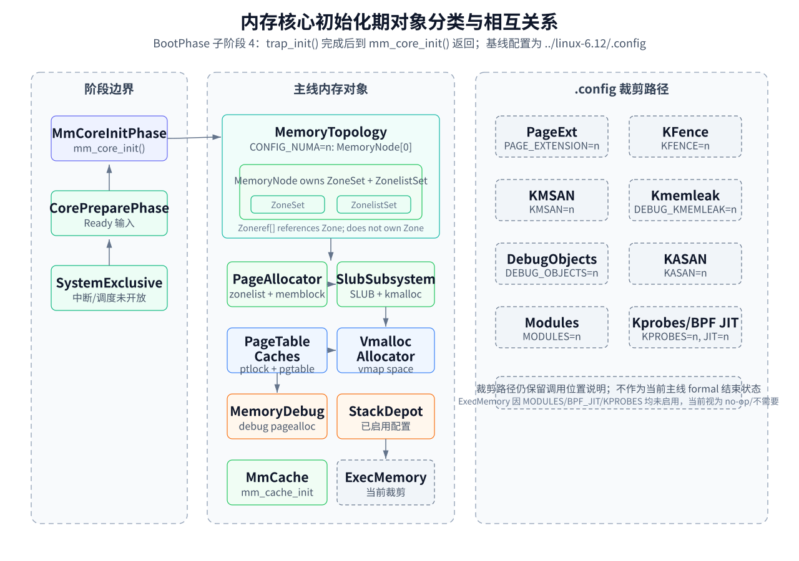
</p>

<p align="center">
  图 14 内存核心初始化期对象分类与相互关系
</p>

图 14 用于说明子阶段 4 的对象分类与默认配置裁剪结果。左侧是阶段边界和前序状态，中间是当前主线对象以及 `MemoryTopology -> MemoryNode -> ZoneSet/ZonelistSet` 的层次，右侧是 `default_config` 下已经裁剪的条件路径。裁剪路径仍保留调用位置说明，但不作为本阶段主线 formal 结束状态。

##### 第一段：页分配器前置组织（初稿）

这一段覆盖 `BUILD_BUG_ON(MAX_ZONELISTS > 2)`、`build_all_zonelists(NULL)` 和紧随其后的 `page_alloc_init_cpuhp()`。其中 `BUILD_BUG_ON(MAX_ZONELISTS > 2)` 是编译期 checkpoint，用来约束当前实现最多处理两类 zonelist；它不推进运行期对象状态。`build_all_zonelists(NULL)` 是本段的中心转换：在 boot 路径中，它遍历所有 `MemoryNode`，用每个节点已经建立的 `ZoneSet` 构造 `ZonelistSet`。同一 boot 分支中的 `per_cpu_pages_init(&boot_pageset, &boot_zonestats)` 只作为 boot PCP 占位缓存 checkpoint：它保证早期 `zone->per_cpu_pageset` 引用有效，但当前阶段不建模 PCP 缓存策略，真正的 per-zone/per-cpu pageset 分配在后续 `setup_per_cpu_pageset()` 中完成，不属于本子阶段。`mminit_verify_zonelist()`、`cpuset_init_current_mems_allowed()`、mobility grouping 选择和末尾 `pr_info("Built %u zonelists...")` 同样作为 checkpoint 记录。

规格层把 `build_all_zonelists(NULL)` 与 `page_alloc_init_cpuhp()` 合并为 `PageAllocator.preset()`，因为二者在 `mm_core_init()` 中相邻，且都只建立页分配器后续可用前的组织事实：前者使 `MemoryNode[*].ZonelistSet.state == Ready`，后者向既有 `CpuHotplugStepRegistry` 登记 `CPUHP_PAGE_ALLOC` 的 page allocator online/dead 回调。`page_alloc_init_cpuhp()` 不推进任一 `CpuHotplugState.state`，也不在本阶段启动 secondary CPU；Linux 的 `CPUHP_PAGE_ALLOC` 属于 hotplug step 域，不混入生命周期状态。

当前 `CONFIG_NUMA=n` 时，该转换可以简化理解为：唯一 `MemoryNode[0]` 的 `ZoneSet` 已包含若干 `populated_zone(zone)`；`build_zonelists(pgdat)` 按 zone type 从高到低把这些 zone 写入 `MemoryNode[0].ZonelistSet[ZONELIST_FALLBACK].zoneref[]`，并追加 `zone == NULL` 的哨兵项。`ZonelistSet.Ready` 之后，后续页分配路径可以通过 `first_zones_zonelist()`、`next_zones_zonelist()` 和 `for_each_zone_zonelist*()` 消费同一套选择拓扑。

##### 第二段：页释放前的调试/硬化策略收敛（初稿）

这一段覆盖 `page_ext_init_flatmem()`、`mem_debugging_and_hardening_init()`、`kfence_alloc_pool_and_metadata()`、`report_meminit()`、`kmsan_init_shadow()` 和 `stack_depot_early_init()`，中心功能是把页分配器正式释放 memblock 页之前需要确定的调试、硬化和诊断策略收敛下来。其中 `PageExt`、`KFENCE` 和 `KMSAN` 在当前 `default_config` 下均为裁剪路径，保留调用位置但不形成主线对象状态；`StackDepot` 进入主线 formal，但它的中心语义是建立后续调试对象可复用的调用栈存储基础，后续单独展开。

`mem_debugging_and_hardening_init()` 是本段的中心转换。它不是分配器启用动作，而是读取 Kconfig 默认值和 `EarlyParam` 已经发布的早期参数事实，先处理 page poisoning 对 init-on-alloc/free 的优先级，再为 fast path 使用的 static keys 确定最终值。规格层不为 `init_on_alloc`、`init_on_free`、`_debug_pagealloc_enabled`、`_debug_guardpage_enabled` 和 `check_pages_enabled` 分别建立顶层对象；它们先作为 `MemoryDebugHardening` 的属性和 `StaticBranch` registry 中的 key 来表达。`MemoryDebugHardening.setup()` 必须要求 `StaticBranch.state == Ready`，并通过 `StaticBranch.set(key, value)` 更新需要显式启停的 key；该过程完成后，`MemoryDebugHardening.state == Ready`。

在当前 `default_config` 的基线下，`CONFIG_INIT_ON_ALLOC_DEFAULT_ON=n`、`CONFIG_INIT_ON_FREE_DEFAULT_ON=n`、`CONFIG_PAGE_POISONING=n`、`CONFIG_DEBUG_PAGEALLOC=y`、`CONFIG_DEBUG_PAGEALLOC_ENABLE_DEFAULT=n`、`CONFIG_DEBUG_VM=y`、`CONFIG_KMSAN=n`。因此，若运行时命令行没有额外打开相关 early params，本段的收敛结果是：`init_on_alloc` static key 为 off，`init_on_free` static key 为 off，page poisoning 路径裁剪，`_debug_pagealloc_enabled` 为 off，`_debug_guardpage_enabled` 为 off，`check_pages_enabled` 因 `CONFIG_DEBUG_VM=y` 保持 on。这里的 `init_on_alloc == off` 只表示该 static key 默认不要求普通分配清零；带 `__GFP_ZERO` 的具体分配仍可通过 `want_init_on_alloc(gfp)` 返回 true。

编码规格上，`MemoryDebugHardening` 至少应保存上述 resolved facts，并把 `setup()` 写成一次性收敛动作：它只消费配置常量和 `EarlyParam` 结果，不重新解析命令行；它只要求并使用 `StaticBranch` 已经建立的 registry，不在自身内部初始化 static branch 基础设施；重复设置同一 key 值必须保持幂等。`report_meminit()` 可实现为一个无状态推进的报告 action 或 checkpoint，输出必须来自 `MemoryDebugHardening` 已解析出的结果，而不是再次做策略决策。

##### 第三段：页分配器接收 memblock 页（初稿）

这一段对应架构 `mem_init()`，中心功能是把前面已经建立的内存拓扑、zone、zonelist 和调试策略推进到页分配器接收可用页的边界。开头的 `BUG_ON(!mem_map)` 是 checkpoint，用来确认 flatmem 下全局 page metadata 已经存在，不单独推进对象状态。RISC-V 当前路径先根据 `max_pfn > PFN_DOWN(dma32_phys_limit)` 判断是否存在 DMA32 可寻址边界之外的物理页；若没有这个寻址限制，但 `CONFIG_DMA_BOUNCE_UNALIGNED_KMALLOC=y` 且 `DmaCachePolicy.dma_cache_alignment != 1`，则会为 non-coherent 平台上的未对齐 kmalloc DMA 额外调整 SWIOTLB size，并把 `swiotlb` 需求置为 true。这个决策消费的是核心准备期已经收敛好的 `DmaCachePolicy` 事实，不应在 `mem_init()` 内重新探测 CPU/DTB 能力。

`swiotlb_init(swiotlb, SWIOTLB_VERBOSE)` 必须发生在 `memblock_free_all()` 之前，因为 early SWIOTLB 的 default bounce buffer、slot 数组和 area 数组仍通过 memblock 分配或保留。规格层把该动作记为 `Swiotlb.setup()`：当 `swiotlb == false` 且没有 force bounce 时，它可以只记录“不需要 early SWIOTLB 池”的 resolved fact；当 `swiotlb == true` 时，它建立 default SWIOTLB pool，使后续 DMA bounce 路径有可用池。当前 `CONFIG_SWIOTLB_DYNAMIC=n`，动态池增长和 late init 不在本子阶段展开。

`memblock_free_all()` 是 `PageAllocator.setup()` 的核心动作。它先处理未使用 memmap、重置各 zone 的 managed_pages 计数，然后遍历 memblock free ranges，把低端可管理物理页按最大可行 order 释放到 buddy/free page 集合，并将释放页数加入 `totalram_pages`。因此，本动作是 `MemBlock` 与 `PageAllocator` 之间的内部资源交接：`MemBlock.state` 从 `Online` 推进到 `Offline`，表示普通页分配不再通过 memblock；`PageAllocator.state` 推进到 `Ready`，表示 buddy 体系已经拥有可用页基础。buddy 的正式结构按 `Zone -> OrderClass -> MigrationType -> FreePageSet` 表达，其中 `OrderClass` 对应 Linux free_area 的 order 维度，`MigrationType` 对应每个 order 下的迁移类型 free list。

`print_vm_layout()` 在当前 `CONFIG_DEBUG_VM=y` 下作为 checkpoint 保留，用于输出 RISC-V 虚拟内存布局；它依赖 `VM.Online` 和架构地址空间常量，不推进 `PageAllocator` 或 `VM` 的生命周期。`page_alloc_init_late()` 中的 `memblock_discard()` 后续再把 `MemBlock` 私有元数据推进到 `Destroyed`，并作为 `PageAllocator.enable()` 的承载位置；它不属于本子阶段。`mem_init()` 返回后，后续 `kmem_cache_init()` 可以在 `PageAllocator.Ready` 基础上建立 SLUB/kmalloc caches。

##### 第四段：SLUB 分配器自举（初稿）

这一段对应 `kmem_cache_init()`，中心功能是建立可供后续内核对象使用的 SLUB/kmalloc 分配器。当前 `default_config` 选择 `CONFIG_SLUB=y`、`CONFIG_SLUB_TINY=n`、`CONFIG_SLUB_CPU_PARTIAL=y`、`CONFIG_SLUB_DEBUG=y`、`CONFIG_SLUB_DEBUG_ON=n`，并且 `CONFIG_SLAB_FREELIST_RANDOM=n`、`CONFIG_SLAB_FREELIST_HARDENED=n`、`CONFIG_RANDOM_KMALLOC_CACHES=n`、`CONFIG_MEMCG=n`。因此，本阶段按普通 SLUB 自举路径建模，不展开 memcg kmalloc、random kmalloc caches、freelist random/hardened 或 sysfs slab 管理路径。

规格层把 Linux 内部 `slab_state` 映射为 `SlubAllocator` 生命周期：`DOWN -> Base`、`PARTIAL -> Prepared`、`UP -> Ready`、`FULL -> Online`。`SlubAllocator.preset()` 建立 boot `kmem_cache_node`，并在 `slab_state = PARTIAL` 后进入 `Prepared`。由于 cache 管理结构本身也需要通过 SLUB 分配，Linux 使用静态 `boot_kmem_cache_node` 打开 per-node 元数据自举循环；当前 `CONFIG_MEMORY_HOTPLUG=n`，`hotplug_memory_notifier(...)` 不形成主线对象状态，只保留为条件路径位置。

`SlubAllocator.setup()` 继续建立 boot `kmem_cache`，随后执行 bootstrap：用已经可工作的 `kmem_cache` 为 `kmem_cache` 和 `kmem_cache_node` 两个静态 boot cache 分配正式 cache 对象，刷新当前 CPU slab 指针，并把已有 partial/full slab 的 `slab_cache` 指回正式 cache。这个动作的后置条件是 `SlubCache("kmem_cache")` 与 `SlubCache("kmem_cache_node")` 不再只是静态占位，而是进入 `SlubCacheRegistry` 维护的正常 cache 集合；每个 `SlubCache` 同时拥有自己的 `SlubNodeSet` 与 `SlubCpuCacheSet`。

随后 `setup_kmalloc_cache_index_table()` 建立小尺寸 kmalloc index 映射，`create_kmalloc_caches()` 建立 `KmallocCaches`；Linux 内部 `slab_state = UP` 表示 kmalloc 数组已经可用，对应 `SlubAllocator.state == Ready`、`SlubCacheRegistry.state == Ready` 和 `KmallocCaches.state == Ready`。`init_freelist_randomization()` 在当前配置下为空，不推进对象状态；`cpuhp_setup_state_nocalls(CPUHP_SLUB_DEAD, "slub:dead", NULL, slub_cpu_dead)` 只向既有 `CpuHotplugStepRegistry` 登记 SLUB dead 回调，不推进任一 `CpuHotplugState.state`，也不触发 CPU offline 回调。末尾 `pr_info("SLUB: ...")` 是 checkpoint。`kmem_cache_init_late()` 建立 flush workqueue，先作为 `SlubAllocator` 的后续 action 保留；`slab_sysfs_init()` 通过 `late_initcall` 使 Linux 内部 `slab_state = FULL`，对应后续 `SlubAllocator.enable()`，二者都在 `mm_core_init()` 之后，当前不进入子阶段 4。

##### 第五段：页表缓存与 vmalloc 地址空间准备（初稿）

这一段覆盖 `ptlock_cache_init()`、`pgtable_cache_init()` 和 `vmalloc_init()`。`ptlock_cache_init()` 是 `PageTableCaches.setup()` 中明确的对象建立动作：在当前 `CONFIG_SPLIT_PTE_PTLOCKS=y` 下，它创建 `PageTableLockCache`，即 Linux 的 `"page->ptl"` cache，后续 `ptlock_alloc()` / `ptlock_free()` 通过该 cache 管理 split page-table lock。`pgtable_cache_init()` 不是通用页表分配器初始化，而是架构页表范围预分配 action：RISC-V64 当前 `default_config` 下只要求预分配 `VMALLOC_START..VMALLOC_END`；`MODULES=n` 时 modules/BPF 范围不进入主线，`CONFIG_MEMORY_HOTPLUG` 未启用时 vmemmap/direct map/KASAN 分支也不进入主线。该 action 的结果落在 `SwapperVM` / kernel page table 能力事实上，不提升为独立顶层对象。

`vmalloc_init()` 对应 `VmallocAllocator.setup()`。本规格把它定义为 vmalloc/vmap 虚拟地址空间 allocator：核心职责是管理虚拟地址区间，而不是建立页表映射。`VmapAddressSpace` 是被管理的资源本体，拥有 `VmapArea` 区间集合；`VmapNodeSet` 是索引和分片组织，拥有 `VmapNode` 管理结构，并通过 `addr_to_node(addr)` 这类路由关系 indexes/partitions `VmapAddressSpace`。因此二者都由 `VmallocAllocator` 拥有，但二者之间不是资源拥有关系。

`VmallocAllocator.setup()` 还建立 `VmapAreaCache`、`VmapBlockQueues` 和 `VfreeDeferredSet`。`VmapAreaCache` 为 `VmapArea` 元数据提供 SLUB cache；`VmapBlockQueues` 初始化 per-CPU vmap block 队列和 xarray/hash 基础，只作为小块 vmap 快速路径基础，不展开 `vmap_block` bitmap 运行期语义；`VfreeDeferredSet` 初始化 per-CPU deferred free 队列和 work，保留给后续 `vfree()` 异步释放路径。导入已有 `vmlist` 是 `VmapAddressSpace.setup()` 内的动作：早期已有 vmalloc 区间被转换为 busy `VmapArea`，随后 `vmap_init_free_space()` 根据 gaps 建立 free `VmapArea`。`vmap_initialized = true` 是 `VmallocAllocator.Ready` 的可观测事实；`vmap-node` shrinker 注册作为 reclaim hook action/checkpoint。

##### 第六段：mm_struct cache 与裁剪收尾（初稿）

这一段覆盖 `mm_cache_init()` 和当前配置下的 `execmem_init()` 收尾。`MmStructCache.setup()` 只建立 `"mm_struct"` cache，不包含 `vm_area_struct` cache、`vma_lock_cachep` 或 `mmap_init()`；后三者属于后续 `proc_caches_init()`。`mm_cache_init()` 依赖 `SlubAllocator.Ready` 和 CPU mask size 相关事实，按 `sizeof(struct mm_struct) + cpumask_size() + mm_cid_size()` 计算对象大小，并创建带 `saved_auxv` usercopy range 的 SLUB cache；完成后 `MmStructCache.state == Ready`，后续进程/地址空间对象创建才消费该 cache。

`execmem_init()` 按当前 `default_config` 原则只记录为裁剪/no-op：`MODULES=n`、`BPF_JIT=n`、`KPROBES=n`，因此未选择 `CONFIG_EXECMEM`。本阶段不建立 `ExecMemory` 正式对象，也不讨论启用后的 arch range、default range 或 kprobes range。`page_ext_init_flatmem_late()`、`kmemleak_init()`、`debug_objects_mem_init()`、`page_ext_init()` 和 `kmsan_init_runtime()` 同样只保留当前配置下的调用位置和裁剪原因；`init_espfix_bsp()`、`pti_init()` 是 RISC-V64 当前不纳入路径。

##### 子阶段 4 过程处理清单（初稿）

| Linux 6.12.37 `mm_core_init()` 调用 | 规格处理 | 备注 |
|---|---|---|
| `BUILD_BUG_ON(MAX_ZONELISTS > 2)` | checkpoint | 编译期结构约束，不推进运行期对象状态。 |
| `build_all_zonelists(NULL)` | formal: `PageAllocator.preset()` / `MemoryNode[*].ZonelistSet.setup()` | 基于 `MemoryNode[*].ZoneSet` 建立 fallback zoneref 顺序；boot PCP 初始化、zonelist verify、cpuset mems allowed、mobility grouping 和 `pr_info` 输出均作为 checkpoint。 |
| `page_alloc_init_cpuhp()` | formal: `PageAllocator.preset()` | 向既有 `CpuHotplugStepRegistry` 注册 `CPUHP_PAGE_ALLOC` 的 page allocator online/dead 回调；不推进任一 `CpuHotplugState.state`，不启动 secondary CPU。 |
| `page_ext_init_flatmem()` | trimmed | `CONFIG_PAGE_EXTENSION=n`，当前默认配置下不建立 `PageExt`；其调用位置仍保留在 `MemoryDebugHardening` 前。 |
| `mem_debugging_and_hardening_init()` | formal: `MemoryDebugHardening.setup()` | 依赖 `StaticBranch.Ready`，消费 `EarlyParam` 事实，收敛 `init_on_alloc`、`init_on_free`、debug pagealloc、debug guardpage 和 page 检查相关 static key。当前基线下 alloc/free 初始化和 debug pagealloc 为 off，`check_pages_enabled` 因 `CONFIG_DEBUG_VM=y` 为 on。 |
| `kfence_alloc_pool_and_metadata()` | trimmed | `CONFIG_KFENCE=n`。 |
| `report_meminit()` | checkpoint | 输出内存自动初始化状态；当前基线下 heap alloc/free auto-init 均为 off，不单独推进对象生命周期。 |
| `kmsan_init_shadow()` | trimmed | `CONFIG_KMSAN=n`。 |
| `stack_depot_early_init()` | formal: `StackDepot.setup()` | `CONFIG_STACKDEPOT=y`，为 page owner、kmemleak 等调试路径提供栈存储基础。 |
| `mem_init()` | formal: `Swiotlb.setup()` + `PageAllocator.setup()` + `MemBlock.offline()` | RISC-V 路径先基于 `DmaCachePolicy`、`dma32_phys_limit` 和 `max_pfn` 决定并初始化 early SWIOTLB 池，再由 `memblock_free_all()` 把 memblock free ranges 释放到 buddy/page allocator；`BUG_ON(!mem_map)` 与 `print_vm_layout()` 是 checkpoint。 |
| `kmem_cache_init()` | formal: `SlubAllocator.preset/setup()` + `SlubCacheRegistry.setup()` + `KmallocCaches.setup()` | `CONFIG_SLUB=y`，建立 boot `kmem_cache_node`/`kmem_cache`，bootstrap 为正式 SLUB cache，创建 kmalloc caches，并登记 `CPUHP_SLUB_DEAD` 回调；freelist random 当前为空路径，`kmem_cache_init_late()` 不在本阶段。 |
| `page_ext_init_flatmem_late()` | trimmed | `CONFIG_PAGE_EXTENSION=n`。 |
| `kmemleak_init()` | trimmed | `CONFIG_DEBUG_KMEMLEAK=n`。 |
| `ptlock_cache_init()` | formal: `PageTableCaches.setup()` / `PageTableLockCache.setup()` | `CONFIG_SPLIT_PTE_PTLOCKS=y`，建立 `"page->ptl"` split page-table lock cache。 |
| `pgtable_cache_init()` | formal: `PageTableCaches.setup()` action | RISC-V64 当前主线预分配 `VMALLOC_START..VMALLOC_END` 的 kernel page table 范围；`MODULES=n`，`CONFIG_MEMORY_HOTPLUG` 未启用，modules/BPF、vmemmap/direct map/KASAN 分支当前被裁剪。 |
| `debug_objects_mem_init()` | trimmed | `CONFIG_DEBUG_OBJECTS=n`。 |
| `vmalloc_init()` | formal: `VmallocAllocator.setup()` | 建立 `VmapAreaCache`、`VmapBlockQueues`、`VfreeDeferredSet`、`VmapNodeSet` 和 `VmapAddressSpace`；导入早期 `vmlist` 为 busy areas，建立 free vmap space，并设置 `vmap_initialized=true`。 |
| `if (!deferred_struct_pages) page_ext_init()` | trimmed | `CONFIG_PAGE_EXTENSION=n`，不建立 `PageExt` final init。 |
| `init_espfix_bsp()` | 不纳入当前规格 | x86 特定路径，RISC-V64 当前为空。 |
| `pti_init()` | 不纳入当前规格 | x86 PTI 路径，RISC-V64 当前为空。 |
| `kmsan_init_runtime()` | trimmed | `CONFIG_KMSAN=n`。 |
| `mm_cache_init()` | formal: `MmStructCache.setup()` | 只建立 `"mm_struct"` cache；对象大小包含动态 `cpumask_size()` 与 `mm_cid_size()`，`vm_area_struct` cache 和 `mmap_init()` 属于后续 `proc_caches_init()`。 |
| `execmem_init()` | trimmed/no-op | `MODULES=n`、`BPF_JIT=n`、`KPROBES=n`，当前未选择 `CONFIG_EXECMEM`。 |

<p align="center">
  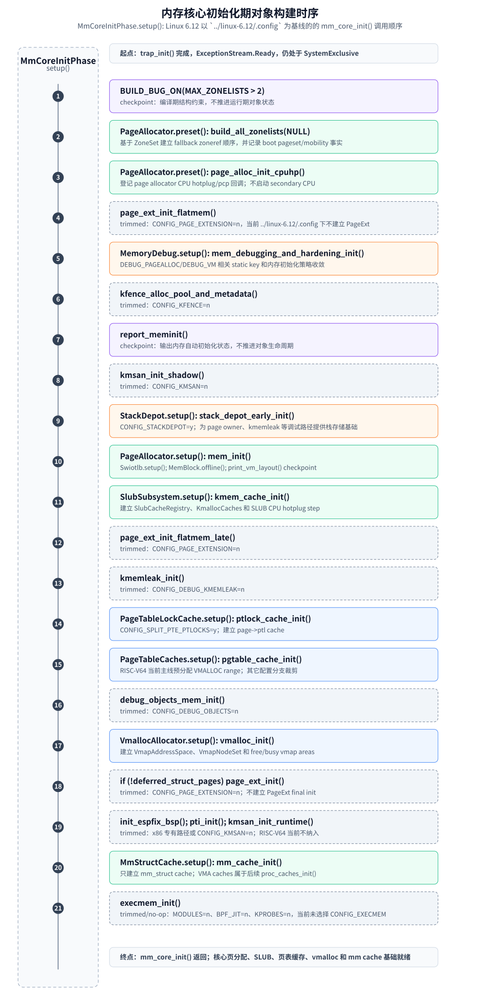
</p>

<p align="center">
  图 15 内存核心初始化期对象构建时序
</p>

图 15 按 Linux 6.12.37 `mm_core_init()` 内部调用顺序展示子阶段 4 的推进过程。绿色节点表示当前 `default_config` 下的主线 formal 路径，紫色节点表示 checkpoint，灰色虚线节点表示已裁剪或在 RISC-V64 当前目标中不纳入的路径。

本子阶段的结束状态暂定至少包含：

- `CorePreparePhase.state == Ready`
- `ExceptionStream.state == Ready`
- `MemoryTopology.state == Ready`，当前 `CONFIG_NUMA=n` 下包含唯一的 `MemoryNode[0]`
- `MemoryNode[0].ZoneSet.state == Ready`
- `MemoryNode[0].ZonelistSet.state == Ready`，表示 `ZONELIST_FALLBACK` 已按 populated zones 建立并带有 NULL 哨兵
- `PageAllocator.state == Ready`，表示 zonelist topology、page allocator CPU hotplug hook registration 和 `memblock_free_all()` 后的可用页接收边界已经完成；`enable()` 留给后续 `page_alloc_init_late()`
- `MemBlock.state == Offline`，表示可释放页已经交接给 `PageAllocator`，但 memblock 私有元数据尚未由 `memblock_discard()` 丢弃
- `PageExt` 明确记录为当前配置不需要
- `MemoryDebugHardening.state == Ready`，表示内存调试/硬化 static keys 已按当前配置和早期参数事实完成收敛
- `Swiotlb.state == Ready` 或记录为当前启动不需要 early SWIOTLB pool
- `StackDepot.state == Ready`
- `SlubAllocator.state == Ready`，表示 SLUB/kmalloc caches 可用于后续内核对象分配
- `SlubCacheRegistry.state == Ready`，表示 `kmem_cache`、`kmem_cache_node` 和 kmalloc caches 已进入全局 cache registry
- `KmallocCaches.state == Ready`，表示 size-class 到 `SlubCache` 的映射已经建立
- `PageTableCaches.state == Ready`
- `PageTableLockCache.state == Ready`
- `VmallocAllocator.state == Ready`
- `VmapAreaCache.state == Ready`
- `VmapAddressSpace.state == Ready`
- `VmapNodeSet.state == Ready`
- `VmapBlockQueues.state == Ready`
- `VfreeDeferredSet.state == Ready`
- `MmStructCache.state == Ready`
- `ExecMemory` 明确记录为当前配置不需要
- 条件对象 `KFence`、`Kmsan`、`Kmemleak`、`DebugObjectsMemory` 已按 `default_config` 记录为裁剪路径
- 当前仍保持 `System Exclusive`，中断总开关、普通任务调度和多 hart 并发进入路径仍未开放

#### 子阶段 5：调度准备期（Scheduler Init Subphase）

第五个子阶段对应 Linux 6.12.37 `start_kernel()` 中 `mm_core_init()` 返回后，到 `context_tracking_init()` 调用点完成的调度与异步基础准备段。它承接已经就绪的核心内存管理基础，先经过当前 RISC-V/default_config 下裁剪的 `poking_init()` 和 `ftrace_init()` 调用点，再完成 `sched_init()`，建立 radix/maple 基础索引、workqueue early 框架、Softirq action table 壳和 RCU 支撑设施，使系统拥有“中断打开前所需的调度与异步基础”。当前配置下 `context_tracking_init()` 编译为空调用，只作为边界处的 trimmed/no-op 记录；后续 IRQ、timer/timekeeping、`softirq_init()` 和打开中断前收尾不属于本子阶段。

本小节作为 `BootPhase` 子阶段 5 的初步讨论落点。当前只做对象边界、Linux 调用分类、图示和结束状态的第一轮整理；后续逐个对象讨论稳定后，再同步进入形式化模型和 `impl/arceos_ex`。

本子阶段仍处于 `System Exclusive` 上下文中：中断总开关仍关闭，secondary hart 仍未启动，普通任务切换尚未进入并发运行。`sched_init()` 是本阶段中心动作，但不能被理解为完整 SMP 调度器已经完成；Linux 注释明确说明完整拓扑设置发生在 `smp_init()`，本阶段只要求 boot CPU 和 possible CPU 的 runqueue 元数据、idle task 关联、调度类顺序和基础调度钩子可解释。

从边界上看，本子阶段的输入至少包括：

- `MmCoreInitPhase.state == Ready`
- `PageAllocator.state == Ready`
- `SlubAllocator.state == Ready`
- `KmallocCaches.state == Ready`
- `CpuGroup.state == Ready`
- `CpuIdMap.state == Ready`
- `PerCpuStorage.state == Ready`
- `BootCPU.CpuHotplugState.state == Ready`
- `StaticBranch.state == Ready`
- `PrintkBuffer.state == Ready`
- 当前仍保持 `System Exclusive`，`early_boot_irqs_disabled == true`

当前 Linux 参照配置以 `~/gitStudy/linux-6.12.37/default_config` 为准。与本子阶段相关的启用配置包括：`CONFIG_SMP=y`、`CONFIG_PREEMPT=y`、`CONFIG_TREE_RCU=y`、`CONFIG_PREEMPT_RCU=y`、`CONFIG_TASKS_RCU=y`、`CONFIG_TASKS_TRACE_RCU=y`、`CONFIG_CONTEXT_TRACKING=y`、`CONFIG_CONTEXT_TRACKING_IDLE=y`、`CONFIG_CPU_ISOLATION=y`。当前 RISC-V 路径没有覆盖 `poking_init()`，因此使用 weak no-op；当前未启用 `CONFIG_FTRACE_MCOUNT_RECORD`，因此 `ftrace_init()` 在 `include/linux/ftrace.h` 中折叠为空调用；当前未启用 `CONFIG_CONTEXT_TRACKING_USER_FORCE`，因此 `context_tracking_init()` 也在头文件中折叠为空调用。`housekeeping_init()` 虽然编译存在，将来需要作为 CPU isolation / nohz_full / isolcpus 相关对象展开，但当前最小启动输入未建模 `nohz_full=` 或 `isolcpus=` 参数，因此未设置 housekeeping flags 时直接返回。本阶段图示保留这类紧邻边界的 trimmed/deferred 调用位置，以避免误判 Linux 原始顺序。

`early_trace_init()` 和 `trace_init()` 对应 Linux tracing core / event tracing 机制。当前项目已经有自己的 checkpoint trace 机制，二者未来应合并为同一机制，还是保持并列并重新命名其边界和意义，暂未确定。由于 Linux tracing 不是本子阶段的核心启动功能，本阶段暂不建立主线 trace 对象；但未来若恢复，更可能是一个 `LinuxTracing` 对象，其中 `early_trace_init()` 对应 `preset()`，`trace_init()` 对应 `setup()`，而不是拆成 `EarlyTrace` 和 `TraceEvents` 两个独立对象。`ftrace_init()` 在当前配置下为空调用；如果后续配置启用 function tracing/mcount record，再考虑纳入同一 `LinuxTracing` 对象或单独作为 function tracing 子对象。为了保留 Linux 原始调用顺序，过程清单和时序图仍记录这些调用，并明确标记为 `trimmed` 或 `deferred`。后续若要恢复，应先明确它与项目内 trace 机制的关系、命名和责任边界，再进入形式化模型或实现。

当前先将子阶段 5 的对象和边界记录如下：

1. `调度准备期对象`（暂名 `SchedInitPhase`）：属于阶段对象，是 `BootPhase` 的第五个子阶段对象。它从 `MmCoreInitPhase.Ready` 接续，按 `mm_core_init()` 后到 `context_tracking_init()` 调用点完成的有效调用顺序编排对象推进。
2. `调度器对象`（暂名 `Scheduler`）：覆盖 `sched_init()`。它在 `preset()` 中准备调度器的全局前置对象，并预留未来驱动各 `SchedClass.preset()` 形成基本对象壳；在 `setup()` 中驱动每个 possible CPU 的 `RunQueue`、boot CPU 的 `BootIdleTask`，并预留未来驱动各 `SchedClass.setup()` 建立正式对象；最后通过 `enable()` 设置 `scheduler_running`。当前阶段只要求 boot CPU 上调度器基础可用，不启动 secondary CPU，不建立完整 SMP 调度拓扑。`sched_class` 顺序检查更接近 Linux 链接/实现细节，暂不作为独立 checkpoint 建模。
3. `RadixTree 对象`：覆盖 `radix_tree_init()`。当前把该调用建模为 `RadixTree.setup()`，使对象进入 `Ready`：建立 `"radix_tree_node"` SLUB cache，登记 `CPUHP_RADIX_DEAD` CPU hotplug dead 回调，并形成后续 IDR/XArray/radix tree 实例可申请 node 的全局基础。具体 radix tree 实例和使用者对象不在本阶段建立；实现阶段应至少生成 `RadixTree` 对象本体、node cache 子对象/属性、CPU hotplug 回调事实和后续 `alloc_node/free_node` API 边界。
4. `MapleTree 对象`：覆盖 `maple_tree_init()`。当前把该调用建模为 `MapleTree.setup()`，使对象进入 `Ready`：建立 `"maple_node"` SLUB cache，并形成后续 maple tree 实例可申请 node 的全局基础。具体 maple tree 实例，例如后续 VMA tree，不在本阶段建立；实现阶段应至少生成 `MapleTree` 对象本体、node cache 子对象/属性和后续 `alloc_node/free_node` API 边界。
5. `Housekeeping`：`housekeeping_init()` 用于管理 routine work 可运行的 CPU 集合，包括 unbound workqueue、timer、kthread、RCU、tick/nohz 和 CPU isolation 相关路径。该对象将来需要实现；当前最小启动输入尚未建模 `nohz_full=` / `isolcpus=` 等参数来源，因此先作为 deferred 保留调用位置，并记录当前 no-op 条件：`housekeeping.flags == 0` 时直接返回，不进入当前主线 formal 对象。
6. `Workqueue 对象`：覆盖 `workqueue_init_early()`，但不拆出单独的 early 顶层对象。当前先建立单一 `Workqueue` 的初步对象模型框架：`Workqueue.preset()` 使对象从 `Base` 推进到 `Prepared`，建立 system workqueue、worker pool、unbound cpumask、BH worker pool 和属性缓存，使早期代码可以创建 workqueue 并排队/取消 work item；后续 `workqueue_init()` 对应 `Workqueue.setup()`，使对象进入 `Ready`；更晚的 worker 执行、kthread 运行和服务启用边界留给 `Workqueue.enable()`。
7. `Softirq 对象`：本阶段由 `SchedInitPhase.setup()` 直接驱动规格补充动作 `Softirq.preset()`，建立可被早期 `open_softirq()` 写入的 `SoftirqActionTable`、`SoftirqSlot[NR_SOFTIRQS]` 和 per-CPU pending bit 承载壳，使对象进入 `Prepared`。该动作必须早于 `RcuCore.setup()`，因为 Linux `rcu_init()` 会注册 `RCU_SOFTIRQ`；但 `RcuCore` 只是第一个消费者，不是 `Softirq` 的生命周期驱动者，`softirq_init()` 对应的 tasklet 队列初始化和 `Softirq.setup()` 仍在下一子阶段执行。
8. `RCU 核心设施对象`（暂名 `RcuCore`）：覆盖 `rcu_init()`。该调用不是某一个具体 RCU 对象的 setup，而是为 TREE_RCU、PREEMPT_RCU、Tasks RCU、RCU softirq、RCU workqueue 以及后续 SRCU/RCU nohz 等路径建立共同核心设施；它依赖 scheduler/workqueue early 基础和 `SoftirqActionTable.Prepared`，但仍在中断关闭、单 CPU 运行的启动上下文中完成。当前 `default_config` 下还应记录 `kfree_rcu_batch_init()`、PM notifier、boot CPU online、`rcu_gp_wq`/`sync_wq`、polled grace period kick-start 等支撑事实。其中 `tasks_cblist_init_generic()` 是 Tasks RCU 聚合对象的早期壳建立动作，对应 `TasksRcu.preset()`，初始化已启用 flavor 的 per-CPU callback list、work item、exit/block list、barrier queue 与 enqueue/dequeue limits，使 `TasksRcu` 进入 `Prepared`。

<p align="center">
  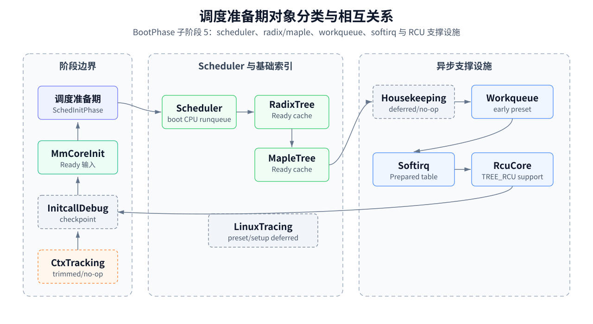
</p>

<p align="center">
  图 16 调度准备期对象分类与相互关系
</p>

图 16 用于说明子阶段 5 的对象分类和依赖关系。左侧是阶段边界、中断检查、`initcall_debug_enable()` checkpoint 和当前配置下 trimmed/no-op 的 `context_tracking_init()`；中间是 `sched_init()` 及其后的 `RadixTree`、`MapleTree` 基础缓存；右侧是 deferred/no-op 的 housekeeping、单一 `Workqueue` 的 early 框架、`Softirq.Prepared` action table 和 `RcuCore`。灰色虚线框记录未来可能恢复的 `LinuxTracing` 候选对象。图中对象仍是初步分类，后续可以按讨论结果继续拆分、合并或降级为 checkpoint。

##### 子阶段 5 过程处理清单（初稿）

| Linux 6.12.37 `start_kernel()` 调用 / 规格补充动作 | 规格处理 | 备注 |
|---|---|---|
| `poking_init()` | trimmed/no-op | RISC-V64 当前未覆盖该 weak hook；x86/powerpc code patching 路径不在当前目标内。 |
| `ftrace_init()` | trimmed/no-op | 当前未启用 `CONFIG_FTRACE_MCOUNT_RECORD`，`ftrace_init()` 折叠为空实现；function tracing 后续若启用再并入 tracing 对象讨论。 |
| `early_trace_init()` | deferred | Linux tracing core early buffer/event 基础；与项目 checkpoint trace 的关系未定，暂不建对象。 |
| `sched_init()` | formal candidate: `Scheduler.preset/setup/enable()` | 本阶段中心动作；建立 boot CPU 调度器基础，并为未来 `SchedClass.preset/setup()` 留出对象边界；完整 SMP 调度拓扑留给后续 `sched_init_smp()`。 |
| `WARN(!irqs_disabled(), ...)` | checkpoint | 检查中断没有被过早打开。 |
| `radix_tree_init()` | formal candidate: `RadixTree.setup()` | 创建 `"radix_tree_node"` SLUB cache，并登记 radix tree CPU hotplug dead 回调；对象进入 `Ready`。 |
| `maple_tree_init()` | formal candidate: `MapleTree.setup()` | 创建 `"maple_node"` SLUB cache；对象进入 `Ready`，后续 VMA tree 等使用者另行建模。 |
| `housekeeping_init()` | deferred | 管理 unbound workqueue、timer、kthread、RCU、tick/nohz 和 CPU isolation 的 housekeeping CPU 集合；当前未建模 `nohz_full=` / `isolcpus=` 参数，`housekeeping.flags == 0` 时直接返回。 |
| `workqueue_init_early()` | formal candidate: `Workqueue.preset()` | 建立单一 Workqueue 对象的 early 框架；对象进入 `Prepared`，可创建 workqueue 和排队/取消 work item，但不执行 worker kthread。 |
| `Softirq.preset()` | formal candidate | 由 `SchedInitPhase.setup()` 驱动的规格显式前置动作；建立 `SoftirqActionTable`、softirq slots 和 per-CPU pending bit 承载壳，使 `rcu_init()` 能按 Linux 顺序注册 `RCU_SOFTIRQ`。 |
| `rcu_init()` | formal candidate: `RcuCore.setup()` | 建立 RCU 树、boot CPU online、RCU softirq、RCU workqueues 等共同核心设施；其中 `tasks_cblist_init_generic()` 对应 `TasksRcu.preset()`，为按配置启用的 Tasks RCU flavor 建立 callback-list 壳。 |
| `trace_init()` | deferred | Linux event tracing 后续注册；与项目 checkpoint trace 的关系未定，暂不建对象。 |
| `initcall_debug_enable()` | checkpoint/deferred | 只在 `initcall_debug` 参数开启时影响后续 initcall 诊断。 |
| `context_tracking_init()` | trimmed/no-op | 当前 `CONFIG_CONTEXT_TRACKING_USER_FORCE=n`，该调用在 `include/linux/context_tracking.h` 中为空实现；`CONFIG_CONTEXT_TRACKING_IDLE=y` 的运行期状态由其它路径使用。 |

##### `sched_init()` 内部展开（初稿）

当前不拘泥于 Linux 函数层次，而按可指导实现的对象边界展开 `sched_init()`：

1. `Scheduler.preset()`：执行调度器全局前置准备。`SchedClasses` 本体暂时 deferred，但未来应由 `Scheduler.preset()` 统一驱动 `StopSchedClass.preset()`、`DeadlineSchedClass.preset()`、`RealtimeSchedClass.preset()`、`FairSchedClass.preset()` 和 `IdleSchedClass.preset()`，先形成可引用的基本对象壳。`BitWaitQueueTable.preset()` 预置 bit wait 机制使用的全局 waitqueue bucket 表。`DefaultSchedRootDomain.setup()` 建立默认的 CPU 间共享调度信息区域，供后续 `RunQueue` attach。调度类顺序检查暂不单独建 checkpoint，除非后续证明它是模型边界而不是实现细节。
2. `Scheduler.setup()`：遍历 possible CPU，驱动 `Cpu[id].RunQueue.setup(DefaultSchedRootDomain)`。`RunQueue` 挂在对应 `Cpu` 对象下面，内部当前只显式展开 `CfsRunQueue`、`RealtimeRunQueue` 和 `DeadlineRunQueue` 三个子队列；其它 runqueue 字段先作为属性处理。`FairServer` 先作为 deferred 子结构保留。未来 `Scheduler.setup()` 还应驱动各 `SchedClass.setup()`，把 preset 阶段形成的调度类对象壳推进为正式对象。
3. `BootCPU.RunQueue.BootIdleTask.setup(source = BootInitTask/current)`：把已有的 `BootInitTask/current` 推进为 boot CPU idle task，而不是新分配一个 task。该过程覆盖 `set_load_weight()`、`init_task.se.slice`、`mmgrab_lazy_tlb()`、`enter_lazy_tlb()`、`set_kthread_struct()`、`__sched_fork()` 和 `init_idle()`，并形成 `BootCPU.RunQueue.idle == BootIdleTask`、`BootCPU.RunQueue.curr == BootIdleTask`、`BootIdleTask.cpu == BootCPU`、`CpuGroup.Cpu[BootCPU.id].IdleTask == BootIdleTask` 等 checkpoints。当前默认 logical boot CPU id 为 0，但规格中优先使用 `BootCPU.id`，避免把启动 CPU 固定写死为 `Cpu[0]`。
4. `Scheduler.setup()` 的收尾属性动作包括初始化全局 load 更新期限、设置 `BootCPU.idle_thread_ref` / `per_cpu(idle_threads, BootCPU.id)` 指向 `BootCPU.RunQueue.BootIdleTask`，以及将 `BootCPU.RunQueue.balance_push_enabled` 置为 `false`。
5. `SchedClass.setup()` 当前整体 deferred。`FairSchedClass.setup()` 对应 Linux `init_sched_fair_class()`，后续可在该边界内展开；`init_sched_ext_class()`、`psi_init()`、`init_uclamp()` 和 `preempt_dynamic_init()` 在当前 `default_config` 下为空实现或配置禁用，直接从当前主线省略。
6. `Scheduler.enable()`：设置 `scheduler_running = true`，使调度器进入当前启动范围内的 running/online 状态。

当前还应显式记录 `sched_init()` 内部的裁剪或属性化路径：

- 调度类链接顺序 `BUG_ON(!sched_class_above(...))` 暂按实现一致性检查处理，不进入对象生命周期。
- `CONFIG_FAIR_GROUP_SCHED`、`CONFIG_RT_GROUP_SCHED`、`CONFIG_CGROUP_SCHED`、`CONFIG_SCHED_CORE`、`CONFIG_PSI`、`CONFIG_UCLAMP_TASK` 和 `CONFIG_PREEMPT_DYNAMIC` 在当前 `default_config` 下未启用，对应 root task group、task group cache、sched core、PSI、uclamp 和 preempt dynamic 路径裁剪。
- `CONFIG_NO_HZ_COMMON=y` 与 `CONFIG_HOTPLUG_CPU=y` 对应 runqueue 上的 nohz callback、hotplug wait 等字段，当前作为 `RunQueue` 属性或子事实处理，不单独建顶层对象。

<p align="center">
  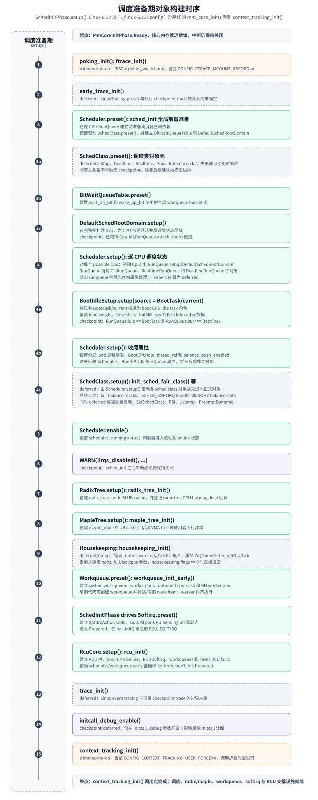
</p>

<p align="center">
  图 17 调度准备期对象构建时序
</p>

图 17 按 Linux 6.12.37 `start_kernel()` 中 `mm_core_init()` 返回后到 `context_tracking_init()` 调用点完成的顺序展示子阶段 5 的推进过程，并在 `sched_init()` 内部展开 `Scheduler.preset/setup/enable()`。绿色节点表示当前主线 formal 候选，紫色节点表示 checkpoint，灰色虚线节点表示当前 deferred，橙色虚线节点表示当前配置下 trimmed/no-op 的路径。

本子阶段的结束状态暂定至少包含：

- `MmCoreInitPhase.state == Ready`
- `Scheduler.state == Online`，表示 boot CPU 调度基础、runqueue 和 idle task 关联已经建立，且 `scheduler_running == true`；完整 SMP 调度拓扑仍留给后续阶段
- `RadixTree.state == Ready`，表示 radix tree node cache 和 CPU hotplug dead 回调已经建立
- `MapleTree.state == Ready`，表示 maple tree node cache 已经建立
- `Housekeeping` 当前保留为 deferred，不作为本阶段结束状态要求；当前 no-op 条件是 `housekeeping.flags == 0`
- `Workqueue.state == Prepared`，表示 workqueue early 框架已建立，可创建 workqueue、排队/取消 work item，但 worker kthread 尚未执行
- `Softirq.state == Prepared`，表示 softirq action table、slot 和 per-CPU pending bit 承载壳已经建立，可供 `RcuCore`、timer/hrtimer 和后续 tasklet 路径注册 action
- `RcuCore.state == Ready`，表示 TREE_RCU boot CPU 基础、RCU softirq、RCU workqueue、Tasks RCU callback list 等共同核心设施已建立
- `context_tracking_init()` 在当前配置下为 trimmed/no-op，未建立新的阶段结束状态
- 中断总开关仍处于关闭状态；下一阶段进入 `InterruptPhase`，其首个子阶段从 `early_irq_init()` 开始

### 中断期对象建立

从这一小节开始，对应顶层 `InterruptPhase`。本阶段从 `early_irq_init()` 开始，到 `rest_init()` 创建 `kernel_init` 与 `kthreadd`、多任务开始运行之前结束。`InterruptPhase` 的首个子阶段开始时仍关闭中断，并在该子阶段末尾执行 `local_irq_enable()`；此后 boot CPU 本地中断总入口开放，常规流仍是单根启动初始化流，但已经可能被中断流打断。`rest_init()` 之后将进入 `UP Multitask Phase`。

#### InterruptPhase 子阶段 1：中断时间准备期（IRQ and Time Init Subphase）

本子阶段对应 Linux 6.12.37 `start_kernel()` 中 `early_irq_init()` 开始，到 `local_irq_enable()` 执行完成的初始化段。它承接调度准备期已经建立的 scheduler、RCU 支撑设施和 workqueue 基础，建立 IRQ 控制器、tick/timer/timekeeping、softirq、完整随机数初始化、perf/profile 和 SMP call function 基础，并在末尾执行 `local_irq_enable()` 打开 boot CPU 本地中断总入口。

本子阶段是 `InterruptPhase` 的边界打开者。它的大部分对象建立过程仍处于 `System Exclusive` 上下文中：中断总开关关闭，secondary hart 仍未启动，普通任务切换尚未进入并发运行。但本阶段建立的是中断开放后会立即被消费的控制结构：timer interrupt、softirq、RCU nohz、RISC-V irq stack、SBI IPI、clockevent/clocksource、完整 RNG 和 call function 都必须在中断开放前处于可解释状态。阶段末尾的 `local_irq_enable()` 改变默认上下文：完成后 boot CPU 常规流进入 `Interruptible Context`。

从边界上看，本子阶段的输入至少包括：

- `Scheduler.state == Online`
- `Workqueue.state == Prepared`
- `RcuCore.state == Ready`
- `Softirq.state == Prepared`
- `DeviceTree.state == Ready`
- `SBI.state == Ready`
- `CpuGroup.state == Ready`
- `PerCpuStorage.state == Ready`
- 当前仍保持 `System Exclusive`，`early_boot_irqs_disabled == true`

当前 Linux 参照配置以 `~/gitStudy/linux-6.12.37/default_config` 为准。与本子阶段相关的启用配置包括：`CONFIG_IRQ_STACKS=y`、`CONFIG_VMAP_STACK=y`、`CONFIG_SOFTIRQ_ON_OWN_STACK=y`、`CONFIG_NO_HZ_IDLE=y`、`CONFIG_HIGH_RES_TIMERS=y`、`CONFIG_GENERIC_CLOCKEVENTS=y`、`CONFIG_RISCV_TIMER=y`、`CONFIG_PERF_EVENTS=y`、`CONFIG_PROFILING=y`、`CONFIG_RANDOMIZE_KSTACK_OFFSET=y`。本阶段只记录当前配置下的有效调用路径，不把未启用配置路径纳入对象、过程清单和图示。

当前先将 `InterruptPhase` 子阶段 1 的对象和边界记录如下：

这里需要先区分早期已经建模过的 `InterruptStream` 与本阶段的 IRQ 初始化对象。入口前导期/入口后继期的 `InterruptStream.preset/setup()` 已经分别用于清理中断子开关/挂起位、关闭中断总开关，并使 `InterruptStream.state == Ready`；它表达的是“从常规流进入中断流的入口路径已被安全封闭”。本阶段的 `early_irq_init()` 与 `init_IRQ()` 则是在这个入口路径仍关闭的前提下，建立后续中断到来时可分发、可入栈、可路由到 handler 的控制设施。因此，当前不把它们重新记为 `InterruptStream.preset/setup()`，以免重复消耗同一对象生命周期；更合适的是把它们建模为 `InterruptStream` 的后续子对象，由 `InterruptStream` 驱动，但拥有自己的生命周期。

`IRQ` 是 `Interrupt Request` 的缩写，规格语义上不直接表示“中断流”本体，而表示中断请求的编号、映射、路由和分发设施。当前暂名采用 `IrqDispatchTree`，中文名为 `IRQ 分发树对象`。该对象表达的核心结构是由多级 `IrqDomain` 形成的树状分发结构：初始物理中断号先交给顶级 `IrqDomain` 查表或翻译；如果当前 domain 已经是叶子，则得到最终可处理的中断；如果当前 domain 仍连接下级 domain，则把映射产生的下级中断号继续传递给下级 `IrqDomain`，沿树递归形成一条从根到叶子的 dispatch chain。

1. `中断时间准备期对象`（暂名 `IrqTimeInitPhase`）：属于阶段对象，是 `InterruptPhase` 的第一个子阶段对象。它从 `SchedInitPhase.Ready` 接续，按 `early_irq_init()` 到 `local_irq_enable()` 完成的顺序编排对象推进，并以 boot CPU 本地中断总入口已经开放作为完成边界。
2. `IRQ 分发树对象`（暂名 `IrqDispatchTree`）：`InterruptStream` 的子对象，覆盖 `early_irq_init()` 与 RISC-V64 `init_IRQ()`。`early_irq_init()` 对应 `IrqDispatchTree.preset()`：建立 IRQ 分发所需的全局编号空间、默认 affinity、early IRQ 基础和实现承载槽位，使对象进入 `Prepared`；Linux 中的 `irq_desc` 可作为实现承载，但当前规格不把每个 `irq_desc` 建成独立对象。`init_IRQ()` 对应 `IrqDispatchTree.setup()`：初始化 RISC-V irq stack/SCS，执行 `irqchip_init()` 建立平台 `IrqDomain` 树并关联 `IrqChip`，设置架构 IRQ 入口，并驱动 `SbiIpi.preset()` 与 `SbiIpi.setup()` 使 SBI IPI 结构进入 `Ready`。`SbiIpi.enable()` 保留给后续 IPI 正式启用边界；`init_IRQ()` 完成后并不表示中断已经打开，只表示中断到来时有可分发的控制结构。
3. `Tick 对象`：覆盖 `tick_init()` 及后续 timer/clockevent 路径对 tick 控制结构的补完。`tick_init()` 对应 `Tick.preset()`：驱动 `TickBroadcast.preset()` 建立 broadcast/oneshot mask 基础，当前 `CONFIG_NO_HZ_FULL=n` 下 `tick_nohz_init()` 为 trimmed/no-op，使 `Tick.state == Prepared`。后续 `RiscvTimerProvider.setup()` 中的 `timer_probe()`、`clockevents_register_device()` 与 `tick_setup_hrtimer_broadcast()` 再补完 boot CPU tick device 和 broadcast clockevent，使 `Tick.state == Ready`；`Tick.enable()` 留到 tick 中断正式可接收/可服务的边界。
4. `RCU nohz 动作`：覆盖 `rcu_init_nohz()`。当前 `CONFIG_RCU_NOCB_CPU` 未启用且 `CONFIG_NO_HZ_FULL=n`，该调用在头文件中折叠为空实现，按 trimmed/no-op 处理；未来启用 `nohz_full=`、`rcu_nocbs=` 或 `isolcpus=` 后，可恢复为 `RcuCore.configure_nohz()` action，用于配置 RCU callback offload CPU mask，但不重新建立 RCU 核心设施本体。
5. `低精度定时器对象`（暂名 `TimerWheel`）：覆盖 `init_timers()`。`TimerWheel` 是全局对象，不是 per-CPU 对象；其下级 `TimerBaseSet` 管理 per-CPU 的 `CpuTimerBases[cpu]`。当前 `CONFIG_NO_HZ_COMMON=y`，每个 CPU 下包含 `LocalTimerBase`、`GlobalTimerBase` 与 `DeferrableTimerBase` 三类 base。`TimerWheel.setup()` 建立这些 base，初始化 `BootInitTask.PosixCpuTimerWork`，并向 `SoftirqActionTable` 注册 `TIMER_SOFTIRQ`。
6. `SRCU 对象`：覆盖 `srcu_init()`。当前 `CONFIG_TREE_SRCU=y`，该调用有实质作用：决定 `srcu_struct` small/big sizing 策略，设置 `srcu_init_done`，并把早期 `srcu_boot_list` 上的 work 转入 `rcu_gp_wq`。但当前子阶段暂不展开 `srcu_struct/srcu_usage/srcu_data/srcu_node` 体系，因此先标为 deferred；后续阻塞上下文或具体 SRCU 使用者建模时，再恢复为 `Srcu.setup()`。
7. `高精度定时器核心对象`（暂名 `HrtimerCore`）：覆盖 `hrtimers_init()`。`HrtimerCore` 表示管理 `struct hrtimer` 实例的全局基础设施，而不是所有 hrtimer 实例本身；具体 `HrtimerInstance` 由使用者对象拥有，运行时关联到 `HrtimerCore` 管理的 per-CPU clock base。当前 `CONFIG_HIGH_RES_TIMERS=y`，本阶段准备 boot CPU hrtimer base，并注册 `HRTIMER_SOFTIRQ`。
8. `Softirq 对象`：覆盖本阶段的 `softirq_init()`，并承接上一子阶段已进入 `Prepared` 的 `SoftirqActionTable`。`TimerWheel.setup()` 和 `HrtimerCore.setup()` 在本阶段继续通过 `SoftirqActionTable.register()` 分别注册 `TIMER_SOFTIRQ` 与 `HRTIMER_SOFTIRQ`；`Softirq.setup()` 对应 `softirq_init()`，建立 per-CPU tasklet 队列、注册 `TASKLET_SOFTIRQ` 与 `HI_SOFTIRQ`，并确认 pending bits 与 RISC-V `SOFTIRQ_ON_OWN_STACK` 运行条件。中断打开前只建立结构，不执行异步处理。
9. `Timekeeper 对象`：覆盖 `timekeeping_init()`。`timekeeping_init()` 是初始化过程名，规格对象采用实际承载状态的 `Timekeeper`：它驱动 `ClocksourceCore.preset()` 与 `JiffiesClocksource.preset()`，再初始化 `tk_core.timekeeper`、shadow/fast timekeeper、wall time、monotonic offset、raw time，并把默认 clocksource 绑定为 `JiffiesClocksource`；后续随机数完整初始化依赖它。
10. `RISC-V Timer Provider 对象`（暂名 `RiscvTimerProvider`）：覆盖 RISC-V64 `time_init()`。它是 RISC-V 架构 timer 能力的 provider，而不是通用 timer 子系统或单个 timer 实例。当前只建模 `RiscvTimerProvider.setup()`，不引入 `preset()`：在 FDT 路径中读取 `/cpus` 的 `timebase-frequency`，设置 `riscv_timebase` 和 `lpj_fine`，基于 `DeviceTree` 执行 `of_clk_init(NULL)` 初始化 clock provider，再执行 `timer_probe()` 匹配 RISC-V timer driver，建立 clocksource、clockevent、timer IRQ mapping 和 timer hotplug hook，最后执行 tick hrtimer broadcast setup 和 paravirt time 初始化。`SchedClock` 的 generic core 启动由后续 `sched_clock_init()` 单独建模，不并入 `RiscvTimerProvider`。`RiscvTimerProvider.enable()` 预留给后续 timer 中断和 clockevent 服务正式启用；当前子阶段只要求 `RiscvTimerProvider.state == Ready`。
11. `随机数对象`（`Randomness` 的后续动作）：覆盖 `random_init()`。它承接核心准备期 `random_init_early(command_line)` 已经推进出的 `Randomness.state == Prepared`，必须发生在 `Timekeeper.Ready` 之后，以便使用可用的时间戳和 cycle counter；完成后把 `Randomness` 推进到启动期 `Ready`，供后续 stack canary 和内核随机数使用。
12. `根任务 stack canary 刷新动作`：覆盖 `boot_init_stack_canary()`。当前 `CONFIG_STACKPROTECTOR=y`、`CONFIG_STACKPROTECTOR_STRONG=y` 且 `CONFIG_STACKPROTECTOR_PER_TASK=y`，该调用在 `Randomness.Ready` 后刷新 `BootInitTask/current` 的 `stack_canary` 属性；它不建立顶层 `StackCanary` 对象，也不推进 `BootInitTask` 或 `BootInitStack` 的生命周期状态。
13. `PerfEvent / PerfCore 路径`：覆盖 `perf_event_init()`。当前 `CONFIG_PERF_EVENTS=y`，该调用会初始化 generic perf core、PMU registry、per-CPU perf context、perf 内部 `pmus_srcu`、software/clock/tracepoint/uprobe PMU、reboot notifier 和 `perf_event` cache；但它不是当前最小启动闭环的关键功能，本阶段先标为 deferred。后续需要性能计数、perf trace 或 RISC-V PMU 时，再恢复为 `PerfCore.setup()`；RISC-V 硬件 PMU provider 本来也属于后续 `device_initcall(pmu_sbi_devinit)` 路径，不在当前子阶段完成。
14. `Profiler 路径`：覆盖 `profile_init()`。当前 `CONFIG_PROFILING=y`，但默认命令行未要求 `profile=` 时 `prof_on == 0`，Linux 直接返回，不分配 `prof_buffer`。本阶段先标为 deferred；后续若支持 `profile=` 参数，再恢复为 `KernelProfiler.setup()`，消费 `BootParam.profile` 并建立 profiling buffer。
15. `SMP CallFunction 对象`：覆盖 `call_function_init()`。它是独立的 generic SMP callback/call-function 基础设施对象，不是 `SbiIpi` 的子对象或别名。它拥有 per-CPU `CallSingleQueueSet` 与 `CallFunctionDataSet`，并通过 `SbiIpi/IpiMux` 提供的 `IPI_CALL_FUNC` 路由投递跨 CPU callback。secondary CPU 尚未启动，因此本阶段只要求 possible CPU 队列初始化以及 boot CPU 的 call-function data 准备完成。
16. `中断开放动作`：覆盖 Linux `local_irq_enable()`。当前不建立新的 `IrqEnableGate` 顶层对象，而是把该调用建模为 `InterruptStream.enable()` 在 boot CPU 上的执行边界：`InterruptStream` 从前序 `Ready` 推进到当前启动范围内的 `Online`，并记录 `BootCPU.local_irq_enabled == true`。RISC-V 上该动作的 coding 语义必须明确为设置 `sstatus.SIE` 总开关；`sie/sip` 寄存器仍表示每个具体中断类型的使能和挂起位，不在本 `enable()` 中重新打开或清理。这里的 `Online` 只表示 boot CPU 本地中断总入口已经开放，不表示 secondary CPU 已启动，也不表示所有 IPI、tick、softirq 使用者都已经进入运行期 `Online`。

`IrqDispatchTree` 的内部建模边界暂定如下：

- `preset()` 对应 Linux `early_irq_init()`。当前 `CONFIG_SPARSE_IRQ=y` 下，它先初始化默认 IRQ affinity，调用 `arch_probe_nr_irqs()` 收敛 `nr_irqs/initcnt`，检查不超过 `MAX_SPARSE_IRQS`，为预分配 IRQ 号分配并插入 early descriptor 承载槽位，最后调用 `arch_early_irq_init()`。规格层把这些动作概括为：确定 IRQ 编号空间边界、建立默认 affinity、准备 early mapping/descriptor 承载，使 `IrqDispatchTree.state == Prepared`。
- `setup()` 对应 RISC-V `init_IRQ()`，由 `InterruptStream` 在中断仍关闭的上下文中驱动。它应至少推进或建立以下子对象/属性：`RiscvIrqStackSet`、可选 `RiscvIrqScsSet`、`IrqDomain` 树、关联的 `IrqChip` provider、`ArchIrqEntry`，并依次驱动 `SbiIpi.preset()` 与 `SbiIpi.setup()`。完成后要求 `IrqDispatchTree.state == Ready`，并要求 `handle_arch_irq` 已由 irqchip 路径设置；若没有中断控制器建立该入口，Linux 会 panic。

- `IrqDomain` 是主要下级对象。每个 domain 至少记录 `name/fwnode`、父子关系、domain ops、硬件中断号范围、反向映射表或等价查找结构，以及是否为 leaf domain。
- `IrqDomain` 之间形成一棵或多棵以顶级中断控制器为根的 dispatch tree。对一个输入物理中断号，模型应表达“在当前 domain 中查表/translate，得到本层结果；若存在下级 domain，则继续向下传递；直到 leaf domain 产出最终 handler 入口”的递归链。
- `IrqChip` 表示中断控制器的 mask/unmask/ack/eoi/set_type/set_affinity 等控制操作集合。它通常由对应 irqchip driver 创建并与某个 `IrqDomain` 节点关联；当前先建模为 `IrqDomain` 的关联对象或 provider，而不是默认作为 `IrqDomain` 的子对象。后续若某个控制器对象具有独立生命周期，再把它提升为正式 `IrqController/IrqChip` 对象。
- `RiscvIrqStackSet` 是 per-CPU IRQ stack 集合，当前 `CONFIG_IRQ_STACKS=y` 且 `CONFIG_VMAP_STACK=y`，因此由 `init_irq_stacks()` 为每个 possible CPU 分配 vmap IRQ stack 并记录到 `irq_stack_ptr`。它可以作为 `IrqDispatchTree.setup()` 驱动的子对象或属性集合。
- `RiscvIrqScsSet` 对应 `init_irq_scs()`。只有 shadow call stack 启用时才分配 per-CPU IRQ SCS；当前先作为条件子对象记录，不把未启用路径纳入主线结束状态。
- `ArchIrqEntry` 表示架构 IRQ 入口已建立并可由 `handle_arch_irq` 承载。它是 `IrqDispatchTree` 的属性或关联事实，不单独推进生命周期；若后续需要细化 RISC-V exception/IRQ entry 共享入口，再与前文 `EventStream` 的正式入口关系合并讨论。
- `SbiIpi` 是 `sbi_ipi_init()` 对应的 SBI-backed IPI 对象，作为 `IrqDispatchTree` 的下级对象或关联对象建模。它代表 RISC-V 上通过 SBI IPI 扩展承载的物理软中断入口、虚拟 IPI mux 和上层 IPI 消息分发基础。它依赖 `SBI` 能力视图、`IrqDispatchTree` 中已经建立的 RISC-V INTC `IrqDomain`、`CpuHotplugState`、`CpuGroup` 和 `PerCpuStorage`。完整 SMP call function 使用它，但 secondary CPU 仍未启动。
- `SbiIpi.preset()` 对应 `sbi_ipi_init()` 前段：查找 `riscv_get_intc_hwnode()` 对应的 INTC `IrqDomain`，把硬件软中断号 `RV_IRQ_SOFT` 映射为 `sbi_ipi_virq`，形成 `SbiSoftIrqMapping`，使 `SbiIpi.state == Prepared`。若 INTC domain 或映射不存在，Linux 当前只记录错误并返回；规格实现可根据启动目标选择进入 `FAIL` 或降级为不可用事实。
- `SbiIpi.setup()` 对应 `sbi_ipi_init()` 后段：创建基于 `sbi_send_ipi` 的 `IpiMux`，建立 `IpiVirqRange`（`ipi_virq_base/nr_ipi/ipi_desc[]`），为 `sbi_ipi_virq` 安装 `SbiIpiChainedHandler`，登记 `CPUHP_AP_IRQ_RISCV_SBI_IPI_STARTING` hotplug hook，并记录 Linux 在 `riscv_ipi_set_virq_range()` 中对 boot CPU 执行的 per-CPU IPI 预使能动作。该预使能属于 setup 内部实现动作或 checkpoint，不把 `SbiIpi` 推进到 `Online`。`static_branch_enable(&riscv_sbi_for_rfence)` 可建模为 `StaticBranch.set(riscv_sbi_for_rfence, true)` action，同样不等同于 `SbiIpi.enable()`。
- `SbiIpi.enable()` 保留给后续 IPI 正式启用边界，用于把 `SbiIpi.state` 从 `Ready` 推进到 `Online`。该边界应结合 `local_irq_enable()` 之后的中断接收条件、`call_function_init()` 后的上层 IPI 使用，以及 secondary CPU bringup 过程再确定；当前子阶段不调用 `SbiIpi.enable()`。
- `irq_desc` 暂不进入规格对象层。它是 Linux 用于承载 Linux IRQ 号、handler、状态和统计的实现结构；编码阶段可以用它或等价结构实现 `IrqDispatchTree` 的映射与分发，但规格层先不按每个 descriptor 建对象。

`Tick` 的内部建模边界暂定如下：

- `Tick.preset()` 对应 Linux `tick_init()`。当前有效动作是 `tick_broadcast_init()`：分配 `tick_broadcast_mask`、`tick_broadcast_on`、`tmpmask`，以及 `CONFIG_TICK_ONESHOT=y` 下的 `tick_broadcast_oneshot_mask`、`tick_broadcast_pending_mask` 和 `tick_broadcast_force_mask`。`tick_nohz_init()` 只在 `CONFIG_NO_HZ_FULL=y` 时存在；当前 `CONFIG_NO_HZ_FULL=n`，按 trimmed/no-op 处理。完成后 `Tick.state == Prepared`，`TickBroadcast.state == Prepared`。
- `Tick.setup()` 不由 `tick_init()` 单独完成，而由后续 `RiscvTimerProvider.setup()` 通过 clockevent 注册路径补完：`timer_probe()` 注册 RISC-V clockevent 时触发 `tick_check_new_device()` / `tick_setup_device()`，建立 boot CPU `TickDevice`；`tick_setup_hrtimer_broadcast()` 注册 hrtimer broadcast clockevent 并补完 `TickBroadcast.setup()`。完成后 `Tick.state == Ready`。
- `Tick.enable()` 留给后续中断正式打开和 tick 中断可服务的边界。当前子阶段结束时要求 `Tick.state == Ready`，但不要求 `Tick.state == Online`。

`TimerWheel` 的内部建模边界暂定如下：

- `TimerWheel` 是全局 timer wheel 规则对象；per-CPU 的是它的下级 base，而不是 `TimerWheel` 本身。
- `TimerBaseSet` 是 `TimerWheel` 的下级集合对象。当前 `CONFIG_NO_HZ_COMMON=y`，因此每个 possible CPU 拥有一个 `CpuTimerBases[cpu]` 聚合对象，内含 `LocalTimerBase`、`GlobalTimerBase` 和 `DeferrableTimerBase` 三类 base，分别对应 Linux `BASE_LOCAL`、`BASE_GLOBAL` 与 `BASE_DEF`。
- `CpuTimerBases[cpu].setup()` 至少初始化每个 base 的 `cpu`、`lock`、`clk = jiffies`、`next_expiry = clk + NEXT_TIMER_MAX_DELTA`、`running_timer = null`、`next_expiry_recalc = false`、`timers_pending = false`、`is_idle = false`、`pending_map` 和 `vectors[WHEEL_SIZE]`。`pending_map` 与 `vectors` 当前作为 base 属性处理，不继续拆成 bucket 对象。
- `TimerWheel.setup()` 对应 `init_timers()`：驱动 `TimerBaseSet.setup()`，驱动 `BootInitTask.PosixCpuTimerWork.setup()` 初始化当前任务的 POSIX CPU timer task work，并调用 `SoftirqActionTable.register(TIMER_SOFTIRQ, run_timer_softirq)`。完成后 `TimerWheel.state == Ready`。`TimerWheel.enable()` 不在本阶段执行；timer callback 的实际执行需要后续 tick/timer interrupt raise `TIMER_SOFTIRQ` 并由 softirq 执行环境处理。

`HrtimerCore` 的内部建模边界暂定如下：

- `HrtimerCore` 是全局高精度定时器基础设施对象；per-CPU 的是它下级管理的 base，而不是 `HrtimerCore` 本身。
- `HrtimerCpuBaseSet` 是 `HrtimerCore` 的下级集合对象，包含 `HrtimerCpuBase[cpu]`。每个 `HrtimerCpuBase[cpu]` 再包含若干 `HrtimerClockBase[*]`，用于承载不同 clock id/mode 下的 active hrtimer 队列。
- `HrtimerInstance` 表示具体 `struct hrtimer`。它的所有权属于持有它的使用者对象，例如 tick、sleep、POSIX timer 或其它子系统；规格层不把所有实例作为 `HrtimerCore` 的子对象，只把“被 enqueue 到某个 `HrtimerClockBase`”建模为运行期关联。
- `HrtimerCore.setup()` 对应 `hrtimers_init()`：准备 boot CPU 的 `HrtimerCpuBase`，把 boot CPU hrtimer base 推进到可用状态，并调用 `SoftirqActionTable.register(HRTIMER_SOFTIRQ, hrtimer_run_softirq)`。完成后 `HrtimerCore.state == Ready`。高精度 tick/clockevent 的正式启用仍由后续 `RiscvTimerProvider.setup()`、tick 路径和中断打开后的运行期继续推进。

`Softirq` 的内部建模边界暂定如下：

- `Softirq.preset()` 已在上一子阶段、`RcuCore.setup()` 之前完成。它建立 `SoftirqActionTable`、`SoftirqSlot[NR_SOFTIRQS]` 和 `SoftirqPendingSet/CpuSoftirqPending[cpu]` 的承载壳，使其它对象可以按 Linux 原始顺序提前注册 softirq action。完成后 `Softirq.state == Prepared`。
- `SoftirqActionTable.register(nr, action)` 是 `SoftirqActionTable.Prepared` 后的 action，不推进 `Softirq.state`。`RcuCore.setup()` 注册 `RCU_SOFTIRQ`，`TimerWheel.setup()` 注册 `TIMER_SOFTIRQ`，`HrtimerCore.setup()` 注册 `HRTIMER_SOFTIRQ`，`Softirq.setup()` 内部再注册 `TASKLET_SOFTIRQ` 和 `HI_SOFTIRQ`。
- `Softirq.setup()` 对应 `softirq_init()`：初始化 `TaskletQueueSet`，即 per-CPU `tasklet_vec` 与 `tasklet_hi_vec`，注册 `TASKLET_SOFTIRQ` 和 `HI_SOFTIRQ`，并确认 per-CPU pending softirq 状态与 RISC-V `SOFTIRQ_ON_OWN_STACK` 运行条件。完成后 `Softirq.state == Ready`。
- `Softirq.enable()` 不在本子阶段执行。`raise_softirq*()`、`irq_exit()`/`local_bh_enable()` 驱动的实际处理、on-stack 执行路径和 `ksoftirqd` 唤醒都留给中断打开后的运行期；`KsoftirqdSet` 由后续 `early_initcall(spawn_ksoftirqd)` 建立，不作为当前 `softirq_init()` 的完成条件。

`Timekeeper` 的内部建模边界暂定如下：

- `Timekeeper` 是正式对象，`timekeeping_init()` 只是初始化过程名。它的核心状态对应 Linux `tk_core`：`TimekeeperCore` 包含 seqcount/lock 保护的 `struct timekeeper`，并关联 `ShadowTimekeeper`、`FastTimekeeperMono` 和 `FastTimekeeperRaw`。
- `ClocksourceCore` 表示 clocksource 全局管理设施，包含候选 clocksource 列表、当前 clocksource、选择逻辑、watchdog 和 override 等状态；它不是 `Timekeeper` 的子对象，但当前由 `Timekeeper.setup()` 首次驱动 `preset()`，形成可被 clocksource 实例注册和查询的基础壳。
- `JiffiesClocksource` 表示 Linux 静态 `clocksource_jiffies` 对应的兜底 clocksource。为指导实现，规格中由 `Timekeeper.setup()` 驱动 `JiffiesClocksource.preset()`，把静态初始化事实显式物化为 `Prepared` 对象；该状态表示它可作为 `clocksource_default_clock()` 的返回对象被直接使用，但尚未通过后续 `core_initcall(init_jiffies_clocksource)` 注册进 `ClocksourceCore` 候选列表。
- `Clocksource` 当前先作为 `Timekeeper` 的关联对象，不作为 `Timekeeper` 子对象。`Timekeeper.setup()` 通过 `clocksource_default_clock()` 选择 `JiffiesClocksource`，必要时调用其 `enable()`，再把它绑定到 `tkr_mono/tkr_raw`，使 `Timekeeper.current_clocksource == JiffiesClocksource`。
- `Timekeeper.setup()` 对应 `timekeeping_init()`：读取 persistent wall/boot offset，初始化 NTP 基础状态，设置 wall time、raw time、`wall_to_monotonic`、`offs_real/offs_boot/offs_tai` 等时间偏移，并执行 `timekeeping_update(TK_MIRROR | TK_CLOCK_WAS_SET)` 同步 shadow/fast readout。完成后 `Timekeeper.state == Ready`。
- `RiscvClocksource` 在后续 `RiscvTimerProvider.setup()` 中由 `timer_probe()` 路径建立并调用 `ClocksourceCore.register(RiscvClocksource)`，状态推进到 `Registered/Ready`。Linux 在 `finished_booting == 0` 时通常不会立即切换当前 clocksource；`ClocksourceCore.finish_boot()` / `clocksource_done_booting()` 触发的选择与 `Timekeeper.switch_clocksource()` 留给后续 initcall 阶段建模。

`RiscvTimerProvider` 的内部建模边界暂定如下：

- `RiscvTimerProvider.setup(source = DeviceTree)` 对应 Linux `time_init()`。当前不建 `RiscvTimerProvider.preset()`，因为 Linux 没有独立的 RISC-V timer 壳创建点；`time_init()` 是第一个完整初始化入口。
- `RiscvTimerProvider` 依赖正式 `DeviceTree`，并引用其中 `/cpus` 的 `timebase-frequency`，建立 `RiscvTimebase` 与 `lpj_fine`。缺少该属性时 Linux panic；规格实现中应视为启动失败条件。
- `ClockProviderCore.probe(DeviceTree)` 对应 `of_clk_init(NULL)`，用于扫描并初始化 clock provider 驱动对象。该设施不是 `RiscvTimerProvider` 子对象，而是全局 clock provider 框架；`RiscvTimerProvider` 是当前触发它的消费者之一。
- `TimerProviderProbe.run(DeviceTree, __timer_of_table)` 对应 `timer_probe()`，用于从 `TIMER_OF_DECLARE` 表中匹配 timer/clocksource driver。当前 RISC-V 路径匹配 `"riscv"`，进入 `riscv_timer_init_dt()` / `riscv_timer_init_common()`。
- `RiscvTimerProvider.setup()` 至少建立或推进 `RiscvClocksource`、`RiscvClockevent`、`RiscvTimerIrqMapping` 和 `RiscvTimerHotplugHook`：其中 timer IRQ 通过 RISC-V INTC `IrqDomain` 映射 `RV_IRQ_TIMER`，clocksource 注册到 `ClocksourceCore`，clockevent 注册后补完 `Tick.setup()`，`tick_setup_hrtimer_broadcast()` 补完 `TickBroadcast.setup()`。`sched_clock` reader 和 `sched_clock_running` 不作为本对象的完成条件，留给后续 `SchedClock.setup()` 处理。
- `RiscvTimerProvider.enable()` 保留给后续中断打开和 timer 服务真正运行的边界，用于把对象从 `Ready` 推进到 `Online`。当前子阶段不要求 timer interrupt 已可接收或 clockevent 已实际服务运行期 tick。

`Randomness` 的内部建模边界暂定如下：

- `Randomness.preset()` 已在核心准备期完成，对应 Linux `random_init_early(command_line)`：混入 compile-time/latent entropy、架构随机数、`init_utsname()` 和 command line，并在 `trust_cpu` 允许时 credit 早期 CPU RNG bit。该状态不表示完整 RNG ready。
- `Randomness.setup()` 对应 Linux `random_init()`，由本子阶段在 `Timekeeper.state == Ready` 后执行。它混入 `ktime_get_real()`、`random_get_entropy()` 与 latent entropy；如果早期阶段已经让 `crng_init >= CRNG_READY`，则启用 `crng_is_ready` static branch；若 CRNG 已 ready，则执行 reseed；并注册 random PM notifier。
- `Randomness.setup()` 完成后要求 `Randomness.state == Ready`，表示启动期随机数基础可服务后续内核使用。它不要求已经有中断随机性输入，也不把后续硬件 RNG、输入设备、block、interrupt randomness 或 sysctl 注册纳入当前子阶段。
- `boot_init_stack_canary()` 依赖 `Randomness.state == Ready`。规格层把它建模为 `BootInitTask.refresh_stack_canary(Randomness)` action/checkpoint：读取 `get_random_canary()` 并刷新 `BootInitTask.stack_canary`，在非 per-task stack protector 配置下还需要同步全局 `__stack_chk_guard`。当前基线启用 `CONFIG_STACKPROTECTOR_PER_TASK=y`，因此主线结束事实是 `BootInitTask.stack_canary_refreshed == true`；不拆单独的 `CanarySeed`、`StackRandomness` 或顶层 `StackCanary` 对象。

`SmpCallFunction` 的内部建模边界暂定如下：

- `SmpCallFunction.setup()` 对应 Linux `call_function_init()`。它先遍历 possible CPU，驱动 `CallSingleQueueSet.setup(possible_cpus)` 初始化每个 CPU 的 `call_single_queue[cpu]`，再驱动 `BootCpuCallFunctionData.setup()`，对应 `smpcfd_prepare_cpu(smp_processor_id())`。
- `CallSingleQueueSet` 是 `SmpCallFunction` 拥有的 per-CPU callback queue 集合，用于承载 `call_single_data_t` 节点。后续 `smp_call_function_single/many()` 会把 callback 节点加入目标 CPU 的 queue。
- `CallFunctionDataSet` 是 `SmpCallFunction` 拥有的 per-CPU `call_function_data` 集合，每个 CPU 的数据包含 `cpumask`、`cpumask_ipi` 和 per-cpu `call_single_data_t` 存储。本阶段只要求 `BootCpuCallFunctionData` 已分配并准备完成；secondary CPU 的数据准备留给后续 CPU bringup/hotplug 路径。
- `SmpCallFunction` 通过 `arch_send_call_function_single_ipi()` / `arch_send_call_function_ipi_mask()` 使用 `SbiIpi.IpiMux` 的 `IPI_CALL_FUNC` 路由。`SbiIpi` 是关联/依赖对象，不是 `SmpCallFunction` 的 owned 子对象。
- `SmpCallFunction.setup()` 完成后要求 `SmpCallFunction.state == Ready`。`SmpCallFunction.enable()` 保留给中断打开、多 CPU online 且 callback 可被实际投递和执行的运行边界；当前子阶段不要求跨 CPU callback 已可运行。

<p align="center">
  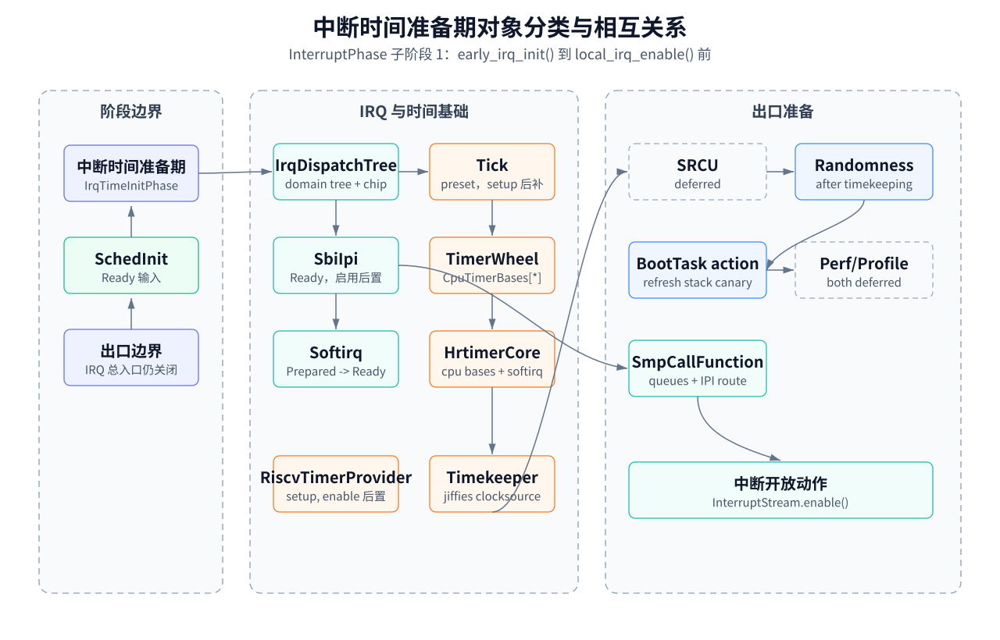
</p>

<p align="center">
  图 18 中断时间准备期对象分类与相互关系
</p>

图 18 用于说明 `InterruptPhase` 子阶段 1 的对象分类和依赖关系。左侧是阶段边界，中间是 IRQ、tick/timer、softirq 和 timekeeping 主线对象，右侧是 RNG、perf/profile、SMP call function 和出口 gate。

##### InterruptPhase 子阶段 1 过程处理清单（初稿）

| Linux 6.12.37 `start_kernel()` 调用 / 规格补充动作 | 规格处理 | 备注 |
|---|---|---|
| `early_irq_init()` | formal candidate: `IrqDispatchTree.preset()` | 建立 IRQ 分发所需的全局编号空间、默认 affinity、early IRQ 基础和实现承载槽位；`irq_desc` 暂作为实现细节。 |
| `init_IRQ()` | formal candidate: `IrqDispatchTree.setup()` | RISC-V64 初始化 irq stack/SCS，执行 `irqchip_init()` 建立 `IrqDomain` 树并关联 `IrqChip`，设置架构 IRQ 入口，并驱动 `SbiIpi.preset/setup()`；`SbiIpi.enable()` 留给后续 IPI 正式启用边界。 |
| `tick_init()` | formal candidate: `Tick.preset()` | 建立 Tick 控制对象的基础壳和 broadcast/oneshot mask；当前 `CONFIG_NO_HZ_FULL=n`，`tick_nohz_init()` 为 trimmed/no-op。 |
| `rcu_init_nohz()` | trimmed/no-op | 当前 `CONFIG_RCU_NOCB_CPU` 未启用且 `CONFIG_NO_HZ_FULL=n`；未来可恢复为 `RcuCore.configure_nohz()` action。 |
| `init_timers()` | formal candidate: `TimerWheel.setup()` | 建立全局 `TimerWheel` 下的 per-CPU `CpuTimerBases[*]`，初始化 `BootInitTask.PosixCpuTimerWork`，并注册 `TIMER_SOFTIRQ`。 |
| `srcu_init()` | deferred | `CONFIG_TREE_SRCU=y`，有实质作用但当前暂不展开；依赖 `RcuCore` 已建立 `rcu_gp_wq/sync_wq`，并要求 `TimerWheel.state == Ready`。 |
| `hrtimers_init()` | formal candidate: `HrtimerCore.setup()` | `CONFIG_HIGH_RES_TIMERS=y`，准备 boot CPU hrtimer base 并注册 `HRTIMER_SOFTIRQ`；具体 `HrtimerInstance` 由使用者对象拥有。 |
| `softirq_init()` | formal candidate: `Softirq.setup()` | 建立 tasklet queues，注册 tasklet softirq，并确认 pending 状态和运行条件；异步执行仍等中断打开。 |
| `timekeeping_init()` | formal candidate: `Timekeeper.setup()` | 驱动 `ClocksourceCore.preset()` 与 `JiffiesClocksource.preset()`，初始化 `tk_core.timekeeper`、shadow/fast timekeeper、初始 wall/monotonic/raw 时间，并把当前 clocksource 绑定为 `JiffiesClocksource`。 |
| `time_init()` | formal candidate: `RiscvTimerProvider.setup()` | 从正式 DeviceTree 读取 `timebase-frequency`，执行 `of_clk_init(NULL)` 和 `timer_probe()`，建立 RISC-V clocksource、clockevent、timer IRQ mapping 和 hotplug hook；预留 `enable()`，当前不要求 clocksource 交接或 timer interrupt 服务运行。 |
| `random_init()` | formal candidate: `Randomness.setup()` | 承接 `Randomness.Prepared`，在 timekeeper 可用后混入时间/cycle/latent entropy，处理 CRNG ready/reseed，并注册 random PM notifier，使 RNG 基础进入启动期 `Ready`。 |
| `boot_init_stack_canary()` | action/checkpoint: `BootInitTask.refresh_stack_canary(Randomness)` | 使用完整 RNG 刷新 `BootInitTask/current.stack_canary`；它是属性刷新动作，不推进顶层对象生命周期。 |
| `perf_event_init()` | deferred | `CONFIG_PERF_EVENTS=y`，有实质 generic perf core 初始化，但不是当前最小启动闭环关键功能；后续恢复为 `PerfCore.setup()`，RISC-V 硬件 PMU provider 留给 initcall 阶段。 |
| `profile_init()` | deferred | `CONFIG_PROFILING=y`，但默认未启用 `profile=` 时直接返回；后续支持 kernel profiling 参数时再恢复为 `KernelProfiler.setup()`。 |
| `call_function_init()` | formal candidate: `SmpCallFunction.setup()` | 建立 `CallSingleQueueSet` 与 boot CPU `CallFunctionData`，并关联 `SbiIpi/IpiMux` 的 `IPI_CALL_FUNC` 路由；不启动 secondary CPU。 |
| `WARN(!irqs_disabled(), ...)` / `early_boot_irqs_disabled = false` | checkpoint | 合并为中断开放前的出口事实：确认此刻中断仍关闭，并清除 early boot 禁止标记。 |
| `local_irq_enable()` | formal candidate: `InterruptStream.enable()` | 设置 RISC-V `sstatus.SIE` 中断总开关，打开 boot CPU 本地中断接收路径，记录 `BootCPU.local_irq_enabled == true`；`sie/sip` 仍作为具体中断类型子开关/挂起位处理，不新建 `IrqEnableGate` 对象，也不自动推进 tick/softirq/IPI 使用者到 `Online`。 |

<p align="center">
  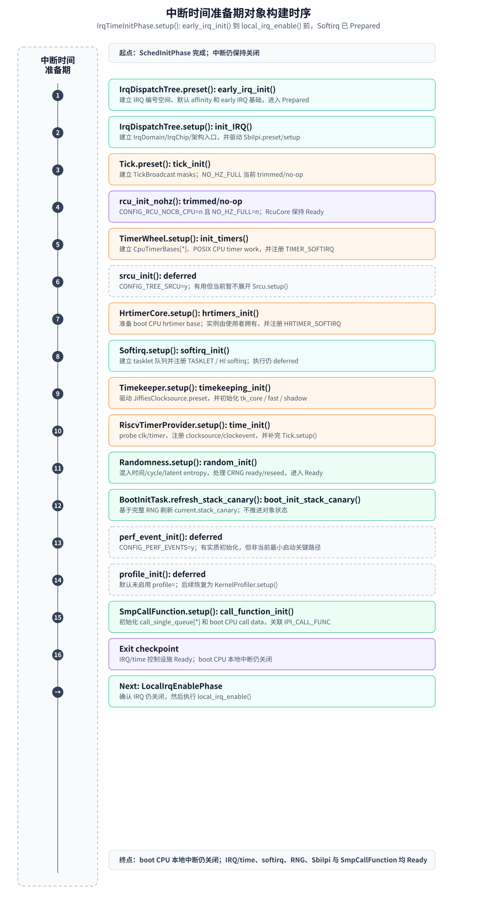
</p>

<p align="center">
  图 19 中断时间准备期对象构建时序
</p>

图 19 按 Linux 6.12.37 `start_kernel()` 中 `early_irq_init()` 到 `local_irq_enable()` 完成的有效调用顺序展示 `InterruptPhase` 子阶段 1 的推进过程；`Softirq.preset()` 已在上一子阶段完成，本图只展示 `softirq_init()` 对应的 `Softirq.setup()`。蓝色节点表示 IRQ/timer/timekeeping 相关主线候选，绿色节点表示其它主线 formal 候选，灰色节点表示 deferred 路径，紫色节点表示 checkpoint。

本子阶段的结束状态暂定至少包含：

- `SchedInitPhase.state == Ready`
- `IrqDispatchTree.state == Ready`，表示 IRQ 分发树、`IrqDomain` 层级、RISC-V irq stack、关联 `IrqChip` 和 SBI IPI 基础已建立
- `SbiIpi.state == Ready`，表示 `RV_IRQ_SOFT` 映射、IPI mux、虚拟 IPI range、chained handler 与 hotplug hook 已建立；`SbiIpi.enable()` 尚未执行
- `Tick.state == Ready`，表示 `Tick.preset()` 已建立 broadcast/oneshot mask，后续 `RiscvTimerProvider.setup()` 已补完 boot CPU tick device 与 hrtimer broadcast clockevent；`Tick.enable()` 尚未执行
- `TimerWheel.state == Ready`
- `Srcu` 当前 deferred，不作为本子阶段 formal 结束状态要求；后续恢复时再要求 `Srcu.state == Ready`
- `HrtimerCore.state == Ready`
- `Softirq.state == Ready`
- `Timekeeper.state == Ready`
- `JiffiesClocksource.state == Prepared`，且 `Timekeeper.current_clocksource == JiffiesClocksource`
- `RiscvTimerProvider.state == Ready`，并已注册 `RiscvClocksource`、建立 `RiscvClockevent`、timer IRQ mapping 和 hotplug hook；`RiscvTimerProvider.enable()` 尚未执行，切换为当前 clocksource 留给后续 `clocksource_done_booting()`
- `Randomness.state == Ready`，表示已经从核心准备期的 `Prepared` 经 `random_init()` 推进到启动期可用边界
- `BootInitTask.stack_canary_refreshed == true`
- `SmpCallFunction.state == Ready`，表示 per-CPU `CallSingleQueueSet` 已初始化，boot CPU `CallFunctionData` 已准备完成，并已关联 `IPI_CALL_FUNC` 投递路由；`SmpCallFunction.enable()` 尚未执行
- `early_boot_irqs_disabled == false`
- `InterruptStream.state == Online`，限定为 boot CPU 本地中断总入口已经通过 `sstatus.SIE` 开放
- `BootCPU.local_irq_enabled == true`

至此，`InterruptPhase` 的边界打开子阶段结束。boot CPU 本地中断总入口已经开放，常规流仍是单根启动初始化流，但已经可能被中断流打断。

#### InterruptPhase 子阶段 2：中断开放后准备期（IRQ-Open Prepare Subphase）

`InterruptPhase` 的第二个子阶段暂名 `IrqOpenPreparePhase`，中文名为中断开放后准备期。它对应 Linux 6.12.37 `start_kernel()` 中从 `kmem_cache_init_late()` 开始，到 `arch_cpu_finalize_init()` 完成后、`pid_idr_init()` 执行前的初始化段。

这个边界承接 `IrqTimeInitPhase` 的出口事实：`early_boot_irqs_disabled == false` 已经成立，且 boot CPU 本地中断总入口已经开放。此时 secondary hart 仍未启动，普通任务切换和完整并发运行仍未展开；但 timer interrupt、softirq、IPI 路由等前一阶段建立的控制结构，已经需要在“中断可能到来”的语义下被解释。

从边界上看，本子阶段的输入至少包括：

- `IrqTimeInitPhase.state == Ready`
- `InterruptStream.state == Online`
- `IrqDispatchTree.state == Ready`
- `SbiIpi.state == Ready`
- `Tick.state == Ready`
- `TimerWheel.state == Ready`
- `HrtimerCore.state == Ready`
- `Softirq.state == Ready`
- `Timekeeper.state == Ready`
- `RiscvTimerProvider.state == Ready`
- `SmpCallFunction.state == Ready`
- `Workqueue.state == Prepared`
- `SlubAllocator.state == Ready`
- `PageAllocator.state == Ready`
- `PerCpuStorage.state == Ready`
- `PrintkBuffer.state == Ready`
- `early_boot_irqs_disabled == false`
- `BootCPU.local_irq_enabled == true`

选择在 `arch_cpu_finalize_init()` 后结束，是为了把“中断打开后的 late core/platform 准备”与后续“进程准备”分开。`pid_idr_init()` 之后进入的是 PID、VMA、fork、proc、namespace、VFS/security、cgroup 等对象基础设施的连续初始化段，虽然其中包含若干通用内核对象初始化，但主线语义更接近为第一个内核线程、`kthreadd` 和后续用户态 init 建立进程/任务基础，适合作为 `InterruptPhase` 子阶段 3 的自然起点。后续子阶段可暂按 `ProcessPreparePhase`（进程准备期）继续讨论，具体边界和命名仍以后续收敛结果为准。

当前 Linux 参照配置以 `~/gitStudy/linux-6.12.37/default_config` 为准。与本子阶段相关的关键配置包括：`CONFIG_SLUB=y`、`CONFIG_SLUB_TINY=n`、`CONFIG_PRINTK=y`、`CONFIG_TTY=y`、`CONFIG_VT=y`、`CONFIG_SERIAL_CORE_CONSOLE=y`、`CONFIG_GENERIC_SCHED_CLOCK=y`、`CONFIG_RISCV_TIMER=y`。同时，当前未启用 `CONFIG_LOCKDEP`、`CONFIG_DEBUG_LOCKING_API_SELFTESTS`、`CONFIG_BLK_DEV_INITRD`、`CONFIG_NUMA`、`CONFIG_ACPI` 和 `CONFIG_ARCH_HAS_CPU_FINALIZE_INIT`。因此，本阶段图示和清单先按该配置区分主线 formal、checkpoint 与裁剪 no-op 路径。

当前先将 `InterruptPhase` 子阶段 2 的对象和边界记录如下：

1. `中断开放后准备期对象`（暂名 `IrqOpenPreparePhase`）：属于阶段对象，是 `InterruptPhase` 的第二个子阶段对象。它从 `IrqTimeInitPhase.Ready` 接续，即 boot CPU 本地中断总入口已经开放；随后按 `kmem_cache_init_late()` 到 `arch_cpu_finalize_init()` 调用点完成的有效顺序编排对象推进，并以“下一步进入进程准备期”为完成边界。
2. `SLUB flush workqueue 资源`：覆盖 `kmem_cache_init_late()`。它不是独立生命周期对象，而是 `SlubAllocator` 的内部 workqueue 资源事实：依赖 `SlubAllocator.Ready`、`KmallocCaches.Ready` 和 `Workqueue.Prepared`，通过 `alloc_workqueue("slub_flushwq", WQ_MEM_RECLAIM, 0)` 建立后续 flush CPU slab 使用的 workqueue 句柄，并记录 `SlubAllocator.flush_workqueue_ready == true`。它不把 `SlubAllocator` 推进到 `Online`；Linux 内部 `slab_state = FULL` 仍留给后续 `slab_sysfs_init()` / `SlubAllocator.enable()`。
3. `Console 对象`：覆盖 `console_init()`。这是正式 `Console` 对象的首次构造点，因此当前建模为 `Console.preset()`，使对象进入 `Prepared`。它承接已经可用的 `PrintkBuffer` 和早期 console 输出条件，先驱动 `TtyLineDisciplineRegistry.preset()`，把静态 `NTtyLineDiscipline`（Linux `n_tty_ops`）注册到 `N_TTY` slot；随后读取 `Lds` 提供的 `__con_initcall_start..__con_initcall_end` console initcall 表边界，驱动当前配置下的 `ConsoleDriver` 对象执行 early register。该过程可能注册可用的 real console，并在 real console 成为 `CON_CONSDEV` 时触发 early/boot console handoff；但由于此时仍早于很多 bus/device probe，设备树上的真实串口 console 不保证已经完整 probe，复杂设备 probe、boot console 注销和完整 console handoff 都不能作为本阶段必然后置条件。
4. `panic_later checkpoint`：覆盖 `console_init()` 之后的 `if (panic_later) panic(...)`。这是对过多 boot 参数等早期异常的延迟失败处理，只作为阶段内 checkpoint 或 fail boundary，不建立对象。
5. `Lockdep / LockingSelftest 路径`：覆盖 `lockdep_init()` 和 `locking_selftest()`。当前 `CONFIG_LOCKDEP=n` 且 `CONFIG_DEBUG_LOCKING_API_SELFTESTS=n`，二者均为空实现或裁剪路径。未来启用后，可恢复为 `Lockdep.setup()` 与 `LockingSelftest.run()`；其中 selftest 必须放在中断已经打开后，因为它要测试 hard/soft IRQ 开关组合下的锁依赖场景。
6. `Initrd bounds checkpoint`：覆盖 `CONFIG_BLK_DEV_INITRD` 下的 initrd 覆盖检查。当前 `CONFIG_BLK_DEV_INITRD=n`，该代码块不进入主线；未来启用 initrd 后，可建模为 `Initrd.check_bounds()` checkpoint，用于确认 initrd 没有落到已被普通页分配器覆盖的范围，否则清除 `initrd_start`。
7. `PageAllocator per-CPU pageset 缓存路径`：覆盖 `setup_per_cpu_pageset()`。它是页分配器 `setup()` slot 中与 per-CPU 快速路径缓存相关的后续细项，负责把前序 boot pageset 占位替换为每个 populated zone 的正式 per-zone/per-CPU pageset，并为 online `pgdat` 分配 per-CPU nodestat；当前 `CONFIG_NUMA=n` 下跳过 NUMA 统计清零分支。由于当前规格暂不实现完整 buddy/PCP 快速分配路径，本调用先记为 `deferred: PageAllocator.setup()`，不引入 `setup_percpu_pagesets` 等非标准 slot，也不在本子阶段重复推进 `PageAllocator.state`。
8. `NumaPolicy 路径`：覆盖 `numa_policy_init()`。当前 `CONFIG_NUMA=n`，该调用在头文件中折叠为空实现，不建立对象。未来启用 NUMA 后，可恢复为 `NumaPolicy.setup()`，建立 mempolicy cache、shared policy node cache、preferred/interleave/default policy 等对象。
9. `ACPI early 路径`：覆盖 `acpi_early_init()`。当前 `CONFIG_ACPI=n`，该调用为空实现，RISC-V 当前主线仍使用 DeviceTree 路径。未来启用 ACPI 后，可恢复为 `AcpiCore.setup()`，但需要先和已有 `DeviceTree` 引导对象的并列关系讨论清楚。
10. `late_time_init hook`：覆盖 `if (late_time_init) late_time_init()`。当前 RISC-V 路径未设置该 hook，按 trimmed/no-op 处理；RISC-V timer provider 已在前一子阶段通过 `time_init()` 完成。未来若某架构设置该 hook，应按具体 provider 建模，而不是新建一个抽象的 `LateTimeInit` 顶层对象。
11. `SchedClock 对象`：覆盖 `sched_clock_init()`。它是 generic sched clock core，不是 `RiscvTimerProvider` 的子对象。在当前 `CONFIG_GENERIC_SCHED_CLOCK=y` 且未启用 unstable sched clock 路径下，它打开 `sched_clock_running` static key，并在临时关闭本地中断的窗口内执行 `generic_sched_clock_init()`：若此时没有 provider 已注册硬件 reader，则使用 jiffies fallback 作为 sched clock reader，然后初始化并启动维护 epoch/wrap 的 `sched_clock_timer` hrtimer。该过程使调度时间戳读数进入启动期可用状态，但不改变本阶段“中断已开放”的边界事实。
12. `DelayLoop 对象`：覆盖 `calibrate_delay()`。它是 busy-wait delay API 的基础设施对象，不是 timer provider 或 clocksource。`DelayLoop.setup()` 消费前一子阶段 `RiscvTimerProvider.setup()` 写入的 `lpj_fine = riscv_timebase / HZ`，在当前 RISC-V 路径下通常跳过实际 busy-loop 校准，直接设置 boot CPU `cpu_loops_per_jiffy` 与全局 `loops_per_jiffy`，使对象进入 `Ready`。后续 `DelayLoop.delay_cycles(cycles)`、`DelayLoop.udelay(usec)`、`DelayLoop.ndelay(nsec)` 和 `DelayLoop.mdelay(msec)` 是运行期 API/action，只要求 `DelayLoop.Ready`，不再推进生命周期状态。
13. `Arch CPU finalize 路径`：覆盖 `arch_cpu_finalize_init()`。当前 RISC-V 未启用 `CONFIG_ARCH_HAS_CPU_FINALIZE_INIT`，该调用为空 inline，只作为本子阶段出口前的 trimmed/no-op 调用点保留；它完成后，下一个 Linux 调用 `pid_idr_init()` 进入 `InterruptPhase` 子阶段 3。

<p align="center">
  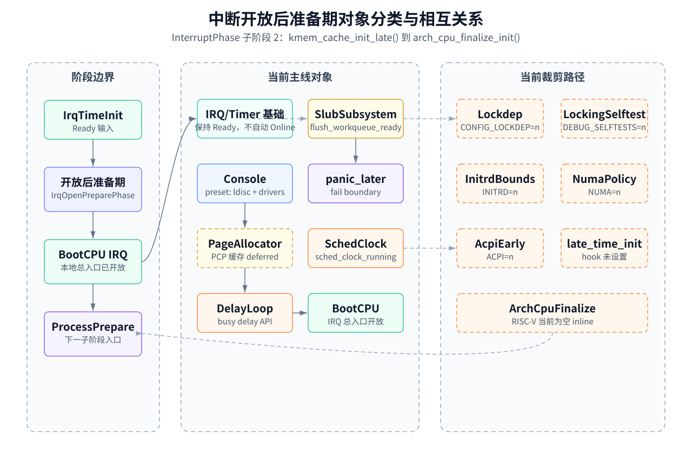
</p>

<p align="center">
  图 20 中断开放后准备期对象分类与相互关系
</p>

图 20 用于说明 `InterruptPhase` 子阶段 2 的对象分类和依赖关系。左侧是阶段边界，中间是当前主线 formal 候选对象以及 deferred 候选，右侧是当前配置下的 trimmed/no-op 路径以及 `InterruptPhase` 子阶段 3 的自然入口。图中对象仍是初步分类，后续逐个过程讨论后可以继续拆分、合并或降级为 checkpoint。

##### InterruptPhase 子阶段 2 过程处理清单（初稿）

| Linux 6.12.37 `start_kernel()` 调用 / 规格补充动作 | 规格处理 | 备注 |
|---|---|---|
| `kmem_cache_init_late()` | action: `SlubAllocator.setup_flush_workqueue()` | 在 `Workqueue.Prepared` 基础上创建 `"slub_flushwq"`，记录 `SlubAllocator.flush_workqueue_ready == true`，服务后续 SLUB flush；不建立独立 `SlubFlushWq` 生命周期对象，`SlubAllocator.enable()` 仍留给后续 `slab_sysfs_init()`。 |
| `console_init()` | formal candidate: `Console.preset()` | 首次构造正式 `Console`：注册 `NTtyLineDiscipline` 到 `TtyLineDisciplineRegistry`，遍历 `Lds` 提供的 console initcall 表边界，驱动 console drivers early register；real console 注册和 early/boot console handoff 是条件结果，不作为必然后置条件。 |
| `if (panic_later) panic(...)` | checkpoint/fail boundary | 延迟处理早期 boot 参数异常；不建立对象。 |
| `lockdep_init()` | trimmed/no-op | 当前 `CONFIG_LOCKDEP=n`，为空实现；未来启用后恢复为 `Lockdep.setup()`。 |
| `locking_selftest()` | trimmed/no-op | 当前 `CONFIG_DEBUG_LOCKING_API_SELFTESTS=n`；启用后应作为中断开放后的 selftest action。 |
| `CONFIG_BLK_DEV_INITRD` 下的 initrd 位置检查 | trimmed | 当前 `CONFIG_BLK_DEV_INITRD=n`；未来启用 initrd 后恢复为 `Initrd.check_bounds()` checkpoint。 |
| `setup_per_cpu_pageset()` | deferred: `PageAllocator.setup()` | 页分配器 `setup()` 中 per-CPU 快速路径缓存相关的后续细项：为 populated zones 建立长期 per-CPU pageset 和 per-node per-CPU nodestat；当前暂不实现完整 buddy/PCP 快速分配路径，因此不引入新 slot，也不建立独立结束状态。 |
| `numa_policy_init()` | trimmed/no-op | 当前 `CONFIG_NUMA=n`，头文件内为空实现；未来启用 NUMA 后恢复为 `NumaPolicy.setup()`。 |
| `acpi_early_init()` | trimmed/no-op | 当前 `CONFIG_ACPI=n`，RISC-V 主线使用 DeviceTree；未来启用 ACPI 后需先讨论与 `DeviceTree` 对象的关系，并恢复为标准 `AcpiCore.setup()`。 |
| `if (late_time_init) late_time_init()` | trimmed/no-op | 当前 RISC-V 未设置 `late_time_init` hook；不建立抽象顶层对象。 |
| `sched_clock_init()` | formal candidate: `SchedClock.setup()` | 启动 generic sched clock core，打开 `sched_clock_running` static key；若没有 provider reader，则使用 jiffies fallback，并启动 `sched_clock_timer` hrtimer。 |
| `calibrate_delay()` | formal candidate: `DelayLoop.setup()` | 建立 busy-wait delay API 的参数基础：使用 `lpj_fine` 设置 boot CPU `cpu_loops_per_jiffy` 和全局 `loops_per_jiffy`，通常跳过实际 delay loop 校准；`udelay/ndelay/mdelay` 是 Ready 后的 API/action。 |
| `arch_cpu_finalize_init()` | trimmed/no-op | 当前 RISC-V 未启用 `CONFIG_ARCH_HAS_CPU_FINALIZE_INIT`，该调用为空 inline；其后进入 `pid_idr_init()`。 |

<p align="center">
  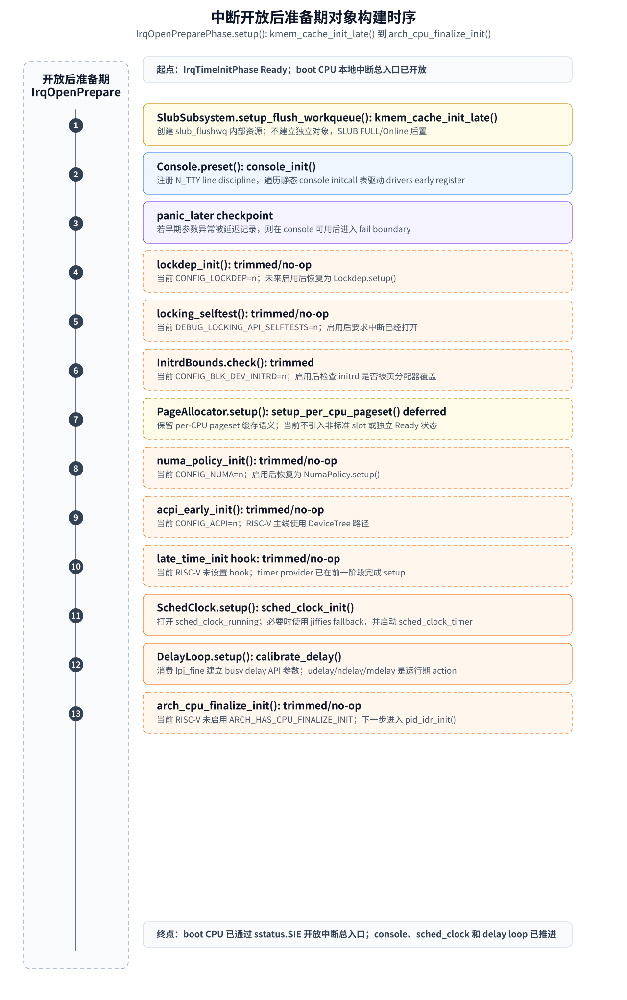
</p>

<p align="center">
  图 21 中断开放后准备期对象构建时序
</p>

图 21 按 Linux 6.12.37 `start_kernel()` 中 `kmem_cache_init_late()` 到 `arch_cpu_finalize_init()` 的有效调用顺序展示 `InterruptPhase` 子阶段 2 的推进过程。绿色节点表示当前主线 formal 候选，黄色虚线节点表示 deferred 候选，紫色节点表示 checkpoint 或 fail boundary，橙色虚线节点表示当前配置下 trimmed/no-op 的路径。

本子阶段的结束状态暂定至少包含：

- `IrqTimeInitPhase.state == Ready`
- `InterruptStream.state == Online`，限定为 boot CPU 本地中断总入口已经通过 `sstatus.SIE` 开放
- `BootCPU.local_irq_enabled == true`
- `early_boot_irqs_disabled == false`
- `IrqDispatchTree.state == Ready`，不要求进入新的生命周期状态
- `SbiIpi.state == Ready`，`SbiIpi.enable()` 尚未执行
- `Tick.state == Ready`，`Tick.enable()` 尚未执行
- `RiscvTimerProvider.state == Ready`，`RiscvTimerProvider.enable()` 尚未执行
- `Softirq.state == Ready`，`Softirq.enable()` 和实际异步执行边界后续讨论
- `SmpCallFunction.state == Ready`，跨 CPU callback 的真实运行仍等 secondary CPU bringup 和 IPI 使用边界
- `SlubAllocator.flush_workqueue_ready == true`
- `Console.state == Prepared`
- `TtyLineDisciplineRegistry.state == Prepared`，且 `NTtyLineDiscipline.registered == true`
- `ConsoleDriverSet.early_registered == true`，但不要求所有 console device 已完成 probe
- `ConsoleRegistry.has_real_console` 和 `EarlyCon.handoff` 为条件事实，不作为本子阶段固定结束要求
- `SchedClock.state == Ready`
- `DelayLoop.state == Ready`
- `Lockdep`、`LockingSelftest`、`InitrdBounds`、`NumaPolicy`、`AcpiEarly`、`late_time_init hook` 和 `ArchCpuFinalize` 均按当前配置记录为 trimmed/no-op
- 下一子阶段的起点是 `pid_idr_init()`，暂按 `ProcessPreparePhase` 继续讨论

`InterruptPhase` 子阶段 2 的逐项讨论已经收敛：当前规格只要求 console 进入正式对象准备边界、SLUB late flush workqueue 资源建立、generic sched clock 与 busy-wait delay API 进入可用边界；per-CPU pageset 快速路径缓存暂记为 `PageAllocator.setup()` 的 deferred 细项，当前配置下的 Lockdep、initrd、NUMA、ACPI、late time hook 和 arch CPU finalize 路径均不进入主线对象状态。后续讨论从 Linux `pid_idr_init()` 开始，进入 `InterruptPhase` 子阶段 3 `ProcessPreparePhase` 的边界和对象划分。

#### InterruptPhase 子阶段 3：进程准备期（Process Prepare Subphase）

`InterruptPhase` 的第三个子阶段暂名 `ProcessPreparePhase`，中文名为进程准备期。它对应 Linux 6.12.37 `start_kernel()` 中从 `pid_idr_init()` 开始，到 `kcsan_init()` 完成后、`rest_init()` 执行前的初始化段。

这个边界承接 `IrqOpenPreparePhase` 的出口事实：boot CPU 本地中断总入口已经开放，console、sched clock 和 busy-wait delay API 已经达到启动期可用边界，但系统仍处于单根启动初始化流中，尚未创建 PID 1、`kthreadd` 或进入调度/idle 运行路径。选择在 `rest_init()` 前结束，是因为 `rest_init()` 会创建 `kernel_init` 和 `kthreadd`，设置 `system_state = SYSTEM_SCHEDULING`，并让 boot idle thread 进入 `schedule_preempt_disabled()` / `cpu_startup_entry(CPUHP_ONLINE)`；因此它是从“为第一个任务准备对象基础设施”切换到“任务系统开始运行”的自然边界。

本子阶段的主线语义是为 `rest_init()` 创建第一个用户态初始化线程和内核线程管理者准备最小对象基础设施：PID、fork、thread stack、cred、anon VMA、proc caches、UTS namespace 壳、key/security 等对象在这一段进入可用或准备状态。当前还恢复 `vfs_caches_init()` 中的 `VfsCore.setup()` 与 `mnt_init()->init_mount_tree()` 对应的初始 rootfs mount：Linux 的 `rootfs_fs_type` 默认使用 ramfs backing，初始 mount tree 在此时建立，并设置当前 root/pwd 的起点。从 `dbg_late_init()` 到 `kcsan_init()` 的尾段按批量策略处理：当前配置下为空实现的路径标记为 trimmed/no-op；其它大多服务用户态应用启动后的 namespace、pagecache、proc/ns/pidfs、seq_file 或信号队列能力，当前保留 Linux 时序位置但标记为 deferred，不在本子阶段推进到 `Ready`。

当前 Linux 参照配置以 `~/gitStudy/linux-6.12.37/default_config` 为准。与本子阶段相关的关键配置包括：`CONFIG_THREAD_INFO_IN_TASK=y`、`CONFIG_VMAP_STACK=y`、`CONFIG_PER_VMA_LOCK=y`、`CONFIG_RISCV_ISA_V=y`、`CONFIG_RISCV_ISA_V_PREEMPTIVE=y`、`CONFIG_NAMESPACES=y`、`CONFIG_UTS_NS=y`、`CONFIG_PID_NS=y`、`CONFIG_NET=y`、`CONFIG_NET_NS=y`、`CONFIG_PROC_FS=y`、`CONFIG_KEYS=y`、`CONFIG_SECURITY=y`、`CONFIG_DEBUG_FS=y` 和 `CONFIG_UPROBES=y`。同时，当前未启用 `CONFIG_CGROUPS`、`CONFIG_TASKSTATS`、`CONFIG_TASK_DELAY_ACCT`、`CONFIG_ACPI`、`CONFIG_KCSAN`、`CONFIG_KGDB`、`CONFIG_LOCKDEP` 和 `CONFIG_X86`。因此，本阶段图示和清单先按该配置区分主线 formal、deferred、checkpoint 与裁剪 no-op 路径。

本子阶段后续逐项细化时，若某个 Linux 初始化调用只创建 cache、静态表项或基本承载壳，优先映射到对象的较早 slot，例如 `preset()` 并推进到 `Prepared`，把 `setup()`、`enable()` 等后续 slot 留给更完整的对象关系、运行期语义或正式启用动作。

当前先将 `InterruptPhase` 子阶段 3 的对象和边界记录如下：

1. `进程准备期对象`（暂名 `ProcessPreparePhase`）：属于阶段对象，是 `InterruptPhase` 的第三个子阶段对象。它从 `IrqOpenPreparePhase.Ready` 接续，按 `pid_idr_init()` 到 `kcsan_init()` 的有效顺序编排对象推进，并以“下一步进入 `rest_init()`，创建 PID 1 和 `kthreadd`”作为完成边界。
2. `根 PID namespace 对象`（暂名 `RootPidNamespace`）：覆盖 `pid_idr_init()`。当前建模为 `RootPidNamespace.setup()`：`BUILD_BUG_ON(PID_MAX_LIMIT >= PIDNS_ADDING)` 是编译期 checkpoint；`PidAllocator.configure_limits()` 基于 possible CPU 数更新全局 `pid_max/pid_max_min`；随后初始化静态 `init_pid_ns.idr`，并创建 level-0 `"pid"` SLUB cache 绑定到 `init_pid_ns.pid_cachep`，使根 PID namespace 具备为 `rest_init()` 后续任务分配 PID 的基础结构。`PidAllocator` 保留为 `RootPidNamespace` 关联的分配策略/API 面，承载后续 `alloc_pid()`、`free_pid()`、`find_pid_ns()` 等运行期动作，不作为本调用推进到 `Ready` 的顶层对象。
3. `匿名内存反向映射核心对象`（暂名 `AnonVmaCore`）：覆盖 `anon_vma_init()`。它是匿名内存 rmap graph 的管理核心，用来维护匿名 folio/page 反向定位相关 `Vma` 的关系，而不是普通 VMA cache 的附属品。运行期中，`Vma` 通过 `AnonVmaChain` 连接到 `AnonVma` 节点，匿名 folio/page 再通过 mapping 标记间接指向 `AnonVma`，使 COW、unmap、migration、reclaim、memory failure 和 rmap walk 等路径能够找到所有相关映射。`anon_vma_init()` 当前只创建 `anon_vma` 与 `anon_vma_chain` 两类 cache，使这套图结构的分配基础进入 `Ready`；具体 `AnonVma` 实例和链接关系留给 VMA fault、fork/link 等运行期动作建立。
4. `任务创建核心对象`（暂名 `TaskCreationCore`）的线程栈准备：覆盖 `thread_stack_cache_init()`。当前 `CONFIG_VMAP_STACK=y`，该调用建模为 `TaskCreationCore.preset()`：创建 `TaskCreationCore.thread_stack_cache` 属性/子资源，为后续 `kernel_init`、`kthreadd` 和普通任务分配内核线程栈提供缓存基础。它不是独立顶层对象，也不是 SLUB 的生命周期推进。
5. `凭据核心对象`（暂名 `CredentialCore`）：覆盖 `cred_init()`，当前建模为 `CredentialCore.preset()`。它只创建 `cred` cache，为 task credential 的复制、替换和内核凭据构造准备分配基础；静态 `init_cred` 不是在此处创建，keyring、LSM security、user namespace、group info 和 ucounts 等也只是后续凭据对象会引用的关联对象，不是 `CredentialCore` 的子对象。完成后 `CredentialCore.state == Prepared`，后续 `setup()` 留给更完整的凭据对象关系和运行期语义。
6. `任务创建核心对象`（暂名 `TaskCreationCore`）的正式 setup：覆盖 `fork_init()`。它创建 `task_struct` cache，执行架构 task cache 初始化，设置 `max_threads`，更新 `init_task` 的 `RLIMIT_NPROC/RLIMIT_SIGPENDING`，并设置 `init_user_ns` 的 ucount/rlimit 上限；当前 `CONFIG_VMAP_STACK=y` 下还登记 fork vm stack cache hotplug 回调。完成后，`TaskCreationCore.state == Ready`，`rest_init()` 才能安全创建 `kernel_init` 与 `kthreadd`。`TaskCreationCore` 只表示 task 创建核心，不拥有 `RootPidNamespace`、`CredentialCore`、`SignalCore`、`TaskFileContext`、`VmaCore` 或 `NsProxy`，而是在创建 task 时依赖它们。RISC-V 的 `arch_task_cache_init()` 在此调用链中驱动 `VectorContext.preset()`：当前 `CONFIG_RISCV_ISA_V=y` 且硬件 `has_vector()` 成立时，创建 user vector context cache；当前 `CONFIG_RISCV_ISA_V_PREEMPTIVE=y` 时还创建 kernel vector context cache。
7. `用户探针核心对象`（暂名 `UprobeCore`）：覆盖 `fork_init()` 尾部的 `uprobes_init()`。虽然 Linux 将该调用放在 `fork_init()` 内部，但它语义上是独立的调试/插桩基础设施，初始化 uprobes hash mutex 并注册 die notifier，不应作为 `TaskCreationCore` 的子对象。当前 `CONFIG_UPROBES=y`，建模为 `UprobeCore.setup()` 并推进到 `Ready`。
8. `信号核心对象`（暂名 `SignalCore`）的准备动作：覆盖 `proc_caches_init()` 中的 `sighand_cache` 与 `signal_cache`。这一步只为 `sighand_struct` 和 `signal_struct` 准备分配基础，建模为 `SignalCore.preset()`，完成后 `SignalCore.state == Prepared`；后续 `signals_init()` 当前按尾段批量策略 deferred，不在本子阶段推进到 `Ready`。
9. `任务文件上下文对象`（暂名 `TaskFileContext`）：覆盖 `proc_caches_init()` 中的 `files_cache` 与 `fs_cache`。它为每个 task 的 `files_struct` 与 `fs_struct` 准备分配基础，承载 fd table 引用、root/pwd 等 task 局部文件上下文；它引用 VFS 对象，但不是 `VfsCore` 的子对象。当前只建 cache，建模为 `TaskFileContext.preset()` 并推进到 `Prepared`。
10. `VMA 核心对象`（暂名 `VmaCore`）：覆盖 `proc_caches_init()` 中的 `vm_area_struct` cache、当前 `CONFIG_PER_VMA_LOCK=y` 下的 `vma_lock` cache，以及 `mmap_init()` 对 `vm_committed_as` percpu counter 的初始化。它属于用户虚拟地址空间映射基础，和前序 `MmStructCache` 关联但不混同；当前建模为 `VmaCore.preset()` 并推进到 `Prepared`。
11. `namespace proxy 对象`（暂名 `NsProxy`）：覆盖 `proc_caches_init()` 中的 `nsproxy_cache_init()`。`NsProxy` 是 task 指向各类 namespace 实例的聚合引用对象，不是 `UtsNamespace` 或 `NetNamespace` 的子对象；当前只创建 `nsproxy` cache，建模为 `NsProxy.preset()` 并推进到 `Prepared`。
12. `namespace 基础对象集合`：覆盖 `uts_ns_init()` 与后续 `net_ns_init()`，并和 `NsProxy` 形成关联。当前 `CONFIG_UTS_NS=y` 时，`uts_ns_init()` 建模为 `UtsNamespace.preset()`：它只创建 `"uts_namespace"` usercopy cache，供后续 `copy_utsname(CLONE_NEWUTS)` 动态创建 UTS namespace 使用；静态根对象 `init_uts_ns` 不是在此处创建，`get/put/free_uts_ns()`、`proc_ns_operations` 和 hostname/domainname sysctl 等运行期语义留给后续 `setup()` 或运行期 action。当前 `CONFIG_NET_NS=y` 下 `net_ns_init()` 有实质初始化，但位于 `dbg_late_init()` 之后，按本轮批量策略标记为 `NetNamespace.setup()` deferred。
13. `权限与安全对象集合`：覆盖 `key_init()` 和 `security_init()`。`KeyringCore.setup()` 创建 `key_jar` cache，登记内建 key type registry 中的 `keyring/dead/user/logon` 四类基础 key type，并把静态 `root_key_user` 插入 `key_user_tree`，使 key 分配、key type 查找和 root key quota tracking 具备基础可用性；当前 `CONFIG_PERSISTENT_KEYRINGS=n`，persistent keyring 不进入主线。`SecurityCore.setup()` 在 kmalloc 可用后追加 early LSM 名称，解析 `CONFIG_LSM` 与启动参数形成 `ordered_lsms`，计算 cred/file/inode/task/key/sock 等对象的 `LsmBlobLayout`，必要时创建 `lsm_file_cache` 与 `lsm_inode_cache`，为当前 task/cred 补齐 early LSM state，并初始化已启用 LSM，使其通过 `security_add_hooks()` 注册到 `LsmHookDispatcher`/static call table。当前 `CapabilityLsm` 作为 `LSM_ORDER_FIRST` 稳定进入主线；`SelinuxLsm`、`AppArmorLsm` 等虽然可被编译进内核，但默认 `CONFIG_LSM` 未选中时只作为条件候选，不画成当前主线对象。二者都不是 `CredentialCore` 的子对象，但会被凭据、文件和进程访问控制路径引用。
14. `VFS 与进程可见文件系统对象集合`：覆盖 `vfs_caches_init()`、`pagecache_init()`、`seq_file_init()`、`proc_root_init()`、`nsfs_init()` 和 `pidfs_init()`。当前 `VfsCore.setup()` 建立 VFS 文件系统类型注册表、mount 表、dentry/inode/file 表等最小承载；`RamFsType.setup()` 表示 rootfs 默认 ramfs backing；随后 `VfsCore.MountInitialRamFsRoot` 对应 Linux `mnt_init()->init_mount_tree()`，建立初始 rootfs mount、superblock、root dentry/root inode 和当前 root 起点。`PageCache`、`SeqFileCore`、`Procfs`、`Nsfs`、`Pidfs` 仍作为候选对象保留 Linux 时序位置，但本轮不推进到 `Ready`。
15. `信号核心对象`（暂名 `SignalCore`）的正式 setup：覆盖 `signals_init()`。它先执行 `siginfo_buildtime_checks()`，再创建 `sigqueue` cache，使 task signal delivery 和 queued signal 分配路径的基础结构完整；当前按尾段批量策略标记为 deferred，`SignalCore` 保持前序 `Prepared`。
16. `控制与统计裁剪路径`：覆盖 `cpuset_init()`、`cgroup_init()`、`taskstats_init_early()` 和 `delayacct_init()`。当前 `CONFIG_CGROUPS=n`、`CONFIG_TASKSTATS=n` 且 `CONFIG_TASK_DELAY_ACCT` 未启用，相关调用为空实现或裁剪路径；未来启用后再恢复为 `Cpuset.setup()`、`CgroupCore.setup()`、`Taskstats.setup()` 与 `DelayAccounting.setup()`。
17. `尾部平台/调试裁剪路径`：覆盖 X86 EFI runtime 切换、`dbg_late_init()`、`acpi_subsystem_init()`、`arch_post_acpi_subsys_init()` 和 `kcsan_init()`。当前 RISC-V/default_config 下分别因 `CONFIG_X86=n`、`CONFIG_KGDB=n`、`CONFIG_ACPI=n` 和 `CONFIG_KCSAN=n` 进入 trimmed/no-op；这些调用保留位置，但不作为本阶段主线结束状态。

<p align="center">
  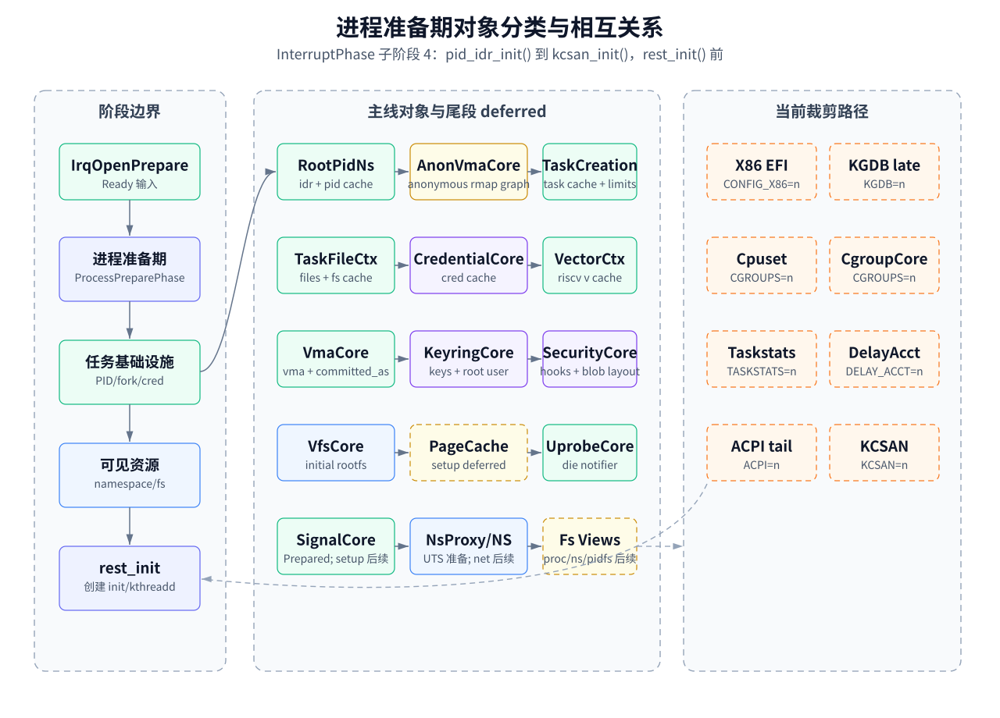
</p>

<p align="center">
  图 22 进程准备期对象分类与相互关系
</p>

图 22 用于说明 `InterruptPhase` 子阶段 3 的对象分类和依赖关系。左侧是阶段边界和 `rest_init()` 前的出口条件，中间保留当前主线 formal 对象和尾段 deferred 候选对象，右侧是当前配置下的 trimmed/no-op 路径。图中对象仍是初步分类，后续逐个过程讨论后可以继续拆分、合并或降级为 checkpoint。

##### InterruptPhase 子阶段 3 过程处理清单（初稿）

| Linux 6.12.37 `start_kernel()` 调用 / 规格补充动作 | 规格处理 | 备注 |
|---|---|---|
| `pid_idr_init()` | formal candidate: `RootPidNamespace.setup()` | 初始化静态 `init_pid_ns.idr`，创建 level-0 `"pid"` cache，并通过关联的 `PidAllocator.configure_limits()` 设置 `pid_max/pid_max_min`；新 PID namespace 的创建留给后续运行期。 |
| `anon_vma_init()` | formal candidate: `AnonVmaCore.setup()` | 创建 `anon_vma` 与 `anon_vma_chain` cache，为匿名内存 rmap graph 准备分配基础；具体节点和链路由后续 fault/fork/link 等动作建立。 |
| X86 EFI runtime switch | trimmed | 当前 `CONFIG_X86=n`，RISC-V 不进入 `efi_enter_virtual_mode()`。 |
| `thread_stack_cache_init()` | formal candidate: `TaskCreationCore.preset()` | 当前 `CONFIG_VMAP_STACK=y`，创建 `TaskCreationCore.thread_stack_cache`；不建立独立 `ThreadStackCache` 顶层对象。 |
| `cred_init()` | formal candidate: `CredentialCore.preset()` | 只创建 `cred` cache，使凭据生命周期基础进入 `Prepared`；完整对象关系和 key/security 语义留给后续 slot。 |
| `fork_init()` | formal candidate: `TaskCreationCore.setup()` | 先创建 `task_struct` cache，随后通过 `arch_task_cache_init()` 驱动架构 task cache 初始化，再设置 `max_threads`、`init_task` rlimit 和 `init_user_ns` ucount/rlimit，并登记 vm stack hotplug 回调。 |
| `arch_task_cache_init()` / `riscv_v_setup_ctx_cache()` | nested formal: `VectorContext.preset()` | RISC-V vector 可用时创建 user vector context cache；当前 `CONFIG_RISCV_ISA_V_PREEMPTIVE=y` 时还创建 kernel vector context cache。 |
| `scs_init()` in `fork_init()` | trimmed/no-op | 当前未启用 shadow call stack，`scs_init()` 不形成主线对象状态。 |
| `lockdep_init_task(&init_task)` in `fork_init()` | trimmed/no-op | 当前未启用 `CONFIG_LOCKDEP`，该动作不形成主线对象状态；启用后应作为 lockdep 对 `BootInitTask` 的状态初始化。 |
| `uprobes_init()` in `fork_init()` | nested formal: `UprobeCore.setup()` | 当前 `CONFIG_UPROBES=y`，初始化 uprobes hash mutex 并注册 die notifier；它是独立调试/插桩核心，不是 `TaskCreationCore` 子对象。 |
| `proc_caches_init()` | Linux aggregate, no object | 规格层不建立 `ProcessResourceCaches` 顶层对象；由 `ProcessPreparePhase.setup()` 在此位置直接驱动下列对象的 `preset()`。 |
| `sighand_cache` / `signal_cache` in `proc_caches_init()` | nested formal: `SignalCore.preset()` | 创建 `sighand_struct` 与 `signal_struct` cache；`SignalCore` 暂到 `Prepared`，等待后续 `signals_init()`。 |
| `files_cache` / `fs_cache` in `proc_caches_init()` | nested formal: `TaskFileContext.preset()` | 创建 `files_struct` 与 `fs_struct` cache，为 task 文件描述符表和 root/pwd 上下文准备承载。 |
| `vm_area_struct` / `vma_lock` cache and `mmap_init()` | nested formal: `VmaCore.preset()` | 创建 VMA 与 per-VMA lock cache，并初始化 `vm_committed_as` overcommit 计数器。 |
| `nsproxy_cache_init()` | nested formal: `NsProxy.preset()` | 创建 `nsproxy` cache；`NsProxy` 是 task 到各 namespace 实例的聚合引用对象。 |
| `uts_ns_init()` | formal candidate: `UtsNamespace.preset()` | 当前 `CONFIG_UTS_NS=y`，只创建 `uts_namespace` cache；`init_uts_ns` 是静态根对象，clone/unshare 和 proc ns 操作留给后续。 |
| `key_init()` | formal candidate: `KeyringCore.setup()` | 当前 `CONFIG_KEYS=y`，创建 `key_jar` cache，登记 `keyring/dead/user/logon` 内建 key type，并把静态 `root_key_user` 插入 `key_user_tree`；当前 `CONFIG_PERSISTENT_KEYRINGS=n`。 |
| `security_init()` | formal candidate: `SecurityCore.setup()` | 当前 `CONFIG_SECURITY=y`，建立 `ordered_lsms`、`LsmBlobLayout` 与 `LsmHookDispatcher`，并初始化默认主线的 `CapabilityLsm`；SELinux/AppArmor 等仅在被 `CONFIG_LSM` 或启动参数选中时进入主线。 |
| `dbg_late_init()` | trimmed/no-op | 当前 `CONFIG_KGDB=n`，宏为空；未来启用后恢复为 `KernelDebugger.late_setup()` 或等价对象过程。 |
| `net_ns_init()` | deferred | 当前 `CONFIG_NET=y` 且 `CONFIG_NET_NS=y`，有实质初始化；但位于尾段批量处理范围，暂不推进 `NetNamespace.setup()`。 |
| `vfs_caches_init()` / `mnt_init()` / `init_mount_tree()` | formal: `VfsCore.setup()` + `RamFsType.setup()` + `VfsCore.MountInitialRamFsRoot` | 建立 VFS 最小全局结构和初始 rootfs mount；当前 rootfs backing 为 ramfs。Page cache、procfs/nsfs/pidfs 和完整 mount namespace 仍 deferred。 |
| `pagecache_init()` | deferred | 初始化 page cache 基础结构；当前不推进 `PageCache.setup()`。 |
| `signals_init()` | deferred | 执行 `siginfo` 编译期检查并创建 `sigqueue` cache；当前 `SignalCore` 保持 `Prepared`，后续再推进 setup。 |
| `seq_file_init()` | deferred | 初始化 seq_file iterator/cache 基础；主要服务 procfs/debugfs 等文本导出路径，当前不推进 `SeqFileCore.setup()`。 |
| `proc_root_init()` | deferred | 当前 `CONFIG_PROC_FS=y`，建立 procfs 根和基础入口；用户态可见 procfs 路径后续展开。 |
| `nsfs_init()` | deferred | 初始化 namespace fd 对应的 pseudo fs；当前不推进 `Nsfs.setup()`。 |
| `pidfs_init()` | deferred | 挂载 pidfs pseudo filesystem，为 pidfd 文件对象提供基础；当前不推进 `Pidfs.setup()`。 |
| `cpuset_init()` | trimmed/no-op | 当前 `CONFIG_CGROUPS=n`，cpuset 为空实现。 |
| `cgroup_init()` | trimmed/no-op | 当前 `CONFIG_CGROUPS=n`，cgroup core 不进入主线；未来启用后恢复为 `CgroupCore.setup()`。 |
| `taskstats_init_early()` | trimmed/no-op | 当前 `CONFIG_TASKSTATS=n`，为空实现。 |
| `delayacct_init()` | trimmed/no-op | 当前 `CONFIG_TASK_DELAY_ACCT` 未启用，delay accounting 为空实现。 |
| `acpi_subsystem_init()` | trimmed/no-op | 当前 `CONFIG_ACPI=n`；未来启用后作为 `AcpiCore.setup()` 的后续完成步骤讨论。 |
| `arch_post_acpi_subsys_init()` | trimmed/no-op | 当前 RISC-V 使用 weak empty 实现；保留平台 hook 位置。 |
| `kcsan_init()` | trimmed/no-op | 当前 `CONFIG_KCSAN=n`；启用后恢复为 `KcsanRuntime.setup()`。 |

<p align="center">
  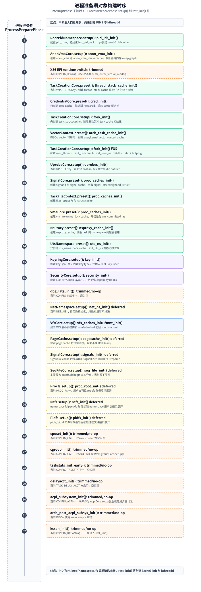
</p>

<p align="center">
  图 23 进程准备期对象构建时序
</p>

图 23 按 Linux 6.12.37 `start_kernel()` 中 `pid_idr_init()` 到 `kcsan_init()` 的有效调用顺序展示 `InterruptPhase` 子阶段 3 的推进过程。绿色节点表示当前主线 formal 候选，黄色虚线节点表示保留 Linux 时序但暂不推进对象状态的 deferred 路径，橙色虚线节点表示当前配置下 trimmed/no-op 的路径。`rest_init()` 不属于本子阶段，只作为下一阶段 `UP Multitask Phase` 的入口标记。

本子阶段的结束状态暂定至少包含：

- `ProcessPreparePhase.state == Ready`
- `RootPidNamespace.state == Ready`，并且 `init_pid_ns.idr` 与 level-0 PID cache 已建立；`PidAllocator` 作为关联分配策略/API 面具备已配置的 `pid_max/pid_max_min`
- `AnonVmaCore.state == Ready`
- `CredentialCore.state == Prepared`，表示 `cred` cache 已建立，但完整凭据关系和 key/security 语义尚未在本调用中完成
- `TaskCreationCore.state == Ready`，表示 thread stack cache、task 创建基础、`max_threads` 与 init namespace rlimit/ucount 已完成
- `VectorContext.state == Prepared`，表示 RISC-V vector context cache 已按硬件 `has_vector()` 和 `CONFIG_RISCV_ISA_V_PREEMPTIVE` 条件建立；若硬件不支持 vector，则该子动作按运行期条件 no-op
- `UprobeCore.state == Ready`
- `TaskFileContext.state == Prepared`
- `VmaCore.state == Prepared`
- `NsProxy.state == Prepared`
- `UtsNamespace.state == Prepared`
- `SignalCore.state == Prepared`
- `KeyringCore.state == Ready`
- `SecurityCore.state == Ready`，表示 LSM 顺序、blob 布局、hook dispatcher/static call table 已完成基础装配，默认主线的 `CapabilityLsm` hooks 已注册
- `VfsCore.state == Ready` 且初始 rootfs mount 已建立：`rootfs_fs_type` 默认使用 ramfs backing，root mount、superblock、root dentry/root inode 和当前 root 起点已经可观察
- `NetNamespace.setup()`、`PageCache.setup()`、`SignalCore.setup()`、`SeqFileCore.setup()`、`Procfs.setup()`、`Nsfs.setup()` 和 `Pidfs.setup()` 均保留 Linux 时序位置但在本子阶段 deferred
- `X86EfiRuntimeSwitch`、`KernelDebuggerLate`、`Cpuset`、`CgroupCore`、`Taskstats`、`DelayAccounting`、`AcpiSubsystem`、`ArchPostAcpi` 和 `KcsanRuntime` 均按当前配置记录为 trimmed/no-op
- 下一阶段的起点是 `rest_init()`，它将创建 `kernel_init` 与 `kthreadd`，并把系统推进到 `SYSTEM_SCHEDULING`；这也是从 `InterruptPhase` 转入 `UP Multitask Phase` 的边界

### 单核多任务期对象建立

从这一小节开始，对应顶层 `UP Multitask Phase`。本阶段从 `rest_init()` 开始，到 `kernel_init_freeable()` 中 `smp_init()` 执行前结束。阶段入口仍由上一阶段延续下来的 `BootInitTask` 执行，但入口动作会创建新的任务对象并打开调度运行状态；阶段末尾仍只有 boot CPU 在运行，secondary CPU 尚未启动，因此尚未进入真正多核并行。

本阶段的输入事实至少包括：

- `ProcessPreparePhase.state == Ready`
- `InterruptStream.state == Online`，限定为 boot CPU 本地中断总入口已经打开
- `RootPidNamespace.state == Ready`
- `TaskCreationCore.state == Ready`
- `CredentialCore.state == Prepared`
- `SignalCore.state == Prepared`
- `KeyringCore.state == Ready`
- `SecurityCore.state == Ready`
- `Workqueue.state == Prepared`
- `SystemState.state == Prepared`，且内部属性 `SystemState.value == SYSTEM_BOOTING`
- secondary CPU 尚未启动

当前 `UP Multitask Phase` 只正式展开 `RestInitPhase`。需要注意，`rest_init()`
中的 `schedule_preempt_disabled()` 展开后会 fork 出另一条由 `KernelInitTask`
驱动的执行线：

- `BootInitTask` 继续执行 `rest_init()`，在调度交接后完成
  `cpu_startup_entry(CPUHP_ONLINE)`，并以 `BootIdleTask` 身份进入 idle 路径。
- `KernelInitTask` 在同一次调度交接后获得运行机会，消费 `kthreadd_done` 释放事实，
  然后进入 `kernel_init_freeable()`，启动 `SmpRuntimePhase`，其首个子阶段是
  `PreSmpInitPhase`。
- 因此 `PreSmpInitPhase.Started` 不是 `RestInitPhase.Ready` 后的普通 sibling；
  `RestInitPhase.Ready` 只收束 boot idle 身份转换和 idle 入口事实。
- `SmpRuntimePhase` 由 `TaskEntry::KernelInit` 启动，而不是由
  `UpMultitaskPhase` 的最后子阶段顺序衔接启动。

1. `RestInitPhase`：覆盖 Linux `rest_init()`。它由上一阶段遗留的 `BootInitTask` 执行，依次调用 `rcu_scheduler_starting()`，通过通用 `TaskCreationCore` 创建 PID 1 的 `KernelInitTask`，把 init 临时固定在 boot CPU，创建 `KthreaddTask`，设置 `system_state = SYSTEM_SCHEDULING`，完成 `kthreadd_done`，最后把 `schedule_preempt_disabled()` 展开为 preemption guard 退出、`Scheduler.schedule()` 调度分界和 post-schedule boot idle context 进入，再由 `cpu_startup_entry(CPUHP_ONLINE)` 将当前执行实体确认为 boot CPU 的显式 `BootIdleTask`。完成后，单核多任务调度语义成立。
2. `SmpRuntimePhase` 的入口由 `TaskEntry::KernelInit` 启动；其首个子阶段 `PreSmpInitPhase` 覆盖 `kernel_init` 线程中 `kernel_init_freeable()` 从 `gfp_allowed_mask = __GFP_BITS_MASK` 到 `smp_init()` 前的初始化段。它运行在 `KernelInitTask` 上，完成 SMP 启动前仍必须在单核多任务环境中推进的准备动作，例如打开 PageAllocator 完整 GFP mask、记录当前配置下裁剪的内存节点访问路径和 deferred 的 `cad_pid` 绑定位置、执行 `smp_prepare_cpus(setup_max_cpus)`、完成 `workqueue_init()`、`init_mm_internals()`、`rcu_init_tasks_generic()`、`do_pre_smp_initcalls()` 和 `lockup_detector_init()`。`smp_init()` 本身不属于本子阶段，而是后续 `SmpBringupPhase` 的入口边界。

##### UP Multitask Phase 分叉修正规则

`RestInitPhase` 和 `PreSmpInitPhase` 的分叉点是 `schedule_preempt_disabled()`
展开后的 `Scheduler.schedule()` 调度分界，而不是独立生命周期对象或单个
Scheduler action。该分界提交 `Scheduler.first_schedule_committed` 等调度事实；
`RestInitPhase` 再提交 `KernelInitTask` 已被 `kthreadd_done` 释放并进入
`PreSmpInitPhase` 的场景事实。规格不建立 `KernelInitDispatchGate`，因为 Linux
没有对应的长期对象或明确生命周期，且 `schedule_preempt_disabled()` 是由
preemption guard 边界和调度分界组成的通用 helper。

`SmpRuntimePhase` 的首个子阶段 `PreSmpInitPhase` 依赖 `KernelInitTask`
release/dispatch facts 和 Scheduler first-schedule fact，不作为
`UpMultitaskPhase` 的普通 sibling，也不直接依赖 `RestInitPhase.Ready`。
`RestInitPhase.Ready` 仍保持依赖 `BootIdleRuntime.Ready`，表示 boot idle 尾部已经完成。

实现层应拆分 `rest_init`：前半段创建 PID 1/kthreadd、完成 `kthreadd_done`，随后退出
boot 初始 preempt-disabled 上下文、调用 `Scheduler.schedule()` 并进入 post-schedule
boot idle context；随后 `PreSmpInitPhase` 可从上述 facts 启动；最后 `RestInitPhase`
尾部完成 `BootIdleRuntime`。测试应验证 PID 1 的下一阶段
启动条件来自 release/dispatch 与 scheduler facts，而不是来自 `RestInitPhase.Ready`。

#### UP Multitask Phase 子阶段 1：rest_init 期（Rest Init Subphase）

`UP Multitask Phase` 的第一个子阶段暂名 `RestInitPhase`，中文名为 `rest_init` 期。它对应 Linux 6.12.37 `rest_init()` 的完整执行段，从上一阶段遗留的 `BootInitTask` 进入 `rcu_scheduler_starting()` 开始，到该任务执行 `cpu_startup_entry(CPUHP_ONLINE)` 转入 boot CPU idle 路径为止。

这个边界的核心不是继续建立静态基础设施，而是把系统从“单根启动任务执行初始化”推进为“boot CPU 上的单核多任务运行环境”：PID 1 的 `KernelInitTask` 被创建并等待 `kthreadd_done`，`KthreaddTask` 被创建并登记为全局线程管理者，系统状态进入 `SYSTEM_SCHEDULING`，`KthreaddReadyGate.complete()` 释放后 PID 1 可以继续执行 `kernel_init_freeable()`，而原启动根任务被调度器接管并转换为 `BootIdleTask`。因此，本子阶段是 `InterruptPhase` 到 `UP Multitask Phase` 的实际运行语义转换点。

当前先将 `RestInitPhase` 的对象和边界记录如下：

1. `rest_init 期对象`（暂名 `RestInitPhase`）：属于阶段对象，是 `UP Multitask Phase` 的第一个子阶段对象。它从 `ProcessPreparePhase.Ready` 接续，按 `rest_init()` 的有效顺序编排 RCU、任务创建、同步门、系统状态和 idle 接管动作，并以 boot CPU idle 路径接管 `BootInitTask` 作为完成边界。
2. `RCU 核心对象`（暂名 `RcuCore`）的调度启动动作：覆盖 `rcu_scheduler_starting()`。它不是创建新的 RCU 对象，而是在前序 `RcuCore.Ready` 基础上执行 `RcuCore.setup()`，把 RCU 退出 early boot 模式并记录 scheduler 开始参与 RCU 语义；Linux 当前要求此时仍只有一个 online CPU，且尚未发生普通上下文切换。后续 `rcu_set_runtime_mode()` 可作为 `RcuCore.enable()` 推进到 `Online`；`rcu_end_inkernel_boot()` 不消耗主对象 slot，作为 `RcuCore.end_inkernel_boot()` action 修改内部 `boot_mode` / `inkernel_boot_ended` 子状态。将来若需要细化 RCU 流程，可以增加 `RcuTree`、`RcuSoftirqHook`、`RcuGpWorker` 或 `RcuBootMode` 等下级子对象，主对象 slots 仍然足够。
3. `内核 init 任务对象`（暂名 `KernelInitTask`）：覆盖 `user_mode_thread(kernel_init, NULL, CLONE_FS)` 创建的 PID 1。它是本子阶段创建的第一个非 idle task，后续将执行 `kernel_init()`，先等待 `kthreadd_done`，再进入 `PreSmpInitPhase` 对应的 `kernel_init_freeable()`。规格层把目标新任务作为生命周期主体：`KernelInitTask.preset/setup/enable()` 可通过公共 `TaskCreationCore.spawn_task(spec)` 以 `BootInitTask/current` 为模板复制 task/thread 基础，再为新任务指定 `kernel_init` 入口和 `CLONE_FS` 等局部参数；它承载后续常规执行语义，但不再另建独立 flow 对象。`KernelInitTask` 的 slot 语义暂定为：

   | slot | Linux 对应动作 | 依赖 | drives / 产物 |
   |---|---|---|---|
   | `KernelInitTask.preset()` | `user_mode_thread()` 形成 `kernel_clone_args` | 依赖 `BootInitTask/current` 作为复制模板，依赖 `TaskCreationCore.Ready` 提供统一 task 创建入口，依赖 `RootPidNamespace.Ready`、`CredentialCore.Prepared`、`SignalCore.Prepared`、`SecurityCore.Ready` 等作为后续复制所需的全局基础事实 | 形成 `TaskSpawnSpec` / task shell：`entry = kernel_init`、`arg = NULL`、`clone_flags = CLONE_VM | CLONE_UNTRACED | CLONE_FS`、`exit_signal = 0`、`kind = user_mode_thread`。此时只确定“要创建 PID 1 init task”的规格，不把任务放入调度队列。 |
   | `KernelInitTask.setup()` | `kernel_clone()` 中的 `copy_process()`、RISC-V `copy_thread()` 等复制与初始化路径 | 依赖 `KernelInitTask.Prepared`，继续依赖 `BootInitTask/current` 的 task/thread/fs/cred 等模板属性，并由 `TaskCreationCore.spawn_task(spec)` / `TaskCreationCore.copy_from_current()` 这类创建 action 驱动 pid、task_struct、thread context、sched entity 等复制动作；其中 PID 分配依赖并调用 `RootPidNamespace.allocate_pid()` | 建立 `KernelInitTask` 的实体属性：`pid == 1`、入口为 `kernel_init`、参数为 `NULL`、共享 `CLONE_FS` 指定的 fs 语义，建立返回到 `ret_from_fork` 后调用 `kernel_init` 的线程上下文，并初始化可被调度器接收的 task/sched 属性。此时仍不是用户态进程，也不建立用户态 mm；用户态身份要等 `PayloadPhase` 中 `kernel_execve()` 成功后才转换。 |
   | `KernelInitTask.enable()` | `wake_up_new_task(p)` | 依赖 `KernelInitTask.Ready`，并由 `Scheduler.wake_new_task()` / `Scheduler.enqueue_task()` action 驱动；该 action 依赖 `Scheduler.Ready` 与 boot CPU runqueue 可接收新 task。不依赖 `KthreaddReadyGate.Completed`，因为该 completion 控制的是 PID 1 后续执行进度而不是创建入队 | 将 `KernelInitTask` 放入调度器可运行集合并推进到 `Online`。它使 PID 1 获得被第一次调度交接选中的机会；真正进入 `kernel_init_freeable()` 还要等待后续 `KthreaddReadyGate.complete()`。 |
4. `init CPU 亲和约束`：覆盖 `find_task_by_pid_ns(pid, &init_pid_ns)`、`PF_NO_SETAFFINITY` 和 `set_cpus_allowed_ptr(tsk, cpumask_of(smp_processor_id()))`。它不建立独立对象，而是 `KernelInitTask.Action::PinToBootCpu(BootCPURef)`：receiver 已经确定 PID 1 task，`BootCPURef` 来自前序 `BootCPU` online 边界，action 内只提交两类属性，即设置 `PF_NO_SETAFFINITY` 等价 flag 和把 cpumask 限制到 boot CPU。源码中的 pid lookup 是用局部 pid 重新取回 task 指针的实现路径，不作为正式 action 参数或 drives。包围该查找的 `rcu_read_lock()/unlock()` 当前记录为 deferred 上下文建模问题：它是否属于资源独占上下文，还是应作为 RCU/读侧上下文单独建模，后续讨论。
5. `NUMA 默认策略路径`：覆盖 `numa_default_policy()`。当前 `CONFIG_NUMA=n`，该调用为空实现，按 trimmed/no-op 记录。未来启用 NUMA 后，可恢复为 `NumaPolicy.set_default_for_init()` 之类的动作，但不影响当前 RestInit 主线。
6. `内核线程管理任务对象`（暂名 `KthreaddTask`）：覆盖 `kernel_thread(kthreadd, NULL, CLONE_FS | CLONE_FILES)` 创建的 `kthreadd`。它是后续内核线程创建请求的运行期服务者，当前通过 PID 查找后写入全局 `kthreadd_task` 引用。`kernel_thread` 与前面的 `user_mode_thread` 共享 `TaskCreationCore.spawn_task(spec)` 基础，只在入口、clone flags、是否作为 kthread 等局部参数上不同；`kthreadd_task` 是指向 `KthreaddTask` 的全局 provider 引用属性，不建模为独立生命周期对象，也不单独建 `bind_global_ref()` action。`KthreaddTask` 的 slot 语义暂定为：

   | slot | Linux 对应动作 | 依赖 | drives / 产物 |
   |---|---|---|---|
   | `KthreaddTask.preset()` | `kernel_thread()` 形成 `kernel_clone_args` | 依赖 `BootInitTask/current` 作为复制模板，依赖 `TaskCreationCore.Ready` 提供统一 task 创建入口，依赖 `RootPidNamespace.Ready` 等作为后续复制所需的全局基础事实 | 形成 `TaskSpawnSpec` / kthread shell：`entry = kthreadd`、`arg = NULL`、`clone_flags = CLONE_VM | CLONE_UNTRACED | CLONE_FS | CLONE_FILES`、`kthread = true`、`name = NULL`。此时只确定“要创建 kthreadd provider task”的规格，不把任务放入调度队列。 |
   | `KthreaddTask.setup()` | `kernel_clone()` 中的 `copy_process()`、RISC-V `copy_thread()` 等复制与初始化路径，以及 `kthreadd_task = find_task_by_pid_ns(pid, &init_pid_ns)` 形成的 provider 引用事实 | 依赖 `KthreaddTask.Prepared`，继续依赖 `BootInitTask/current` 的 task/thread/fs/files/cred 等模板属性，并由 `TaskCreationCore.spawn_task(spec)` / `TaskCreationCore.copy_from_current()` 这类创建 action 驱动 task/thread/sched entity 等复制动作；其中 PID 分配依赖并调用 `RootPidNamespace.allocate_pid()`，全局 provider 引用依赖 `RootPidNamespace.lookup(pid)` | 建立 `KthreaddTask` 的实体属性和 kthread provider 属性：入口为 `kthreadd`，共享 `CLONE_FS | CLONE_FILES` 指定的 fs/files 语义，建立返回到 `ret_from_fork` 后调用 `kthreadd` 的线程上下文，并初始化可被调度器接收的 task/sched 属性；同时记录 `KthreaddTask.global_ref == kthreadd_task`，未来可等价归入 `KthreadCreationService.provider == KthreaddTask`。 |
   | `KthreaddTask.enable()` | `wake_up_new_task(p)` | 依赖 `KthreaddTask.Ready`，并由 `Scheduler.wake_new_task()` / `Scheduler.enqueue_task()` action 驱动；该 action 依赖 `Scheduler.Ready` 与 boot CPU runqueue 可接收新 task | 将 `KthreaddTask` 放入调度器可运行集合并推进到 `Online`。它使 kthreadd provider 具备被调度执行并消费 `kthread_create_list` 的机会；后续外部 kthread 创建请求可通过全局 provider 引用唤醒它。 |
7. `kthreadd 准备同步门`（暂名 `KthreaddReadyGate`）：覆盖静态 completion `kthreadd_done` 和 `complete(&kthreadd_done)`。它是 `Completion` 类型的静态实例；`DECLARE_COMPLETION(kthreadd_done)` 可看作由 `KthreaddReadyGate` 自身的 `preset()` 与 `setup()` 绑定静态存储并确认初始化事实，初始扩展状态为 `Pending`。它把 `KernelInitTask` 和 `KthreaddTask` 解耦：PID 1 可以先创建并阻塞等待，待 `kthreadd_task` 全局引用建立且 `SystemState.value == SYSTEM_SCHEDULING` 后，`complete(&kthreadd_done)` 建模为 `KthreaddReadyGate.complete()` 扩展事件，释放 PID 1 继续执行 `kernel_init_freeable()`。
8. `系统状态对象`（暂名 `SystemState`）的 setup：覆盖 `system_state = SYSTEM_SCHEDULING`。`SystemState` 是独立全局对象，早期由静态全局数据形成，`SystemState.preset()` 已把对象生命周期推进到 `Prepared`，并在内部属性 `value` 中记录 `SYSTEM_BOOTING`。本处执行 `SystemState.setup()`，把对象生命周期推进到 `Ready`，同时把内部属性 `SystemState.value` 更新为 `SYSTEM_SCHEDULING`。这里的 `value` 是 Linux 的全局阶段枚举，不是对象生命周期状态；该对象不替代 `Scheduler`，也不把 SMP 或 workqueue 直接推进到后续状态。
9. `boot idle 任务对象`（暂名 `BootIdleTask`）：覆盖 `cpu_startup_entry(CPUHP_ONLINE)`，并承接前一调用 `schedule_preempt_disabled()` 造成的第一次实际调度交接。底层仍是 Linux 静态 `init_task/current`，因此 `BootInitTask` 与 `BootIdleTask` 可理解为同一底层 task 在不同时期的两个规格身份，而不是两个新旧 task 实体。`schedule_preempt_disabled()` 不建模为单个 action，而是展开为 `BootIdlePreemption.enable_no_resched()`、`Scheduler.schedule()` 和 post-schedule boot idle context；规格身份转换放在 `cpu_startup_entry(CPUHP_ONLINE)` 中，建模为 `BootInitTask.disable()` 与 `BootIdleTask.enable()` 的复合提交。这里 `handoff` 只作为 `disable()` 场景下的自然语言资源交接别名，不作为正式 slot 名。

<p align="center">
  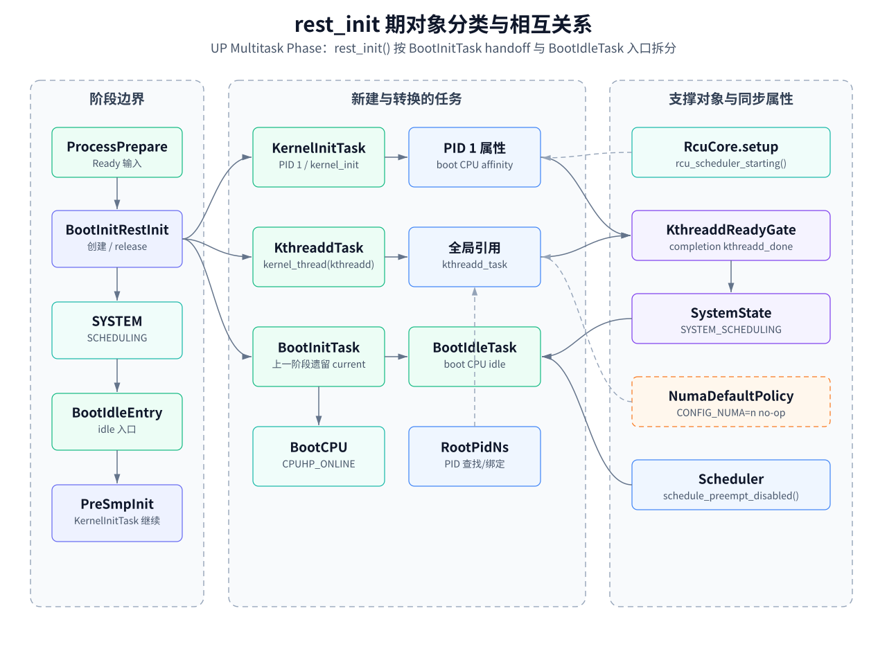
</p>

<p align="center">
  图 24 rest_init 期对象分类与相互关系
</p>

图 24 用于说明 `UP Multitask Phase` 子阶段 1 的对象分类和依赖关系。左侧是阶段边界和从 `InterruptPhase` 接续而来的输入事实，中间是 `rest_init()` 创建和推进的三个 task 结果：`KernelInitTask`、`KthreaddTask` 与在 `cpu_startup_entry(CPUHP_ONLINE)` 中完成身份确认的 `BootIdleTask`；右侧是本子阶段使用的支撑对象和同步/状态属性。图中 `KthreaddReadyGate` 是显式同步门，`SystemState` 是全局状态推进，`NumaDefaultPolicy` 在当前配置下为 trimmed/no-op。

##### UP Multitask Phase 子阶段 1 过程处理清单（初稿）

| Linux 6.12.37 `rest_init()` 调用 / 规格补充动作 | 规格处理 | 备注 |
|---|---|---|
| `rcu_scheduler_starting()` | formal candidate: `RcuCore.setup()` | 退出 RCU early boot 模式，记录 scheduler 开始参与 RCU 语义；此时仍要求单 online CPU 且无普通上下文切换。 |
| `user_mode_thread(kernel_init, NULL, CLONE_FS)` | formal candidate: `KernelInitTask.preset/setup/enable()` | `preset()` 形成 `TaskSpawnSpec`；`setup()` 通过 `TaskCreationCore` / `copy_process()` 建立 PID 1 task/thread 实体；`enable()` 对应 `wake_up_new_task()`，把该 task 放入调度器可运行集合。该 task 随后等待 `kthreadd_done`，再进入 `PreSmpInitPhase`。 |
| `find_task_by_pid_ns()` + `PF_NO_SETAFFINITY` + `set_cpus_allowed_ptr()` | action: `KernelInitTask.PinToBootCpu(BootCPURef)` | 不建立独立 `KernelInitAffinity` 对象；receiver 已经是 `KernelInitTask`，pid lookup 只作为实现路径说明。该 action 设置 `PF_NO_SETAFFINITY` 等价 flag 并把 cpumask 限制到 boot CPU。`rcu_read_lock()/unlock()` 定界的读侧上下文暂记为 deferred，上下文类型后续讨论。 |
| `numa_default_policy()` | trimmed/no-op | 当前 `CONFIG_NUMA=n`，为空实现；未来启用 NUMA 后恢复为 `NumaPolicy` 的默认策略动作。 |
| `kernel_thread(kthreadd, NULL, CLONE_FS | CLONE_FILES)` | formal candidate: `KthreaddTask.preset/setup/enable()` | `preset()` 形成 kthread `TaskSpawnSpec`；`setup()` 通过 `TaskCreationCore` / `copy_process()` 建立 kthreadd task/thread 实体，并记录全局 provider 引用；`enable()` 对应 `wake_up_new_task()`，把该 task 放入调度器可运行集合。 |
| `kthreadd_task = find_task_by_pid_ns(pid, &init_pid_ns)` | property fact in `KthreaddTask.setup()` | 建立 `KthreaddTask.global_ref == kthreadd_task`；未来可归入 `KthreadCreationService.provider == KthreaddTask`。该引用本身不是独立生命周期对象，也不单独建 action。 |
| `system_state = SYSTEM_SCHEDULING` | formal candidate: `SystemState.setup()` | 把 `SystemState.state` 推进到 `Ready`，并把内部属性 `SystemState.value` 从 `SYSTEM_BOOTING` 更新为 `SYSTEM_SCHEDULING`；表示系统进入调度运行状态，但不等价于 SMP 已启动，也不自动推进 workqueue 到 enabled。 |
| `complete(&kthreadd_done)` | extension event: `KthreaddReadyGate.complete()` | 对静态 `Completion` 实例执行 `complete()`：通常把扩展状态从 `Pending` 推进到 `Completed`，并唤醒等待中的 `KernelInitTask`。若随后 PID 1 的 `wait()` 消费该令牌，实例扩展状态可回到 `Pending`；因此本阶段不把 `Open` 作为长期结束状态。 |
| `schedule_preempt_disabled()` | formal pattern: `BootIdlePreemption.enable_no_resched()` + `Scheduler.schedule()` + `BootIdleStartupContext` | 退出继承的禁抢占原子上下文，执行一次调度分界，再进入 post-schedule boot idle 原子上下文；形成第一次实际调度交接，使已入队的新任务具备运行机会。 |
| `cpu_startup_entry(CPUHP_ONLINE)` | formal candidate: `BootInitTask.disable()` + `BootIdleTask.enable()` | 同一底层 `init_task/current` 的启动编排身份退出运行路径，并以 boot CPU idle 身份进入 idle 循环；`handoff` 只作为该 `disable()` 资源交接语义的自然语言别名，不作为正式 slot 名。该过程同时以 `CPUHP_ONLINE` 标记 boot CPU hotplug 状态；secondary CPU 仍未启动。 |

<p align="center">
  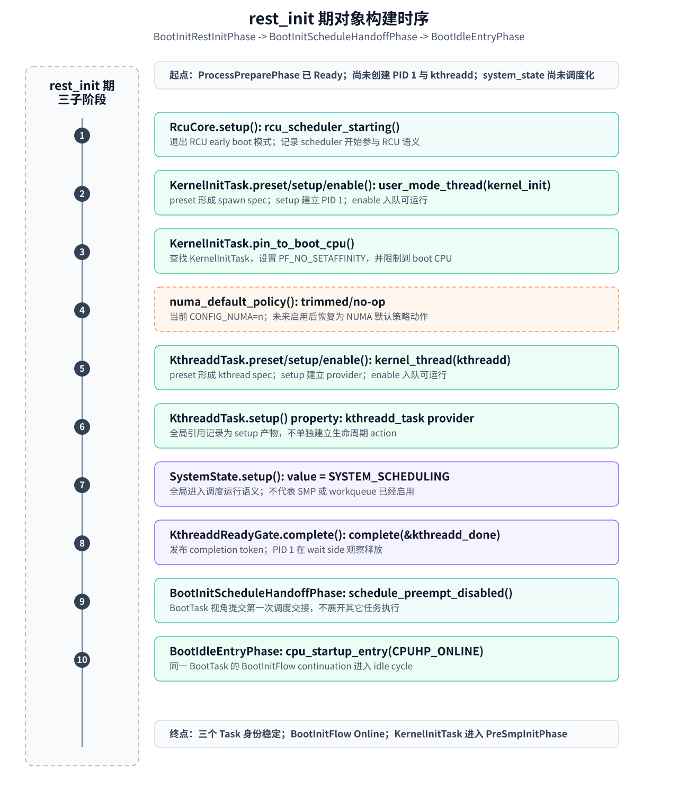
</p>

<p align="center">
  图 25 rest_init 期对象构建时序
</p>

图 25 按 Linux 6.12.37 `rest_init()` 的有效调用顺序展示 `UP Multitask Phase` 子阶段 1 的推进过程。绿色节点表示当前主线 formal/action 候选，紫色节点表示同步门或全局状态 checkpoint，橙色虚线节点表示当前配置下 trimmed/no-op 的路径。`kernel_init_freeable()` 不属于本子阶段，它在 `KthreaddReadyGate.complete()` 释放后由 `KernelInitTask` 启动 `SmpRuntimePhase`，并进入其首个子阶段 `PreSmpInitPhase`。

本子阶段的结束状态暂定至少包含：

- `RestInitPhase.state == Ready`
- `RcuCore.state == Ready`，且 `RcuCore.scheduler_active == RCU_SCHEDULER_INIT`
- `KernelInitTask.state == Online`，且 `KernelInitTask.pid == 1`
- `KernelInitTask.cpu_affinity == BootCPU`，并记录 `PF_NO_SETAFFINITY`
- `KthreaddTask.state == Online`
- `kthreadd_task` 已绑定到 `KthreaddTask`
- `KthreaddReadyGate.type == Completion`
- `KthreaddReadyGate.release_committed == true`，表示 `complete(&kthreadd_done)` 已执行并解除 PID 1 的等待；原始 completion 扩展状态可能保持 `Completed`，也可能在 `KernelInitTask.wait()` 消费后回到 `Pending`
- `SystemState.state == Ready`
- `SystemState.value == SYSTEM_SCHEDULING`
- `Scheduler.first_schedule_committed == true`，表示 `schedule_preempt_disabled()` 展开的 `Scheduler.schedule()` 已完成第一次实际调度交接
- `BootInitTask.state == Offline`，表示启动编排身份已经在 `cpu_startup_entry(CPUHP_ONLINE)` 中退出运行路径
- `BootIdleTask.state == Online`，表示同一底层 task 已经在 `cpu_startup_entry(CPUHP_ONLINE)` 中启用 boot CPU idle 身份并转入 idle 路径
- `BootCPU.hotplug_state == CPUHP_ONLINE`
- `NumaDefaultPolicy` 按当前配置记录为 trimmed/no-op
- 下一子阶段的主执行任务是 `KernelInitTask`，入口是 `kernel_init_freeable()` 中 `gfp_allowed_mask = __GFP_BITS_MASK`

#### SMP Runtime Phase 子阶段 1：SMP 前初始化期（Pre-SMP Init Subphase）

`SMP Runtime Phase` 的第一个子阶段暂名 `PreSmpInitPhase`，中文名为 SMP 前初始化期。它对应 Linux 6.12.37 `kernel_init_freeable()` 中从 `gfp_allowed_mask = __GFP_BITS_MASK` 开始，到 `smp_init()` 调用前结束的初始化段。`smp_init()` 本身不属于本子阶段，而是后续 `SmpBringupPhase` 的入口。

这个子阶段运行在上一子阶段创建并被 `KthreaddReadyGate` 释放的 `KernelInitTask` 上。此时 `BootIdleTask` 和 `KthreaddTask` 已经存在，`SystemState.state == Ready` 且内部属性 `SystemState.value == SYSTEM_SCHEDULING`，但只有 boot CPU online，secondary CPU 尚未启动。因此，本阶段可以使用调度、completion、kthread 和阻塞分配能力来完成更接近运行期的准备，但仍不能把任何对象解释为“多核并行已经开始”。

当前先将 `PreSmpInitPhase` 的对象和边界记录如下：

1. `SMP 前初始化期对象`（暂名 `PreSmpInitPhase`）：属于阶段对象，是 `SMP Runtime Phase` 的第一个子阶段对象。它不从 `RestInitPhase.Ready` 串行接续，而是在 `KernelInitTask` 已被 `kthreadd_done` 释放、Scheduler 首次调度交接已提交后由 `TaskEntry::KernelInit` 启动的 `SmpRuntimePhase` 进入；此时 `BootInitTask` 仍可继续完成 `RestInitPhase` 的 boot idle 尾部。该子阶段按 `kernel_init_freeable()` 中 `smp_init()` 前的有效顺序推进对象，并以“下一调用为 `smp_init()`”作为完成边界。
2. `页分配器完整 GFP mask 属性`：覆盖 `gfp_allowed_mask = __GFP_BITS_MASK`。它不是独立对象，也不属于 `KernelInitTask`，而是 `PageAllocator` 的全局分配策略属性。当前建模为 `PageAllocator.open_full_gfp_mask()` action，不推进 `PageAllocator` 标准生命周期，只记录 `PageAllocator.gfp_allowed_mask == __GFP_BITS_MASK`，表示后续初始化可以执行可能阻塞的 `GFP_KERNEL` 分配。
3. `init 内存节点访问路径`：覆盖 `set_mems_allowed(node_states[N_MEMORY])`。当前 `CONFIG_CPUSETS=n` 且 `CONFIG_NUMA=n`，该调用在头文件中折叠为空实现，按 trimmed/no-op 记录，不在本阶段展开对象建模。
4. `cad_pid 绑定路径`：覆盖 `cad_pid = get_pid(task_pid(current))`。它属于 reboot/ctrl-alt-del 控制路径的全局引用绑定；当前启动主线不依赖它，先按 deferred 记录，后续讨论系统控制或 reboot/poweroff 路径时再决定归属。
5. `CPU 组拓扑与 present 准备动作`：覆盖 RISC-V `smp_prepare_cpus(setup_max_cpus)`。它不建立独立的 `SmpBootPlan` 对象，而是由 `PreSmpInitPhase` 驱动 `CpuGroup` 及其下级 `CpuTopology` / CPU 子对象属性完成准备：`init_cpu_topology()` 对应 `CpuGroup.CpuTopology.setup()`；`store_cpu_topology(curr_cpuid)` 对应 action `CpuGroup.CpuTopology.record(BootCPU)`；`numa_store_cpu_info(curr_cpuid)` 和 `numa_add_cpu(curr_cpuid)` 当前 `CONFIG_NUMA=n`，按 trimmed/no-op 记录；`max_cpus == 0` 只作为 `nosmp` 条件 checkpoint；默认路径遍历 possible secondary CPU 并执行 `CpuGroup.Cpu[cpuid].set_present(true)`，只写 `present` 属性，不启动 CPU，不推进 `online`。
6. `Workqueue 对象`：覆盖 `workqueue_init()`。它承接前序 `Workqueue.Prepared`，建模为 `Workqueue.setup()` 并推进到 `Ready`：初始化 CPU intensive 阈值和 `pwq_release_worker`，补齐 worker pool 的 node hint，为需要 rescuer 的 workqueue 创建 rescuer，创建 BH/CPU/unbound pool 的初始 worker，并初始化 WQ watchdog。Linux 内部会设置 `wq_online = true`；规格层把它映射为 `Workqueue.worker_creation_open == true` 这类内部属性，表示后续可以创建 kworker，但不等同于标准生命周期 `Workqueue.enable()`。`enable()` 仍留给后续 worker 执行、拓扑重建和运行期服务边界。
7. `VM 统计核心对象`（暂名 `VmstatCore`）：覆盖 `init_mm_internals()` 的主线部分。由于前序没有单独创建 `VmstatCore` 的对象壳，本调用建模为 `VmstatCore.preset()` 并推进到 `Prepared`。它依赖 `Workqueue.Ready`，创建 `mm_percpu_wq`，注册 vmstat CPU hotplug state，初始化 CPU node state，并启动 shepherd delayed work/timer。`proc_create_seq("buddyinfo"/"pagetypeinfo"/"vmstat"/"zoneinfo")` 属于 procfs 可见导出；由于前序 `Procfs.setup()` 当前仍 deferred，本子阶段先记录为 `VmstatProcExports` deferred，不要求推进 procfs 对象状态。
8. `Tasks RCU 对象`（暂名 `TasksRcu`）：覆盖 `rcu_init_tasks_generic()`。它不是重新建立 `RcuCore`，而是在前序 `tasks_cblist_init_generic()` / `TasksRcu.preset()` 已经建立 per-CPU callback-list 壳的基础上，建模为 `TasksRcu.setup()` 并推进到 `Ready`。该对象聚合按配置启用的 Tasks RCU flavor，例如 `TasksClassicRcu`、`TasksRudeRcu` 和 `TasksTraceRcu`；当前调用为已启用 flavor 设置 grace-period 参数和阶段函数，创建对应 GP kthread，并在 `CONFIG_PROVE_RCU` 启用时启动 boot self-test。未启用的 flavor 按 trimmed/no-op 记录。
9. `pre-SMP initcall 表驱动`（暂名 `PreSmpInitcallTable`）：覆盖 `do_pre_smp_initcalls()`。它遍历 `Lds`/linker range 提供的 `__initcall_start` 到 `__initcall0_start` 区间；链接脚本先放 `.initcallearly.init`，随后才进入 `.initcall0.init`，因此本调用只执行 `early_initcall()`，不执行后续 `pure_initcall()` / `core_initcall()` 等 level。规格层把它建模为 `PreSmpInitcallTable.run_early()` action，而不是独立生命周期对象；它驱动 `RcuCore`、`Softirq`、`Scheduler`、`CpuStopper`、`AddressSpaceId`、`MemoryZeroPage` 与 `CompatMode` 等已有或候选对象完成早期动作。其它 sysctl/proc/debug/tracing/模块相关 early initcall 按当前配置和重要性记录为 deferred 或 trimmed。
10. `锁死检测路径`（暂名 `LockupDetector`）：覆盖 `lockup_detector_init()`。它属于运行期诊断/watchdog 设施，当前启动主线不依赖；本阶段先按 deferred 保留 Linux 时序位置，不推进标准生命周期。规格层只记录 `watchdog_cpumask` 默认来自 `Housekeeping.timer_mask` / `housekeeping_cpumask(HK_TYPE_TIMER)`；当前 `CONFIG_HARDLOCKUP_DETECTOR=n`，hardlockup detector 路径按 unavailable/trimmed 记录。后续如果实现诊断能力，再细化 `LockupDetector.preset()` / `setup()` 与 softlockup watchdog 的内部对象。

<p align="center">
  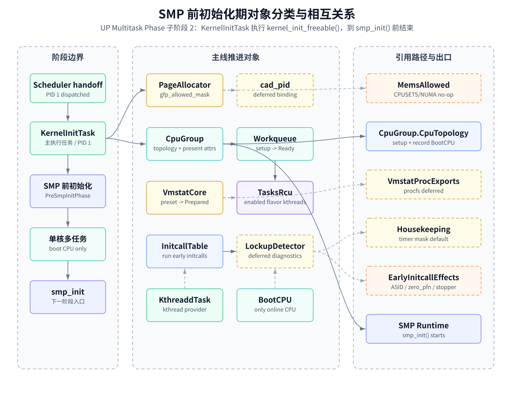
</p>

<p align="center">
  图 26 SMP 前初始化期对象分类与相互关系
</p>

图 26 用于说明 `UP Multitask Phase` 子阶段 2 的对象分类和依赖关系。左侧是 `RestInitPhase` 到 `SMP Runtime Phase` 的阶段边界，中间是由 `KernelInitTask` 在 `smp_init()` 前推进的主线对象，右侧是本阶段引用的 deferred/trimmed 路径和下一阶段入口。图中 `Workqueue.setup()` 只推进到规格层 `Ready`，`smp_prepare_cpus()` 不形成独立对象，而是把 `CpuGroup.CpuTopology` 推进到 `Ready`，记录 `BootCPU` topology，并写入 secondary CPU 子对象的 `present` 属性；secondary CPU 仍没有启动。

##### UP Multitask Phase 子阶段 2 过程处理清单（初稿）

| Linux 6.12.37 `kernel_init_freeable()` 调用 / 规格补充动作 | 规格处理 | 备注 |
|---|---|---|
| `gfp_allowed_mask = __GFP_BITS_MASK` | action: `PageAllocator.open_full_gfp_mask()` | 打开 `PageAllocator.gfp_allowed_mask` 的完整 GFP mask，使后续初始化可以使用可能阻塞的分配；不建立独立 `GfpAllocationPolicy` 对象。 |
| `set_mems_allowed(node_states[N_MEMORY])` | trimmed/no-op | 当前 `CONFIG_CPUSETS=n` 且 `CONFIG_NUMA=n`，为空实现；裁剪路径不展开对象建模。 |
| `cad_pid = get_pid(task_pid(current))` | deferred: `cad_pid` binding | reboot/ctrl-alt-del 控制路径的全局引用绑定；当前启动主线不依赖，留到系统控制或 reboot/poweroff 路径讨论。 |
| `smp_prepare_cpus(setup_max_cpus)` | composite driver: `CpuGroup` / `CpuGroup.CpuTopology` | 不建立独立 `SmpBootPlan` 对象；内部只准备 topology 与 CPU `present` 属性，不启动 secondary CPU。 |
| `init_cpu_topology()` in `smp_prepare_cpus()` | formal candidate: `CpuGroup.CpuTopology.setup()` | 建立 CPU topology 的基础容器和默认结构，作为 `CpuGroup` 的下级对象推进到 `Ready`。 |
| `store_cpu_topology(curr_cpuid)` in `smp_prepare_cpus()` | action: `CpuGroup.CpuTopology.record(BootCPU)` | 记录 boot CPU 的 topology 属性；作为对象 action，不额外推进标准生命周期。 |
| `numa_store_cpu_info(curr_cpuid)` / `numa_add_cpu(curr_cpuid)` in `smp_prepare_cpus()` | trimmed/no-op | 当前 `CONFIG_NUMA=n`，RISC-V default_config 下不展开 NUMA 对象建模。 |
| `if (max_cpus == 0) return` in `smp_prepare_cpus()` | checkpoint: `setup_max_cpus == 0` | 表示 `nosmp` / 禁用 secondary CPU 的条件路径；默认路径继续遍历 possible CPU。 |
| `for_each_possible_cpu(cpuid)` / `if (cpuid == curr_cpuid) continue` in `smp_prepare_cpus()` | loop/filter over `CpuGroup.possible_set` | 遍历 possible CPU 集合，并过滤 boot CPU；它们是控制结构，不建模为对象。 |
| `set_cpu_present(cpuid, true)` in `smp_prepare_cpus()` | property action: `CpuGroup.Cpu[cpuid].set_present(true)` | 写入每个 possible secondary CPU 子对象的 `present = true` 属性；不设置 `online`，也不启动 CPU。 |
| `numa_store_cpu_info(cpuid)` in `smp_prepare_cpus()` loop | trimmed/no-op | 同上，当前 `CONFIG_NUMA=n`。 |
| `workqueue_init()` | formal candidate: `Workqueue.setup()` | 从 `Prepared` 推进到 `Ready`；它是 workqueue 三阶段初始化的第二步，承接前序 `workqueue_init_early()` / `Workqueue.preset()` 已建立的 early 框架。 |
| `wq_cpu_intensive_thresh_init()` in `workqueue_init()` | action: `Workqueue.prepare_cpu_intensive_threshold()` | 创建 `pwq_release_worker`，并按 `loops_per_jiffy` 推导默认 `wq_cpu_intensive_thresh_us`；规格层记录为 `Workqueue.release_worker_ready == true` 和 `Workqueue.cpu_intensive_threshold_ready == true`，不单独建立 release worker 生命周期对象。 |
| pool node hint fixup in `workqueue_init()` | action: `Workqueue.refresh_pool_node_hints(CpuGroup.possible_set)` | 遍历 possible CPU 的 BH/CPU worker pool，写入 `pool.node = cpu_to_node(cpu)`；当前 `CONFIG_NUMA=n` 时仍作为 node hint 属性写入，不展开 NUMA 对象。 |
| `init_rescuer(wq)` loop in `workqueue_init()` | action: `Workqueue.ensure_rescuers()` | 对已存在 workqueue 列表中带 `WQ_MEM_RECLAIM` 的 workqueue 创建 rescuer kthread 并唤醒，保证内存回收路径 forward progress；不把每个 rescuer 升级为顶层对象。 |
| BH / CPU / unbound `create_worker(pool)` in `workqueue_init()` | action: `Workqueue.create_initial_workers()` | 为所有 possible CPU 的 BH pool 创建 pseudo worker，为 online CPU pool 创建初始 worker，并为已有 unbound pool 创建初始 worker；secondary CPU 仍未启动，online CPU 目前只有 boot CPU。 |
| `wq_online = true` in `workqueue_init()` | internal property: `Workqueue.worker_creation_open = true` | Linux 内部 flag 表示之后允许动态创建 kworker；规格层不把它解释为标准 `Workqueue.enable()`。 |
| `wq_watchdog_init()` in `workqueue_init()` | action: `Workqueue.setup_watchdog()` | 初始化 WQ watchdog timer/threshold，记录 `Workqueue.watchdog_ready == true`；hardlockup/softlockup detector 当前由后续 `LockupDetector` deferred 路径保留 Linux 时序位置。 |
| `init_mm_internals()` | formal candidate: `VmstatCore.preset()` | 第一次形成 `VmstatCore` 对象边界，使其进入 `Prepared`：创建 `mm_percpu_wq`，注册 vmstat CPU hotplug state，初始化 CPU node state，并启动 shepherd delayed work/timer。 |
| `proc_create_seq()` in `init_mm_internals()` | deferred: `VmstatProcExports` | buddyinfo、pagetypeinfo、vmstat、zoneinfo 属于 procfs 可见导出；因当前 `Procfs.setup()` 仍 deferred，本处只保留 Linux 时序位置。 |
| `rcu_init_tasks_generic()` | formal candidate: `TasksRcu.setup()` | 承接前序 `tasks_cblist_init_generic()` / `TasksRcu.preset()`；为按配置启用的 Tasks RCU flavor 设置 GP 参数和阶段函数，创建 GP kthread，并推进 `TasksRcu` 到 `Ready`。 |
| `rcu_spawn_tasks_kthread()` in `rcu_init_tasks_generic()` | conditional action: `TasksRcu.TasksClassicRcu.setup_gp_thread()` | 仅 `CONFIG_TASKS_RCU=y` 时有效；设置 classic Tasks RCU 的 `pregp/pertask/postscan/holdouts/postgp` 函数和 `TASK_IDLE` wait state，并创建 GP kthread。 |
| `rcu_spawn_tasks_rude_kthread()` in `rcu_init_tasks_generic()` | conditional action: `TasksRcu.TasksRudeRcu.setup_gp_thread()` | 仅 `CONFIG_TASKS_RUDE_RCU=y` 时有效；设置 rude flavor 的 GP sleep 并创建 GP kthread；未启用时按 trimmed/no-op 记录。 |
| `rcu_spawn_tasks_trace_kthread()` in `rcu_init_tasks_generic()` | conditional action: `TasksRcu.TasksTraceRcu.setup_gp_thread()` | 仅 `CONFIG_TASKS_TRACE_RCU=y` 时有效；设置 trace flavor 的 GP sleep、lazy 参数和 `pregp/postscan/holdouts/postgp` 函数，并创建 GP kthread。 |
| `rcu_tasks_initiate_self_tests()` in `rcu_init_tasks_generic()` | conditional action: `TasksRcu.start_boot_self_tests()` | 仅 `CONFIG_PROVE_RCU=y` 时实际运行 wait/call self-test；默认未启用时为空实现或 no-op。 |
| `do_pre_smp_initcalls()` | action: `PreSmpInitcallTable.run_early()` | 遍历 `__initcall_start` 到 `__initcall0_start` 的 early initcall 表；只执行 `early_initcall()`，不包括 `pure_initcall()` 或后续 initcall level。本身不作为生命周期对象，只记录 `early_level_ran == true`。 |
| `rcu_spawn_gp_kthread()` in early initcalls | action: `RcuCore.setup_gp_thread()` | 创建 RCU GP kthread，设置 `rcu_scheduler_fully_active = 1`，启动 boot CPU 的 RCU core/nocb/rnp/exp-GP 相关 kthread/worker；这是 `RcuCore` 运行支撑的重要补全。 |
| `spawn_ksoftirqd()` in early initcalls | formal candidate: `Softirq.setup_ksoftirqd()` | 注册 `CPUHP_SOFTIRQ_DEAD` 回调并注册 per-CPU `ksoftirqd` thread 框架；不等同于 softirq 实际执行，执行仍等待后续中断/softirq raise。 |
| `migration_init()` in early initcalls | action: `Scheduler.setup_migration(BootCPU)` | 对 boot CPU 执行 `sched_cpu_starting()`，为后续 CPU bringup/hotplug 的 migration 线程路径做准备。 |
| `cpu_stop_init()` in early initcalls | formal candidate: `CpuStopper.preset()` | 初始化 possible CPU 的 stopper work list，注册 per-CPU stopper thread，并 unpark boot CPU stopper；后续 stop-machine / CPU hotplug 路径会使用。 |
| `irq_work_init_threads()` in early initcalls | trimmed/no-op | 当前 `CONFIG_PREEMPT_RT=n`，不注册 irqwork per-CPU thread。 |
| `init_zero_pfn()` in early initcalls | action: `MemoryZeroPage.bind_zero_pfn()` | 绑定 `zero_pfn = page_to_pfn(ZERO_PAGE(0))`；这是零页 PFN 属性绑定，不建立独立大对象。 |
| `asids_init()` in early initcalls | formal candidate: `AddressSpaceId.setup()` | RISC-V MMU 路径探测 ASID 位数，分配 ASID bitmap，并启用 `use_asid_allocator` static branch。 |
| `compat_mode_detect()` in early initcalls | action: `CompatMode.detect()` | RISC-V `CONFIG_COMPAT=y` 时探测 32-bit user ABI 支持；可作为 `ProcessAbi` / `UserAbi` 的属性，不单独升为顶层对象。 |
| `riscv_hibernate_init()` in early initcalls | trimmed/no-op | 当前 `CONFIG_HIBERNATION=n`，RISC-V hibernation early hook 不进入主线。 |
| `tmigr_init()` in early initcalls | deferred | timer migration / NOHZ 相关优化，当前不是最小启动关键功能，保留 Linux 时序位置。 |
| `printk_set_kthreads_ready()` in early initcalls | deferred | printk/console kthread 运行支持，归入 `Printk` / `Console` 后续运行路径讨论。 |
| sysctl/proc early initcalls | deferred | `init_fs_sysctls()`、`init_fs_inode_sysctls()`、`init_fs_locks_sysctls()`、`init_signal_sysctls()`、`init_umh_sysctls()`、`init_security_keys_sysctls()` 等仅建立可见配置/导出路径。 |
| tracing/debug early initcalls | deferred/trimmed | `event_trace_enable_again()`、`init_trace_printk()`、`ok_to_run_trace_benchmark()` 沿用 `LinuxTracing` deferred；`dynamic_debug_init()` 当前 `CONFIG_DYNAMIC_DEBUG=n` 为 trimmed。 |
| kprobe/jump-label/static-call/selftest early initcalls | trimmed/no-op | 当前 `CONFIG_KPROBES=n`、`CONFIG_MODULES=n`、static-call 支撑未进入 RISC-V default_config，相关 initcall 或 selftest 不进入主线。 |
| RCU diagnostic early initcalls | action/deferred/no-op | `check_cpu_stall_init()` 可作为 `RcuCore.register_stall_panic_notifier()`；`srcu_bootup_announce()` 属诊断信息，`rcu_sysrq_init()` 在当前 `MAGIC_SYSRQ=n` 下 no-op。 |
| `lockup_detector_init()` | deferred: `LockupDetector` | 运行期诊断/watchdog 能力；当前启动主线不依赖。保留 Linux 时序位置，记录 `watchdog_cpumask` 默认来自 `Housekeeping.timer_mask`；当前 `CONFIG_HARDLOCKUP_DETECTOR=n` 下 hardlockup detector unavailable/trimmed。 |
| `smp_init()` | next phase boundary | 不属于 `PreSmpInitPhase`；它是 `SMP Runtime Phase` 的入口，开始启动 secondary CPU。 |

<p align="center">
  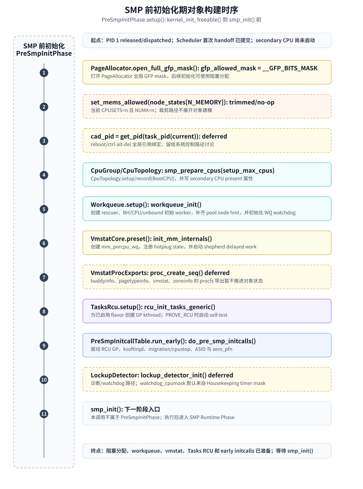
</p>

<p align="center">
  图 27 SMP 前初始化期对象构建时序
</p>

图 27 按 Linux 6.12.37 `kernel_init_freeable()` 中 `smp_init()` 前的有效调用顺序展示 `UP Multitask Phase` 子阶段 2 的推进过程。绿色节点表示当前主线 formal/action 候选，黄色虚线节点表示保留 Linux 时序但暂不推进对象状态的 deferred 路径，橙色虚线节点表示当前配置下 trimmed/no-op 的路径，底部的 `smp_init()` 只作为下一顶层阶段入口标记。

本子阶段的结束状态暂定至少包含：

- `PreSmpInitPhase.state == Ready`
- `KernelInitTask.state == Online`，且仍是本子阶段主执行任务
- `PageAllocator.gfp_allowed_mask == __GFP_BITS_MASK`
- `CpuGroup.CpuTopology.state == Ready`
- `BootCPU.topology_recorded == true`
- 默认 `setup_max_cpus != 0` 路径下，`for cpu in CpuGroup.possible_secondary_cpus: cpu.present == true`；`setup_max_cpus == 0` / `nosmp` checkpoint 会跳过 secondary CPU 的 present 标记
- secondary CPU 尚未启动，也未推进到 `online`
- `Workqueue.state == Ready`，表示 CPU intensive 阈值、`pwq_release_worker`、初始 worker、rescuer、worker pool node hint 和 WQ watchdog 已建立
- `Workqueue.worker_creation_open == true`，对应 Linux 内部 `wq_online = true`；它只表示后续可以动态创建 kworker，不等同于标准 `Workqueue.enable()`
- `Workqueue.enable()` 尚未作为规格生命周期边界执行
- `VmstatCore.state == Prepared`，表示 `mm_percpu_wq`、vmstat CPU hotplug state、CPU node state 与 shepherd timer 已建立；后续运行期 worker 执行、hotplug callback 实际触发或 vmstat refresh 路径再考虑推进 `setup()` / `enable()`
- `VmstatProcExports` 保留 Linux 时序位置但 deferred，不要求 `Procfs.state == Ready`
- `TasksRcu.state == Ready`，表示按配置启用的 Tasks RCU flavor 已完成 GP 参数/阶段函数设置并创建 GP kthread
- `TasksRcu.flavors_ready == enabled_flavors`
- `TasksRcu.boot_self_tests_started == true` 仅在 `CONFIG_PROVE_RCU=y` 时成立；默认未启用时为 no-op
- `PreSmpInitcallTable.early_level_ran == true`，表示 `.initcallearly.init` 区间已由表驱动执行；该表驱动不形成独立生命周期对象
- `RcuCore.gp_kthread_ready == true`
- `Softirq.ksoftirqd_threads_registered == true`
- `Scheduler.boot_cpu_migration_ready == true`
- `CpuStopper.state == Prepared`
- `AddressSpaceId.state == Ready`
- `MemoryZeroPage.zero_pfn_bound == true`
- `CompatMode.detected == true`
- `LockupDetector` 保留 Linux 时序位置但 deferred，不作为本阶段结束状态要求；`watchdog_cpumask` 默认来源记录为 `Housekeeping.timer_mask`
- `Housekeeping` 仍按前序约定为 deferred/default mask，不作为本阶段结束状态要求
- `set_mems_allowed(node_states[N_MEMORY])` 按当前配置记录为 trimmed/no-op
- `cad_pid = get_pid(task_pid(current))` 按当前阶段记录为 deferred
- 下一阶段入口是 `smp_init()`；`sched_init_smp()` 和 `workqueue_init_topology()` 均发生在 `smp_init()` 之后，属于后续 `SMP Runtime Phase` 早期补全过程

至此，`SmpRuntimePhase` 的首个子阶段可以收尾：`RestInitPhase` 已在上一阶段建立并运行 `KernelInitTask` / `KthreaddTask`，`PreSmpInitPhase` 在 PID 1 上完成 `smp_init()` 前仍必须由 boot CPU 在单核多任务环境中推进的准备。阶段终点按控制流定义为“下一条主线调用是 `smp_init()`”；此时 secondary CPU 只处于 possible/present，不处于 online，也尚未形成多核并行。

本阶段的结束状态暂定至少包含：

- `RestInitPhase.state == Ready`
- `BootIdleTask.state == Online`，表示 boot CPU idle/scheduler 路径已经接管原 `BootInitTask`
- `KernelInitTask.state == Online`，且 PID 1 已解除 `kthreadd_done` 等待
- `KthreaddTask.state == Online`，表示 `kthreadd` 任务已建立并可由调度器运行
- `SystemState.state == Ready`
- `SystemState.value == SYSTEM_SCHEDULING`
- `PreSmpInitPhase.state == Ready`
- `CpuGroup.CpuTopology.state == Ready`，且默认路径下 secondary CPU 已 marked present
- `CpuGroup.state == Ready`，但这里只表示 possible/present 集合已经可用，不表示 secondary CPU online
- `PageAllocator.gfp_allowed_mask == __GFP_BITS_MASK`
- `Workqueue.state == Ready`，且 `Workqueue.worker_creation_open == true`
- `VmstatCore.state == Prepared`
- `TasksRcu.state == Ready`
- `RcuCore.gp_kthread_ready == true`
- `Softirq.ksoftirqd_threads_registered == true`
- `smp_init()` 尚未执行
- secondary CPU 尚未进入内核并行执行路径
- 下一子阶段的起点是 `smp_init()`，它将启动 secondary CPU，并推进到 `SmpBringupPhase`

进入下一子阶段时，驱动流仍是 `KernelInitTask`。第一条主线调用是 `smp_init()`，它将通过 CPU hotplug / arch bringup 路径启动 secondary CPU；因此从该调用开始进入 `SmpBringupPhase`。

### 多核运行期对象建立

从这一小节开始，对应顶层 `SMP Runtime Phase`。本阶段从 `KernelInitTask` 的 `TaskEntry::KernelInit` 入口开始，到 `kernel_init()` 中 `do_sysctl_args()` 完成后、首次尝试 `run_init_process(...)` 前结束。首个子阶段 `PreSmpInitPhase` 仍保持单核运行；真正启动 secondary CPU 的入口是后续 `SmpBringupPhase` 中的 `smp_init()`。首次 `run_init_process(...)` 之后属于 selected payload / 第一个用户态 init 的交接，应进入后续 `PayloadPhase`。

`system_state = SYSTEM_RUNNING` 是本阶段内的重要 checkpoint，但不作为本阶段终点。原因是 Linux 在该状态切换之后仍会执行 `numa_default_policy()`、`rcu_end_inkernel_boot()` 和 `do_sysctl_args()` 等内核侧启动收尾动作；这些动作完成后，才进入用户态 payload 选择和交接。

继承上一阶段收尾结论，本阶段的输入事实至少包括：

- `PreSmpInitPhase.state == Ready`
- `KernelInitTask.state == Online`，且仍在 boot CPU 上执行 `kernel_init_freeable()`
- `BootIdleTask.state == Online`
- `KthreaddTask.state == Online`
- `CpuGroup.CpuTopology.state == Ready`
- 默认路径下 secondary CPU 已 marked present，但尚未 online
- `CpuGroup.state == Ready`，secondary CPU 已经 possible/present，但尚未 online
- `PerCpuStorage.state == Ready`
- `BootCPU.CpuHotplugState.state == Ready`
- `SbiIpi.state == Ready`
- `Workqueue.state == Ready`
- `TasksRcu.state == Ready`
- `LockupDetector` 当前 deferred，不作为 `SMP Runtime Phase` 输入状态要求

当前先把 `SMP Runtime Phase` 拆为六个子阶段：

1. `PreSmpInitPhase`：覆盖 `kernel_init_freeable()` 中 `smp_init()` 前的准备段。
2. `SmpBringupPhase`：覆盖 `smp_init()`。本轮实现重点是 boot CPU/BP 侧主线：创建 secondary CPU idle task，建立 CPU hotplug 同步量，发起 non-boot CPU bringup，并等待 AP summary path 通过 `cpu_running` 与 `done_up` 返回确认。RISC-V secondary entry、`smp_callin()`、AP 本地中断打开、AP idle 入口和 AP hotplug callback 内部细节当前保持 deferred，但 AP 对 BP 可见的同步量和 secondary CPU online 边界不能省略。完成后，多核并行语义成立。
3. `RuntimeCorePhase`：覆盖 `sched_init_smp()` 到 `page_alloc_init_late()`。它完成 SMP 调度域、解除 PID 1 的 boot CPU 绑定、workqueue topology、async workqueue、padata 和 page allocator late。
4. `InitcallPhase`：覆盖 `do_basic_setup()`。它包含 `cpuset_init_smp()`、`driver_init()`、`init_irq_proc()`、`do_ctors()` 和 `do_initcalls()`，属于 initcall 表驱动的大阶段。
5. `RootfsPhase`：覆盖 `kunit_run_all_tests()`、`wait_for_initramfs()`、`console_on_rootfs()`、`prepare_namespace()` 和 `integrity_load_keys()`。它建立用户态入口前的 rootfs/namespace/key 相关条件。
6. `FinalizePhase`：覆盖 `kernel_init_freeable()` 返回后的内核侧收尾：`async_synchronize_full()`、`SYSTEM_FREEING_INITMEM`、释放 initmem、`mark_readonly()`、`pti_finalize()`、`SYSTEM_RUNNING`、`rcu_end_inkernel_boot()` 和 `do_sysctl_args()`。完成后进入 `PayloadPhase`。

#### SMP Runtime Phase 子阶段 2：SMP 启动期（SMP Bringup Subphase）

`SMP Runtime Phase` 的第二个子阶段暂名 `SmpBringupPhase`，中文名为 SMP 启动期。它对应 Linux 6.12.37 `smp_init()` 的完整执行段，从 `idle_threads_init()` 开始，到 RISC-V 当前为空实现的 `smp_cpus_done(setup_max_cpus)` 返回为止。

这个子阶段由 `KernelInitTask` 在 boot CPU 上发起，但执行结果会启动 secondary CPU 上的运行流。前序 `sched_init()` 已把 `BootIdleTask` 绑定为 `CpuGroup.Cpu[BootCPU.id].IdleTask`；`idle_threads_init()` 只为 possible non-boot CPU 准备 `CpuGroup.Cpu[cpu].IdleTask`，不重新处理 boot CPU。随后 `cpuhp_threads_init()` 初始化各 CPU 的 `CpuHotplugState` 同步门，注册 `CpuHotplugThread` 的 smpboot 模板，并只为当前 online 的 boot CPU 创建/唤醒 `CpuGroup.Cpu[BootCPU.id].CpuHotplugThread`；secondary CPU 的 `CpuHotplugThread` 内部创建/唤醒细节本轮保持 deferred。`bringup_nonboot_cpus(setup_max_cpus)` 再按 CPU hotplug 状态机启动 present CPUs。对 RISC-V 而言，`cpu_ops->cpu_start()` 是 BP/AP 分叉点：boot CPU 释放目标 hart 后继续等待同步 completion；AP 侧真实执行 `secondary_start_sbi`、`smp_callin()` 和 AP idle/hotplug callback，但本轮规格只把它压缩成两个 summary ack：`SecondaryCpuStartupAck` 完成 `cpu_running`，`SecondaryCpuOnlineAck` 完成 `done_up` 并发布 secondary CPU online。`done_down` 作为同一 hotplug 协议的 teardown/rollback 同步量保留位置。这样 BP 侧流程能够闭合，同时 AP 内部对象留给未来单独展开。

当前先将 `SmpBringupPhase` 的对象和边界记录如下：

1. `SMP 启动期对象`（暂名 `SmpBringupPhase`）：属于阶段对象，是 `SMP Runtime Phase` 的第二个子阶段对象。它从 `PreSmpInitPhase.Ready` 接续，由 `KernelInitTask` 驱动，按 `smp_init()` 的有效顺序推进 secondary CPU 从 present 到 online。
2. `secondary idle 任务对象`（`CpuGroup.Cpu[cpu].IdleTask`）：覆盖 `idle_threads_init()`。它遍历 possible CPU，跳过 `BootCPU.id`，对每个 possible non-boot CPU 驱动 `CpuGroup.Cpu[cpu].IdleTask.preset()`：形成并初始化该 CPU 的 inactive idle task，内部对应 Linux `fork_idle(cpu)` / `init_idle(task, cpu)`，并写入 `per_cpu(idle_threads, cpu)`、`CpuGroup.Cpu[cpu].RunQueue.idle` 和 `CpuGroup.Cpu[cpu].RunQueue.curr` 等引用。该调用不启动 CPU，不设置 `cpu.online`，也不推进 `IdleTask.enable()`；secondary idle task 真正进入 AP idle 路径留给后续 `cpu_startup_entry(CPUHP_AP_ONLINE_IDLE)`。
3. `CPU hotplug 状态与线程对象`：覆盖 `cpuhp_threads_init()`。`CpuHotplugState` 是 `CpuGroup.Cpu[cpu]` 的子对象，不再作为顶层集合对象；`CpuHotplugThread` 是 `SmpbootThread` Type 的特化实例，挂在对应 CPU 下，写作 `CpuGroup.Cpu[cpu].CpuHotplugThread`。本调用先驱动所有 possible CPU 的 `CpuHotplugState.preset_sync_gates()`，初始化 `done_up` / `done_down` completion；这两个 completion 按通用规则作为 `CpuHotplugState` 的同步子对象/属性，不单独建立 gate 对象。随后记录 `CpuHotplugThread.template.registered == true`；最后只为当前 online 的 `BootCPU` 创建并 unpark `CpuGroup.Cpu[BootCPU.id].CpuHotplugThread`。secondary CPU 的 `CpuHotplugThread` 不要求在本调用结束时存在。
4. `CPU 组对象`（`CpuGroup`）的正式启用动作：覆盖 `bringup_nonboot_cpus(setup_max_cpus)` 的主线。`max_cpus == 0` 只作为 `nosmp` checkpoint，成立时跳过 secondary bringup。当前未启用 `CONFIG_HOTPLUG_PARALLEL`，并且 `cpuhp_bringup_cpus_parallel(max_cpus)` 折叠为 false，因此实际走串行 `cpuhp_bringup_mask(cpu_present_mask, setup_max_cpus, CPUHP_ONLINE)`。规格层把它建模为集合级 `CpuGroup.enable(mask = present_cpus, limit = setup_max_cpus, target = CPUHP_ONLINE)`，它不直接执行 arch 启动，而是逐个对目标 CPU 调用 `CpuGroup.Cpu[cpu].CpuHotplugState.advance(target = CPUHP_ONLINE)`。
5. `CPU hotplug 单 CPU 推进动作`：覆盖 `cpu_up(cpu, CPUHP_ONLINE)` / `_cpu_up(cpu, 0, CPUHP_ONLINE)`。该动作先检查 `cpu_possible` / `cpu_present` / `cpu_bootable` 等前置条件；若目标 CPU 仍处于 `CPUHP_OFFLINE`，要求前序 `CpuGroup.Cpu[cpu].IdleTask.state == Prepared`；随后设置 `CpuHotplugState.target_step = CPUHP_ONLINE`。Linux 在 boot CPU 上只推进到 `CPUHP_BRINGUP_CPU`，超过该 step 的 AP-side callbacks 交给目标 CPU 的 `CpuHotplugThread` 继续执行。因此该动作是单 CPU 的 hotplug 状态推进入口，不等同于一次性设置 `online = true`。
6. `CPUHP_BRINGUP_CPU` 复合过程（`CpuHotplugState.bringup_cpu(cpu)`）：覆盖 `CpuHotplugState.advance()` 内部的 `CPUHP_BRINGUP_CPU` step。它是第三层 composite，但不建立独立的 `SecondaryCpuEntry` 对象；其语义是 hotplug 状态机驱动的一段跨 CPU bringup 协议。BP side 由 boot CPU 执行 `__cpu_up()` / `cpu_ops->cpu_start(cpu, tidle)`，释放目标 hart，并等待 `CpuHotplugState.cpu_running` 和 `done_up` completion；AP side 由目标 secondary CPU 自己执行 `SecondaryEntryPrelude.run()`、`CpuGroup.Cpu[cpu].smp_callin()` 和 `CpuGroup.Cpu[cpu].IdleTask.enable()`。Linux/RISC-V 实现中 `cpu_running` 是全局静态 completion；规格层把它作为本次 hotplug bringup 的 arch 同步实例约束归入 `CpuHotplugState`，不对象化为独立同步门。
7. `AP 入口先导动作`（`CpuGroup.Cpu[cpu].SecondaryEntryPrelude.run()`）：覆盖 RISC-V `secondary_start_sbi` 与 `.Lsecondary_start_common`，以及 spinwait booting 下等价的 secondary entry path。本轮不展开该动作内部对象，只把它记录为 `SecondaryCpuStartupAck` / `SecondaryCpuOnlineAck` 的 deferred summary 来源。也就是说，AP 内部必须发生，BP 可见的 `cpu_running` 和 `done_up` 也必须形成，但入口寄存器、trap、MMU、SCS、IPI、本地中断和 AP idle 细节暂不进入当前实现。
8. `IPI 对象`（`SbiIpi`）的 per-CPU enable 动作：覆盖 secondary CPU 上的 `riscv_ipi_enable()`。前序 `SbiIpi.state == Ready` 已建立 IPI mux 和 hotplug hook；本阶段在每个 secondary CPU bringup 时启用该 CPU 的 IPI 接收路径。这里仍是按 CPU 的启用动作，不表示所有跨 CPU callback API 都已经进入完整运行边界。
9. `CPU hotplug completion 实例`：覆盖 RISC-V `cpu_running` completion 与 generic `done_up` / `done_down` completion。它们都遵循 `Completion` Type；实例约束挂在 `CpuHotplugState` 下。`cpu_running` 用于 `__cpu_up()` 与 `smp_callin()` 的 arch entry 握手；`done_up` / `done_down` 用于 generic CPU hotplug 线程与 AP idle/teardown 的同步。不建立独立 `CpuRunningGate` 对象。
10. `AP hotplug 后续回调推进动作`（`CpuHotplugState.kick_ap_if_needed(target)`）：覆盖 `bringup_cpu()` 尾部的 `cpuhp_kick_ap(cpu, st, st->target)`。它是 BP 侧条件复合 action，不是 checkpoint：若 `target <= CPUHP_AP_ONLINE_IDLE`，该动作退化为 no-op；若 `target > CPUHP_AP_ONLINE_IDLE`，BP 设置 hotplug target 和 `should_run`，唤醒 `CpuGroup.Cpu[cpu].CpuHotplugThread.run_to_target(target)`，并通过 `done_up` 等待 AP 线程结束。AP hotplug thread 通过 `cpuhp_thread_fun()` 每次执行一个 AP state callback，直到达到目标；失败时记录 reset/rollback 分支，当前不单独对象化。AP hotplug callback 的深入展开列入后续计划，不作为当前启动规格主线的阻塞项。
11. `SMP bringup 收尾路径`：覆盖 `num_online_nodes()` / `num_online_cpus()` 的日志 checkpoint 与 `smp_cpus_done(setup_max_cpus)`。RISC-V 当前 `smp_cpus_done()` 为空实现，按 trimmed/no-op 记录。

<p align="center">
  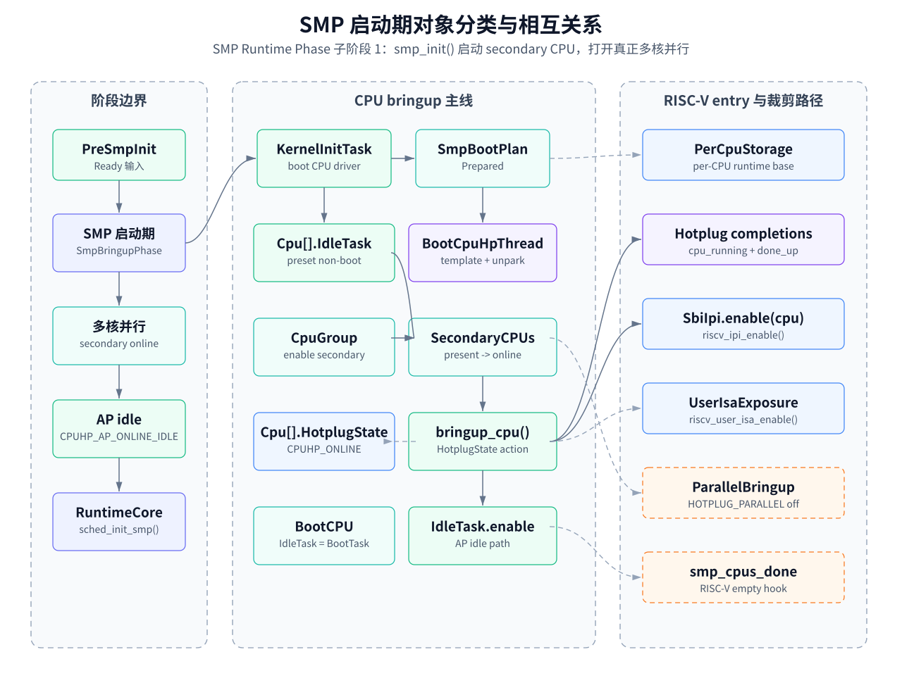
</p>

<p align="center">
  图 28 SMP 启动期对象分类与相互关系
</p>

图 28 用于说明 `SMP Runtime Phase` 子阶段 1 的对象分类和依赖关系。左侧是从 `PreSmpInitPhase` 进入多核运行期的阶段边界，中间是由 `KernelInitTask` 驱动的 CPU bringup 主线对象与复合动作，右侧是 RISC-V secondary entry 中使用的 IPI、completion 实例、用户态 ISA 暴露和当前配置下裁剪的路径。图中 `CpuGroup.enable()` 表示 secondary CPU online 边界，不重新建立 CPU 拓扑对象；`bringup_cpu()` 只表示 `CpuHotplugState` 内部复合过程，不作为独立对象进入对象模型；`SecondaryEntryPrelude.run()` 是 `CpuGroup.Cpu[cpu]` 的 AP side action，不作为顶层对象；`CpuHotplugThread.run_to_target()` 表示被 BP 唤醒后在 AP 上执行后续 hotplug callbacks 的线程动作；`SmpbootThread` 按 Type 规则挂到 `CpuGroup.Cpu[cpu]` 下，不建立独立 `SmpbootThreadRegistry` 顶层对象；`cpu_running` / `done_up` / `done_down` 作为 `CpuHotplugState` 的 completion 实例，不作为独立 gate 对象。

##### SMP Runtime Phase 子阶段 1 过程处理清单（初稿）

| Linux 6.12.37 `smp_init()` 调用 / 规格补充动作 | 规格处理 | 备注 |
|---|---|---|
| `idle_threads_init()` | formal candidate: `CpuGroup.Cpu[cpu].IdleTask.preset()` | 遍历 possible CPU，跳过 boot CPU；为每个 possible non-boot CPU 通过 `fork_idle()` / `init_idle()` 准备 inactive idle task，并写入 per-CPU idle thread 与 runqueue idle 引用。不启动 CPU，不推进 `enable()`。 |
| `cpuhp_threads_init()` | composite action: `CpuHotplugState.preset_sync_gates()` + `CpuHotplugThread.template.register()` + `BootCPU.CpuHotplugThread.preset/setup/enable()` | 初始化每个 possible CPU 的 hotplug 同步门，注册 `cpuhp/%u` per-CPU thread 模板，只为当前 online 的 boot CPU 创建并 unpark cpuhp thread；secondary CPU 的 `CpuHotplugThread` 留给后续 bringup/hotplug 路径。 |
| `bringup_nonboot_cpus(setup_max_cpus)` with `setup_max_cpus == 0` | checkpoint | `nosmp` / 禁用 secondary bringup 路径；成立时不推进 `CpuGroup.enable()`。 |
| `cpuhp_bringup_cpus_parallel(max_cpus)` | trimmed/no-op | 当前未启用 `CONFIG_HOTPLUG_PARALLEL`，该路径返回 false；后续如启用并行 bringup，再恢复为 parallel bringup 策略对象或 action。 |
| `cpuhp_bringup_mask(cpu_present_mask, setup_max_cpus, CPUHP_ONLINE)` | formal candidate: `CpuGroup.enable(mask = present_cpus, limit = setup_max_cpus, target = CPUHP_ONLINE)` | 集合级串行驱动动作，逐个选择 present CPU 并调用该 CPU 的 hotplug 状态推进；不直接执行 arch 启动。 |
| `cpu_up(cpu, CPUHP_ONLINE)` / `_cpu_up(cpu, 0, CPUHP_ONLINE)` | nested formal: `CpuGroup.Cpu[cpu].CpuHotplugState.advance(target = CPUHP_ONLINE)` | 检查 possible/present/bootable，要求 inactive idle task 已准备，设置目标 hotplug step，并在 BP-side 推进到 `CPUHP_BRINGUP_CPU`；之后 AP-side callbacks 由目标 CPU 的 `CpuHotplugThread` 继续执行。 |
| `CPUHP_CREATE_THREADS` / `smpboot_create_threads(cpu)` | nested formal: `CpuGroup.Cpu[cpu].SmpbootThread[*].setup()` | 为目标 CPU 创建所有已注册 smpboot per-CPU thread 实例并 park，标准状态推进到 `Ready`，扩展状态为 `Parked`。这是 `SmpbootThread` 实例创建点，不是后续 unpark/enable。 |
| `CPUHP_BRINGUP_CPU` / `bringup_cpu(cpu)` | nested composite action: `CpuHotplugState.bringup_cpu(cpu)` | 位于 `CpuHotplugState.advance()` 内部；显式分为 BP side 和 AP side。BP side 调用 `__cpu_up()` / `cpu_ops->cpu_start()` 并等待 completion；AP side 从 secondary entry 汇编路径开始执行。 |
| RISC-V `__cpu_up(cpu, idle)` | BP-side nested action | 设置目标 idle task 的 CPU，调用 `cpu_ops->cpu_start(cpu, idle)` 启动目标 hart，并等待 `cpu_running`。 |
| RISC-V `cpu_ops->cpu_start(cpu, idle)` | fork point: `CpuStartProvider.start(cpu, idle)` | BP/AP 分叉点。SBI HSM 路径写入 boot data 后调用 `sbi_hsm_hart_start(hartid, secondary_start_sbi, boot_data)`；从该点开始，目标 secondary CPU 自己执行 AP side。 |
| RISC-V `wait_for_completion_timeout(&cpu_running, ...)` | BP-side completion process: `CpuHotplugState.cpu_running.wait_timeout()` | `cpu_running` 是 `Completion` 实例，规格归入 `CpuHotplugState` 的 arch bringup 同步属性；等待方是 boot CPU，完成方是目标 secondary CPU 的 `smp_callin()`，不建立 `CpuRunningGate`。 |
| RISC-V `secondary_start_sbi` / `.Lsecondary_start_common` | AP-side action: `CpuGroup.Cpu[cpu].SecondaryEntryPrelude.run()` | 目标 secondary CPU 自己执行的入口先导，可视为 BP 入口前导期的简化版。它复用 `InterruptStream`、`KernelImage`、`EventStream`、`KernelAddressSpace`、`IdleTask` / `Stack` 等对象语言，但不重新清零 BSS、不重建早期页表、不重新建立 `BootCPU`；内部屏蔽中断、加载 `gp`、绑定 `tp` / `sp`、启用 MMU、设置正式异常入口和加载 SCS，然后进入 `smp_callin()`。 |
| RISC-V `smp_callin()` | nested action: `CpuGroup.Cpu[cpu].smp_callin()` | AP 侧入口 action，不建立独立对象；内部顺序覆盖 vector 检查、idle task 地址空间绑定、topology 记录、CPU hotplug starting 通知、IPI/online/ISA/flush、`cpu_running.complete()`、本地中断打开和 AP idle 入口。 |
| `has_vector()` / `riscv_v_setup_vsize()` in `smp_callin()` | conditional action: `VectorContext.verify_cpu_vlen(cpu)` | 有 vector 时校验当前 hart 的 vlen，失败时 AP bringup 返回并走失败路径；无 vector 时 trimmed/no-op。 |
| `mmgrab(&init_mm)` / `current->active_mm = &init_mm` in `smp_callin()` | action: `CpuGroup.Cpu[cpu].IdleTask.bind_active_mm(KernelAddressSpace.init_mm)` | 当前 AP 正在执行前序准备的 idle task；本动作把它绑定到内核地址空间，不新建地址空间对象。 |
| `store_cpu_topology(curr_cpuid)` in `smp_callin()` | action: `CpuGroup.CpuTopology.record(Cpu[cpu])` | 记录 secondary CPU 的 topology 属性；前序 `smp_prepare_cpus()` 已记录 boot CPU，本处补齐 AP 侧 CPU。 |
| `notify_cpu_starting(curr_cpuid)` in `smp_callin()` | nested composite action: `CpuHotplugState.notify_starting(cpu)` | AP 侧执行 generic CPU hotplug starting 通知；内部包含 RCU CPU starting、`booted_once` 标记和 AP starting callback range；细节列入后续计划，不阻塞当前 `smp_init()` 主线收尾。 |
| `riscv_ipi_enable()` in `smp_callin()` | nested action: `SbiIpi.enable(cpu)` | 为当前 secondary CPU 启用 IPI 接收路径；不自动声明跨 CPU callback 全部运行期语义完成。 |
| `numa_add_cpu(curr_cpuid)` in `smp_callin()` | trimmed/no-op | 当前 `CONFIG_NUMA=n`，不展开 NUMA 对象建模。 |
| `set_cpu_online(curr_cpuid, true)` in `smp_callin()` | action: `CpuGroup.Cpu[cpu].mark_online()` | 写入 CPU online 状态和 online mask；它早于 AP idle 入口，因此不等同于 `IdleTask.enable()` 或 `CPUHP_AP_ONLINE_IDLE` 完成。 |
| `riscv_user_isa_enable()` in `smp_callin()` | action: `UserIsaExposure.enable(cpu)` | 当前主要按 Zicboz 支持设置 `ENVCFG_CBZE`，属于每 CPU 用户态 ISA 暴露路径。 |
| `local_flush_icache_all()` / `local_flush_tlb_all()` in `smp_callin()` | action: `CpuGroup.Cpu[cpu].flush_entry_caches()` | CPU 从 offline 过渡到 online 时补做本地 icache/TLB 清理；不建独立对象。 |
| `complete(&cpu_running)` in `smp_callin()` | nested completion process: `CpuHotplugState.cpu_running.complete()` | AP 侧完成 arch entry 握手，释放 `__cpu_up()` 中的等待；该动作只推进 completion 扩展状态，不推进独立对象生命周期。 |
| `complete_ap_thread(st, true)` in `cpuhp_online_idle()` | nested completion process: `CpuHotplugState.done_up.complete()` | AP 进入 `CPUHP_AP_ONLINE_IDLE` 后完成 generic hotplug online-idle 同步，供 `bringup_wait_for_ap_online()` 等待。 |
| `local_irq_enable()` in `smp_callin()` | nested action: `InterruptStream.enable(cpu)` | AP 侧打开 RISC-V `sstatus.SIE` 本地中断总开关；和 boot CPU 的 `InterruptStream.enable()` 同属 per-CPU 中断开放事实。 |
| `cpu_startup_entry(CPUHP_AP_ONLINE_IDLE)` | nested formal: `CpuGroup.Cpu[cpu].IdleTask.enable()` | secondary CPU 进入 AP idle 路径；内部调用 `cpuhp_online_idle()`，完成 `done_up`，此后对应 CPU 的 idle task 进入运行态。 |
| `cpuhp_kick_ap(cpu, st, st->target)` after `bringup_wait_for_ap_online()` | conditional composite action: `CpuHotplugState.kick_ap_if_needed(target)` | 若 `target <= CPUHP_AP_ONLINE_IDLE`，退化为 no-op/checkpoint；若目标超过 online-idle，BP 设置 target/`should_run`，唤醒目标 CPU 的 `CpuHotplugThread`，并等待 AP-side callbacks 跑到目标状态。 |
| `cpuhp_thread_fun()` on target CPU | AP-side repeated action: `CpuGroup.Cpu[cpu].CpuHotplugThread.run_to_target(target)` | AP hotplug thread 每次执行一个非空 AP state callback；典型后续 callback 包括 smpboot thread unpark、IRQ affinity online、Workqueue/Randomness/RCU per-CPU online 和 Scheduler active。perf/watchdog 等后续按配置可 deferred。 |
| `CPUHP_AP_SMPBOOT_THREADS` / `smpboot_unpark_threads(cpu)` | nested formal: `CpuGroup.Cpu[cpu].SmpbootThread[*].enable()` | 对目标 CPU 上已 setup 且非 `selfparking` 的 smpboot thread 实例执行 unpark。当前只记录 enable 边界，不继续展开每个线程的运行逻辑。 |
| `num_online_nodes()` / `num_online_cpus()` logging | checkpoint | 记录 bringup 后 online node/cpu 计数，不建立对象。 |
| `smp_cpus_done(setup_max_cpus)` | trimmed/no-op | 当前 RISC-V 为空实现；保留架构收尾 hook 位置。 |

上表中 `CpuGroup.enable(...)` 是父级 composite event。更准确的嵌套层级是：`CpuGroup.enable(...)` 驱动每个目标 CPU 的 `CpuGroup.Cpu[cpu].CpuHotplugState.advance(...)`；后者先通过 `CPUHP_CREATE_THREADS` 为目标 CPU 的 `SmpbootThread` 实例执行 `setup()`，再在 `CPUHP_BRINGUP_CPU` step 内驱动 `CpuHotplugState.bringup_cpu(cpu)`。`CpuHotplugState.bringup_cpu(cpu)` 在 `CpuStartProvider.start(cpu, idle)` 处分叉：BP side 继续等待 `CpuHotplugState.cpu_running.wait_timeout()` 和 online-idle `done_up`；AP side 由目标 CPU 自己执行 `CpuGroup.Cpu[cpu].SecondaryEntryPrelude.run()`、`CpuGroup.Cpu[cpu].smp_callin()` 及其内部动作、`InterruptStream.enable(cpu)`、`CpuHotplugState.done_up.complete()` 和 `CpuGroup.Cpu[cpu].IdleTask.enable()`。随后若目标状态超过 `CPUHP_AP_ONLINE_IDLE`，BP 通过 `CpuHotplugState.kick_ap_if_needed(target)` 唤醒目标 CPU 的 `CpuHotplugThread.run_to_target(target)`，由 AP hotplug thread 继续执行后续 callbacks；其中 `CPUHP_AP_SMPBOOT_THREADS` 对应 `CpuGroup.Cpu[cpu].SmpbootThread[*].enable()`。这些 AP callbacks 当前只记录边界，不再深入展开实现细节。表格保留这些条目是为了展示 Linux 真实调用顺序，不表示它们与 `CpuGroup.enable()` 平级。

<p align="center">
  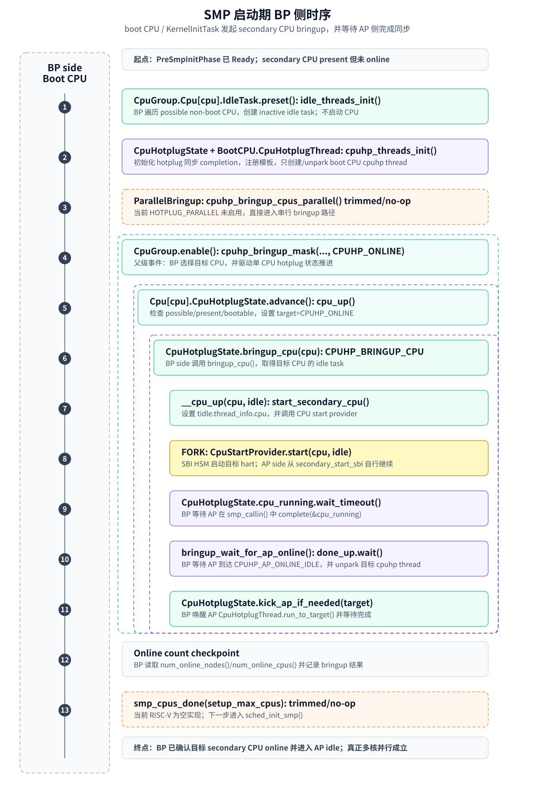
</p>

<p align="center">
  图 29 SMP 启动期 BP 侧时序
</p>

图 29 只展示 boot CPU / `KernelInitTask` / CPU hotplug controller 的 BP 侧流程。绿色节点表示主线 formal/action 候选，紫色节点表示 completion 等待，黄色节点表示 BP/AP 分叉点，橙色虚线节点表示当前配置下 trimmed/no-op 的路径。图中 `CpuStartProvider.start(cpu, idle)` 是关键分叉点：BP side 只负责释放目标 hart 并等待 `cpu_running` / online-idle `done_up`，不调用 AP side 的 `SecondaryEntryPrelude.run()` 或 `smp_callin()`；图中的 `kick_ap_if_needed(target)` 表示 BP 后续唤醒目标 CPU 的 `CpuHotplugThread` 跑 AP-side callbacks，不表示 BP 直接执行这些 callback。

<p align="center">
  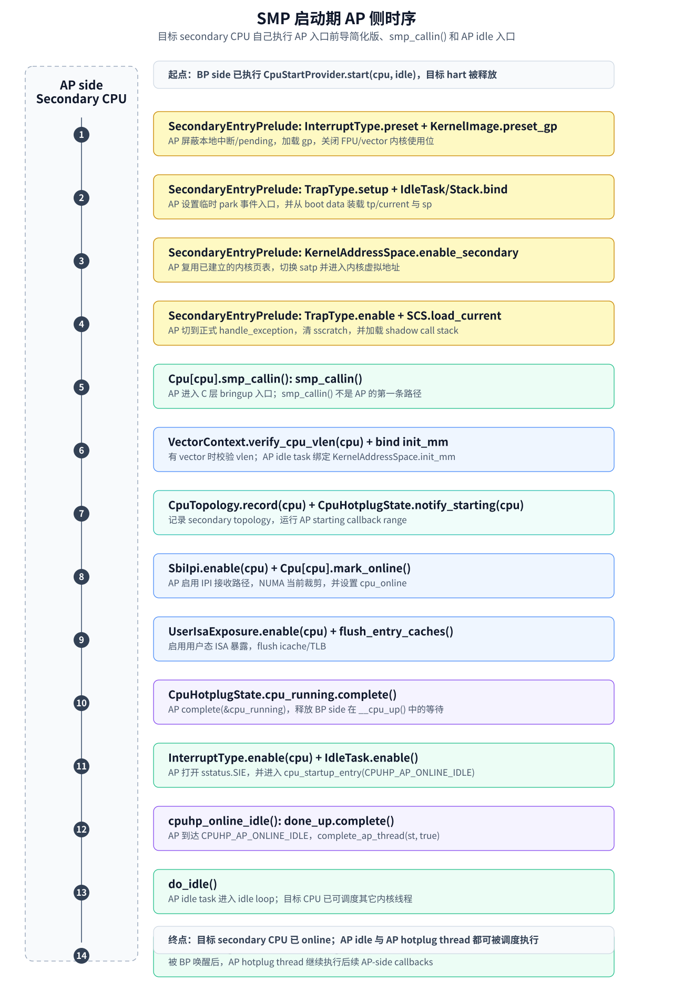
</p>

<p align="center">
  图 30 SMP 启动期 AP 侧时序
</p>

图 30 展示每个目标 secondary CPU 自己执行的 AP 侧路径。它从 BP side 的 `CpuStartProvider.start(cpu, idle)` 释放目标 hart 之后开始，不从 `smp_callin()` 开始；RISC-V/SBI 路径先进入 `secondary_start_sbi` 和 `.Lsecondary_start_common`。图中第 1-4 步可视为入口前导期的 AP 简化版：沿用 BP 入口前导期的对象语言来表达中断封闭、`gp` 初始化、临时/正式事件入口、任务/栈绑定、内核地址空间切换和 SCS 加载，但 AP 复用 BP 已建立的内核页表，不重新执行清 BSS、建立 BootCPU 等 BP 专属动作。随后 AP 才进入 `CpuGroup.Cpu[cpu].smp_callin()`。AP 侧在 `smp_callin()` 内 complete `cpu_running` 释放 BP side，之后打开本地中断并进入 `cpu_startup_entry(CPUHP_AP_ONLINE_IDLE)`，在 `cpuhp_online_idle()` 中 complete online-idle `done_up`。若 BP 随后执行 `cpuhp_kick_ap()`，AP 上的 `CpuHotplugThread` 会被唤醒并继续运行 AP-side hotplug callbacks，直到达到 `CPUHP_ONLINE` 或进入失败/rollback 分支。

本子阶段的结束状态暂定至少包含：

- `SmpBringupPhase.state == Ready`
- `CpuGroup.state == Online`
- `CpuGroup.Cpu[BootCPU.id].IdleTask == BootIdleTask`，该引用已由前序 `sched_init()` / `idle_thread_set_boot_cpu()` 建立
- `for cpu in CpuGroup.possible_secondary_cpus: CpuGroup.Cpu[cpu].IdleTask.state == Prepared`，表示 `idle_threads_init()` 已准备 inactive secondary idle task
- `for cpu in CpuGroup.possible_cpus: CpuGroup.Cpu[cpu].CpuHotplugState.done_up/down initialized`，二者是 `Completion` 实例，归属 `CpuHotplugState`
- `CpuHotplugThread.template.registered == true`
- `BootCPU.CpuHotplugThread.state == Online`
- `for cpu in CpuGroup.online_secondary_cpus: CpuGroup.Cpu[cpu].SmpbootThread[*].state >= Ready`，表示 `CPUHP_CREATE_THREADS` 已创建并 park 目标 CPU 的 smpboot per-CPU thread 实例
- `CPUHP_AP_SMPBOOT_THREADS` 对应的 `CpuGroup.Cpu[cpu].SmpbootThread[*].enable()` 只作为边界记录；当前不要求深入展开每个 smpboot thread 的运行逻辑
- `for cpu in CpuGroup.online_secondary_cpus: CpuGroup.Cpu[cpu].CpuHotplugThread` 已能被 `CpuHotplugState.kick_ap_if_needed(target)` 唤醒并执行 AP-side callbacks
- `for cpu in CpuGroup.possible_secondary_cpus: CpuGroup.Cpu[cpu].CpuHotplugThread` 不作为未上线 CPU 的本调用结束状态要求
- `SecondaryCPUs.online_count == min(setup_max_cpus, present_cpu_count)`，允许平台或启动参数导致 fewer CPUs online 的情况按 Linux 错误处理路径记录
- 每个 online secondary CPU 已执行 `CpuGroup.Cpu[cpu].smp_callin()`；其中 `IdleTask.active_mm == KernelAddressSpace.init_mm`，secondary CPU topology 已记录，`CpuHotplugState.notify_starting(cpu)` 已执行
- 每个 online secondary CPU 已完成 `CpuGroup.Cpu[cpu].mark_online()`、`UserIsaExposure.enable(cpu)` 和 `CpuGroup.Cpu[cpu].flush_entry_caches()`
- 每个 online secondary CPU 的 `CpuGroup.Cpu[cpu].CpuHotplugState.current_step` 已达到 `CPUHP_AP_ONLINE_IDLE`；当 `target == CPUHP_ONLINE` 时，还应已通过 `CpuHotplugThread.run_to_target(CPUHP_ONLINE)` 推进到 `CPUHP_ONLINE`
- 每个 online secondary CPU 已执行 `SbiIpi.enable(cpu)`，并已打开本地中断
- 每个 online secondary CPU 的 `CpuGroup.Cpu[cpu].IdleTask.state == Online`，并已进入 AP idle path
- `BootCPU` 保持 online，`KernelInitTask` 继续在 boot CPU 上进入 `RuntimeCorePhase`
- RISC-V `cpu_running` 作为 `CpuHotplugState.cpu_running` completion 实例约束记录；不保留独立 `CpuRunningGate` 对象
- `smp_cpus_done(setup_max_cpus)` 在当前 RISC-V 下记录为 trimmed/no-op
- 下一子阶段入口是 `sched_init_smp()`

AP 侧深入细节当前暂缓。原因是内核启动主线仍由 BP 占主导，AP 虽然被启动，但当前实现只需要 BP 可见的同步量与 online 边界即可继续完成后续内核启动并进入 payload。需要强调的是，暂缓 AP 侧内部动作不等于省略 BP/AP 协议：`cpu_running`、`done_up` 和 `done_down` 的位置必须保留，其中 `cpu_running` 与 `done_up` 是本阶段 BP 继续执行的必要确认，`done_down` 保留给后续失败/teardown 路径。后续如需要增强 SMP 完整性，再按以下计划补充：

1. `SmpbootThread` 每类模板的具体实例约束，例如 `ksoftirqd/%u`、`migration/%u`、`rcuc/%u`。
2. BP 侧 `CPUHP_BRINGUP_CPU` 前的 prepare callbacks 批量归属，包括 perf/random/workqueue/hrtimers/smpcfd/rcu/timers 等。
3. AP 侧 `notify_cpu_starting()` 内部 callback range 的对象归属与状态推进。
4. `cpuhp_online_idle()` 中除 `done_up.complete()` 以外的细节，例如 `stop_machine_unpark(cpu)`。
5. `cpuhp_kick_ap()` 后的 AP hotplug callbacks，从 `CPUHP_AP_SMPBOOT_THREADS` 到 `CPUHP_ONLINE` 的逐项处理。
6. `CPUHP_AP_ONLINE_IDLE`、`CPUHP_ONLINE`、`cpu.online`、`cpu.active`、`IdleTask.Online` 与 `CpuHotplugThread` 之间的最终结束状态校准。

#### SMP Runtime Phase 子阶段 2：运行核心补全期（Runtime Core Subphase）

`SMP Runtime Phase` 的第二个子阶段暂名 `RuntimeCorePhase`，中文名为运行核心补全期。它对应 Linux 6.12.37 `kernel_init_freeable()` 中从 `sched_init_smp()` 开始，到 `page_alloc_init_late()` 完成后、`do_basic_setup()` 执行前结束的初始化段。

这个子阶段发生在 secondary CPU 已经 online 之后，因此它的主线语义不再是“打开并行”，而是补齐多核运行所需要的核心调度、workqueue 和页分配器 late 能力。`sched_init_smp()` 会建立 SMP 调度域并解除 PID 1 的 boot CPU 绑定；`workqueue_init_topology()` 会把前序 workqueue 的 unbound pool 从默认全系统共享更新为按 CPU pod/topology 组织；`page_alloc_init_late()` 则完成 page allocator late 收尾。`async_init()` 和 `padata_init()` 主要服务后续异步 init/probe 与并行数据处理路径，当前初步规格轮次先标记为 deferred。

当前先将 `RuntimeCorePhase` 的对象和边界记录如下：

1. `运行核心补全期对象`（暂名 `RuntimeCorePhase`）：属于阶段对象，是 `SMP Runtime Phase` 的第二个子阶段对象。它从 `SmpBringupPhase.Ready` 接续，由 `KernelInitTask` 驱动，按 `sched_init_smp()` 到 `page_alloc_init_late()` 的有效顺序推进对象。
2. `调度器 SMP 补全动作`：覆盖 `sched_init_smp()`。当前 `CONFIG_SMP=y`，它建模为 `Scheduler.enable_smp()` action，而不是 `Scheduler` 主对象的标准生命周期 `enable` slot。原因是 `Scheduler` 在此前已经支撑 `KernelInitTask` / `KthreaddTask` 创建、`schedule_preempt_disabled()` 展开的首次调度分界和 `BootIdleTask` 运行；这里的语义只是补齐 SMP 调度能力。该 action 建立 `SchedDomain`，把 PID 1 的 CPU affinity 改为 `Housekeeping` domain mask，清除 `PF_NO_SETAFFINITY`，刷新调度 granularity，并初始化 RT/DL 调度类的 SMP 后置状态；完成后 `sched_smp_initialized == true`。
3. `Workqueue 拓扑启用动作`：覆盖 `workqueue_init_topology()`。规格语义上它是 Linux workqueue 三阶段初始化的第三步：前序 `workqueue_init_early()` 已对应 `Workqueue.preset()`，`workqueue_init()` 已对应 `Workqueue.setup()` 并推进到 `Ready`；这里在 SMP 和 CPU topology 信息稳定后补齐 unbound workqueue 的拓扑感知能力。当前 formal / coding 轮次为了保留前序阶段对 `Workqueue.Ready` 的历史不变式，将它落为 `WorkqueueTopology.setup()` action object，而不改变 `Workqueue` 主对象生命周期；后续若引入“阶段快照不变式”或更细的 Workqueue 子对象，可再把主对象推进到 `Online`。该 action 建立 CPU/SMT/cache/NUMA 四类 pod type，设置 `wq_topo_initialized = true`，并遍历已有 workqueue 与 online CPU 更新 unbound pool workqueue 绑定关系。
4. `异步执行核心对象`（暂名 `AsyncCore`）：覆盖 `async_init()`。它创建专用 `"async"` unbound workqueue，并提高 `min_active`，用于后续异步 init work 的调度和同步。当前轮次不展开 `async_domain`、cookie、pending list、wait queue 和 async worker 执行细节，标记为 `deferred: AsyncCore.setup()`。
5. `并行数据处理对象`（暂名 `PadataCore`）：覆盖 `padata_init()`。当前 `CONFIG_PADATA=y` 且 `CONFIG_HOTPLUG_CPU=y`，它登记 padata CPU online/dead hotplug state，并按 possible CPU 数分配 `padata_work` 数组，建立 free work list。由于具体 padata 实例在 `padata_alloc()` 时才创建，且当前轮次不深入 crypto、网络、驱动或大规模并行任务路径，标记为 `deferred: PadataCore.setup()`。
6. `页分配器 late 启用动作`：覆盖 `page_alloc_init_late()`。规格语义上它是 `PageAllocator` 的 late enable slot；当前 formal / coding 轮次将它落为 `PageAllocatorLate.setup()` action object，发布 late 收尾事实但不改变 `PageAllocator` 主对象生命周期，以避免与前序 `PageAllocator.Ready` 不变式冲突。当前未启用 `CONFIG_DEFERRED_STRUCT_PAGE_INIT`，因此 deferred page init kthread 路径裁剪；主线执行内存统计打印、buffer 初始化、memblock private memory discard、zone contiguous 标记和 page allocator sysctl 初始化。当前 `CONFIG_PAGE_EXTENSION=n`，page extension late 路径裁剪；当前 `CONFIG_SHUFFLE_PAGE_ALLOCATOR=n`，shuffle 路径不形成主线状态。

<p align="center">
  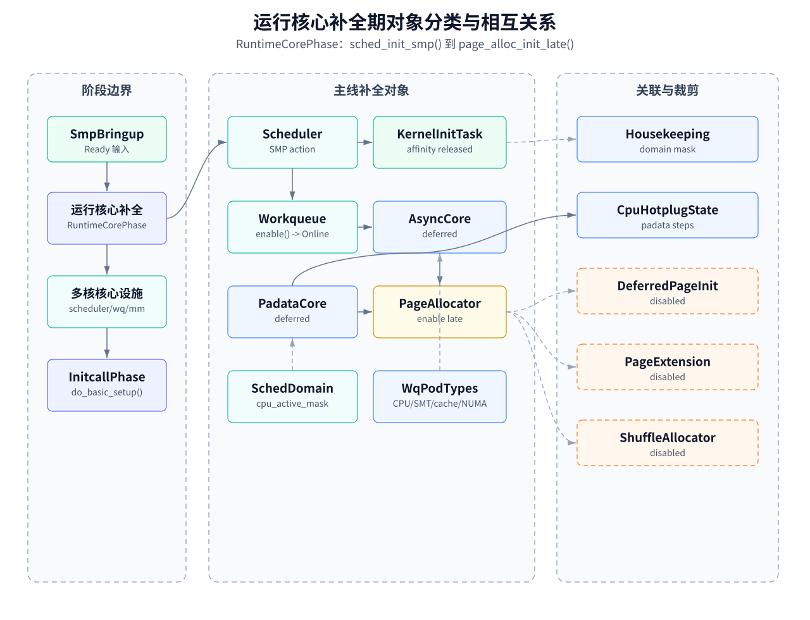
</p>

<p align="center">
  图 31 运行核心补全期对象分类与相互关系
</p>

图 31 用于说明 `SMP Runtime Phase` 子阶段 2 的对象分类和依赖关系。左侧是从 `SmpBringupPhase` 到 `InitcallPhase` 的阶段边界，中间是多核运行核心补全的主线对象，右侧是当前配置下的裁剪路径以及 `Housekeeping`、CPU topology、hotplug state 等关联事实。

##### SMP Runtime Phase 子阶段 2 过程处理清单（初稿）

| Linux 6.12.37 调用 / 规格补充动作 | 规格处理 | 备注 |
|---|---|---|
| `sched_init_smp()` | formal action: `Scheduler.enable_smp()` | `Scheduler` 主对象已经可用；本项只是补齐 SMP 调度能力。建立 SMP sched domains，解除 PID 1 的 boot CPU 绑定，清除 `PF_NO_SETAFFINITY`，初始化 granularity、RT/DL SMP 后置状态，并设置 `sched_smp_initialized`。 |
| `workqueue_init_topology()` | formal action: `WorkqueueTopology.setup()` | 前序已完成 `Workqueue.preset()` 和 `Workqueue.setup()`；本项作为第三阶段初始化，补齐 unbound workqueue 的拓扑感知能力。当前轮次不推进 `Workqueue` 主对象生命周期，以保留前序阶段历史不变式。 |
| `async_init()` | deferred: `AsyncCore.setup()` | 创建 `"async"` unbound workqueue 并设置 `min_active`；当前不展开 async domain/cookie/pending/waiter/worker 细节，后续 async init/probe 路径再恢复。 |
| `padata_init()` | deferred: `PadataCore.setup()` | 当前 `CONFIG_PADATA=y`，登记 hotplug online/dead state，分配 per-possible-CPU padata work 数组并建立 free list；具体 padata 实例留给 `padata_alloc()` 相关路径。 |
| `page_alloc_init_late()` | formal action: `PageAllocatorLate.setup()` | 完成 page allocator late 收尾：内存统计、buffer init、memblock discard、zone contiguous、sysctl。当前轮次不推进 `PageAllocator` 主对象生命周期，以保留前序阶段历史不变式。 |
| `CONFIG_DEFERRED_STRUCT_PAGE_INIT` block | trimmed/no-op | 当前未启用，不启动 deferred init memmap kthread。 |
| `page_ext_init()` path | trimmed/no-op | 当前 `CONFIG_PAGE_EXTENSION=n`，不进入主线。 |

<p align="center">
  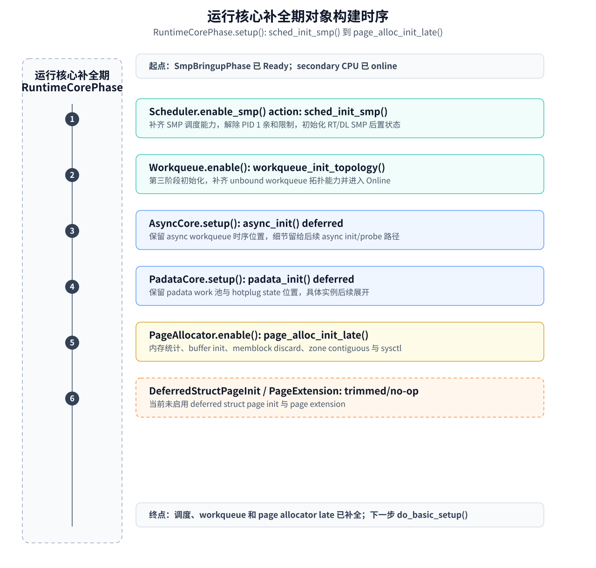
</p>

<p align="center">
  图 32 运行核心补全期对象构建时序
</p>

图 32 按 Linux 6.12.37 `sched_init_smp()` 到 `page_alloc_init_late()` 的有效调用顺序展示 `SMP Runtime Phase` 子阶段 2 的推进过程。绿色节点表示主线 formal/action 候选，蓝色节点表示仍保留 Linux 时序位置但当前轮次 deferred 的路径，橙色虚线节点表示当前配置下 trimmed/no-op 的路径。

本子阶段的结束状态暂定至少包含：

- `RuntimeCorePhase.state == Ready`
- `Scheduler.smp_initialized == true`
- `KernelInitTask` 已解除 boot CPU 绑定，`PF_NO_SETAFFINITY` 已清除
- `Workqueue.state == Ready`，且 `WorkqueueTopology.state == Ready` / `Workqueue.topology_ready == true`
- `AsyncCore` 和 `PadataCore` 保留时序位置，但当前轮次标记为 deferred
- `PageAllocator.state == Ready`，且 `PageAllocatorLate.state == Ready` / `PageAllocator.late_ready == true`
- `DeferredStructPageInit`、`PageExtensionLate` 和 `ShufflePageAllocatorLate` 按当前配置记录为 trimmed/no-op
- 下一子阶段入口是 `do_basic_setup()`

#### SMP Runtime Phase 子阶段 3：initcall 期（Initcall Subphase）

`SMP Runtime Phase` 的第三个子阶段暂名 `InitcallPhase`，中文名为 initcall 期。它对应 Linux 6.12.37 `do_basic_setup()` 的完整执行段，从 `cpuset_init_smp()` 开始，到 `do_initcalls()` 完成后、`kunit_run_all_tests()` 执行前结束。

这个子阶段是多核运行后第一个大规模表驱动初始化阶段：驱动模型核心、IRQ proc 可见结构、构造函数和所有 initcall level 在这里被集中执行。规格层当前先把 `do_initcalls()` 建模为 `InitcallTable.run_all_levels()`，不把每个 initcall 都升级为顶层对象；后续逐项讨论时可以按 level 或按关键对象拆分。

当前先将 `InitcallPhase` 的对象和边界记录如下：

1. `initcall 期对象`（暂名 `InitcallPhase`）：属于阶段对象，是 `SMP Runtime Phase` 的第三个子阶段对象。它从 `RuntimeCorePhase.Ready` 接续，由 `KernelInitTask` 驱动，执行 `do_basic_setup()` 内部的驱动模型、IRQ proc、ctors 和 initcalls。
2. `Cpuset SMP 路径`：覆盖 `cpuset_init_smp()`。当前 `CONFIG_CGROUPS=n`，cpuset 路径为空实现，按 trimmed/no-op 记录；未来启用 cgroup/cpuset 后，可恢复为 `Cpuset.enable_smp()`。
3. `驱动模型核心对象集合`（暂名 `DriverCore`）：覆盖 `driver_init()`。它建立 noop backing device info、devtmpfs、device/bus/class/firmware/hypervisor core、OF core、platform bus、auxiliary bus、memory/node/cpu/container device 等驱动模型基础。由于驱动模型内部对象层次较大，当前初步规格轮次先保留 Linux 时序位置，标记为 `deferred: DriverCore.setup()`。
4. `IRQ proc 导出对象`（暂名 `IrqProcView`）：覆盖 `init_irq_proc()`。当前 `CONFIG_PROC_FS=y`，它创建 `/proc/irq` 根目录，注册 default affinity proc，并为已有 IRQ descriptor 创建 proc entry；它依赖前序 `IrqDispatchTree.Ready` 与 `Procfs` 可用路径。由于该路径主要服务 IRQ 信息导出和用户态可见配置，不影响中断分发主线，当前轮次标记为 `deferred: IrqProcView.setup()`。
5. `静态构造函数表`（暂名 `CtorTable`）：覆盖 `do_ctors()`。当前 formal / coding 轮次只保留表位置；如果构造函数表为空或未启用，则记录为 trimmed/empty；如果未来启用，则遍历 `__ctors_start` 到 `__ctors_end` 执行构造函数。
6. `全量 initcall 表`（暂名 `InitcallTable`）：覆盖 `do_initcalls()`。`InitcallTable` 是由 linker section 形成的静态表对象，`do_initcalls()` 不负责建立表，而是执行该表，因此建模为 `InitcallTable.run_all_levels()` action。它从 level 0 到最后一个 level 遍历 `initcall_levels`，每个 level 复制 `saved_command_line`，解析对应参数，再执行 `do_one_initcall()`。这是表驱动过程，不把所有 initcall 都升级为顶层对象。当前对象级实现先记录固定的最小表摘要和运行事实，后续再把具体 entry 绑定到目标对象 event/action。

##### InitcallTable 对象框架（初稿）

`InitcallTable` 当前按“独立表对象 + 结构化属性”的方式建模，既保留 Linux linker table 的结构，又避免把数百个 initcall 过早提升为独立对象：

1. `InitcallTable`：独立静态表对象，依赖 `Lds`/linker section 中的 `__initcall0_start` 到 `__initcall_end` ranges。核心 action 是 `run_all_levels()`，完成后记录 `all_levels_ran == true`。
2. `levels`：`InitcallTable` 的结构化属性，对应 `pure/core/postcore/arch/subsys/fs/device/late` 八个 level。每个 level 记录 `name`、`start_entry`、`end_entry` 和运行状态；执行时先解析本 level 参数，再顺序运行该 level 范围内的 entries。
3. `entries`：`InitcallTable` 的结构化属性，对应按 linker range 排列的 `initcall_entry_t[]`。每个 entry 记录函数句柄、所属 level、表内顺序、是否被 blacklist 跳过、返回值和运行诊断。规格层当前不为每个 entry 建立顶层生命周期对象。
4. `CommandLineScratch`：`do_initcalls()` 为 `saved_command_line` 分配的一份可修改副本。因为 `parse_args()` 会改写命令行，所以每个 level 执行前都重新从 `saved_command_line` 复制；执行结束后释放。
5. `InitcallParamParser`：对 `__start___param` 到 `__stop___param` 的参数表按当前 level 解析 boot 参数，未知 boot option 由 `ignore_unknown_bootoption()` 忽略。当前作为 `InitcallLevel.run()` 的内部 action，不单独建顶层对象。
6. `InitcallFilter`：覆盖 `initcall_blacklist=` 形成的 blacklist 过滤。当前 `CONFIG_KALLSYMS` 相关细节可按条件路径保留；被过滤的 entry 记录为 skipped，返回 `-EPERM`，不调用目标函数。
7. `InitcallRunContext`：覆盖 `do_one_initcall()` 的执行上下文保护。它记录调用前 `preempt_count()`，调用后修复 preemption imbalance 和 disabled interrupts，执行 optional trace start/finish，并在每个 entry 后调用 `add_latent_entropy()`。

每个 `entries[i]` 本质上是一个由静态表保存的 operation 入口。规格层后续可以把它绑定到某个目标对象的 `event` 或 `action`：如果该 entry 推进目标对象生命周期，则标为 event；如果只是执行一次过程或设置内部事实，则标为 action；当前轮次不分析的 entry 标为 deferred operation；配置裁剪或空实现则标为 trimmed/no-op。`InitcallTable` 不拥有这些目标对象，它只是通过 linker/static objects 保存并驱动这些 operation。

`InitcallTable.run_all_levels()` 的主线顺序如下：先分配 `CommandLineScratch`；然后对每个 level 属性复制 `saved_command_line`、解析该 level 参数、遍历 `[start_entry, end_entry)`；每个 entry 经 `InitcallFilter` 检查后由 `InitcallRunContext` 调用并记录结果；最后释放 `CommandLineScratch`。除分配失败会 panic 外，单个 initcall 的返回值通常作为结果和诊断记录，不直接阻断表的后续遍历。

<p align="center">
  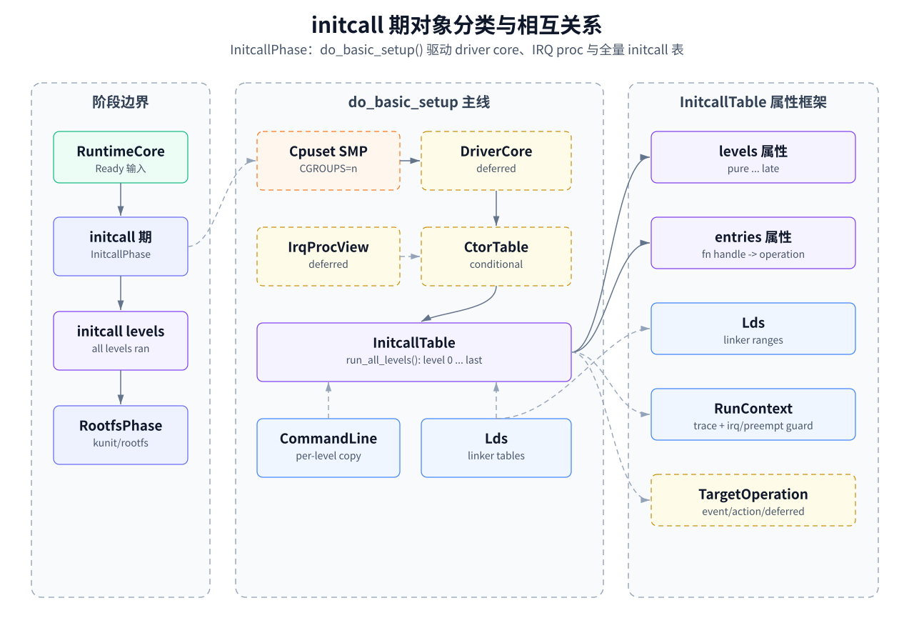
</p>

<p align="center">
  图 33 initcall 期对象分类与相互关系
</p>

图 33 用于说明 `SMP Runtime Phase` 子阶段 3 的对象分类和依赖关系。左侧是阶段边界，中间是 `do_basic_setup()` 的主线对象，右侧记录当前裁剪路径和 initcall 表驱动的输入事实。

##### SMP Runtime Phase 子阶段 3 过程处理清单（初稿）

| Linux 6.12.37 调用 / 规格补充动作 | 规格处理 | 备注 |
|---|---|---|
| `cpuset_init_smp()` | trimmed/no-op | 当前 `CONFIG_CGROUPS=n`，为空实现；未来恢复为 `Cpuset.enable_smp()`。 |
| `driver_init()` | deferred: `DriverCore.setup()` | 建立 devtmpfs、device/bus/class/firmware/hypervisor、OF/platform/auxiliary bus、memory/node/cpu/container device 等基础；当前只保留驱动模型入口位置，后续 DriverCore 规格再展开。 |
| `init_irq_proc()` | deferred: `IrqProcView.setup()` | 当前 `CONFIG_PROC_FS=y`，创建 `/proc/irq`，登记 default affinity proc，并为已有 IRQ 创建 proc entry；它是观测/配置导出路径，当前不影响 IRQ dispatch 主线。 |
| `do_ctors()` | conditional: `CtorTable.run()` | 当前按构造函数表位置保留；无条目或未启用时不形成主线状态。 |
| `do_initcalls()` | formal action: `InitcallTable.run_all_levels()` | 静态 linker table 的执行动作：按 `pure/core/postcore/arch/subsys/fs/device/late` 八个 level 遍历，复制命令行、解析 level 参数，经过 blacklist/filter 后执行每个 `InitcallEntry`。 |

<p align="center">
  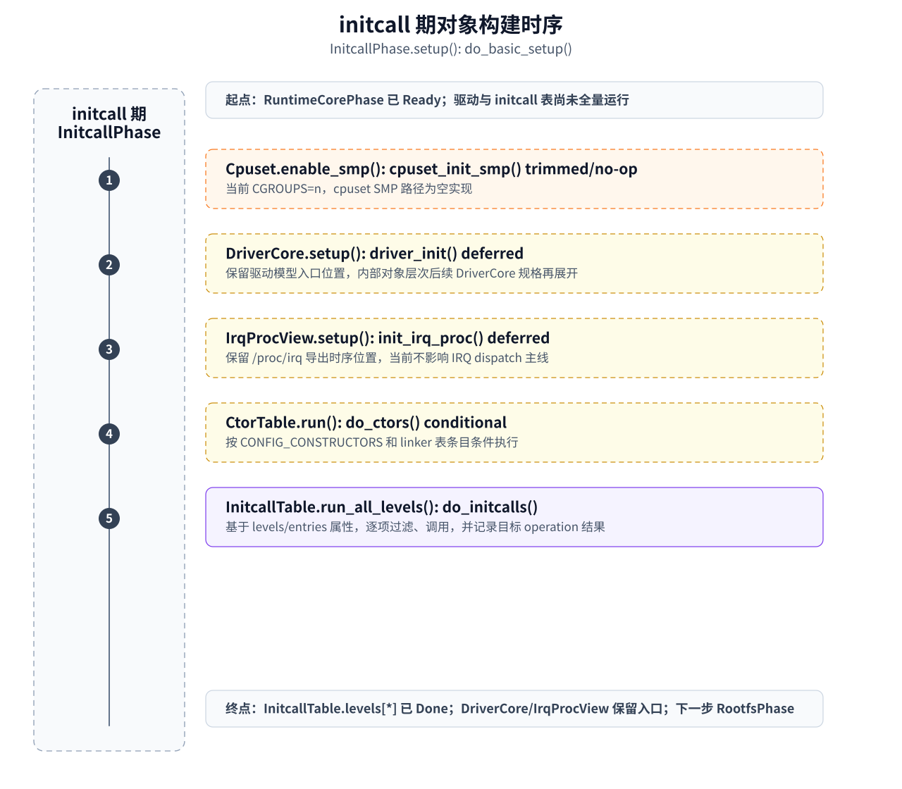
</p>

<p align="center">
  图 34 initcall 期对象构建时序
</p>

图 34 按 Linux 6.12.37 `do_basic_setup()` 的有效调用顺序展示 `SMP Runtime Phase` 子阶段 3 的推进过程。绿色节点表示主线 formal/action 候选，蓝色或黄色虚线节点表示当前轮次 deferred 或条件/表驱动细项，橙色虚线节点表示当前配置下 trimmed/no-op 的路径。

本子阶段的结束状态暂定至少包含：

- `InitcallPhase.state == Ready`
- `DriverCore` 保留时序位置，但当前轮次标记为 deferred
- `IrqProcView` 保留时序位置，但当前轮次标记为 deferred
- `InitcallTable.all_levels_ran == true`
- `InitcallTable.levels[*].state == Done`
- `InitcallTable.entries[*]` 作为表内属性记录返回值、skipped 状态、运行诊断和未来可绑定的目标 operation
- `CpusetSmp` 按当前配置记录为 trimmed/no-op
- `CtorTable` 保留表位置，是否实际运行取决于构造函数表配置和条目
- 下一子阶段入口是 `kunit_run_all_tests()`，随后进入 `RootfsPhase`
- 下一子阶段入口是 `kunit_run_all_tests()`

#### SMP Runtime Phase 子阶段 4：rootfs 准备期（Rootfs Subphase）

`SMP Runtime Phase` 的第四个子阶段暂名 `RootfsPhase`，中文名为 rootfs 准备期。它对应 Linux 6.12.37 `kernel_init_freeable()` 中从 `kunit_run_all_tests()` 开始，到 `integrity_load_keys()` 完成后、`kernel_init_freeable()` 返回前结束的初始化段。

这个子阶段的主线语义是为第一个用户态程序准备可用 rootfs 和安全/完整性相关前置条件。当前 `CONFIG_KUNIT=n`，KUnit 测试路径裁剪；`wait_for_initramfs()` 和 `console_on_rootfs()` 保留 Linux 时序位置但当前轮次不展开；`init_eaccess(ramdisk_execute_command)` 是强约束 checkpoint，当前 Linux-like 规格要求该检查必须进入调用 `prepare_namespace()` 的分支；`prepare_namespace()` 挂载 root、挂载 devtmpfs，并把当前 root 移到 `/`；`integrity_load_keys()` 在当前 `CONFIG_INTEGRITY=y` 下执行完整性 key 加载路径。

当前先将 `RootfsPhase` 的对象和边界记录如下：

1. `rootfs 准备期对象`（暂名 `RootfsPhase`）：属于阶段对象，是 `SMP Runtime Phase` 的第四个子阶段对象。它从 `InitcallPhase.Ready` 接续，由 `KernelInitTask` 驱动，准备用户态入口前的 rootfs、console fd 和 integrity keys。
2. `KUnit 测试路径`（暂名 `KUnitRuntimeTrimmed`）：覆盖 `kunit_run_all_tests()`。当前 `CONFIG_KUNIT=n`，按 trimmed/no-op 记录；它属于 `RootfsPhase` 的入口动作，不单独形成 `KUnitPhase`。
3. `Initramfs 同步对象`（暂名 `InitramfsSyncDeferred`）：覆盖 `wait_for_initramfs()`。它等待 initramfs async domain 到达 cookie 边界；若 initramfs cookie 不存在，只记录早期访问警告路径。当前轮次不深入 initramfs 异步展开和 cookie/domain 细节，标记为 `deferred: InitramfsSync.wait()`。
4. `rootfs console 对象`（暂名 `RootfsConsoleDeferred`）：覆盖 `console_on_rootfs()`。它打开 `/dev/console`，并通过 `init_dup()` 建立 PID 1 的 stdin/stdout/stderr。由于它属于用户态入口 fd 准备细节，当前轮次保留时序位置，标记为 `deferred: RootfsConsole.setup()`。
5. `根文件系统 enable 事件`（目标对象为 `RootFS`）：覆盖 `prepare_namespace()`。`RootFS` 是顶层对象，表示当前系统根文件系统视图/根挂载树；它取代原先暂名 `RootNamespace`，避免把 Linux mount namespace 实现细节误认为规格对象。早期 `RootFS` 的 backing 指向内存中的 `RamFS`/`rootfs`，后续真实 backing 可以是 `Ext4RootFS`、其它块设备文件系统或当前配置支持的 root filesystem。`init_eaccess(ramdisk_execute_command)` 作为前置 checkpoint，当前规格要求结果必须满足调用 `prepare_namespace()` 的条件，即 early userspace init 不可直接执行；若 early userspace init 可执行并导致跳过 `prepare_namespace()`，当前 Linux-like 变种视为不支持路径或错误边界。满足条件后，`prepare_namespace()` 由 `RootFS.enable()` 表达：当前轮次先完成 Linux `do_mount_root()` 形态的真实 ext2 文件系统 `/root` staging mount，再分开执行 `VfsCore.Action::MoveMountToRoot` 与 `FsStruct.Action::ChrootDot`，使任务可见的当前 root/pwd 指向 ext2 root。
6. `完整性 key 加载对象`（暂名 `IntegrityKeysDeferred`）：覆盖 `integrity_load_keys()`。当前 `CONFIG_INTEGRITY=y` 时它执行 IMA/EVM X.509 key 加载路径；由于该路径属于安全/完整性子系统的后续细化内容，当前轮次保留 Linux 时序位置，标记为 `deferred: IntegrityKeys.setup()`。
7. `rootfs 准备边界对象`（暂名 `RootfsBoundary`）：聚合上述时序位置，并把下一入口固定为 `FinalizePhase`。

`RootFS` 的生命周期横跨更早的 VFS/mount 初始化和当前 `RootfsPhase`。当前先按如下职责记录，后续正规化规格时再放入对应子阶段：

1. `RootFS.preset()`：对应更早的 `init_rootfs()` / `rootfs_fs_type` 准备。它确定初始 rootfs backing 类型，默认是 `RamFS`，在启用 tmpfs 且启动参数条件满足时可以选择 `TmpFS`；结束后记录 `RootFS.fs_type_ready == true` 和 `RootFS.initial_backing_candidate`。
2. `RootFS.setup()`：对应更早的 `init_mount_tree()`。它创建初始 rootfs mount tree，分配初始 mount namespace，并把 `init_task.nsproxy->mnt_ns`、`current->fs.root` 和 `current->fs.pwd` 指向该 rootfs；结束后 `RootFS.state == Ready`，但 backing 仍是初始内存 rootfs。
3. `RootFS.enable()`：对应当前 `prepare_namespace()`。它在 `init_eaccess(ramdisk_execute_command)` required checkpoint 成立后执行；当前轮次完成真实 ext2 文件系统的 `/root` staging mount、`MS_MOVE` 挂载移动和 `chroot(".")`。完成后 `RootFS.state == Online` 表示 prepare_namespace 的当前支持部分已经执行完毕，`FsStruct.root/pwd` 均指向 ext2 root。

<p align="center">
  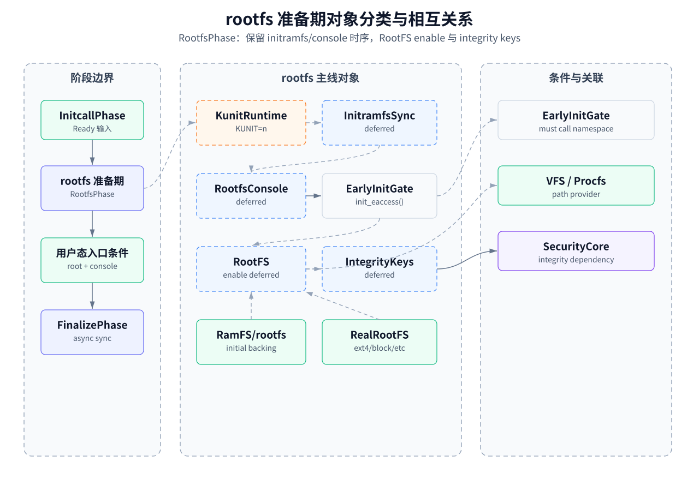
</p>

<p align="center">
  图 35 rootfs 准备期对象分类与相互关系
</p>

图 35 用于说明 `SMP Runtime Phase` 子阶段 4 的对象分类和依赖关系。左侧是阶段边界，中间是 rootfs、console、namespace 和 integrity 主线对象，右侧记录当前配置下的 KUnit 裁剪、early userspace init 条件分支和 devtmpfs/root device 关联事实。

Ext2、VFS、RootFS 和 `FsStruct` 的更一般对象关系不放在本 rootfs 子阶段中展开，见后文“文件系统的分析”章节。

##### SMP Runtime Phase 子阶段 4 过程处理清单（初稿）

| Linux 6.12.37 调用 / 规格补充动作 | 规格处理 | 备注 |
|---|---|---|
| `kunit_run_all_tests()` | trimmed/no-op | 当前 `CONFIG_KUNIT=n`。 |
| `wait_for_initramfs()` | deferred: `InitramfsSync.wait()` | 等待 initramfs async cookie 对应 domain；当前不展开 async domain/cookie 细节，无 cookie 时只形成 warning/checkpoint。 |
| `console_on_rootfs()` | deferred: `RootfsConsole.setup()` | 打开 `/dev/console` 并复制为 PID 1 的 stdin/stdout/stderr；当前保留用户态入口 fd 准备位置，不进入主线对象状态。 |
| `init_eaccess(ramdisk_execute_command)` | required checkpoint | 当前 Linux-like 规格要求该检查必须满足调用 `prepare_namespace()` 的条件；若 early userspace init 可执行并跳过 root namespace 准备，当前视为不支持路径或错误边界。 |
| `prepare_namespace()` | event: `RootFS.enable()` | `RootFS` 是顶层根文件系统对象；当前完成真实 ext2 文件系统的 `/root` staging mount、`MS_MOVE` 挂载移动和 `chroot(".")`。root device fallback、其它 fs type、initrd/NFS/CIFS 仍 deferred。 |
| `integrity_load_keys()` | deferred: `IntegrityKeys.setup()` | 保留 IMA/EVM X.509 key 加载时序位置；当前不展开 integrity keyring、IMA/EVM 条件和证书加载细节。 |

<p align="center">
  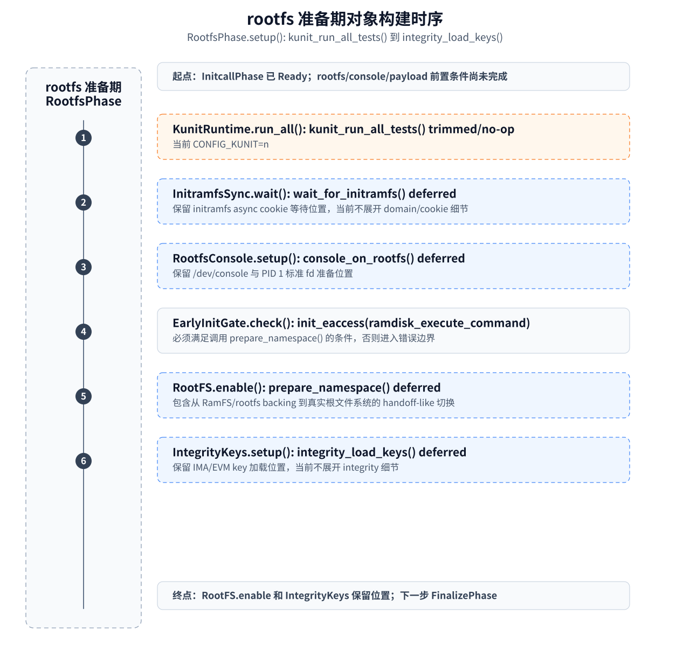
</p>

<p align="center">
  图 36 rootfs 准备期对象构建时序
</p>

图 36 按 Linux 6.12.37 `kunit_run_all_tests()` 到 `integrity_load_keys()` 的有效调用顺序展示 `SMP Runtime Phase` 子阶段 4 的推进过程。绿色节点表示主线 formal/action 候选，蓝色节点表示当前轮次 deferred 路径，紫色节点表示条件分支 checkpoint，橙色虚线节点表示当前配置下 trimmed/no-op 的路径。

本子阶段的结束状态暂定至少包含：

- `RootfsPhase.state == Ready`
- `InitramfsSync` 和 `RootfsConsole` 保留时序位置，但当前轮次标记为 deferred
- `RootFS.enable()` 已完成当前支持的 `prepare_namespace()` 路径：`init_eaccess(ramdisk_execute_command)` 必须满足调用条件，真实 ext2 root staging mount 已建立在 `/root`，`MS_MOVE` 与 `chroot(".")` 已完成，当前 root/pwd 指向 ext2 root
- `IntegrityKeys` 保留时序位置，但当前轮次标记为 deferred
- `KunitRuntime` 按当前配置记录为 trimmed/no-op
- 下一子阶段入口是 `kernel_init_freeable()` 返回后的 `async_synchronize_full()`

#### SMP Runtime Phase 子阶段 5：收尾期（Finalize Subphase）

`SMP Runtime Phase` 的第六个子阶段暂名 `FinalizePhase`，中文名为收尾期。它对应 Linux 6.12.37 `kernel_init()` 中 `kernel_init_freeable()` 返回之后，从 `async_synchronize_full()` 开始，到 `do_sysctl_args()` 完成后、首次 `run_init_process(...)` 尝试前结束。

这个子阶段完成内核侧启动链的最终收尾：等待所有 async init work，进入 `SYSTEM_FREEING_INITMEM`，释放或裁剪 init-only text/data 相关资源，释放 initmem，设置内核 rodata/权限，进入 `SYSTEM_RUNNING`，结束 in-kernel boot RCU 模式，并处理 sysctl 参数。完成后，内核侧启动编排不再继续建立基础对象，而是进入 `PayloadPhase`，选择并执行第一个用户态 init 或等价 selected payload。

当前先将 `FinalizePhase` 的对象和边界记录如下：

1. `收尾期对象`（暂名 `FinalizePhase`）：属于阶段对象，是 `SMP Runtime Phase` 的第六个子阶段对象。它从 `RootfsPhase.Ready` 接续，由 `KernelInitTask` 驱动，完成内核启动编排链向 `PayloadPhase` 的前置收尾。
2. `Async 同步对象`（暂名 `AsyncFullSyncDeferred`）：覆盖 `async_synchronize_full()`。它等待所有 async domain 中的异步函数完成，确保随后释放 init memory 时没有仍在运行的 async init code。由于前序 `AsyncCore` 已按当前轮次 deferred 处理，本项也标记为 `deferred: AsyncCore.synchronize_full()`。
3. `系统状态对象`（`SystemState`）的 enable：覆盖 `SYSTEM_FREEING_INITMEM` 和 `SYSTEM_RUNNING`。这里执行 `SystemState.enable()`，先把内部属性 `SystemState.value` 更新为 `SYSTEM_FREEING_INITMEM`，表示进入释放 initmem 的窗口；释放和保护动作完成后，再把 `SystemState.value` 更新为 `SYSTEM_RUNNING`，并将对象生命周期推进到 `Online`。`SYSTEM_FREEING_INITMEM` 是 `SystemState.enable()` 内部的中间属性值，不单独占用标准 lifecycle slot；但 `SYSTEM_RUNNING` 之后仍有 RCU/sysctl 收尾动作，因此它不是本子阶段终点。
4. `init memory 回收对象`（暂名 `InitMemoryCleanupDeferred`）：覆盖 `kprobe_free_init_mem()`、`ftrace_free_init_mem()`、`kgdb_free_init_mem()`、`exit_boot_config()` 和 `free_initmem()`。当前 `CONFIG_KPROBES=n` 和 `CONFIG_KGDB=n`，对应路径为空实现；当前 `CONFIG_BOOT_CONFIG=n`，`exit_boot_config()` 为空实现；当前 `CONFIG_FTRACE=y`，`ftrace_free_init_mem()` 保留时序位置但不展开；RISC-V `free_initmem()` 调用 `free_initmem_default(POISON_FREE_INITMEM)`，当前轮次标记为 `deferred: InitMemory.free()`。
5. `内核映射保护对象`（暂名 `KernelMappingProtectionDeferred`）：覆盖 `mark_readonly()`。当前 `CONFIG_STRICT_KERNEL_RWX=y` 且 `rodata_enabled` 时，执行 module init free work flush、`jump_label_init_ro()`、`mark_rodata_ro()`、`debug_checkwx()` 和 `rodata_test()`；当前 `CONFIG_DEBUG_RODATA_TEST=n` 时 rodata test 路径可作为空/条件路径记录。由于当前轮次不深入内核映射权限收尾，标记为 `deferred: KernelMappingProtection.enable()`。
6. `PTI finalize 路径`（暂名 `PtiFinalizeTrimmed`）：覆盖 `pti_finalize()`。当前 RISC-V 使用 `include/linux/pti.h` 中的空 inline，按 trimmed/no-op 记录。
7. `RCU in-kernel boot 结束动作`（暂名 `RcuBootEnd`）：覆盖 `rcu_end_inkernel_boot()`。它取消 expedited/async boot 偏置，必要时设置 normal GP 模式，并写入 `rcu_boot_ended = true`。
8. `sysctl 参数处理对象`（暂名 `SysctlArgsDeferred`）：覆盖 `do_sysctl_args()`。它复制 `saved_command_line`，执行 `parse_args("Setting sysctl args", ...)`，处理 `sysctl.*` 参数并在需要时挂载/卸载 proc mount。当前轮次不展开 sysctl 参数路径，标记为 `deferred: SysctlArgs.apply()`；完成后进入 `PayloadPhase`。
9. `收尾边界对象`（暂名 `FinalizeBoundary`）：聚合上述时序位置，并把下一入口固定为 `PayloadPhase`。

<p align="center">
  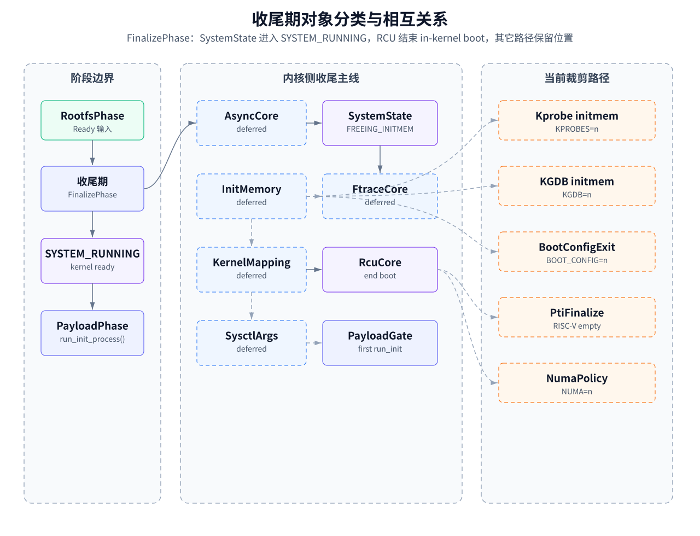
</p>

<p align="center">
  图 37 收尾期对象分类与相互关系
</p>

图 37 用于说明 `SMP Runtime Phase` 子阶段 5 的对象分类和依赖关系。左侧是从 `RootfsPhase` 到 `PayloadPhase` 的阶段边界，中间是 async、initmem、mapping protection、RCU 和 sysctl 主线对象，右侧记录当前配置下裁剪的 Kprobes/KGDB/BootConfig/PTI 等路径。

##### SMP Runtime Phase 子阶段 5 过程处理清单（初稿）

| Linux 6.12.37 调用 / 规格补充动作 | 规格处理 | 备注 |
|---|---|---|
| `async_synchronize_full()` | deferred: `AsyncCore.synchronize_full()` | 等待所有 async init work，确保 init memory 释放前无未完成 async init code；前序 `AsyncCore` 已 deferred。 |
| `system_state = SYSTEM_FREEING_INITMEM` | internal step in `SystemState.enable()` | 将内部属性 `SystemState.value` 更新为 `SYSTEM_FREEING_INITMEM`，进入释放 init memory 的窗口；不单独占用标准 lifecycle slot。 |
| `kprobe_free_init_mem()` | trimmed/no-op | 当前 `CONFIG_KPROBES=n`，为空 inline。 |
| `ftrace_free_init_mem()` | deferred: `FtraceCore.free_init_mem()` | 当前 `CONFIG_FTRACE=y`，不能裁剪；但 ftrace 细节不进入当前主线，只保留时序位置。 |
| `kgdb_free_init_mem()` | trimmed/no-op | 当前 `CONFIG_KGDB=n`。 |
| `exit_boot_config()` | trimmed/no-op | 当前 `CONFIG_BOOT_CONFIG=n`，为空实现。 |
| `free_initmem()` | deferred: `InitMemory.free()` | RISC-V 调用 `free_initmem_default(POISON_FREE_INITMEM)`，释放 init-only 内存；当前轮次保留位置，不展开内存区间和 poison 细节。 |
| `mark_readonly()` | deferred: `KernelMappingProtection.enable()` | 当前 `CONFIG_STRICT_KERNEL_RWX=y`，执行 rodata/read-only 和 W^X 检查相关动作；当前轮次保留位置。 |
| `pti_finalize()` | trimmed/no-op | 当前 RISC-V 为空 inline。 |
| `system_state = SYSTEM_RUNNING` | formal candidate: `SystemState.enable()` | 将内部属性 `SystemState.value` 更新为 `SYSTEM_RUNNING`，并把 `SystemState.state` 推进到 `Online`；表示内核运行态成立，但还未进入 payload。 |
| `numa_default_policy()` | trimmed/no-op | 当前 `CONFIG_NUMA=n`，为空实现。 |
| `rcu_end_inkernel_boot()` | action: `RcuCore.end_inkernel_boot()` | 结束 RCU in-kernel boot 偏置，写入 `rcu_boot_ended = true`。 |
| `do_sysctl_args()` | deferred: `SysctlArgs.apply()` | 解析并应用 `sysctl.*` 启动参数；当前轮次不展开 sysctl/proc 参数路径，完成后进入 `PayloadPhase`。 |

<p align="center">
  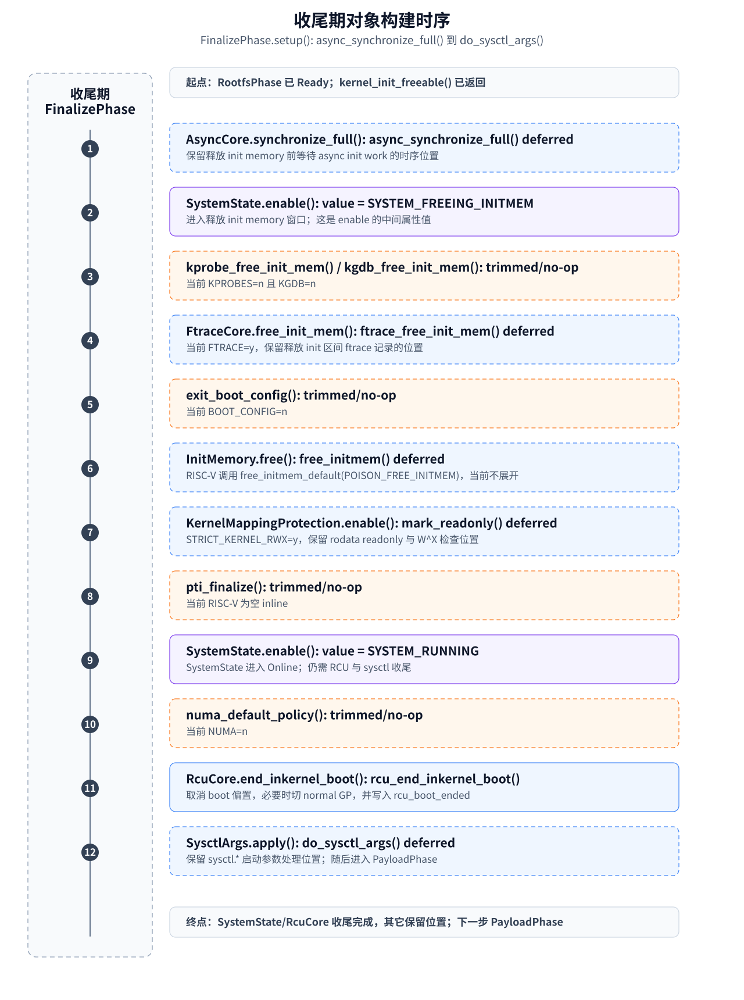
</p>

<p align="center">
  图 38 收尾期对象构建时序
</p>

图 38 按 Linux 6.12.37 `kernel_init()` 中 `kernel_init_freeable()` 返回后的有效调用顺序展示 `SMP Runtime Phase` 子阶段 5 的推进过程。绿色节点表示主线 formal/action 候选，蓝色节点表示当前轮次 deferred 路径，紫色节点表示系统状态 checkpoint，橙色虚线节点表示当前配置下 trimmed/no-op 的路径。`run_init_process(...)` 不属于本子阶段，只作为后续 `PayloadPhase` 入口边界。

本子阶段的结束状态暂定至少包含：

- `FinalizePhase.state == Ready`
- `AsyncCore.synchronize_full()` 保留时序位置，但当前轮次标记为 deferred
- `SystemState.state == Online`
- `SystemState.value == SYSTEM_RUNNING`
- `InitMemory.free()`、`KernelMappingProtection.enable()` 和 `FtraceCore.free_init_mem()` 保留时序位置，但当前轮次标记为 deferred
- `RcuCore.inkernel_boot_ended == true`
- `SysctlArgs.apply()` 保留时序位置，但当前轮次标记为 deferred
- `KprobeInitMemory`、`KgdbInitMemory`、`BootConfigExit`、`PtiFinalize` 和 `NumaDefaultPolicy` 按当前配置记录为 trimmed/no-op
- 下一阶段入口是 `PayloadPhase`，从首次 `run_init_process(...)` 尝试开始

### Payload 交接期对象建立

从这一小节开始，对应顶层 `PayloadPhase`。本阶段的边界必须明确：对 Linux-like 路径而言，它从 Linux 6.12.37 `kernel_init()` 中 `do_sysctl_args()` 返回后、第一次进入 `run_init_process(...)` 选择链之前开始；它在 selected payload 的不可逆交接完成后结束。如果 Linux-like 路径所有候选 init 都失败，或 `init=` 指定的 init 失败，则进入 panic terminal，不形成 `PayloadPhase.Online`。

`PayloadPhase` 不固定 payload 的运行形态。变种选择在当前实现中属于编译期选择，而不是运行期动态分派：根 `Makefile` 的 `APP ?= smoke` 会传递到 `impl/arceos_ex/Makefile`，再映射为 `--cfg app_<name>`；`impl/arceos_ex/src/apps/mod.rs` 根据 `#[cfg(app_smoke)]` / `#[cfg(app_hello)]` 导出唯一的 `run() -> !`，不支持的 `APP` 在编译期 `compile_error!`。因此，规格中的 `PayloadPhase.select_variant()` 表示确认编译期 selected payload 事实。当前已有 `hello` 和 `smoke` 两类 app payload；将来的 `UserBootPayload` 也应作为 `apps` 目录下的一个 payload 变种接入同一套选择机制。

当前先保留两个规格变种：

1. `UserBootPayload`：Linux-like 变种，基于 Linux 的第一个用户态 init 选择与 `kernel_execve()` 交接路径建模。它不创建新的 PID 1，而是驱动前序已经建立的 `KernelInitTask` / PID 1 在当前执行任务上读取并进入首个用户态 ELF，成功后该任务成为 `UserInitProcess`。
2. `UnikernelApp`：内核态应用变种，当前只做粗粒度规格约束。它要求 selected app、入口、参数和基础输出设施可用；`enable()` 调用 app 入口并把启动编排链交给 app，不展开 VFS、binfmt、用户态地址空间和 exec 细节。

本阶段的输入事实至少包括：

- `FinalizePhase.state == Ready`
- `SystemState.state == Online`
- `SystemState.value == SYSTEM_RUNNING`
- `KernelInitTask.state == Online`，且当前仍是 PID 1 的启动交接任务
- `RootfsPhase.state == Ready`
- `RootfsConsole` / `console_on_rootfs()` 保留时序位置；当前轮次标记为 deferred，不作为 `PayloadPhase` 的强 `Ready` 前置条件
- `PayloadParam.state == Ready`
- Linux-like 路径下，`RootFS` 已完成当前支持的 `prepare_namespace()` 路径，真实 ext2 root staging mount 曾建立在 `/root`，`MS_MOVE` 和 `chroot(".")` 已完成，任务可见 root/pwd 指向 ext2 root
- Linux-like 路径下，VFS、`ElfObject`、`UserAddressSpace`、`UserStack`、`UserTrapFrame`、`FilesStruct` 和 `SyscallException` 相关对象已经准备到可执行第一个用户态程序的最低状态
- 当前磁盘 rootfs 仍是 whole-disk ext2；`PartitionTable` / `BlockPartition` 暂不建模，等磁盘镜像切换为带分区表时再引入

当前先将 `PayloadPhase` 的对象和边界记录如下：

1. `Payload 交接期对象`（`PayloadPhase`）：属于阶段对象。`PayloadPhase.setup()` 确认编译期 selected payload 变种和前置条件；`PayloadPhase.enable()` 驱动 selected payload 的不可逆交接。成功后阶段进入 `Online`，启动编排链不再继续返回。
2. `用户启动 payload 对象`（暂名 `UserBootPayload`）：Linux-like 变种对象，代表用户态启动 payload 的选择与交接流程。它的 `setup()` 从 `PayloadParam` 建立候选 init 选择上下文、参数/环境视图和 exec 前置条件；它的 `enable()` 按 Linux `kernel_init()` 末尾的顺序尝试 init 候选，成功后推进到 `Online`。`try_candidate(path)` 是 `UserBootPayload.enable()` 内部可重复调用的 action，不作为标准生命周期 slot。
3. `Unikernel 应用对象`（暂名 `UnikernelApp`）：Unikernel 变种对象。当前只记录粗粒度约束：app 已选定、入口存在、payload 参数可用、基础输出设施可用；`enable()` 调用 app 入口，不把 Linux-like 的 `kernel_execve()` 细节套入该路径。
4. `init 候选集合属性`（`UserBootPayload.candidates`）：覆盖 Linux 中 `ramdisk_execute_command`、`execute_command`、`CONFIG_DEFAULT_INIT` 和固定 fallback 列表。它是 `UserBootPayload` 的属性/选择上下文，不作为独立生命周期对象。由于前序 `RootfsPhase` 已要求 `init_eaccess(ramdisk_execute_command)` 必须满足调用 `prepare_namespace()` 的条件，当前 Linux-like 规格中 `ramdisk_execute_command` 分支只作为 checkpoint 保留，此处不会执行 `run_init_process(ramdisk_execute_command)`。有效候选顺序从 `execute_command`（来自 `init=`）开始，随后是 `CONFIG_DEFAULT_INIT`、`/sbin/init`、`/etc/init`、`/bin/init`、`/bin/sh`。其中 `init=` 指定路径失败会立即 panic；其它候选失败按 Linux 规则继续尝试或记录错误。
5. `init 参数与环境对象`（暂名 `InitArgEnv`）：覆盖 `argv_init` 和 `envp_init`。`run_init_process(init_filename)` 会把 `argv_init[0]` 改为当前候选路径，再把 `argv_init` / `envp_init` 传给 `kernel_execve()`。`PayloadParam`、unknown boot options 和 `rdinit=` / `init=` 解析在前序阶段已经提供输入。
6. `ELF 对象`（暂名 `ElfObject`）：表示从 rootfs 读取到内存后的用户态 ELF 镜像及其解析结果。它不是 `ElfLoader`，load 不是独立生命周期阶段。`ElfObject.preset()` 检查当前内核支持的 ELF 类型；`ElfObject.setup()` 解析 ELF header / program headers，并把 `PT_LOAD` 段映射到 `UserAddressSpace`，包含 `.bss` 清零、段权限和 entry point 记录；`ElfObject.enable()` 只确认 entry、用户栈和 trap frame 等进入用户态条件满足，并交给 `UserBootPayload`。dynamic libc 支持仍使用 `ElfObject`，但区分 main executable 与 interpreter 两种 role：主程序的 `PT_INTERP` 绑定解释器路径，`UserBootPayload` 读取该解释器并作为第二个 `ElfObject` 解析；解释器可以是 `ET_DYN`，但不建立 `ElfLoader` 资源对象。
7. `用户地址空间对象`（暂名 `UserAddressSpace`）：表示每个用户态进程独立的低地址用户区映射。它是多实例对象；高地址内核映射共享或引用 `SwapperVm`。`SwapperVm` 继续表示内核共享地址空间实例，不改成普通多实例用户地址空间。首轮仅要求最小用户页表、用户页 `U` 权限、内核页 `U=0`、ELF 段映射、用户栈映射和阶段性的 heap/mmap arena；dynamic libc 首片要求同一个 `UserAddressSpace` 同时映射主程序 ELF 和 `PT_INTERP` 指向的 musl interpreter ELF，并用固定 non-overlap load bias 装载 `ET_DYN` interpreter。ELF 段的 backing/PTE 以页粒度覆盖 `align_down(p_vaddr)..align_up(p_vaddr + p_memsz)`，因此 `mprotect`/`munmap` 对动态链接器 RELRO 页保护请求的 mapped-range 判断也必须按页范围处理，而不是只按原始 `p_vaddr..p_vaddr+p_memsz` 字节范围拒绝页内前缀。heap/mmap arena 用于承接动态链接器早期 `brk`/anonymous `mmap` 需求，属于正式运行时语义，不是测试专用入口。完整 VMA 树、文件映射、COW、ASLR 和 page fault recovery 后续再展开。
8. `用户栈对象`（暂名 `UserStack`）：表示第一个用户程序的初始用户栈。static libc 版用户 init 需要真实 Linux initial stack，当前至少建立固定大小栈、`argc=1`、`argv[0]="/sbin/init"`、`argv/envp` 终止空指针以及 `auxv` 中的 `AT_PAGESZ` 和 `AT_NULL`；dynamic libc 首片需要补主程序 `AT_PHDR`、`AT_PHENT`、`AT_PHNUM`、`AT_ENTRY`、解释器 `AT_BASE`、`AT_PAGESZ` 和 `AT_NULL`。完整 auxv、随机化、guard page、boot param 派生 argv/envp、`AT_RANDOM`、`AT_EXECFN` 和动态栈扩展后续再展开。
9. `用户 trap frame 对象`（暂名 `UserTrapFrame`）：表示进入 U-mode 前的寄存器现场，至少绑定 `sepc=ElfObject.runtime_entry`、用户 `sp`、`sstatus.SPP=U` 和 `SPIE=1`。静态程序的 runtime entry 是主 ELF entry；动态程序的 runtime entry 是 interpreter entry。它是 `UserInitProcess.Action::EnterUserMode` 执行最终 trap-return handoff 的输入。
10. `系统调用入口与表对象`（`SyscallException` / `SyscallTable`）：`SyscallException` 是 `ExceptionStream` 下已有的 ecall/syscall 异常对象，负责用户态 syscall 入口、来源检查、参数提取和分发选择；不再单独建立 `SyscallDispatcher` 对象。`SyscallTable` 是独立分发表对象，承载当前支持的 syscall action 集合；具体 syscall 不是资源对象，而是 `SyscallTable.Action::Write`、`SyscallTable.Action::Writev`、`SyscallTable.Action::OpenAt`、`SyscallTable.Action::Read`、`SyscallTable.Action::Close`、`SyscallTable.Action::NewFstatAt`、`SyscallTable.Action::Brk`、`SyscallTable.Action::Mmap`、`SyscallTable.Action::Mprotect`、`SyscallTable.Action::Munmap`、`SyscallTable.Action::SetTidAddress`、`SyscallTable.Action::Exit`、`SyscallTable.Action::ExitGroup` 等 action。`write/writev` 不再直接按 fd 特判转发到 console，而是经 `FilesStruct -> FileDescriptorTable -> OpenFileDescription -> FileBackend` 解析到标准输出/标准错误对应的字符设备后端；只读 `openat/read/close/newfstatat` 首片则经 `FilesStruct` 分配一个普通文件 opened instance，并通过 VFS path read 读取当前 ext2 rootfs 中已存在的 regular file；`brk/mmap/mprotect/munmap` 路由到 `UserAddressSpace` 的阶段性 heap/mmap arena，用于支撑 musl dynamic loader 的早期运行；`set_tid_address` 按 Linux `current->clear_child_tid = tidptr; return task_pid_vnr(current);` 的形态落到当前 `UserInitProcess` 的 PID1 任务身份属性上，不建立线程管理或 futex 完整对象。
11. `打开文件上下文对象`（`FilesStruct` / `FileDescriptorTable` / `OpenFileDescription` / `FileBackend`）：`FilesStruct` 是任务拥有的打开文件上下文，和表示 root/pwd 的 `FsStruct` 并列，不是 `FsStruct` 的下级类型。`FileDescriptorTable` 是 `FilesStruct` 内部的 fd table，负责把 fd 映射到 `OpenFileDescription`；`OpenFileDescription` 表示一次打开后的文件实例，承载 flags、offset 和后端引用；`FileBackend` 表示具体后端类型。当前支持边界分两层：第一层预安装 fd 0/1/2 为 console-like `CharDevice` 后端；第二层只支持一个 read-only `RegularFile` opened instance，用于 `openat` 后的 `read`、`close` 和 `newfstatat` 最小元数据返回。块设备文件、完整 `/dev/console`、TTY、权限、目录 fd、symlink、poll、共享 fd table、写路径和 page cache 后续展开。
12. `用户态 init 进程对象`（暂名 `UserInitProcess`）：表示 PID 1 在进入用户态 ELF 成功后的用户态身份。它是本阶段 Linux-like 路径的核心结果对象，不是新建 task，而是 `KernelInitTask` 在 exec 成功后发生身份转换和不可逆交接的结果。`KernelInitTask.exec_to(UserInitProcess, path, argv, envp)` 是 identity transition action，不作为 `KernelInitTask` 的标准生命周期 slot；成功后 `UserInitProcess.state == Online`。`UserInitProcess` 继承同一任务线上已经建立的 `FsStruct` 和 `FilesStruct`，其中 `FsStruct` 提供 root/pwd 视图，`FilesStruct` 提供 stdio fd 与后续 open/read/write syscall 的入口。`UserInitProcess.Action::EnterUserMode` 消费已就绪的 `UserAddressSpace` 和 `UserTrapFrame`，负责写入 `satp`、执行必要 `sfence.vma` 并通过 `sret` 进入 U-mode；它不负责制造 trap frame，也不是独立对象。`UserInitProcess.Action::SetClearChildTid` 只记录当前 PID1 的 `clear_child_tid` 用户指针并让 `set_tid_address` 返回 PID1；线程退出唤醒、futex、clone/thread group 语义后续再展开。
13. `payload 失败终端`（暂名 `PayloadPanic`）：覆盖 Linux-like 路径中 `init=` 指定 init 失败或所有候选 init 均失败后的 panic。它是失败终端，不是正常生命周期对象。

<p align="center">
  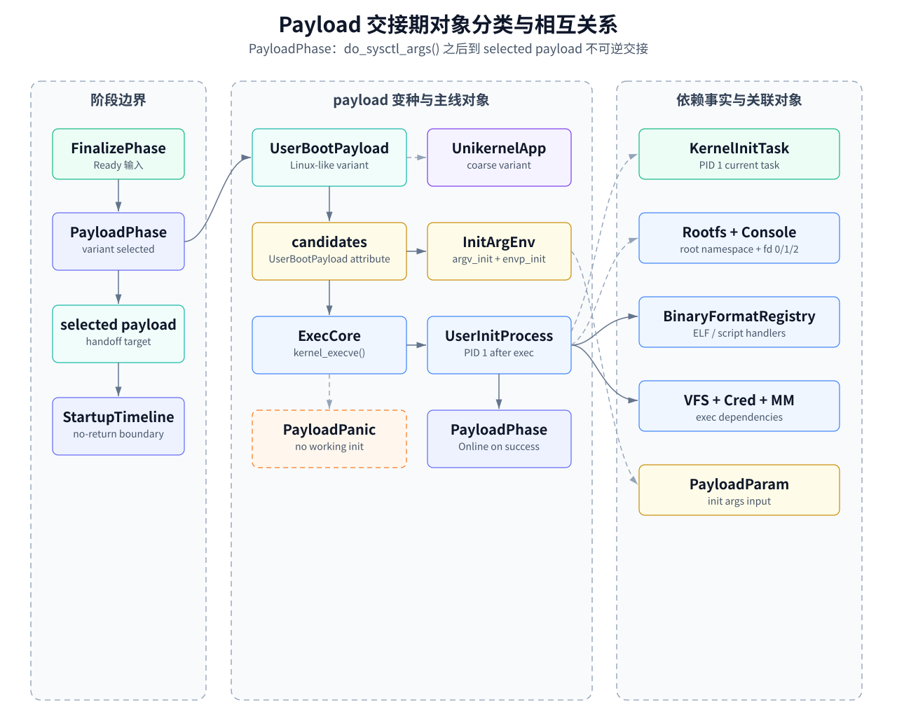
</p>

<p align="center">
  图 39 Payload 交接期对象分类与相互关系
</p>

图 39 用于说明 `PayloadPhase` 的对象分类和依赖关系。左侧是从 `FinalizePhase` 到 selected payload 的阶段边界，中间是 payload 变种与 Linux-like 主线对象，右侧是 PID 1、rootfs/console、exec/binfmt 和参数环境等依赖事实。图中 `UserBootPayload` 是当前重点展开的 Linux-like 变种，`UserBootPayload.candidates` 只是候选集合属性，`UnikernelApp` 只保留粗粒度约束。

##### Payload Phase 过程处理清单（初稿）

| Linux 6.12.37 调用 / 规格补充动作 | 规格处理 | 备注 |
|---|---|---|
| `do_sysctl_args()` 返回后的边界 | phase entry: `PayloadPhase.setup()` | `FinalizePhase` 已完成；下一步进入 selected payload 选择和交接。 |
| payload 变种选择 | compile-time selection: `PayloadPhase.select_variant()` | 由 `APP` -> `--cfg app_<name>` -> `apps::run()` 在编译期确定唯一 selected payload；当前保留 `hello`/`smoke` 这类 `UnikernelApp` 变种，将来 `UserBootPayload` 也接入 `apps` 目录。 |
| `UserBootPayload.setup()` | formal candidate | 建立 `UserBootPayload.candidates`、参数/环境和 exec 前置条件；不创建新的 PID 1。 |
| `ramdisk_execute_command` branch | checkpoint: no run | 前序 `RootfsPhase` 已要求进入 `prepare_namespace()` 分支；此处不会执行 `run_init_process(ramdisk_execute_command)`，仅保留 Linux 原始条件位置。 |
| `run_init_process(init_filename)` | action: `UserBootPayload.try_candidate(path)` | 设置 `argv_init[0] = init_filename`，打印候选、参数和环境，然后调用 `kernel_execve()`。 |
| `kernel_execve(init_filename, argv_init, envp_init)` | action: `UserBootPayload.try_candidate(path)` drives `VfsCore.ReadPath` / `ElfObject` / `UserAddressSpace` | 当前轮次以固定 `/init` 小型 ELF 打通首个用户态闭环；`linux_binprm`、完整 argv/envp 复制、`bprm_execve()`、binary handler 搜索等细节延后展开。 |
| ELF 类型检查 | event: `ElfObject.preset()` | 检查 ELF64、little-endian、RISC-V、当前支持的 executable 类型；失败是普通候选失败，不导致内核崩溃，除非该候选来自强制 `init=`。 |
| ELF 解析与装载 | event: `ElfObject.setup()` | 解析 ELF header / program headers，并把 `PT_LOAD` 段映射到 `UserAddressSpace`；`PT_INTERP` 只建立 interpreter role 的第二个 `ElfObject`，不单独引入 `ElfLoader` 或 `Load` 生命周期阶段。 |
| 用户态入口就绪 | event: `ElfObject.enable()` | 确认 entry、用户栈和 `UserTrapFrame` 已就绪，交给 `UserBootPayload` 做最终 U-mode handoff。 |
| `execute_command` branch | action: `UserBootPayload.try_candidate(path, requested=true)` | 来自 `init=`；若成功则通过 `KernelInitTask.exec_to(UserInitProcess, ...)` 完成交接；若失败则进入 `PayloadPanic.requested_init_failed()`，不继续默认/fallback 候选。 |
| `CONFIG_DEFAULT_INIT` branch | action: `UserBootPayload.try_candidate(path, default=true)` | 配置非空时尝试；成功则交接到 `UserInitProcess`；失败只记录错误并继续 fallback。 |
| `try_to_run_init_process("/sbin/init" ... "/bin/sh")` | action: `UserBootPayload.try_fallbacks()` | 固定 fallback 列表；每个候选仍调用 `try_candidate(path)`；`-ENOENT` 静默，其它错误打印后继续。 |
| 所有候选失败 | terminal: `PayloadPanic.no_working_init()` | Linux panic，不形成 `PayloadPhase.Online`。 |
| `UnikernelApp.setup()` / `UnikernelApp.enable()` | coarse variant | 只约束 app 已选定、入口存在、参数和基础输出设施可用；不展开 Linux exec 细节。 |

<p align="center">
  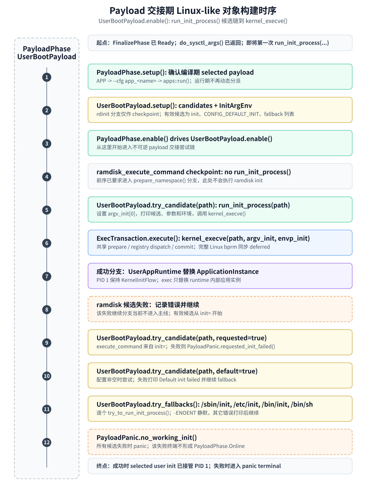
</p>

<p align="center">
  图 40 Payload 交接期 Linux-like 对象构建时序
</p>

图 40 按 Linux 6.12.37 `kernel_init()` 中 `do_sysctl_args()` 返回后的有效调用顺序展示 `UserBootPayload` 的 Linux-like 交接路径。绿色节点表示主线 formal/action 候选，蓝色节点表示 VFS/ELF/用户地址空间依赖动作，紫色节点表示成功后的不可逆交接，灰色节点表示 checkpoint，橙色虚线节点表示失败终端或继续尝试分支。

本阶段的结束状态暂定至少包含：

- `PayloadPhase.state == Online`，表示 selected payload 已完成不可逆交接
- Linux-like 路径下，`UserBootPayload.state == Online`
- Linux-like 路径下，`UserInitProcess.state == Online`
- Linux-like 路径下，`KernelInitTask` 不再作为启动编排任务继续返回；其 PID 1 身份已经由 `kernel_execve()` 转换为用户态 init
- Linux-like 路径下，`UserBootPayload.selected_path` 已确定
- Linux-like 路径下，`InitArgEnv.argv0 == UserBootPayload.selected_path`
- Linux-like 路径下，`ElfObject.state == Online`
- Linux-like 路径下，`UserAddressSpace.state == Online`
- Linux-like 路径下，`UserTrapFrame` 已绑定 entry 和用户栈
- Linux-like 路径下，`SyscallException` 绑定 `SyscallTable`，并通过 `SyscallTable` actions 支持最小 `write` 与 `exit/exit_group`
- Unikernel 路径下，`UnikernelApp.state == Online`，但不要求存在 `UserInitProcess`
- 如果 Linux-like 路径进入 `PayloadPanic`，则该路径是失败终端，不满足 `PayloadPhase.state == Online`

### 内核领域与前置环境

本规格虽以内核领域为核心，但必须讨论前置环境，因为内核领域中的许多对象并非由内核凭空创造，而是以内核接管前已经形成的执行条件和资源基础为前提。

因此，本规格讨论硬件、固件与引导过程，不是为了完整覆盖这些层的全部实现细节，而是为了回答以下问题：

- 它们为内核 Flow 的实体化创造了什么条件
- 它们为内核资源对象的建立提供了什么基础
- 它们在哪些边界上约束了内核后续的组织方式

### 对组件化内核的意义

组件化内核并不是在一个静态、既成的对象世界中对模块重新分组，而是在一个已经历逐级实体化的领域中，对执行流、资源对象与控制关系进行再组织。

因此，后续对组件、扩展点、生命周期和装配关系的定义，都需要明确它们所依赖的前置环境、所处的实体化阶段，以及它们能作用于哪些已经建立完成或正在建立中的对象。同时，也需要明确这些对象之间以何种消息语义相互作用与协作。

从对象层级的角度看，组件化内核所处理的并不是一个扁平对象集合，而是一个不断由低级对象支撑高级对象、再由高级对象开启新一轮建立过程的螺旋上升结构。

## 文件系统的分析

本章集中说明文件系统相关对象的建模意图。文件系统既参与启动阶段中的 rootfs 准备，也在运行期为路径解析、文件读写、设备节点和用户态 `exec` 提供基础，因此不应只作为某个启动子阶段的局部细节处理。

Ext2 是当前第一个被具体展开的磁盘文件系统类型。它的建模方式也应作为后续 Ext4、XFS 等其它文件系统类型的参考模板：优先区分“文件系统驱动/操作集合”“块设备上的 on-disk 布局或 volume”“mount 后的内存中文件系统实例”三类对象，再讨论它们如何接入 VFS、RootFS 和任务 `FsStruct`。不同文件系统可以有自己的元数据结构、日志/事务、extent 或分配策略，但不应因此把驱动、磁盘布局和 mount 后实例混为一个对象。

### Ext2 对象建模说明

Ext2 的建模原则应先在本章程中以自然语言确定对象意图，再落到 `spec/model` 和 `spec/coding` 的正式规格，最后才指导实现。实现已经存在或 roadmap 已经列出任务，并不能反过来替代这一步；若后续 Ext2 对象边界发生变化，也应先回到这里或对应上级说明中修正意图，再同步正式规格。

当前 Ext2 不建模为一个单一的大对象，也不把 Linux `file_system_type`、磁盘布局和 mount 后的文件系统实例混在一起。它至少拆为三个核心对象：

1. `Ext2Driver`：表示 Ext2 的驱动/操作集合。它对应 Linux 中由文件系统驱动提供的操作族，例如 super operations、inode operations、file operations，以及当前 read-only 路径中的 lookup/read 等后端动作。它不是某个磁盘实例，也不持有当前 mount 树；它回答的是“Ext2 这种格式如何被识别、装载和操作”。
2. `Ext2Volume`：表示某个块设备上按照 Ext2 规范组织的 on-disk 数据布局。它承载 superblock、block group descriptor、inode table、data blocks、dirent 等磁盘元数据和用户数据的存在性事实。`Ext2Volume` 属于 mount 前的准备对象：它可以通过 `BlockDeviceRegistry`、`Bio`、`BufferHead` 等块读路径确认某个块设备上是否存在可支持的 Ext2 布局。不存在或不支持 Ext2 volume 是普通非致命失败，不应导致内核崩溃或终止，只会使依赖该 volume 的后续文件系统实例无法建立。
3. `Ext2FileSystem`：表示 Ext2 被 mount 后形成的内存中文件系统实例。它依赖 `Ext2Driver` 和 `Ext2Volume`，并在 setup 阶段把磁盘上的扁平布局“立体化”为可遍历的对象视图，例如 superblock view、root inode、root dentry、目录项、文件 inode 和 read-only file data 后端。它是核心运行对象；系统经由 VFS path walk、open/read 和 rootfs 挂载关系访问它，而不是让调用者直接裸访问 `Ext2Volume`。

这三个对象与 VFS/rootfs 的关系如下：

- `BlockDeviceRegistry` 提供默认块设备或指定 `devt` 的发现入口；`Bio` / `BufferHead` 提供同步块读入口；它们是 `Ext2Volume` 的输入路径。
- `Ext2Volume` 只证明和解释块设备上的 Ext2 布局，不负责 VFS mount，也不持有当前 root/pwd。
- `Ext2Driver` 提供操作集合；`Ext2FileSystem` 在运行中调用这些操作集合来执行 lookup/read 等后端动作。
- `VfsCore` 维护 mount、superblock、inode、dentry、file 和 path walk 这类系统可见对象；它把 Ext2 的 root dentry/inode 暴露为 VFS 树的一部分。
- `RootFS.enable()` 对应 `prepare_namespace()` 中选择真实 root 的过程。当前支持路径是先把 `Ext2FileSystem` staging mount 到 `/root`，再执行 `VfsCore.Action::MoveMountToRoot`，最后由 `FsStruct.Action::ChrootDot` 更新当前任务的 `root` 与 `pwd`。
- `FsStruct` 是任务从属的文件系统视图对象，至少包含 `root` 和 `pwd` 两个 dentry 引用。路径解析从 `FsStruct.root` 或 `FsStruct.pwd` 出发，而不是从 `Ext2FileSystem` 内部全局变量出发。

`Ext2FileSystem` 的生命周期当前可按如下方式理解：

1. `Preset`：确认 `Ext2Driver` 已就绪，并确认存在可支持的 `Ext2Volume`。若 volume 不存在或不支持，事件失败但不形成 kernel panic。
2. `Setup`：基于 `Ext2Volume` 读取和解释 superblock、group descriptor、root inode/root dentry 等必要结构，把 on-disk 布局展开为内存中可遍历的文件系统实例。
3. `Enable`：通过 `VfsCore` 把该文件系统实例挂到上级文件系统的某个目录节点上。对 rootfs 主线而言，当前先挂到 `/root` staging point，再由 `RootFS.enable()` 驱动 mount move 和 chroot。

首轮 Ext2 明确限定为 read-only、no page cache、no write。direct block 读取、root directory direct-block 扫描、普通文件多 direct-block 读取以及 read-only regular file 的 single-indirect block 读取可作为当前支持能力；page cache / address_space / folio、double/triple indirect blocks、allocation/writeback、权限/xattr/quota、remount 和错误恢复属于后续对象扩展，不应在当前对象事实中伪装为已完成。

<p align="center">
  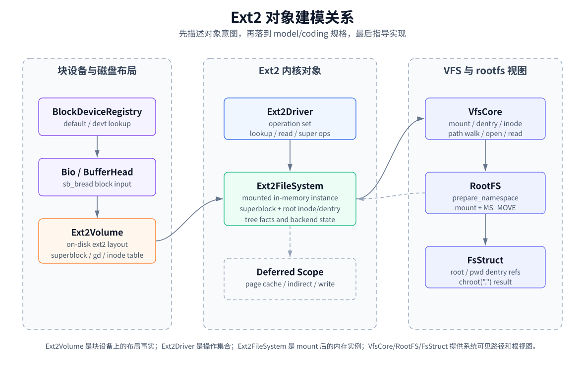
</p>

<p align="center">
  图 FS-1 Ext2 对象建模关系
</p>

图 FS-1 展示了 `Ext2Driver`、`Ext2Volume`、`Ext2FileSystem`、`VfsCore`、`RootFS` 和 `FsStruct` 之间的基本关系。它强调 Ext2 的磁盘布局事实、驱动操作集合和 mount 后内存实例是三个不同对象；VFS/rootfs 负责把该实例纳入系统可见路径和当前任务根视图。

## 组件模型

待补充。

## 生命周期

待补充。

## 接口与通信

待补充。

## 配置与装配

待补充。

## 扩展机制

待补充。

## 运行时与资源管理

待补充。

## 错误处理

待补充。

## 安全与隔离

待补充。

## Linux 6.12.37 交叉验证

本章用于整理本项目与 Linux 6.12.37 的交叉验证试验。交叉验证的目标不是把 Linux 源码逐行移植到
`arceos_ex`，而是在受控条件下复用 Linux 已编译出的原生对象，并观察本项目规格对象、实现对象与 Linux
对象之间的接口差异、状态差异和行为差异。第一轮试验对象选择
`~/gitStudy/linux-6.12.37/drivers/irqchip/irq-sifive-plic.o`，对应源码
`drivers/irqchip/irq-sifive-plic.c`。

当前试验目标是让 `arceos_ex` 在条件编译开关下复用 Linux 的 `irq-sifive-plic.o`，而不是同时启用
`arceos_ex` 原生 PLIC 实现。两套实现都试图拥有同一个系统 irqchip、同一组 PLIC MMIO 寄存器、同一个
RISC-V external interrupt root route 和同一批 PLIC source，因此必须通过互斥配置选择唯一实现。互斥配置名称
和构建接入方式后续再定，但语义上必须满足：启用 Linux PLIC 对象时，`arceos_ex` 原生 `Plic` 的硬件接管、
source enable、claim/complete 和 chained dispatch 不能同时生效。

本试验中的适配层分为两侧：

1. `上接口`：Linux `irq-sifive-plic.o` 对外提供的服务接口，也就是 `arceos_ex` 要如何发现、初始化和消费
   这个对象提供的 PLIC 能力。
2. `下接口`：Linux `irq-sifive-plic.o` 自身依赖的 Linux 内核接口，也就是
   `riscv64-linux-gnu-nm -u irq-sifive-plic.o` 暴露出的未定义符号及其语义。

接口类型按主动调用方区分。`上接口` 是内核框架主动调用驱动实现的 callback/object contract；`下接口` 是驱动主动调用
内核框架提供的服务。由此，注册动作本身通常属于下接口，例如 `plic_driver_init()` 调用
`__platform_driver_register()`、`plic_probe()` 调用 `irq_domain_create_linear()` 或 `irq_set_chained_handler()`；
注册进去的 `platform_driver`、`irq_domain_ops`、`irq_chip`、chained handler、CPU hotplug callback 和 syscore
callback，则属于上接口，因为后续由内核框架主动调用。

由于本轮目标对象是不可修改的 Linux 二进制 `irq-sifive-plic.o`，这里的对齐必须是二进制对齐，而不仅是源码概念对齐。
符号名、调用约定、结构体布局、section/initcall 形态、回调签名、per-CPU 访问模型和对象生命周期，都必须让该二进制对象
按它在 Linux 中的假设运行。为实现对齐，`arceos_ex` 现有 PLIC 实现的上接口可以调整到同一个 provider contract 下；
必要时可以增加 adaptor，但 adaptor 应尽量薄，只做 ABI、对象视图或注册路径转换，不承载 PLIC 业务语义。预期上接口应尽量
直接收敛为共同 contract；下接口由于要满足 `irq-sifive-plic.o` 主动调用的 Linux 符号，通常难以避免 Linux ABI shim。

更严格地说，`irq-sifive-plic.o` 在本试验中应被视为只能通过公开接口交互的黑盒。`arceos_ex` 不能修改、插桩或重编译
这个对象；同样地，从该对象的视角看，外部环境仍然应表现为 Linux，它只会通过 Linux 内核面向驱动公开的接口与外部交互。
因此，接口边界上双方可见或交换的数据结构必须保持严格的二进制布局一致，调用流程也必须按 Linux 中的交互顺序发生，不能用
“语义大致相同”的私有流程替换对象文件实际观察到的 Linux 流程。

下接口补齐也遵循这个黑盒原则：以 `riscv64-linux-gnu-nm -u irq-sifive-plic.o` 发现的 undefined symbols 为入口，
逐符号建立该对象可见的 Linux 环境。对全局变量，应优先让 `arceos_ex` 现有对象或新增 adaptor 提供 ABI 对齐的对象视图；
对函数，应先提供签名、调用约定和失败边界正确的兜底实现，默认可以 `panic`，再按启动路径实际“踩到”的依赖逐项补齐真实语义。
首轮只实现当前功能闭环必须的依赖；调试、打印、审计、ratelimit 等非关键能力可以简化或标记为 deferred，但这种简化不能改变
PLIC 驱动的主控制流，也不能让对象文件误以为某个关键 Linux 子系统已经完整接入。

后续进入“踩雷/排雷”阶段时，应以 `arceos_ex` 已经跑通的原生 PLIC/IRQ/UART 近似等价实现为主要承载基础，优先做小规模
内核对象对齐和薄 shim 补充。若某个 undefined symbol 或回调路径暴露出必须新增正式对象、大块功能缺失，或者出现难以判断
的方向策略问题，应暂停继续编码，先把该问题归入差异分类并讨论解决方向。

这一定义服务于本轮替换目标：在整个内核框架、上层 IRQ 使用者和可观测功能不变的前提下，通过条件编译在
`arceos_ex` 原生 PLIC provider 与 Linux `irq-sifive-plic.o` provider 之间切换。条件编译只应切换 provider/backend，
不应要求 UART、serial8250、IRQ action、checkpoint 或 smoke 路径感知两套不同 PLIC API。

### 黑盒二进制驱动调试跟踪方法

Linux 二进制驱动虽然不能修改，但并不是不可分析。`arceos_ex` 与黑盒驱动之间按照 Linux 内核框架中基本确定的协作流程
交互，接口边界上会交换可预期的数据。因此，后续调试和排雷应优先采用“源码建立预期、边界 checkpoint 观测、KUnit 固化
约束、运行踩雷推进、静态分析兜底”的方法。

第一，预期流程主要从 Linux 6.12.37 源码和对应 `.config` 建立，不把反汇编作为常规前置步骤。对于
`irq-sifive-plic.o`，首轮预期流程是 `.initcall6.init -> __platform_driver_register -> platform compatible match ->
plic_platform_probe -> plic_probe -> OF/resource/context/domain/chained handler`。每个流程点都应记录主动调用方、被调用接口、
关键输入数据、预期返回值、预期状态变化和对应 Linux 源码位置。

第二，观测点应放在黑盒边界，而不是黑盒内部。上接口观测内核框架主动调用驱动的点，例如 `.probe`、
`irq_domain_ops`、`irq_chip`、chained handler、CPU hotplug callback 和 syscore callback；下接口观测驱动主动调用内核
框架的点，即 `nm -u` 暴露出的 undefined symbols。每个边界观测点应尽量记录接口名、关键参数、返回值、对象地址和必要的
布局校验结果。

第三，调试信息应优先沉淀为 checkpoint/KUnit 可验证事实，而不是只依赖临时串口日志。例如 PLIC 复用路径中可逐步建立
`LinuxPlicDriverRegistered`、`LinuxPlicPlatformMatched`、`LinuxPlicProbeEntered`、`LinuxPlicProbeReturnedZero`、
`LinuxPlicDomainCreated`、`LinuxPlicChainedHandlerRegistered` 等事实，并在 KUnit 或 checkpoint observer 中检查这些
事实的顺序和数据是否符合预期。

第四，边界数据交换是定位问题的重点。对 PLIC 试验而言，至少应跟踪 `platform_driver.probe`、
`platform_driver.driver.of_match_table`、`platform_device.dev.fwnode`、`fwnode_handle.ops`、`riscv,ndev`、
`interrupts-extended`、PLIC `membase/source_count/context_id`、Linux `thread_info.cpu`、`__per_cpu_offset`、
`irq_domain.ops/host_data`、`__irq_set_handler` 传入的 parent IRQ 和 handler 指针等数据。只要流程和这些 checkpoint 上的
数据都可预期并被验证，通常就足以约束黑盒交互并辅助定位问题。

第五，黑盒运行边界还必须跟踪架构上下文寄存器视图，尤其是 RISC-V `tp`。Linux PLIC object 会通过 `tp` 访问
Linux `thread_info` / per-CPU 数据；`arceos_ex` 的 Rust 路径则需要自己的 `tp`。因此进入 `irq-sifive-plic.o` 前可以
切换到 Linux `thread_info` 视图，但返回 Rust dispatch、checkpoint、异常/中断分派或其它 `arceos_ex` 代码前必须恢复
Rust `tp`。Linux `tp` 激活期间如果允许本地中断嵌套，trap entry 会把 Linux `tp` 保存进现场，后续常规 Rust 路径可能在
错误的 `tp` 下访问对象并触发页故障或状态错读。第一轮排雷已经以 `scause/sepc/stval/gp/tp` panic 诊断确认过这一类问题：
一次 load page fault 的 `tp` 等于 Linux `LINUX_PLIC_THREAD_INFO`，说明 Linux `tp` 泄漏到了 Rust 执行上下文。后续类似
问题应优先检查 `tp`/`gp`、SIE 保存恢复、per-CPU offset 和 trap frame，而不是先假设 PLIC claim/complete 语义本身错误。

第六，不强求一次性完成完整静态分析。后续可以按运行中“踩雷/排雷”的方式推进：每遇到一个 undefined symbol、回调路径或
异常现象，就判断问题属于流程未到达、边界数据不符合预期、二进制 ABI 视图不一致、shim 语义不足，还是需要讨论的大对象或
策略缺口；修复后补充相应 checkpoint/KUnit 断言，再进入下一轮运行。必要时可以使用反汇编、`addr2line` 或 GDB 作为辅助，
例如确认结构体偏移、优化后的访问方式、崩溃 PC 对应源码位置或 local symbol 范围，但这些工具是兜底手段，不替代源码和
运行 checkpoint 的主线。

本节先分析 `上接口`。`下接口` 另行逐项展开。

### `irq-sifive-plic.o` 服务接口

`irq-sifive-plic.o` 的服务接口不是一个普通的公开 C 函数 ABI。以当前 Linux 6.12.37 编译产物为准，
`riscv64-linux-gnu-nm -g --defined-only drivers/irqchip/irq-sifive-plic.o` 没有给出全局定义符号；
`plic_probe`、`plic_handle_irq`、`plic_irq_enable`、`plic_irq_eoi`、`plic_irqdomain_ops`、`plic_chip`
等符号均是 local 符号。外部不能稳定地把它当成“调用某个导出函数即可获得 PLIC 服务”的对象来使用。

它真正暴露给 Linux 内核框架的上接口，应首先看作标准 `platform_driver` 接口，而不是一个 irqchip init
callback。`builtin_platform_driver(plic_driver)` 确实会通过 `.initcall6.init` 留下一个注册动作，但该动作的语义是把
`plic_driver` 注册到 platform 总线；它只是到达 platform driver core 的路径，不是 PLIC 驱动自己的核心服务接口。
因此，当前试验中应把 `struct platform_driver plic_driver` 作为上接口的主体，其中最关键的服务入口是 `.probe`。

`probe` 成功后，PLIC 驱动再向 generic IRQ core 注册 irq domain、irq chip 和 chained handler。这些结构是 PLIC
驱动通过 platform probe 产出的后续 IRQ 服务面，应与“如何被内核框架发现并初始化”的上接口入口层分开记录：

| 服务面 | Linux 承载 | 服务语义 |
|---|---|---|
| platform driver 上接口 | `struct platform_driver plic_driver` | PLIC 驱动交给 Linux driver core / platform bus 的核心接口。`.driver.name = "riscv-plic"`，`.driver.of_match_table = plic_match`，`.driver.acpi_match_table = ACPI_PTR(plic_acpi_match)`，`.probe = plic_platform_probe`。 |
| platform 总线注册路径 | `.initcall6.init -> plic_driver_init -> __platform_driver_register(&plic_driver, ...)` | 这是 `builtin_platform_driver(plic_driver)` 产生的注册动作。它负责把 `plic_driver` 放入 platform bus driver 集合，使后续 platform device 匹配可以调用 `.probe`；它本身不等同于 PLIC 专用初始化入口。 |
| compatible match 表 | `plic_match` | `plic_driver.driver.of_match_table` 指向该表，当前包含 `"sifive,plic-1.0.0"`、`"riscv,plic0"`、`"andestech,nceplic100"`、`"thead,c900-plic"`。platform bus 依据该表把 PLIC platform device 绑定到 `plic_driver`。 |
| 核心 probe 入口 | `plic_platform_probe(struct platform_device *pdev)` | 这是当前 PLIC 驱动最重要的上接口回调。它从 `pdev->dev.fwnode` 取得固件节点并调用内部 `plic_probe(fwnode)`，随后解析节点、映射 MMIO、建立私有状态、初始化 context，并注册 IRQ core 服务。 |
| 例外 early irqchip 表入口 | `__irqchip_of_table` 中的 `IRQCHIP_DECLARE(riscv, "allwinner,sun20i-d1-plic", plic_early_probe)` | 这是当前源码额外保留的特殊 early irqchip 路径，只覆盖 `"allwinner,sun20i-d1-plic"`，不覆盖常见的 `"sifive,plic-1.0.0"` / `"riscv,plic0"`。因此本项目首轮复用常见 PLIC 时，不应把该表项视为主上接口。 |
| probe 后 IRQ domain 服务面 | `irq_domain_create_linear(fwnode, nr_irqs + 1, &plic_irqdomain_ops, priv)` | `plic_probe()` 产出的 generic IRQ core 服务。它提供 PLIC source 到 Linux logical IRQ 的映射；`plic_irqdomain_ops.translate` 解析 firmware interrupt specifier，`alloc` 调用内部 map，把 hwirq 绑定到 `plic_chip` 和 `handle_fasteoi_irq`。 |
| probe 后 IRQ chip 控制服务面 | `plic_chip` / `plic_edge_chip` | `plic_probe()` 产出的 per-source 控制能力：`irq_enable`、`irq_disable`、`irq_mask`、`irq_unmask`、`irq_eoi`，SMP 下还有 `irq_set_affinity`；带 edge quirk 的平台通过 `irq_set_type` 在 `handle_edge_irq` 和 `handle_fasteoi_irq` 间切换。 |
| probe 后 chained handler 服务面 | `irq_set_chained_handler(plic_parent_irq, plic_handle_irq)` | `plic_probe()` 在条件满足时把 RISC-V root INTC 的 `RV_IRQ_EXT` logical IRQ 连接到 PLIC。`plic_handle_irq` 从当前 hart context 的 claim register 循环读取非零 source，并调用 `generic_handle_domain_irq(priv->irqdomain, hwirq)` 分发；claim 为 0 时退出循环。 |
| probe 后 CPU hotplug/syscore 服务面 | `cpuhp_setup_state(..., plic_starting_cpu, plic_dying_cpu)` 和 `register_syscore_ops(&plic_irq_syscore_ops)` | CPU online/offline 时启停 parent percpu IRQ 并设置 threshold；系统 suspend/resume 时保存和恢复 priority/enable 寄存器。第一轮单核启动闭环可先作为受限服务或 deferred 路径处理，但对象文件已经把它们作为服务面注册出去。 |

因此，`irq-sifive-plic.o` 的上接口应理解为“一个 Linux platform driver 对 platform bus 暴露 `.probe`，再由
`.probe` 建立 IRQ core 服务面”，而不是 `Plic.claim()` / `Plic.complete()` 这类可直接调用的手写 API，也不是
常规 irqchip init section 中的直接 init callback。`arceos_ex` 要复用该对象，首先需要让自己的适配层能注册并匹配
这个 `platform_driver`，再由 `.probe` 驱动后续 IRQ 服务面建立。

### 服务接口的关键语义

第一，常见 QEMU virt / SiFive PLIC 兼容串对应的主入口是 platform driver 的 `.probe`，而不是
`IRQCHIP_DECLARE` early table 中的 init callback。当前对象文件的 `__irqchip_of_table` 只记录
`"allwinner,sun20i-d1-plic" -> plic_early_probe`；`"sifive,plic-1.0.0"` / `"riscv,plic0"` 由
`plic_driver.driver.of_match_table` 覆盖。直接复用对象文件时，适配层应通过 `builtin_platform_driver` 产生的
注册路径接住 `plic_driver`，让 platform device / driver match 触发 `.probe`。如果继续沿用 `arceos_ex` 现有的
`irqchip_init() -> of_irq_init()` 静态 irqchip section 路径，就无法仅凭该对象文件匹配
`"sifive,plic-1.0.0"` / `"riscv,plic0"`。

第二，`plic_probe()` 完成后提供给上层的不是一个裸 PLIC 句柄，而是 generic IRQ core 中的 domain/chip/handler
组合。外部设备驱动不应直接访问 PLIC MMIO、claim register 或 enable bitmap；它们应通过 firmware IRQ resource
创建 logical IRQ mapping，再通过 `request_irq` / IRQ action registry 等机制把 handler 绑定到 logical IRQ。
PLIC source 的 mask/unmask/enable/disable/eoi 由 logical IRQ 上关联的 `plic_chip` 回调完成。

第三，Linux PLIC 的 dispatch/complete 顺序需要精确保留。`plic_handle_irq` 在 parent external IRQ 到来时只做
claim 和 domain dispatch：

- 读取 claim register 得到非零 source；
- 调用 `generic_handle_domain_irq(priv->irqdomain, source)`；
- 继续 claim，直到读到 0。

complete 并不在 `plic_handle_irq` 里直接执行，而是在 leaf IRQ 的 flow handler 路径中通过 `plic_chip.irq_eoi`
或 `plic_edge_chip.irq_ack` 写回同一个 source 完成。适配层如果实现了足够的 Linux generic IRQ flow，应让
`handle_fasteoi_irq` / `handle_edge_irq` 自然调用这些回调；如果第一轮为了降低复杂度而用简化 IRQ core 替代，也必须
保证等价顺序：`claim(source) -> logical IRQ dispatch/action -> plic_irq_eoi/ack(source) -> next claim`，且 claim
返回 0 时不得调用设备 handler。

第四，PLIC 与 RISC-V root INTC 的关系是 chained relationship。RISC-V INTC 先建立 root irq domain 并通过
`set_handle_irq()` 设置架构 IRQ 入口；PLIC probe 后查找 `riscv_get_intc_hwnode()` 对应的 parent domain，把
`RV_IRQ_EXT` 映射为 parent logical IRQ，再安装 `plic_handle_irq` 作为 chained handler。对 `arceos_ex` 而言，Linux
PLIC 适配层不能把 PLIC 当作独立 root IRQ handler 接到 trap 入口上；它应挂在已有 RISC-V external interrupt route
之后。

第五，`plic_chip` 控制回调是上层设备 IRQ 能力的主要服务面。`irq_enable` 会按 effective affinity 打开对应 hart
context 的 enable bit，并通过 priority register unmask source；`irq_disable` 清 enable bit；`irq_mask` /
`irq_unmask` 通过 priority register 屏蔽或开放 source；`irq_eoi` 向当前 hart context 的 claim register 写回 hwirq。
因此，`arceos_ex` 若要用 Linux PLIC 对象服务 UART 等外设，设备侧的 `source enable` 不应再调用原生
`Plic.enable_source()`，而应转化为 logical IRQ 上的 Linux-style enable/unmask/startup 流程。

### `arceos_ex` 上接口适配方向

第一轮对齐建议把 `irq-sifive-plic.o` 看作一个 Linux framework object，而不是一个硬件访问函数库。上接口本身应尽量
收敛为共同 contract，不在 callback 语义上再包厚 adaptor；但为了让不可修改的二进制对象被 `arceos_ex` 内核框架发现、
注册和调用，仍需要确认以下消费/注册路径。严格地说，其中若干 `Adapter` 是服务于对象文件下接口调用的 Linux ABI shim；
它们的结果是让内核框架能够按共同上接口调用 PLIC provider，而不是把 PLIC 业务语义搬入 adaptor。

1. `LinuxPlatformDriverAdapter`：为 `__platform_driver_register` 提供最小语义，能够接收并保存 `struct platform_driver`
   指针，依据 DeviceTree 中 PLIC node 的 compatible 与 `of_match_table` 匹配，然后构造足够的 `platform_device` /
   `device.fwnode` 视图触发 `.probe`。这是当前 `"sifive,plic-1.0.0"` / `"riscv,plic0"` 路径的重点。
2. `LinuxInitcallRegistrationAdapter`：能够发现并执行对象文件中的 `.initcall6.init` 注册动作，或者以等价方式触发
   `plic_driver_init`，但它的职责只到“把 `plic_driver` 注册进 platform bus”为止；它不是 PLIC 专用 probe/setup
   适配器。由于 `plic_driver_init` 是 local symbol，直接按名字调用不是稳定方案；更合适的是通过 linker section 或
   initcall 表驱动。
3. `LinuxIrqDomainAdapter`：能够让 `irq_domain_create_linear`、`irq_create_mapping`、`generic_handle_domain_irq`、
   `irq_domain_set_info` 等调用形成与 `arceos_ex` logical IRQ / `IrqHandlerRegistry` 等价的映射和分发结果。
4. `LinuxIrqChipAdapter`：能够保存并调用 `plic_chip` / `plic_edge_chip` 的 `irq_data` 回调，使 mask/unmask/eoi 等动作由
   Linux PLIC 对象完成，而不是由原生 PLIC 实现重复完成。
5. `LinuxChainedIrqAdapter`：能够把 RISC-V root INTC 的 external IRQ logical entry 连接到
   `plic_handle_irq`，并在真实 external interrupt 到来时按 Linux chained handler 语义进入 PLIC claim loop。
6. `LinuxCpuLifecycleAdapter`：第一轮可以把 CPU hotplug 和 syscore suspend/resume 约束在单 boot CPU、无 suspend
   的受限语义下，但必须记录哪些注册已经发生，不能让对象文件以为生命周期回调成功接入而实际完全丢失关键行为。

在 `arceos_ex` 的规格对象层，建议继续让外部可见对象保持在 `IrqDispatchTree`、`RiscvIntc`、`PlicIrqDomain`、
`IrqHandlerRegistry`、`InterruptStream` 等稳定边界上。条件编译只改变这些对象背后的 provider：使用原生 provider
时由当前 Rust `Plic` 实现 MMIO 和 dispatch；使用 Linux object provider 时由 `irq-sifive-plic.o` 通过适配层提供
domain/chip/chained handler 服务。这样后续差分验证可以比较同一规格对象在两种 provider 下的状态和行为，而不是让上层
UART、console、IRQ action 等路径感知两套不同 PLIC API。

当前已把 provider 后端 setup、domain translate/map/resolve 和运行期服务入口先收敛为一个薄 `plic_provider` contract：
上层触发 provider 注册/匹配/probe、解析/建立/查询 PLIC hwirq 映射、打开 UART source gate、处理 supervisor external
interrupt、执行 UART leaf chip callback exercise、执行 unmapped IRQ fail boundary exercise，以及读取 claim/dispatch/complete/zero-claim/loop-exit 观测计数时，
只调用同一组 provider API。原生 provider 在该 contract 下保留 no-op provider setup，并调用 Rust `Plic`/`PlicIrqDomain`
的 MMIO claim/complete/source enable 和 source -> logical IRQ 映射实现；Linux object provider 在该 contract 下调用
`irq-sifive-plic.o` 的 initcall6/platform match/probe、注册出的 chained handler、`plic_chip.irq_enable` 和 shim 记录的
运行期事实。这一步不试图把上接口做成厚 adaptor，而是先保证 InitcallPhase 和上层 IRQ/UART/console 路径不感知 provider
差异；当前 chip callback exercise 与 unmapped fail exercise 已拆成两个独立 provider event。PLIC 首轮二进制复用
到此冻结为基线，后续不再主动追求完整 generic IRQ core 复用；只有新目标实际踩到 deferred 路径时，才按“踩雷/排雷”
方式补最小正式语义。

本阶段关于上接口的结论是：`irq-sifive-plic.o` 的初始化入口层上接口集中在 Linux `platform_driver`，核心回调是
`plic_driver.probe`。`irq_domain`、`irq_chip`、chained handler 和 CPU/syscore 回调是 `probe` 成功后注册出的 IRQ
服务面。后续讨论 `nm -u` 下接口时，应围绕 `platform_driver/probe` 及其后续 IRQ 服务面逐项判断哪些 Linux 依赖必须真实
实现，哪些可以作为单核启动试验的受限 stub，哪些需要在 `arceos_ex` 中建立正式对象语义。

### 当前运行闭合状态

截至当前轮次，`PLIC_PROVIDER=linux-object` 已不再只停留在 probe/domain/chained handler 注册事实观测上。`arceos_ex`
已经能在 RISC-V supervisor external interrupt 路径中调用 Linux object 注册出的 `plic_handle_irq`，由该黑盒函数读取
PLIC claim register 并调用 `generic_handle_domain_irq(priv->irqdomain, hwirq)`。当前 runtime 已从第一轮 direct-complete
bridge 推进为 Linux-shaped leaf IRQ flow：`generic_handle_domain_irq` 校验 Linux domain 指针和 hwirq 后，临时恢复
Rust `tp` 查找现有 `PlicIrqDomain` logical IRQ；若该 hwirq 尚未建立 Linux leaf 视图，则调用 Linux 对象的
`plic_irqdomain_ops.alloc`，让黑盒对象内部执行 `plic_irq_domain_translate -> plic_irqdomain_map -> irq_domain_set_info`。
`irq_domain_set_info` 只作为薄 shim 记录 Linux 对象交出的 `plic_chip`、`handle_fasteoi_irq` 和 leaf `irq_desc/irq_data`
视图，不承载 PLIC 业务语义。UART source gate 打开也已从原生 PLIC MMIO 写入推进到 Linux chip callback：适配层先确保
对应 hwirq 的 leaf mapping 已建立，再在 Linux `tp` 下调用 `plic_chip.irq_enable(irq_data)`，由 Linux 对象打开
context enable bit 并保持 priority unmask 语义。`cpuhp_setup_state(..., invoke=true, startup=plic_starting_cpu, ...)`
当前会立即调用 boot CPU startup，使 Linux 对象自己把当前 hart threshold 置为 `PLIC_ENABLE_THRESHOLD`；其中
`irq_get_trigger_type(parent_irq)` 通过 `irq_get_irq_data(parent_irq)` 读取 parent `irq_desc/irq_data` 视图，
`enable_percpu_irq(parent_irq, trigger_type)` 记录 parent external IRQ gate 的 Linux generic-core 数据面。真实 root
external input gate 仍由 `arceos_ex` 既有 `InterruptStream` 打开。随后显式执行 Linux PLIC UART chip callback exercise event：基于同一
UART leaf `irq_data` 调用 Linux `plic_chip.irq_disable -> irq_enable -> irq_mask -> irq_unmask`，并临时设置
`IRQD_IRQ_DISABLED` 调用一次 `plic_chip.irq_eoi`，以验证黑盒 chip callback 服务面、交换数据布局和 disabled IRQ eoi
特殊分支是否可用；同一 event 还临时开启 leaf 所属 `plic_priv` 的 `PLIC_QUIRK_EDGE_INTERRUPT`，调用 Linux object
自身的 `irq_set_type(EDGE_RISING)` 让内联 `irq_set_chip_handler_name_locked()` 把 leaf 切换为
`plic_edge_chip` / `handle_edge_irq`，随后调用 `plic_edge_chip.irq_ack` 覆盖 edge ack 分支，再用
`irq_set_type(LEVEL_HIGH)` 恢复 `plic_chip` / `handle_fasteoi_irq`。该 edge 覆盖是 synthetic boundary
exercise，用于验证二进制对象内部 edge chip callback 和 `irq_desc/irq_data` 交换布局，不表示 QEMU/SiFive 默认
runtime 主线已经变成 edge IRQ。同一组显式边界还覆盖 valid domain + unmapped hwirq 的失败返回：适配层调用同一个
`generic_handle_domain_irq` 下接口入口，确认其返回 `-EINVAL` 并记录 unmapped source/errno；Linux 原路径中的
`pr_warn_ratelimited()` 属于非关键提示能力，本轮不强求执行，`___ratelimit` 仅作为 deferred no-op 兜底。这两个
exercise 在 provider contract 上已经是独立 event：前者覆盖 chip callback 服务面，后者覆盖 valid domain + unmapped
hwirq fail boundary。chip callback event 最终恢复为 enabled/unmasked 状态，不改变后续 UART IRQ 闭合路径，
`linux_plic.boundary_facts` checkpoint 只读观察它留下的计数事实。随后 flow handler 进入 `handle_fasteoi_irq`：先恢复 Rust `tp` 分发
`IrqHandlerRegistry` 中的 UART action，再切回 Linux `tp` 调用 `plic_chip.irq_eoi(irq_data)`，由 Linux
`plic_irq_eoi` 写回 claim register 完成 source。外层 Linux 调用窗口保存并恢复 SIE 与 `tp`，Linux `tp` 激活期间关闭
本地中断，避免嵌套 trap 捕获 Linux `thread_info` 视图。parent chained handler 的 `irq_desc/irq_chip` 目前提供
fasteoi 形态的最小视图，`chained_irq_enter()` 因 parent chip 有 `irq_eoi` 而不做 entry mask/ack，`chained_irq_exit()`
调用 parent EOI 并被 checkpoint 记录；parent chained handler 注册还会记录 Linux generic IRQ core 自动声明的
`IRQ_NOREQUEST/IRQ_NOPROBE/IRQ_NOTHREAD` status。leaf map 阶段中，Linux object 调用 `irq_set_noprobe(virq)`，
shim 通过 `irq_modify_status()` 把 `IRQ_NOPROBE` 写入 UART leaf desc status 并记录最后一次 clear/set/status 事实。
这些验证 PLIC 没有绕过 RISC-V root INTC parent IRQ 关系，并覆盖了当前 PLIC leaf map 会踩到的最小 desc status 数据面；
但仍不等价于完整 Linux root INTC irqchip 或完整 irqdesc 生命周期复用。

这一路径已经通过 `make -C impl/arceos_ex run APP=smoke PLIC_PROVIDER=linux-object PROBE=linux-plic,uart-irq-chain`
验证：`linux_plic.boundary_facts` 和 `uart_irq_chain.observer_real_path` 均通过，smoke 结果为
`passed=36 failed=0 total=36`。当前顶层 `make test` 仍通过，summary 为
`overall total=49 pass=49 fail=0`，其中 spec verify `1/1`、KUnit checkpoints `11/11`、app smoke `37/37`。
checkpoint/KUnit handler 已收口为只读 observer，不再注册 app smoke 或需要修改 live `Context` 的 action。
其中 UART IRQ chain 观察到 Linux PLIC object provider 下的
claim/dispatch/complete/zero-claim/loop-exit 计数闭合，说明黑盒 runtime claim loop 和 Linux `plic_chip.irq_eoi`
callback 已经承接现有 UART action；同一只读 checkpoint 输出还约束了前述 callback exercise event 中
`irq_enable/irq_disable/irq_mask/irq_unmask` 至少各成功执行一次，disabled IRQ eoi 分支至少执行一次，并且
edge synthetic boundary 中 `irq_set_type` 至少完成 edge/level 两次切换、`plic_edge_chip.irq_ack` 至少执行一次。
unmapped IRQ fail boundary 中，checkpoint 还要求 failure count 非零、last errno 为 22，并且 exercise success 非零。
parent/chained IRQ 边界中，checkpoint 还要求 parent desc 至少被准备、`irq_get_irq_data(parent)` 至少被读取、
`enable_percpu_irq(parent, type)` 至少被调用一次，且 parent IRQ 号和 trigger type 与当前 QEMU/RISC-V root external
IRQ 事实一致；parent EOI 计数作为 chained handler runtime 观察事实输出。desc status 边界中，checkpoint 要求 parent
status 包含 chained handler 声明的 `IRQ_NOREQUEST/IRQ_NOPROBE/IRQ_NOTHREAD`，并要求 UART leaf map 的
`irq_set_noprobe()` 经 `irq_modify_status()` 留下 `IRQ_NOPROBE` 状态。leaf action/depth 边界中，checkpoint
还要求 Linux-object provider 在 `handle_fasteoi_irq` runtime 中为 UART leaf 准备过 action 视图、确认 action
已绑定、depth 为 0，并在同一 logical IRQ 上完成 action dispatch。该视图当前由 shim 从既有 `IrqHandlerRegistry`
投影得到，用于约束 Linux generic IRQ flow 与 arceos_ex 现有 action 表的对齐。本轮还把
`IrqHandlerRegistry::request_irq()` 成功路径接到 provider 边界：native provider 为 no-op，Linux-object provider
记录 logical IRQ、device ref 和 handler kind 的 action request 事实；runtime leaf action 视图必须与该 request
事实匹配后才 dispatch。本轮进一步建立 shim 内部的单 action-chain view，并把该 action-chain 指针写入 Linux
6.12.37 当前配置下的 `struct irq_desc.action` 字段偏移；runtime dispatch 前会从 leaf desc 读回该字段，要求它与
request action-chain 指针一致。这个对齐仍是最小 request/action 数据面，不表示已经实现完整 Linux `free_irq/threaded`
生命周期。

本轮进一步把 Linux `irq_desc.status_use_accessors` 与 `irq_common_data.state_use_accessors` 分离：`irq_modify_status()`
写入 leaf/parent desc status，`IRQD_IRQ_DISABLED` 只在 common state 中临时置位用于 disabled EOI exercise，runtime
dispatch 前会读回 desc status、common state 和 depth，确认 `IRQ_NOPROBE` 留在 desc status、common state 未保留
disabled bit，depth 仍为 0。

这仍不是完整 Linux generic IRQ core 复用。当前只覆盖 QEMU/SiFive PLIC 的无 edge quirk、level IRQ 主线；
`plic_edge_chip.irq_ack` 和 unmapped IRQ fail 已通过 synthetic boundary exercise 覆盖，但真实 edge 平台 runtime
以及更完整 `irq_desc`/`irq_common_data` 行为仍归入后续排雷；unmapped IRQ 的 ratelimit/打印属于非关键提示能力，
当前保持 deferred。`mask/unmask/disable/disabled-eoi/edge-ack/unmapped-fail` 目前只属于显式 exercise event 覆盖的
callback/service/fail boundary；若后续接入完整 Linux generic IRQ lifecycle，还需要再补真实路径语义。PLIC 首轮
基线在这里收尾，不再为了补齐 deferred 项而继续主动扩展这些边界；后续只有新目标实际踩到这些路径，才继续补充。

当前阶段差异分类如下。已覆盖：Linux initcall6、platform driver register/match/probe、PLIC domain/chained
handler 注册、UART leaf mapping、Linux PLIC claim loop、`handle_fasteoi_irq -> plic_chip.irq_eoi` runtime、UART
source gate enable、chip callback exercise、unmapped hwirq fail boundary、parent IRQ startup/chained EOI/status、
leaf `IRQ_NOPROBE` status、UART leaf action/depth 最小数据面、`request_irq` 成功路径到 provider action request
事实的最小对齐、request action-chain view、真实 Linux `irq_desc.action` 偏移写入、desc status/common state 分离读回与 runtime leaf dispatch 的匹配，以及 native/linux-object provider
共享的薄 `objects::plic_provider` contract。显式
deferred：ratelimit/打印提示、完整 root INTC irqchip、完整 `irq_desc/irq_common_data` lifecycle、free/threaded
路径、CPU hotplug/offline、SMP affinity、suspend/resume 和真实 edge 平台 runtime。当前没有把这些 deferred 项伪装为
已支持；若后续运行路径实际踩到其中任一项，应按“踩雷/排雷”方式补正式语义，或在必须新增大对象/方向策略不清时暂停讨论。

PLIC 二进制复用首轮到此收尾。当前基线已经足以证明 `irq-sifive-plic.o` 可以作为黑盒 Linux object provider，在
`arceos_ex` 上层框架不感知 provider 差异的前提下承接 UART 外部中断主线。后续不再以“完整补齐 Linux generic IRQ
core”为当前目标；free/threaded、完整 irqdesc lifecycle、root INTC irqchip、SMP affinity、CPU hotplug/offline、
suspend/resume 和真实 edge runtime 都作为明确 deferred 项保留。若后续 Linux 交叉验证切换到新的对象或新的运行目标，
并实际踩到这些边界，再按最小必要原则排雷。

### 上接口仍需讨论的问题

当前上接口的大方向已经明确，首轮二进制替换和 provider contract 对齐也已完成。下面问题不再作为 PLIC 首轮继续实施
的待办清单，而是保留为后续重新进入 PLIC 排雷时的检查索引：这些问题不是讨论是否修改 Linux 对象或重写其流程，而是
决定 `arceos_ex` 侧如何构造足够真实的 Linux 可见环境，并把原生 PLIC provider 对齐到同一上层 contract。

1. `probe` 触发时机：Linux 常见 PLIC 路径通过 builtin platform driver 注册后由 platform device match 触发
   `.probe`，而 `arceos_ex` 现有 PLIC 路径发生在中断时间准备期。需要决定 Linux object provider 在
   `arceos_ex` 中是按 Linux initcall/platform 时序触发，还是在现有 `IrqTimeInitPhase` 边界内执行一个受控的
   platform match/probe 子流程；无论选择哪种，都不能改变 `plic_driver_init -> __platform_driver_register ->
   platform match -> .probe` 这条对象可见流程，外部框架状态和上层 IRQ 使用者也不应变化。
2. 原生 PLIC 的对等上接口：provider setup、domain translate/map/resolve、运行期 source gate、external interrupt
   handling、UART leaf chip callback exercise、unmapped IRQ fail boundary exercise 和计数观测已经通过极薄 provider
   wrapper 对齐到同一 contract。当前不把原生 provider 强行包装成完整 Linux `irq_chip` 对象；chip callback 对齐先以
   provider event 表达，保持上层 `IrqDispatchTree/RiscvIntc/IrqHandlerRegistry` 等对象不发生语义变化。若后续需要真实
   Linux generic IRQ lifecycle，再决定是否提升为正式 `irq_chip` 形态。
3. 二进制结构布局边界：需要列出首轮必须二进制兼容的上接口结构，包括 `struct platform_driver`、`struct platform_device`、
   `struct device` / `fwnode_handle`、`struct of_device_id`、`struct irq_domain_ops`、`struct irq_chip`、
   `struct irq_desc`、`struct irq_data`、`cpumask` 和 per-CPU `plic_handlers` 访问所依赖的布局。只要
   `irq-sifive-plic.o` 会解引用或写入，就不能只用语义 mock。
4. IRQ domain 编号语义：需要确认 PLIC source 0 保留、`nr_irqs + 1` domain size、`riscv,ndev` 范围、重复 source
   mapping、logical IRQ 分配、`irq_fwspec` 参数修改、`gsi_base` 以及 one-cell/two-cell translate 的行为，确保
   Linux provider 与原生 provider 对 UART 等外设产出同一个 logical IRQ 语义。
5. IRQ flow 与 complete 位置：level IRQ 主线已通过 `handle_fasteoi_irq -> plic_chip.irq_eoi` 接入 Linux-shaped
   complete；`plic_chip.irq_enable/irq_disable/irq_mask/irq_unmask`、disabled IRQ eoi 分支和 synthetic edge
   `handle_edge_irq -> plic_edge_chip.irq_ack` 已先通过显式 exercise event 验证 callback service 面可达；unmapped
   hwirq 的 `generic_handle_domain_irq -> -EINVAL` fail boundary 也已通过显式 event 验证。当前已补 parent chained
   status 和 leaf `IRQ_NOPROBE` 的最小 `irq_desc` status 语义；更完整 `irq_desc`/`irq_common_data` 生命周期、
   action/depth/threaded/request/free 等语义仍待后续排雷；unmapped IRQ ratelimit/打印保持 deferred。
   这些边界共同保证
   `claim -> dispatch -> eoi/ack -> next claim -> zero claim exit` 的顺序和特殊路径等价。
6. chained handler 与 root INTC 关系：parent `RV_IRQ_EXT` logical IRQ、`irq_get_irq_data(parent)`、
   `enable_percpu_irq(parent, trigger_type)`、parent fasteoi chip 和 `chained_irq_exit -> parent irq_eoi` 的最小事实
   已被 checkpoint 覆盖，parent chained handler status 也已记录。Linux PLIC provider 当前没有绕过 RISC-V INTC 直接成为 trap root handler；但完整 parent
   irqchip、entry mask/ack、root INTC domain 以及多 parent IRQ 语义仍未复用，后续若进入这些路径需要继续补正式语义。
7. 生命周期范围：CPU hotplug、syscore suspend/resume、SMP affinity 和 edge interrupt quirk 在第一轮是否纳入强等价，
   需要明确裁剪策略。当前 `cpuhp_setup_state` 已按 Linux `invoke=true` 语义触发 boot CPU startup，满足 threshold
   打开路径；parent `enable_percpu_irq` 目前记录 Linux 数据面但不直接控制硬件 gate，真实 root external input gate 由现有 `InterruptStream` 控制。
   若后续对象进入 suspend/resume、CPU offline 或非 boot CPU affinity 路径，应进入明确的 panic/fail 边界或补正式语义，
   而不是静默伪造成功。
8. 观测点对齐：Linux 二进制对象本身不能插桩修改，因此 claim、complete、zero-claim、dispatch、source gate 等现有
   checkpoint 需要决定挂在共同 IRQ core/adaptor 观察点，还是只比较外部可见效果。不能为了观测方便改变
   `irq-sifive-plic.o` 的 callback 顺序。

## 测试与验证

### CheckpointTest 与 BootSelftest

当前 Linux `kunit_run_all_tests()` 在本规格对应的默认配置下按 trimmed/no-op 处理，不进入 rootfs 准备主线。不过，KUnit 的思想可以被规格侧测试机制借鉴：测试应由统一框架调度，测试结果应与是否阻断启动分离，被测对象的生命周期不应被测试代码直接污染。

本规格后续可引入轻量的 `CheckpointTest` / `BootSelftest` 模式，用于由 checkpoint 或 phase action 驱动早期对象 API 测试。例如，已有 memblock API 测试可以从“失败即停机”调整为“返回测试结果，由策略决定是否继续”。这样可以在常规启动中保留诊断能力，同时避免非关键测试阻断启动。

`CheckpointTest.run()` 返回 `TestOutcome`，初步定义如下：

| TestOutcome | 启动控制语义 | 说明 |
|---|---|---|
| `passed` | 继续 | 测试执行并通过。 |
| `failed_continue` | 继续 | 测试失败，但当前策略只记录诊断并继续启动。 |
| `skipped` | 继续 | 测试因配置、阶段条件或依赖缺失未执行。 |
| `failed_stop` | 阻断 | 测试失败，并且当前策略要求停止启动或进入失败边界。 |

因此，默认应继续启动的结果集合是 `passed | failed_continue | skipped`；只有 `failed_stop` 阻断启动。严格模式、调试模式或特定阶段的证明义务可以把某些 `failed_continue` 策略提升为 `failed_stop`。

该机制与运行期 KUnit 不要求一一对应。它面向更早的 boot phase 和对象状态 checkpoint，重点是把测试作为可调度、可记录、可策略化处理的验证动作，而不是作为被测对象生命周期的一部分。

### 测试类别与触发方式

后续实现阶段的测试入口可以先分为两类，并通过 Makefile 子命令或环境变量区分：

1. `kunit` 类测试：面向对象 API、checkpoint 和局部规格约束。典型例子是 memblock API、早期分配器、状态转换和边界条件测试。它可以复用 `CheckpointTest` / `BootSelftest` outcome 机制，测试失败默认可记录为 `failed_continue`，严格模式下再提升为 `failed_stop`。这类测试不要求系统已经进入最终 payload。
2. `smoke` 类测试：面向整个系统启动后的端到端行为，放在最后的 `PayloadPhase` 或 payload 成功交接之后执行。它用于验证系统启动结果的某个外部可观测方面，例如控制台输出、用户态入口、文件系统可见性、系统调用最小路径或特定服务状态。`smoke` 测试失败通常表示目标场景不可用，应作为构建/验证失败处理。

这两个类别的边界不同：`kunit` 更接近规格对象内部验证，关注局部 API 和状态；`smoke` 更接近产品级启动验证，关注系统最终行为。二者可以共享日志、结果汇总和 Makefile 报告机制，但不应共享同一套生命周期语义。

## 兼容性策略

待补充。

## 未决问题

- 待补充
