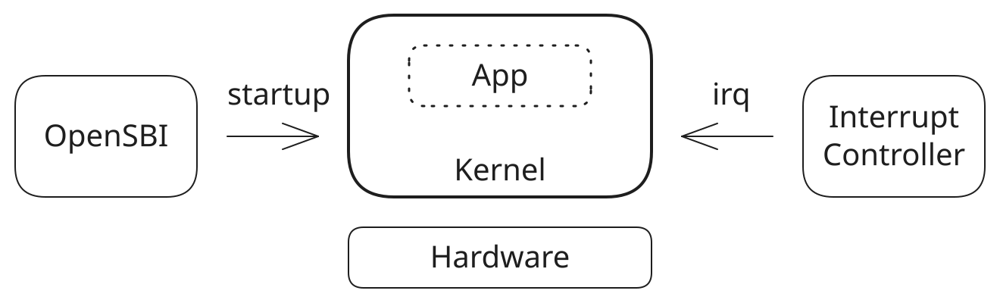

# 内核系统

> [model] MUST：内核系统模型正式命名是Kernel。

## 系统功能

内核系统（简称内核）的核心功能是运行用户应用，具体包括三层：

1. 基础：对硬件平台资源进行统一管理和抽象；
2. 机制：以任务为核心调度单元和资源分配单元；
3. 目的：为用户应用提供运行环境。

内核是被动响应模式，在没有信号触发时不自行改变状态，也不自发向外发送信号。内核收到信号后
执行相应的迁移或动作，并可以在响应过程中继续同步或异步发送信号；响应完毕后重回静默状态。
由于外部信号可能并发到来，内核对不同信号的响应过程可能重叠，所以内核需要建立同步/互斥机制
进行必要的内部协调与状态保护。

> GAP: 外部信号的并发交付、响应重叠、排序和失败语义尚未在 formal semantics 与当前 model 中闭合。

被动响应和信号触发是内核以及各级子系统的统一模式，主要是降低整个计算机系统的工作能耗，并用
一套因果关系简化系统建模。任务、CPU flow、调度和应用执行也是启动信号或运行时信号引起的后续
响应链，不再引入主动模式作为另一种推进机制。

## 系统边界

内核有两条边界：

1. 引导边界：内核的引导入口。
2. 中断边界：中断信号入口。

> GAP: 当前只列出两个输入边界，尚未覆盖下文硬件访问信号和 SBI-call 穿越的输出边界。

## 关联系统

内核与三个系统协作：

1. OpenSBI：在计算机启动链上，是内核的上一级引导系统，在加载内核映像之后，向内核发出startup信号完成引导；在内核运行过程中，OpenSBI作为服务提供者，接收内核发出的sbi-call信号并响应。相对内核，它既是信号源也是信号目标。
2. 中断控制器Interrupt Controller：中断控制器代表各种中断源，随时可能向内核发出中断信号。中断控制器只作为信号源。
3. 硬件平台：硬件平台是计算机裸机系统，是对CPU、各类设备的集成。硬件平台只作为信号目标。注意：中断控制器也属于硬件平台的构成部分。在配置路径上，内核向中断控制器发出配置信号，中断控制器只是作为硬件平台中的普通设备；在上面讨论的中断路径上，中断控制器向内核发出中断信号。

> GAP: 中断控制器“只作为信号源”与配置路径上作为信号目标的描述冲突，并且它作为硬件平台子系统时的分析层级尚未明确。

注意，应用是内核的内部组成部分，不是与内核平级的关联系统。

## 信号

内核作为信号目标系统可以接收的信号：

1. 引导信号：如前所述，OpenSBI向内核发出引导信号startup，把引导控制权移交到内核。内核对应处理该信号的迁移过程是Kernel.OnPreset。
2. 中断信号：如前所述，中断控制器向内核发出中断信号irq，内核对应处理该信号的动作是Kernel.OnIrq。

> GAP: Kernel.OnPreset 与 Kernel.OnIrq 的 Signal-to-Transition/Action 绑定尚未在正式 Signal DSL 和当前 model 中定义。

内核可能发出的信号：

1. 硬件访问信号：包括针对硬件平台各类设备的一系列信号类型，如针对Cpu寄存器gpr/csr的访问信号，针对各类设备的io/mmio访问信号。
2. Sbi-call服务调用信号：面向OpenSBI服务的调用。

> GAP: 硬件访问信号和 SBI-call 的目标系统、同步方式、附加信息及当前 model 映射尚未定义。

注意：异常、syscall、调度、任务切换等信号的目标是内核内部子系统，所以属于 `Kernel` 内部信号。内部信号
只触发其明确的目标子系统，不沿系统层级自动向上冒泡，因此不能直接触发 `Kernel` 自身的迁移或
动作。

## 状态机

### 生命周期范式

生命周期符合[阶段范式](../phase-paradigm.md)。内核启动信号触发 `Kernel.Transition::Preset` 响应过程。

> [model] MUST：以 `Kernel` 为目标的启动信号触发 `Kernel.Transition::Preset`；`Signal` 与
> `Transition` 是不同概念。

### 状态与迁移

* Base：内核处于等待状态，等待引导信号startup触发它启动，引导信号是Preset信号的别名。

  > [model] MUST：确保 Riscv64 规范、SBI 规范、OpenSBI、Lds 和 Config 都处于 `Online` 状态。

* OnPreset：内核收到引导信号 startup，由静态且已经 Online 的 `BootTask` 执行早期初始化。
  `BootTask` 是唯一的 task_struct-like carrier；它不是 Kernel 引导响应过程的别名。

  `BootTask.Online` 在 `_start` 紧随 `Kernel.Started` 观察且只观察一次。随后 `BootInitFlow.Started`
  启动标准阶段生命周期，并由其 Preset 驱动 `EntryPreludePhase`。入口协议由
  `EntryPreludePhase` 拥有的 `BootTaskEntryBinding` 协调：先把物理地址阶段的 `tp` 绑定到静态
  `init_task` 并建立初始抢占关闭事实；`EarlyVm` 就绪后，binding 把 `tp` 切换为同一 carrier 的
  虚拟地址。该 binding 不是第二个 Task、TaskRef 或调度实体，也不改变 PID 0 identity。

  `BootInitFlow` 是 `BootTask.initial_flow` 指向的 TaskFlow，并因 TaskFlow 继承 PhaseObject 而编排
  启动阶段。它的 owner/parent 在入口前已绑定到 BootTask；后继 `BootIdleFlow` 的 ownership 与
  active binding 在 `BootIdleFlow.Setup` 建立。

  > [model] MUST：BootTask 提交 Online 后向 initial Flow 发出 lossy Preset；BootInitFlow 只有在
  > 自身仍为 Base、parent BootTask 为 Online 且 BootDispatchWindow 当前解引用为 BootTask 时接受。
  > 接受后在 `SingleTaskContext` 中驱动 `EntryPreludePhase.Transition::Preset` 并等待其到达 `Online`。

* Prepared：内核此时不响应中断，`BootTask` 始终 Online，`BootInitFlow` 已 Prepared；
  `EntryPreludePhase` 已 Online。

* OnSetup：内核收到 Setup 信号，已 Online 的 `BootTask` 继续代表内核完成中期初始化；
  该迁移不再次启动或替换 Task。

  > [model] MUST：向 `BootInitFlow` 同步发送 Setup；它直接顺序驱动
  > `EntrySuccessorPhase`、`CorePreparePhase`、`MmCoreInitPhase`、`SchedInitPhase`、
  > `IrqTimeInitPhase`、`LocalIrqEnablePhase`、`IrqOpenPreparePhase`、
  > `ProcessPreparePhase`、`BootInitRestInitPhase`，等待最后一个叶子到达 Online 后提交 Ready。

* Ready：内核已经初步具备响应中断信号的能力，等待Enable信号以触发多任务启动。

* OnEnable：内核收到Enable信号，加载并切换到首个用户应用中运行。

  > [model] MUST：先向 `BootInitFlow` 同步发送 Enable。它只驱动
  > `BootInitScheduleHandoffPhase`，建立 `BootIdleFlow` Ready/active binding，并在首次 PID 1 switch
  > commit 紧邻边界到达 Online。真实切换更新 CurrentTaskSlot 与 DispatchWindow 后重新发出
  > `KernelInitFlow.Preset`；只有 dynamic guard 成立时才接受。Preset body 必须在
  > `kernel_init_entry()` 验证 PID 1 vmalloc stack 后执行。

  `KernelInitFlow.Preset` 直接驱动 `PreSmpInitPhase`、`SmpBringupPhase`；Setup 直接驱动
  `RuntimeCorePhase`、`InitcallPhase`、`RootfsPhase`、`FinalizePhase`、`PayloadPreparePhase`；Enable
  只驱动 `PayloadHandoffPreparePhase`。Flow Online 后执行受相同 dispatch guard 约束的
  `CommitPayloadHandoff`：UserBoot 执行 Flow replacement，Hello/Smoke 保持 KernelInitFlow 并进入
  内核态 no-return entry。

* Online：内核处于正常服务状态，支持应用运行。

## 动作

* OnIrq：内核响应中断信号。

  > GAP: Kernel.OnIrq 尚未在 spec/model/systems/kernel.spec 定义为 Online 状态内 action，也未映射到现有 RiscvIntc、PLIC 和 IRQ 子系统处理链。

## 功能构成

内核的核心功能是建立和维护应用的运行环境，支持运行环境的基础是`任务子系统`。

内核直接接收的唯一运行时信号是中断信号，代表内核处理中断的边界是`中断子系统`。

`任务子系统`和`中断子系统`目前是 charter 层的候选系统边界，model 映射暂时 deferred。后续需要
先确定它们是新的聚合系统对象，还是由现有 Task、Scheduler、BootInitFlow 直接 interrupt 叶阶段、EventStream、
InterruptStream 和 IRQ 对象改造形成；在决定前，不把任一现有 phase 或 stream 直接等同于这两个
子系统。

## 引用

* [系统与信号模型](../system-signal.md)
* [概念体系迁移](../concept-migration.md)
* [阶段范式](../phase-paradigm.md)
* [charter/phases](../phases)

## 映射目标

* [model/kernel](../../model/systems/kernel.spec)
