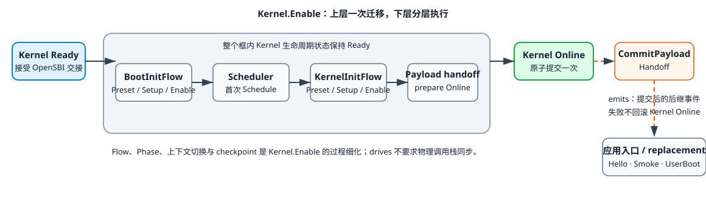

# 内核系统

> [model] MUST：内核系统模型正式命名是Kernel。

`Kernel` 是系统树根 `Computer` 的直接子系统。它同时承担 Linux/RISC-V64 kernel boot 规格采纳、
静态配置发布、kernel image 构造和运行入口交接；OpenSBI 通过 canonical `Kernel.Enable` 把控制权
交给已经 Ready 的 Kernel 实例。只读外部 `LinuxRiscv64KernelBootSpec` 的 parent 是 `Kernel`；它从
Linux 6.12 `Documentation/arch/riscv/boot.rst` 与当前 RV64 Image contract 提供规范要求，不表示某个
具体 kernel image 已经满足这些要求。

## 系统功能

内核系统（简称内核）的核心功能是运行用户应用，具体包括三层：

1. 基础：对硬件平台资源进行统一管理和抽象；
2. 机制：以任务为核心调度单元和资源分配单元；
3. 目的：为用户应用提供运行环境。

内核是被动响应模式，在没有信号触发时不自行改变状态，也不自发向外发送信号。内核收到信号后
执行相应的迁移或动作，并可以在响应过程中继续同步或异步发送信号；响应完毕后重回静默状态。
由于外部信号可能并发到来，内核对不同信号的响应过程可能重叠，所以内核需要建立同步/互斥机制
进行必要的内部协调与状态保护。

> GAP: 外部信号的并发交付、响应重叠、排序和失败语义尚未在 formal semantics 与当前 model 中闭合。

被动响应和信号触发是内核以及各级子系统的统一模式，主要是降低整个计算机系统的工作能耗，并用
一套因果关系简化系统建模。任务、CPU flow、调度和应用执行也是启动信号或运行时信号引起的后续
响应链，不再引入主动模式作为另一种推进机制。

## 系统边界

内核有两条边界：

1. 引导边界：内核的引导入口。
2. 中断边界：中断信号入口。

> GAP: 当前只列出两个输入边界，尚未覆盖下文硬件访问信号和 SBI-call 穿越的输出边界。

## 关联系统

内核与三个系统协作：

1. OpenSBI：在计算机启动链上，是内核的上一级引导系统，在加载内核映像之后，向内核发出startup信号完成引导；在内核运行过程中，OpenSBI作为服务提供者，接收内核发出的sbi-call信号并响应。相对内核，它既是信号源也是信号目标。
2. 中断控制器Interrupt Controller：中断控制器代表各种中断源，随时可能向内核发出中断信号。中断控制器只作为信号源。
3. 硬件平台：硬件平台是计算机裸机系统，是对CPU、各类设备的集成。硬件平台只作为信号目标。注意：中断控制器也属于硬件平台的构成部分。在配置路径上，内核向中断控制器发出配置信号，中断控制器只是作为硬件平台中的普通设备；在上面讨论的中断路径上，中断控制器向内核发出中断信号。

> GAP: 中断控制器“只作为信号源”与配置路径上作为信号目标的描述冲突，并且它作为硬件平台子系统时的分析层级尚未明确。

注意，应用是内核的内部组成部分，不是与内核平级的关联系统。

## 信号

内核作为信号目标系统可以接收的信号：

1. 引导信号：OpenSBI 向内核发出 Enable，把引导控制权移交到已经构造完成的 Kernel；内核对应处理
   该信号的迁移过程是 `Kernel.Transition::Enable`。
2. 中断信号：如前所述，中断控制器向内核发出中断信号irq，内核对应处理该信号的动作是Kernel.OnIrq。

> GAP: Kernel.Enable 与 Kernel.OnIrq 的 Signal-to-Transition/Action 绑定尚未在正式 Signal DSL 中定义。

内核可能发出的信号：

1. 硬件访问信号：包括针对硬件平台各类设备的一系列信号类型，如针对Cpu寄存器gpr/csr的访问信号，针对各类设备的io/mmio访问信号。
2. Sbi-call服务调用信号：面向OpenSBI服务的调用。

> GAP: 硬件访问信号和 SBI-call 的目标系统、同步方式、附加信息及当前 model 映射尚未定义。

注意：异常、syscall、调度、任务切换等信号的目标是内核内部子系统，所以属于 `Kernel` 内部信号。内部信号
只触发其明确的目标子系统，不沿系统层级自动向上冒泡，因此不能直接触发 `Kernel` 自身的迁移或
动作。

## 状态机

### 生命周期范式

生命周期符合 [SystemObject 四态](../system-signal.md#systemobject-四态)。`Preset` 和 `Setup` 是构建
阶段；OpenSBI 的引导交接触发 `Kernel.Transition::Enable`。`Startup` 仍只规范化为 Preset，因此
`Kernel.Startup` 表示设计期 `Kernel.Preset`，绝不表示真实固件入口。

### 状态与迁移

* Base：Kernel 规格尚未采纳。

* OnPreset：由 `Computer.Preset` 同步驱动。验证初态 Online 的
  `LinuxRiscv64KernelBootSpec`，采纳 RV64 kernel 入口 ABI 与构造契约并建立 Kernel 系统规格后提交
  Prepared；这里的规范事实至少包括入口 `a0=hartid`、`a1=dtb_pa`、`satp=0`，以及 kernel 必须放在
  物理 PMD/2 MiB 边界。Preset 只建立“必须满足什么”，不把规范要求反向当作具体产物已经合规，也不
  启动 BootTask 或任何内部 Flow。

* Prepared：Kernel 规格已建立，等待构造。

* OnSetup：由 `Computer.Setup` 同步驱动。先同步发送 `Config.Enable`，再同步发送 `Lds.Enable`；Lds
  必须依赖已经 Online 的 Config。随后在 Kernel.Prepared 内消费已采纳的
  `LinuxRiscv64KernelBootSpec`，分别证明 ELF 已按 Config/Lds 链接、boot Image 文件已由 ELF 构造；
  两项叶事实共同推出汇总 `kernel_image_file_constructed`。Setup 不选择装载物理地址，也不声称 Image
  已经放置到待启动内存。Config 与 Lds 的完整模型初态都是 Ready：Enable 只验证、发布构建输入，
  不代表运行期初始化。

* Ready：Linux/RISC-V64 boot 规格已经采纳，ELF 与 boot Image 文件构造事实成立，Config/Lds 已
  Online，OpenSBI 即将建立装载和交接事实；Kernel 尚未启动，可以接受固件发出的 Enable。Ready
  不表示映像字节已经位于某个待启动物理地址。

* OnEnable：只接受 OpenSBI 的真实入口交接。必须验证 `Riscv64Platform`、`OpenSBI`、`Riscv64`、
  `SbiSpec`、`BootArgs`、`LinuxRiscv64KernelBootSpec`、Config/Lds、kernel image 文件构造事实，以及
  OpenSBI 为其 `kernel_load_pa` 保持的“映像已装载待交接”和 PMD 对齐事实，
  以及 OpenSBI Enable 已原子发布 Prepared 的 `CpuGroup` 与 `CpuGroup.cpus[0]`，
  确认静态 `BootTask` 与入口 ABI，并精确检查
  `BootCpuRegisters.a0 == BootArgs.boot_hartid`、
  `BootCpuRegisters.a1 == BootArgs.dtb_pa` 与 `BootCpuRegisters.satp == 0`；不得把整组寄存器已准备完成
  作为前置，也不得要求 OpenSBI 已经清零 `sie/sip`。接受交接后 Kernel 先把
  `ref(CpuGroup.cpus[0])` 绑定到 BootInitFlow，再在 Ready 状态内顺序驱动
  BootInitFlow 的 Preset/Setup/Enable、首次 Scheduler 调度和
  KernelInitFlow 的 Preset/Setup/Enable。首次调度和 PID 1 叶阶段可以由真实跨栈 continuation 承载，
  但逻辑上仍是同一个 Kernel.Enable 响应。`PayloadHandoffPreparePhase.Online` 证明 selected payload
  的可逆预提交与应用运行环境准备完成；随后 Kernel.Enable 才提交 Kernel.Online。

* Online：应用运行环境已经准备就绪，等待应用启动。提交后 Kernel 作为唯一发送者异步发送
  `KernelInitFlow.Action::CommitPayloadHandoff`。该 action 的 UserBoot replacement 或 Hello/Smoke
  no-return entry 若失败，根请求失败但 Kernel 保持 Online；不得回滚或重复提交 Online。
  `SystemState.Online`、`BootInitFlow.Online`、`KernelInitFlow.Online`、Kernel.Online 与
`KernelInitFlow.PayloadHandoffCommitted` 是有序但不同的边界。

`BootTask.OnCpu` 是固件/架构入口交接的初态事实，在 `_start` 紧随 Kernel Enable 接受点观察且只观察
一次。`BootInitFlow` 是 `BootTask.initial_flow` 指向的 TaskFlow；Kernel.Enable 顺序驱动其
Preset/Setup/Enable：Preset 的第一个入口动作由启动 CPU 自有的 `InterruptType.Preset` 直接关闭
总门控和分类门控、清除 pending，建立 `interrupt_concurrency_closed`，再编排其余入口对象并提交 Prepared。该动作对应
Linux `_start_kernel` 的防御性中断屏蔽，也是 Kernel 而非 OpenSBI 的责任。Setup 直接顺序驱动
`EntrySuccessorPhase`、`CorePreparePhase`、`MmCoreInitPhase`、`SchedInitPhase`、
`IrqTimeInitPhase`、`LocalIrqEnablePhase`、`IrqOpenPreparePhase`、`ProcessPreparePhase`、
`BootInitRestInitPhase` 并提交 Ready；Enable 只驱动 `BootInitScheduleHandoffPhase`，提交
Online 后由仍在执行的 Kernel.Enable 驱动 `Scheduler.Action::Schedule`。

`KernelImage.Preset` 在真实入口位置建立 `KernelImage.phys_start`，并核对该值等于
`OpenSBI.kernel_load_pa`。设计期 linker symbol `Lds.kernel_start` 仍描述 ELF 入口和布局，但
`phys_addr(Lds.kernel_start)` 不得再被当作映像物理装载地址。

首次调度真实切换先通过 CurrentTask 选择器确认 BootTask，随后提交 context-switch prepare 事实并
完成物理栈切换；next 栈上的 finish 原子保存/发布 BootTask 断点、消费 KernelInitTask 断点、提交
OnCpu/Live 与 active Flow，使 CurrentTask 解析切换到 KernelInitTask。PID 1 的真实入口直接启动
`KernelInitFlow.Preset`，不再回调 Kernel
的 Setup 或 Enable。Preset body 必须在 `kernel_init_entry()` 验证 PID 1 vmalloc stack 后执行。

`KernelInitFlow.Preset` 在 Kernel Ready/Enable 执行上下文中直接驱动 `PreSmpInitPhase`、
`SmpBringupPhase`；Setup 直接驱动
`RuntimeCorePhase`、`InitcallPhase`、`RootfsPhase`、`FinalizePhase`、`PayloadPreparePhase`；Enable
只驱动 `PayloadHandoffPreparePhase`。这些内部启动过程不要求 Kernel 已 Online。Flow Online 和
PayloadHandoffPreparePhase.Online 后，Kernel.Enable 提交 Online 并 `emits CommitPayloadHandoff`；
UserBoot 执行 Flow replacement，Hello/Smoke 保持 KernelInitFlow 并进入内核态 no-return entry。

## 动作

* OnIrq：内核响应中断信号。

  > GAP: Kernel.OnIrq 尚未在 spec/model/systems/kernel.spec 定义为 Online 状态内 action，也未映射到现有 RiscvIntc、PLIC 和 IRQ 子系统处理链。

## 功能构成

内核的核心功能是建立和维护应用的运行环境，支持运行环境的基础是`任务子系统`。

内核直接接收的唯一运行时信号是中断信号，代表内核处理中断的边界是`中断子系统`。

`任务子系统`和`中断子系统`目前是 charter 层的候选系统边界，model 映射暂时 deferred。后续需要
先确定它们是新的聚合系统对象，还是由现有 Task、Scheduler、BootInitFlow 直接 interrupt 叶阶段、
CPU-owned Trap/Interrupt/Exception 资源和 IRQ 对象形成；在决定前，不把任一现有 phase 或资源直接等同于这两个
子系统。

## 引用

* [系统与信号模型](../system-signal.md)
* [概念体系迁移](../concept-migration.md)
* [阶段范式](../phase-paradigm.md)
* [charter/phases](../phases)

## 映射目标

* [model/kernel](../../model/systems/kernel.spec)
