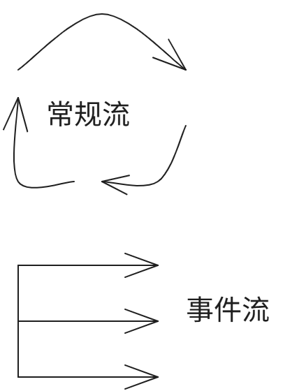

# 组件化内核规格

## 文档状态

- 状态：草稿
- 维护方式：共同迭代

## 目标

记录组件化内核的设计原则、接口约束、运行机制与实现边界，作为后续设计、开发与评审的统一依据。

## 范围

- 流（Flow）这一基础抽象及其映射关系
- 内核的职责与非职责
- 组件模型与生命周期
- 组件间通信机制
- 配置、扩展与装配方式
- 运行时约束
- 测试与兼容性要求

## 术语

| 术语 | 定义 |
| --- | --- |
| 流（Flow） | 一个抽象概念，用于描述系统在时间维度上的持续运行、状态推进与控制权传递。它贯穿硬件启动、固件执行、引导加载与内核运行全过程。 |
| 常规流 | Flow 的一种基本抽象表现形式，表示在默认情况下持续推进、首尾衔接、源源不断的执行状态。 |
| 事件流 | Flow 的一种基本抽象表现形式，表示由事件源触发并导向相应处理路径的离散执行形态。 |
| 内核 | 软件执行流中的核心阶段。它从前序引导阶段接收控制权，并继续组织系统初始化、组件装配、运行与退出。 |
| 组件 | 内核内部参与某一段执行流的功能单元，具有明确职责、边界、输入输出与生命周期。 |
| 扩展点 | 内核在特定流节点上预留的受控接入位置，允许组件按约定方式插入、接管或观察执行流。 |

## 目录

1. 基础概念
2. 背景与目标
3. 总体架构
4. 组件模型
5. 生命周期
6. 接口与通信
7. 配置与装配
8. 扩展机制
9. 运行时与资源管理
10. 错误处理
11. 安全与隔离
12. 测试与验证
13. 兼容性策略
14. 未决问题

## 基础概念

### 流（Flow）

流（Flow）是本规格首先建立的一级抽象。

它不是某个具体模块、某条指令或某段代码，而是用于描述系统如何在时间维度上持续推进、如何在不同阶段之间传递控制权的统一概念。

在硬件层面，流起源于硬件加电。硬件加电后，晶振开始工作，CPU 装置在时钟驱动下持续进行取指、译码、执行、访存、回写五个阶段的循环，直至断电。这里的流描述的是系统执行能力被持续驱动的事实，以及这一事实背后的物理承载过程。

在软件栈的各个层面，流会表现为不同形式的执行流。在固件与引导阶段，它体现为控制权的逐级传递，即从 BIOS 到 Bootloader，再到内核；在内核阶段，它可以进一步表现为常规流与事件流之间的组织、切换与恢复。内核并不是软件流的起点，而是前序流的承接者，也是后续系统运行流的组织者。

对于组件化内核而言，Flow 是比“组件”更基础的概念。组件不是静态堆叠的模块集合，而是被安置在特定流节点上的执行单元。组件化的核心目标之一，就是把内核内部原本隐含的执行流切分为可命名、可装配、可观测、可验证的若干段。

后续章节中涉及的初始化顺序、组件生命周期、装配时机、异常传播、停机路径等内容，均应优先从 Flow 的视角理解。

### 流的代表符号

为便于在后续架构图与规格图中统一表达，Flow 允许使用抽象代表符号进行标注。该代表符号表达的是“流”的抽象意义本身，而不是某一特定实现。

  

  图 1 流的代表符号

在本规格当前约定中，流的代表符号分为两类：

- 常规流符号：由若干首尾相连的曲线箭头构成，用于表示默认情况下不受外界干扰、会持续不停执行下去的执行状态
- 事件流符号：由一条主干线与若干向外导出的箭头构成，用于表示具有多个预留入口点并分别导向不同处理例程的事件分派结构

图中使用三个曲线箭头或三个分支箭头，仅用于表达“多个”这一抽象含义，并不表示数量被固定为三。符号中的形状、数量与连接方式也都具有象征意义，用来抓住流的高层特征，而不是对底层实现结构作逐项摹写。

### 抽象层与实例层的关系

流是高层次的抽象概念，关注的是多个层面上共同存在的本质特征，而不是某一层中的具体对象。

因此，本规格在不同层面使用实例来解释 Flow 时，强调的是“映射关系”或“借例说明”，而不是“相等关系”。例如，在内核层面引入进程、线程、中断、异常向量表与处理例程，是为了帮助理解流在该层的表现形式；这些对象并不等同于流本身，也不穷尽流的全部构成要素。

同一抽象流概念，在硬件层、固件层、引导层、内核层乃至其他软件层面，都可以有不同的承载体、组织方式与实现边界。本规格讨论 Flow 时，默认优先站在抽象层描述其共性；只有在需要落到某一具体层时，才引入该层的实例进行说明。

### 常规流

常规流表示系统在默认条件下持续推进的执行流。

这里的“默认条件”是指未受到外部中断、异常或其他事件流打断的状态。在这种状态下，执行会沿既有路径持续向前推进，不以单次触发为边界，而以连续运行作为基本特征。

在内核层面，可以借由进程或线程所承载的执行状态来理解常规流，但常规流并不等同于某个进程、线程或调度实体本身。常规流并不要求始终由同一个执行体独占 CPU；相反，它可以表现为多个进程或线程在调度作用下不断切换、交替执行，但从抽象层面看，这仍然属于系统的常规执行状态。

因此，常规流强调的不是某个具体执行体，而是“系统存在一条持续前进的主执行流，并可由多个执行体轮换承载”这一事实。

### 事件流

事件流表示由某类事件触发并导向相应处理路径的执行流。

它的核心特征不是连续循环，而是存在一个统一的入口组织结构，并从中分派到若干具体处理路径。在内核层面，可以借由中断异常向量表及其对应处理例程来理解事件流，但事件流并不等同于向量表这一数据结构本身，也不等同于某一组固定的处理函数集合。

在这一映射下：

- 左侧主干线可理解为向量表本身
- 主干线上预留的若干入口点可理解为不同事件对应的入口
- 右侧导出的多个箭头可理解为各个事件的处理例程

这些事件既可以是中断，也可以是异常，或其他由内核统一接管的事件类型。图中多个箭头同样只表示“若干事件处理路径”的含义，而不限定具体数量。

### 常规流与事件流的切换

流并不是静止地只属于某一种类型，而是在常规流与事件流之间不断切换。

在内核层面，这种切换可被观察为：系统通常处于常规流所代表的持续执行状态；当中断、异常或其他事件到来时，执行转入事件流，由对应入口和处理例程接管；当事件处理完成后，执行再返回常规流继续推进。

因此，常规流与事件流不是彼此孤立的两套系统，而是同一整体执行流在不同条件下的两种基本表现形式。上述切换关系是 Flow 在内核层面的一种具体体现，而不是对 Flow 全部适用场景的穷尽定义。组件化内核后续对上下文、调度、异常、同步与扩展点的描述，都应建立在这种切换关系之上。

## 背景与目标

本规格不从静态模块图出发，而从 Flow 这一基础抽象出发，描述组件化内核如何承接硬件流与启动流，并在内核内部继续组织执行流。

本规格的目标包括：

- 建立从硬件加电到内核运行的统一描述框架
- 明确内核、组件、扩展点在执行流中的位置与边界
- 为初始化、切换、异常与退出等过程提供一致的建模方式
- 为后续组件拆分、接口定义与验证策略提供共同语言

## 总体架构

组件化内核可以初步理解为对内核执行流的显式切分、命名与装配。

在这个视角下，总体架构至少包含三层连续关系：

- 硬件流：从加电、时钟建立到 CPU 持续执行
- 启动流：从 BIOS 到 Bootloader 再到内核入口
- 内核流：从内核入口开始，经初始化、组件装配、常规执行、事件处理直至退出或停机

后续规格需要进一步回答三个问题：

- 哪些位置是稳定且可定义的流节点
- 哪些组件可以挂接到这些流节点
- 流在跨组件传递时如何保持连续性、可观测性与可恢复性

## 组件模型

待补充。

## 生命周期

待补充。

## 接口与通信

待补充。

## 配置与装配

待补充。

## 扩展机制

待补充。

## 运行时与资源管理

待补充。

## 错误处理

待补充。

## 安全与隔离

待补充。

## 测试与验证

待补充。

## 兼容性策略

待补充。

## 未决问题

- 待补充
