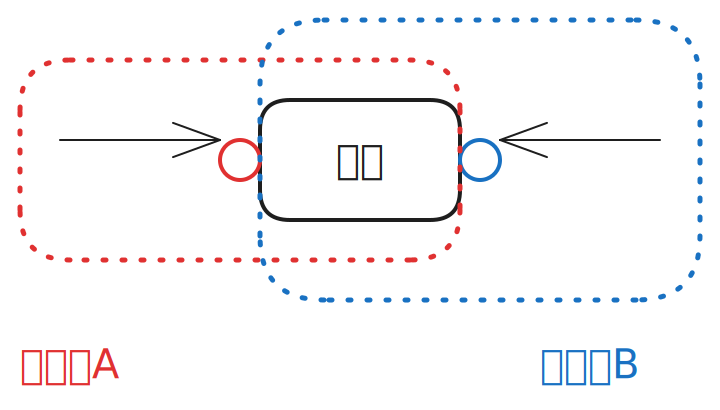
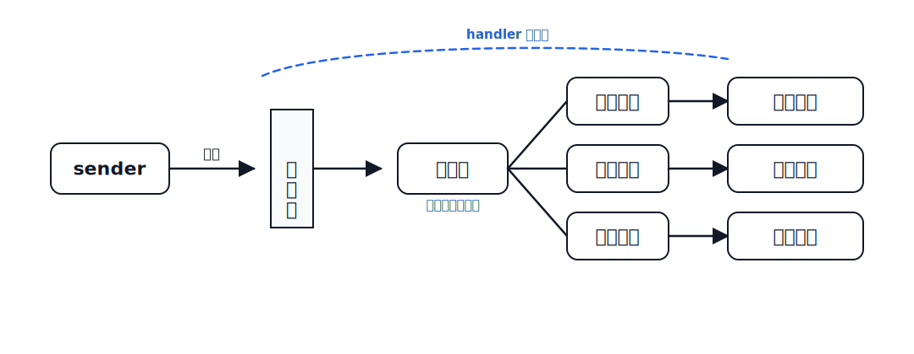
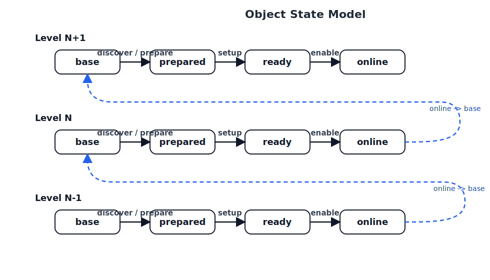
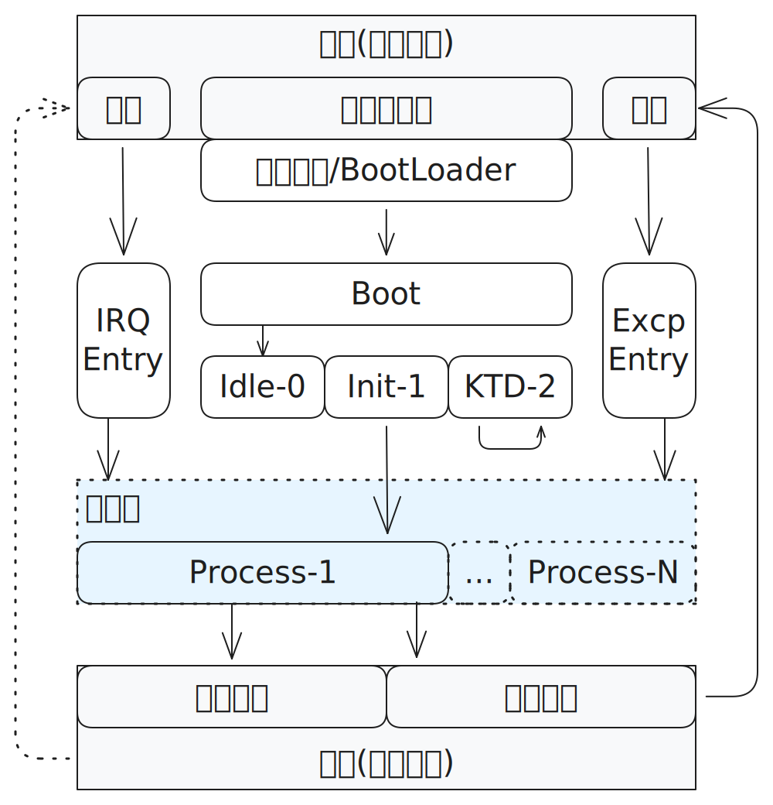
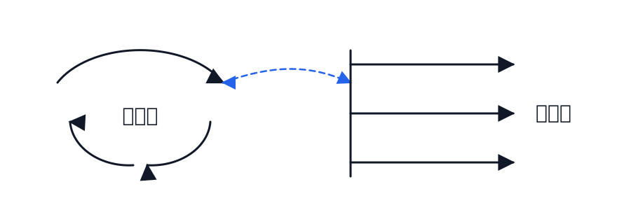
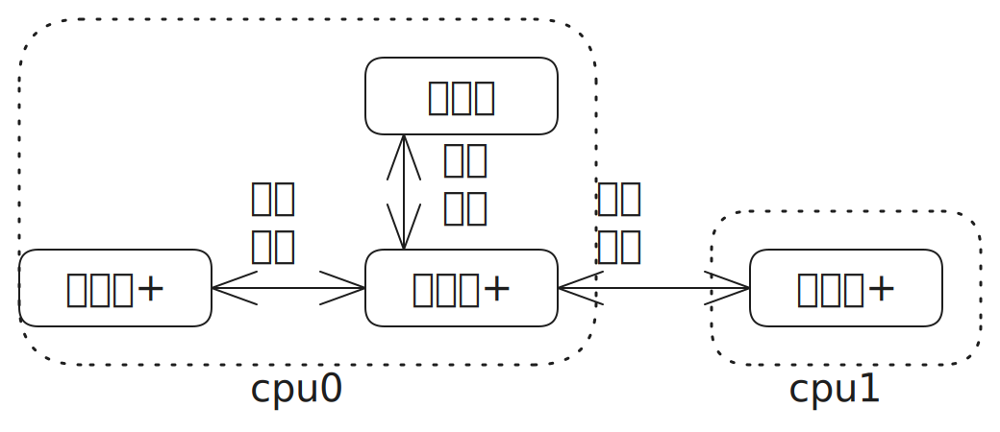
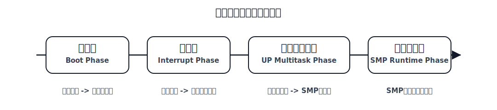
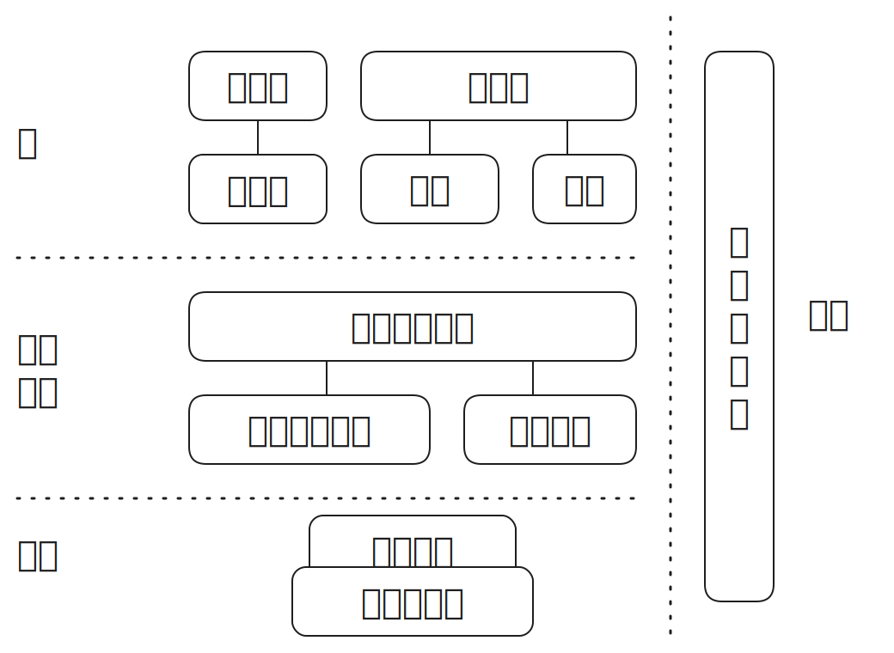
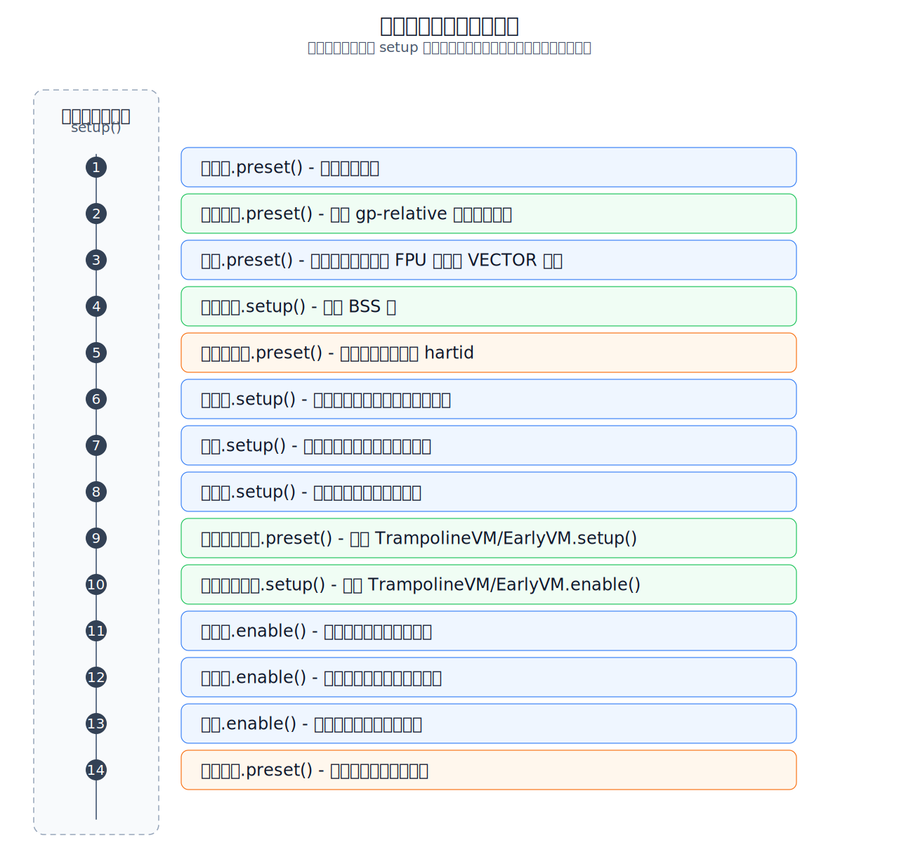

# 组件化内核规格

## 文档状态

- 状态：草稿
- 维护方式：共同迭代
- 当前体系结构约束：`riscv64`
- 参考内核：`linux-6.12.37`

## 目标

记录组件化内核的设计原则、接口约束、运行机制与实现边界，作为后续设计、开发与评审的统一依据。

## 文档用途

本规格不是只用于人工阅读的设计说明，而是后续验证、构建和测试工作的共同依据。文档中的对象模型、阶段模型、状态迁移和检查项，都应尽量以可验证、可实现、可生成测试的形式表达。

1. 验证阶段：基于本规格建立的模型进行验证，发现内核最终行为与预期目标之间的不一致，也发现内核模型内部不同对象、阶段、状态之间的不一致。
2. 构建阶段：基于本规格指挥 `AI` 进行内核编码实现。各级模型在各个阶段中的状态、动作与检查项，将成为代码中内嵌检查规则的来源。
3. 测试阶段：基于本规格自动形成测试用例，使对象状态、阶段边界、上下文约束和错误路径能够被系统性覆盖。在基本的功能、性能、安全等测试基础上，还应基于模型给出的状态点与参考内核进行差分对比测试。差分信息的采集方式包括内核插桩、模拟器采集和硬件采集；对比分析方式包括实时分析和记录后分析。

## 规格表达约定

为支撑后续验证、构建和测试，本文中的模型条目应尽量采用可引用、可检查、可实现和可生成测试的表达方式。说明性文字可以用于解释建模意图，但不应替代对象、过程、状态、动作和检查项本身。

对象建模应遵循以下约定：

1. 每个对象应具有稳定的中文名、英文名和对象类型；同一对象在图、表和正文中应使用同一名称。
2. 每个对象应说明其父对象、子对象或属性、依赖对象以及作用边界；对象之下可以包含若干属性或子对象，具体选择哪一种取决于所持有信息的大小和独立性。
3. 每个对象过程应尽量按照 `过程名 / 初始状态检查 / 执行动作 / 结束状态检查 / 失败处理` 的形式描述。当前阶段尚未细化的字段可以标为 `暂缺`，但不应与 `无` 混用。
4. `无` 表示当前模型确认不需要额外条件或动作；`空` 表示该过程存在但当前不执行实际动作；`暂缺` 表示模型尚未补充；`待讨论` 表示存在未决设计选择。
5. 检查项分为 `记录` 和 `验证` 两类。`记录` 用于保留后续跟踪需要的状态；`验证` 用于判断当前状态是否符合预期，失败时应使状态机进入 `FAIL` 并报告错误。
6. 对可验证的状态点，应逐步补充可观测方式，包括可观测位置、采集方式、期望值以及是否可与参考内核进行差分对比。
7. 图用于展示对象关系、阶段边界和编排顺序；真正作为验证、构建和测试输入的模型来源，应落到对象条目、过程条目、检查项和状态迁移描述中。
8. 当某一模型条目对应参考内核中的具体实现位置时，可以记录参考位置；但模型本身不要求与参考内核源码逐行对应，允许按对象边界重新组织。

## 范围

- 当前讨论限定于 `riscv64` 体系结构
- 流（Flow）这一基础抽象及其映射关系
- 对象（Object）这一基础抽象及其映射关系
- 流的实体化与资源对象的逐级建立
- 内核领域及其前置环境
- 内核的职责与非职责
- 组件模型与生命周期
- 组件间通信机制
- 配置、扩展与装配方式
- 运行时约束
- 测试与兼容性要求

## 术语

| 术语 | 定义 |
| --- | --- |
| 流（Flow） | 一个抽象概念，用于描述系统在时间维度上的持续运行、状态推进与控制权传递。它贯穿硬件启动、固件执行、引导加载与内核运行全过程。 |
| 对象（Object） | 与 Flow 相对应的另一基础术语，指在某一层级中具有身份、边界、状态以及可被识别和操作方式的承载体。 |
| 上下文（Context） | 介于 Flow 与资源之间的运行环境对象。Flow 总是在某个 Context 中访问资源；Context 用于承载和限定这种访问所依赖的环境条件。 |
| 资源句柄（Resource Handle） | 面向特定 Context 暴露给 Flow 的资源访问句柄。Flow 通过句柄访问资源，而不是直接裸访问资源。 |
| 实体化 | 抽象概念在某一层级获得具体承载形式，并因此变得可执行、可切换、可观测、可操作的过程。 |
| Flow 对象 | 为表述、承载或跟踪某一 Flow 的状态与推进关系而建立的对象。它可视为该 Flow 在内核系统中的对象化代表或表现。 |
| 资源对象 | 在某一层级中被识别、命名、分界、类型化，并可被流作用或被该层管理的对象。 |
| 消息 | 对象之间传递请求、通知、状态变化或协作意图的抽象通信单元。 |
| 前置环境 | 内核领域建立之前，由硬件、固件与引导过程所提供的执行条件、资源基础及控制关系的总和。 |
| 内核领域 | 本规格重点讨论的领域，指内核接管控制权后，用以组织执行流、资源对象与组件关系的对象空间。 |
| 常规流 | 在本规格当前讨论中，指 Flow 在内核领域的一种核心表现形态，表示在默认情况下持续推进、首尾衔接、源源不断的执行状态。 |
| 根流（Root Stream） | 内核接管控制权后建立的第一条、也是引导期内唯一的常规流对象。它是后续常规流建立与早期初始化推进的根源流，负责一路执行早期初始化，直到创建 `kernel_init` 与 `kthreadd` 后，转化为 `idle` 流的执行承载。 |
| 事件流 | 在本规格当前讨论中，指 Flow 在内核领域的一种核心表现形态，表示由事件源触发并导向相应处理路径的离散执行形态。其核心子形态包括中断流与异常流。 |
| 内核 | 软件执行流中的核心阶段。它从前序引导阶段接收控制权，并继续组织系统初始化、组件装配、运行与退出。 |
| 组件 | 内核内部参与某一段执行流的功能单元，具有明确职责、边界、输入输出与生命周期。 |
| 扩展点 | 内核在特定流节点上预留的受控接入位置，允许组件按约定方式插入、接管或观察执行流。 |

## 目录

1. 文档状态
2. 目标
3. 文档用途
4. 规格表达约定
5. 范围
6. 术语
7. 背景与目标
8. 总体架构
9. 基础概念
10. 上下文与资源访问模型
11. 对象与消息模型
12. 流模型
13. 启动与实体化
14. 组件模型
15. 生命周期
16. 接口与通信
17. 配置与装配
18. 扩展机制
19. 运行时与资源管理
20. 错误处理
21. 安全与隔离
22. 测试与验证
23. 兼容性策略
24. 未决问题

## 背景与目标

本规格不从静态模块图出发，而从 Flow 这一基础抽象出发，描述组件化内核如何承接硬件流与启动流，并在内核内部继续组织执行流。

本规格的核心领域是内核领域，但不把讨论起点限定在内核入口之后。硬件、固件和引导过程并不只是内核之外的背景，它们也是内核领域得以建立的前置环境。内核中的执行流、资源对象与控制关系，均建立在这些前置环境逐级准备的基础之上。

本规格的目标包括：

- 建立从硬件加电到内核运行的统一描述框架
- 说明抽象 Flow 如何在启动过程中逐级实体化
- 说明与 Flow 相对应的对象如何在启动过程中逐级建立
- 说明 Flow 所依赖和作用的资源对象如何被逐级建立
- 明确运行阶段对象之间如何通过消息通信相互影响和协作
- 界定内核领域与前置环境之间的边界及其关系
- 明确内核、组件、扩展点在执行流中的位置与边界
- 为初始化、切换、异常与退出等过程提供一致的建模方式
- 为后续组件拆分、接口定义与验证策略提供共同语言

## 总体架构

组件化内核可以初步理解为对内核执行流的显式切分、命名与装配。

在这个视角下，总体架构至少包含三层连续关系：

- 硬件流：从加电、时钟建立到 CPU 持续执行
- 启动流：从 BIOS 到 Bootloader 再到内核入口
- 内核流：从内核入口开始，经初始化、组件装配、常规执行、事件处理直至退出或停机

从实体化视角看，总体架构还包含一条逐级建立链：

- 硬件层提供最初的执行能力与原生资源边界
- 固件层和引导层建立控制权交接、初始配置与内核可接管的运行条件
- 内核早期阶段在前置环境的基础上继续建立内核领域中的 `Flow` 对象、资源对象与组织关系

从运行视角看，总体架构还可理解为一个对象协作结构：

- 引导阶段的重点是逐级建立对象
- 运行阶段的重点是对象之间通过消息通信相互影响和协作

后续规格需要进一步回答一组问题：

- 抽象 Flow 在各层分别通过什么承载体完成实体化
- 哪些对象用于表述和跟踪各层中的 Flow 状态
- 哪些前置环境是内核领域对象建立的必要条件
- 哪些位置是稳定且可定义的流节点
- 哪些组件可以挂接到这些流节点
- 对象之间的消息语义、边界与协作方式如何定义
- 流在跨组件传递时如何保持连续性、可观测性与可恢复性

## 基础概念

### 流（Flow）

流（Flow）是本规格首先建立的一级抽象。

它不是某个具体模块、某条指令或某段代码，而是用于描述系统如何在时间维度上持续推进、如何在不同阶段之间传递控制权的统一概念。

在硬件层面，流起源于硬件加电。硬件加电后，晶振开始工作，CPU 装置在时钟驱动下持续进行取指、译码、执行、访存、回写五个阶段的循环，直至断电。这里的流描述的是系统执行能力被持续驱动的事实，以及这一事实背后的物理承载过程。

在软件栈的各个层面，流会表现为不同形式的执行流。在固件与引导阶段，它体现为控制权的逐级传递，即从 BIOS 到 Bootloader，再到内核；在内核阶段，它可以进一步表现为常规流与事件流之间的组织、切换与恢复。内核并不是软件流的起点，而是前序流的承接者，也是后续系统运行流的组织者。

对于组件化内核而言，Flow 是比“组件”更基础的概念。组件不是静态堆叠的模块集合，而是被安置在特定流节点上的执行单元。组件化的核心目标之一，就是把内核内部原本隐含的执行流切分为可命名、可装配、可观测、可验证的若干段。

后续章节中涉及的初始化顺序、组件生命周期、装配时机、异常传播、停机路径等内容，均应优先从 Flow 的视角理解。

### 对象（Object）

与 Flow 相对应的另一基础术语是对象（Object）。

如果说 Flow 强调的是系统在时间维度上的持续推进、切换与传递，那么 Object 强调的就是系统在某一层级中被建立出来、可被识别、可被跟踪、可被操作的承载体。二者并不是相互排斥的两套描述，而是同一系统在动态侧与承载侧上的两种基础视角。

从本规格的角度看，一方面，抽象意义上的 Flow 本身会建立出一类对象，用来表述、承载和跟踪自己的状态；另一方面，Flow 所需要作用的各类别、各层级客体资源，也需要被建立为对象。前者可称为 Flow 对象，后者可称为资源对象。

因此，系统并不是只有“流”在运动，也不是只有“对象”在静止存在；更准确地说，Flow 通过对象获得状态表述与操作基础，而对象通过 Flow 获得推进、作用与协作关系。

### 上下文（Context）

在 `Flow` 与资源对象之间，还需要引入一个新的对象，即上下文（`Context`）。

更准确地说，`Flow` 总是在某个 `Context` 中去访问资源，而不是脱离上下文直接与资源发生关系。因此，`Context` 可理解为某种运行环境。它既承载 `Flow` 当前访问资源所依赖的环境条件，也限定这种访问以何种方式发生。

如果说 `Flow` 强调的是推进和执行，资源对象强调的是被访问和被操作，那么 `Context` 强调的就是“Flow 以何种环境前提去访问资源”这一中间层。它介于 `Flow` 与资源之间，使得二者的关系不是直接裸露的接触关系，而是带有环境条件约束的作用关系。

## 上下文与资源访问模型

本规格采取的策略，是将访问对象的机制方式与其所处的访问环境统一考虑。这里所说的访问环境即 `Context`。这意味着，对资源的访问方式不应脱离 `Context` 单独讨论，而应与该 `Context` 所附带的并发、可阻塞性、所有权、生命周期、隔离边界等条件一并设计。

在这一策略下，`Flow` 总是在某个 `Context` 中，通过面向该 `Context` 的资源句柄访问资源，而不是直接裸访问资源。同一资源在不同 `Context` 下可以暴露出不同句柄；这些句柄体现的是访问语义和约束条件的差异，而不是资源本体的差异。

这种思路与某些统一、保守的引用机制设计不同。后者倾向于使用一套在广泛场景中都成立的通用安全机制来表达资源访问；而本规格更强调先显式建模 `Context`，再让资源句柄随 `Context` 的不同而变化。由此，哪些访问保护是必要的，哪些是冗余的，就不再是抽象地一概而论，而是由 `Context` 来决定。

<p align="center">
  
</p>

<p align="center">
  图 2 上下文与资源句柄
</p>

图中中间的资源表示同一个被动资源对象；外围不同虚线框表示不同的 `Context`；资源两侧的圆圈表示面向不同 `Context` 暴露出的资源句柄。它所强调的是：`Flow` 对资源的访问总是经由某个与 `Context` 对应的句柄发生，而不是直接对资源本体发生。

作为规格要求，后续在实现机制上需要落实上述理念：在编译时和/或运行时，应有相应机制保证资源句柄与 `Context` 的匹配关系，从而确保句柄被安全且合理地用于资源访问。当前先将这一点作为明确要求记录下来；至于具体采用何种编译时约束、运行时检查、类型机制或其他实现办法，将在后续补充本规格文档时进一步展开。

## 对象与消息模型

### 对象与消息

当对象逐级建立起来之后，系统运行就不再只是“单条流的推进”，而表现为对象之间的相互作用与协作。

在本规格中，对象以及对象之间的关系应优先基于消息模型进行设计。这种相互作用优先抽象为消息通信。消息并不预设某一种具体实现机制，而是泛指对象之间传递请求、通知、状态变化或协作意图的抽象单元。某个对象通过消息影响其他对象，其他对象再以相应消息或状态变化作出响应，由此形成运行阶段中的协作关系。

在最基本的消息模型中，包含两个角色：

- `sender`：发送消息的一方，负责发起请求、通知或其他消息动作。
- `handler`：接收并处理消息的一方，负责对消息作出响应，并根据情况可能返回一个消息。

在这一模型中，消息本身至少包含以下基本组成：

- 目标对象标识：用于指出该消息所作用的目标对象。
- 消息类型：用于指出该消息属于何种语义类别，以决定应采用何种处理方式。
- 消息内容：用于承载该消息的具体数据、参数或上下文信息。

如果 `handler` 需要返回结果，则其返回内容也可继续被视为消息，从而保持整个对象协作过程在统一消息模型中的闭合性。

在更具体的 `handler` 模型中，`handler` 仍然是抽象模型本身，而不预设为单一的最终处理点。首先，模型并不阻止 `sender` 把消息发给 `handler`；但在 `handler` 一侧，可以通过总开关控制消息是否允许进入。消息在通过总开关后，可进入一层分路器，由分路器根据消息类型将消息派发到不同分路上。每条分路上又各自带有分路开关；消息只有在通过对应分路开关后，才会进入相应的分路处理。

<p align="center">
  
</p>

图 4 Handler 模型

这一 `handler` 抽象模型并不只对应某一种单独机制，而可用于统一表述内核世界中的多种响应机制。典型地，它可以用于描述中断/异常的响应、进程信号 `signal` 的响应，以及文中所提到的各类被动对象在接收到消息、命令或请求后的响应过程。其中，对于中断/异常这类机制，本文档当前阶段以下均按 `riscv64` 的具体语义来理解和展开，以避免讨论发散。

因此，从本规格的视角看，内核引导阶段的核心任务之一是逐级建立对象，而内核运行阶段的核心特征之一则是对象之间以消息通信方式相互影响和协作。

### 对象的通用状态模型

对于对象，需要建立一个通用的状态模型。该模型既包含状态，也包含推动状态迁移的过程。

在本规格当前约定中，可将对象的通用状态模型描述为：

`base -[discover]-> prepared -[setup]-> ready -[enable]-> online`

其中：

- 箭头方括号中的 `discover`、`setup`、`enable` 表示过程
- 其余各项表示状态

状态可作如下理解：

- `base`：当前对象状态模型的基础状态条件，表示低级对象已经处于 `online`，并成为当前对象建立的基础
- `prepared`：当前对象已被发现并完成初步建立
- `ready`：当前对象已完成必要准备，具备进入运行状态的条件
- `online`：当前对象已被使能，可被上层或其他对象继续使用、依赖或协作

过程可作如下理解：

- `discover`，别名 `detect`、`prepare` 或 `preset`：从低级对象的 `online` 状态出发，发现当前对象、探测其基本信息，或者对对象进入受控初始状态所需的最小条件进行预置，使对象从 `base` 进入 `prepared`
- `setup`，别名 `config`：基于上一阶段收集到的信息，建立对象的内部框架、必要配置与初步组织关系，使对象从 `prepared` 进入 `ready`，但尚未真正启用
- `enable`，别名 `start`：使对象上线，使对象从 `ready` 进入 `online`
- `cleanup`，别名 `teardown`：对对象以及在前序阶段中已经建立的框架、配置、绑定关系和占用资源进行清理与销毁，使对象退出当前建立过程。它不是主建立链上的常规前进过程，而是一种特殊过程；对于 `discover/detect/prepare/preset`、`setup/config`、`enable/start` 中的任一步，在执行完成后都可能因为对象已无继续存在的必要而进入 `cleanup/teardown`，也可能因为执行中途出错、取消或回滚而转入该过程。

对于 `discover` 而言，许多对象在建立之前都需要先获取基础信息。以内核中的实例来说，这些信息可能直接来自 `device tree`、`ACPI` 等前置描述，也可能来自基于这些前置描述进一步建立起来的信息收集器对象。因此，`discover` 的重点并不在于信息一定来自哪一种固定来源，而在于当前对象能够从前置环境或既有低级对象中获得其建立所需的最基本信息。

当这一过程并不只是被动发现信息，而是需要把对象预先调整到一个安全、可继续建立的初始状态时，也可以使用 `prepare` 或 `preset` 来命名同一条状态迁移。二者都强调进入 `prepared` 之前的前置预置动作：`prepare` 更偏向一般准备，`preset` 更偏向把某些关键状态位或寄存器设置为预期初值。例如入口前导期的 `中断流` 对象，关闭中断进入路径的动作就更适合放在这一过程，而不是放到后续 `setup` 中。

对于 `setup` 而言，其核心任务始终是基于上一阶段收集到的信息，把对象建立起来，但尚未真正启用。不同对象在完成这一任务时，可以采用不同模式，而且同一对象的 `setup` 过程也可能同时包含多种模式。典型模式包括：

1. `组装`：基于已经存在的较小、较基础对象，组装形成更大规模、更高层级的对象。这是最常见的模式，本质上是由已有对象建立新的组合关系和整体结构。
2. `转换`：对象的内部语义不变，但其表示形式、组织形式或数据结构发生变化。这类模式强调“形式变化而语义不变”。
3. `立体化（unflatten）`：可视为一种更具体的转换，指将某种扁平、序列化或线性展开的信息，反序列化或展开为更直接、易访问、易操作的对象结构。例如，基于磁盘上存储的文件系统元信息建立起“立体化”的文件系统对象；前后都仍然是文件系统，但对象形式已经从扁平走向立体。
4. `映射`：在两个对象空间之间建立对应关系，使一个对象体系能够通过另一对象体系被访问、解释或组织。例如，`namespace` 中多级名字对象之间可以体现映射关系，虚拟地址空间对象与物理地址空间对象之间也体现映射关系。
5. `抽象`：基于较低层对象建立一个新的、更高层级的抽象对象。它的关键不只是组合、变换或映射，而是形成了新的语义层次。例如，进程依赖于一系列低级对象，但最终形成的是一个新的高级抽象。

对于 `enable/start` 而言，这两个名称虽然对应同一状态迁移，但通常分别侧重两类不同对象：

- `enable` 更侧重被动资源对象。这类对象本身不会主动行动，而是等待命令、请求或访问，并在收到后作出响应。对这类对象而言，`enable` 表示它已经进入可接受命令、可响应请求并对外提供服务的状态。
- `start` 更侧重主动对象。这类对象在 `setup` 完成后，虽然其内部框架与运行条件已经建立，但仍处于停止或静止状态。只有经过 `start`，它们才进入可行动、可推进自身行为并开始发挥作用的状态。例如，进程、线程等对象更适合使用 `start` 来描述这一阶段。

对于非常轻量级的对象，不必为了形式完整而强行拆分出复杂的 `discover`、`setup`、`enable` 过程。它们的主要执行动作通常可以集中放在 `setup` 过程中，其余过程或状态可以是空操作，即 `dummy` 或 `no-op`。这类简化不改变对象仍然服从通用状态模型的事实，只是说明该对象在某些状态或迁移上没有实际工作需要完成。

后续为具体对象填写某一过程的“初始状态”时，不必重复声明通用状态机已经保证的前置条件。例如，`enable` 必然是 `setup` 的后置过程；只有对象已经到达 `ready`，才允许执行 `enable`。因此，具体对象的 `enable` 初始状态可以只写该对象额外需要检查的条件；如果没有额外条件，也可以写作“无”。

对于 `cleanup/teardown` 而言，它对应的不是对象“向前建立”的语义，而是对象“退出当前建立链”的语义。由于它可能从多个阶段被触发，将其加入主图示会干扰主建立链的阅读，因此本规格对其进行单独文字描述，而不纳入图 5 的主状态链展示。

这里的 `base` 并不表示当前对象自身已经处于某种初始运行状态，而是表示当前对象的建立以低级对象的 `online` 作为基础条件。当当前对象进入 `online` 后，这一状态又可以成为更高一级对象的 `base`。因此，该模型会沿对象层级重复展开，并形成一个连续的逐级建立链。

从这一意义上说，内核并不是一次性完成建立的静态结果，而是不断从低级对象建立高级对象的过程。低级对象进入 `online` 后，会成为更高一级对象的 `base`；更高一级对象完成 `online` 后，又继续成为再上一层对象的基础。由此，内核的建立与运行可被理解为一种沿对象层级不断递进的螺旋上升过程。

<p align="center">
  
</p>

图 5 对象的通用状态模型

图中的三层串接表示同一状态模型会沿对象层级不断复用：`Level N-1` 的 `online` 构成 `Level N` 的 `base`，`Level N` 的 `online` 又构成 `Level N+1` 的 `base`。每一层内部按状态链横向展开，层与层之间则按对象层级纵向衔接，从而表达它们是同一逐级建立过程中的连续区段。

### 对象状态机建模原则

在更具体的实现建模中，可以参考 `Zephyr SMF` 一类状态机机制的结构思想，但本规格强调的是借鉴而非照搬。模型的建立必须首先服从本规格自身的对象生命周期语义，而不能被某一现成框架的 API 或调用方式反向约束。

对本规格而言，状态机中的 `entry`、`run`、`exit` 三者应承担不同职责：

- `entry`：负责进入某一状态时的检查与确认，确保对象已经具备该状态所要求的前提。
- `run`：负责状态迁移本身，也就是推动对象从当前状态走向下一状态的核心动作。
- `exit`：负责离开某一状态前的检查与确认，确保该状态应完成的工作已经完成。

在执行语义上，`entry` 与 `exit` 都应被视为单次动作：进入某一状态时，`entry` 只执行一次；离开某一状态时，`exit` 也只执行一次。与之不同，`run` 在对象停留于某一状态期间可以被多次调用；每次调用都只表示一次“单步推进尝试”。

同时，`run()` 本身不应设计为内部阻塞等待。无论本次推进是否成功，它都应立即返回结果，并把是否能够继续推进的判断交给上层逻辑。因此，`run()` 的返回结果当前可统一抽象为以下三类：

- `Progressed`：本次调用成功推进了状态迁移。
- `Blocked`：当前并未出错，但条件尚未满足，因此对象仍停留在原状态。
- `Failed`：本次调用发生错误，无法按正常路径继续推进。

与某些典型状态机框架以持续循环调用 `run_state()` 为中心的运行方式不同，本规格中的对象状态推进更基础、更通用的做法，是为对象提供“单步推进”的基本能力，再由更上层逻辑根据不同场景、阶段和上下文来决定何时调用、如何调用这一单步推进能力。也就是说，状态机本身不必天然表现为一个自循环驱动体；更常见的情况是，上层逻辑按需触发对象向前推进一步。

因此，在本规格后续的设计中，状态机的组织原则可概括为：

1. 借鉴通用状态机结构思想，但不照搬具体框架。
2. `entry / exit` 负责状态边界的检查与确认，`run` 负责迁移推进。
3. 对象应提供单步推进的基本能力，而由更上层逻辑负责按不同阶段、上下文和对象关系进行编排。

### 对象的层次

对象并不只是一层扁平集合。一个对象之下可以继续包含若干 `属性` 和若干 `子对象`。二者的区别主要取决于被持有信息的规模、独立性和生命周期：如果某项信息规模较小、语义上依附于父对象、且不需要独立经历状态迁移，通常更适合作为父对象的属性；如果某项信息规模较大、具有清晰身份和边界、需要单独维护状态或参与对象间关系，则更适合作为子对象。

因此，属性与子对象不是两套互斥的建模体系，而是同一对象分解过程中的两种粒度选择。后续在描述具体对象时，应根据对象持有信息的大小和独立程度，决定将其放入属性表，还是提升为单独的子对象。

在对象层次的讨论中，当前先列出三个处于顶级、即最高抽象级的对象。它们不是彼此从属的普通子对象，而是当前对象体系中最上层的组织对象：

1. `Flows`：流组，即流的集合，用于从整体上组织系统中的各类 Flow。
2. `CPUs`：CPU 组，用于对所有物理 CPU 进行统一管理。
3. `System`：系统对象，即内核本身，表示整个内核作为一个整体对象的存在。

后续对象层次的展开，应首先从 `Flows` 开始，而不是从 `System` 开始。原因在于，`Flow` 是本规格的核心概念；它最初是“虚”的抽象，但在内核启动过程中，会首先为自己逐步建立对象并形成管理，然后才在这些基础之上继续展开更具体的对象体系。

因此，这三个顶级对象虽然并列存在，但在叙述顺序上应优先展开 `Flows`，再继续讨论其他顶级对象及其下级体系。

#### Flows

`Flows` 本身先只作简单描述：它仅仅是一个集合管理对象，用于统一管理多个 Flow。

真正需要重点区分的是 `Flow` 本身与其对应的 `Flow` 对象。二者不是同一事物：

- `Flow` 强调的是实际推进和执行的那一侧
- `Flow` 对象强调的是该 `Flow` 在内核对象体系中的对象化代表、表现与状态记录

从内核自身对象体系的视角看，当内核刚刚启动时，最初只有一个 `Flow`。此时还没有任何由内核自己建立起来的对象，包括该 `Flow` 对应的 `Flow` 对象。这个 `Flow` 是当时唯一主动运行着的东西；随后，它要逐步创建各类各级对象，其中既包括它自己对应的 `Flow` 对象，也包括各种被动资源对象。

在内核启动的后期，这个最初的 `Flow` 还会继续创建新的 `Flow` 以及与之对应的 `Flow` 对象。到这一步，系统就不再是单一 `Flow` 的推进，而会逐步进入多个 `Flow` 并发存在的状态。

当多 CPU 支持即 `SMP` 被启用后，这些 `Flow` 又可能进一步分布到多个 CPU 上并行执行。于是，`Flow` 的展开过程就从“单一 `Flow` 推进对象建立”，过渡到“多个 `Flow` 并发推进”，再过渡到“多个 `Flow` 在多个 CPU 上并行推进”的状态。

每个 `Flow` 与其对应的 `Flow` 对象既相互区分，又彼此统一。可以认为，`Flow` 对象是该 `Flow` 在内核系统中的对象化代表或表现，用于记录其状态；而 `Flow` 本身则是那个实际运行、推进并持续建立对象的执行主体。在需要强调二者区别时，可使用“尚未对象化的 `Flow`”这一解释性说法，但不将其单独作为正式术语。

## 流模型

### 系统层次中的主动与被动对象

内核会为“流”和“资源”这两类抽象概念建立对象模型并进行管理。其中，`Flow` 对应主动对象，`Resource` 对应被动对象。

主动对象强调执行推进、控制权流动以及对象建立过程；被动对象强调被访问、被操作、被命令和被响应的一侧。二者共同构成系统中的动态关系，但承担的是不同角色。

这张图主要强调的是涵盖硬件、内核、用户进程等各个层次的 `Flow` 以及与之对应的主动对象。沿着这条主线，可以看出整个系统中执行流、或者说执行控制权的流动关系。

图中有意省略了多数被动对象，即资源对象，只着重提及了作为被动资源角色的硬件层部分。这样做的目的，是先把系统层次中的主动推进关系凸显出来；至于各层中的被动资源对象，则将在后续对具体层次的讨论中逐步识别和展开。

<p align="center">
  
</p>

<p align="center">
  图 6 系统层次的主动与被动关系
</p>

### 流的代表符号

为便于在后续架构图与规格图中统一表达，Flow 允许使用抽象代表符号进行标注。该代表符号表达的是“流”的抽象意义本身，而不是某一特定实现。

<p align="center">
  
</p>

<p align="center">
  图 1 流的代表符号
</p>

在本规格当前约定中，用于描述内核领域中流的核心形态的代表符号主要分为两类：

- 常规流符号：由若干首尾相连的曲线箭头构成，用于表示默认情况下不受外界干扰、会持续不停执行下去的执行状态
- 事件流符号：由一条主干线与若干向外导出的箭头构成，用于表示具有多个预留入口点并分别导向不同处理例程的事件分派结构

图中使用三个曲线箭头或三个分支箭头，仅用于表达“多个”这一抽象含义，并不表示数量被固定为三。符号中的形状、数量与连接方式也都具有象征意义，用来抓住流的高层特征，而不是对底层实现结构作逐项摹写。

### 抽象层与实例层的关系

流是高层次的抽象概念，关注的是多个层面上共同存在的本质特征，而不是某一层中的具体对象。

因此，本规格在不同层面使用实例来解释 Flow 时，强调的是“映射关系”或“借例说明”，而不是“相等关系”。例如，在内核层面引入进程、线程、中断、异常向量表与处理例程，是为了帮助理解流在该层的表现形式；这些对象并不等同于流本身，也不穷尽流的全部构成要素。

同一抽象流概念，在硬件层、固件层、引导层、内核层乃至其他软件层面，都可以有不同的承载体、组织方式与实现边界。本规格讨论 Flow 时，默认优先站在抽象层描述其共性；只有在需要落到某一具体层时，才引入该层的实例进行说明。

### 常规流

在本规格当前讨论中，常规流主要用于描述 Flow 在内核领域中的一种核心表现形态。

常规流表示系统在默认条件下持续推进的执行流。

这里的“默认条件”是指未受到外部中断、异常或其他事件流打断的状态。在这种状态下，执行会沿既有路径持续向前推进，不以单次触发为边界，而以连续运行作为基本特征。

在内核层面，可以借由进程或线程所承载的执行状态来理解常规流，但常规流并不等同于某个进程、线程或调度实体本身。常规流并不要求始终由同一个执行体独占 CPU；相反，它可以表现为多个进程或线程在调度作用下不断切换、交替执行，但从抽象层面看，这仍然属于系统的常规执行状态。

因此，常规流强调的不是某个具体执行体，而是“系统存在一条持续前进的主执行流，并可由多个执行体轮换承载”这一事实。

### 事件流

在本规格当前讨论中，事件流主要用于描述 Flow 在内核领域中的一种核心表现形态。

事件流表示由某类事件触发并导向相应处理路径的执行流。

它的核心特征不是连续循环，而是存在一个统一的入口组织结构，并从中分派到若干具体处理路径。在内核层面，可以借由中断异常向量表及其对应处理例程来理解事件流，但事件流并不等同于向量表这一数据结构本身，也不等同于某一组固定的处理函数集合。

在这一映射下：

- 左侧主干线可理解为向量表本身
- 主干线上预留的若干入口点可理解为不同事件对应的入口
- 右侧导出的多个箭头可理解为各个事件的处理例程

这些事件既可以是中断，也可以是异常，或其他由内核统一接管的事件类型。图中多个箭头同样只表示“若干事件处理路径”的含义，而不限定具体数量。

在本规格当前讨论中，事件流又可以进一步区分为中断流与异常流：

- `中断流`：相对于常规流，它是异步的和随机的。所谓异步，是指它并不要求在当前常规流的某个可预先精确指定的位置发生；所谓随机，是指从常规流的视角看，其中断到来的时间点通常不可事先确定。
- `异常流`：相对于常规流，它是同步的和可预期的。所谓同步，是指它与当前执行路径直接相关，通常由当前执行中的某条指令、某次访问或某种检查结果触发；所谓可预期，是指从执行语义上，可以预见在特定条件满足时它会在相应位置出现。

因此，虽然中断流与异常流都归入事件流，但二者并不相同：前者更强调来自执行流之外的异步打断，后者更强调由执行流内部条件直接导出的同步转入。

异常流的典型实例包括 `page fault`、`syscall` 等。这些实例都体现了异常流的共同特征：它们不是在执行流之外随机插入的，而是由当前执行语义在特定位置、特定条件下直接导出的。

前面的讨论，是按照处理方式来分类：在这一角度下，中断流和异常流都可归入事件流。后续讨论中，还会切换到另一个角度来看待这些流的关系。

在后一种角度下，中断流可被视为相对于常规流的独立流，而异常流则可被视为常规流的扩展。这样一来，系统中通常可以简化地理解为存在两种流：

- `中断流`
- `常规流 + 异常流`

为了讨论方便，后者在后文中可简记为 `常规流+`。这里的 `+` 表示该流不仅包含通常意义上的常规执行推进，也包含由执行流内部条件直接导出的异常流扩展。

下面通过一张图，进一步说明这些流之间的切换关系：

<p align="center">
  
</p>

<p align="center">
  图 7 流的切换
</p>

图 7 所强调的是：`常规流+` 代表了系统中流的常态。系统通常从 `常规流+` 出发，通过中断开关控制能否切换到中断流；而一旦进入中断流，在处理完成后，它又会自动返回到原来的 `常规流+`。

`常规流+` 本身并不要求始终只由一条单独流构成。它可以由一到多个相对独立的流组成，在系统中通常表现为多任务。它们之间可以发生切换，而这种切换至少包括两类：

- 主动切换：由流自身的逻辑控制和发起，因此在语义上可被该流主动安排。
- 被动切换：即抢占。虽然抢占点的位置通常可以被确切知道，但某一抢占点是否真正发生抢占，还会受到诸多外部条件影响，因此从具体发生性上看很难完全准确预测。图中着重强调的正是这一点。

此外，任务切换不仅意味着在同一 CPU 上的执行交替，也意味着存在跨 CPU 迁移的可能性。因此，图中除常规流内部的切换关系之外，还额外强调了流在 CPU 之间迁移这一情况。

### 常规流与事件流的切换

流并不是静止地只属于某一种类型，而是在常规流与事件流之间不断切换。

在内核层面，这种切换可被观察为：系统通常处于常规流所代表的持续执行状态；当中断、异常或其他事件到来时，执行转入事件流，由对应入口和处理例程接管；当事件处理完成后，执行再返回常规流继续推进。

因此，常规流与事件流不是彼此孤立的两套系统，而是同一整体执行流在不同条件下的两种基本表现形式。上述切换关系是 Flow 在内核层面的一种具体体现，而不是对 Flow 全部适用场景的穷尽定义。组件化内核后续对上下文、调度、异常、同步与扩展点的描述，都应建立在这种切换关系之上。

## 启动与实体化

### 核心立场

从本规格的视角看，启动并不是单纯的“把控制权交给内核”，而是一个从硬件到软件逐级建立对象的过程。

在这一过程中，一方面，抽象的 Flow 在不同层级上逐步获得具体承载形式并完成实体化；另一方面，Flow 所依赖和作用的资源也被逐步建立为各层可以识别和管理的资源对象。内核接手的并不是一片空白，而是一个已经被前置环境部分建立、部分约束、部分定义的对象基础。

如果换成对象视角来描述，这一过程同样可以理解为：系统不断建立出新的对象类型、状态边界和相互关系，使后续层级能够在既有对象基础上继续组织更高层的 Flow 与协作结构。

因此，内核本身也可以被理解为一个不断从低级对象建立高级对象的螺旋上升过程，而不是一个仅在启动时线性展开、完成后便静止不变的结构。

### Flow 的实体化

Flow 是一种高阶抽象。它不是天然已经完成的具体对象，而需要在系统启动过程中逐级实体化。

所谓实体化，是指某一抽象概念在特定层级获得了承载形式、入口关系、状态边界与可操作条件，并因此从“可被描述的抽象”转变为“可被该层执行、切换、观测和约束的对象”。

从本规格的视角看，启动过程不仅是控制权的传递链，也是 Flow 的实体化链。抽象的 Flow 会在从硬件到软件的逐级建立过程中，依次获得不同层次的承载体与组织方式，并最终在内核领域中形成可直接组织和操作的执行流。

### 资源对象的逐级建立

Flow 的实体化并不是孤立发生的。与之同步发生的，还有对象的逐级建立，其中既包括 Flow 对象的建立，也包括资源对象的建立。

一类对象用于表述和跟踪 Flow 自身的状态，使得 Flow 在某一层级中不再只是抽象描述，而是具有了可记录、可切换、可恢复和可管理的状态承载体。另一类对象则用于承载 Flow 所要作用的各类客体资源，使这些资源能够在该层中被识别、命名、分界、类型化并纳入管理。

因此，系统并不是先有一套完备对象再有流，也不是先有流再凭空生成对象；更准确地说，Flow 与对象是在从硬件到软件的逐级建立过程中相互制约、共同成形的。

### 逐级建立过程

从粗略层次上看，这一过程可以理解为以下连续阶段：

1. 硬件阶段：系统加电，时钟建立，CPU 获得持续执行能力，最初的物理资源与边界随之出现。
2. 固件阶段：固件在硬件能力基础上完成最初的初始化、探测与组织，使系统具备继续启动的软件条件。
3. 引导阶段：引导程序进一步准备内核映像、入口上下文与控制权移交条件，使内核能够接管执行。
4. 内核早期阶段：内核在前置环境基础上继续建立自身领域中的执行对象、资源对象与控制关系，并逐步进入稳定运行状态。

上述阶段之间并不是相互割裂的模块边界，而是同一条实体化链上的不同区段。每一阶段都既承接前一阶段已经建立的对象条件，又为后一阶段继续建立更高层对象提供基础。

### 阶段划分与上下文

从这一节开始，讨论将不再仅停留于概念层，而会逐步进入设计层，开始分析各阶段中对象如何被建立、Flow 如何推进，以及不同 `Context` 如何约束资源访问。

在讨论各个阶段之前，还需要先补充说明一个资源访问原则。为了避免并发冲突，对资源的访问原则可概括为：`独占写` 与 `共享读`。

- `独占写`：在同一时刻，只能存在一个写者。在其写期间，禁止其他写者和读者访问该资源。
- `共享读`：在没有写请求的情况下，同时允许任意多个读者共享访问该资源。

后续对不同阶段中 `Context` 的讨论，将以这一原则作为资源访问约束的基本参照。

在进入这些运行阶段之前，还需要单独保留一个前置阶段，用于描述内核真正开始执行之前已经形成的基础对象。该阶段称为 `第零阶段：准备期`，英文名 `Prepare Phase`。

`准备期` 并不是内核运行期的一部分，它更接近内核的“史前阶段”：在内核第一条执行流真正开始之前，体系结构约定、链接脚本、编译配置和构建过程已经共同准备出了一组前置对象。当前先将该阶段末尾为内核启动准备的基础对象列为：

1. `RISCV64`：当前文档所讨论的具体体系结构对象，属于 `ISA` 类对象，用于描述当前内核所依赖的指令集、寄存器、特权级和相关架构约束。
2. `LDS`：链接脚本对象，用于描述内核映像的段布局、关键符号和地址边界。
3. `静态对象集合`：由构建、链接和静态初始化过程提前准备好的内核静态对象集合。
4. `Config`：构建配置对象，用于描述编译期配置、特性开关和影响内核早期路径的静态约束。

这些对象的详细状态、来源和边界检查后续补充。当前先保留该阶段，以便后续说明入口前导期对象建立时依赖哪些更早已经存在的前置条件。

当前先将内核启动到常规运行划分为以下四个运行阶段：

1. 从引导入口到中断启用之前，称为 `引导期`，英文名 `Boot Phase`。
2. 从中断启用到多任务启动之前，称为 `中断期`，英文名 `Interrupt Phase`。
3. 从多任务启动到多核即 `SMP` 启动之前，称为 `单核多任务期`，英文名 `UP Multitask Phase`。
4. 多核即 `SMP` 启动之后的常规运行状态，称为 `多核运行期`，英文名 `SMP Runtime Phase`。

这四个阶段之所以重要，不仅因为它们描述了内核的启动推进顺序，更因为它们直接决定了 `Flow` 所处的 `Context` 以及资源访问所受的环境约束。

从对象建模角度看，入口前导期以及后续更上一级的各个运行阶段，本质上都是 `根流` 的执行阶段。每个阶段或子阶段都是一个阶段对象，内部包含当前阶段需要完成的初始化逻辑；`根流` 则通过一个接一个地推动这些阶段对象的状态前进，逐步完成内核启动。这里的运行阶段不包括 `准备期`，因为 `准备期` 发生在内核入口之前，本规格只讨论它提供的前置基础对象。

阶段对象不是普通数据对象的简单容器，也不只是一个顺序控制器。它至少承载三类信息：当前阶段的初始化逻辑、当前阶段的默认上下文，以及当前阶段与前后阶段之间的边界。阶段对象之间首尾相接：一个阶段对象结束，也就意味着下一个阶段对象开始。每个阶段对象都可以定义自己的默认上下文，用于描述该阶段中普通对象建立和资源访问所处的背景条件。对象层级上，阶段对象的父对象是 `根流`；子阶段对象的父对象则是自身所属的上级阶段对象。

<p align="center">
  
</p>

<p align="center">
  图 3 内核上下文相关阶段划分
</p>

图中的 `准备期` 发生在引导入口之前。它被画为虚线框，是为了强调本规格在这里并不把它作为内核运行阶段来展开；当前只关心它为内核启动提供了哪些基础对象，例如 `RISCV64`、`LDS`、`静态对象集合` 与 `Config`，不关心该阶段内部包含多少执行流，也不讨论该阶段的上下文情况。

#### 第一阶段：引导期（Boot Phase）

对于 `引导期` 而言，系统中只有唯一的一个 `常规流+`。它独占整个系统，对系统中所有资源的读和写在当前阶段都没有任何并发意义上的限制，也不存在任何并发冲突。

因此，可将这一阶段的环境上下文命名为：`系统独占`，英文名 `System Exclusive`。

#### 第二阶段：中断期（Interrupt Phase）

对于 `中断期` 而言，系统中可以交替存在两个流：`常规流+` 和 `中断流`。需要注意的是，此时还不存在并行，但由于这种交替具有随机性，因此在资源访问上已经可能出现并发冲突。

先看 `中断流`。它的运行级别天然高于 `常规流+`：一旦进入中断流，它会一直执行直至完成，而不会再被当前阶段的 `常规流+` 打断；相反，`常规流+` 却可能随时被中断流打断，也可以说其执行权会被抢占。

因此，从资源访问的角度看，中断流本身在这一阶段总是处于 `系统独占` 这一上下文中。

对于 `常规流+` 而言，则会在两个上下文之间切换：

1. `可中断上下文`，英文名 `Interruptible Context`：可中断，但没有抢占切换。也就是说，它保持了通向中断流的路径开放，因此可能随时被中断流打断；而由于当前阶段中只有一个 `常规流+`，所以天然保证了不存在多个 `常规流+` 之间的抢占切换。
2. `系统独占上下文`，英文名 `System Exclusive`：通过关闭中断，确保自己处于系统独占状态；等到自己认为时机适当时，再重新打开中断并返回 `可中断上下文`。

#### 第三阶段：单核多任务期（UP Multitask Phase）

对于 `单核多任务期` 而言，中断流的情况与上一阶段相同，因此这里先只讨论 `常规流+`。

在这一阶段中，系统里会有三个 `常规流+`：

1. `IDLE`：它是前面阶段中那个唯一 `常规流+` 的延续。
2. `INIT`：新的 `常规流+`。它后续要依次完成两个任务：首先完成系统的早期初始化并启动多核；然后在多核已经启动的情况下，切换到用户态去执行第一个用户应用。需要特别注意的是，启动多核这个节点正是当前阶段与下一个阶段之间的分水岭。
3. `KTHREADD`：新的 `常规流+`。它作为守护任务，负责接收创建新内核任务的请求，并创建这些新的内核任务。

与上一阶段相比，这一阶段中的 `常规流+` 多了一个切换方向：除了面向中断流的切换之外，还存在多个 `常规流+` 之间的切换。因此，`常规流+` 在这一阶段可以在四种上下文之间切换：

1. `可中断上下文`，英文名 `Interruptible Context`：可中断，但没有抢占切换。即保持通向中断流的路径开放，但封闭通向其他 `常规流+` 的抢占切换路径。
2. `可抢占上下文`，英文名 `Preemptible Context`：可发生抢占切换，但此时封闭了通向中断流的路径。即可能被动地切换到其他 `常规流+`，因此存在并发冲突风险。
3. `既可中断又可抢占上下文`，英文名 `Interruptible and Preemptible Context`：同时开放通向中断流和其他 `常规流+` 的路径，因此在这两种方向上都不受限制。
4. `系统独占上下文`，英文名 `System Exclusive`：同时封闭中断和抢占两条路径。也就是说，此时既不会被切换到中断流，也不会被切换到其他 `常规流+`。

在继续讨论下一阶段之前，还需要先说明 `Context` 模型的选择。对于本规格而言，上下文的分类将采用平坦模型，也就是说，对外讨论时始终把上下文视为若干清晰、平级的结果状态，而不把不同上下文关系表述为相互重叠和嵌套的层次结构。

但在实现上，这并不意味着只能靠一个单纯的平坦标签完成全部机制。后续在具体实现中，仍然可以引入必要的辅助状态，用于支撑这些平坦上下文的进入、退出与恢复，例如与锁持有状态、中断开关状态、抢占开关状态相关的辅助信息。换言之，规格上的分类是平坦的，而实现上的内部支撑机制可以利用辅助状态来保证这种平坦分类能够被正确维护。

进一步地，在实现层面，部分上下文切换还可能需要借助栈式结构来维护。其原因在于，这类切换通常具有明确的进入前状态、进入后受限状态以及退出后恢复原状态的语义，因此天然适合以后进先出的方式记录和恢复相关辅助信息。但并非所有上下文切换都必须采用栈式实现；对于不具有严格恢复前态语义的切换，仍然可以采用其他实现方式。

#### 第四阶段：多核运行期（SMP Runtime Phase）

对于 `多核运行期` 而言，首先需要说明的是：一旦系统启动了多核，就出现了真正的并行。

在这一阶段中，`系统独占上下文` 事实上已经不存在了。我们不可能再实现一个让整个系统重新回到串行状态的全局锁，否则多核本身就失去了意义。取而代之的是 `锁上下文`。锁是一种特殊的资源，在同一时刻只允许一个 CPU/核占用它；借助锁，可以对一个或多个资源的操作进行互斥保护。

因此，在这一阶段中，需要把上下文理解为由三条维度共同决定：

- 是否持有锁
- 是否允许中断
- 是否允许抢占

其中，`持锁 + 不可中断 + 不可抢占` 这一组合，表示对具体资源形成了类似于前述 `系统独占` 的独占状态，只是独占的粒度已经从“整个系统”缩小到了“被该锁所保护的具体资源”。因此，它可被理解为一种 `资源独占` 语义。

据此，可严格得到以下八种上下文情况：

1. `持锁、不可中断、不可抢占上下文`，英文名 `Locked Non-interruptible and Non-preemptible Context`：持有锁，同时封闭中断与抢占两条路径。此时，当前执行在系统全局范围内独占特定的锁资源，并进一步经由该锁建立起对一个或一组资源进行操作的临界区；这里的独占已不再是对整个系统的独占，而是对锁所保护资源集合的独占。
2. `持锁、不可中断、可抢占上下文`，英文名 `Locked Preemptible Context (No Interrupt)`：持有锁，封闭中断路径，但允许抢占切换。这种情况并不常见，因为一旦允许抢占，就意味着持锁执行体可能在尚未退出临界区时失去执行权，从而带来额外的并发冲突风险、调度延迟和等待关系复杂性。因此，在设计上通常会尽量避免进入这种上下文，除非确有明确必要且其风险已被控制。
3. `持锁、可中断、不可抢占上下文`，英文名 `Locked Interruptible Context (No Preemption)`：持有锁，开放中断路径，但封闭抢占路径。这属于高风险上下文。由于中断流具有异步和随机进入的特征，一旦其可触及当前锁或相关资源，就可能带来比抢占更高的冲突风险。因此，对可能与中断流共享的锁资源，应默认禁止进入该上下文；只有在资源已被明确证明不会被中断流访问时，才可作为受限例外。
4. `持锁、可中断、可抢占上下文`，英文名 `Locked, Interruptible and Preemptible Context`：持有锁，同时开放中断与抢占两条路径。这同样属于受限制使用的上下文。因为一旦在持锁期间同时允许中断和抢占，就意味着当前执行不仅可能被其他 `常规流+` 切走，也可能被中断流异步打断，从而叠加了两类冲突来源。因此，这种上下文通常应被谨慎对待；只有在锁保护对象与中断流不存在共享关系、并且相关等待链与调度影响都已被确认可控时，才可作为受限情形使用。
5. `无锁、不可中断、不可抢占上下文`，英文名 `Non-interruptible and Non-preemptible Context`：不持锁，同时封闭中断与抢占两条路径。这是典型的无锁原子上下文。它使当前流能够在本 CPU 上不被中断、也不被抢占地完整完成某个原子性事务。但需要注意，这种原子性首先是相对于当前 CPU 而言的；如果相关资源仍可能被其他 CPU 并行访问，则仅靠这一上下文本身并不能形成全系统范围的原子保护，仍需进一步借助锁或其他跨 CPU 同步机制。
6. `无锁、不可中断、可抢占上下文`，英文名 `Preemptible Context (No Interrupt)`：不持锁，封闭中断路径，但允许抢占切换。这在语义上就是单纯关中断，即仅仅封闭通向中断流的路径，而不额外封闭通向其他 `常规流+` 的抢占切换路径。
7. `无锁、可中断、不可抢占上下文`，英文名 `Interruptible Context (No Preemption)`：不持锁，开放中断路径，但封闭抢占路径。这在语义上就是单纯关抢占，即仅仅封闭通向其他 `常规流+` 的抢占切换路径，而不额外封闭通向中断流的路径。
8. `无锁、可中断、可抢占上下文`，英文名 `Interruptible and Preemptible Context`：不持锁，同时开放中断与抢占两条路径。这是最宽松、限制最少的上下文，属于内核设计中最希望达到的常规状态，因为在这一状态下，内核的并发性与并行性都能够得到最大程度的发挥。其他上下文通常都只应在确有必要时才被采用。

从更一般的角度看，每一个阶段实际上都可以识别出一个“相对最宽松”的上下文。为便于讨论，可将这种相对于当前阶段而言最宽松的上下文统称为：`自由上下文`，英文名 `Free Context`。在当前的 `多核运行期` 中，这一名称对应的就是第 8 种 `无锁、可中断、可抢占上下文`。

为便于从整体上把握这些上下文之间的关系，可先给出一个跨阶段的上下文总表。该表中的“通用意义”给出上下文在抽象层面的统一解释；“阶段特化”则说明同一上下文在不同阶段中的具体含义或出现方式。

| 上下文名 | 通用意义 | 引导期特化 | 中断期特化 | 单核多任务期特化 | 多核运行期特化 |
| --- | --- | --- | --- | --- | --- |
| `系统独占` | 封闭全部切换路径，形成系统级独占 | 当前阶段唯一 `常规流+` 的天然状态 | 中断流总是处于该状态；`常规流+` 可通过关中断进入 | 中断流仍总是处于该状态；`常规流+` 可通过同时封闭中断与抢占进入 | 不再存在，由资源粒度的锁保护独占替代 |
| `可中断上下文` | 开放中断路径，封闭抢占路径 | 不适用 | 由于只有一个 `常规流+`，天然表现为可中断但无抢占切换 | 成为明确的“可中断、无抢占”上下文 | 对应第 7 种 `无锁、可中断、不可抢占上下文` |
| `可抢占上下文` | 开放抢占路径，封闭中断路径 | 不适用 | 不适用 | 成为明确的“可抢占、无中断”上下文 | 对应第 6 种 `无锁、不可中断、可抢占上下文` |
| `既可中断又可抢占上下文` | 同时开放中断与抢占路径 | 不适用 | 不适用 | 成为该阶段最宽松的 `常规流+` 上下文 | 对应第 8 种 `无锁、可中断、可抢占上下文`，也是该阶段的 `自由上下文` |
| `持锁、不可中断、不可抢占上下文` | 资源粒度的独占临界区 | 不适用 | 不适用 | 不适用 | 第 1 种情况，对锁保护资源形成独占 |
| `持锁、不可中断、可抢占上下文` | 持锁但允许抢占，封闭中断 | 不适用 | 不适用 | 不适用 | 第 2 种情况，不常见，设计上通常尽量避免 |
| `持锁、可中断、不可抢占上下文` | 持锁但允许中断，封闭抢占 | 不适用 | 不适用 | 不适用 | 第 3 种情况，高风险，对可能与中断流共享的锁资源默认禁止 |
| `持锁、可中断、可抢占上下文` | 持锁且同时开放中断与抢占 | 不适用 | 不适用 | 不适用 | 第 4 种情况，受限制使用，需确认中断共享关系与等待链可控 |
| `无锁、不可中断、不可抢占上下文` | 无锁原子上下文 | 不适用 | 不适用 | 不适用 | 第 5 种情况，提供相对当前 CPU 的原子执行语义 |

### 准备期的对象

`准备期` 发生在引导入口之前，因此本节不讨论它内部的执行流、上下文切换或资源访问状态。这里关心的是：当内核真正进入 `引导期` 时，已经有哪些基础对象可以被后续对象建立过程依赖。

在正式建模中，准备期对象是入口前导期推导验证的起点，而不是入口前导期内部需要建立的对象。它们在本推导开始时均视为已经处于 `online` 状态，其属性均可被后续对象过程访问；这些对象在 `online` 之前的状态链和过程链不在本规格当前范围内展开，相关过程可视为空过程或无意义过程。

其中，`LDS`、`Config` 与 `静态对象集合` 分别对应三类内核开发中的预先设定：`LDS` 对应内核映像链接布局，`Config` 对应内核参数与构建配置，`静态对象集合` 对应以内核静态方式预先定义的数据结构和静态存储。它们不是入口前导期运行时构建出来的对象，而是在构建、链接和静态初始化过程中已经形成的推导输入。

当前先识别出以下四类基础对象：

1. `RISCV64`

   `RISCV64` 是当前文档所讨论的具体体系结构对象，属于 `ISA` 类对象。它用于提供当前体系结构的基础知识，包括指令集、通用寄存器、控制状态寄存器、特权级、异常和中断入口约定等。`RISCV64` 的对象构成、属性类型和值域由 `RISC-V` 体系结构规范约束，本规格只引用入口前导期推导所需的属性，不重新定义完整体系结构。入口前导期对 `a0`、`a1`、`sp`、`tp`、`gp`、`sstatus`、`sie`、`sip`、`stvec`、`sscratch` 等寄存器的理解，均依赖该对象提供的语义。后续如果扩展到其他体系结构，可在同一 `ISA` 类下补充 `X86_64` 等对象。

   | 属性 | 作用 | 初始值 |
   | --- | --- | --- |
   | `a0` | 内核入口参数寄存器，用于承载当前启动 hart 的物理标识。 | `hart_id` |
   | `a1` | 内核入口参数寄存器，用于承载设备树物理地址。 | `dtb_pa` |
   | `sp` | 栈指针寄存器，用于指向当前执行流使用的栈位置。 |  |
   | `tp` | 线程指针寄存器，在入口前导期用于指向当前根任务对象。 |  |
   | `gp` | 全局指针寄存器，用于支持 `.sdata` 与 `.sbss` 等小数据段的 `gp` 相对寻址。 |  |
   | `sstatus` | 监管者状态寄存器，用于控制内核态下的状态位，例如 `FPU` 与 `VECTOR` 相关状态。 |  |
   | `sie` | 监管者中断使能寄存器，用于控制各类中断是否允许进入。 |  |
   | `sip` | 监管者中断挂起寄存器，用于表示各类中断挂起状态。 |  |
   | `stvec` | 监管者陷入向量寄存器，用于保存中断和异常入口地址。 |  |
   | `sscratch` | 监管者陷入暂存寄存器，用于在中断或异常入口分叉前辅助保存和识别陷入上下文。 |  |
   | `satp` | 监管者地址转换与保护寄存器，用于选择当前地址空间和页表根。 |  |

2. `LDS`

   `LDS` 是链接脚本对象，对应内核映像链接布局，用于提供内核映像的段布局、关键符号和地址边界。例如 `global_pointer$`、`BSS` 段边界、静态根栈范围等信息，都应从该对象提供的链接结果中取得或解释。`LDS` 由本规格按入口前导期推导需要给出约束，但不展开到具体链接脚本的全部实现细节。

   | 属性 | 作用 | 初始值 |
   | --- | --- | --- |
   | `global_pointer$` | `gp` 寄存器初始化所依赖的链接符号。 |  |
   | `BSS` 段开始地址 | 用于确定需要清零的 `BSS` 段起始边界。 |  |
   | `BSS` 段结束地址 | 用于确定需要清零的 `BSS` 段结束边界。 |  |
   | `init_stack_start` | 用于描述静态根栈的起始地址，供入口前导期初始化 `sp` 使用。 |  |
   | `init_stack_end` | 用于描述静态根栈的结束地址，供入口前导期初始化 `sp` 使用。 |  |

3. `静态对象集合`

   `静态对象集合` 对应以内核静态方式预先定义的数据结构和静态存储，用于描述在内核映像中已经静态分配、并在入口前导期之前就具备稳定身份的对象。这些对象不是入口前导期动态创建出来的，而是由构建、链接和静态初始化过程提前准备好；入口前导期只是取得它们的地址并把它们纳入运行中的对象关系。本规格只定义入口前导期推导必须依赖的静态对象和静态存储，不深入约束其完整实现布局。

   | 成员 | 类型 | 作用 | 初始值 |
   | --- | --- | --- | --- |
   | `init_task` | 子对象 | 静态根任务结构体实例，用于作为入口前导期根任务对象的底层承载。 |  |
   | `trampoline_pg_dir` | 属性 | 静态分配的跳板页表存储，作为 `TrampolineVM` 的底层承载。 |  |
   | `early_pg_dir` | 属性 | 静态分配的早期页表存储，作为 `EarlyVM` 的底层承载。 |  |
   | `swapper_pg_dir` | 属性 | 静态分配的完整内核页表存储，作为后续 `SwapperVM` 的底层承载。 |  |

4. `Config`

   `Config` 是内核参数与构建配置对象，用于提供编译期配置、特性开关和影响早期路径的静态约束。例如页大小、页表映射粒度、内核映像虚拟地址窗口、栈布局约束等，均可由该对象提供约束。`Config` 由本规格自行定义其对入口前导期可见的属性边界；未被当前推导使用的构建配置不在本节展开。

   | 属性 | 作用 | 初始值 |
   | --- | --- | --- |
   | 页大小 | 用于检查静态根栈边界是否页对齐，并约束早期页表和内存映射粒度。 |  |
   | `PT_SIZE_ON_STACK` | 用于计算根栈初始化时 `sp` 应保留的陷入帧或上下文保存区域大小。 |  |

这些对象不是入口前导期新建的对象，而是入口前导期对象建立时已经存在的前置基础。后续在细化入口前导期对象的初始状态检查、执行动作和结束状态检查时，应显式说明哪些检查或动作依赖这些准备期对象。

### 引导期对象建立

从这一小节开始，讨论将从阶段与上下文的划分，进一步落实到对象建立本身。`引导期` 还需要继续划分为若干子阶段。

##### 子阶段 1：入口前导期（Entry Prelude Subphase）

第一个子阶段，对应于 `Linux` 中从内核入口到 `init/main.c` 的 `start_kernel()` 入口之前的最初阶段。

这一阶段在 `Linux` 实现中通常以汇编为主，但本规格对它的建模并不以是否使用汇编语言为边界。这里真正重要的，不是实现代码采用何种语言，而是该阶段承担的职责：在最初的唯一 `Flow` 推进下，建立进入后续内核主体初始化所需的最基本执行条件，并把控制权稳定导向 `start_kernel()` 这一更高层初始化入口。

在这一阶段以及后续各阶段中，对象的建立过程原则上都应遵循前文给出的对象通用状态模型。但也需要允许一种简化情况：某些对象本身足够简单，并不需要完整经历全部状态或全部转换过程。对于这类对象，不需要的状态或过程可被视为 `dummy` 或 `no-op`，从而在保持整体模型统一的同时，避免为了形式一致而引入不必要的复杂度。

在当前子阶段中，更合适的讨论顺序，不是先枚举对象内部细节，而是先识别这一子阶段需要建立哪些对象。至于每个对象在当前子阶段中的具体建立过程、初始状态检查与结束状态检查，可在对象集合稳定后再继续细化。

当前先回答以下问题：

1. 当前子阶段需要建立哪些对象。
2. 这些对象分别承担什么基本语义。
3. 每个对象的初始状态检查与结束状态检查后续应如何补充。

需要注意的是，`System Exclusive` 仍是当前子阶段的环境前提，但这里先不把它视为当前子阶段新建立的对象；它首先是这一本子阶段中其他对象得以建立的背景条件。

据此，当前可先识别出十一类需要建立的核心对象。这里统一采用“中文名 + 英文名”的命名方式；对于约定俗成的工程对象，也可直接使用英文名：

1. `根流`，英文名 `Root Stream`：内核引导过程中最早出现的执行流对象，表示当前唯一 `常规流+` 的 `Flow`，用于把前置环境交接下来的唯一执行流显式纳入内核对象体系，并作为后续常规流建立与早期初始化推进的根源流。
2. `根任务`，英文名 `InitTask`：后续建立的流对象父对象，是 `根流` 在内核领域内的具体化对象，后续将主要用于跟踪这一早期执行实体。
3. `根栈`，英文名 `InitStack`：`根任务` 的对应栈，作为 `根任务` 的子对象。
4. `中断流`，英文名 `Interrupt Stream`：当前阶段的中断控制对象。在本子阶段，它还不是一个对外开放、可承担真实处理中断职责的运行流，而首先用于封闭中断进入路径，确保入口前导期在受控条件下继续执行。
5. `事件流`，英文名 `Event Stream`：`中断流` 的下级子对象，维护中断/异常入口表以及中断和异常分叉前的公共流程。
6. `内核映像`，英文名 `Kernel Image`：代表内核映像本身，主要维护其各个 `segment` 的信息与状态。
7. `物理内存空间`，英文名 `Physical Memory Space`，简称 `PM`：对系统物理内存空间的抽象对象，包含物理内存的开始地址、结束地址，以及设备 `I/O` 在该层地址空间中的映射 `IOMAP`。
8. `虚拟内存空间`，英文名 `VM`：代表内核虚拟内存空间的抽象；入口前导期只建立和使用其中的早期部分。它包含 `跳板虚拟内存空间`（`TrampolineVM`）、`早期虚拟内存空间`（`EarlyVM`）与 `交换虚拟内存空间`（`SwapperVM`）三个页表子对象。
9. `处理器管理`，英文名 `CPUGroup`：`片上系统` 的下级子对象，负责管理所有 `CPU` 的信息与状态，包括物理 `ID` 与逻辑 `ID` 映射等。
10. `片上系统`，英文名 `SoC`：片上系统平台的抽象。
11. `入口前导期对象`：属于阶段对象，是 `引导期` 的子阶段对象，用于承载入口前导期的初始化逻辑、默认上下文和阶段边界，并在该子阶段内编排其他对象过程。

<p align="center">
  
</p>

<p align="center">
  图 8 入口前导期对象分类与相互关系
</p>

图 8 用于说明入口前导期对象的分类与相互关系。该阶段共建立四类对象：流对象、地址空间对象、硬件对象和阶段对象。

在流对象中，`根流`（`Root Stream`）是内核引导过程中最早出现的执行流。随后建立的 `根任务`（`InitTask`）是 `根流` 在内核领域内的具体化对象，未来将主要通过它跟踪这一早期执行实体。因此，在对象层级上，`根任务` 是父对象，`根流` 和 `根栈`（`InitStack`）都是它的子对象。`事件流`（`Event Stream`）是 `中断流`（`Interrupt Stream`）的下级子对象，用于维护中断/异常入口表以及进入中断处理或异常处理之前的公共流程。

在地址空间对象中，`虚拟内存空间`（`VM`）的空间内容先拆为两个子对象，分别是内核映像和物理内存空间。`VM` 的建立过程还包含三个页表子对象：`跳板虚拟内存空间`（`TrampolineVM`）维护并使用 `静态对象集合.trampoline_pg_dir`，`早期虚拟内存空间`（`EarlyVM`）维护并使用 `静态对象集合.early_pg_dir`，`交换虚拟内存空间`（`SwapperVM`）维护并使用 `静态对象集合.swapper_pg_dir`。入口前导期只触发前两个子对象，`SwapperVM` 对应的完整虚拟内存空间由后续阶段继续建立。

在硬件对象中，`片上系统`（`SoC`）是片上系统平台的抽象；`处理器管理`（`CPUGroup`）是 `片上系统` 的下级子对象，负责记录和管理处理器相关状态。

阶段对象是一类特殊对象，不只是用于控制其他对象的构建顺序，还用于承载本阶段的初始化逻辑、默认上下文和阶段边界。`入口前导期对象` 是 `引导期` 的子阶段对象，其父对象是 `引导期`；而 `引导期` 作为阶段对象，其父对象是 `根流`。在执行语义上，`根流` 通过推进 `引导期` 以及其下各个子阶段对象的状态，逐步完成内核启动。

对于这些对象，当前先只确认它们属于“入口前导期”需要建立的核心对象。对象在本子阶段中实际覆盖的状态范围，以及 `discover`、`setup`、`enable` 等过程如何展开，后续再单独补充。

因此，当前先给出对象名，并为后续补充初始状态检查与结束状态检查预留位置。

检查项分为两类：

1. `记录`：读取并保存当前状态，用于后续跟踪、对比或诊断。
2. `验证`：检查当前状态是否符合预期；如果不符合预期，则状态机进入 `FAIL` 并报错。

同一对象存在多条状态检查或执行动作时，应在该对象下使用多级序号分段描述。一级序号表示对象，二级序号表示该对象内部相互对应的一组“初始状态检查、执行动作、结束状态检查”。这里的对象描述顺序优先反映入口前导期中的出现和建立顺序，不等同于对象父子层级。

1. `根流`（`Root Stream`）

   描述：内核引导过程中最早出现的执行流对象，表示当前唯一 `常规流+` 的 `Flow`；在对象层级上，它后续会下降为 `根任务` 的子对象。

   * `preset` - 禁止在内核态执行 `FPU` 指令与 `VECTOR` 指令

     * 初始状态：空。
     * 执行动作：通过设置 `sstatus`，禁止在内核态执行 `FPU` 指令与 `VECTOR` 指令。
     * 结束状态：验证 `sstatus` 对应位，确保 `FPU` 指令与 `VECTOR` 指令已被禁止。

2. `根任务`（`InitTask`）

   描述：后续建立的流对象父对象，是 `根流` 在内核领域内的具体化对象，后续将主要用于跟踪这一早期执行实体。

   * `setup` - 建立物理地址阶段的根任务指针

     * 初始状态：静态根任务结构体实例 `init_task` 有效，且可通过物理地址访问。
     * 执行动作：设置 `tp` 寄存器，使其指向 `init_task` 的物理地址。
     * 结束状态：验证 `tp` 寄存器指向有效的 `init_task` 物理地址。

   * `enable` - 重置根任务指针到虚拟地址

     * 初始状态：`VM.setup()` 已完成并进入早期虚拟地址阶段，`tp` 寄存器指向 `init_task` 的物理地址。
     * 执行动作：让 `tp` 寄存器指向 `init_task` 的虚拟地址。
     * 结束状态：验证 `tp` 寄存器指向有效的 `init_task` 虚拟地址。

3. `根栈`（`InitStack`）

   描述：`根任务` 的对应栈，作为 `根任务` 的子对象。

   * `setup` - 建立物理地址阶段的根栈指针

     * 初始状态：`LDS.init_stack_start` 与 `LDS.init_stack_end` 有效，二者均与页对齐，且 `LDS.init_stack_end - LDS.init_stack_start` 大于等于 `1` 个页。
     * 执行动作：先设置 `sp` 寄存器，使其指向 `LDS.init_stack_end` 对应的栈空间高端；然后将 `sp` 减去 `Config.PT_SIZE_ON_STACK`，为 `PTRACE` 区域留出空间。
     * 结束状态：验证 `sp` 寄存器指向有效的根栈物理地址，即 `LDS.init_stack_end - Config.PT_SIZE_ON_STACK`。

   * `enable` - 重置根栈指针到虚拟地址

     * 初始状态：`VM.setup()` 已完成并进入早期虚拟地址阶段，`sp` 寄存器指向 `LDS.init_stack_end - Config.PT_SIZE_ON_STACK` 的物理地址。
     * 执行动作：让 `sp` 寄存器指向 `LDS.init_stack_end - Config.PT_SIZE_ON_STACK` 的虚拟地址。
     * 结束状态：验证 `sp` 寄存器指向有效的根栈虚拟地址。

4. `中断流`（`Interrupt Stream`）

   描述：当前阶段的中断控制对象，用于封闭中断进入路径，避免入口前导期被异步中断打断。

   * `preset` - 屏蔽所有中断
     * 初始状态：记录 `sie` 与 `sip` 的当前值。
     * 执行动作：清零 `sie` 与 `sip`，作为 `preset` 动作。
     * 结束状态：验证 `sie` 与 `sip` 确实已经清零，确保达到 `Mask all interrupts` 的效果。

5. `事件流`（`Event Stream`）

   描述：`中断流` 的下级子对象，用于维护中断/异常入口表以及中断和异常分叉前的公共流程。

   * `setup` - 设置事件的临时处理入口

     * 初始状态：空。
     * 执行动作：设置 `RISCV64.stvec` 指向事件的临时处理入口 `.Lsecondary_park`。
     * 结束状态：验证 `RISCV64.stvec` 指向 `.Lsecondary_park`，确保误入的中断或异常能够进入受控停机路径。

   * `enable` - 设置事件的正式处理入口

     * 初始状态：`VM.setup()` 已完成并进入早期虚拟地址阶段，`事件流.setup()` 已完成。
     * 执行动作：设置 `RISCV64.stvec` 指向事件的正式处理入口 `handle_exception`，建立起中断/异常处理的入口框架，并清零 `RISCV64.sscratch` 指示当前处于内核态。
     * 结束状态：验证 `RISCV64.stvec` 指向 `handle_exception`，并验证 `RISCV64.sscratch` 已清零。

6. `内核映像`（`Kernel Image`）

   描述：代表内核映像本身，主要维护其各个 `segment` 的信息与状态。

   * `preset` - 初始化全局指针

     * 初始状态：待补充。
     * 执行动作：用 `global_pointer$` 符号地址初始化 `gp` 寄存器，作为 `preset` 动作。
     * 结束状态：验证 `gp` 寄存器值等于 `global_pointer$` 的符号地址，确保用于快速访问 `.sbss` 与 `.sdata` 的 `gp` 相对寻址方式有效。

   * `setup` - 清零 BSS 段

     * 初始状态：验证 `BSS` 段的开始地址与结束地址有效，基本要求是二者均不为 `0`，且结束地址大于开始地址。
     * 执行动作：清零 `BSS` 段。
     * 结束状态：验证 `BSS` 段已经清零。

   * `enable` - 在虚拟内存空间重置 `gp-relative` 寻址方式

     * 初始状态：`VM.setup()` 正在完成入口前导期页表切换，`global_pointer$` 的虚拟地址可用，`gp` 尚未按当前虚拟内存空间重新设置。
     * 执行动作：在 `VM.setup()` 过程中，用 `global_pointer$` 的虚拟地址重新初始化 `gp` 寄存器，作为 `enable` 动作。
     * 结束状态：验证 `gp` 寄存器值等于 `global_pointer$` 的虚拟地址，确保虚拟内存空间中的 `gp-relative` 快速寻址方式有效。

7. `物理内存空间`（`Physical Memory Space`，`PM`）

   描述：对系统物理内存空间的抽象对象，包含物理内存的开始地址、结束地址，以及设备 `I/O` 在该层地址空间中的映射 `IOMAP`。

   1. 识别物理内存空间

      - 初始状态检查：空。
      - 执行动作：空。
      - 结束状态检查：空。

8. `虚拟内存空间`（`VM`）

   描述：代表内核虚拟内存空间的抽象。`VM` 包含三个页表子对象：`跳板虚拟内存空间`（`TrampolineVM`）、`早期虚拟内存空间`（`EarlyVM`）与 `交换虚拟内存空间`（`SwapperVM`），分别维护和使用 `静态对象集合.trampoline_pg_dir`、`静态对象集合.early_pg_dir` 与 `静态对象集合.swapper_pg_dir`。内核通过依次切换和使用这些页表，最终建立完整的虚拟内存空间。在入口前导期，只涉及 `TrampolineVM` 与 `EarlyVM`；`SwapperVM` 对应的完整虚拟内存空间由后续阶段继续建立。

   `跳板虚拟内存空间`（`TrampolineVM`）负责第一次过渡，把当前控制流从物理地址空间带入虚拟地址空间；`早期虚拟内存空间`（`EarlyVM`）负责入口前导期后半段可用的早期内核虚拟地址空间；`交换虚拟内存空间`（`SwapperVM`）负责后续阶段的完整内核虚拟内存空间。

   * `preset` - 建立入口前导期页表子对象

     * 初始状态：`RISCV64.satp` 尚未指向本阶段要使用的早期页表；`RISCV64.a1` 保存的 `dtb_pa` 可作为设备树物理地址；`内核映像` 与 `物理内存空间` 提供建立早期映射所需的地址边界；`静态对象集合.trampoline_pg_dir` 与 `静态对象集合.early_pg_dir` 有效且按页对齐。
     * 执行动作：依次推进 `TrampolineVM.setup()` 与 `EarlyVM.setup()`，分别初始化 `静态对象集合.trampoline_pg_dir` 与 `静态对象集合.early_pg_dir`，建立入口前导期所需的早期页表与映射关系，并确定 `satp_mode` 等早期地址转换参数。
     * 结束状态：验证 `TrampolineVM` 进入可启用状态，能够支撑第一次地址空间切换；验证 `EarlyVM` 进入可启用状态，能够覆盖入口前导期后续执行所需的内核映像范围与早期访问范围；`VM` 进入可执行 `setup` 的状态，但尚未切换 `RISCV64.satp`。

   * `setup` - 依次启用入口前导期页表子对象

     * 初始状态：`VM.preset()` 已完成，`TrampolineVM` 与 `EarlyVM` 均处于可启用状态，当前控制流仍处于物理地址阶段。
     * 执行动作：依次推进 `TrampolineVM.enable()` 与 `EarlyVM.enable()`。第一步，`TrampolineVM.enable()` 基于 `静态对象集合.trampoline_pg_dir` 完成从物理地址空间到虚拟地址空间的切换；第二步，`EarlyVM.enable()` 借助 `静态对象集合.early_pg_dir` 完成第二次页表切换，扩大虚拟内存空间的管理范围。本过程内部执行 `内核映像.enable()`，在虚拟内存空间中重置 `gp-relative` 寻址方式。
     * 结束状态：验证 `RISCV64.satp` 指向 `静态对象集合.early_pg_dir` 对应的早期内核页表，验证当前控制流已经进入早期虚拟地址阶段，验证 `VM` 对后续 `事件流.enable()`、`根任务.enable()` 与 `根栈.enable()` 可用。

   * `enable` - 建立完整虚拟内存空间

     * 初始状态：`VM.setup()` 已完成并处于早期虚拟地址阶段，`SwapperVM` 尚未进入完整启用状态。
     * 执行动作：依次推进 `SwapperVM.setup()` 与 `SwapperVM.enable()`。`SwapperVM.setup()` 初始化 `静态对象集合.swapper_pg_dir` 并建立后续阶段所需的完整内核页表；`SwapperVM.enable()` 基于 `静态对象集合.swapper_pg_dir` 执行页表切换，建立完整的虚拟内存空间。
     * 结束状态：验证 `RISCV64.satp` 指向 `静态对象集合.swapper_pg_dir` 对应的完整内核页表，验证完整虚拟内存空间可用。
     * 当前阶段：本过程不在入口前导期触发。

   8.1. `跳板虚拟内存空间`（`TrampolineVM`）

   描述：`VM` 的页表子对象，维护并使用 `静态对象集合.trampoline_pg_dir`，用于支撑从物理地址空间到虚拟地址空间的第一次过渡。它的管理范围只覆盖完成过渡所需的最小内核映像范围，不代表完整的早期虚拟内存空间。

   * `setup` - 建立跳板页表

     * 初始状态：`静态对象集合.trampoline_pg_dir` 地址按页对齐，大小为一个页；`内核映像._start` 作为内核的起始物理地址与`Config.PMD_SIZE`对齐；`Config.KERNEL_LINK_ADDR`作为内核的起始虚拟地址有效。`Config.satp_mode`是有效的地址空间模式
     * 执行动作：初始化 `静态对象集合.trampoline_pg_dir`，配合`Config.satp_mode`模式，建立`Config.PMD_SIZE`大小的页表映射区域，支撑从物理地址空间到虚拟地址空间的切换。
     * 结束状态：验证 `静态对象集合.trampoline_pg_dir` 可用于构造临时 `satp` 值，并能够支撑从物理地址空间进入虚拟地址空间的过渡。

   * `enable` - 启用跳板页表

     * 初始状态：无。
     * 执行动作：把 `RISCV64.satp` 切换到 `静态对象集合.trampoline_pg_dir` 对应的临时页表，并执行必要的地址转换同步，使控制流完成第一次过渡。随后触发 `内核映像.enable()`，重置 `gp-relative` 寻址方式。
     * 结束状态：验证控制流已经进入可继续执行的虚拟地址位置。

   8.2. `早期虚拟内存空间`（`EarlyVM`）

   描述：`VM` 的页表子对象，维护并使用 `静态对象集合.early_pg_dir`，用于支撑入口前导期后半段的早期内核虚拟地址空间。空间包括两个虚拟地址区域：完整的内核映像和物理内存中的原始 `dtb`。

   * `setup` - 建立早期页表

     * 初始状态：`静态对象集合.early_pg_dir` 物理地址按页对齐，`内核映像._end` 减去 `内核映像._start` 即内核镜像长度应小于 `Config.kernel_image_va_window_size`，因为这是内核映像虚拟地址窗口的大小；`RISCV64.a1` 是有效的原始 `dtb` 物理地址，`Config` 的子对象 `FixMap` 定义的虚拟内存空间中为原始 `dtb` 预留了位置。
     * 执行动作：初始化 `静态对象集合.early_pg_dir`，建立入口前导期后续执行所需的完整内核映像映射和 `FixMap` 区域映射，`FixMap` 区域中包括对物理内存中原始 `dtb` 的完整映射。映射要保持与 `satp_mode` 匹配。
     * 结束状态：验证 `静态对象集合.early_pg_dir` 能覆盖入口前导期后续执行所需的完整内核映像范围与物理内存中的完整原始 `dtb` 范围。

   * `enable` - 启用早期页表
     * 初始状态：`TrampolineVM.enable()` 已完成，当前控制流已经具备执行第二次页表切换的条件。
     * 执行动作：把 `RISCV64.satp` 切换到 `静态对象集合.early_pg_dir` 对应的早期内核页表，并执行必要的地址转换同步。
     * 结束状态：验证在虚拟内存空间中能够访问完整的内核映像和物理内存中的完整原始 `dtb`。

9. `处理器管理`（`CPUGroup`）

   描述：`片上系统` 的下级子对象，负责管理所有 `CPU` 的信息与状态，包括物理 `ID` 与逻辑 `ID` 映射等。

   * `preset` - 记录启动处理器的 `hartid`

     * 初始状态：验证 `RISCV64.a0` 保存的 `hartid` 有效。
     * 执行动作：把 `RISCV64.a0` 的值写入 `boot_cpu_hartid`。
     * 结束状态：验证 `boot_cpu_hartid` 的有效性。

10. `片上系统`（`SoC`）

   描述：片上系统平台的抽象。

   * `preset` - 执行片上系统早期预置

     * 初始状态：`片上系统` 对象可由前置环境或配置识别，平台相关早期预置尚未完成。
     * 执行动作：执行 `片上系统.preset()`，完成片上系统平台相关的早期预置动作。
     * 结束状态：`片上系统` 对象进入 `prepared` 状态，平台相关早期约束已建立；具体检查项后续补充。

11. `入口前导期对象`

   描述：属于阶段对象，是 `引导期` 的子阶段对象，主要用于承载入口前导期的初始化逻辑、默认上下文和阶段边界，并在该子阶段内编排其他对象过程。

   * `setup` - 编排入口前导期初始化逻辑

     * 初始状态：`根流` 已进入 `引导期`，且当前控制点位于入口前导期的起点边界。
     * 执行动作：按照入口前导期对象构建时序，推进本子阶段内各个对象过程，并维持本子阶段的默认上下文；本过程末尾执行 `片上系统.preset()`。
     * 结束状态：入口前导期的初始化逻辑完成，控制权到达下一个子阶段或 `start_kernel()` 对应的起点边界。

   * `enable` - 入口前导期对象使能

     * 初始状态：`入口前导期对象.setup()` 已完成。
     * 执行动作：空。
     * 结束状态：空。

   * `cleanup` - 退出入口前导期

     * 初始状态：不在本子阶段执行。
     * 执行动作：不在本子阶段执行；由下一个子阶段 `入口后继期对象.preset()` 调用 `入口前导期对象.cleanup()`。
     * 结束状态：入口前导期对象退出当前建立链，并确保入口后继期对象接续开始。

#### 入口前导期对象构建时序

本小节用于补充 `入口前导期对象` 如何编排本子阶段中各个对象的建立顺序。`入口前导期对象` 自身属于阶段对象；在当前建模中，可以把它的 `setup` 过程理解为本子阶段初始化逻辑的展开过程。该过程由 `根流` 推进，并在推进过程中调用本子阶段内各个对象过程。等这些对象过程完成，并且控制权能够转入下一个子阶段或 `start_kernel()` 后，入口前导期结束，同时也形成后续阶段的起点边界。`入口前导期对象.cleanup()` 不在本子阶段执行，而是在下一个子阶段 `入口后继期对象.preset()` 中执行，以确保两个子阶段首尾相继。

图 9 将入口前导期对象的 `setup` 过程表示为阶段对象对各个对象过程的编排顺序。该图不逐项标注与参考内核源码行号的精确对应关系；具体源码位置、过程内部展开方式和条件编译路径，后续在细化对应对象过程时再单独说明。

图中的时序节点可采用 `对象名.过程名()` 的简写形式，表示对某个对象执行一次状态迁移过程；具体执行动作和检查项回到对应对象的状态机描述中查看。

<p align="center">
  
</p>

<p align="center">
  图 9 入口前导期对象构建时序
</p>

从对象角度看，`入口前导期对象` 的 `setup` 并不是单一对象内部字段的简单赋值，而是一个阶段级编排过程。`a0` 与 `a1` 的入口参数识别先保留在对象的初始状态检查中，不作为图 9 中的 `setup` 执行动作。它依次完成以下工作：

1. 建立 `中断流` 的早期受控状态，屏蔽所有中断。
2. 建立 `内核映像` 的早期可用状态，包括通过 `preset` 初始化 `gp`，以及通过 `setup` 清零 `BSS`。
3. 执行 `根流.preset()`，禁止在内核态执行 `FPU` 指令与 `VECTOR` 指令。
4. 执行 `处理器管理.preset()`，记录启动处理器的 `hartid`。
5. 执行 `根任务.setup()` 与 `根栈.setup()`，建立物理地址阶段的根任务指针与根栈指针。
6. 执行 `事件流.setup()`，设置事件的临时处理入口，使 `VM` 建立过程中误入的中断或异常能够进入受控停机路径。
7. 执行 `虚拟内存空间.preset()`，依次推进 `TrampolineVM.setup()` 与 `EarlyVM.setup()`，初始化 `静态对象集合.trampoline_pg_dir` 与 `静态对象集合.early_pg_dir`，为入口前导期的两次页表切换准备条件。
8. 执行 `虚拟内存空间.setup()`，依次推进 `TrampolineVM.enable()` 与 `EarlyVM.enable()`：先基于 `静态对象集合.trampoline_pg_dir` 完成从物理地址空间到虚拟地址空间的切换，再借助 `静态对象集合.early_pg_dir` 完成第二次页表切换，扩大虚拟内存空间的管理范围；其中，`内核映像.enable()` 作为 `VM.setup()` 的内部调用，用于在虚拟内存空间重置 `gp-relative` 寻址方式。
9. `VM.setup()` 完成后，执行 `事件流.enable()`，设置事件的正式处理入口，使 `RISCV64.stvec` 指向 `handle_exception`。
10. 在 `VM.setup()` 完成后，执行 `根任务.enable()` 与 `根栈.enable()`，分别将 `tp` 与 `sp` 重置为虚拟地址。
11. 执行 `片上系统.preset()`，完成片上系统平台相关的早期预置；`入口前导期对象.enable()` 暂时为空，`入口前导期对象.cleanup()` 留到下一个子阶段 `入口后继期对象.preset()` 中执行。

当前时序图主要表达对象过程的编排顺序，不表达逐项源码对应关系。失败时进入 `FAIL` 状态的错误传播方式，以及每一步更细的依赖检查，后续继续补充。

按这一写法，当前子阶段的重点不再是把对象内部字段一次性枚举完，而是先明确本阶段到底要建立哪些对象。

后续如果继续展开 `discover`、`setup`、`enable` 的具体动作，也应在对象集合与检查边界明确后，再去细化中间过程，而不是反过来先从零散字段出发。

#### 入口前导期正式建模规格说明

本小节用于承载入口前导期的正式建模规格说明。前文关于阶段对象、对象分类、对象关系和构建时序的内容，当前先作为分析性说明保留；本小节则用于逐步沉淀可用于推导验证、构建指导和测试生成的规范性模型条目。后续等本小节稳定后，再考虑是否删除、简化或改写前面的分析性内容。

入口前导期的进一步规格化，首先服务于“文档用途”中定义的验证阶段目标。这里的验证不是在真实系统中执行构建动作，而是在规格层面对对象状态机模型进行类似“纸上”的形式化推导验证：以准备期提供的基础对象为前提，从低级对象到高级对象、从简单对象到复合对象，逐步推导入口前导期内核对象的建立过程。

准备期对象构成入口前导期推导验证的输入对象集。`RISCV64`、`LDS`、`静态对象集合` 与 `Config` 在推导起点均视为 `online`，其属性均可被入口前导期对象过程读取或引用。对这些对象而言，`base`、`discover/preset`、`setup` 与 `enable` 等前置状态或过程不在入口前导期内继续追溯，形式上可视为空过程；入口前导期只验证它们提供的属性是否满足当前对象过程的前置条件。

其中，`RISCV64` 的对象构成、属性类型和值域由 `RISC-V` 体系结构规范约束；本规格只在当前模型中引用所需寄存器属性。`LDS`、`Config` 与 `静态对象集合` 则由本规格在适当抽象层级上自行定义：既要为后续验证和实现提供足够约束，也不应展开到与当前推导无关的实现细节。

在这一推导过程中，每发起一次状态迁移尝试，都应确认当前状态声明了相应事件，检查事件依赖的对象状态或属性条件是否满足，并验证目标状态的 `invariant` 是否能够成立。如果事件不合法、依赖条件缺失、目标状态不变量无法推出，或者不同对象对同一状态点提出互相矛盾的要求，则应视为模型不一致或迁移尝试失败，并返回相应的推导结果。

通过这样的推导验证，本阶段应能够发现两类问题：一是入口前导期最终形成的结果模型是否与预期目标一致；二是对象状态、对象内部过程、对象间依赖、阶段边界和上下文约束之间是否存在不一致。入口前导期因此不仅是内核启动的最早阶段，也是后续启动阶段和运行阶段规格化建模的样板阶段。

##### 状态中心建模记法草案

当前先采用接近 `Rust` 风格的伪代码描述正式模型。该记法不是实现语言，只用于约束模型条目。对象以 `object` 定义，属性以 `attrs` 定义，状态以 `state` 定义；每个状态通过 `events` 声明当前稳态下允许触发的事件，以及该事件唯一对应的目标状态。

事件不单独声明 `establish`。迁移尝试能否成功，取决于事件依赖是否满足，以及目标状态的 `invariant` 是否能够成立。自然语言说明、图和时序列表只作为解释，不作为推导验证的直接依据。

```rust
object ObjectName: ObjectKind {
    id: obj::stable_id;
    initial_state: InitialState;

    attrs {
        attr_name: AttrType;
    }

    state SomeState {
        invariant {
            // 只要对象处于该稳态，这些条件就必须成立。
        }

        events {
            EventName -> TargetState {
                depends_on {
                    // 迁移尝试所依赖的其他对象状态或属性条件。
                }

                may_change {
                    // 本次迁移尝试允许改变的状态点。
                }
            }
        }
    }
}
```

迁移尝试的结果暂定为：

```rust
enum TransitionResult {
    Moved,
    Rejected,
    Blocked,
    Failed,
    NoChange,
}
```

其中，`Rejected` 表示当前状态未声明该事件；`Blocked` 表示事件合法但依赖对象状态或属性条件不足；`Failed` 表示迁移尝试后目标状态不变量无法成立或出现模型矛盾；`NoChange` 表示事件合法但定义为不改变状态。

模型合法性约束：

1. 每个对象属性都必须声明模型类型，例如 `Gpr<HartId>`、`Csr<Sstatus>`、`SymbolAddr` 或 `Size`。属性类型用于确定该属性所属的基本值类，以及它可以参与哪些谓词、比较和赋值关系。
2. 属性的完整值域不要求在首次建模时全部展开。值域可以来自外部规范、本规格约束，或暂时标记为待补充；但每个属性至少必须具有一个明确类型。
3. `RISCV64` 这类外部规范对象的寄存器字段和值域主要由外部规范定义，本规格只引用当前推导需要的属性和约束。
4. 只有出现在当前事件 `may_change` 集合中的状态点，才允许在该次状态迁移尝试中发生变化；属性是否可写不属于 `attrs_accessible` 的语义。
5. `==` 表示逻辑约束中的相等判断，用于 `invariant`、`depends_on` 等约束表达式；`=` 表示绑定、初始化或引用映射，可用于派生属性定义、初始值声明和 `reference` 映射等非逻辑约束上下文。

谓词约定：

谓词是用于表达状态条件、依赖条件或验证条件的布尔表达式。谓词求值结果只能是 `true` 或 `false`，可出现在 `invariant`、`depends_on` 等逻辑约束块中。同一逻辑约束块内的多个谓词表达式默认按逻辑与处理。

谓词必须在使用前或同一小节中定义；暂未定义的谓词必须标记为待定义谓词，不能在推导验证中直接当作已经可验证的事实。

##### 谓词分层草案

谓词分为三层：

1. `基础谓词`：数量有限、语义稳定，是推导验证的原子工具。
2. `派生谓词`：由基础谓词或更低层派生谓词组合定义，可复用，但不是推导原点。
3. `对象/阶段谓词`：服务于具体对象或阶段的局部谓词。它们必须最终能展开为基础谓词或派生谓词；在未定义前只能作为待定义谓词，不能当作已验证事实。

通用基础谓词集合应保持小而稳定。后续新增谓词默认视为派生谓词或对象/阶段谓词；只有确认其属于最小建模工具集后，才可提升为基础谓词。

基础谓词集合草案：

```rust
predicate exists<T>(value: T) -> bool;
predicate readable<T>(value: T) -> bool;
predicate stable<T>(value: T) -> bool;
predicate static_allocated<T>(value: T) -> bool;
predicate addr_of<T>(value: T) -> Addr;
predicate size_of<T>(value: T) -> Size;
predicate size_of<T>() -> Size;
predicate align_of<T>() -> Size;
predicate aligned(addr: Addr, align: Size) -> bool;
predicate inside<T>(inner_start: T, inner_end: T, outer_start: T, outer_end: T) -> bool;
```

派生谓词定义草案：

```rust
predicate attrs_accessible<T: Object>(obj: T) -> bool {
    forall attr in obj.attrs {
        exists(attr);
        readable(attr);
    }
}
```

`attrs_accessible(obj)` 表示对象声明的全部属性在当前模型中已经存在且可读，因此可以参与后续依赖判断、状态验证和推导。它不表示属性值一定有效，不表示属性可写，也不表示属性已经满足具体业务约束。属性类型由模型合法性约束保证，不需要在每个状态的 `invariant` 中重复声明。

```rust
predicate page_size_min() -> Size;

predicate page_aligned(addr: Addr) -> bool {
    aligned(addr, page_size_min())
}

predicate valid_object_storage<T>(storage: ObjectStorage<T>) -> bool {
    exists(storage);
    stable(addr_of(storage));
    static_allocated(storage);
    size_of(storage) >= size_of::<T>();
    aligned(addr_of(storage), align_of::<T>());
}

predicate valid_page_table_storage(storage: PageTableStorage) -> bool {
    exists(storage);
    stable(addr_of(storage));
    static_allocated(storage);
    page_aligned(addr_of(storage));
    size_of(storage) >= page_size_min();
}

predicate valid_fixmap_config(config: FixMapConfig) -> bool {
    exists(config);
    has_slot(config, FixMapSlot::Fdt);
    valid_fixmap_slot(config, FixMapSlot::Fdt);
}
```

这里的 `page_size_min()` 暂作为派生层的基础常量函数，表示当前模型允许接受的最小页大小。后续如果页大小完全由 `Config.page_size` 提供，应把依赖 `page_size_min()` 的约束迁移到使用该对象的事件依赖中。

基础类型定义草案：

```rust
type ObjectStorage<T> {
    invariant {
        valid_object_storage(self);
    }
}
```

`ObjectStorage<T>` 表示静态对象的底层存储。它只保证该存储存在、地址稳定、大小和对齐满足承载 `T` 的基本要求，并且由静态分配提供；它不表示 `T` 对象已经完成运行态初始化，也不表示该对象已经进入 `ready` 或 `online` 状态。

```rust
type PageTableStorage {
    invariant {
        valid_page_table_storage(self);
    }
}
```

`PageTableStorage` 表示静态页表存储。它只保证该存储存在、地址稳定、静态分配、页对齐，并且大小至少满足一个页表页的基本要求；它不表示页表内容已经清零，也不表示其中已经建立有效页表项。页表内容的有效性应由 `TrampolineVm`、`EarlyVm` 或后续 `SwapperVm` 的相应状态定义。

```rust
type FixMapConfig {
    slots {
        fdt: FixMapSlot<Fdt>;
    }

    invariant {
        valid_fixmap_config(self);
    }
}
```

`FixMapConfig` 表示 `fixmap` 布局配置。它用于描述早期固定虚拟地址区域中预留的槽位；当前入口前导期至少要求其中存在 `Fdt` 槽位，用于映射物理内存中的原始设备树。`FixMapConfig` 只描述布局与保留位置，不表示相关页表项已经建立，也不表示原始 `dtb` 已经可访问。

##### 准备期输入对象模型草案

```rust
object Riscv64: IsaObject {
    id: obj::riscv64;
    initial_state: Online;
    source: external_spec::riscv_isa;

    attrs {
        a0: Gpr<HartId>;
        a1: Gpr<PhysAddr<Dtb>>;
        sp: Gpr<Addr>;
        tp: Gpr<Addr>;
        gp: Gpr<Addr>;

        sstatus: Csr<Sstatus>;
        sie: Csr<Sie>;
        sip: Csr<Sip>;
        stvec: Csr<TrapVector>;
        sscratch: Csr<usize>;
        satp: Csr<Satp>;
    }

    state Online {
        invariant {
            attrs_accessible(self);
        }
    }
}
```

```rust
object Lds: PrepareObject {
    id: obj::lds;
    initial_state: Online;

    attrs {
        global_pointer: SymbolAddr;
        bss_start: SymbolAddr;
        bss_end: SymbolAddr;
        init_stack_start: SymbolAddr;
        init_stack_end: SymbolAddr;
        kernel_start: SymbolAddr;
        kernel_end: SymbolAddr;
    }

    state Online {
        invariant {
            attrs_accessible(self);
            global_pointer != 0;
            kernel_start != 0;
            kernel_end > kernel_start;
            bss_start != 0;
            bss_end > bss_start;
            inside(bss_start, bss_end, kernel_start, kernel_end);
            init_stack_start != 0;
            init_stack_end > init_stack_start;
            page_aligned(init_stack_start);
            page_aligned(init_stack_end);
        }
    }

    reference linux_6_12_37 {
        global_pointer = symbol("__global_pointer$");
        kernel_start = symbol("_start");
        kernel_end = symbol("_end");
        init_stack_start = symbol("init_thread_union");
        init_stack_end = expr("init_thread_union + THREAD_SIZE");
    }
}
```

```rust
object StaticObjects: PrepareObject {
    id: obj::static_objects;
    initial_state: Online;

    attrs {
        init_task: ObjectStorage<InitTask>;
        trampoline_pg_dir: PageTableStorage;
        early_pg_dir: PageTableStorage;
        swapper_pg_dir: PageTableStorage;
    }

    state Online {
        invariant {
            attrs_accessible(self);
            valid_object_storage(init_task);
            valid_page_table_storage(trampoline_pg_dir);
            valid_page_table_storage(early_pg_dir);
            valid_page_table_storage(swapper_pg_dir);
        }
    }

    reference linux_6_12_37 {
        init_task = symbol("init_task");
        trampoline_pg_dir = symbol("trampoline_pg_dir");
        early_pg_dir = symbol("early_pg_dir");
        swapper_pg_dir = symbol("swapper_pg_dir");
    }
}
```

```rust
object Config: PrepareObject {
    id: obj::config;
    initial_state: Online;

    attrs {
        page_size: Size;
        pt_size_on_stack: Size;
        pmd_size: Size;
        kernel_link_addr: VirtAddr<KernelImage>;
        kernel_image_va_window_size: Size;
        satp_mode: SatpMode;
        fixmap: FixMapConfig;
    }

    state Online {
        invariant {
            attrs_accessible(self);
            page_size > 0;
            pmd_size >= page_size;
            aligned(pmd_size, page_size);
            pt_size_on_stack > 0;
            pt_size_on_stack < page_size;
            kernel_link_addr != 0;
            page_aligned(kernel_link_addr);
            kernel_image_va_window_size > 0;
            kernel_image_va_window_size >= pmd_size;
            valid_satp_mode(satp_mode);
            valid_fixmap_config(fixmap);
        }
    }

    reference linux_6_12_37 {
        kernel_link_addr = symbol("KERNEL_LINK_ADDR");
        kernel_image_va_window_size = symbol("SZ_2G");
    }
}
```

##### 入口前导期对象模型草案

以下对象模型只是首版草案，用于暴露状态划分、事件定义和依赖关系中的问题。标记为 `unresolved` 或 `Deferred` 的部分表示当前尚未形成稳定定义，后续需要继续讨论。

```rust
object RootStream: FlowObject {
    id: obj::root_stream;
    initial_state: Base;
    parent: obj::init_task;

    state Base {
        invariant {
            unique_regular_flow();
        }

        events {
            Preset -> Prepared {
                depends_on {
                    Riscv64.state == Online;
                    Config.state == Online;
                }

                may_change {
                    Riscv64.sstatus;
                }
            }
        }
    }

    state Prepared {
        invariant {
            kernel_fpu_disabled(Riscv64.sstatus);
            kernel_vector_disabled(Riscv64.sstatus);
        }
    }
}
```

```rust
object InitTask: FlowObject {
    id: obj::init_task;
    initial_state: Base;

    attrs {
        storage: ObjectRef<StaticObjects.init_task>;
    }

    state Base {
        events {
            Setup -> Ready {
                depends_on {
                    StaticObjects.state == Online;
                    valid_task_storage(StaticObjects.init_task);
                }

                may_change {
                    Riscv64.tp;
                }
            }
        }
    }

    state Ready {
        invariant {
            Riscv64.tp == phys_addr(StaticObjects.init_task);
            valid_task_ref(Riscv64.tp);
        }

        events {
            Enable -> Online {
                depends_on {
                    Vm.state == Ready;
                }

                may_change {
                    Riscv64.tp;
                }
            }
        }
    }

    state Online {
        invariant {
            Riscv64.tp == virt_addr(StaticObjects.init_task);
            valid_task_ref(Riscv64.tp);
        }
    }
}
```

```rust
object InitStack: ResourceObject {
    id: obj::init_stack;
    initial_state: Base;
    parent: obj::init_task;

    state Base {
        events {
            Setup -> Ready {
                depends_on {
                    Lds.state == Online;
                    Config.state == Online;
                    Lds.init_stack_end - Lds.init_stack_start >= Config.page_size;
                }

                may_change {
                    Riscv64.sp;
                }
            }
        }
    }

    state Ready {
        invariant {
            Riscv64.sp == phys_addr(Lds.init_stack_end - Config.pt_size_on_stack);
            valid_stack_pointer(Riscv64.sp);
        }

        events {
            Enable -> Online {
                depends_on {
                    Vm.state == Ready;
                }

                may_change {
                    Riscv64.sp;
                }
            }
        }
    }

    state Online {
        invariant {
            Riscv64.sp == virt_addr(Lds.init_stack_end - Config.pt_size_on_stack);
            valid_stack_pointer(Riscv64.sp);
        }
    }
}
```

```rust
object InterruptStream: FlowObject {
    id: obj::interrupt_stream;
    initial_state: Base;

    state Base {
        events {
            Preset -> Prepared {
                depends_on {
                    Riscv64.state == Online;
                }

                may_change {
                    Riscv64.sie;
                    Riscv64.sip;
                }
            }
        }
    }

    state Prepared {
        invariant {
            Riscv64.sie == 0;
            Riscv64.sip == 0;
        }
    }
}
```

```rust
object EventStream: FlowObject {
    id: obj::event_stream;
    initial_state: Base;
    parent: obj::interrupt_stream;

    state Base {
        events {
            Setup -> Ready {
                depends_on {
                    InterruptStream.state == Prepared;
                }

                may_change {
                    Riscv64.stvec;
                }
            }
        }
    }

    state Ready {
        invariant {
            Riscv64.stvec == trap_vector::secondary_park;
        }

        events {
            Enable -> Online {
                depends_on {
                    Vm.state == Ready;
                }

                may_change {
                    Riscv64.stvec;
                    Riscv64.sscratch;
                }
            }
        }
    }

    state Online {
        invariant {
            Riscv64.stvec == trap_vector::handle_exception;
            Riscv64.sscratch == 0;
        }
    }
}
```

```rust
object KernelImage: ResourceObject {
    id: obj::kernel_image;
    initial_state: Base;

    attrs {
        start: Derived<SymbolAddr, Lds.kernel_start>;
        end: Derived<SymbolAddr, Lds.kernel_end>;
        bss: Derived<AddrRange, range(Lds.bss_start, Lds.bss_end)>;
    }

    state Base {
        events {
            Preset -> Prepared {
                depends_on {
                    Lds.state == Online;
                }

                may_change {
                    Riscv64.gp;
                }
            }
        }
    }

    state Prepared {
        invariant {
            Riscv64.gp == phys_addr(Lds.global_pointer);
        }

        events {
            Setup -> Ready {
                depends_on {
                    valid_range(bss);
                }

                may_change {
                    memory(bss);
                }
            }
        }
    }

    state Ready {
        invariant {
            memory_zeroed(bss);
        }

        events {
            Enable -> Online {
                depends_on {
                    Vm.state == Ready;
                }

                may_change {
                    Riscv64.gp;
                }
            }
        }
    }

    state Online {
        invariant {
            Riscv64.gp == virt_addr(Lds.global_pointer);
            gp_relative_access_ready();
        }
    }
}
```

```rust
object PhysicalMemory: AddressSpaceObject {
    id: obj::physical_memory;
    initial_state: Unresolved;

    attrs {
        start: Option<PhysAddr<Memory>>;
        end: Option<PhysAddr<Memory>>;
        iomap: Option<IoMap>;
    }

    unresolved {
        "当前入口前导期时序中尚未识别出明确的 PhysicalMemory 建立事件；它可能是准备期输入对象，也可能是 VM 的被引用子对象。"
    }
}
```

```rust
object Vm: AddressSpaceObject {
    id: obj::vm;
    initial_state: Base;

    children {
        TrampolineVm;
        EarlyVm;
        SwapperVm;
    }

    state Base {
        events {
            Preset -> Prepared {
                depends_on {
                    TrampolineVm.state == Base;
                    EarlyVm.state == Base;
                }

                may_change {
                    TrampolineVm.state;
                    EarlyVm.state;
                    StaticObjects.trampoline_pg_dir;
                    StaticObjects.early_pg_dir;
                }
            }
        }
    }

    state Prepared {
        invariant {
            TrampolineVm.state == Ready;
            EarlyVm.state == Ready;
        }

        events {
            Setup -> Ready {
                depends_on {
                    TrampolineVm.state == Ready;
                    EarlyVm.state == Ready;
                }

                may_change {
                    Riscv64.satp;
                    KernelImage.state;
                    TrampolineVm.state;
                    EarlyVm.state;
                }
            }
        }
    }

    state Ready {
        invariant {
            EarlyVm.state == Online;
            early_virtual_address_space_ready();
            Riscv64.satp == satp_of(StaticObjects.early_pg_dir, Config.satp_mode);
        }

        events {
            Enable -> Online {
                depends_on {
                    SwapperVm.state == Ready;
                }

                may_change {
                    Riscv64.satp;
                    SwapperVm.state;
                }
            }
        }
    }

    state Online {
        invariant {
            SwapperVm.state == Online;
            full_virtual_address_space_ready();
        }
    }
}
```

```rust
object TrampolineVm: AddressSpaceObject {
    id: obj::vm::trampoline;
    initial_state: Base;
    parent: obj::vm;

    state Base {
        events {
            Setup -> Ready {
                depends_on {
                    StaticObjects.state == Online;
                    Config.state == Online;
                    page_aligned(StaticObjects.trampoline_pg_dir);
                    aligned(KernelImage.start, Config.pmd_size);
                    valid_virt_addr(Config.kernel_link_addr);
                    valid_satp_mode(Config.satp_mode);
                }

                may_change {
                    StaticObjects.trampoline_pg_dir;
                }
            }
        }
    }

    state Ready {
        invariant {
            trampoline_mapping_ready(StaticObjects.trampoline_pg_dir, KernelImage.start, Config.kernel_link_addr);
        }

        events {
            Enable -> Online {
                depends_on {
                    KernelImage.state == Ready;
                }

                may_change {
                    Riscv64.satp;
                    KernelImage.state;
                }
            }
        }
    }

    state Online {
        invariant {
            phys_to_virt_transition_completed();
            trampoline_mapping_ready(StaticObjects.trampoline_pg_dir, KernelImage.start, Config.kernel_link_addr);
        }

        unresolved {
            "TrampolineVm.Online 是否应表示当前正在使用 trampoline_pg_dir，还是表示跳板切换已完成，需要进一步讨论；若表示当前正在使用，则会与 EarlyVm.Online 的稳态冲突。"
        }
    }
}
```

```rust
object EarlyVm: AddressSpaceObject {
    id: obj::vm::early;
    initial_state: Base;
    parent: obj::vm;

    state Base {
        events {
            Setup -> Ready {
                depends_on {
                    StaticObjects.state == Online;
                    Config.state == Online;
                    Riscv64.a1: PhysAddr<Dtb>;
                    page_aligned(StaticObjects.early_pg_dir);
                    KernelImage.end - KernelImage.start < Config.kernel_image_va_window_size;
                    has_slot(Config.fixmap, FixMapSlot::Fdt);
                }

                may_change {
                    StaticObjects.early_pg_dir;
                }
            }
        }
    }

    state Ready {
        invariant {
            kernel_image_mapping_ready(StaticObjects.early_pg_dir);
            raw_dtb_mapping_ready(StaticObjects.early_pg_dir, Riscv64.a1, Config.fixmap);
        }

        events {
            Enable -> Online {
                depends_on {
                    TrampolineVm.state == Online;
                }

                may_change {
                    Riscv64.satp;
                }
            }
        }
    }

    state Online {
        invariant {
            Riscv64.satp == satp_of(StaticObjects.early_pg_dir, Config.satp_mode);
            kernel_image_accessible();
            raw_dtb_accessible(Riscv64.a1);
        }
    }
}
```

```rust
object SwapperVm: AddressSpaceObject {
    id: obj::vm::swapper;
    initial_state: Deferred;
    parent: obj::vm;

    deferred {
        "SwapperVm 在入口前导期只作为 VM 的未来子对象出现；其 Setup/Enable 属于后续阶段。"
    }
}
```

```rust
object CpuGroup: HardwareObject {
    id: obj::cpu_group;
    initial_state: Base;
    parent: obj::soc;

    attrs {
        boot_cpu_hartid: Option<HartId>;
    }

    state Base {
        events {
            Preset -> Prepared {
                depends_on {
                    Riscv64.state == Online;
                    valid_hart_id(Riscv64.a0);
                }

                may_change {
                    CpuGroup.boot_cpu_hartid;
                }
            }
        }
    }

    state Prepared {
        invariant {
            boot_cpu_hartid == Some(Riscv64.a0);
            valid_hart_id(boot_cpu_hartid.unwrap());
        }
    }
}
```

```rust
object Soc: HardwareObject {
    id: obj::soc;
    initial_state: Base;

    children {
        CpuGroup;
    }

    state Base {
        events {
            Preset -> Prepared {
                depends_on {
                    CpuGroup.state == Prepared;
                }

                may_change {
                    // 待补充：平台相关早期状态点。
                }
            }
        }
    }

    state Prepared {
        invariant {
            CpuGroup.state == Prepared;
            soc_early_platform_ready();
        }

        unresolved {
            "SoC 是 CpuGroup 的父对象，但当前时序先推进 CpuGroup.preset()，后推进 SoC.preset()；该父子关系与建立顺序是否需要调整，待讨论。"
        }
    }
}
```

```rust
object EntryPreludePhase: PhaseObject {
    id: obj::phase::entry_prelude;
    initial_state: Base;
    parent: obj::phase::boot;

    state Base {
        events {
            Setup -> Ready {
                depends_on {
                    Riscv64.state == Online;
                    Lds.state == Online;
                    StaticObjects.state == Online;
                    Config.state == Online;
                }

                may_change {
                    RootStream.state;
                    InterruptStream.state;
                    EventStream.state;
                    KernelImage.state;
                    InitTask.state;
                    InitStack.state;
                    Vm.state;
                    CpuGroup.state;
                    Soc.state;
                }
            }
        }
    }

    state Ready {
        invariant {
            RootStream.state == Prepared;
            InterruptStream.state == Prepared;
            EventStream.state == Online;
            KernelImage.state == Online;
            InitTask.state == Online;
            InitStack.state == Online;
            Vm.state == Ready;
            CpuGroup.state == Prepared;
            Soc.state == Prepared;
            can_enter_next_phase_or_start_kernel();
        }

        events {
            Enable -> Online {
                depends_on {}
                may_change {}
            }

            Cleanup -> Gone {
                depends_on {
                    next_phase_started();
                }
            }
        }
    }

    state Online {
        invariant {
            same_as(Ready);
        }

        unresolved {
            "EntryPreludePhase.enable() 当前为空，是否需要保留 Online 状态，还是以 Ready 作为本阶段完成态，待讨论。"
        }
    }
}
```

### 内核领域与前置环境

本规格虽以内核领域为核心，但必须讨论前置环境，因为内核领域中的许多对象并非由内核凭空创造，而是以内核接管前已经形成的执行条件和资源基础为前提。

因此，本规格讨论硬件、固件与引导过程，不是为了完整覆盖这些层的全部实现细节，而是为了回答以下问题：

- 它们为内核 Flow 的实体化创造了什么条件
- 它们为内核资源对象的建立提供了什么基础
- 它们在哪些边界上约束了内核后续的组织方式

### 对组件化内核的意义

组件化内核并不是在一个静态、既成的对象世界中对模块重新分组，而是在一个已经历逐级实体化的领域中，对执行流、资源对象与控制关系进行再组织。

因此，后续对组件、扩展点、生命周期和装配关系的定义，都需要明确它们所依赖的前置环境、所处的实体化阶段，以及它们能作用于哪些已经建立完成或正在建立中的对象。同时，也需要明确这些对象之间以何种消息语义相互作用与协作。

从对象层级的角度看，组件化内核所处理的并不是一个扁平对象集合，而是一个不断由低级对象支撑高级对象、再由高级对象开启新一轮建立过程的螺旋上升结构。

## 组件模型

待补充。

## 生命周期

待补充。

## 接口与通信

待补充。

## 配置与装配

待补充。

## 扩展机制

待补充。

## 运行时与资源管理

待补充。

## 错误处理

待补充。

## 安全与隔离

待补充。

## 测试与验证

待补充。

## 兼容性策略

待补充。

## 未决问题

- 待补充
