# 组件化内核规格

## 文档状态

- 状态：草稿
- 维护方式：共同迭代
- 当前体系结构约束：`riscv64`
- 参考内核：`linux-6.12.37`

## 目标

记录组件化内核的设计原则、接口约束、运行机制与实现边界，作为后续设计、开发与评审的统一依据。

## 文档用途

本规格不是只用于人工阅读的设计说明，而是后续验证、构建和测试工作的共同依据。文档中的对象模型、阶段模型、状态迁移和检查项，都应尽量以可验证、可实现、可生成测试的形式表达。

1. 验证阶段：基于本规格建立的模型进行验证，发现内核最终行为与预期目标之间的不一致，也发现内核模型内部不同对象、阶段、状态之间的不一致。
2. 构建阶段：基于本规格指挥 `AI` 进行内核编码实现。各级模型在各个阶段中的状态、动作与检查项，将成为代码中内嵌检查规则的来源。
3. 测试阶段：基于本规格自动形成测试用例，使对象状态、阶段边界、上下文约束和错误路径能够被系统性覆盖。在基本的功能、性能、安全等测试基础上，还应基于模型给出的状态点与参考内核进行差分对比测试。差分信息的采集方式包括内核插桩、模拟器采集和硬件采集；对比分析方式包括实时分析和记录后分析。

## 实现阶段划分

基于规格生成或指导内核实现时，应区分两个连续阶段：

1. `Object Coding Phase`：对象级编码阶段。该阶段只考虑模型对象本身如何落到代码中，包括对象状态、对象属性、对象间依赖、事件推进、返回结果、状态检查、checkpoint 以及必要的架构和语言安全边界。
2. `Composition Phase`：组合封装阶段。该阶段在对象级实现语义已经明确的前提下，决定对象如何被组织进 crate、module、公开接口、构建 profile 和应用接入路径。

这一区分用于避免把“对象是否按规格正确推进”和“对象被封装到哪个组件中”混为一谈。对象级编码阶段不以最终 crate/module 边界为优先目标；代码物理上可以暂时放入某个 crate，但该 crate 只作为当前实现载体，不自动成为最终组件边界。组合封装阶段不应改变对象状态、事件迁移和依赖语义，只决定这些对象级实现如何组合、封装和发布。

对 `arceos_ex` 而言，第一轮实现可以为了尽快形成可运行闭环而临时交织对象级代码和 ArceOS 接入代码；但评审、文档解释和后续整理应按 `Object Coding Phase` 与 `Composition Phase` 分开处理。前者优先保证规格对象语义正确，后者才考虑 crate/module 边界、公开接口、adapter、overlay workspace 以及与 ArceOS 组件体系的兼容关系。

## 规格表达约定

为支撑后续验证、构建和测试，本文中的模型条目应尽量采用可引用、可检查、可实现和可生成测试的表达方式。说明性文字可以用于解释建模意图，但不应替代对象、过程、状态、动作和检查项本身。

对象建模应遵循以下约定：

1. 每个对象应具有稳定的中文名、英文名和对象类型；同一对象在图、表和正文中应使用同一名称。
2. 每个对象应说明其父对象、子对象或属性、依赖对象以及作用边界；对象之下可以包含若干属性或子对象，具体选择哪一种取决于所持有信息的大小和独立性。
3. 每个对象过程应尽量按照 `过程名 / 初始状态检查 / 执行动作 / 结束状态检查 / 失败处理` 的形式描述。当前阶段尚未细化的字段可以标为 `暂缺`，但不应与 `无` 混用。
4. `无` 表示当前模型确认不需要额外条件或动作；`空` 表示该过程存在但当前不执行实际动作；`暂缺` 表示模型尚未补充；`待讨论` 表示存在未决设计选择。
5. 检查项分为 `记录` 和 `验证` 两类。`记录` 用于保留后续跟踪需要的状态；`验证` 用于判断当前状态是否符合预期，失败时应使状态机进入 `FAIL` 并报告错误。
6. 对可验证的状态点，应逐步补充可观测方式，包括可观测位置、采集方式、期望值以及是否可与参考内核进行差分对比。
7. 图用于展示对象关系、阶段边界和编排顺序；真正作为验证、构建和测试输入的模型来源，应落到对象条目、过程条目、检查项和状态迁移描述中。
8. 当某一模型条目对应参考内核中的具体实现位置时，可以记录参考位置；但模型本身不要求与参考内核源码逐行对应，允许按对象边界重新组织。

对象粒度存在层次关系。当前层级中不再继续拆分的最小粒度对象可称为原子对象；由更小粒度对象组合而成的对象可称为复合对象。复合对象的状态通常由自身属性和子对象状态共同支撑，复合对象的状态迁移事件通常由其子对象事件支撑。更高粒度对象往往对应更高抽象层次，因此在规格描述中，若能够使用高粒度对象清晰表达依赖、状态和事件，应优先使用高粒度对象，以便逐级封装实现细节和复杂性。

上述对象粒度原则是建议而非硬规则。现实实现中可能受到历史代码、架构边界、性能路径、语言表达能力、验证工具能力或临时实验目标限制，导致某些对象暂时必须以较低粒度展开，或由多个实现实体共同承载一个高粒度对象。遇到这种情况时，应在说明或 coding 规格中记录取舍原因，而不是把该建议解释为必须通过检查器强制执行的规则。

## 范围

- 当前讨论限定于 `riscv64` 体系结构
- 流（Flow）这一基础抽象及其映射关系
- 对象（Object）这一基础抽象及其映射关系
- 流的实体化与资源对象的逐级建立
- 内核领域及其前置环境
- 内核的职责与非职责
- 组件模型与生命周期
- 组件间通信机制
- 配置、扩展与装配方式
- 运行时约束
- 测试与兼容性要求

## 术语

| 术语 | 定义 |
| --- | --- |
| 流（Flow） | 一个抽象概念，用于描述系统在时间维度上的持续运行、状态推进与控制权传递。它贯穿硬件启动、固件执行、引导加载与内核运行全过程。 |
| 对象（Object） | 与 Flow 相对应的另一基础术语，指在某一层级中具有身份、边界、状态以及可被识别和操作方式的承载体。 |
| 原子对象（Atomic Object） | 在当前建模层级中不再继续拆分的最小粒度对象。它可以仍然具有属性和内部实现细节，但这些细节在当前规格层级不作为独立对象暴露。 |
| 复合对象（Composite Object） | 由更小粒度对象组合而成的对象。复合对象通过属性和子对象状态支撑自身状态，并通常通过驱动子对象事件来完成自身状态迁移。 |
| 上下文（Context） | 介于 Flow 与资源之间的运行环境对象。Flow 总是在某个 Context 中访问资源；Context 用于承载和限定这种访问所依赖的环境条件。 |
| 资源句柄（Resource Handle） | 面向特定 Context 暴露给 Flow 的资源访问句柄。Flow 通过句柄访问资源，而不是直接裸访问资源。 |
| 实体化 | 抽象概念在某一层级获得具体承载形式，并因此变得可执行、可切换、可观测、可操作的过程。 |
| Flow 对象 | 为表述、承载或跟踪某一 Flow 的状态与推进关系而建立的对象。它可视为该 Flow 在内核系统中的对象化代表或表现。 |
| 资源对象 | 在某一层级中被识别、命名、分界、类型化，并可被流作用或被该层管理的对象。 |
| 消息 | 对象之间传递请求、通知、状态变化或协作意图的抽象通信单元。 |
| 前置环境 | 内核领域建立之前，由硬件、固件与引导过程所提供的执行条件、资源基础及控制关系的总和。 |
| 内核领域 | 本规格重点讨论的领域，指内核接管控制权后，用以组织执行流、资源对象与组件关系的对象空间。 |
| 常规流 | 在本规格当前讨论中，指 Flow 在内核领域的一种核心表现形态，表示在默认情况下持续推进、首尾衔接、源源不断的执行状态。 |
| 根流（Root Stream） | 内核接管控制权后建立的第一条、也是引导期内唯一的常规流对象。它是后续常规流建立与早期初始化推进的根源流，负责一路执行早期初始化，直到创建 `kernel_init` 与 `kthreadd` 后，转化为 `idle` 流的执行承载。 |
| 事件流 | 在本规格当前讨论中，指 Flow 在内核领域的一种核心表现形态，表示由事件源触发并导向相应处理路径的离散执行形态。其核心子形态包括中断流与异常流。 |
| 内核 | 软件执行流中的核心阶段。它从前序引导阶段接收控制权，并继续组织系统初始化、组件装配、运行与退出。 |
| 组件 | 内核内部参与某一段执行流的功能单元，具有明确职责、边界、输入输出与生命周期。 |
| 扩展点 | 内核在特定流节点上预留的受控接入位置，允许组件按约定方式插入、接管或观察执行流。 |

## 目录

1. 文档状态
2. 目标
3. 文档用途
4. 规格表达约定
5. 范围
6. 术语
7. 背景与目标
8. 总体架构
9. 基础概念
10. 上下文与资源访问模型
11. 对象与消息模型
12. 流模型
13. 启动与实体化
14. 组件模型
15. 生命周期
16. 接口与通信
17. 配置与装配
18. 扩展机制
19. 运行时与资源管理
20. 错误处理
21. 安全与隔离
22. 测试与验证
23. 兼容性策略
24. 未决问题

## 背景与目标

本规格不从静态模块图出发，而从 Flow 这一基础抽象出发，描述组件化内核如何承接硬件流与启动流，并在内核内部继续组织执行流。

本规格的核心领域是内核领域，但不把讨论起点限定在内核入口之后。硬件、固件和引导过程并不只是内核之外的背景，它们也是内核领域得以建立的前置环境。内核中的执行流、资源对象与控制关系，均建立在这些前置环境逐级准备的基础之上。

### 方法定位与意义

本项目提出的方法是先建立一种可验证、可推导、可用于构建的内核规格，再基于该规格生成新的内核实现。当前规格以 Linux 为主要来源和参照系，目标不是简单复刻 Linux 源码，而是利用 Linux 已经成熟、可运行、可对照的行为、配置、阶段状态和内部关系，检验一种不同于 Linux 传统演化路径的内核构造方法。

因此，即使生成的新内核在功能上与 Linux 等价，甚至在许多具体配置和内部状态上与 Linux 保持一致，其意义也不在于“重新实现一个相同的 Linux”，而在于验证：在相同或高度相近的目标行为下，是否可以采用规格驱动、对象化、逐级推导验证和自动生成的方式，形成一条完全不同的构造路径。这里的等价性是方法验证的锚点，用于防止目标漂移；真正需要考察的是这种构造路径本身是否带来工程价值。

这种方法的意义主要体现在三个方面：

1. 是否有利于内核开发和持续维护任务的分解。若规格能够把内核行为拆解为对象、状态、事件、约束和阶段边界，那么开发任务就可以被切分成粒度更小、实现更简单、检查更直接的工作单元。这种工作单元更适合由大量初级人员或 AI agents 并行分工协作，也更容易在合入前进行局部验证。
2. 是否有利于从小到大、从简单到复杂地逐级构建内核。规格驱动的构造方式不要求一开始就形成完整内核，而是可以先建立最小对象集合和最小阶段链，再逐步扩展资源对象、上下文、组件和运行机制。这样更有利于按对象或组件粒度裁剪出不同规模、不同功能的内核。
3. 是否有利于问题隔离、定位和修复。若构造过程和验证过程都围绕对象状态、事件推进、阶段边界和证明义务展开，那么错误不只是表现为整体功能失败，而可以进一步定位到具体对象、状态、事件、依赖条件或推导义务，从而降低诊断复杂度。

因此，本规格以 Linux 为来源，并不意味着项目价值取决于是否生成一个“新的 Linux”。Linux 在这里首先是高质量参照物和事实来源；项目的核心目标，是验证一种规格驱动的内核构造方法是否可行、是否可维护、是否便于协作，以及是否能够支持后续更细粒度的裁剪、组合和演化。

本规格的目标包括：

- 建立从硬件加电到内核运行的统一描述框架
- 说明抽象 Flow 如何在启动过程中逐级实体化
- 说明与 Flow 相对应的对象如何在启动过程中逐级建立
- 说明 Flow 所依赖和作用的资源对象如何被逐级建立
- 明确运行阶段对象之间如何通过消息通信相互影响和协作
- 界定内核领域与前置环境之间的边界及其关系
- 明确内核、组件、扩展点在执行流中的位置与边界
- 为初始化、切换、异常与退出等过程提供一致的建模方式
- 为后续组件拆分、接口定义与验证策略提供共同语言

## 总体架构

组件化内核可以初步理解为对内核执行流的显式切分、命名与装配。

在这个视角下，总体架构至少包含三层连续关系：

- 硬件流：从加电、时钟建立到 CPU 持续执行
- 启动流：从 BIOS 到 Bootloader 再到内核入口
- 内核流：从内核入口开始，经初始化、组件装配、常规执行、事件处理直至退出或停机

从实体化视角看，总体架构还包含一条逐级建立链：

- 硬件层提供最初的执行能力与原生资源边界
- 固件层和引导层建立控制权交接、初始配置与内核可接管的运行条件
- 内核早期阶段在前置环境的基础上继续建立内核领域中的 `Flow` 对象、资源对象与组织关系

从运行视角看，总体架构还可理解为一个对象协作结构：

- 引导阶段的重点是逐级建立对象
- 运行阶段的重点是对象之间通过消息通信相互影响和协作

后续规格需要进一步回答一组问题：

- 抽象 Flow 在各层分别通过什么承载体完成实体化
- 哪些对象用于表述和跟踪各层中的 Flow 状态
- 哪些前置环境是内核领域对象建立的必要条件
- 哪些位置是稳定且可定义的流节点
- 哪些组件可以挂接到这些流节点
- 对象之间的消息语义、边界与协作方式如何定义
- 流在跨组件传递时如何保持连续性、可观测性与可恢复性

## 基础概念

### 流（Flow）

流（Flow）是本规格首先建立的一级抽象。

它不是某个具体模块、某条指令或某段代码，而是用于描述系统如何在时间维度上持续推进、如何在不同阶段之间传递控制权的统一概念。

在硬件层面，流起源于硬件加电。硬件加电后，晶振开始工作，CPU 装置在时钟驱动下持续进行取指、译码、执行、访存、回写五个阶段的循环，直至断电。这里的流描述的是系统执行能力被持续驱动的事实，以及这一事实背后的物理承载过程。

在软件栈的各个层面，流会表现为不同形式的执行流。在固件与引导阶段，它体现为控制权的逐级传递，即从 BIOS 到 Bootloader，再到内核；在内核阶段，它可以进一步表现为常规流与事件流之间的组织、切换与恢复。内核并不是软件流的起点，而是前序流的承接者，也是后续系统运行流的组织者。

对于组件化内核而言，Flow 是比“组件”更基础的概念。组件不是静态堆叠的模块集合，而是被安置在特定流节点上的执行单元。组件化的核心目标之一，就是把内核内部原本隐含的执行流切分为可命名、可装配、可观测、可验证的若干段。

后续章节中涉及的初始化顺序、组件生命周期、装配时机、异常传播、停机路径等内容，均应优先从 Flow 的视角理解。

### 对象（Object）

与 Flow 相对应的另一基础术语是对象（Object）。

如果说 Flow 强调的是系统在时间维度上的持续推进、切换与传递，那么 Object 强调的就是系统在某一层级中被建立出来、可被识别、可被跟踪、可被操作的承载体。二者并不是相互排斥的两套描述，而是同一系统在动态侧与承载侧上的两种基础视角。

从本规格的角度看，一方面，抽象意义上的 Flow 本身会建立出一类对象，用来表述、承载和跟踪自己的状态；另一方面，Flow 所需要作用的各类别、各层级客体资源，也需要被建立为对象。前者可称为 Flow 对象，后者可称为资源对象。

因此，系统并不是只有“流”在运动，也不是只有“对象”在静止存在；更准确地说，Flow 通过对象获得状态表述与操作基础，而对象通过 Flow 获得推进、作用与协作关系。

对象并不只有单一粒度。最小粒度对象是原子对象；除此之外的对象都可以视为复合对象，由比自身更小粒度的对象组合而成。复合对象的状态通常不是凭空存在，而是由自身属性和子对象状态共同支撑；复合对象的状态迁移事件也通常通过驱动子对象事件来完成。由此，对象之间不仅有依赖关系，也形成了从低粒度到高粒度、从实现细节到抽象边界的层次关系。

在规格描述中，建议优先选择能够表达当前问题的高粒度对象。这样可以把低层细节封装在子对象中，让上层规格只暴露必要状态、事件和依赖关系，有利于逐级降低复杂性。不过这只是建模和实现的努力方向，不是硬性规则。若某个阶段必须展开较低粒度对象，或者无法立即建立合适的复合对象边界，可以记录原因后继续推进。

### 上下文（Context）

在 `Flow` 与资源对象之间，还需要引入一个新的对象，即上下文（`Context`）。

更准确地说，`Flow` 总是在某个 `Context` 中去访问资源，而不是脱离上下文直接与资源发生关系。因此，`Context` 可理解为某种运行环境。它既承载 `Flow` 当前访问资源所依赖的环境条件，也限定这种访问以何种方式发生。

如果说 `Flow` 强调的是推进和执行，资源对象强调的是被访问和被操作，那么 `Context` 强调的就是“Flow 以何种环境前提去访问资源”这一中间层。它介于 `Flow` 与资源之间，使得二者的关系不是直接裸露的接触关系，而是带有环境条件约束的作用关系。

## 上下文与资源访问模型

本规格采取的策略，是将访问对象的机制方式与其所处的访问环境统一考虑。这里所说的访问环境即 `Context`。这意味着，对资源的访问方式不应脱离 `Context` 单独讨论，而应与该 `Context` 所附带的并发、可阻塞性、所有权、生命周期、隔离边界等条件一并设计。

在这一策略下，`Flow` 总是在某个 `Context` 中，通过面向该 `Context` 的资源句柄访问资源，而不是直接裸访问资源。同一资源在不同 `Context` 下可以暴露出不同句柄；这些句柄体现的是访问语义和约束条件的差异，而不是资源本体的差异。

这种思路与某些统一、保守的引用机制设计不同。后者倾向于使用一套在广泛场景中都成立的通用安全机制来表达资源访问；而本规格更强调先显式建模 `Context`，再让资源句柄随 `Context` 的不同而变化。由此，哪些访问保护是必要的，哪些是冗余的，就不再是抽象地一概而论，而是由 `Context` 来决定。

  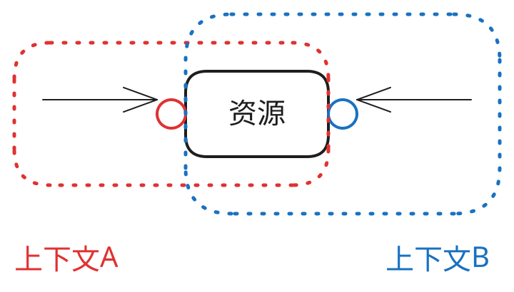

  图 2 上下文与资源句柄

图中中间的资源表示同一个被动资源对象；外围不同虚线框表示不同的 `Context`；资源两侧的圆圈表示面向不同 `Context` 暴露出的资源句柄。它所强调的是：`Flow` 对资源的访问总是经由某个与 `Context` 对应的句柄发生，而不是直接对资源本体发生。

作为规格要求，后续在实现机制上需要落实上述理念：在编译时和/或运行时，应有相应机制保证资源句柄与 `Context` 的匹配关系，从而确保句柄被安全且合理地用于资源访问。当前先将这一点作为明确要求记录下来；至于具体采用何种编译时约束、运行时检查、类型机制或其他实现办法，将在后续补充本规格文档时进一步展开。

## 对象与消息模型

### 对象与消息

当对象逐级建立起来之后，系统运行就不再只是“单条流的推进”，而表现为对象之间的相互作用与协作。

在本规格中，对象以及对象之间的关系应优先基于消息模型进行设计。这种相互作用优先抽象为消息通信。消息并不预设某一种具体实现机制，而是泛指对象之间传递请求、通知、状态变化或协作意图的抽象单元。某个对象通过消息影响其他对象，其他对象再以相应消息或状态变化作出响应，由此形成运行阶段中的协作关系。

在最基本的消息模型中，包含两个角色：

- `sender`：发送消息的一方，负责发起请求、通知或其他消息动作。
- `handler`：接收并处理消息的一方，负责对消息作出响应，并根据情况可能返回一个消息。

在这一模型中，消息本身至少包含以下基本组成：

- 目标对象标识：用于指出该消息所作用的目标对象。
- 消息类型：用于指出该消息属于何种语义类别，以决定应采用何种处理方式。
- 消息内容：用于承载该消息的具体数据、参数或上下文信息。

如果 `handler` 需要返回结果，则其返回内容也可继续被视为消息，从而保持整个对象协作过程在统一消息模型中的闭合性。

在更具体的 `handler` 模型中，`handler` 仍然是抽象模型本身，而不预设为单一的最终处理点。首先，模型并不阻止 `sender` 把消息发给 `handler`；但在 `handler` 一侧，可以通过总开关控制消息是否允许进入。消息在通过总开关后，可进入一层分路器，由分路器根据消息类型将消息派发到不同分路上。每条分路上又各自带有分路开关；消息只有在通过对应分路开关后，才会进入相应的分路处理。

  

图 4 Handler 模型

这一 `handler` 抽象模型并不只对应某一种单独机制，而可用于统一表述内核世界中的多种响应机制。典型地，它可以用于描述中断/异常的响应、进程信号 `signal` 的响应，以及文中所提到的各类被动对象在接收到消息、命令或请求后的响应过程。其中，对于中断/异常这类机制，本文档当前阶段以下均按 `riscv64` 的具体语义来理解和展开，以避免讨论发散。

因此，从本规格的视角看，内核引导阶段的核心任务之一是逐级建立对象，而内核运行阶段的核心特征之一则是对象之间以消息通信方式相互影响和协作。

### 对象的通用状态模型

对于对象，需要建立一个通用的状态模型。该模型既包含状态，也包含推动状态迁移的过程。

在本规格当前约定中，可将对象的通用状态模型描述为：

`base -[discover]-> prepared -[setup]-> ready -[enable]-> online`

其中：

- 箭头方括号中的 `discover`、`setup`、`enable` 表示过程
- 其余各项表示状态

状态可作如下理解：

- `base`：当前对象状态模型的基础状态条件，表示低级对象已经处于 `online`，并成为当前对象建立的基础
- `prepared`：当前对象已被发现并完成初步建立
- `ready`：当前对象已完成必要准备，具备进入运行状态的条件
- `online`：当前对象已被使能，可被上层或其他对象继续使用、依赖或协作

过程可作如下理解：

- `discover`，别名 `detect`、`prepare` 或 `preset`：从低级对象的 `online` 状态出发，发现当前对象、探测其基本信息，或者对对象进入受控初始状态所需的最小条件进行预置，使对象从 `base` 进入 `prepared`
- `setup`，别名 `config`：基于上一阶段收集到的信息，建立对象的内部框架、必要配置与初步组织关系，使对象从 `prepared` 进入 `ready`，但尚未真正启用
- `enable`，别名 `start`：使对象上线，使对象从 `ready` 进入 `online`
- `cleanup`，别名 `teardown`：对对象以及在前序阶段中已经建立的框架、配置、绑定关系和占用资源进行清理与销毁，使对象退出当前建立过程。它不是主建立链上的常规前进过程，而是一种特殊过程；对于 `discover/detect/prepare/preset`、`setup/config`、`enable/start` 中的任一步，在执行完成后都可能因为对象已无继续存在的必要而进入 `cleanup/teardown`，也可能因为执行中途出错、取消或回滚而转入该过程。

对于 `discover` 而言，许多对象在建立之前都需要先获取基础信息。以内核中的实例来说，这些信息可能直接来自 `device tree`、`ACPI` 等前置描述，也可能来自基于这些前置描述进一步建立起来的信息收集器对象。因此，`discover` 的重点并不在于信息一定来自哪一种固定来源，而在于当前对象能够从前置环境或既有低级对象中获得其建立所需的最基本信息。

当这一过程并不只是被动发现信息，而是需要把对象预先调整到一个安全、可继续建立的初始状态时，也可以使用 `prepare` 或 `preset` 来命名同一条状态迁移。二者都强调进入 `prepared` 之前的前置预置动作：`prepare` 更偏向一般准备，`preset` 更偏向把某些关键状态位或寄存器设置为预期初值。例如入口前导期的 `中断流` 对象，关闭中断进入路径的动作就更适合放在这一过程，而不是放到后续 `setup` 中。

对于 `setup` 而言，其核心任务始终是基于上一阶段收集到的信息，把对象建立起来，但尚未真正启用。不同对象在完成这一任务时，可以采用不同模式，而且同一对象的 `setup` 过程也可能同时包含多种模式。典型模式包括：

1. `组装`：基于已经存在的较小、较基础对象，组装形成更大规模、更高层级的对象。这是最常见的模式，本质上是由已有对象建立新的组合关系和整体结构。
2. `转换`：对象的内部语义不变，但其表示形式、组织形式或数据结构发生变化。这类模式强调“形式变化而语义不变”。
3. `立体化（unflatten）`：可视为一种更具体的转换，指将某种扁平、序列化或线性展开的信息，反序列化或展开为更直接、易访问、易操作的对象结构。例如，基于磁盘上存储的文件系统元信息建立起“立体化”的文件系统对象；前后都仍然是文件系统，但对象形式已经从扁平走向立体。
4. `映射`：在两个对象空间之间建立对应关系，使一个对象体系能够通过另一对象体系被访问、解释或组织。例如，`namespace` 中多级名字对象之间可以体现映射关系，虚拟地址空间对象与物理地址空间对象之间也体现映射关系。
5. `抽象`：基于较低层对象建立一个新的、更高层级的抽象对象。它的关键不只是组合、变换或映射，而是形成了新的语义层次。例如，进程依赖于一系列低级对象，但最终形成的是一个新的高级抽象。

对于 `enable/start` 而言，这两个名称虽然对应同一状态迁移，但通常分别侧重两类不同对象：

- `enable` 更侧重被动资源对象。这类对象本身不会主动行动，而是等待命令、请求或访问，并在收到后作出响应。对这类对象而言，`enable` 表示它已经进入可接受命令、可响应请求并对外提供服务的状态。
- `start` 更侧重主动对象。这类对象在 `setup` 完成后，虽然其内部框架与运行条件已经建立，但仍处于停止或静止状态。只有经过 `start`，它们才进入可行动、可推进自身行为并开始发挥作用的状态。例如，进程、线程等对象更适合使用 `start` 来描述这一阶段。

对于非常轻量级的对象，不必为了形式完整而强行拆分出复杂的 `discover`、`setup`、`enable` 过程。它们的主要执行动作通常可以集中放在 `setup` 过程中，其余过程或状态可以是空操作，即 `dummy` 或 `no-op`。这类简化不改变对象仍然服从通用状态模型的事实，只是说明该对象在某些状态或迁移上没有实际工作需要完成。

为避免后续运行期对象建模时混淆，本规格进一步区分 `event` 与 `action`：

- `event` 表示一次尝试推进被建模状态的操作。当前启动模型中的 `preset/setup/enable/cleanup` 是生命周期事件，即 `Lifecycle Event`；后续运行期对象还可以引入操作事件，即 `Operational Event`，例如普通非嵌套自旋锁的 `lock/try_lock/unlock`。
- `action` 表示依附于对象某个既有状态执行的状态内动作。它可以有副作用，也可以失败，但不推进当前被建模状态。例如控制台对象进入 `online` 后执行 `write`，或者 `EarlyIoremap.Ready` 后执行 `map/unmap`，都属于 action。

判断某个操作应建模为 `event` 还是 `action`，核心标准是：它成功时是否推进被建模状态。若成功时推进状态，它应是 `event`；若成功时仍停留在同一被建模状态内，它应是 `action`。

`event` 与 `action` 都应带返回结果，至少区分成功与失败。更完整的结果集合可包含：

- `Success`：操作成功完成。
- `Blocked(reason)`：当前没有提交成功结果，但也不是语义错误，通常表示条件暂未满足。
- `Failed(code)`：操作失败，且可携带具体错误码或原因。

对于 `event`，只有 `Success` 才提交状态迁移，并使目标状态及对应后置事实成立；`Blocked` 或 `Failed` 都不得使对象进入目标状态，也不得假定该事件的 `ensures` 已经成立。对于 `action`，`Success` 表示动作完成，但对象仍停留在动作所属的被建模状态内。

生命周期事件原则上在同一对象生命周期轮次中至多成功触发一次。当前入口启动模型采用先行推进模式，重复触发同一生命周期事件应视为规格错误。操作事件则不同：它们在对象生命周期内可以反复触发，但每次触发都必须符合该对象当前运行状态的迁移规则；反复触发不是重复定义事件。

以普通非嵌套自旋锁为例，`lock` 与 `try_lock` 都应是操作事件，而不是 action，因为它们成功时都会把锁从 `Unlocked` 推进到 `Locked(owner=current)`。`lock` 在锁被别人持有时可以返回 `Blocked(occupied)`，在已经被自己持有时返回 `Failed(nested_lock)`；`try_lock` 在锁被别人持有时返回 `Failed(busy)`，在已经被自己持有时同样返回 `Failed(nested_lock)`。二者可以具有相同的成功源状态和目标状态，但它们是两个不同事件。

后续为具体对象填写某一过程的“初始状态”时，不必重复声明通用状态机已经保证的前置条件。例如，`enable` 必然是 `setup` 的后置过程；只有对象已经到达 `ready`，才允许执行 `enable`。因此，具体对象的 `enable` 初始状态可以只写该对象额外需要检查的条件；如果没有额外条件，也可以写作“无”。

对于 `cleanup/teardown` 而言，它对应的不是对象“向前建立”的语义，而是对象“退出当前建立链”的语义。由于它可能从多个阶段被触发，将其加入主图示会干扰主建立链的阅读，因此本规格对其进行单独文字描述，而不纳入图 5 的主状态链展示。

这里的 `base` 并不表示当前对象自身已经处于某种初始运行状态，而是表示当前对象的建立以低级对象的 `online` 作为基础条件。当当前对象进入 `online` 后，这一状态又可以成为更高一级对象的 `base`。因此，该模型会沿对象层级重复展开，并形成一个连续的逐级建立链。

从这一意义上说，内核并不是一次性完成建立的静态结果，而是不断从低级对象建立高级对象的过程。低级对象进入 `online` 后，会成为更高一级对象的 `base`；更高一级对象完成 `online` 后，又继续成为再上一层对象的基础。由此，内核的建立与运行可被理解为一种沿对象层级不断递进的螺旋上升过程。

当某个对象在通用状态模型中的状态槽位不足以表达其内部建立步骤时，优先考虑把可独立跟踪的部分拆分为子对象，而不是优先引入嵌套子状态或额外的全局状态枚举。也就是说，如果一个管理对象内部实际包含可独立建模、可被其它对象依赖的成员对象，应把这些成员对象显式放入对象树中，由父对象的 `setup` 或其它迁移过程驱动子对象推进。例如 `CPUGroup` 后续可在其下建立 `BootCPU` 子对象和 `logical CPU id -> hartid` 映射对象；CPU 本体状态由 `BootCPU` 跟踪，逻辑映射由映射对象跟踪，`CPUGroup` 只负责组织和驱动这些子对象。嵌套子状态只作为例外机制，用于确实属于同一对象内部且不适合拆成子对象的细粒度状态。

  

图 5 对象的通用状态模型

图中的三层串接表示同一状态模型会沿对象层级不断复用：`Level N-1` 的 `online` 构成 `Level N` 的 `base`，`Level N` 的 `online` 又构成 `Level N+1` 的 `base`。每一层内部按状态链横向展开，层与层之间则按对象层级纵向衔接，从而表达它们是同一逐级建立过程中的连续区段。

### 对象状态机建模原则

在更具体的实现建模中，可以参考 `Zephyr SMF` 一类状态机机制的结构思想，但本规格强调的是借鉴而非照搬。模型的建立必须首先服从本规格自身的对象生命周期语义，而不能被某一现成框架的 API 或调用方式反向约束。

对本规格而言，状态机中的 `entry`、`run`、`exit` 三者应承担不同职责：

- `entry`：负责进入某一状态时的检查与确认，确保对象已经具备该状态所要求的前提。
- `run`：负责状态迁移本身，也就是推动对象从当前状态走向下一状态的核心动作。
- `exit`：负责离开某一状态前的检查与确认，确保该状态应完成的工作已经完成。

在执行语义上，`entry` 与 `exit` 都应被视为单次动作：进入某一状态时，`entry` 只执行一次；离开某一状态时，`exit` 也只执行一次。与之不同，`run` 在对象停留于某一状态期间可以被多次调用；每次调用都只表示一次“单步推进尝试”。

同时，`run()` 本身不应设计为内部阻塞等待。无论本次推进是否成功，它都应立即返回结果，并把是否能够继续推进的判断交给上层逻辑。因此，`run()` 的返回结果当前可统一抽象为以下三类：

- `Progressed`：本次调用成功推进了状态迁移。
- `Blocked`：当前并未出错，但条件尚未满足，因此对象仍停留在原状态。
- `Failed`：本次调用发生错误，无法按正常路径继续推进。

与某些典型状态机框架以持续循环调用 `run_state()` 为中心的运行方式不同，本规格中的对象状态推进更基础、更通用的做法，是为对象提供“单步推进”的基本能力，再由更上层逻辑根据不同场景、阶段和上下文来决定何时调用、如何调用这一单步推进能力。也就是说，状态机本身不必天然表现为一个自循环驱动体；更常见的情况是，上层逻辑按需触发对象向前推进一步。

因此，在本规格后续的设计中，状态机的组织原则可概括为：

1. 借鉴通用状态机结构思想，但不照搬具体框架。
2. `entry / exit` 负责状态边界的检查与确认，`run` 负责迁移推进。
3. 对象应提供单步推进的基本能力，而由更上层逻辑负责按不同阶段、上下文和对象关系进行编排。

### 对象的层次

对象并不只是一层扁平集合。一个对象之下可以继续包含若干 `属性` 和若干 `子对象`。二者的区别主要取决于被持有信息的规模、独立性和生命周期：如果某项信息规模较小、语义上依附于父对象、且不需要独立经历状态迁移，通常更适合作为父对象的属性；如果某项信息规模较大、具有清晰身份和边界、需要单独维护状态或参与对象间关系，则更适合作为子对象。

因此，属性与子对象不是两套互斥的建模体系，而是同一对象分解过程中的两种粒度选择。后续在描述具体对象时，应根据对象持有信息的大小和独立程度，决定将其放入属性表，还是提升为单独的子对象。

在对象层次的讨论中，当前先列出三个处于顶级、即最高抽象级的对象。它们不是彼此从属的普通子对象，而是当前对象体系中最上层的组织对象：

1. `Flows`：流组，即流的集合，用于从整体上组织系统中的各类 Flow。
2. `CPUs`：CPU 组，用于对所有物理 CPU 进行统一管理。
3. `System`：系统对象，即内核本身，表示整个内核作为一个整体对象的存在。

后续对象层次的展开，应首先从 `Flows` 开始，而不是从 `System` 开始。原因在于，`Flow` 是本规格的核心概念；它最初是“虚”的抽象，但在内核启动过程中，会首先为自己逐步建立对象并形成管理，然后才在这些基础之上继续展开更具体的对象体系。

因此，这三个顶级对象虽然并列存在，但在叙述顺序上应优先展开 `Flows`，再继续讨论其他顶级对象及其下级体系。

#### Flows

`Flows` 本身先只作简单描述：它仅仅是一个集合管理对象，用于统一管理多个 Flow。

真正需要重点区分的是 `Flow` 本身与其对应的 `Flow` 对象。二者不是同一事物：

- `Flow` 强调的是实际推进和执行的那一侧
- `Flow` 对象强调的是该 `Flow` 在内核对象体系中的对象化代表、表现与状态记录

从内核自身对象体系的视角看，当内核刚刚启动时，最初只有一个 `Flow`。此时还没有任何由内核自己建立起来的对象，包括该 `Flow` 对应的 `Flow` 对象。这个 `Flow` 是当时唯一主动运行着的东西；随后，它要逐步创建各类各级对象，其中既包括它自己对应的 `Flow` 对象，也包括各种被动资源对象。

在内核启动的后期，这个最初的 `Flow` 还会继续创建新的 `Flow` 以及与之对应的 `Flow` 对象。到这一步，系统就不再是单一 `Flow` 的推进，而会逐步进入多个 `Flow` 并发存在的状态。

当多 CPU 支持即 `SMP` 被启用后，这些 `Flow` 又可能进一步分布到多个 CPU 上并行执行。于是，`Flow` 的展开过程就从“单一 `Flow` 推进对象建立”，过渡到“多个 `Flow` 并发推进”，再过渡到“多个 `Flow` 在多个 CPU 上并行推进”的状态。

每个 `Flow` 与其对应的 `Flow` 对象既相互区分，又彼此统一。可以认为，`Flow` 对象是该 `Flow` 在内核系统中的对象化代表或表现，用于记录其状态；而 `Flow` 本身则是那个实际运行、推进并持续建立对象的执行主体。在需要强调二者区别时，可使用“尚未对象化的 `Flow`”这一解释性说法，但不将其单独作为正式术语。

## 流模型

### 系统层次中的主动与被动对象

内核会为“流”和“资源”这两类抽象概念建立对象模型并进行管理。其中，`Flow` 对应主动对象，`Resource` 对应被动对象。

主动对象强调执行推进、控制权流动以及对象建立过程；被动对象强调被访问、被操作、被命令和被响应的一侧。二者共同构成系统中的动态关系，但承担的是不同角色。

这张图主要强调的是涵盖硬件、内核、用户进程等各个层次的 `Flow` 以及与之对应的主动对象。沿着这条主线，可以看出整个系统中执行流、或者说执行控制权的流动关系。

图中有意省略了多数被动对象，即资源对象，只着重提及了作为被动资源角色的硬件层部分。这样做的目的，是先把系统层次中的主动推进关系凸显出来；至于各层中的被动资源对象，则将在后续对具体层次的讨论中逐步识别和展开。

  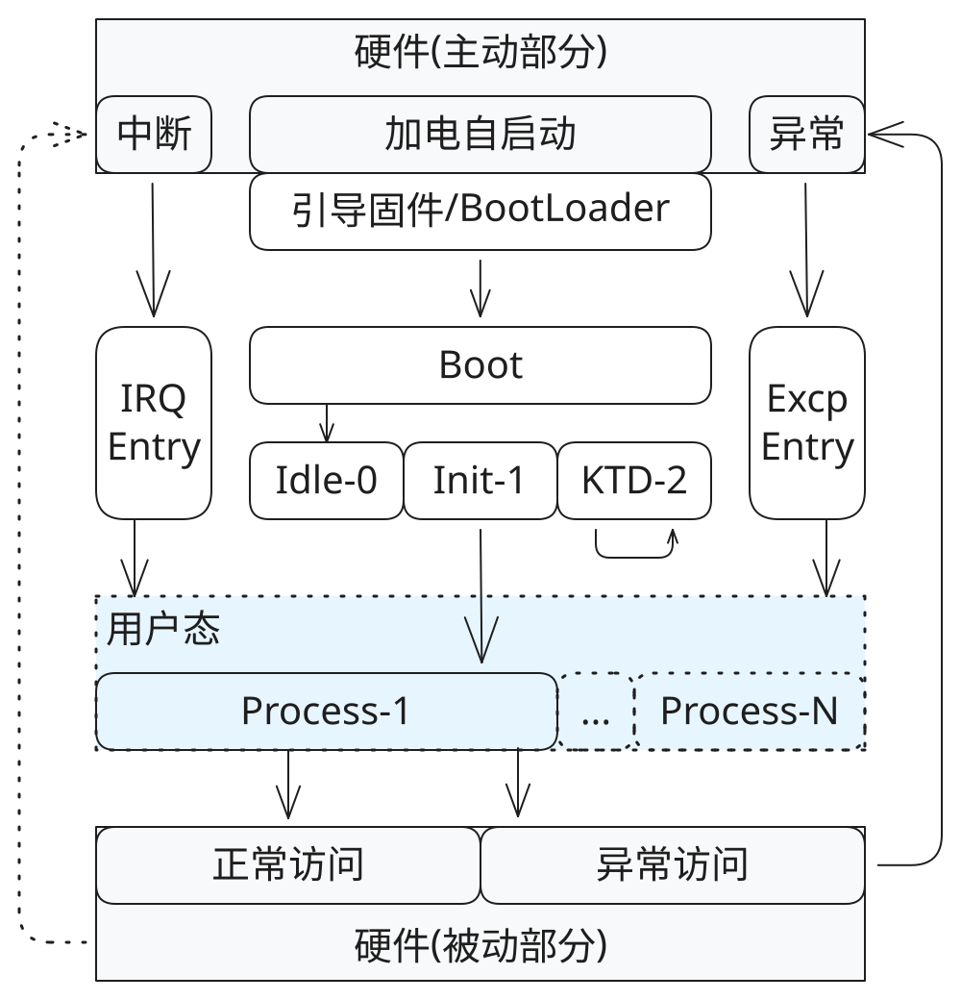

  图 6 系统层次的主动与被动关系

### 流的代表符号

为便于在后续架构图与规格图中统一表达，Flow 允许使用抽象代表符号进行标注。该代表符号表达的是“流”的抽象意义本身，而不是某一特定实现。

  

  图 1 流的代表符号

在本规格当前约定中，用于描述内核领域中流的核心形态的代表符号主要分为两类：

- 常规流符号：由若干首尾相连的曲线箭头构成，用于表示默认情况下不受外界干扰、会持续不停执行下去的执行状态
- 事件流符号：由一条主干线与若干向外导出的箭头构成，用于表示具有多个预留入口点并分别导向不同处理例程的事件分派结构

图中使用三个曲线箭头或三个分支箭头，仅用于表达“多个”这一抽象含义，并不表示数量被固定为三。符号中的形状、数量与连接方式也都具有象征意义，用来抓住流的高层特征，而不是对底层实现结构作逐项摹写。

### 抽象层与实例层的关系

流是高层次的抽象概念，关注的是多个层面上共同存在的本质特征，而不是某一层中的具体对象。

因此，本规格在不同层面使用实例来解释 Flow 时，强调的是“映射关系”或“借例说明”，而不是“相等关系”。例如，在内核层面引入进程、线程、中断、异常向量表与处理例程，是为了帮助理解流在该层的表现形式；这些对象并不等同于流本身，也不穷尽流的全部构成要素。

同一抽象流概念，在硬件层、固件层、引导层、内核层乃至其他软件层面，都可以有不同的承载体、组织方式与实现边界。本规格讨论 Flow 时，默认优先站在抽象层描述其共性；只有在需要落到某一具体层时，才引入该层的实例进行说明。

### 常规流

在本规格当前讨论中，常规流主要用于描述 Flow 在内核领域中的一种核心表现形态。

常规流表示系统在默认条件下持续推进的执行流。

这里的“默认条件”是指未受到外部中断、异常或其他事件流打断的状态。在这种状态下，执行会沿既有路径持续向前推进，不以单次触发为边界，而以连续运行作为基本特征。

在内核层面，可以借由进程或线程所承载的执行状态来理解常规流，但常规流并不等同于某个进程、线程或调度实体本身。常规流并不要求始终由同一个执行体独占 CPU；相反，它可以表现为多个进程或线程在调度作用下不断切换、交替执行，但从抽象层面看，这仍然属于系统的常规执行状态。

因此，常规流强调的不是某个具体执行体，而是“系统存在一条持续前进的主执行流，并可由多个执行体轮换承载”这一事实。

### 事件流

在本规格当前讨论中，事件流主要用于描述 Flow 在内核领域中的一种核心表现形态。

事件流表示由某类事件触发并导向相应处理路径的执行流。

它的核心特征不是连续循环，而是存在一个统一的入口组织结构，并从中分派到若干具体处理路径。在内核层面，可以借由中断异常向量表及其对应处理例程来理解事件流，但事件流并不等同于向量表这一数据结构本身，也不等同于某一组固定的处理函数集合。

在这一映射下：

- 左侧主干线可理解为向量表本身
- 主干线上预留的若干入口点可理解为不同事件对应的入口
- 右侧导出的多个箭头可理解为各个事件的处理例程

这些事件既可以是中断，也可以是异常，或其他由内核统一接管的事件类型。图中多个箭头同样只表示“若干事件处理路径”的含义，而不限定具体数量。

在本规格当前讨论中，事件流又可以进一步区分为中断流与异常流：

- `中断流`：相对于常规流，它是异步的和随机的。所谓异步，是指它并不要求在当前常规流的某个可预先精确指定的位置发生；所谓随机，是指从常规流的视角看，其中断到来的时间点通常不可事先确定。
- `异常流`：相对于常规流，它是同步的和可预期的。所谓同步，是指它与当前执行路径直接相关，通常由当前执行中的某条指令、某次访问或某种检查结果触发；所谓可预期，是指从执行语义上，可以预见在特定条件满足时它会在相应位置出现。

因此，虽然中断流与异常流都归入事件流，但二者并不相同：前者更强调来自执行流之外的异步打断，后者更强调由执行流内部条件直接导出的同步转入。

异常流的典型实例包括 `page fault`、`syscall` 等。这些实例都体现了异常流的共同特征：它们不是在执行流之外随机插入的，而是由当前执行语义在特定位置、特定条件下直接导出的。

前面的讨论，是按照处理方式来分类：在这一角度下，中断流和异常流都可归入事件流。后续讨论中，还会切换到另一个角度来看待这些流的关系。

在后一种角度下，中断流可被视为相对于常规流的独立流，而异常流则可被视为常规流的扩展。这样一来，系统中通常可以简化地理解为存在两种流：

- `中断流`
- `常规流 + 异常流`

为了讨论方便，后者在后文中可简记为 `常规流+`。这里的 `+` 表示该流不仅包含通常意义上的常规执行推进，也包含由执行流内部条件直接导出的异常流扩展。

下面通过一张图，进一步说明这些流之间的切换关系：

  

  图 7 流的切换

图 7 所强调的是：`常规流+` 代表了系统中流的常态。系统通常从 `常规流+` 出发，通过中断开关控制能否切换到中断流；而一旦进入中断流，在处理完成后，它又会自动返回到原来的 `常规流+`。

`常规流+` 本身并不要求始终只由一条单独流构成。它可以由一到多个相对独立的流组成，在系统中通常表现为多任务。它们之间可以发生切换，而这种切换至少包括两类：

- 主动切换：由流自身的逻辑控制和发起，因此在语义上可被该流主动安排。
- 被动切换：即抢占。虽然抢占点的位置通常可以被确切知道，但某一抢占点是否真正发生抢占，还会受到诸多外部条件影响，因此从具体发生性上看很难完全准确预测。图中着重强调的正是这一点。

此外，任务切换不仅意味着在同一 CPU 上的执行交替，也意味着存在跨 CPU 迁移的可能性。因此，图中除常规流内部的切换关系之外，还额外强调了流在 CPU 之间迁移这一情况。

### 常规流与事件流的切换

流并不是静止地只属于某一种类型，而是在常规流与事件流之间不断切换。

在内核层面，这种切换可被观察为：系统通常处于常规流所代表的持续执行状态；当中断、异常或其他事件到来时，执行转入事件流，由对应入口和处理例程接管；当事件处理完成后，执行再返回常规流继续推进。

因此，常规流与事件流不是彼此孤立的两套系统，而是同一整体执行流在不同条件下的两种基本表现形式。上述切换关系是 Flow 在内核层面的一种具体体现，而不是对 Flow 全部适用场景的穷尽定义。组件化内核后续对上下文、调度、异常、同步与扩展点的描述，都应建立在这种切换关系之上。

## 启动与实体化

### 核心立场

从本规格的视角看，启动并不是单纯的“把控制权交给内核”，而是一个从硬件到软件逐级建立对象的过程。

在这一过程中，一方面，抽象的 Flow 在不同层级上逐步获得具体承载形式并完成实体化；另一方面，Flow 所依赖和作用的资源也被逐步建立为各层可以识别和管理的资源对象。内核接手的并不是一片空白，而是一个已经被前置环境部分建立、部分约束、部分定义的对象基础。

如果换成对象视角来描述，这一过程同样可以理解为：系统不断建立出新的对象类型、状态边界和相互关系，使后续层级能够在既有对象基础上继续组织更高层的 Flow 与协作结构。

因此，内核本身也可以被理解为一个不断从低级对象建立高级对象的螺旋上升过程，而不是一个仅在启动时线性展开、完成后便静止不变的结构。

### Flow 的实体化

Flow 是一种高阶抽象。它不是天然已经完成的具体对象，而需要在系统启动过程中逐级实体化。

所谓实体化，是指某一抽象概念在特定层级获得了承载形式、入口关系、状态边界与可操作条件，并因此从“可被描述的抽象”转变为“可被该层执行、切换、观测和约束的对象”。

从本规格的视角看，启动过程不仅是控制权的传递链，也是 Flow 的实体化链。抽象的 Flow 会在从硬件到软件的逐级建立过程中，依次获得不同层次的承载体与组织方式，并最终在内核领域中形成可直接组织和操作的执行流。

### 资源对象的逐级建立

Flow 的实体化并不是孤立发生的。与之同步发生的，还有对象的逐级建立，其中既包括 Flow 对象的建立，也包括资源对象的建立。

一类对象用于表述和跟踪 Flow 自身的状态，使得 Flow 在某一层级中不再只是抽象描述，而是具有了可记录、可切换、可恢复和可管理的状态承载体。另一类对象则用于承载 Flow 所要作用的各类客体资源，使这些资源能够在该层中被识别、命名、分界、类型化并纳入管理。

因此，系统并不是先有一套完备对象再有流，也不是先有流再凭空生成对象；更准确地说，Flow 与对象是在从硬件到软件的逐级建立过程中相互制约、共同成形的。

### 逐级建立过程

从粗略层次上看，这一过程可以理解为以下连续阶段：

1. 硬件阶段：系统加电，时钟建立，CPU 获得持续执行能力，最初的物理资源与边界随之出现。
2. 固件阶段：固件在硬件能力基础上完成最初的初始化、探测与组织，使系统具备继续启动的软件条件。
3. 引导阶段：引导程序进一步准备内核映像、入口上下文与控制权移交条件，使内核能够接管执行。
4. 内核早期阶段：内核在前置环境基础上继续建立自身领域中的执行对象、资源对象与控制关系，并逐步进入稳定运行状态。

上述阶段之间并不是相互割裂的模块边界，而是同一条实体化链上的不同区段。每一阶段都既承接前一阶段已经建立的对象条件，又为后一阶段继续建立更高层对象提供基础。

### 阶段划分与上下文

从这一节开始，讨论将不再仅停留于概念层，而会逐步进入设计层，开始分析各阶段中对象如何被建立、Flow 如何推进，以及不同 `Context` 如何约束资源访问。

在讨论各个阶段之前，还需要先补充说明一个资源访问原则。为了避免并发冲突，对资源的访问原则可概括为：`独占写` 与 `共享读`。

- `独占写`：在同一时刻，只能存在一个写者。在其写期间，禁止其他写者和读者访问该资源。
- `共享读`：在没有写请求的情况下，同时允许任意多个读者共享访问该资源。

后续对不同阶段中 `Context` 的讨论，将以这一原则作为资源访问约束的基本参照。

在进入这些运行阶段之前，还需要单独保留一个前置阶段，用于描述内核真正开始执行之前已经形成的基础对象。该阶段称为 `第零阶段：准备期`，英文名 `Prepare Phase`。

`准备期` 并不是内核运行期的一部分，它更接近内核的“史前阶段”：在内核第一条执行流真正开始之前，体系结构约定、链接脚本、编译配置、静态对象和物理资源布局已经共同准备出了一组前置对象。当前先将该阶段末尾为内核启动准备的基础对象列为：

1. `RISCV64`：当前文档所讨论的具体体系结构对象，属于 `ISA` 类对象，用于描述当前内核所依赖的指令集、寄存器、特权级和相关架构约束。
2. `LDS`：链接脚本对象，用于描述内核映像的段布局、关键符号和地址边界。
3. `静态对象集合`：由构建、链接和静态初始化过程提前准备好的内核静态对象集合。
4. `Config`：构建配置对象，用于描述编译期配置、特性开关和影响内核早期路径的静态约束。
5. `物理内存空间`：由硬件/平台设计与生产阶段固化的物理内存和设备 `I/O` 地址资源布局。

这些对象的详细状态、来源和边界检查后续补充。当前先保留该阶段，以便后续说明入口前导期对象建立时依赖哪些更早已经存在的前置条件。

当前先将内核启动到常规运行划分为以下四个运行阶段：

1. 从引导入口到中断启用之前，称为 `引导期`，英文名 `Boot Phase`。
2. 从中断启用到多任务启动之前，称为 `中断期`，英文名 `Interrupt Phase`。
3. 从多任务启动到多核即 `SMP` 启动之前，称为 `单核多任务期`，英文名 `UP Multitask Phase`。
4. 多核即 `SMP` 启动之后的常规运行状态，称为 `多核运行期`，英文名 `SMP Runtime Phase`。

这四个阶段之所以重要，不仅因为它们描述了内核的启动推进顺序，更因为它们直接决定了 `Flow` 所处的 `Context` 以及资源访问所受的环境约束。

从执行语义看，内核启动由概念上的 `根流` 推进。该根流在启动最初表现为对 `StartupTimeline` 的推进；`StartupTimeline` 是形式化推导中的临时启动时间轴对象，用于串接准备期、引导期以及后续启动阶段。

入口前导期中建立的 `根流` 对象，是这个概念根流在内核对象体系中的一个具体承载，只表达当前阶段需要落地的执行语义。因此，形式化模型中的阶段对象不必以 `根流` 对象为父对象；阶段对象可以挂在启动时间轴或上级阶段对象下，并在阶段完成后退出。

阶段对象不是普通数据对象的简单容器，也不只是一个顺序控制器。它至少承载三类信息：当前阶段的初始化逻辑、当前阶段的默认上下文，以及当前阶段与前后阶段之间的边界。阶段对象之间首尾相接：一个阶段对象结束，也就意味着下一个阶段对象开始。每个阶段对象都可以定义自己的默认上下文，用于描述该阶段中普通对象建立和资源访问所处的背景条件。

  

  图 3 内核上下文相关阶段划分

图中的 `准备期` 发生在引导入口之前。它被画为虚线框，是为了强调本规格在这里并不把它作为内核运行阶段来展开；当前只关心它为内核启动提供了哪些基础对象，例如 `RISCV64`、`LDS`、`静态对象集合`、`Config` 与 `物理内存空间`，不关心该阶段内部包含多少执行流，也不讨论该阶段的上下文情况。

#### 第一阶段：引导期（Boot Phase）

对于 `引导期` 而言，系统中只有唯一的一个 `常规流+`。它独占整个系统，对系统中所有资源的读和写在当前阶段都没有任何并发意义上的限制，也不存在任何并发冲突。

因此，可将这一阶段的环境上下文命名为：`系统独占`，英文名 `System Exclusive`。

#### 第二阶段：中断期（Interrupt Phase）

对于 `中断期` 而言，系统中可以交替存在两个流：`常规流+` 和 `中断流`。需要注意的是，此时还不存在并行，但由于这种交替具有随机性，因此在资源访问上已经可能出现并发冲突。

先看 `中断流`。它的运行级别天然高于 `常规流+`：一旦进入中断流，它会一直执行直至完成，而不会再被当前阶段的 `常规流+` 打断；相反，`常规流+` 却可能随时被中断流打断，也可以说其执行权会被抢占。

因此，从资源访问的角度看，中断流本身在这一阶段总是处于 `系统独占` 这一上下文中。

对于 `常规流+` 而言，则会在两个上下文之间切换：

1. `可中断上下文`，英文名 `Interruptible Context`：可中断，但没有抢占切换。也就是说，它保持了通向中断流的路径开放，因此可能随时被中断流打断；而由于当前阶段中只有一个 `常规流+`，所以天然保证了不存在多个 `常规流+` 之间的抢占切换。
2. `系统独占上下文`，英文名 `System Exclusive`：通过关闭中断，确保自己处于系统独占状态；等到自己认为时机适当时，再重新打开中断并返回 `可中断上下文`。

#### 第三阶段：单核多任务期（UP Multitask Phase）

对于 `单核多任务期` 而言，中断流的情况与上一阶段相同，因此这里先只讨论 `常规流+`。

在这一阶段中，系统里会有三个 `常规流+`：

1. `IDLE`：它是前面阶段中那个唯一 `常规流+` 的延续。
2. `INIT`：新的 `常规流+`。它后续要依次完成两个任务：首先完成系统的早期初始化并启动多核；然后在多核已经启动的情况下，切换到用户态去执行第一个用户应用。需要特别注意的是，启动多核这个节点正是当前阶段与下一个阶段之间的分水岭。
3. `KTHREADD`：新的 `常规流+`。它作为守护任务，负责接收创建新内核任务的请求，并创建这些新的内核任务。

与上一阶段相比，这一阶段中的 `常规流+` 多了一个切换方向：除了面向中断流的切换之外，还存在多个 `常规流+` 之间的切换。因此，`常规流+` 在这一阶段可以在四种上下文之间切换：

1. `可中断上下文`，英文名 `Interruptible Context`：可中断，但没有抢占切换。即保持通向中断流的路径开放，但封闭通向其他 `常规流+` 的抢占切换路径。
2. `可抢占上下文`，英文名 `Preemptible Context`：可发生抢占切换，但此时封闭了通向中断流的路径。即可能被动地切换到其他 `常规流+`，因此存在并发冲突风险。
3. `既可中断又可抢占上下文`，英文名 `Interruptible and Preemptible Context`：同时开放通向中断流和其他 `常规流+` 的路径，因此在这两种方向上都不受限制。
4. `系统独占上下文`，英文名 `System Exclusive`：同时封闭中断和抢占两条路径。也就是说，此时既不会被切换到中断流，也不会被切换到其他 `常规流+`。

在继续讨论下一阶段之前，还需要先说明 `Context` 模型的选择。对于本规格而言，上下文的分类将采用平坦模型，也就是说，对外讨论时始终把上下文视为若干清晰、平级的结果状态，而不把不同上下文关系表述为相互重叠和嵌套的层次结构。

但在实现上，这并不意味着只能靠一个单纯的平坦标签完成全部机制。后续在具体实现中，仍然可以引入必要的辅助状态，用于支撑这些平坦上下文的进入、退出与恢复，例如与锁持有状态、中断开关状态、抢占开关状态相关的辅助信息。换言之，规格上的分类是平坦的，而实现上的内部支撑机制可以利用辅助状态来保证这种平坦分类能够被正确维护。

进一步地，在实现层面，部分上下文切换还可能需要借助栈式结构来维护。其原因在于，这类切换通常具有明确的进入前状态、进入后受限状态以及退出后恢复原状态的语义，因此天然适合以后进先出的方式记录和恢复相关辅助信息。但并非所有上下文切换都必须采用栈式实现；对于不具有严格恢复前态语义的切换，仍然可以采用其他实现方式。

#### 第四阶段：多核运行期（SMP Runtime Phase）

对于 `多核运行期` 而言，首先需要说明的是：一旦系统启动了多核，就出现了真正的并行。

在这一阶段中，`系统独占上下文` 事实上已经不存在了。我们不可能再实现一个让整个系统重新回到串行状态的全局锁，否则多核本身就失去了意义。取而代之的是 `锁上下文`。锁是一种特殊的资源，在同一时刻只允许一个 CPU/核占用它；借助锁，可以对一个或多个资源的操作进行互斥保护。

因此，在这一阶段中，需要把上下文理解为由三条维度共同决定：

- 是否持有锁
- 是否允许中断
- 是否允许抢占

其中，`持锁 + 不可中断 + 不可抢占` 这一组合，表示对具体资源形成了类似于前述 `系统独占` 的独占状态，只是独占的粒度已经从“整个系统”缩小到了“被该锁所保护的具体资源”。因此，它可被理解为一种 `资源独占` 语义。

据此，可严格得到以下八种上下文情况：

1. `持锁、不可中断、不可抢占上下文`，英文名 `Locked Non-interruptible and Non-preemptible Context`：持有锁，同时封闭中断与抢占两条路径。此时，当前执行在系统全局范围内独占特定的锁资源，并进一步经由该锁建立起对一个或一组资源进行操作的临界区；这里的独占已不再是对整个系统的独占，而是对锁所保护资源集合的独占。
2. `持锁、不可中断、可抢占上下文`，英文名 `Locked Preemptible Context (No Interrupt)`：持有锁，封闭中断路径，但允许抢占切换。这种情况并不常见，因为一旦允许抢占，就意味着持锁执行体可能在尚未退出临界区时失去执行权，从而带来额外的并发冲突风险、调度延迟和等待关系复杂性。因此，在设计上通常会尽量避免进入这种上下文，除非确有明确必要且其风险已被控制。
3. `持锁、可中断、不可抢占上下文`，英文名 `Locked Interruptible Context (No Preemption)`：持有锁，开放中断路径，但封闭抢占路径。这属于高风险上下文。由于中断流具有异步和随机进入的特征，一旦其可触及当前锁或相关资源，就可能带来比抢占更高的冲突风险。因此，对可能与中断流共享的锁资源，应默认禁止进入该上下文；只有在资源已被明确证明不会被中断流访问时，才可作为受限例外。
4. `持锁、可中断、可抢占上下文`，英文名 `Locked, Interruptible and Preemptible Context`：持有锁，同时开放中断与抢占两条路径。这同样属于受限制使用的上下文。因为一旦在持锁期间同时允许中断和抢占，就意味着当前执行不仅可能被其他 `常规流+` 切走，也可能被中断流异步打断，从而叠加了两类冲突来源。因此，这种上下文通常应被谨慎对待；只有在锁保护对象与中断流不存在共享关系、并且相关等待链与调度影响都已被确认可控时，才可作为受限情形使用。
5. `无锁、不可中断、不可抢占上下文`，英文名 `Non-interruptible and Non-preemptible Context`：不持锁，同时封闭中断与抢占两条路径。这是典型的无锁原子上下文。它使当前流能够在本 CPU 上不被中断、也不被抢占地完整完成某个原子性事务。但需要注意，这种原子性首先是相对于当前 CPU 而言的；如果相关资源仍可能被其他 CPU 并行访问，则仅靠这一上下文本身并不能形成全系统范围的原子保护，仍需进一步借助锁或其他跨 CPU 同步机制。
6. `无锁、不可中断、可抢占上下文`，英文名 `Preemptible Context (No Interrupt)`：不持锁，封闭中断路径，但允许抢占切换。这在语义上就是单纯关中断，即仅仅封闭通向中断流的路径，而不额外封闭通向其他 `常规流+` 的抢占切换路径。
7. `无锁、可中断、不可抢占上下文`，英文名 `Interruptible Context (No Preemption)`：不持锁，开放中断路径，但封闭抢占路径。这在语义上就是单纯关抢占，即仅仅封闭通向其他 `常规流+` 的抢占切换路径，而不额外封闭通向中断流的路径。
8. `无锁、可中断、可抢占上下文`，英文名 `Interruptible and Preemptible Context`：不持锁，同时开放中断与抢占两条路径。这是最宽松、限制最少的上下文，属于内核设计中最希望达到的常规状态，因为在这一状态下，内核的并发性与并行性都能够得到最大程度的发挥。其他上下文通常都只应在确有必要时才被采用。

从更一般的角度看，每一个阶段实际上都可以识别出一个“相对最宽松”的上下文。为便于讨论，可将这种相对于当前阶段而言最宽松的上下文统称为：`自由上下文`，英文名 `Free Context`。在当前的 `多核运行期` 中，这一名称对应的就是第 8 种 `无锁、可中断、可抢占上下文`。

为便于从整体上把握这些上下文之间的关系，可先给出一个跨阶段的上下文总表。该表中的“通用意义”给出上下文在抽象层面的统一解释；“阶段特化”则说明同一上下文在不同阶段中的具体含义或出现方式。

| 上下文名 | 通用意义 | 引导期特化 | 中断期特化 | 单核多任务期特化 | 多核运行期特化 |
| --- | --- | --- | --- | --- | --- |
| `系统独占` | 封闭全部切换路径，形成系统级独占 | 当前阶段唯一 `常规流+` 的天然状态 | 中断流总是处于该状态；`常规流+` 可通过关中断进入 | 中断流仍总是处于该状态；`常规流+` 可通过同时封闭中断与抢占进入 | 不再存在，由资源粒度的锁保护独占替代 |
| `可中断上下文` | 开放中断路径，封闭抢占路径 | 不适用 | 由于只有一个 `常规流+`，天然表现为可中断但无抢占切换 | 成为明确的“可中断、无抢占”上下文 | 对应第 7 种 `无锁、可中断、不可抢占上下文` |
| `可抢占上下文` | 开放抢占路径，封闭中断路径 | 不适用 | 不适用 | 成为明确的“可抢占、无中断”上下文 | 对应第 6 种 `无锁、不可中断、可抢占上下文` |
| `既可中断又可抢占上下文` | 同时开放中断与抢占路径 | 不适用 | 不适用 | 成为该阶段最宽松的 `常规流+` 上下文 | 对应第 8 种 `无锁、可中断、可抢占上下文`，也是该阶段的 `自由上下文` |
| `持锁、不可中断、不可抢占上下文` | 资源粒度的独占临界区 | 不适用 | 不适用 | 不适用 | 第 1 种情况，对锁保护资源形成独占 |
| `持锁、不可中断、可抢占上下文` | 持锁但允许抢占，封闭中断 | 不适用 | 不适用 | 不适用 | 第 2 种情况，不常见，设计上通常尽量避免 |
| `持锁、可中断、不可抢占上下文` | 持锁但允许中断，封闭抢占 | 不适用 | 不适用 | 不适用 | 第 3 种情况，高风险，对可能与中断流共享的锁资源默认禁止 |
| `持锁、可中断、可抢占上下文` | 持锁且同时开放中断与抢占 | 不适用 | 不适用 | 不适用 | 第 4 种情况，受限制使用，需确认中断共享关系与等待链可控 |
| `无锁、不可中断、不可抢占上下文` | 无锁原子上下文 | 不适用 | 不适用 | 不适用 | 第 5 种情况，提供相对当前 CPU 的原子执行语义 |

### 准备期的对象

`准备期` 发生在引导入口之前，因此本节不讨论它内部的执行流、上下文切换或资源访问状态。这里关心的是：当内核真正进入 `引导期` 时，已经有哪些基础对象可以被后续对象建立过程依赖。

在正式建模中，准备期对象是入口前导期推导验证的起点，而不是入口前导期内部需要建立的对象。它们在本推导开始时均视为已经处于 `online` 状态，其属性均可被后续对象过程访问；这些对象在 `online` 之前的状态链和过程链不在本规格当前范围内展开，相关过程可视为空过程或无意义过程。

其中，`LDS`、`Config` 与 `静态对象集合` 分别对应三类内核开发中的预先设定：`LDS` 对应内核映像链接布局，`Config` 对应内核参数与构建配置，`静态对象集合` 对应以内核静态方式预先定义的数据结构和静态存储。它们不是入口前导期运行时构建出来的对象，而是在构建、链接和静态初始化过程中已经形成的推导输入。

当前先识别出以下五类基础对象：

1. `RISCV64`

   `RISCV64` 是当前文档所讨论的具体体系结构对象，属于 `ISA` 类对象。它用于提供当前体系结构的基础知识，包括指令集、通用寄存器、控制状态寄存器、特权级、异常和中断入口约定等。`RISCV64` 的对象构成、属性类型和值域由 `RISC-V` 体系结构规范约束，本规格只引用入口前导期推导所需的属性，不重新定义完整体系结构。入口前导期对 `a0`、`a1`、`sp`、`tp`、`gp`、`sstatus`、`sie`、`sip`、`stvec`、`sscratch` 等寄存器的理解，均依赖该对象提供的语义。后续如果扩展到其他体系结构，可在同一 `ISA` 类下补充 `X86_64` 等对象。

   | 属性 | 作用 | 初始值 |
   | --- | --- | --- |
   | `a0` | 内核入口参数寄存器，用于承载当前启动 hart 的物理标识。 | `hart_id` |
   | `a1` | 内核入口参数寄存器，用于承载设备树物理地址。 | `dtb_pa` |
   | `sp` | 栈指针寄存器，用于指向当前执行流使用的栈位置。 |  |
   | `tp` | 线程指针寄存器，在入口前导期用于指向当前根任务对象。 |  |
   | `gp` | 全局指针寄存器，用于支持 `.sdata` 与 `.sbss` 等小数据段的 `gp` 相对寻址。 |  |
   | `sstatus` | 监管者状态寄存器，用于控制内核态下的状态位，例如 `FPU` 与 `VECTOR` 相关状态。 |  |
   | `sie` | 监管者中断使能寄存器，用于控制各类中断是否允许进入。 |  |
   | `sip` | 监管者中断挂起寄存器，用于表示各类中断挂起状态。 |  |
   | `stvec` | 监管者陷入向量寄存器，用于保存中断和异常入口地址。 |  |
   | `sscratch` | 监管者陷入暂存寄存器，用于在中断或异常入口分叉前辅助保存和识别陷入上下文。 |  |
   | `satp` | 监管者地址转换与保护寄存器，用于选择当前地址空间和页表根。 |  |

2. `LDS`

   `LDS` 是链接脚本对象，对应内核映像链接布局，用于提供内核映像的段布局、关键符号和地址边界。例如 `__global_pointer$`、入口 `_start`、`BSS` 段边界、静态根栈范围等信息，都应从该对象提供的链接结果中取得或解释。`LDS` 由本规格按入口前导期推导需要给出约束，但不展开到具体链接脚本的全部实现细节。

   入口布局有两条硬约束：`__global_pointer$` 必须作为 `gp` 初始化的直接符号来源；`_start` 必须等于内核 text 起点和 ELF entry，确保固件跳入的第一条内核指令就是入口代码，而不是链接布局中的后置符号。

   入口前导期还必须遵守分段访问纪律。链接布局应能识别一段集中放置在内核映像起始处的入口 head text 区域，用于承载 MMU 关闭阶段和 trampoline 临时映射阶段必须执行的代码。该要求类似 Linux RISC-V64 通过 `__HEAD` 将 `head.S` 放入 `.head.text`，再由链接脚本把 `HEAD_TEXT_SECTION` 放在 `_start` 之后；但本规格不强制使用相同宏名或段名，只要求形成等价的布局和访问约束。

   入口前导期的地址访问分为三段：

   1. MMU 关闭阶段：代码和早期函数必须使用 PC-relative 或等价 position-independent 方式访问内核符号，不得依赖尚未建立的虚拟地址访问普通 `.data/.bss/.init.data`。若该阶段调用高级语言函数，相关函数也必须满足无绝对寻址、无不受控 instrumentation 的约束。
   2. trampoline 临时映射阶段：代码必须位于 trampoline 映射覆盖范围内，并且不得访问普通 `.data/.bss/.init.data`；该阶段只允许依赖寄存器、CSR、立即数以及已确认映射的 head/trampoline 代码，目标是尽快切换到 EarlyVM。
   3. EarlyVM 阶段：`EarlyVM.setup/enable` 已经映射整个 `KernelImage` 后，普通 `.data/.bss/.init.data` 才可以按早期虚拟地址访问；此时还应重新建立 `gp` 相对寻址的有效性。

   | 属性 | 作用 | 初始值 |
   | --- | --- | --- |
   | `__global_pointer$` | `gp` 寄存器初始化所依赖的链接符号。 |  |
   | `_start` / text 起点 / ELF entry | 内核入口与 text 起点，三者必须一致。 |  |
   | `head_text_range` | 入口前导期早期代码集中放置范围。 |  |
   | `pre_mmu_text_range` | MMU 关闭阶段允许执行且必须满足 PC-relative 访问纪律的代码范围。 |  |
   | `trampoline_safe_text_range` | trampoline 临时映射阶段允许执行且不得访问普通数据段的代码范围。 |  |
   | `BSS` 段开始地址 | 用于确定需要清零的 `BSS` 段起始边界。 |  |
   | `BSS` 段结束地址 | 用于确定需要清零的 `BSS` 段结束边界。 |  |
   | `init_stack_start` | 用于描述静态根栈的起始地址，供入口前导期初始化 `sp` 使用。 |  |
   | `init_stack_end` | 用于描述静态根栈的结束地址，供入口前导期初始化 `sp` 使用。 |  |

3. `静态对象集合`

   `静态对象集合` 对应以内核静态方式预先定义的数据结构和静态存储，用于描述在内核映像中已经静态分配、并在入口前导期之前就具备稳定身份的对象。这些对象不是入口前导期动态创建出来的，而是由构建、链接和静态初始化过程提前准备好；入口前导期只是取得它们的地址并把它们纳入运行中的对象关系。本规格只定义入口前导期推导必须依赖的静态对象和静态存储，不深入约束其完整实现布局。

   | 成员 | 类型 | 作用 | 初始值 |
   | --- | --- | --- | --- |
   | `init_task` | 子对象 | 静态根任务结构体实例，用于作为入口前导期根任务对象的底层承载。 |  |
   | `trampoline_pg_dir` | 属性 | 静态分配的跳板页表存储，作为 `TrampolineVM` 的底层承载。 |  |
   | `early_pg_dir` | 属性 | 静态分配的早期页表存储，作为 `EarlyVM` 的底层承载。 |  |
   | `swapper_pg_dir` | 属性 | 静态分配的完整内核页表存储，作为后续 `SwapperVM` 的底层承载。 |  |

4. `Config`

   `Config` 是内核参数与构建配置对象，用于提供编译期配置、特性开关和影响早期路径的静态约束。例如页大小、页表映射粒度、内核映像虚拟地址窗口、栈布局约束等，均可由该对象提供约束。`Config` 由本规格自行定义其对入口前导期可见的属性边界；未被当前推导使用的构建配置不在本节展开。

   | 属性 | 作用 | 初始值 |
   | --- | --- | --- |
   | 页大小 | 用于检查静态根栈边界是否页对齐，并约束早期页表和内存映射粒度。 |  |
   | `PT_SIZE_ON_STACK` | 用于计算根栈初始化时 `sp` 应保留的陷入帧或上下文保存区域大小。 |  |

5. `物理内存空间`

   `物理内存空间` 是物理层面的内存与设备 `I/O` 地址资源布局对象。它来自硬件/平台设计与生产阶段的固化事实，而不是入口前导期运行时建立出来的对象。入口前导期可以读取它来验证原始 `dtb` 物理地址等状态点是否落在合法物理资源范围内，但不能修改它。后续解析 `dtb`、建立 `memblock` 或管理可分配物理页，属于更高层次对象，不能与本对象混为一谈。

   | 属性 | 作用 | 初始值 |
   | --- | --- | --- |
   | `ram` | 物理 RAM 地址范围集合。 |  |
   | `iomap` | 设备 `I/O` 地址范围集合。 |  |

这些对象不是入口前导期新建的对象，而是入口前导期对象建立时已经存在的前置基础。后续在细化入口前导期对象的初始状态检查、执行动作和结束状态检查时，应显式说明哪些检查或动作依赖这些准备期对象。

### 引导期对象建立

从这一小节开始，讨论将从阶段与上下文的划分，进一步落实到对象建立本身。`引导期` 还需要继续划分为若干子阶段。

#### 子阶段 1：入口前导期（Entry Prelude Subphase）

第一个子阶段，对应于 `Linux` 中从内核入口到 `init/main.c` 的 `start_kernel()` 入口之前的最初阶段。

这一阶段在 `Linux` 实现中通常以汇编为主，但本规格对它的建模并不以是否使用汇编语言为边界。这里真正重要的，不是实现代码采用何种语言，而是该阶段承担的职责：在最初的唯一 `Flow` 推进下，建立进入后续内核主体初始化所需的最基本执行条件，并把控制权稳定导向 `start_kernel()` 这一更高层初始化入口。

在这一阶段以及后续各阶段中，对象的建立过程原则上都应遵循前文给出的对象通用状态模型。但也需要允许一种简化情况：某些对象本身足够简单，并不需要完整经历全部状态或全部转换过程。对于这类对象，不需要的状态或过程可被视为 `dummy` 或 `no-op`，从而在保持整体模型统一的同时，避免为了形式一致而引入不必要的复杂度。

在当前子阶段中，更合适的讨论顺序，不是先枚举对象内部细节，而是先识别这一子阶段需要建立哪些对象。至于每个对象在当前子阶段中的具体建立过程、初始状态检查与结束状态检查，可在对象集合稳定后再继续细化。

当前先回答以下问题：

1. 当前子阶段需要建立哪些对象。
2. 这些对象分别承担什么基本语义。
3. 每个对象的初始状态检查与结束状态检查后续应如何补充。

需要注意的是，`System Exclusive` 仍是当前子阶段的环境前提，但这里先不把它视为当前子阶段新建立的对象；它首先是这一本子阶段中其他对象得以建立的背景条件。

据此，当前可先识别出十一类本子阶段涉及的核心对象。这里统一采用“中文名 + 英文名”的命名方式；对于约定俗成的工程对象，也可直接使用英文名。需要注意，`物理内存空间` 属于准备期输入对象，不是入口前导期新建立的对象；它在本子阶段中作为只读资源布局被读取和验证。

1. `根流`，英文名 `Root Stream`：内核引导过程中最早出现的执行流对象，表示当前唯一 `常规流+` 的 `Flow`，用于把前置环境交接下来的唯一执行流显式纳入内核对象体系，并作为后续常规流建立与早期初始化推进的根源流。
2. `根任务`，英文名 `InitTask`：后续建立的流对象父对象，是 `根流` 在内核领域内的具体化对象，后续将主要用于跟踪这一早期执行实体。
3. `根栈`，英文名 `InitStack`：`根任务` 的对应栈，作为 `根任务` 的子对象。
4. `中断流`，英文名 `Interrupt Stream`：当前阶段的中断控制对象。在本子阶段，它还不是一个对外开放、可承担真实处理中断职责的运行流，而首先用于封闭中断进入路径，确保入口前导期在受控条件下继续执行。
5. `事件流`，英文名 `Event Stream`：`中断流` 的下级子对象，维护中断/异常入口表以及中断和异常分叉前的公共流程。
6. `内核映像`，英文名 `Kernel Image`：代表内核映像本身，主要维护其各个 `segment` 的信息与状态。
7. `物理内存空间`，英文名 `Physical Memory Space`，简称 `PM`：准备期输入对象，对物理层面的内存与设备 `I/O` 地址资源布局的抽象。它由硬件/平台设计与生产阶段固化，入口前导期只读取它提供的资源布局约束，不建立或修改它。
8. `虚拟内存空间`，英文名 `VM`：代表内核虚拟内存空间的抽象；入口前导期只建立和使用其中的早期部分。它包含 `跳板虚拟内存空间`（`TrampolineVM`）、`早期虚拟内存空间`（`EarlyVM`）与 `交换虚拟内存空间`（`SwapperVM`）三个页表子对象。
9. `处理器管理`，英文名 `CPUGroup`：`片上系统` 的下级子对象，负责管理所有 `CPU` 的信息与状态，包括物理 `ID` 与逻辑 `ID` 映射等。
10. `片上系统`，英文名 `SoC`：片上系统平台的抽象。
11. `入口前导期对象`：属于阶段对象，是 `引导期` 的子阶段对象，用于承载入口前导期的初始化逻辑、默认上下文和阶段边界，并在该子阶段内编排其他对象过程。

  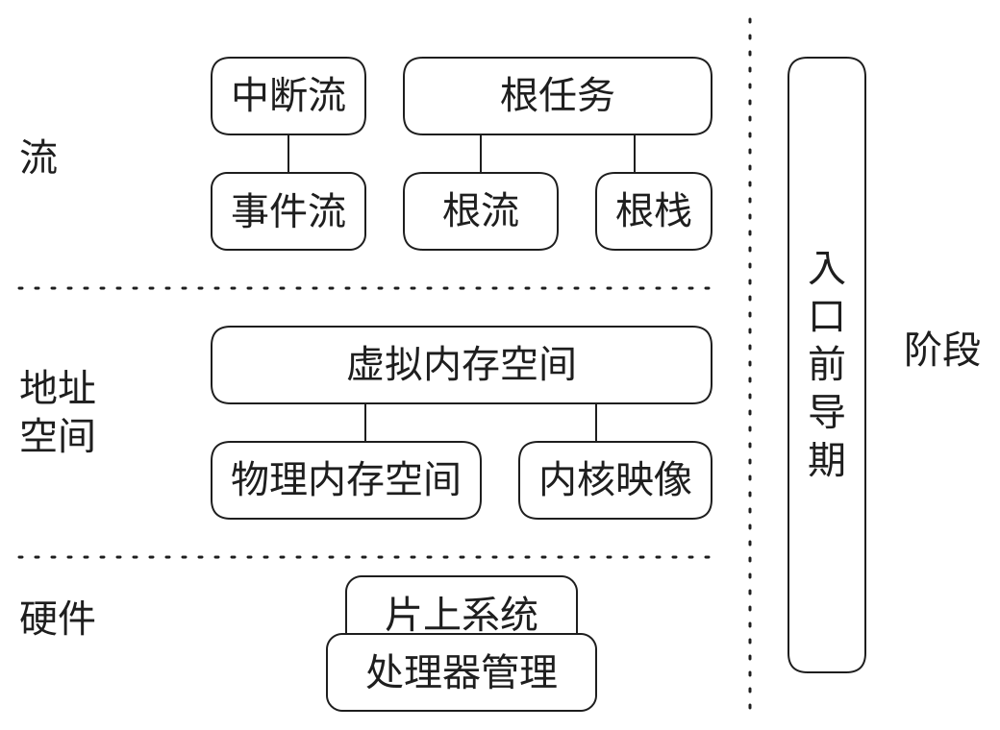

  图 8 入口前导期对象分类与相互关系

图 8 用于说明入口前导期涉及对象的分类与相互关系。该阶段主要涉及四类对象：流对象、地址空间对象、硬件对象和阶段对象。

在流对象中，`根流`（`Root Stream`）是内核引导过程中最早出现的执行流。随后建立的 `根任务`（`InitTask`）是 `根流` 在内核领域内的具体化对象，未来将主要通过它跟踪这一早期执行实体。因此，在对象层级上，`根任务` 是父对象，`根流` 和 `根栈`（`InitStack`）都是它的子对象。入口后继期还会为 `根任务` 补充 `根任务地址空间`（`InitMM`）子对象，用于描述 Linux `init_mm` 这类根任务关联的地址空间元数据。`事件流`（`Event Stream`）是 `中断流`（`Interrupt Stream`）的下级子对象，用于维护中断/异常入口表以及进入中断处理或异常处理之前的公共流程。

在地址空间对象中，`虚拟内存空间`（`VM`）的空间内容先拆为两个子对象，分别是内核映像和物理内存空间。其中，`物理内存空间` 是准备期输入对象，表示只读的物理资源布局；入口前导期不建立或修改它，只读取它提供的约束。`VM` 的建立过程还包含三个页表子对象：`跳板虚拟内存空间`（`TrampolineVM`）维护并使用 `静态对象集合.trampoline_pg_dir`，`早期虚拟内存空间`（`EarlyVM`）维护并使用 `静态对象集合.early_pg_dir`，`交换虚拟内存空间`（`SwapperVM`）维护并使用 `静态对象集合.swapper_pg_dir`。入口前导期只触发前两个子对象，`SwapperVM` 对应的完整虚拟内存空间由后续阶段继续建立。

在硬件对象中，`片上系统`（`SoC`）是片上系统平台的抽象；`处理器管理`（`CPUGroup`）是 `片上系统` 的下级子对象，负责记录和管理处理器相关状态。

阶段对象是一类特殊对象，不只是用于控制其他对象的构建顺序，还用于承载本阶段的初始化逻辑、默认上下文和阶段边界。`入口前导期对象` 是 `引导期` 的子阶段对象，其父对象是 `引导期`；而 `引导期` 在形式化模型中可作为启动时间轴对象的子对象，由启动时间轴负责与准备期及后续阶段衔接。在执行语义上，概念根流通过推进启动时间轴及其中的阶段对象，逐步完成内核启动。

对于这些对象，当前先只确认它们与“入口前导期”相关：其中一部分在本子阶段中建立或推进状态，一部分作为准备期输入被读取。对象在本子阶段中实际覆盖的状态范围，以及 `discover`、`setup`、`enable` 等过程如何展开，后续再单独补充。

因此，当前先给出对象名，并为后续补充初始状态检查与结束状态检查预留位置。

检查项分为两类：

1. `记录`：读取并保存当前状态，用于后续跟踪、对比或诊断。
2. `验证`：检查当前状态是否符合预期；如果不符合预期，则状态机进入 `FAIL` 并报错。

同一对象存在多条状态检查或执行动作时，应在该对象下使用多级序号分段描述。一级序号表示对象，二级序号表示该对象内部相互对应的一组“初始状态检查、执行动作、结束状态检查”。这里的对象描述顺序优先反映入口前导期中的出现和建立顺序，不等同于对象父子层级。

1. `根流`（`Root Stream`）

   描述：内核引导过程中最早出现的执行流对象，表示当前唯一 `常规流+` 的 `Flow`；在对象层级上，它后续会下降为 `根任务` 的子对象。

   * `preset` - 禁止在内核态执行 `FPU` 指令与 `VECTOR` 指令

     * 初始状态：空。
     * 执行动作：通过设置 `sstatus`，禁止在内核态执行 `FPU` 指令与 `VECTOR` 指令。
     * 结束状态：验证 `sstatus` 对应位，确保 `FPU` 指令与 `VECTOR` 指令已被禁止。

2. `根任务`（`InitTask`）

   描述：后续建立的流对象父对象，是 `根流` 在内核领域内的具体化对象，后续将主要用于跟踪这一早期执行实体。

   * `setup` - 建立物理地址阶段的根任务指针

     * 初始状态：静态根任务结构体实例 `init_task` 有效，且可通过物理地址访问。
     * 执行动作：设置 `tp` 寄存器，使其指向 `init_task` 的物理地址。
     * 结束状态：验证 `tp` 寄存器指向有效的 `init_task` 物理地址。

   * `enable` - 重置根任务指针到虚拟地址

     * 初始状态：`VM.setup()` 已完成并进入早期虚拟地址阶段，`tp` 寄存器指向 `init_task` 的物理地址。
     * 执行动作：让 `tp` 寄存器指向 `init_task` 的虚拟地址。
     * 结束状态：验证 `tp` 寄存器指向有效的 `init_task` 虚拟地址。

3. `根栈`（`InitStack`）

   描述：`根任务` 的对应栈，作为 `根任务` 的子对象。

   * `setup` - 建立物理地址阶段的根栈指针

     * 初始状态：`LDS.init_stack_start` 与 `LDS.init_stack_end` 有效，二者均与页对齐，且 `LDS.init_stack_end - LDS.init_stack_start` 大于等于 `1` 个页。
     * 执行动作：先设置 `sp` 寄存器，使其指向 `LDS.init_stack_end` 对应的栈空间高端；然后将 `sp` 减去 `Config.PT_SIZE_ON_STACK`，为 `PTRACE` 区域留出空间。
     * 结束状态：验证 `sp` 寄存器指向有效的根栈物理地址，即 `LDS.init_stack_end - Config.PT_SIZE_ON_STACK`。

   * `setup` - 重置根栈指针到虚拟地址

     * 初始状态：`VM.setup()` 已完成并进入早期虚拟地址阶段，`sp` 寄存器指向 `LDS.init_stack_end - Config.PT_SIZE_ON_STACK` 的物理地址。
     * 执行动作：让 `sp` 寄存器指向 `LDS.init_stack_end - Config.PT_SIZE_ON_STACK` 的虚拟地址。
     * 结束状态：`根栈` 进入 `Ready`，验证 `sp` 寄存器指向有效的根栈虚拟地址。`Online` 留给后续栈保护机制建立后的正式服务状态。

4. `中断流`（`Interrupt Stream`）

   描述：当前阶段的中断控制对象，用于封闭中断进入路径，避免入口前导期被异步中断打断。

   * `preset` - 屏蔽中断子开关
     * 初始状态：记录 `sie` 与 `sip` 的当前值。
     * 执行动作：清零 `sie` 与 `sip`，作为防御式预置动作。
     * 结束状态：`中断流` 进入 `Prepared`，验证 `sie` 与 `sip` 确实已经清零，确保各类中断子开关与挂起状态已经被清理。

   * `setup` - 关闭中断总开关
     * 初始状态：`中断流` 已进入 `Prepared`，记录 `sstatus` 的当前值。
     * 执行动作：清除 `sstatus` 中控制 supervisor interrupt enable 的总开关位。这里的动作仍属于防御式过程，即即使固件交接时已经关闭中断，内核入口仍再次规范化总开关状态。
     * 结束状态：`中断流` 进入 `Ready`，验证 `sstatus` 的 supervisor interrupt enable 位已经清除，确保中断进入路径在子开关和总开关两个层面都被封闭。

5. `事件流`（`Event Stream`）

   描述：`中断流` 的下级子对象，用于维护中断/异常入口表以及中断和异常分叉前的公共流程。

   * `setup` - 设置事件的临时处理入口

     * 初始状态：空。
     * 执行动作：设置 `RISCV64.stvec` 指向事件的临时处理入口 `early_event_entry`。在参考内核中，该入口对应 `.Lsecondary_park`，其实现是用于调试目的的无限循环。
     * 结束状态：验证 `RISCV64.stvec` 指向 `early_event_entry`，确保误入的中断或异常能够进入受控停机路径。

   * `enable` - 设置事件的正式处理入口

     * 初始状态：`VM.setup()` 已完成并进入早期虚拟地址阶段，`事件流.setup()` 已完成。
     * 执行动作：设置 `RISCV64.stvec` 指向事件的正式处理入口 `formal_event_entry`。在参考内核中，该入口对应 `handle_exception`。该动作建立起中断/异常处理的入口框架，并清零 `RISCV64.sscratch` 指示当前处于内核态。
     * 结束状态：验证 `RISCV64.stvec` 指向 `formal_event_entry`，并验证 `RISCV64.sscratch` 已清零。

6. `内核映像`（`Kernel Image`）

   描述：代表内核映像本身，主要维护其各个 `segment` 的信息与状态。

   * `preset` - 初始化全局指针

     * 初始状态：待补充。
     * 执行动作：用 `global_pointer$` 符号地址初始化 `gp` 寄存器，作为 `preset` 动作。
     * 结束状态：验证 `gp` 寄存器值等于 `global_pointer$` 的符号地址，确保用于快速访问 `.sbss` 与 `.sdata` 的 `gp` 相对寻址方式有效。

   * `setup` - 清零 BSS 段

     * 初始状态：验证 `BSS` 段的开始地址与结束地址有效，基本要求是二者均不为 `0`，且结束地址大于开始地址。
     * 执行动作：清零 `BSS` 段。
     * 结束状态：验证 `BSS` 段已经清零。

   * `enable` - 在虚拟内存空间重置 `gp-relative` 寻址方式

     * 初始状态：`VM.setup()` 正在完成入口前导期页表切换，`global_pointer$` 的虚拟地址可用，`gp` 尚未按当前虚拟内存空间重新设置。
     * 执行动作：在 `VM.setup()` 过程中，用 `global_pointer$` 的虚拟地址重新初始化 `gp` 寄存器，作为 `enable` 动作。
     * 结束状态：验证 `gp` 寄存器值等于 `global_pointer$` 的虚拟地址，确保虚拟内存空间中的 `gp-relative` 快速寻址方式有效。

7. `物理内存空间`（`Physical Memory Space`，`PM`）

   描述：准备期输入对象，对物理层面的内存与设备 `I/O` 地址资源布局的抽象。它不是入口前导期建立出来的对象；入口前导期只读取它提供的资源布局约束。后续解析 `dtb`、建立 `memblock` 或管理可分配物理页，属于更高层次对象，不能与本对象混为一谈。

8. `虚拟内存空间`（`VM`）

   描述：代表内核虚拟内存空间的抽象。`VM` 包含三个页表子对象：`跳板虚拟内存空间`（`TrampolineVM`）、`早期虚拟内存空间`（`EarlyVM`）与 `交换虚拟内存空间`（`SwapperVM`），分别维护和使用 `静态对象集合.trampoline_pg_dir`、`静态对象集合.early_pg_dir` 与 `静态对象集合.swapper_pg_dir`。内核通过依次切换和使用这些页表，最终建立完整的虚拟内存空间。在入口前导期，只涉及 `TrampolineVM` 与 `EarlyVM`；`SwapperVM` 对应的完整虚拟内存空间由后续阶段继续建立。

   `跳板虚拟内存空间`（`TrampolineVM`）负责第一次过渡，把当前控制流从物理地址空间带入虚拟地址空间；`早期虚拟内存空间`（`EarlyVM`）负责入口前导期后半段可用的早期内核虚拟地址空间；`交换虚拟内存空间`（`SwapperVM`）负责后续阶段的完整内核虚拟内存空间。

   * `preset` - 建立入口前导期页表子对象

     * 初始状态：`RISCV64.satp` 尚未指向本阶段要使用的早期页表；`RISCV64.a1` 保存的 `dtb_pa` 可作为设备树物理地址；`内核映像` 与 `物理内存空间` 提供建立早期映射所需的地址边界；`静态对象集合.trampoline_pg_dir` 与 `静态对象集合.early_pg_dir` 有效且按页对齐。
     * 执行动作：依次推进 `TrampolineVM.setup()` 与 `EarlyVM.setup()`，分别初始化 `静态对象集合.trampoline_pg_dir` 与 `静态对象集合.early_pg_dir`，建立入口前导期所需的早期页表与映射关系，并确定 `satp_mode` 等早期地址转换参数。
     * 结束状态：验证 `TrampolineVM` 进入可启用状态，能够支撑第一次地址空间切换；验证 `EarlyVM` 进入可启用状态，能够覆盖入口前导期后续执行所需的内核映像范围与早期访问范围；`VM` 进入可执行 `setup` 的状态，但尚未切换 `RISCV64.satp`。

   * `setup` - 依次启用入口前导期页表子对象

     * 初始状态：`VM.preset()` 已完成，`TrampolineVM` 与 `EarlyVM` 均处于可启用状态，当前控制流仍处于物理地址阶段。
     * 执行动作：依次推进 `TrampolineVM.enable()` 与 `EarlyVM.enable()`。第一步，`TrampolineVM.enable()` 基于 `静态对象集合.trampoline_pg_dir` 完成从物理地址空间到虚拟地址空间的切换；第二步，`EarlyVM.enable()` 借助 `静态对象集合.early_pg_dir` 完成第二次页表切换，扩大虚拟内存空间的管理范围。本过程内部执行 `内核映像.enable()`，在虚拟内存空间中重置 `gp-relative` 寻址方式。
     * 结束状态：验证 `RISCV64.satp` 指向 `静态对象集合.early_pg_dir` 对应的早期内核页表，验证当前控制流已经进入早期虚拟地址阶段，验证 `VM` 对后续 `事件流.enable()`、`根任务.enable()` 与 `根栈.setup()` 可用。

   * `enable` - 建立完整虚拟内存空间

     * 初始状态：`VM.setup()` 已完成并处于早期虚拟地址阶段，`SwapperVM` 尚未进入完整启用状态。
     * 执行动作：依次推进 `SwapperVM.setup()` 与 `SwapperVM.enable()`。`SwapperVM.setup()` 初始化 `静态对象集合.swapper_pg_dir` 并建立后续阶段所需的完整内核页表；`SwapperVM.enable()` 基于 `静态对象集合.swapper_pg_dir` 执行页表切换，建立完整的虚拟内存空间。
     * 结束状态：验证 `RISCV64.satp` 指向 `静态对象集合.swapper_pg_dir` 对应的完整内核页表，验证完整虚拟内存空间可用。
     * 当前阶段：本过程不在入口前导期触发。

   8.1. `跳板虚拟内存空间`（`TrampolineVM`）

   描述：`VM` 的页表子对象，维护并使用 `静态对象集合.trampoline_pg_dir`，用于支撑从物理地址空间到虚拟地址空间的第一次过渡。它的管理范围只覆盖完成过渡所需的最小内核映像范围，不代表完整的早期虚拟内存空间。

   * `setup` - 建立跳板页表

     * 初始状态：`静态对象集合.trampoline_pg_dir` 地址按页对齐，大小为一个页；`内核映像._start` 作为内核的起始物理地址与`Config.PMD_SIZE`对齐；`Config.KERNEL_LINK_ADDR`作为内核的起始虚拟地址有效。`Config.satp_mode`是有效的地址空间模式
     * 执行动作：初始化 `静态对象集合.trampoline_pg_dir`，配合`Config.satp_mode`模式，建立`Config.PMD_SIZE`大小的页表映射区域，支撑从物理地址空间到虚拟地址空间的切换。
     * 结束状态：验证 `静态对象集合.trampoline_pg_dir` 可用于构造临时 `satp` 值，并能够支撑从物理地址空间进入虚拟地址空间的过渡。

   * `enable` - 启用跳板页表

     * 初始状态：无。
     * 执行动作：把 `RISCV64.satp` 切换到 `静态对象集合.trampoline_pg_dir` 对应的临时页表，并执行必要的地址转换同步，使控制流完成第一次过渡。随后触发 `内核映像.enable()`，重置 `gp-relative` 寻址方式。
     * 结束状态：验证控制流已经进入可继续执行的虚拟地址位置。

   8.2. `早期虚拟内存空间`（`EarlyVM`）

   描述：`VM` 的页表子对象，维护并使用 `静态对象集合.early_pg_dir`，用于支撑入口前导期后半段的早期内核虚拟地址空间。空间包括两个虚拟地址区域：完整的内核映像和物理内存中的原始 `dtb`。

   对原始 `dtb` 的头部、完整物理范围以及 `FixMap` 槽位容量检查，属于本规格的前置证明边界。它把固件交接、DTB 有效性和 FDT fixmap 布局这些后续步骤隐含依赖的事实提前收口。Linux 6.12.37 的 RISC-V 实现中，`setup_vm()` 主要先根据 `dtb_pa` 建立 FDT fixmap 映射并记录 `dtb_early_va/dtb_early_pa`；真正的 FDT header 校验和内容扫描发生在后续 `parse_dtb()` / `early_init_dt_scan()` 路径中。因此这里的验证边界强于 Linux 当前源码顺序，不表示 Linux 在 `setup_vm()` 中逐项执行这些检查。

   * `setup` - 建立早期页表

     * 初始状态：`静态对象集合.early_pg_dir` 物理地址按页对齐；内核映像可装入 `KernelImageMap`；`BootArgs.dtb_pa` 指向的原始 `dtb` 已由规格前置证明确认为有效，且其完整物理范围能放入 `FixMap` 的 FDT 槽位。
     * 执行动作：初始化 `静态对象集合.early_pg_dir`，建立入口前导期后续执行所需的完整内核映像映射和 `FixMap` 区域映射，`FixMap` 区域中包括对物理内存中原始 `dtb` 的完整映射。映射要保持与 `satp_mode` 匹配。
     * 结束状态：验证 `静态对象集合.early_pg_dir` 能覆盖入口前导期后续执行所需的完整内核映像范围与通过 FDT fixmap 槽位访问原始 `dtb` 的能力。

   * `enable` - 启用早期页表
     * 初始状态：`TrampolineVM.enable()` 已完成，当前控制流已经具备执行第二次页表切换的条件。
     * 执行动作：把 `RISCV64.satp` 切换到 `静态对象集合.early_pg_dir` 对应的早期内核页表，并执行必要的地址转换同步。
     * 结束状态：验证在虚拟内存空间中能够访问完整的内核映像和物理内存中的完整原始 `dtb`。

9. `处理器管理`（`CPUGroup`）

   描述：`片上系统` 的下级子对象，负责组织所有 `CPU` 相关子对象。当前入口前导期先建立启动 CPU 本体对象 `BootCPU`；逻辑 `ID` 到物理 `hartid` 的映射由后续入口后继期的 `CpuIdMap` 子对象建立。

   * `preset` - 建立启动 CPU 子对象

     * 初始状态：`BootArgs.boot_hartid` 已由 RISC-V 启动 ABI 解释出来。
     * 执行动作：驱动 `BootCPU.preset()`，使 `BootCPU` 记录其物理 `hartid` 来自 `BootArgs.boot_hartid`。
     * 结束状态：`BootCPU` 进入 `Prepared`，`CPUGroup` 进入 `Prepared`，表示启动 CPU 身份已被处理器管理对象组织起来；`CPUGroup` 本身不再长期保存 `boot_cpu_hartid`。启动 hartid 属于平台有效集合的检查延迟到入口后继期 `EarlyDtb.preset()` 建立 `PlatformCpuInfo` 后，再由 `BootCPU.setup()` 依赖该事实确认。

10. `片上系统`（`SoC`）

   描述：片上系统平台的抽象。

   * `preset` - 执行片上系统早期预置

     * 初始状态：`片上系统` 对象可由前置环境或配置识别，平台相关早期预置尚未完成。
     * 执行动作：执行 `片上系统.preset()`，完成片上系统平台相关的早期预置动作。
     * 结束状态：`片上系统` 对象进入 `prepared` 状态，平台相关早期约束已建立；具体检查项后续补充。

11. `入口前导期对象`

   描述：属于阶段对象，是 `引导期` 的子阶段对象，主要用于承载入口前导期的初始化逻辑、默认上下文和阶段边界，并在该子阶段内编排其他对象过程。

   * `setup` - 编排入口前导期初始化逻辑

     * 初始状态：`根流` 已进入 `引导期`，且当前控制点位于入口前导期的起点边界。
     * 执行动作：按照入口前导期对象构建时序，推进本子阶段内各个对象过程，并维持本子阶段的默认上下文；本过程末尾执行 `片上系统.preset()`。
     * 结束状态：入口前导期的初始化逻辑完成，控制权到达下一个子阶段或 `start_kernel()` 对应的起点边界。

   * `enable` - 入口前导期对象使能

     * 初始状态：`入口前导期对象.setup()` 已完成。
     * 执行动作：空。
     * 结束状态：空。

   * `cleanup` - 退出入口前导期

     * 初始状态：不在本子阶段执行。
     * 执行动作：不在本子阶段执行；由下一个子阶段 `入口后继期对象.setup()` 调用 `入口前导期对象.cleanup()`。
     * 结束状态：入口前导期对象退出当前建立链，并确保入口后继期对象接续开始。

##### 入口前导期对象构建时序

本小节用于补充 `入口前导期对象` 如何编排本子阶段中各个对象的建立顺序。`入口前导期对象` 自身属于阶段对象；在当前建模中，可以把它的 `setup` 过程理解为本子阶段初始化逻辑的展开过程。该过程由 `根流` 推进，并在推进过程中调用本子阶段内各个对象过程。等这些对象过程完成，并且控制权能够转入下一个子阶段或 `start_kernel()` 后，入口前导期结束，同时也形成后续阶段的起点边界。`入口前导期对象.cleanup()` 不在本子阶段执行，而是在下一个子阶段 `入口后继期对象.setup()` 中执行，以确保两个子阶段首尾相继。

图 9 将入口前导期对象的 `setup` 过程表示为阶段对象对各个对象过程的编排顺序。该图不逐项标注与参考内核源码行号的精确对应关系；具体源码位置、过程内部展开方式和条件编译路径，后续在细化对应对象过程时再单独说明。

图中的时序节点可采用 `对象名.过程名()` 的简写形式，表示对某个对象执行一次状态迁移过程；具体执行动作和检查项回到对应对象的状态机描述中查看。

  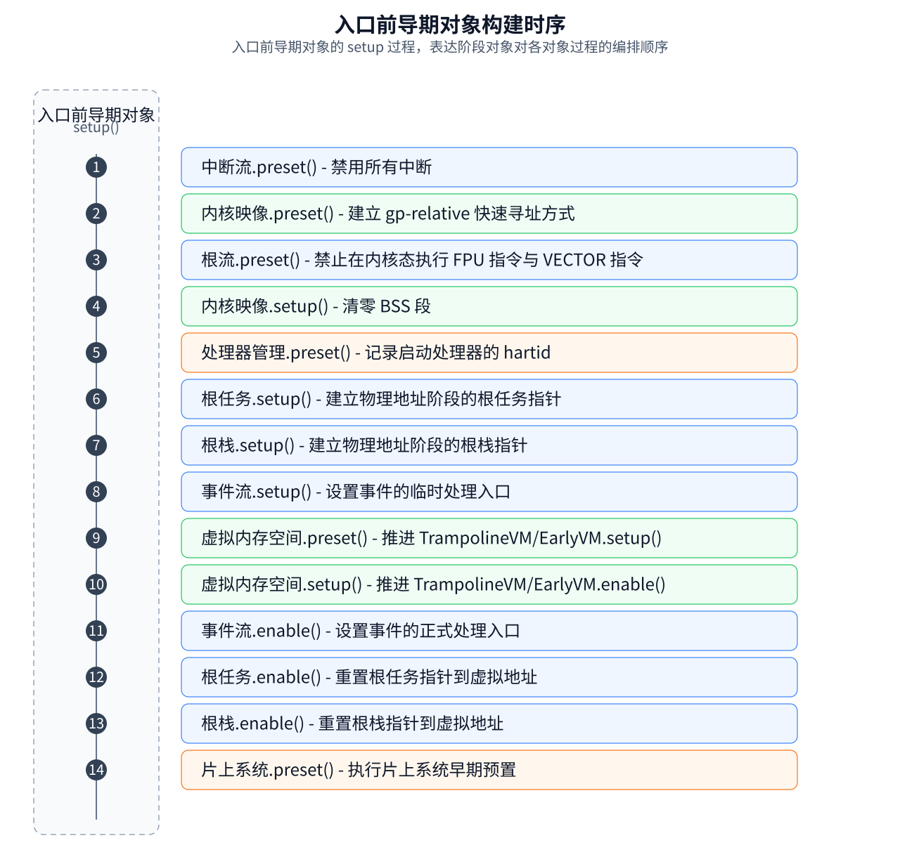

  图 9 入口前导期对象构建时序

从对象角度看，`入口前导期对象` 的 `setup` 并不是单一对象内部字段的简单赋值，而是一个阶段级编排过程。`a0` 与 `a1` 的入口参数识别先保留在对象的初始状态检查中，不作为图 9 中的 `setup` 执行动作。它依次完成以下工作：

1. 建立 `中断流` 的早期受控状态，屏蔽所有中断。
2. 执行 `内核映像.preset()`，用 `global_pointer$` 符号初始化物理地址阶段的 `gp`。
3. 执行 `根流.preset()`，禁止在内核态执行 `FPU` 指令与 `VECTOR` 指令。
4. 执行 `内核映像.setup()`，清零 `BSS` 段，使内核映像进入早期可运行状态。
5. 执行 `处理器管理.preset()`，组织 `BootCPU` 子对象并驱动 `BootCPU.preset()` 记录启动 CPU 的物理 `hartid` 来源。
6. 执行 `根任务.setup()` 与 `根栈.setup()`，建立物理地址阶段的根任务指针与根栈指针。
7. 执行 `事件流.setup()`，设置事件的临时处理入口，使 `VM` 建立过程中误入的中断或异常能够进入受控停机路径。
8. 执行 `虚拟内存空间.preset()`，依次推进 `TrampolineVM.setup()` 与 `EarlyVM.setup()`，初始化 `静态对象集合.trampoline_pg_dir` 与 `静态对象集合.early_pg_dir`，为入口前导期的两次页表切换准备条件。
9. 执行 `虚拟内存空间.setup()`，依次推进 `TrampolineVM.enable()` 与 `EarlyVM.enable()`：先基于 `静态对象集合.trampoline_pg_dir` 完成从物理地址空间到虚拟地址空间的切换，再借助 `静态对象集合.early_pg_dir` 完成第二次页表切换，扩大虚拟内存空间的管理范围；其中，`内核映像.enable()` 作为 `VM.setup()` 的内部调用，用于在虚拟内存空间重置 `gp-relative` 寻址方式。
10. `VM.setup()` 完成后，执行 `事件流.enable()`，设置事件的正式处理入口，使 `RISCV64.stvec` 指向 `formal_event_entry`。
11. 在 `VM.setup()` 完成后，执行 `根任务.enable()` 与 `根栈.setup()`，分别将 `tp` 与 `sp` 重置为虚拟地址。
12. 执行 `片上系统.preset()`，完成片上系统平台相关的早期预置；`入口前导期对象.enable()` 暂时为空，`入口前导期对象.cleanup()` 留到下一个子阶段 `入口后继期对象.setup()` 中执行。

当前时序图主要表达对象过程的编排顺序，不表达逐项源码对应关系。失败时进入 `FAIL` 状态的错误传播方式，以及每一步更细的依赖检查，后续继续补充。

按这一写法，当前子阶段的重点不再是把对象内部字段一次性枚举完，而是先明确本阶段到底要建立哪些对象。

后续如果继续展开 `discover`、`setup`、`enable` 的具体动作，也应在对象集合与检查边界明确后，再去细化中间过程，而不是反过来先从零散字段出发。

##### 入口前导期正式建模规格说明

本小节用于说明入口前导期形式化对象模型的定位、用途和维护方式。具体可被验证器解析、建模和验证的模型条目，已经抽取到 `spec/model` 目录；正式入口是 [`model/main.spec`](model/main.spec)。旧的 [`entry-prelude-object-model.spec`](entry-prelude-object-model.spec) 只作为兼容入口保留。

`spec/model/main.spec` 是当前模型推导验证的规范输入源，覆盖以下内容：

- 状态中心对象模型记法所需的函数、谓词和基础类型声明
- `addr_of`、`phys_addr`、`virt_addr` 及虚拟地址区域相关约束
- 准备期输入对象模型
- `BootPhase` 阶段树，以及已经展开的 `EntryPreludePhase`、`EntrySuccessorPhase`、`CorePreparePhase` 和 `MmCoreInitPhase` 子阶段对象模型
- 当前尚未展开但需要保留边界的 `deferred` 条目

正文中的阶段对象、对象分类、对象关系和构建时序仍作为分析性说明保留，用于解释模型意图和设计背景；验证器工具应以独立模型文件中的条目为准。模型文件中的 `/* ... */` 与 `//` 注释只面向人工阅读，工具解析时应忽略；`deferred` 是模型内的延期定义或占位标记，工具应能够识别并报告。

后续修订时，若某一对象、状态、事件、谓词或类型已经进入形式化模型，应优先修改独立模型文件；正文只在需要同步解释、图示或设计背景时更新。

#### 子阶段 2：入口后继期（Entry Successor Subphase）

第二个子阶段，从 `start_kernel()` 入口开始，到 `setup_arch()` 中 `paging_init()` 完成后结束。它承接入口前导期已经建立的早期执行条件，并在仍然保持系统独占的上下文中，完成完整内核虚拟内存地址空间的建立和切换。

从 Linux 代码边界看，本子阶段的起点是 `init/main.c` 中进入 `start_kernel()`；核心过程发生在 `arch/riscv/kernel/setup.c` 的 `setup_arch()` 内；结束边界是 `arch/riscv/mm/init.c` 的 `paging_init()` 返回。`paging_init()` 内部调用 `setup_vm_final()`，后者建立 `swapper_pg_dir` 中的 fixmap、线性映射和内核映像映射，并将 `RISCV64.satp` 切换到 `swapper_pg_dir` 对应的完整内核页表。

因此，本子阶段的核心目标可以表述为：推进 `SwapperVM` 从 `Base` 经 `Ready` 到 `Online`，并使 `VM` 从入口前导期结束时的早期虚拟地址空间状态推进到完整内核虚拟地址空间状态。该边界中的“完整”只表示内核启动后续阶段所需的完整内核地址空间已经建立并成为当前地址空间；它不表示所有内存管理机制都已经完成，例如 page allocator、NUMA、vmalloc、用户地址空间和后续运行期内存管理仍属于更晚阶段。

本子阶段仍处于 `引导期` 的 `System Exclusive` 上下文中。此时还没有打开中断，也没有启动其它任务或其它 hart 进入内核并发执行路径。因此，本子阶段的对象建立过程仍可按单根流独占推进来理解。

当前先识别出本子阶段的核心对象和边界，不展开完整状态机：

1. `入口后继期对象`：属于阶段对象，是 `引导期` 的第二个子阶段对象。它从 `start_kernel()` 起点边界接续 `入口前导期对象`，负责编排本子阶段内的早期 C 初始化和完整虚拟地址空间建立，并在 `SwapperVM` 进入 `Online` 后形成阶段完成边界。
2. `虚拟内存空间`（`VM`）：在入口前导期已经进入早期虚拟地址空间状态。本子阶段触发 `VM.enable()`，推进完整内核虚拟内存空间建立。
3. `交换虚拟内存空间`（`SwapperVM`）：`VM` 的页表子对象，维护并使用 `静态对象集合.swapper_pg_dir`。本子阶段中，`SwapperVM.setup()` 负责建立完整内核页表，`SwapperVM.enable()` 负责切换 `RISCV64.satp` 到该页表，使其成为当前地址空间。`SwapperVM.setup()` 可以使用临时页表构建 fixmap slots，例如 `FIX_PTE`、`FIX_PMD`、`FIX_PUD`、`FIX_P4D`；它们是内部构建设施，不作为本阶段目标对象展开，但在 `SwapperVM.setup()` 完成后应被清理。
4. `内存块管理`（`MemBlock`，暂定名）：用于描述早期物理内存分配管理对象。它管理的是物理内存区段与保留区段；即使 Linux 后续通过直接线性映射访问其元数据，`MemBlock` 的抽象对象仍应归属于物理内存管理。`MemBlock.preset()` 由 `EarlyDtb.setup()` 触发，用于基于 `EarlyDtb.preset()` 已发布的 `PhysicalMemory` 收集候选可用物理内存区段和初步边界；`MemBlock.setup()` 对应 `setup_bootmem()`，在候选集合基础上施加内核自身占用、FDT 保留区、RawDtb、InitRD、memory limit、对齐和可映射范围等约束，形成可安全用于早期分配的物理内存管理状态；`MemBlock.enable()` 对应 `memblock_allow_resize()`，在完整线性映射可用后允许 `MemBlock` 元数据扩展。固件占用内存不作为 OpenSBI 等具体固件的特例硬编码，而应通过 FDT header `/memreserve/` 与 `/reserved-memory` 节点形成 FDT reserved ranges 后统一排除。它是后续物理页分配器和更完整内存管理对象的前置对象。
5. `早期设备树对象`（`EarlyDtb`）：入口前导期已按规格前置证明验证并映射原始 `RawDtb`；入口后继期短暂建立 `EarlyDtb`。它通过 `preset` 和 `setup` 分担职责：`EarlyDtb.preset()` 先从原始 `dtb` 中提取最小平台事实，解析 `/cpus` 建立 `PlatformCpuInfo` 并检查启动 hartid 合法，解析 `/memory` 建立 `PhysicalMemory`；`EarlyDtb.setup()` 再完成本子阶段对 DTB 的后续使用，提取 kernel command line，解析 FDT header `/memreserve/` 与 `/reserved-memory` 得到固件和平台保留内存范围，并触发 `MemBlock.preset()` 建立候选物理内存区段。Linux 实现中的 FDT header 校验和扫描主要发生在这一后继期路径中；本规格把 `RawDtb` 有效性提前收口，是为了让 `EarlyVm` 的映射前提可证明。本子阶段末尾 `EarlyDtb` 退出服务。后续正式 OF/DeviceTree 对象若建立，应视为基于原始 `dtb` 或早期解析结果重新建立的运行期对象，不是 `EarlyDtb` 的简单延续。
6. `命令行管理对象`（`CommandLine`）：代表启动命令行的文本视图管理对象。入口后继期的 `CommandLine.preset()` 建立 raw view，即 `KernelCmdline`，它来自 `EarlyDtb` 解析结果，只保存启动参数文本和必要边界事实，不负责解释每个参数的语义。完成 `parse_dtb()` 后，`CommandLine.state == Prepared`，`KernelCmdline.state == Ready`，供后续参数解析对象使用。`SavedCommandLine` 与 `StaticCommandLine` 是同一 `CommandLine` 对象在核心准备期建立的 saved/static 子视图，不作为新的顶级命令行管理对象。
7. `参数解析管理对象`（`Params` / `EarlyParam` / `BootParam` / `PayloadParam`）：`Params` 是参数解析类对象的顶层管理者，不属于 `CommandLine`，也不合并命令行文本视图管理。入口后继期由 `Params.preset()` 驱动 `EarlyParam.setup()`，完成第一次 `parse_early_param()`；核心准备期由 `Params.setup()` 驱动 `BootParam.setup()` 和 `PayloadParam.setup()`，实现必须在二者之间保留 `print_unknown_bootoptions()` checkpoint。`EarlyParam.setup()` 依赖 `CommandLine` 的 raw view 和静态 `early_param` handler 表；当前规格要求 `earlycon` handler 必须存在，并在处理 `earlycon=sbi` 时连续驱动 `EarlyCon.preset(config=sbi)`、`EarlyCon.setup()` 和 `EarlyCon.enable()`。这意味着 `EarlyParam` 负责识别并分发参数处理过程，而 `EarlyCon` 仍负责自身后端建立与启用，只是这些对象推进发生在同一个参数处理调用链内部。
8. `根栈`（`InitStack`）：入口前导期结束时已经进入 `Ready`，即 `sp` 已经切换到早期虚拟地址。入口后继期继续执行 `InitStack.enable()`，建立栈溢出保护状态，例如设置 canary，使 `InitStack` 进入 `Online`。这里的 `guard/保护` 只是 `enable` 的文档别名，不是单独事件名；入口前导期的地址切换事件已经统一为 `setup`。
9. `根任务地址空间`（`InitMM`）：`根任务` 的子对象，代表 Linux `init_mm` 对应的根任务地址空间元数据。Linux 中 `init_task.mm == NULL`，但 `init_task.active_mm == &init_mm`；`init_mm.pgd` 静态指向 `swapper_pg_dir`，而 `setup_initial_init_mm(_stext, _etext, _edata, _end)` 会填入内核代码段、数据段与 `brk` 边界。因此，`InitMM` 不是另一个与 `VM`/`SwapperVM` 竞争的页表对象，而是 `InitTask` 关联的 `mm_struct` 抽象，用于把根任务与后续完整内核地址空间元数据连接起来。
10. `早期临时映射服务`（`EarlyIoremap`）：代表 `early_ioremap()` / `early_iounmap()` 使用的早期临时映射机制。它依赖 `FixMap` 已经提供 `FIX_BTMAP` 临时映射区，但不是 `FixMap` 的子对象；`FixMap` 是固定虚拟地址槽位布局，`EarlyIoremap` 则是使用这些槽位的服务对象。`EarlyIoremap.setup()` 对应 Linux `early_ioremap_setup()`，负责初始化各个 boot-time mapping slot 的虚拟起点并确认 `prev_map[]` 为空；后续 `early_ioremap()` 与 `early_iounmap()` 应建模为可重复执行的 `map/unmap` action，而不是生命周期事件。
11. `SBI能力视图`（`SBI`）：代表内核基于固件 SBI 接口建立的平台服务能力视图。`SBI.setup()` 对应 Linux `sbi_init()`，只负责探测并记录能力事实，例如 `spec_version`、固件实现标识、以及 `TIME`、`IPI`、`RFENCE`、`SRST`、`DBCN` 等扩展是否可用；它不把 `set_timer`、`send_ipi`、`rfence`、`debug_console_write` 等具体调用建模为自身生命周期事件。后续对象通过依赖这些能力事实来完成自己的建立，例如 `EarlyCon.setup()` 依赖 `SBI.dbcn_available` 或 legacy console 能力来选择输出后端。
12. `静态分支对象`（`StaticBranch`）：对应 RISC-V `setup_arch()` 早段中的第一次有效 `jump_label_init()`。它代表 static key / static branch 的全局基础设施，不直接照搬 Linux `jump_label` 命名。`StaticBranch.setup()` 建立静态分支表、排序分支项，并建立 static key 到分支点的关联，使对象进入 `Ready`。这里使用 `setup()` 而不是 `preset()`，因为该过程不是简单预置初值，而是实际建立后续 `static_branch_enable/disable` action 所需的查询和更新基础。`StaticBranch.set(key, value)` 是后续对象可调用的 action，用于启用或禁用某个已知 static key，不推进 `StaticBranch.state`。通用 `start_kernel()` 中的第二次 `jump_label_init()` 作为 `StaticBranch.setup()` 幂等 checkpoint，不推进状态。后续 `jump_label_init_ro()` 对应 `StaticBranch.enable()`，在内核只读保护建立前 seal `ro_after_init` static keys，使 `StaticBranch.state` 从 `Ready` 推进到 `Online`。当前 `default_config` 中 `CONFIG_JUMP_LABEL=y` 且 `CONFIG_STRICT_KERNEL_RWX=y`，因此本规格只讨论 jump label 启用和只读 seal 路径；禁用配置不进入当前边界。

    编码阶段对 `StaticBranch` 的最低要求是：提供显式 static key registry，能按 key 名或稳定 ID 查询并更新 key 值；`StaticBranch.set(key, value)` 必须要求 `StaticBranch.state == Ready` 或 `Online`，并在重复设置同一值时保持幂等；早期实现可以先用布尔值或计数值承载 key 状态，不要求立即实现指令 patch，但接口边界要保留后续替换为架构 jump-label patch 的空间。`StaticBranch.enable()` 至少要记录 sealed keys 集合，并在启用后禁止修改已 sealed 的 `ro_after_init` key。当前配置固定 `CONFIG_JUMP_LABEL=y`，因此编码规格不要求实现 `CONFIG_JUMP_LABEL=n` 的退化路径。
13. `打印缓冲区`（`PrintkBuffer`）：代表 printk 的中间日志缓冲机制。参考 Linux 在 `setup_arch()` 前打印 banner 的时机，`arceos_ex` 也应在早期输出路径中写入自身启动 banner；该输出首先进入 printk 的静态 ring buffer，而不是立即写到后端设备。启动 banner 不应依赖面向 Unikernel 应用的 `axstd::println!`，而应通过内核启动期内部的 `printk`/`println-like` 前端，或直接通过 `PrintkBuffer.write()` action 写入。因此本子阶段应把 `PrintkBuffer.preset()` 放在 `EarlyCon.setup()` 之前，并把启动 banner 输出建模为状态内 `action`。
14. `早期控制台`（`EarlyCon`）：代表正式 console 建立前的临时输出后端。对于当前 RISC-V64 路径，`EarlyCon.preset/setup/enable` 由 `EarlyParam.setup()` 处理 `earlycon=sbi` 时连续触发；其中 `setup` 基于 SBI DBCN 或 SBI v0.1 console 能力事实建立 SBI 输出后端，`enable` 注册并启用早期控制台，同时把 `PrintkBuffer` 中已经存在的历史输出 replay/flush 到后端。`EarlyCon.handoff/cleanup` 应留给后续正式 `Console` 注册阶段，不属于本子阶段到 `paging_init()` 完成前的核心边界。
15. `处理器管理`（`CPUGroup`）：当前形式化模型中，`CPUGroup` 下已经显式拆出 `BootCPU` 与 `CpuIdMap` 两个子对象。`BootCPU` 的类别是通用 `CPU`，以便将来 secondary CPU 对象复用同一类别；`BootCPU.preset()` 在入口前导期生效，并记录启动 CPU 的物理 `hartid` 来自 `BootArgs.boot_hartid`。这样 `CPUGroup` 本身不再长期保存 `boot_cpu_hartid`。入口后继期先由 `EarlyDtb.preset()` 建立 `PlatformCpuInfo`，再由 `CpuIdMap.preset()` 建立 `logical CPU 0 -> BootCPU` 的基础映射，使 `CpuIdMap` 进入 `Prepared`，并由 `BootCPU.setup/enable` 完成启动 CPU 的 active/online 语义推进；核心准备期中 `CpuGroup.setup()` 建立 CPU 拓扑事实和 secondary CPU 候选集合，随后 `CpuIdMap.setup()` 确认当前阶段可用的 logical CPU 映射边界并进入 `Ready`。`CpuIdMap.enable()` 保留给未来多 CPU 运行期或动态拓扑正式启用时使用。

对 `BootCPU` 而言，Linux `boot_cpu_init()` 会把启动 CPU 同时标记到 `possible`、`present`、`active` 与 `online` 四类 CPU 位图中。规格层不必照搬四个位图实现，但应保留这些语义层次：入口前导期 `BootCPU.preset()` 只记录启动 CPU 的物理 `hartid`；入口后继期 `EarlyDtb.preset()` 建立并发布 `PlatformCpuInfo`，确认该 hartid 属于平台有效集合；随后 `BootCPU.setup()` 对应 present/active 边界，`BootCPU.enable()` 对应 online 边界。

  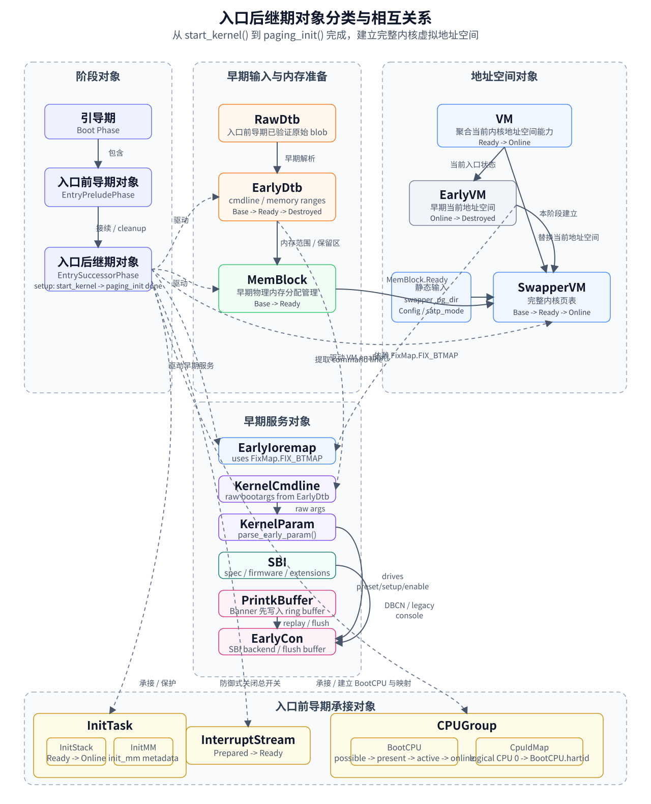

  图 10 入口后继期对象分类与相互关系

图 10 用于说明入口后继期涉及对象的分类与相互关系。`入口后继期对象` 作为阶段对象接续 `入口前导期对象`，并在 `start_kernel()` 之后编排本子阶段核心对象推进。`EarlyDtb` 基于入口前导期已经验证过的 `RawDtb` 先建立基础平台事实：`PlatformCpuInfo` 与 `PhysicalMemory`；随后它建立早期解析结果，驱动 `CommandLine.preset()` 产出 raw view `KernelCmdline`，同时触发 `MemBlock.preset()` 收集候选可用物理内存区段。`MemBlock.setup()` 再施加保留、裁剪和对齐等约束，形成可安全用于早期分配的物理内存管理状态。`Params.preset()` 再驱动 `EarlyParam` 基于 `CommandLine` 的 raw view 和静态 `early_param` handler 表解析早期参数，当前首先要求识别 `earlycon=sbi`，并在参数处理调用链内部连续驱动 `EarlyCon.preset/setup/enable`。`SwapperVM` 基于 `MemBlock` 和静态页表存储建立完整内核页表，并替换 `EarlyVM` 成为当前地址空间。`EarlyIoremap` 依赖 `FixMap.FIX_BTMAP` 临时映射区，提供 `early_ioremap()` / `early_iounmap()` 这类早期临时映射服务，但它不是 `FixMap` 的子对象。`SBI` 记录固件平台服务能力事实，供后续对象依赖；例如 `EarlyCon.setup()` 只负责使用 `SBI.dbcn_available` 或 legacy console 能力选择输出后端，而不重新探测这些能力。`PrintkBuffer` 与 `EarlyCon` 共同描述早期输出路径：启动期内部 `printk`/`println-like` 前端和应用侧 `axstd::println!` 是不同入口，但二者都应首先通过 `PrintkBuffer.write(...)` action 写入统一缓冲区，随后由 `EarlyCon` 或正式 `Console` drain/replay；后续正式 `Console` 建立时，`EarlyCon` 再退出或移交输出后端，而 `PrintkBuffer` 继续作为日志缓冲对象存在。`InitTask`、`InterruptStream` 与 `CPUGroup` 作为入口前导期承接对象出现在本图中：`InitTask` 下显式列出 `InitStack` 与 `InitMM` 两个子对象，分别继续建立根栈保护状态和初始化根任务地址空间元数据；`InterruptStream` 继续防御式关闭中断总开关；`CPUGroup` 下显式列出 `BootCPU` 与 `CpuIdMap` 两个子对象，分别跟踪启动 CPU 本体状态和逻辑 ID 到 CPU 对象的映射。

`CPUGroup` 的形式化迁移边界已经落地：入口前导期由 `BootCPU` 承载启动 CPU 身份，入口后继期由 `CpuIdMap.preset()` 建立 `logical CPU 0 -> BootCPU` 的基础映射并进入 `Prepared`。核心准备期再由 `CpuGroup.setup()` 建立 CPU 拓扑事实，由 `CpuIdMap.setup()` 使当前阶段的逻辑 ID 映射边界进入 `Ready`。这样可以避免 `BootArgs.boot_hartid` 在后续阶段被长期依赖，也避免 `CPUGroup` 同时承担 CPU 对象身份和逻辑映射表两类职责。

形式化模型已经按阶段目录组织：正式入口为 `spec/model/main.spec`，它通过 include 串接 `StartupTimeline`、`BootPhase`、`EntryPreludePhase`、`EntrySuccessorPhase`、`CorePreparePhase` 与 `MmCoreInitPhase` 等分层规格；旧的 `spec/entry-prelude-object-model.spec` 保留为兼容入口。子阶段 4 的正式模型位于 `spec/model/boot/mm-core-init/`。

本子阶段的结束状态应至少包含：

- `SwapperVM.state == Online`，且用于构建页表的临时 fixmap slots 已经清理
- `VM.state == Online`
- `InitStack.state == Online`，表示根栈保护状态已经建立
- `InterruptStream.state == Ready`，表示中断子开关和总开关都已经封闭
- `BootCPU.state == Online`，表示启动 CPU 已记录物理 `hartid`，并基于 `PlatformCpuInfo` 完成 present/active/online 的语义推进
- `CpuIdMap.state == Prepared`，表示已建立 `logical CPU 0 -> BootCPU.hartid` 的基础映射，完整核心准备期 CPU 映射边界留待 `CpuIdMap.setup()`
- `MemBlock.state == Online`，表示候选物理内存区段已经经过保留、裁剪和对齐等约束处理，且完整线性映射可用后已经允许 `MemBlock` 元数据扩展
- `InitMM.state == Ready`，表示 `init_mm` 已记录内核代码段、数据段和 `brk` 边界，并与 `InitTask.active_mm` 关系一致
- `EarlyIoremap.state == Ready`，表示 `FIX_BTMAP` 临时映射槽位的服务端元数据已经初始化，后续可执行 `map/unmap` action
- `SBI.state == Ready`，表示 SBI 规范版本、固件标识和扩展能力视图已经建立，至少可供 `EarlyCon` 判断 DBCN 或 legacy console 能力
- `StaticBranch.state == Ready`，表示静态分支表和 static key 到分支点的关系已经建立，后续对象可以执行 `StaticBranch.set(key, value)` action
- `CommandLine.state == Prepared` 且 `KernelCmdline.state == Ready`，表示从早期 DTB 中提取出的 raw kernel command line 已经可供解析
- `Params.state == Prepared` 且 `EarlyParam.state == Ready`，表示早期参数解析与分发已经完成，至少已经处理 `earlycon=sbi` 并驱动 `EarlyCon` 完成 `preset/setup/enable`
- `PrintkBuffer.state == Prepared`，表示 printk 静态缓冲机制已经可接收早期日志写入；`arceos_ex` 启动 banner 等输出通过启动期内部输出前端或直接通过 `PrintkBuffer.write(...)` action 写入缓冲区，不作为 `PrintkBuffer.preset()` 的生命周期后置状态
- `EarlyCon.state == Online`，表示基于 SBI 的 early console 后端已经启用，并可输出 `PrintkBuffer` 中的历史记录
- `RISCV64.satp` 指向 `静态对象集合.swapper_pg_dir` 对应的完整内核页表
- 早期虚拟地址空间 `EarlyVM` 不再作为当前执行地址空间使用
- 后续 `setup_arch()` 中 `paging_init()` 之后的初始化过程可以在完整内核虚拟地址空间下继续推进

当前入口后继期的最小形式化对象模型已经围绕 `InitStack`、`InitMM`、`InterruptStream`、`BootCPU`、`CpuIdMap`、`EarlyIoremap`、`SBI`、`CommandLine` raw view、`EarlyParam`、`PrintkBuffer`、`EarlyCon`、`MemBlock`、`EarlyDtb`、`SwapperVM` 和 `VM.enable()` 落地。`jump_label_init()` 在 RISC-V `setup_arch()` 的早段抽象为 `StaticBranch.setup()`；`efi_init()` 暂仍作为当前最小核心路径之外的 deferred 对象。

##### 入口后继期对象构建时序

本小节用于补充 `入口后继期对象` 如何编排本子阶段中各个核心对象的建立顺序。当前先只表达最小核心路径，不逐项覆盖 `setup_arch()` 内的全部调用，也不逐行对应 Linux 源码。

  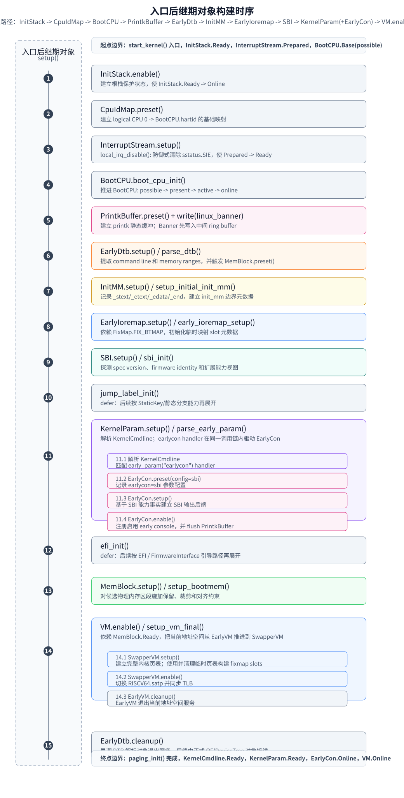

  图 11 入口后继期对象构建时序

图 11 将入口后继期对象的 `setup` 过程表示为阶段对象对核心对象过程的编排顺序：

1. 执行 `InitStack.enable()`，在入口前导期已经可用的根栈基础上建立栈溢出保护状态，使 `InitStack` 从 `Ready` 推进到 `Online`。
2. 执行 `EarlyDtb.preset()`，从 `RawDtb` 中提取基础平台事实：解析 `/cpus` 建立并发布 `PlatformCpuInfo`，确认启动 hartid 合法；解析 `/memory` 建立并发布 `PhysicalMemory`。
3. 执行 `CpuIdMap.preset()`，建立 `logical CPU 0 -> BootCPU` 的基础映射，使 `CpuIdMap` 进入 `Prepared`。该步骤对应 Linux 中 `smp_setup_processor_id()` 对启动处理器逻辑 ID 的早期确认；CPU 对象自己维护 hartid 和 possible/present/online 等状态事实。
4. 执行 `InterruptStream.setup()`，对应 Linux 中 `local_irq_disable()` 的防御式关中断动作，清除 `sstatus.SIE`，使 `InterruptStream` 从 `Prepared` 推进到 `Ready`。
5. 执行 `BootCPU.boot_cpu_init()`（规格中对应入口后继期的 `BootCPU.setup/enable`），基于 `PlatformCpuInfo` 已确认的启动 hartid，使 `BootCPU` 完成 present/active/online 的语义推进。
6. 执行 `PrintkBuffer.preset()`，建立 printk 静态缓冲机制；随后 `arceos_ex` 启动 banner 可通过启动期内部输出前端或直接通过 `PrintkBuffer.write()` 写入统一 ring buffer。该写入是 `action`，不推进 `PrintkBuffer` 的生命周期状态，也不依赖应用侧 `axstd::println!`。
7. 执行 `EarlyDtb.setup() / parse_dtb()` 的后续解析用途，提取 kernel command line，解析 FDT header `/memreserve/` 与 `/reserved-memory` 形成 FDT reserved ranges，并触发 `MemBlock.preset()` 和 `CommandLine.preset()`，使 raw view `KernelCmdline` 进入 `Ready`，并形成候选可用物理内存区段和初步边界。
8. 执行 `InitMM.setup() / setup_initial_init_mm()`，初始化 `InitTask` 的 `InitMM` 子对象，记录 `_stext`、`_etext`、`_edata` 与 `_end` 对应的代码段、数据段和 `brk` 边界；`InitMM.pgd` 仍指向 `swapper_pg_dir`，后续由 `VM.enable()` 使其对应的完整内核页表成为当前地址空间。
9. 执行 `EarlyIoremap.setup() / early_ioremap_setup()`，基于 `FixMap.FIX_BTMAP` 初始化早期临时映射服务的 slot 元数据；后续 `early_ioremap()` 与 `early_iounmap()` 是 `map/unmap` action。
10. 执行 `SBI.setup() / sbi_init()`，探测并记录 SBI 规范版本、固件标识和扩展能力视图。该步骤只产出能力事实，不把具体 SBI 调用建模为 `SBI` 自身的生命周期事件。
11. 执行 RISC-V `setup_arch()` 早段中的 `jump_label_init()`，抽象为 `StaticBranch.setup()`，使 `StaticBranch` 进入 `Ready`。该调用发生在 `parse_early_param()` 之前，使早期参数处理路径可以安全使用 static key。通用 `start_kernel()` 在 `setup_arch()` 返回后还会再次调用 `jump_label_init()`；在当前 RISC-V 路径中第二次调用因 `StaticBranch` 已经 `Ready` 而作为幂等 checkpoint 处理，不再推进对象状态。
12. 执行 `Params.preset() / parse_early_param()`，驱动 `EarlyParam.setup()` 解析 `CommandLine` 的 raw view 并分发早期参数。当前要求 `earlycon` handler 必须存在；处理 `earlycon=sbi` 时，该调用链内部连续触发 `EarlyCon.preset(config=sbi)`、`EarlyCon.setup()` 和 `EarlyCon.enable()`：`preset` 记录参数配置，`setup` 基于 `SBI` 能力事实建立 SBI early console 后端，`enable` 注册并启用后端，同时 drain/replay `PrintkBuffer` 中已经存在的 Banner 等历史输出。
13. 执行 `efi_init()`，当前暂不建模为正式对象，只作为 `defer` 占位记录。对当前 RISC-V64 最小核心路径而言，`efi_init()` 主要涉及 EFI 引导路径与相关运行时信息的早期探测，不直接改变 `SwapperVM` 建立和切换的核心语义；后续若需要支持 EFI 启动路径，再单独抽象为 `EFI` 或 `FirmwareInterface` 一类对象。
14. 执行 `MemBlock.setup()`，对应 `setup_bootmem()`。它在 `MemBlock.preset()` 收集到的候选物理内存区段基础上，排除内核自身、FDT header `/memreserve/`、`/reserved-memory`、RawDtb、InitRD 等不可分配范围，并应用 memory limit、对齐和可映射范围等控制约束，形成可安全用于早期分配的物理内存管理状态。
15. 执行 `VM.enable()`，对应 Linux `setup_vm_final()` 的抽象实施流程。内部依次推进 `SwapperVM.setup()`、`SwapperVM.enable()` 和 `EarlyVM.cleanup()`：`SwapperVM.setup()` 依赖 `MemBlock.Ready` 建立完整内核页表，并使用和清理临时页表构建 fixmap slots；`SwapperVM.enable()` 使完整内核页表成为当前地址空间；`EarlyVM.cleanup()` 使 `EarlyVM` 退出当前地址空间服务。
16. 执行 `MemBlock.enable() / memblock_allow_resize()`，在完整线性映射可用后允许 `MemBlock` 元数据扩展，使 `MemBlock` 从 `Ready` 推进到 `Online`。
17. 执行 `EarlyDtb.cleanup()`，使早期 DTB 解析对象退出服务。这里的 `Destroyed` 不表示 `RawDtb` 物理内容消失，而表示早期解析对象的阶段性使命完成；后续正式 OF/DeviceTree 对象应视为重新建立的运行期对象。

当前入口后继期的最小形式化对象模型已经落地；它的完成边界就是核心准备期的起点。后续围绕 `paging_init()` 之后到 `trap_init()` 之前的讨论，应先落入下面的核心准备期规格，再视稳定程度同步到形式化模型和对象级实现。

#### 子阶段 3：核心准备期（Core Prepare Subphase）

第三个子阶段覆盖从 `paging_init()` 完成到 `trap_init()` 完成的阶段。它承接入口后继期已经建立的完整内核虚拟地址空间，并在仍然保持 `System Exclusive` 的上下文中，继续完成体系结构、平台描述、运行期基础设施和正式异常分发框架的准备。

从 Linux/RISC-V 代码边界看，本阶段横跨两段实现路径：第一段是 `arch/riscv/kernel/setup.c` 中 `setup_arch()` 在 `paging_init()` 返回后的后半段；第二段是 `init/main.c` 中 `setup_arch()` 返回后到 `trap_init()` 完成之间的通用初始化。规格阶段边界不必完全等同于 Linux 函数边界，因此二者可以合并到同一个核心准备期中讨论。

本子阶段仍处于 `引导期` 的 `System Exclusive` 上下文中。此时完整内核页表已经启用，但中断仍未打开，普通任务调度尚未启动，其它 hart 也尚未进入并发执行路径。因此，本阶段中的对象建立过程仍可按单根流独占推进来理解。

当前已经按逐项讨论把本子阶段拆成四类处理：进入 formal model 的对象、保留位置但延后的 deferred 路径、只约束实现阶段的 checkpoint、以及当前规格范围明确不支持的路径。formal model 先描述足以指导实现和验证的抽象语义，不绑定 Linux 的具体结构体布局。

这四类条目的处理原则如下：

- `formal`：已经进入对象模型，需要明确对象状态、生命周期事件、依赖、后置条件和阶段结束状态。
- `deferred`：属于参考启动路径或相关条件路径，但当前不展开对象语义；必须保留调用位置和延期原因，避免被误解为已覆盖。
- `implementation checkpoint`：不推进规格状态，只要求对象级实现保留可观测检查点或顺序约束。
- `不纳入当前规格`：当前目标边界明确排除的路径，不作为 deferred 统计；若未来目标边界改变，应重新讨论并转入 formal 或 deferred。

1. `核心准备期对象`（`CorePreparePhase`）：属于阶段对象，是 `引导期` 的第三个子阶段对象。它从 `paging_init()` 完成边界接续入口后继期，负责编排本阶段内的体系结构和运行期基础准备，并以 `trap_init()` 完成作为阶段边界。
2. `正式设备树对象`（`DeviceTree`）：对应 `unflatten_device_tree()` 或 `unflatten_and_copy_device_tree()`。它不同于早期 `EarlyDtb`：`EarlyDtb` 服务启动早期事实提取，正式 `DeviceTree` 建立运行期 OF/DeviceTree 结构。`DeviceTree` 代表设备树在内存中展开后的形式，是由 `DeviceNode` 组成的树。展开树所需存储应来自 `MemBlock` 早期分配，而不是普通 heap 或固定静态数组；这表示 `DeviceTree.setup()` 对 `MemBlock.Online` 的依赖具有分配语义。参考 Linux 的实现路径，具体编码时应通过两次遍历完成：先遍历 `RawDtb` 校验并计算展开存储规模，再由 `MemBlock` 分配存储，随后第二次遍历填充节点和属性关系。`DeviceTree` 拥有唯一 root；`DeviceNode` 代表树中的节点，包含自身 `name`、`properties`、可选 `parent` 引用和 `children` 集合。root 没有 parent；非 root 节点有且仅有一个 parent；`child in parent.children` 与 `child.parent == parent` 必须一致；从 root 必须可达所有节点且树无环。每个节点内部 property name 必须唯一，节点可通过 path 或 parent/name 关系查询，property 原始值可查询。这里的 `parent`、`children` 和 `properties` 是逻辑关系，不要求实现暴露 C 结构体中的 sibling/child 指针，也不限制实现必须使用指针、数组下标或其它具体内存布局。
3. `分区对象`（`Zones`）：`Zones` 对应 `misc_mem_init()` 中的 `zone_sizes_init()`，按 `Zones -> Zone -> OrderClass -> MigrationType -> FreePageSet` 五层抽象描述 zone、buddy order、迁移类型和空闲页集合边界。当前先固定三类 `ZoneKind`：`DMA32`、`NORMAL` 和 `MOVABLE`，分别代表 32-bit DMA 可寻址区、普通可管理内存区和可迁移内存策略区；三者作为逻辑 zone 总是存在，但允许某类 zone 的物理范围为空。参考 Linux/RISC-V，`DMA32` 边界来自 `CONFIG_ZONE_DMA32` 和 `dma32_phys_limit`，`NORMAL` 覆盖普通 managed memory，`MOVABLE` 先作为策略预留区，后续再由 `movablecore`、memory hotplug 或类似策略切出实际范围。这里必须区分 `ZoneKind::MOVABLE` 和 `MigrationType::MOVABLE`：前者是 zone 层的物理区段类型，后者是每个 zone 下 buddy/pageblock 层的迁移类型。完整页分配器初始化属于后续 `mm_core_init()` 阶段，不在当前核心准备期中以独立对象建模。
4. `资源树`（`ResourceTree`）：对应 `init_resources()`，根据 `MemBlock` 中的 memory/reserved 区段建立系统资源树，并登记 system RAM、reserved resources、kernel image/code/rodata/data/bss 等资源，同时约束子资源必须落在父资源范围内，重叠关系必须合法。
5. `CPU 管理对象`（`CpuGroup` / `CpuIdMap` / `BootCPU` / `SecondaryCPUs`）：`CpuGroup` 是所有 CPU 的抽象管理者；`CpuIdMap` 是逻辑 ID 到 CPU 对象的索引表，其中逻辑 ID 0 总是映射到 `BootCPU`，后续逻辑 ID 映射到 secondary CPU 对象。每个 CPU 对象自己维护 hartid 和 possible/present/online 等状态事实。`SecondaryCPU` 也是 `CPUObject`，`SecondaryCPUs` 直接表示 CPUObject 集合，当前不引入额外的 `CPUSetObject` 中间类型。`CpuGroup.setup()` 对应 `setup_smp()`，只建立拓扑事实和 secondary CPU 候选集合，不启动 secondary CPU，也不开放多 hart 并发；`CpuIdMap.setup()` 在其后确认当前阶段的 logical CPU 映射边界，`CpuIdMap.enable()` 保留给未来运行期正式启用。
6. `RISC-V 缓存块信息`（`CacheBlockInfo`）：对应 Linux 6.12.37 的 `riscv_init_cbo_blocksizes()`，它是独立的平台级事实对象，不是 `CorePreparePhase` 的下级对象。当前模型从正式 `DeviceTree` 的 CPU nodes 收集 `riscv,cbom-block-size` 和 `riscv,cboz-block-size`，结合 `CpuGroup` 限定当前拓扑中的 hart，并收敛为系统级 `CBOM`/`CBOZ` block size 事实。缺失属性表示 unavailable；多个 hart 值不一致只形成诊断事实，不阻止对象进入 `Ready`。`CBOP` 虽然存在 DeviceTree binding，但 Linux 6.12.37 的该初始化点不发布它，暂缓建模。
7. `CPU 能力对象`（`CpuCapabilities`）：对应 `riscv_fill_hwcap()` 的规格抽象，汇总 CPU 集合的 ISA/hwcap 能力事实，供后续 alternatives、DMA/cache policy、上下文管理和用户态 ISA 暴露路径依赖。它是独立事实对象，不是 `CorePreparePhase` 的下级对象；当前从正式 `DeviceTree` 的 CPU nodes 收集 per-hart ISA facts，结合 `CpuGroup` 形成 all-harts common capability facts，并用 `CacheBlockInfo` 校验 Zicbom/Zicboz。FPU/VECTOR 的支持事实属于本对象；入口期禁用 FPU/VECTOR 的执行状态属于 CPU execution context，不由本对象推进。
8. `DMA/cache 策略事实对象`（暂名 `DmaCachePolicy`）：对应 `riscv_noncoherent_supported()` 与 `riscv_set_dma_cache_alignment()`。它消费 `CpuCapabilities.Ready` 与 `CacheBlockInfo.Ready`，收敛当前平台是否支持 non-coherent DMA、是否需要显式 cache maintenance、以及 `dma_cache_alignment` 的最终事实。当前 `default_config` 中 `CONFIG_RISCV_DMA_NONCOHERENT=y` 且 `CONFIG_RISCV_ISA_ZICBOM=y`；若当前 CPU 能力事实显示 Zicbom 可用，则 `riscv_noncoherent_supported()` 记录 non-coherent DMA 支持事实，否则 `riscv_set_dma_cache_alignment()` 会把 `dma_cache_alignment` 降为 1。该对象不是 DMA API 本体，也不分配 DMA bounce buffer；它只为后续 `mem_init()` 中的 SWIOTLB/bounce 决策提供前置事实。
9. `命令行管理对象`（`CommandLine`）：对应启动命令行文本视图管理。`KernelCmdline` 是 raw view，入口后继期由 `CommandLine.preset()` 建立；`SavedCommandLine` 是 saved view，`StaticCommandLine` 是 static/work view，核心准备期由 `CommandLine.setup()` 驱动建立，对应 `setup_command_line()` 中建立命令行副本的部分。`EarlyParam`、`BootParam` 和 `PayloadParam` 属于 `Params` 管理的参数解析类对象，不并入 `CommandLine.setup()`，也不改变它们在 `PerCpuStorage` / `CpuHotplugState` 之后的原有时序。
10. `per-cpu 存储对象`（`PerCpuStorage`）：对应 `setup_per_cpu_areas()`。它是顶层管理对象，聚合 `PerCpuStaticImage`、`PerCpuFirstChunk` 和 `PerCpuOffsetTable`。`PerCpuStaticImage` 来自 `Lds` 中的 `__per_cpu_start`、`__per_cpu_end` 和 `__per_cpu_load`：前二者定义静态 percpu 模板的运行地址范围和大小，`__per_cpu_load` 定义 first chunk 初始化时复制初始内容的加载地址。`PerCpuFirstChunk` 由 `MemBlock` 分配并在线性映射下可访问，每个 possible CPU 对应一个 unit；unit 内部布局为 `static | [reserved] | dynamic | unused tail`。static 区从 `PerCpuStaticImage.load` 复制初始化，reserved 区当前只作为可为零的布局事实保留，后续模块或 reserved percpu allocation 路径再展开；dynamic 区当前表示 first chunk 中的早期动态预留。`PerCpuOffsetTable` 基于 `CpuIdMap.Ready` 建立 logical CPU 到 unit/base offset 的映射，其表项边界和 first chunk unit 个数都基于 `CpuGroup` 中的 possible CPU 集合，而不是 online CPU 集合。当前阶段要求静态 percpu symbol 可以仿照 Linux `per_cpu_ptr()` 风格按 logical CPU 计算对应实例地址；完整动态 percpu allocator 和额外 dynamic chunks 后续再展开。
11. `CPU hotplug 状态对象`（`CpuHotplugState`）：对应 `boot_cpu_hotplug_init()`。它是 `CPUObject` 的通用子状态对象，适用于 `BootCPU` 和后续 secondary CPU。`CpuHotplugState.state` 只表示对象生命周期，例如 `Prepared`、`Ready` 和后续可能的 `Online`；Linux 的 `CPUHP_*` 枚举属于独立的 hotplug step 域，不与对象生命周期状态混合。当前核心准备期只建立 BootCPU 实例，要求 `BootCPU.CpuHotplugState.state == Ready`，并将 `BootCPU.CpuHotplugState.current_step` 与 `target_step` 初始化为 `CPUHP_ONLINE`，同时记录 booted-once 事实。secondary CPU 的实例创建、step 推进和 hooks 触发留给后续 bringup/teardown 路径建模。
12. `参数解析管理对象`（`Params`）：`Params` 在入口后继期已经由 `preset` 推进到 `Prepared`，表示早期参数解析完成；核心准备期由 `Params.setup()` 驱动 `BootParam.setup()` 和 `PayloadParam.setup()`，并要求实现把 `print_unknown_bootoptions()` checkpoint 保留在二者之间。
13. `普通启动参数对象`（`BootParam`）：对应 `parse_args("Booting kernel", ...)`。它不同于入口后继期的 `EarlyParam`，用于普通 `__param` 解析、未知选项收集以及 `--` 边界记录。
14. `Payload 参数对象`（`PayloadParam`）：对应 `parse_args("Setting init args", after_dashes, ...)`。Linux-like 路径中它对应将来传给第一个用户态 init 的参数；Unikernel 路径中它也可作为 kernel-mode payload 的参数来源。没有 `--` 时允许为空。
15. `随机性对象`（`Randomness`）：本阶段只执行 `Randomness.preset()`，对应 `random_init_early(command_line)`，表示早期架构/非 timekeeping 熵源已经混入；完整 RNG Ready 留给后续 `Randomness.setup()`。
16. `打印缓冲区`（`PrintkBuffer`）：入口后继期已有 `PrintkBuffer.preset()` 建立静态缓冲；本阶段增加 `PrintkBuffer.setup()`，对应 `setup_log_buf()`，表示正式日志缓冲准备完成并保留已有记录，不新建 `LogBuffer` 对象。
17. `异常表`（`ExceptionTable`）：对应 `sort_main_extable()`。`ExceptionTable.setup()` 明确要求主异常表已经排序且查询机制可用，以便指导实现阶段执行排序而不是只记录“已调用”。
18. `异常流`（`ExceptionStream`）及其子异常对象：对应 `trap_init()`，建立正式异常分类、分发和 handler 注册框架。`PageFaultException`、`BreakpointException`、`UnexpectedException` 在本阶段进入 `Ready`；`SyscallException` 保持 `Prepared`，等待后续用户态执行路径。

当前 DSL 还没有稳定的集合类型语法。`SecondaryCPUs`、`Zone/OrderClass/MigrationType/FreePageSet`、`DeviceNode` 这类集合或树关系先用谓词表达；后续需要在工具层补充一组专门的集合/关系类型，再回收这些谓词表达。

  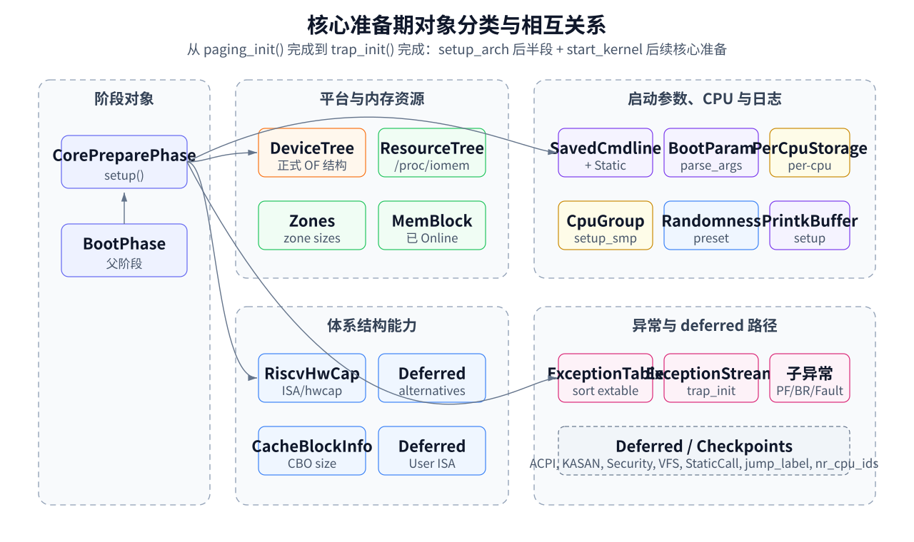

  图 12 核心准备期对象分类与相互关系

图 12 用于说明核心准备期涉及对象的分类与相互关系。`CorePreparePhase` 作为阶段对象承接 `EntrySuccessorPhase`，并在完整内核虚拟地址空间已经启用的前提下，继续推进正式 `DeviceTree`、zone/resource、CPU/per-cpu、命令行与启动参数、随机性、日志、异常表和异常流。图中的 deferred/impl checkpoint 区域表示当前必须保留调用位置和语义约束，但暂不进入 formal object 的路径。

本子阶段的结束状态至少包含：

- `EntrySuccessorPhase.state == Ready`，表示完整内核虚拟地址空间已经启用
- `VM.state == Online`
- `SwapperVM.state == Online`
- `MemBlock.state == Online`
- `DeviceTree.state == Ready`
- `Zones.state == Ready`
- `ResourceTree.state == Ready`
- `CpuGroup.state == Ready`，表示 CPU 拓扑事实和 secondary CPU 候选集合已经建立，但 secondary CPU 尚未 online
- `CacheBlockInfo.state == Ready`
- `CpuCapabilities.state == Ready`
- `DmaCachePolicy.state == Ready`
- `CommandLine.state == Ready`
- `SavedCommandLine.state == Ready`
- `StaticCommandLine.state == Ready`
- `PerCpuStorage.state == Ready`
- `PerCpuStaticImage.state == Ready`
- `PerCpuFirstChunk.state == Ready`
- `PerCpuOffsetTable.state == Ready`
- `CpuHotplugState.state == Ready`
- `Params.state == Ready`
- `BootParam.state == Ready`
- `PayloadParam.state == Ready`
- `Randomness.state == Prepared`
- `PrintkBuffer.state == Ready`
- `ExceptionTable.state == Ready`，表示主异常表已经排序且可查询
- `ExceptionStream.state == Ready`，表示正式异常分类和分发框架已经建立
- `PageFaultException.state == Ready`，表示 page fault 已被正式异常分发框架识别，但不等于 page fault 恢复机制已经可用
- `BreakpointException.state == Ready`
- `UnexpectedException.state == Ready`
- `SyscallException.state == Prepared`，表示 syscall/ecall 仍停留在兜底处理状态，后续用户态路径建立后再推进
- 当前仍保持 `System Exclusive`，中断、任务调度和多 hart 并发进入路径仍未开放

##### 核心准备期对象构建时序

本小节用于补充 `CorePreparePhase` 如何编排本子阶段中已进入 formal model 的对象、deferred 路径和实现 checkpoint。图 13 的顺序按 Linux/RISC-V 启动调用顺序组织，但 formal model 只吸收已经讨论确定的抽象对象；checkpoint 只约束实现生成和 trace，不推进规格状态。

  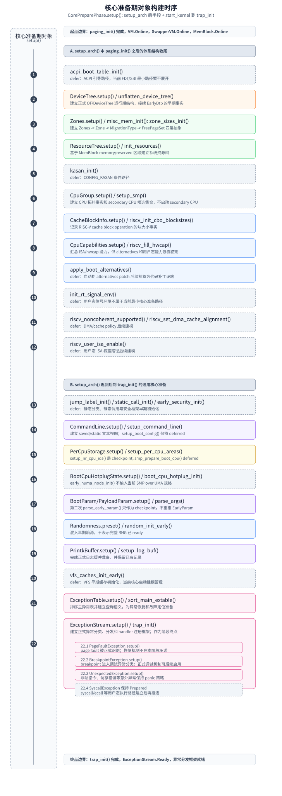

  图 13 核心准备期对象构建时序

图 13 将核心准备期的 `setup` 过程表示为两段连续编排：第一段完成 `setup_arch()` 在 `paging_init()` 之后的体系结构收尾；第二段完成 `setup_arch()` 返回后到 `trap_init()` 的通用核心准备。图中标记为 formal 的项目已经进入模型；标记为 deferred 的项目保留调用位置但延后建模；标记为 checkpoint 的项目只指导实现阶段插入可观测检查。

##### 核心准备期过程处理清单

##### `setup_arch()` 中 `paging_init()` 之后的过程

| Linux 调用 | 规格处理 | 备注 |
|---|---|---|
| `acpi_boot_table_init()` | deferred | 当前最小路径以 FDT/SBI 为主；ACPI 引导路径后续单独建模。 |
| `unflatten_device_tree()` / `unflatten_and_copy_device_tree()` | formal: `DeviceTree.setup()` | 基于 `RawDtb` 建立正式 OF/DeviceTree 运行期结构；展开存储由 `MemBlock` 分配，编码阶段按两次遍历完成校验、计量、分配和填充。 |
| `misc_mem_init(): early_memtest()` | deferred | 可选内存测试路径，不改变当前最小启动语义。 |
| `misc_mem_init(): arch_numa_init()` | 不纳入当前规格 | 当前规格限定 SMP over UMA，不支持 NUMA；该项不是 deferred。 |
| `misc_mem_init(): sparse_init()` | deferred | SPARSEMEM 元数据后续随完整内存模型展开。 |
| `misc_mem_init(): local_flush_tlb_kernel_range(VMEMMAP_START, VMEMMAP_END)` | deferred | SPARSEMEM_VMEMMAP 条件路径。 |
| `misc_mem_init(): zone_sizes_init()` | formal: `Zones.setup()` | 建立 `Zones -> Zone -> OrderClass -> MigrationType -> FreePageSet` 五层抽象；当前固定 `DMA32`、`NORMAL`、`MOVABLE` 三类逻辑 zone，允许空范围。 |
| `misc_mem_init(): arch_reserve_crashkernel()` | deferred | crashkernel 资源保留路径后续展开。 |
| `misc_mem_init(): memblock_dump_all()` | implementation checkpoint | 只观察和输出 `MemBlock` 状态，不推进规格状态。 |
| `init_resources()` | formal: `ResourceTree.setup()` | 建立 system RAM、reserved 和 kernel image/code/data/bss 资源关系。 |
| `kasan_init()` | deferred | `CONFIG_KASAN` 条件路径。 |
| `setup_smp()` | formal: `CpuGroup.setup()` | 建立 CPU 拓扑事实和 secondary CPU 候选集合，不启动 secondary CPU。 |
| `acpi_init_rintc_map()` | deferred | ACPI enabled 时执行，依赖 ACPI 引导模型。 |
| `acpi_map_cpus_to_nodes()` | deferred | ACPI/NUMA/CPU 拓扑相关，依赖前置 ACPI/NUMA 模型。 |
| `riscv_init_cbo_blocksizes()` | formal: `CacheBlockInfo.setup()` | 从 CPU nodes 初始化平台级 CBOM/CBOZ block size 事实；CBOP 暂缓。 |
| `riscv_fill_hwcap()` | formal: `CpuCapabilities.setup()` | 汇总 CPU 集合的 ISA/hwcap 能力事实，并校验 Zicbom/Zicboz 对 CacheBlockInfo 的依赖。 |
| `apply_boot_alternatives()` | deferred | 启动期 alternatives patch 后续抽象为代码补丁设施。 |
| `init_rt_signal_env()` | deferred | 用户态信号环境不属于当前最小核心准备路径。 |
| `riscv_noncoherent_supported()` / `riscv_set_dma_cache_alignment()` | formal: `DmaCachePolicy.setup()` | 建立 non-coherent DMA 支持与 `dma_cache_alignment` 事实，供后续 `mem_init()` 中的 SWIOTLB/bounce 决策消费。 |
| `riscv_user_isa_enable()` | deferred | 用户态 ISA 暴露路径后续建模。 |

##### `setup_arch()` 返回后到 `trap_init()` 的过程

| Linux 调用 | 规格处理 | 备注 |
|---|---|---|
| 通用 `start_kernel(): jump_label_init()` | checkpoint | 当前 RISC-V 路径中 `StaticBranch` 已经 `Ready`，该调用按幂等 checkpoint 处理，不推进状态。 |
| `static_call_init()` | deferred | 静态调用是调用目标代码补丁设施，当前不进入核心模型。 |
| `early_security_init()` | deferred | LSM/security 框架依赖后续任务、凭据和安全对象。 |
| `setup_boot_config()` | deferred | bootconfig/XBC/initrd 派生参数后续作为参数来源展开。 |
| `setup_command_line()` | formal: `CommandLine.setup()` | 建立 saved/static 命令行视图；只处理命令行副本，不合并后续 Param 解析时序。 |
| `setup_nr_cpu_ids()` | implementation checkpoint | Linux 中是 cpumask/per-cpu 数组上界；规格模型不需要 `CpuIdMap.nr_ids`。实现只检查 `CpuIdMap[0] == BootCPU` 和 possible CPU 映射边界，不推进状态。 |
| `setup_per_cpu_areas()` | formal: `PerCpuStorage.setup()` | 建立 `PerCpuStaticImage`、`PerCpuFirstChunk` 和 `PerCpuOffsetTable`，完整动态 allocator 后续展开。 |
| `smp_prepare_boot_cpu()` | deferred | RISC-V64 当前弱实现为空，不建立额外对象。 |
| `early_numa_node_init()` | 不纳入当前规格 | 当前规格限定 SMP over UMA，不支持 NUMA；该项不是 deferred。 |
| `boot_cpu_hotplug_init()` | formal: `CpuHotplugState.setup()` | `CpuHotplugState` 是 CPUObject 的子对象；当前先建立 BootCPU 的 hotplug 状态。 |
| `parse_early_param()` | implementation checkpoint | 第二次 early param 调用不得重新推进 `EarlyParam` 或 `EarlyCon`。 |
| `parse_args("Booting kernel", ...)` | formal: `Params.setup()` drives `BootParam.setup()` | 普通内核参数解析，不同于 `EarlyParam`。 |
| `print_unknown_bootoptions()` | implementation checkpoint | 只输出 `BootParam` 收集到的未知选项，不改变 `BootParam` 状态。 |
| `parse_args("Setting init args", ...)` | formal: `Params.setup()` drives `PayloadParam.setup()` | 处理 `--` 后传给最终 payload 的参数，允许为空。 |
| `parse_args("Setting extra init args", ...)` | deferred | bootconfig `init.*` 路径随 `BootConfig` 展开。 |
| `random_init_early()` | formal: `Randomness.preset()` | 混入早期熵源，不表示完整 RNG 已 ready。 |
| `setup_log_buf()` | formal: `PrintkBuffer.setup()` | 完成正式日志缓冲准备并保留已有记录，不新建 `LogBuffer`。 |
| `vfs_caches_init_early()` | deferred | VFS/inode/dentry 缓存不属于当前核心启动模型。 |
| `sort_main_extable()` | formal: `ExceptionTable.setup()` | 必须排序主异常表并建立可查询语义。 |
| `trap_init()` | formal: `ExceptionStream.setup()` 和子异常 setup | 阶段终点；建立正式异常分类、分发和 handler 注册框架。 |

#### 子阶段 4：内存核心初始化期（MM Core Init Subphase）

第四个子阶段对应 Linux 6.12.37 `start_kernel()` 中 `mm_core_init()` 的内部内容。它从 `trap_init()` 完成后开始，在 `mm_core_init()` 返回时结束；后续的 `poking_init()`、`ftrace_init()`、`sched_init()`、IRQ/time/RCU/workqueue 初始化和 `local_irq_enable()` 都不属于本子阶段。

本小节作为 `BootPhase` 子阶段 4 的讨论落点。新增讨论应先在这里明确 `mm_core_init()` 内部对象边界、阶段边界、状态推进和检查项；只有当语义已经稳定，才同步进入形式化模型、图示和对象级实现。若正文解释、形式化模型和实现之间出现差异，应优先回到本节确认设计意图，再更新可验证模型和代码。

本子阶段仍处于 `引导期` 的 `System Exclusive` 上下文中。中断仍关闭，普通任务调度尚未启动，secondary hart 也尚未进入并发执行路径。因此，本阶段中的内存对象建立仍按单根流独占推进来理解。

从边界上看，本子阶段的输入至少包括：

- `CorePreparePhase.state == Ready`
- `ExceptionStream.state == Ready`
- `MemBlock.state == Online`
- `Zones.state == Ready`
- `CpuGroup.state == Ready`
- `CpuIdMap.state == Ready`
- `DmaCachePolicy.state == Ready`
- `PerCpuStorage.state == Ready`
- `PrintkBuffer.state == Ready`
- `StaticBranch.state == Ready`
- `VM.state == Online`
- `SwapperVM.state == Online`
- 当前仍保持 `System Exclusive`

本子阶段的输出目标是把“早期内存描述和 memblock 分配能力”推进为“核心内存管理基础可用”。这里的“核心内存管理基础可用”至少包含：zonelist 已建立，页分配器 hotplug/pcp 基础钩子已登记，架构 `mem_init()` 已把 memblock 管理的可用页交接给页分配器并完成 RISC-V 所需的 `swiotlb`/内存布局收尾，SLUB/kmalloc 分配器可用，内存调试/硬化状态完成当前配置下的初始化，页表相关缓存可用，vmalloc/vmap 基础可用，`mm_struct` 等基础 cache 可用。`ExecMemory` 在当前默认配置下未被 `MODULES`、`BPF_JIT` 或 `KPROBES` 选中，视为裁剪路径；后续若启用相关功能，再作为正式对象展开。

当前 Linux 参照配置以 `~/gitStudy/linux-6.12.37/default_config` 为准。与本子阶段相关的关键配置包括：`CONFIG_64BIT=y`、`CONFIG_MMU=y`、`CONFIG_FLATMEM=y`、`CONFIG_SLUB=y`、`CONFIG_SPLIT_PTE_PTLOCKS=y`、`CONFIG_STACKDEPOT=y`、`CONFIG_DEBUG_PAGEALLOC=y`、`CONFIG_DEBUG_VM=y`、`CONFIG_SWIOTLB=y`、`CONFIG_DMA_BOUNCE_UNALIGNED_KMALLOC=y`；同时 `CONFIG_INIT_ON_ALLOC_DEFAULT_ON`、`CONFIG_INIT_ON_FREE_DEFAULT_ON`、`CONFIG_DEBUG_PAGEALLOC_ENABLE_DEFAULT`、`CONFIG_PAGE_POISONING`、`CONFIG_PAGE_EXTENSION`、`CONFIG_KFENCE`、`CONFIG_KMSAN`、`CONFIG_DEBUG_KMEMLEAK`、`CONFIG_DEBUG_OBJECTS`、`CONFIG_KASAN`、`CONFIG_MODULES`、`CONFIG_BPF_JIT` 和 `CONFIG_KPROBES` 均未启用。因此，本阶段图示和清单先按该配置区分主线 formal、checkpoint 与裁剪 no-op 路径。

本小节使用的标准生命周期语义扩展为 `Base -> Prepared -> Ready -> Online -> Offline -> Destroyed`。其中 `Offline` 表示对象的主要服务能力或资源所有权已经退出运行路径，但对象元数据仍可用于诊断、引用收尾或后续销毁；对多数启动对象，`Offline` 可以是空动作或短路边界。`handoff` 只作为 `Offline` 的资源交接别名，`discarded` 只作为 `Destroyed` 的资源丢弃别名，不引入新的状态名。`State::Offline` 与 `Event::Disable` 已进入 `spec/model/SEMANTICS.md` 和 model checker；配置裁剪路径继续写为 `trimmed` 或“裁剪路径”，不把它当作对象状态；`Skipped` 只可作为讨论中的自然语言，不进入 formal model、规格清单或 coding 实现。编译期约束、一次性验证、日志输出、策略选择和临时占位初始化若不形成长期对象生命周期，统一写为 `checkpoint`，不引入未定义的 `Checked`、`Decided`、`Emitted`、`Registered` 等状态名。

针对 `build_all_zonelists(NULL)`，本阶段引入一层显式内存拓扑对象，而不是把 zonelist 直接挂在页分配器对象下。顶层对象暂名 `MemoryTopology`，它包含一个或多个 `MemoryNode`。在当前 `default_config` 的 `CONFIG_NUMA=n` 下，系统只有唯一的 `MemoryNode[0]`；后续若支持 NUMA，`MemoryTopology` 可以自然扩展为多个 `MemoryNode`。每个 `MemoryNode` 对应 Linux 的 `pg_data_t`，拥有 `ZoneSet` 和 `ZonelistSet` 两类下级对象：`ZoneSet` 承载本节点实际拥有的 `Zone`，`ZonelistSet` 承载本节点发起分配时可消费的 zone 选择顺序。`Zoneref` 只引用 `Zone`，不拥有 `Zone`；在 NUMA 配置下，一个节点的 `Zonelist` 可以引用其他节点拥有的 `Zone`，而 UMA 配置下当前只引用唯一节点自己的 populated zones。

当前先将子阶段 4 的对象和边界记录如下：

1. `内存核心初始化期对象`（暂名 `MmCoreInitPhase`）：属于阶段对象，是 `BootPhase` 的第四个子阶段对象。它从 `ExceptionStream.Ready` 接续核心准备期，并以 `mm_core_init()` 返回作为阶段完成边界。
2. `内存拓扑对象`（暂名 `MemoryTopology`）：覆盖页分配器可见的物理内存节点组织。当前 UMA 配置下只有 `MemoryNode[0]`；NUMA 扩展时可包含多个 `MemoryNode`，每个节点维护自己的 zone 集合和 zonelist 集合。
3. `内存节点对象`（暂名 `MemoryNode`）：对应 Linux `pg_data_t`。它拥有 `ZoneSet`（Linux `node_zones[MAX_NR_ZONES]`）和 `ZonelistSet`（Linux `node_zonelists[MAX_ZONELISTS]`）。`build_all_zonelists(NULL)` 不创建 `Zone`，而是基于已经 populated 的 `ZoneSet` 构造 `ZonelistSet`。
4. `ZoneSet` 与 `ZonelistSet`：`ZoneSet` 是节点拥有的 zone 实体集合；`ZonelistSet` 是节点拥有的 zone 选择视图。当前 `CONFIG_NUMA=n` 时 `ZonelistSet` 只包含 `ZONELIST_FALLBACK`；`ZONELIST_NOFALLBACK` 是 NUMA 配置下为 `__GFP_THISNODE` 保留的扩展路径。
5. `Zonelist` 与 `Zoneref`：`Zonelist` 保存按 fallback 优先级排列的 `Zoneref[]`。每个有效 `Zoneref` 记录 `zone*` 和 `zone_idx`，末尾必须有 `zone == NULL` 的哨兵项。`Zoneref` 只引用 `Zone`，不拥有 `Zone`。
6. `页分配器对象`（暂名 `PageAllocator`）：覆盖 `build_all_zonelists(NULL)`、`page_alloc_init_cpuhp()`、架构 `mem_init()` 中的 `memblock_free_all()`，并为后续 `page_alloc_init_late()` 保留 `enable()` slot。`PageAllocator.preset()` 合并相邻的 `build_all_zonelists(NULL)` 与 `page_alloc_init_cpuhp()`：前者建立 `MemoryNode[*].ZonelistSet.Ready`，后者向既有 `CpuHotplugState.step_registry` 登记 `CPUHP_PAGE_ALLOC` step 回调，但不推进 `CpuHotplugState.state`。`PageAllocator.setup()` 对应 `memblock_free_all()`，把 `MemBlock` 中可释放页迁移到 buddy 体系；该体系按 `Zone -> OrderClass -> MigrationType -> FreePageSet` 表达，其中 `OrderClass` 对应 buddy order 维度。`PageAllocator.enable()` 留给 `page_alloc_init_late()`，不在本子阶段消耗。
7. `SWIOTLB 对象`（暂名 `Swiotlb`）：覆盖 RISC-V `mem_init()` 中的 `swiotlb_init(swiotlb, SWIOTLB_VERBOSE)`。它依赖 `DmaCachePolicy.Ready`、`MemBlock.Online`、`Zones.Ready` 和 `dma32_phys_limit` 等事实，在 `memblock_free_all()` 之前通过 memblock 预留并初始化 default bounce buffer、slot 和 area 元数据；如果当前启动不需要 early SWIOTLB pool，则仍记录 `pool_required=false` 并进入 `Ready`。它不是通用 DMA API 对象；本阶段只关心释放 memblock 页前必须完成的 early SWIOTLB 池建立。`CONFIG_SWIOTLB_DYNAMIC=n`，因此动态增长路径当前不进入主线。
8. `页扩展对象`（暂名 `PageExt`）：覆盖 `page_ext_init_flatmem()`、`page_ext_init_flatmem_late()` 和条件执行的 `page_ext_init()`。当前默认配置 `CONFIG_PAGE_EXTENSION=n`，因此本对象不进入主线 formal，只在过程清单中保留裁剪位置。
9. `内存调试与硬化对象`（暂名 `MemoryDebugHardening`）：覆盖 `mem_debugging_and_hardening_init()` 与 `report_meminit()`。它依赖 `StaticBranch.Ready`，消费前序 `EarlyParam` 已经解析出的内存调试/硬化参数事实，汇总 `init_on_alloc`、`init_on_free`、page poisoning、debug pagealloc、debug guardpage、check_pages 等配置和启动参数结果，并通过 `StaticBranch.set(key, value)` action 收敛相关 static key；其中 `report_meminit()` 主要作为状态报告或 checkpoint，不单独推进对象生命周期。
10. `内存检测辅助对象`（暂名 `MemorySanitizers`）：覆盖 `kfence_alloc_pool_and_metadata()`、`kmsan_init_shadow()` 和 `kmsan_init_runtime()`。当前默认配置未启用 `KFENCE` 和 `KMSAN`，因此不进入主线 formal。
11. `StackDepot`：覆盖 `stack_depot_early_init()`，为 page owner、kmemleak 等后续调试路径提供调用栈存储基础。
12. `SLUB 分配器对象`（暂名 `SlubAllocator`）：覆盖 `kmem_cache_init()`。当前默认配置选择 `CONFIG_SLUB=y`，因此本对象按 SLUB 自举路径建模。Linux 内部 `slab_state` 与规格生命周期的映射为：`DOWN -> Base`、`PARTIAL -> Prepared`、`UP -> Ready`、`FULL -> Online`。本子阶段只推进到 `UP/Ready`；`kmem_cache_init_late()` 作为后续 action 处理 flush workqueue，`slab_sysfs_init()` 才会把 Linux 内部状态推进到 `FULL/Online`。
13. `SLUB cache registry`（暂名 `SlubCacheRegistry`）：对应 Linux 全局 `slab_caches` 列表及其互斥/注册边界。它是独立对象，不并入 `SlubAllocator`。`kmem_cache_init()` 期间，boot cache 和 bootstrap 后的正式 cache 都必须进入该 registry；后续创建普通 cache 时也通过它维护全局可枚举关系。
14. `SLUB cache 对象`（暂名 `SlubCache`）：对应单个 `struct kmem_cache`。每个 `SlubCache` 拥有自己的 `SlubNodeSet` 与 `SlubCpuCacheSet`：前者描述 per-node partial/full slab 视图，后者描述 per-CPU 当前 slab、partial slab 和统计缓存。当前不把 `SlubNodeSet`、`SlubCpuCacheSet` 提升为顶层对象。
15. `kmalloc cache 集合对象`（暂名 `KmallocCaches`）：对应 `kmalloc_caches[][]` 与 `kmalloc_size_index[]`。它由 `SlubAllocator` 驱动建立，但作为独立对象表达 size-class 到 `SlubCache` 的映射关系；当前 `CONFIG_RANDOM_KMALLOC_CACHES=n` 且 `CONFIG_MEMCG=n`，只建模默认 kmalloc cache 集。
16. `Kmemleak`：覆盖 `kmemleak_init()`。当前默认配置 `CONFIG_DEBUG_KMEMLEAK=n`，因此不进入主线 formal。
17. `PageTableCaches`：覆盖 `ptlock_cache_init()` 与 `pgtable_cache_init()`。它的中心功能是为后续页表操作准备页表锁 cache，并补齐当前架构需要预先建立的 kernel page table 范围。`PageTableLockCache` 作为下级对象对应 `page_ptl_cachep`，依赖 `SlubAllocator.Ready` 创建 `"page->ptl"` cache，后续服务 `ptlock_alloc()` / `ptlock_free()`。RISC-V `pgtable_cache_init()` 对应 `PageTableCaches.setup()` 内的 `KernelPgtablePreallocation` action/fact，不作为顶层对象；当前 `default_config` 下主线只预分配 `VMALLOC_START..VMALLOC_END`，`MODULES=n` 跳过 modules/BPF 区，`CONFIG_MEMORY_HOTPLUG` 未启用，因此 vmemmap/direct map/KASAN 相关分支不进入主线。
18. `DebugObjectsMemory`：覆盖 `debug_objects_mem_init()`。当前默认配置 `CONFIG_DEBUG_OBJECTS=n`，因此不进入主线 formal。
19. `VmallocAllocator`：覆盖 `vmalloc_init()`。它是管理 vmalloc/vmap 虚拟地址空间的 allocator，不是页表映射器，也不等同于所有 vmalloc API 行为。它拥有 `VmapAddressSpace`、`VmapNodeSet`、`VmapAreaCache`、`VmapBlockQueues` 和 `VfreeDeferredSet`：`VmapAddressSpace` 是资源本体，拥有 `VmapArea` 区间集合；`VmapNodeSet` 是管理索引/分片组织，indexes/partitions `VmapAddressSpace`，但不拥有虚拟地址资源本身。`vmalloc_init()` 建立 `vmap_area` cache、per-CPU vmap block 队列、per-CPU deferred free 队列、vmap node，导入已有 `vmlist` 为 busy areas，建立 free vmap space，并把 `vmap_initialized` 置为 true；`vmap-node` shrinker 注册作为后续 reclaim hook action/checkpoint。
20. `MmStructCache`：覆盖 `mm_cache_init()`，只建立 `"mm_struct"` cache。它依赖 `SlubAllocator.Ready` 和 CPU mask size 相关事实，计算 `sizeof(struct mm_struct) + cpumask_size() + mm_cid_size()`，并创建带 `saved_auxv` usercopy range 的 `mm_struct` SLUB cache。`vm_area_struct` cache、`vma_lock_cachep` 和 `mmap_init()` 属于后续 `proc_caches_init()`，不并入本子阶段。
21. `ExecMemory`：覆盖 `execmem_init()`。它建立后续模块、BPF JIT、kprobes 或类似可执行内存分配策略所需的范围信息。当前默认配置未启用 `MODULES`、`BPF_JIT` 和 `KPROBES`，`CONFIG_EXECMEM` 未被选中，因此本路径视为裁剪 no-op。
22. `Espfix` 与 `Pti`：覆盖 `init_espfix_bsp()` 与 `pti_init()`。在 RISC-V64 当前实现中它们为空 inline 或非目标架构路径，规格上不进入当前 formal model，只在过程清单中作为不适用项保留。

  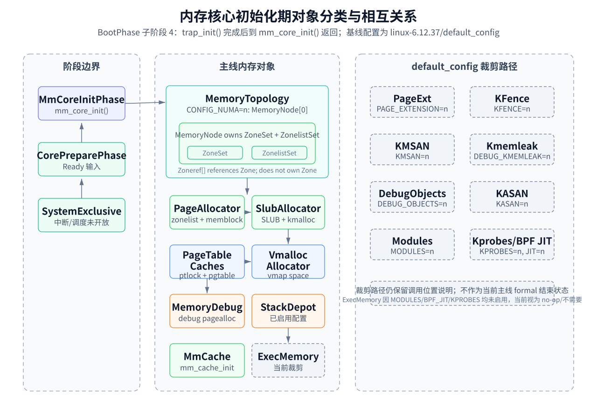

  图 14 内存核心初始化期对象分类与相互关系

图 14 用于说明子阶段 4 的对象分类与默认配置裁剪结果。左侧是阶段边界和前序状态，中间是当前主线对象以及 `MemoryTopology -> MemoryNode -> ZoneSet/ZonelistSet` 的层次，右侧是 `default_config` 下已经裁剪的条件路径。裁剪路径仍保留调用位置说明，但不作为本阶段主线 formal 结束状态。

##### 第一段：页分配器前置组织（初稿）

这一段覆盖 `BUILD_BUG_ON(MAX_ZONELISTS > 2)`、`build_all_zonelists(NULL)` 和紧随其后的 `page_alloc_init_cpuhp()`。其中 `BUILD_BUG_ON(MAX_ZONELISTS > 2)` 是编译期 checkpoint，用来约束当前实现最多处理两类 zonelist；它不推进运行期对象状态。`build_all_zonelists(NULL)` 是本段的中心转换：在 boot 路径中，它遍历所有 `MemoryNode`，用每个节点已经建立的 `ZoneSet` 构造 `ZonelistSet`。同一 boot 分支中的 `per_cpu_pages_init(&boot_pageset, &boot_zonestats)` 只作为 boot PCP 占位缓存 checkpoint：它保证早期 `zone->per_cpu_pageset` 引用有效，但当前阶段不建模 PCP 缓存策略，真正的 per-zone/per-cpu pageset 分配在后续 `setup_per_cpu_pageset()` 中完成，不属于本子阶段。`mminit_verify_zonelist()`、`cpuset_init_current_mems_allowed()`、mobility grouping 选择和末尾 `pr_info("Built %u zonelists...")` 同样作为 checkpoint 记录。

规格层把 `build_all_zonelists(NULL)` 与 `page_alloc_init_cpuhp()` 合并为 `PageAllocator.preset()`，因为二者在 `mm_core_init()` 中相邻，且都只建立页分配器后续可用前的组织事实：前者使 `MemoryNode[*].ZonelistSet.state == Ready`，后者向既有 `CpuHotplugState.step_registry` 登记 `CPUHP_PAGE_ALLOC` 的 page allocator online/dead 回调。`page_alloc_init_cpuhp()` 不推进 `CpuHotplugState.state`，也不在本阶段启动 secondary CPU；Linux 的 `CPUHP_PAGE_ALLOC` 属于 hotplug step 域，不混入生命周期状态。

当前 `CONFIG_NUMA=n` 时，该转换可以简化理解为：唯一 `MemoryNode[0]` 的 `ZoneSet` 已包含若干 `populated_zone(zone)`；`build_zonelists(pgdat)` 按 zone type 从高到低把这些 zone 写入 `MemoryNode[0].ZonelistSet[ZONELIST_FALLBACK].zoneref[]`，并追加 `zone == NULL` 的哨兵项。`ZonelistSet.Ready` 之后，后续页分配路径可以通过 `first_zones_zonelist()`、`next_zones_zonelist()` 和 `for_each_zone_zonelist*()` 消费同一套选择拓扑。

##### 第二段：页释放前的调试/硬化策略收敛（初稿）

这一段覆盖 `page_ext_init_flatmem()`、`mem_debugging_and_hardening_init()`、`kfence_alloc_pool_and_metadata()`、`report_meminit()`、`kmsan_init_shadow()` 和 `stack_depot_early_init()`，中心功能是把页分配器正式释放 memblock 页之前需要确定的调试、硬化和诊断策略收敛下来。其中 `PageExt`、`KFENCE` 和 `KMSAN` 在当前 `default_config` 下均为裁剪路径，保留调用位置但不形成主线对象状态；`StackDepot` 进入主线 formal，但它的中心语义是建立后续调试对象可复用的调用栈存储基础，后续单独展开。

`mem_debugging_and_hardening_init()` 是本段的中心转换。它不是分配器启用动作，而是读取 Kconfig 默认值和 `EarlyParam` 已经发布的早期参数事实，先处理 page poisoning 对 init-on-alloc/free 的优先级，再为 fast path 使用的 static keys 确定最终值。规格层不为 `init_on_alloc`、`init_on_free`、`_debug_pagealloc_enabled`、`_debug_guardpage_enabled` 和 `check_pages_enabled` 分别建立顶层对象；它们先作为 `MemoryDebugHardening` 的属性和 `StaticBranch` registry 中的 key 来表达。`MemoryDebugHardening.setup()` 必须要求 `StaticBranch.state == Ready`，并通过 `StaticBranch.set(key, value)` 更新需要显式启停的 key；该过程完成后，`MemoryDebugHardening.state == Ready`。

在当前 `default_config` 的基线下，`CONFIG_INIT_ON_ALLOC_DEFAULT_ON=n`、`CONFIG_INIT_ON_FREE_DEFAULT_ON=n`、`CONFIG_PAGE_POISONING=n`、`CONFIG_DEBUG_PAGEALLOC=y`、`CONFIG_DEBUG_PAGEALLOC_ENABLE_DEFAULT=n`、`CONFIG_DEBUG_VM=y`、`CONFIG_KMSAN=n`。因此，若运行时命令行没有额外打开相关 early params，本段的收敛结果是：`init_on_alloc` static key 为 off，`init_on_free` static key 为 off，page poisoning 路径裁剪，`_debug_pagealloc_enabled` 为 off，`_debug_guardpage_enabled` 为 off，`check_pages_enabled` 因 `CONFIG_DEBUG_VM=y` 保持 on。这里的 `init_on_alloc == off` 只表示该 static key 默认不要求普通分配清零；带 `__GFP_ZERO` 的具体分配仍可通过 `want_init_on_alloc(gfp)` 返回 true。

编码规格上，`MemoryDebugHardening` 至少应保存上述 resolved facts，并把 `setup()` 写成一次性收敛动作：它只消费配置常量和 `EarlyParam` 结果，不重新解析命令行；它只要求并使用 `StaticBranch` 已经建立的 registry，不在自身内部初始化 static branch 基础设施；重复设置同一 key 值必须保持幂等。`report_meminit()` 可实现为一个无状态推进的报告 action 或 checkpoint，输出必须来自 `MemoryDebugHardening` 已解析出的结果，而不是再次做策略决策。

##### 第三段：页分配器接收 memblock 页（初稿）

这一段对应架构 `mem_init()`，中心功能是把前面已经建立的内存拓扑、zone、zonelist 和调试策略推进到页分配器接收可用页的边界。开头的 `BUG_ON(!mem_map)` 是 checkpoint，用来确认 flatmem 下全局 page metadata 已经存在，不单独推进对象状态。RISC-V 当前路径先根据 `max_pfn > PFN_DOWN(dma32_phys_limit)` 判断是否存在 DMA32 可寻址边界之外的物理页；若没有这个寻址限制，但 `CONFIG_DMA_BOUNCE_UNALIGNED_KMALLOC=y` 且 `DmaCachePolicy.dma_cache_alignment != 1`，则会为 non-coherent 平台上的未对齐 kmalloc DMA 额外调整 SWIOTLB size，并把 `swiotlb` 需求置为 true。这个决策消费的是核心准备期已经收敛好的 `DmaCachePolicy` 事实，不应在 `mem_init()` 内重新探测 CPU/DTB 能力。

`swiotlb_init(swiotlb, SWIOTLB_VERBOSE)` 必须发生在 `memblock_free_all()` 之前，因为 early SWIOTLB 的 default bounce buffer、slot 数组和 area 数组仍通过 memblock 分配或保留。规格层把该动作记为 `Swiotlb.setup()`：当 `swiotlb == false` 且没有 force bounce 时，它可以只记录“不需要 early SWIOTLB 池”的 resolved fact；当 `swiotlb == true` 时，它建立 default SWIOTLB pool，使后续 DMA bounce 路径有可用池。当前 `CONFIG_SWIOTLB_DYNAMIC=n`，动态池增长和 late init 不在本子阶段展开。

`memblock_free_all()` 是 `PageAllocator.setup()` 的核心动作。它先处理未使用 memmap、重置各 zone 的 managed_pages 计数，然后遍历 memblock free ranges，把低端可管理物理页按最大可行 order 释放到 buddy/free page 集合，并将释放页数加入 `totalram_pages`。因此，本动作是 `MemBlock` 与 `PageAllocator` 之间的内部资源交接：`MemBlock.state` 从 `Online` 推进到 `Offline`，表示普通页分配不再通过 memblock；`PageAllocator.state` 推进到 `Ready`，表示 buddy 体系已经拥有可用页基础。buddy 的正式结构按 `Zone -> OrderClass -> MigrationType -> FreePageSet` 表达，其中 `OrderClass` 对应 Linux free_area 的 order 维度，`MigrationType` 对应每个 order 下的迁移类型 free list。

`print_vm_layout()` 在当前 `CONFIG_DEBUG_VM=y` 下作为 checkpoint 保留，用于输出 RISC-V 虚拟内存布局；它依赖 `VM.Online` 和架构地址空间常量，不推进 `PageAllocator` 或 `VM` 的生命周期。`page_alloc_init_late()` 中的 `memblock_discard()` 后续再把 `MemBlock` 私有元数据推进到 `Destroyed`，并作为 `PageAllocator.enable()` 的承载位置；它不属于本子阶段。`mem_init()` 返回后，后续 `kmem_cache_init()` 可以在 `PageAllocator.Ready` 基础上建立 SLUB/kmalloc caches。

##### 第四段：SLUB 分配器自举（初稿）

这一段对应 `kmem_cache_init()`，中心功能是建立可供后续内核对象使用的 SLUB/kmalloc 分配器。当前 `default_config` 选择 `CONFIG_SLUB=y`、`CONFIG_SLUB_TINY=n`、`CONFIG_SLUB_CPU_PARTIAL=y`、`CONFIG_SLUB_DEBUG=y`、`CONFIG_SLUB_DEBUG_ON=n`，并且 `CONFIG_SLAB_FREELIST_RANDOM=n`、`CONFIG_SLAB_FREELIST_HARDENED=n`、`CONFIG_RANDOM_KMALLOC_CACHES=n`、`CONFIG_MEMCG=n`。因此，本阶段按普通 SLUB 自举路径建模，不展开 memcg kmalloc、random kmalloc caches、freelist random/hardened 或 sysfs slab 管理路径。

规格层把 Linux 内部 `slab_state` 映射为 `SlubAllocator` 生命周期：`DOWN -> Base`、`PARTIAL -> Prepared`、`UP -> Ready`、`FULL -> Online`。`SlubAllocator.preset()` 建立 boot `kmem_cache_node`，并在 `slab_state = PARTIAL` 后进入 `Prepared`。由于 cache 管理结构本身也需要通过 SLUB 分配，Linux 使用静态 `boot_kmem_cache_node` 打开 per-node 元数据自举循环；当前 `CONFIG_MEMORY_HOTPLUG=n`，`hotplug_memory_notifier(...)` 不形成主线对象状态，只保留为条件路径位置。

`SlubAllocator.setup()` 继续建立 boot `kmem_cache`，随后执行 bootstrap：用已经可工作的 `kmem_cache` 为 `kmem_cache` 和 `kmem_cache_node` 两个静态 boot cache 分配正式 cache 对象，刷新当前 CPU slab 指针，并把已有 partial/full slab 的 `slab_cache` 指回正式 cache。这个动作的后置条件是 `SlubCache("kmem_cache")` 与 `SlubCache("kmem_cache_node")` 不再只是静态占位，而是进入 `SlubCacheRegistry` 维护的正常 cache 集合；每个 `SlubCache` 同时拥有自己的 `SlubNodeSet` 与 `SlubCpuCacheSet`。

随后 `setup_kmalloc_cache_index_table()` 建立小尺寸 kmalloc index 映射，`create_kmalloc_caches()` 建立 `KmallocCaches`；Linux 内部 `slab_state = UP` 表示 kmalloc 数组已经可用，对应 `SlubAllocator.state == Ready`、`SlubCacheRegistry.state == Ready` 和 `KmallocCaches.state == Ready`。`init_freelist_randomization()` 在当前配置下为空，不推进对象状态；`cpuhp_setup_state_nocalls(CPUHP_SLUB_DEAD, "slub:dead", NULL, slub_cpu_dead)` 只向既有 `CpuHotplugState.step_registry` 登记 SLUB dead 回调，不推进 `CpuHotplugState.state`，也不触发 CPU offline 回调。末尾 `pr_info("SLUB: ...")` 是 checkpoint。`kmem_cache_init_late()` 建立 flush workqueue，先作为 `SlubAllocator` 的后续 action 保留；`slab_sysfs_init()` 通过 `late_initcall` 使 Linux 内部 `slab_state = FULL`，对应后续 `SlubAllocator.enable()`，二者都在 `mm_core_init()` 之后，当前不进入子阶段 4。

##### 第五段：页表缓存与 vmalloc 地址空间准备（初稿）

这一段覆盖 `ptlock_cache_init()`、`pgtable_cache_init()` 和 `vmalloc_init()`。`ptlock_cache_init()` 是 `PageTableCaches.setup()` 中明确的对象建立动作：在当前 `CONFIG_SPLIT_PTE_PTLOCKS=y` 下，它创建 `PageTableLockCache`，即 Linux 的 `"page->ptl"` cache，后续 `ptlock_alloc()` / `ptlock_free()` 通过该 cache 管理 split page-table lock。`pgtable_cache_init()` 不是通用页表分配器初始化，而是架构页表范围预分配 action：RISC-V64 当前 `default_config` 下只要求预分配 `VMALLOC_START..VMALLOC_END`；`MODULES=n` 时 modules/BPF 范围不进入主线，`CONFIG_MEMORY_HOTPLUG` 未启用时 vmemmap/direct map/KASAN 分支也不进入主线。该 action 的结果落在 `SwapperVM` / kernel page table 能力事实上，不提升为独立顶层对象。

`vmalloc_init()` 对应 `VmallocAllocator.setup()`。本规格把它定义为 vmalloc/vmap 虚拟地址空间 allocator：核心职责是管理虚拟地址区间，而不是建立页表映射。`VmapAddressSpace` 是被管理的资源本体，拥有 `VmapArea` 区间集合；`VmapNodeSet` 是索引和分片组织，拥有 `VmapNode` 管理结构，并通过 `addr_to_node(addr)` 这类路由关系 indexes/partitions `VmapAddressSpace`。因此二者都由 `VmallocAllocator` 拥有，但二者之间不是资源拥有关系。

`VmallocAllocator.setup()` 还建立 `VmapAreaCache`、`VmapBlockQueues` 和 `VfreeDeferredSet`。`VmapAreaCache` 为 `VmapArea` 元数据提供 SLUB cache；`VmapBlockQueues` 初始化 per-CPU vmap block 队列和 xarray/hash 基础，只作为小块 vmap 快速路径基础，不展开 `vmap_block` bitmap 运行期语义；`VfreeDeferredSet` 初始化 per-CPU deferred free 队列和 work，保留给后续 `vfree()` 异步释放路径。导入已有 `vmlist` 是 `VmapAddressSpace.setup()` 内的动作：早期已有 vmalloc 区间被转换为 busy `VmapArea`，随后 `vmap_init_free_space()` 根据 gaps 建立 free `VmapArea`。`vmap_initialized = true` 是 `VmallocAllocator.Ready` 的可观测事实；`vmap-node` shrinker 注册作为 reclaim hook action/checkpoint。

##### 第六段：mm_struct cache 与裁剪收尾（初稿）

这一段覆盖 `mm_cache_init()` 和当前配置下的 `execmem_init()` 收尾。`MmStructCache.setup()` 只建立 `"mm_struct"` cache，不包含 `vm_area_struct` cache、`vma_lock_cachep` 或 `mmap_init()`；后三者属于后续 `proc_caches_init()`。`mm_cache_init()` 依赖 `SlubAllocator.Ready` 和 CPU mask size 相关事实，按 `sizeof(struct mm_struct) + cpumask_size() + mm_cid_size()` 计算对象大小，并创建带 `saved_auxv` usercopy range 的 SLUB cache；完成后 `MmStructCache.state == Ready`，后续进程/地址空间对象创建才消费该 cache。

`execmem_init()` 按当前 `default_config` 原则只记录为裁剪/no-op：`MODULES=n`、`BPF_JIT=n`、`KPROBES=n`，因此未选择 `CONFIG_EXECMEM`。本阶段不建立 `ExecMemory` 正式对象，也不讨论启用后的 arch range、default range 或 kprobes range。`page_ext_init_flatmem_late()`、`kmemleak_init()`、`debug_objects_mem_init()`、`page_ext_init()` 和 `kmsan_init_runtime()` 同样只保留当前配置下的调用位置和裁剪原因；`init_espfix_bsp()`、`pti_init()` 是 RISC-V64 当前不纳入路径。

##### 子阶段 4 过程处理清单（初稿）

| Linux 6.12.37 `mm_core_init()` 调用 | 规格处理 | 备注 |
|---|---|---|
| `BUILD_BUG_ON(MAX_ZONELISTS > 2)` | checkpoint | 编译期结构约束，不推进运行期对象状态。 |
| `build_all_zonelists(NULL)` | formal: `PageAllocator.preset()` / `MemoryNode[*].ZonelistSet.setup()` | 基于 `MemoryNode[*].ZoneSet` 建立 fallback zoneref 顺序；boot PCP 初始化、zonelist verify、cpuset mems allowed、mobility grouping 和 `pr_info` 输出均作为 checkpoint。 |
| `page_alloc_init_cpuhp()` | formal: `PageAllocator.preset()` | 向既有 `CpuHotplugState.step_registry` 注册 `CPUHP_PAGE_ALLOC` 的 page allocator online/dead 回调；不推进 `CpuHotplugState.state`，不启动 secondary CPU。 |
| `page_ext_init_flatmem()` | trimmed | `CONFIG_PAGE_EXTENSION=n`，当前默认配置下不建立 `PageExt`；其调用位置仍保留在 `MemoryDebugHardening` 前。 |
| `mem_debugging_and_hardening_init()` | formal: `MemoryDebugHardening.setup()` | 依赖 `StaticBranch.Ready`，消费 `EarlyParam` 事实，收敛 `init_on_alloc`、`init_on_free`、debug pagealloc、debug guardpage 和 page 检查相关 static key。当前基线下 alloc/free 初始化和 debug pagealloc 为 off，`check_pages_enabled` 因 `CONFIG_DEBUG_VM=y` 为 on。 |
| `kfence_alloc_pool_and_metadata()` | trimmed | `CONFIG_KFENCE=n`。 |
| `report_meminit()` | checkpoint | 输出内存自动初始化状态；当前基线下 heap alloc/free auto-init 均为 off，不单独推进对象生命周期。 |
| `kmsan_init_shadow()` | trimmed | `CONFIG_KMSAN=n`。 |
| `stack_depot_early_init()` | formal: `StackDepot.setup()` | `CONFIG_STACKDEPOT=y`，为 page owner、kmemleak 等调试路径提供栈存储基础。 |
| `mem_init()` | formal: `Swiotlb.setup()` + `PageAllocator.setup()` + `MemBlock.offline()` | RISC-V 路径先基于 `DmaCachePolicy`、`dma32_phys_limit` 和 `max_pfn` 决定并初始化 early SWIOTLB 池，再由 `memblock_free_all()` 把 memblock free ranges 释放到 buddy/page allocator；`BUG_ON(!mem_map)` 与 `print_vm_layout()` 是 checkpoint。 |
| `kmem_cache_init()` | formal: `SlubAllocator.preset/setup()` + `SlubCacheRegistry.setup()` + `KmallocCaches.setup()` | `CONFIG_SLUB=y`，建立 boot `kmem_cache_node`/`kmem_cache`，bootstrap 为正式 SLUB cache，创建 kmalloc caches，并登记 `CPUHP_SLUB_DEAD` 回调；freelist random 当前为空路径，`kmem_cache_init_late()` 不在本阶段。 |
| `page_ext_init_flatmem_late()` | trimmed | `CONFIG_PAGE_EXTENSION=n`。 |
| `kmemleak_init()` | trimmed | `CONFIG_DEBUG_KMEMLEAK=n`。 |
| `ptlock_cache_init()` | formal: `PageTableCaches.setup()` / `PageTableLockCache.setup()` | `CONFIG_SPLIT_PTE_PTLOCKS=y`，建立 `"page->ptl"` split page-table lock cache。 |
| `pgtable_cache_init()` | formal: `PageTableCaches.setup()` action | RISC-V64 当前主线预分配 `VMALLOC_START..VMALLOC_END` 的 kernel page table 范围；`MODULES=n`，`CONFIG_MEMORY_HOTPLUG` 未启用，modules/BPF、vmemmap/direct map/KASAN 分支当前被裁剪。 |
| `debug_objects_mem_init()` | trimmed | `CONFIG_DEBUG_OBJECTS=n`。 |
| `vmalloc_init()` | formal: `VmallocAllocator.setup()` | 建立 `VmapAreaCache`、`VmapBlockQueues`、`VfreeDeferredSet`、`VmapNodeSet` 和 `VmapAddressSpace`；导入早期 `vmlist` 为 busy areas，建立 free vmap space，并设置 `vmap_initialized=true`。 |
| `if (!deferred_struct_pages) page_ext_init()` | trimmed | `CONFIG_PAGE_EXTENSION=n`，不建立 `PageExt` final init。 |
| `init_espfix_bsp()` | 不纳入当前规格 | x86 特定路径，RISC-V64 当前为空。 |
| `pti_init()` | 不纳入当前规格 | x86 PTI 路径，RISC-V64 当前为空。 |
| `kmsan_init_runtime()` | trimmed | `CONFIG_KMSAN=n`。 |
| `mm_cache_init()` | formal: `MmStructCache.setup()` | 只建立 `"mm_struct"` cache；对象大小包含动态 `cpumask_size()` 与 `mm_cid_size()`，`vm_area_struct` cache 和 `mmap_init()` 属于后续 `proc_caches_init()`。 |
| `execmem_init()` | trimmed/no-op | `MODULES=n`、`BPF_JIT=n`、`KPROBES=n`，当前未选择 `CONFIG_EXECMEM`。 |

  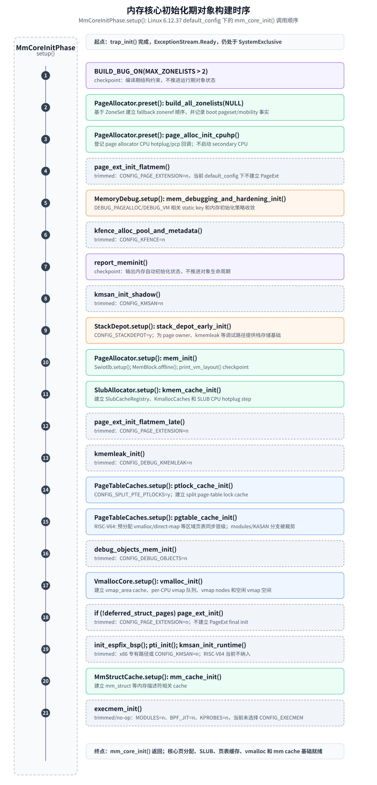

  图 15 内存核心初始化期对象构建时序

图 15 按 Linux 6.12.37 `mm_core_init()` 内部调用顺序展示子阶段 4 的推进过程。绿色节点表示当前 `default_config` 下的主线 formal 路径，紫色节点表示 checkpoint，灰色虚线节点表示已裁剪或在 RISC-V64 当前目标中不纳入的路径。

本子阶段的结束状态暂定至少包含：

- `CorePreparePhase.state == Ready`
- `ExceptionStream.state == Ready`
- `MemoryTopology.state == Ready`，当前 `CONFIG_NUMA=n` 下包含唯一的 `MemoryNode[0]`
- `MemoryNode[0].ZoneSet.state == Ready`
- `MemoryNode[0].ZonelistSet.state == Ready`，表示 `ZONELIST_FALLBACK` 已按 populated zones 建立并带有 NULL 哨兵
- `PageAllocator.state == Ready`，表示 zonelist topology、page allocator CPU hotplug hook registration 和 `memblock_free_all()` 后的可用页接收边界已经完成；`enable()` 留给后续 `page_alloc_init_late()`
- `MemBlock.state == Offline`，表示可释放页已经交接给 `PageAllocator`，但 memblock 私有元数据尚未由 `memblock_discard()` 丢弃
- `PageExt` 明确记录为当前配置不需要
- `MemoryDebugHardening.state == Ready`，表示内存调试/硬化 static keys 已按当前配置和早期参数事实完成收敛
- `Swiotlb.state == Ready` 或记录为当前启动不需要 early SWIOTLB pool
- `StackDepot.state == Ready`
- `SlubAllocator.state == Ready`，表示 SLUB/kmalloc caches 可用于后续内核对象分配
- `SlubCacheRegistry.state == Ready`，表示 `kmem_cache`、`kmem_cache_node` 和 kmalloc caches 已进入全局 cache registry
- `KmallocCaches.state == Ready`，表示 size-class 到 `SlubCache` 的映射已经建立
- `PageTableCaches.state == Ready`
- `PageTableLockCache.state == Ready`
- `VmallocAllocator.state == Ready`
- `VmapAreaCache.state == Ready`
- `VmapAddressSpace.state == Ready`
- `VmapNodeSet.state == Ready`
- `VmapBlockQueues.state == Ready`
- `VfreeDeferredSet.state == Ready`
- `MmStructCache.state == Ready`
- `ExecMemory` 明确记录为当前配置不需要
- 条件对象 `KFence`、`Kmsan`、`Kmemleak`、`DebugObjectsMemory` 已按 `default_config` 记录为裁剪路径
- 当前仍保持 `System Exclusive`，中断总开关、普通任务调度和多 hart 并发进入路径仍未开放

#### 子阶段 5：调度准备期（Scheduler Init Subphase）

第五个子阶段对应 Linux 6.12.37 `start_kernel()` 中 `mm_core_init()` 返回后，到 `context_tracking_init()` 完成的初始化段。它承接已经就绪的核心内存管理基础，先完成 trace 早期基础和 `sched_init()`，再建立通用索引、housekeeping、workqueue early、RCU 和 trace events，使系统拥有“中断打开前所需的调度与异步基础”。后续 IRQ、timer/timekeeping、softirq 和打开中断前收尾不属于本子阶段。

本小节作为 `BootPhase` 子阶段 5 的初步讨论落点。当前只做对象边界、Linux 调用分类、图示和结束状态的第一轮整理；后续逐个对象讨论稳定后，再同步进入形式化模型和 `impl/arceos_ex`。

本子阶段仍处于 `System Exclusive` 上下文中：中断总开关仍关闭，secondary hart 仍未启动，普通任务切换尚未进入并发运行。`sched_init()` 是本阶段中心动作，但不能被理解为完整 SMP 调度器已经完成；Linux 注释明确说明完整拓扑设置发生在 `smp_init()`，本阶段只要求 boot CPU 和 possible CPU 的 runqueue 元数据、idle task 关联、调度类顺序和基础调度钩子可解释。

从边界上看，本子阶段的输入至少包括：

- `MmCoreInitPhase.state == Ready`
- `PageAllocator.state == Ready`
- `SlubAllocator.state == Ready`
- `KmallocCaches.state == Ready`
- `CpuGroup.state == Ready`
- `CpuIdMap.state == Ready`
- `PerCpuStorage.state == Ready`
- `CpuHotplugState.state == Ready`
- `StaticBranch.state == Ready`
- `PrintkBuffer.state == Ready`
- 当前仍保持 `System Exclusive`，`early_boot_irqs_disabled == true`

当前 Linux 参照配置以 `~/gitStudy/linux-6.12.37/default_config` 为准。与本子阶段相关的关键配置包括：`CONFIG_SMP=y`、`CONFIG_PREEMPT=y`、`CONFIG_TREE_RCU=y`、`CONFIG_CONTEXT_TRACKING=y`、`CONFIG_CONTEXT_TRACKING_IDLE=y`、`CONFIG_TRACEPOINTS=y`、`CONFIG_TRACING=y`、`CONFIG_FTRACE=y`、`CONFIG_HAVE_DYNAMIC_FTRACE=y`；同时 `CONFIG_CGROUPS=n`、`CONFIG_NO_HZ_FULL=n`。因此，本阶段先按该配置区分主线 formal 候选、checkpoint 和 RISC-V 当前 no-op。

当前先将子阶段 5 的对象和边界记录如下：

1. `调度准备期对象`（暂名 `SchedulerInitPhase`）：属于阶段对象，是 `BootPhase` 的第五个子阶段对象。它从 `MmCoreInitPhase.Ready` 接续，按 `mm_core_init()` 后到 `context_tracking_init()` 完成的顺序编排对象推进。
2. `代码修改设施对象`（暂名 `TextPoking`）：覆盖 `poking_init()` 的调用位置。当前 RISC-V64 路径使用通用 weak no-op，不建立正式对象；x86/powerpc 等架构的 text poking 后续若进入目标，再单独建模。
3. `函数跟踪对象`（暂名 `FunctionTracer`）：覆盖 `ftrace_init()`。在 `CONFIG_FTRACE=y` 和动态 ftrace 支持存在时，它建立函数跟踪 call site 元数据和初始 patch/nop 状态。它依赖 `StaticBranch.Ready`、核心内存分配和异常/patch 安全边界；当前先作为 trace 子系统的一部分进入 formal 候选。
4. `早期 trace 对象`（暂名 `EarlyTrace`）：覆盖 `early_trace_init()`。它分配 trace buffer、初始化 early trace event 基础，并处理 `tracepoint_printk` 这类 boot 参数控制的早期输出路径。它不是普通 printk，也不同于本项目 checkpoint trace。
5. `调度器对象`（暂名 `Scheduler`）：覆盖 `sched_init()`。它建立调度类顺序检查、每 CPU runqueue、idle 任务关联、调度时钟基础、等待位基础和 boot CPU 的调度上下文。当前阶段只要求 boot CPU 上调度器基础可用，不启动 secondary CPU，不建立完整 SMP 调度域。
6. `基础集合索引对象`（暂名 `KernelCollections`）：覆盖 `radix_tree_init()` 和 `maple_tree_init()`。二者为后续 IDR/XArray、VMA tree 等内核基础索引结构提供缓存和预载基础；当前先作为通用基础设施对象或 checkpoint 候选保留。
7. `Housekeeping 对象`：覆盖 `housekeeping_init()`。它基于 boot 参数和 CPU mask 收敛 housekeeping CPU 集合，供 unbound workqueue、tick/nohz 和隔离 CPU 策略使用。当前 `NO_HZ_FULL=n`，但 housekeeping mask 仍作为 workqueue/tick 依赖事实存在。
8. `WorkqueueEarly 对象`：覆盖 `workqueue_init_early()`。它建立 system workqueue、worker pool、unbound cpumask、BH worker pool 和属性缓存，使早期代码可以创建 workqueue 并排队/取消 work item；实际 worker 执行要等 kthread 和后续 `workqueue_init()`。
9. `RCU 对象`：覆盖 `rcu_init()`。当前 `CONFIG_TREE_RCU=y`，本阶段建立 RCU 树几何、boot CPU online 事实、RCU softirq 绑定和 RCU workqueue；它依赖 scheduler/workqueue early 基础，但仍在中断关闭、单 CPU 运行的启动上下文中完成。
10. `TraceEvents 对象`：覆盖 `trace_init()`。它在 early trace 之后注册 trace event，必要时启用 boot trace instances，使 trace events 在本阶段之后可用。
11. `ContextTracking 对象`：覆盖 `context_tracking_init()` 的调用位置。当前配置启用 context tracking idle，但未启用 `CONFIG_CONTEXT_TRACKING_USER_FORCE`；因此该调用在 RISC-V64 当前基线上可作为 no-op/checkpoint 记录，后续若引入用户态上下文跟踪再展开。

  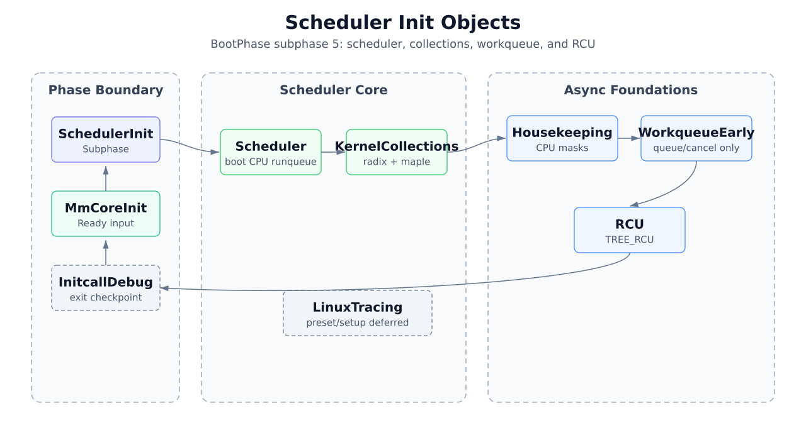

  图 16 调度准备期对象分类与相互关系

图 16 用于说明子阶段 5 的对象分类和依赖关系。左侧是阶段边界，中间是 `sched_init()` 及其前后的 trace/索引基础，右侧是 workqueue/RCU/trace events 与当前 no-op 路径。图中对象仍是初步分类，后续可以按讨论结果拆分或降级为 checkpoint。

##### 子阶段 5 过程处理清单（初稿）

| Linux 6.12.37 `start_kernel()` 调用 | 规格处理 | 备注 |
|---|---|---|
| `poking_init()` | RISC-V64 no-op/checkpoint | 当前 RISC-V64 使用 weak no-op；text poking 后续随代码补丁设施展开。 |
| `ftrace_init()` | formal candidate: `FunctionTracer.setup()` | `CONFIG_FTRACE=y`，建立函数跟踪 call site 和动态 ftrace 基础。 |
| `early_trace_init()` | formal candidate: `EarlyTrace.setup()` | 分配 trace buffer，初始化 early trace event 基础；不同于 checkpoint trace。 |
| `sched_init()` | formal candidate: `Scheduler.setup()` | 本阶段中心动作；建立 boot CPU 调度器基础，完整 SMP 调度域留给后续 `sched_init_smp()`。 |
| `WARN(!irqs_disabled(), ...)` | checkpoint | 检查中断没有被过早打开。 |
| `radix_tree_init()` | formal candidate/checkpoint: `KernelCollections.setup()` | 通用索引基础设施，后续可按使用者拆分。 |
| `maple_tree_init()` | formal candidate/checkpoint: `KernelCollections.setup()` | VMA tree 等后续对象依赖；当前先保留为基础设施候选。 |
| `housekeeping_init()` | formal candidate: `Housekeeping.setup()` | 收敛 housekeeping CPU mask，供 workqueue/tick/nohz 使用。 |
| `workqueue_init_early()` | formal candidate: `WorkqueueEarly.setup()` | 允许创建 workqueue 和排队/取消 work item；不执行 worker kthread。 |
| `rcu_init()` | formal candidate: `Rcu.setup()` | `CONFIG_TREE_RCU=y`，建立 RCU 树、boot CPU online、RCU softirq 和 RCU workqueues。 |
| `trace_init()` | formal candidate: `TraceEvents.setup()` | trace events 在此之后可用。 |
| `initcall_debug_enable()` | checkpoint/deferred | 只在 `initcall_debug` 参数开启时影响后续 initcall 诊断。 |
| `context_tracking_init()` | no-op/checkpoint | 当前未启用 `CONFIG_CONTEXT_TRACKING_USER_FORCE`；作为本阶段结束边界。 |

  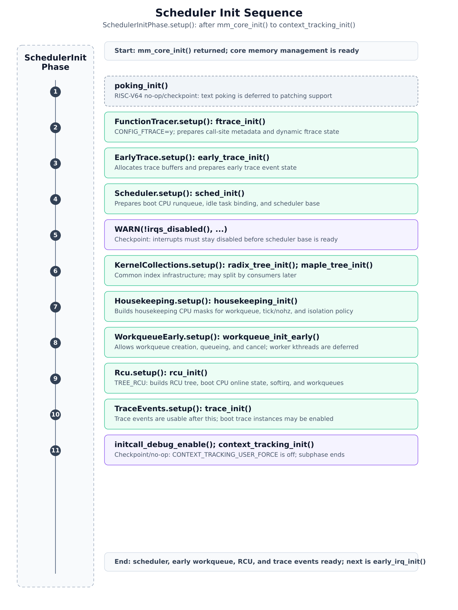

  图 17 调度准备期对象构建时序

图 17 按 Linux 6.12.37 `start_kernel()` 中 `mm_core_init()` 后到 `context_tracking_init()` 完成的调用顺序展示子阶段 5 的推进过程。绿色节点表示当前主线 formal 候选，紫色节点表示 checkpoint，灰色虚线节点表示 RISC-V64 no-op 或当前配置下暂不展开的路径。

本子阶段的结束状态暂定至少包含：

- `MmCoreInitPhase.state == Ready`
- `Scheduler.state == Ready`，表示 boot CPU 调度基础、runqueue 和 idle task 关联已经建立
- `FunctionTracer.state == Ready` 或按当前实现记录为 checkpoint
- `EarlyTrace.state == Ready`
- `KernelCollections.state == Ready` 或保留 radix/maple 初始化 checkpoint
- `Housekeeping.state == Ready`
- `WorkqueueEarly.state == Ready`，表示 workqueue 可创建、work item 可排队/取消，但 worker kthread 尚未执行
- `Rcu.state == Ready`，表示 TREE_RCU boot CPU 基础、RCU softirq 和 RCU workqueue 已建立
- `TraceEvents.state == Ready`
- `ContextTracking` 按当前配置记录为 no-op/checkpoint，或后续配置展开为 `Ready`
- 中断总开关仍处于关闭状态；下一子阶段从 `early_irq_init()` 开始

#### 子阶段 6：中断时间准备期（IRQ and Time Init Subphase）

第六个子阶段对应 Linux 6.12.37 `start_kernel()` 中 `context_tracking_init()` 完成后，到 `local_irq_enable()` 执行前的初始化段。它承接调度准备期已经建立的 scheduler/RCU/workqueue/trace 基础，建立 IRQ 控制器、tick/timer/timekeeping、softirq、完整随机数初始化、perf/profile 和 SMP call function 基础，使系统到达“可以打开中断”的边界。`local_irq_enable()` 本身是后续阶段的开门动作，不属于本子阶段主体。

本子阶段仍处于 `System Exclusive` 上下文中：中断总开关仍关闭，secondary hart 仍未启动，普通任务切换尚未进入并发运行。但本阶段建立的是中断开放后会立即被消费的控制结构：timer interrupt、softirq、RCU nohz、RISC-V irq stack、SBI IPI、clockevent/clocksource、完整 RNG 和 call function 都必须在中断开放前处于可解释状态。

从边界上看，本子阶段的输入至少包括：

- `Scheduler.state == Ready`
- `WorkqueueEarly.state == Ready`
- `Rcu.state == Ready`
- `TraceEvents.state == Ready`
- `DeviceTree.state == Ready`
- `SBI.state == Ready`
- `CpuGroup.state == Ready`
- `PerCpuStorage.state == Ready`
- 当前仍保持 `System Exclusive`，`early_boot_irqs_disabled == true`

当前 Linux 参照配置以 `~/gitStudy/linux-6.12.37/default_config` 为准。与本子阶段相关的关键配置包括：`CONFIG_IRQ_STACKS=y`、`CONFIG_VMAP_STACK=y`、`CONFIG_SOFTIRQ_ON_OWN_STACK=y`、`CONFIG_NO_HZ_IDLE=y`、`CONFIG_HIGH_RES_TIMERS=y`、`CONFIG_GENERIC_CLOCKEVENTS=y`、`CONFIG_RISCV_TIMER=y`、`CONFIG_PERF_EVENTS=y`、`CONFIG_PROFILING=y`、`CONFIG_RANDOMIZE_KSTACK_OFFSET=y`；同时 `CONFIG_KFENCE=n`。因此，本阶段先按该配置区分主线 formal 候选、checkpoint 和裁剪路径。

当前先将子阶段 6 的对象和边界记录如下：

1. `中断时间准备期对象`（暂名 `IrqTimeInitPhase`）：属于阶段对象，是 `BootPhase` 的第六个子阶段对象。它从 `SchedulerInitPhase.Ready` 接续，按 `early_irq_init()` 到 `early_boot_irqs_disabled = false` 的顺序编排对象推进，并以“下一步可以打开中断”作为完成边界。
2. `IRQ 子系统对象`（暂名 `IrqSubsystem`）：覆盖 `early_irq_init()` 与 RISC-V64 `init_IRQ()`。它建立 IRQ descriptor/irqdomain 基础、RISC-V irq stack/SCS、irqchip、架构 IRQ 入口和 SBI IPI 初始化。`init_IRQ()` 完成后并不表示中断已经打开，只表示中断到来时有可分发的控制结构。
3. `Tick 子系统对象`（暂名 `TickSubsystem`）：覆盖 `tick_init()`。它建立 tick broadcast 和 NO_HZ idle 基础，依赖 IRQ/timer 后续可用事实。
4. `RCU nohz 动作`：覆盖 `rcu_init_nohz()`。它是 `Rcu` 对象在 tick/nohz 相关路径上的补充动作，不重新建立 RCU 本体。
5. `低精度定时器对象`（暂名 `TimerWheel`）：覆盖 `init_timers()`。它建立 per-CPU timer base、POSIX CPU timer work 和 `TIMER_SOFTIRQ` 注册。
6. `SRCU 对象`：覆盖 `srcu_init()`。它建立 sleepable RCU 基础结构，供后续阻塞上下文 RCU 使用。
7. `高精度定时器对象`（暂名 `HrtimerSubsystem`）：覆盖 `hrtimers_init()`。当前 `CONFIG_HIGH_RES_TIMERS=y`，本阶段准备 boot CPU hrtimer base，并注册 `HRTIMER_SOFTIRQ`。
8. `Softirq 对象`：覆盖 `softirq_init()` 以及由 RCU/timer/hrtimer 注册的 softirq 入口。它建立 softirq action 表、per-CPU pending 状态和 RISC-V `SOFTIRQ_ON_OWN_STACK` 运行条件；中断打开前只建立结构，不执行异步处理。
9. `Timekeeping 对象`：覆盖 `timekeeping_init()`。它建立 wall time、monotonic time、clocksource 基础和 timekeeper 初值；后续随机数完整初始化依赖它。
10. `RISC-V Timer 对象`：覆盖 RISC-V64 `time_init()`。在 FDT 路径中，它读取 `/cpus` 的 `timebase-frequency`，设置 `riscv_timebase` 和 `lpj_fine`，执行 `timer_probe()`、tick hrtimer broadcast setup 和 paravirt time 初始化。该对象依赖正式 `DeviceTree`，不是早期 DTB 的延续。
11. `随机数对象`（`Randomness` 的后续动作）：覆盖 `random_init()`。它必须发生在 timekeeping 初始化之后，并把前序 `random_init_early()` 的早期状态推进为可服务后续内核使用的随机数基础。
12. `KFence 对象`：覆盖 `kfence_init()` 调用位置。当前 `CONFIG_KFENCE=n`，因此本路径裁剪。
13. `栈 canary 对象`（暂名 `StackCanary`）：覆盖 `boot_init_stack_canary()`。当前 `CONFIG_SCHED_STACK_END_CHECK=y`、`CONFIG_RANDOMIZE_KSTACK_OFFSET=y`，本阶段在完整随机数初始化后刷新 boot stack canary 或记录等价安全事实。
14. `PerfEvent 对象`：覆盖 `perf_event_init()`。当前 `CONFIG_PERF_EVENTS=y`，本阶段初始化 perf event 核心基础和 per-CPU 上下文，后续硬件 PMU 细节再按架构路径展开。
15. `Profiler 对象`：覆盖 `profile_init()`。当前 `CONFIG_PROFILING=y`，建立 profiling 基础；若后续确认当前配置下无实质运行期对象，可降级为 checkpoint。
16. `SMP CallFunction 对象`：覆盖 `call_function_init()`。它建立 SMP call function/IPI 基础，依赖 `SBI` IPI 和 CPU mask 事实；secondary CPU 尚未启动，但 boot CPU 之后可以使用统一 call function 设施。
17. `IRQ Enable Gate`：覆盖 `WARN(!irqs_disabled())` 与 `early_boot_irqs_disabled = false`。它不打开中断，而是在进入下一个阶段前检查中断仍关闭，并清除 early boot 禁止标记，使下一步 `local_irq_enable()` 成为明确的边界动作。

  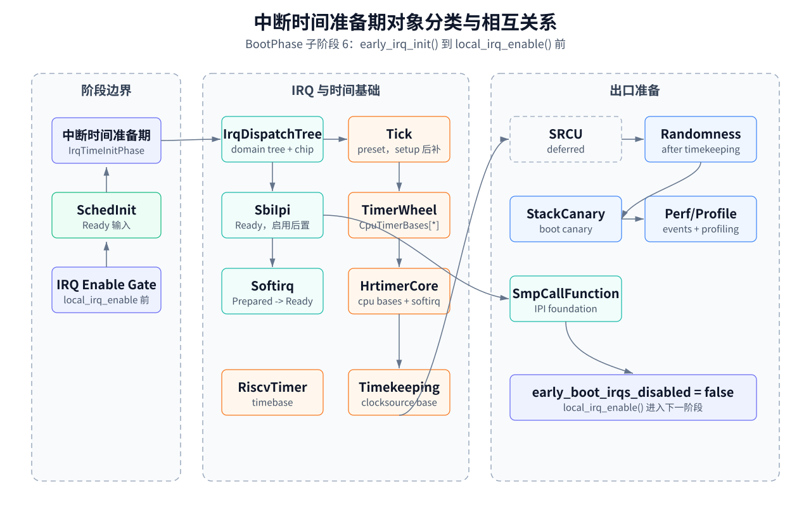

  图 18 中断时间准备期对象分类与相互关系

图 18 用于说明子阶段 6 的对象分类和依赖关系。左侧是阶段边界，中间是 IRQ、tick/timer、softirq 和 timekeeping 主线对象，右侧是 RNG、perf/profile、SMP call function、出口 gate 与当前裁剪路径。

##### 子阶段 6 过程处理清单（初稿）

| Linux 6.12.37 `start_kernel()` 调用 | 规格处理 | 备注 |
|---|---|---|
| `early_irq_init()` | formal candidate: `IrqSubsystem.preset()` | 建立通用 IRQ descriptor 和 early IRQ 基础。 |
| `init_IRQ()` | formal candidate: `IrqSubsystem.setup()` | RISC-V64 初始化 irq stack、irqchip、架构 IRQ 入口和 SBI IPI。 |
| `tick_init()` | formal candidate: `TickSubsystem.setup()` | 建立 tick broadcast 和 NO_HZ idle 基础。 |
| `rcu_init_nohz()` | formal candidate: `Rcu.setup_nohz()` | RCU nohz 相关初始化；依赖 tick/RCU 配置。 |
| `init_timers()` | formal candidate: `TimerWheel.setup()` | 建立 timer base 并注册 `TIMER_SOFTIRQ`。 |
| `srcu_init()` | formal candidate: `Srcu.setup()` | 建立 sleepable RCU 基础。 |
| `hrtimers_init()` | formal candidate: `HrtimerSubsystem.setup()` | `CONFIG_HIGH_RES_TIMERS=y`，准备 boot CPU hrtimer base 并注册 `HRTIMER_SOFTIRQ`。 |
| `softirq_init()` | formal candidate: `Softirq.setup()` | 建立 softirq 表和 per-CPU pending 状态；异步执行仍等中断打开。 |
| `timekeeping_init()` | formal candidate: `Timekeeping.setup()` | 建立通用 timekeeper 和 clocksource 状态。 |
| `time_init()` | formal candidate: `RiscvTimer.setup()` | 从正式 DeviceTree 读取 `timebase-frequency`，执行 `timer_probe()` 等 RISC-V timer 初始化。 |
| `random_init()` | formal candidate: `Randomness.setup()` | 必须在 timekeeping 初始化之后，使 RNG 基础进入完整可用边界。 |
| `kfence_init()` | trimmed | `CONFIG_KFENCE=n`。 |
| `boot_init_stack_canary()` | formal candidate/checkpoint: `StackCanary.setup()` | 使用完整 RNG 刷新或建立 boot stack canary 事实。 |
| `perf_event_init()` | formal candidate: `PerfEvent.setup()` | `CONFIG_PERF_EVENTS=y`，建立 perf event 核心基础。 |
| `profile_init()` | formal candidate/checkpoint: `Profiler.setup()` | `CONFIG_PROFILING=y`，建立 profiling 基础；后续可视实际对象语义调整。 |
| `call_function_init()` | formal candidate: `SmpCallFunction.setup()` | 建立 SMP call function/IPI 基础；不启动 secondary CPU。 |
| `WARN(!irqs_disabled(), ...)` | checkpoint | 出口前再次确认中断仍关闭。 |
| `early_boot_irqs_disabled = false` | formal candidate: `IrqEnableGate.prepare()` | 清除 early boot 禁止标记；下一步 `local_irq_enable()` 不在本子阶段主体内。 |

  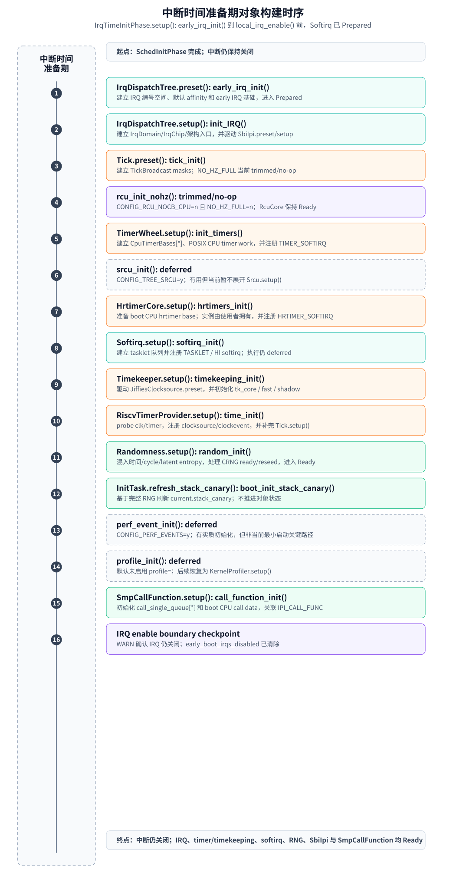

  图 19 中断时间准备期对象构建时序

图 19 按 Linux 6.12.37 `start_kernel()` 中 `context_tracking_init()` 后到 `local_irq_enable()` 前的调用顺序展示子阶段 6 的推进过程。蓝色节点表示 IRQ/timer/timekeeping 相关主线候选，绿色节点表示其它主线 formal 候选，紫色节点表示 checkpoint，灰色虚线节点表示当前配置裁剪路径。

本子阶段的结束状态暂定至少包含：

- `SchedulerInitPhase.state == Ready`
- `IrqSubsystem.state == Ready`，表示 IRQ descriptor、irqdomain、RISC-V irq stack、irqchip 和 SBI IPI 已建立
- `TickSubsystem.state == Ready`
- `TimerWheel.state == Ready`
- `Srcu.state == Ready`
- `HrtimerSubsystem.state == Ready`
- `Softirq.state == Ready`
- `Timekeeping.state == Ready`
- `RiscvTimer.state == Ready`
- `Randomness.state == Ready` 或从早期状态推进到完整可用边界
- `StackCanary.state == Ready` 或 boot stack canary 事实已经刷新
- `PerfEvent.state == Ready`
- `Profiler.state == Ready` 或保留为 checkpoint
- `SmpCallFunction.state == Ready`
- `KFence` 明确记录为当前配置不需要
- `early_boot_irqs_disabled == false`
- 中断总开关仍处于关闭状态；下一阶段的起点是 `local_irq_enable()`

### 内核领域与前置环境

本规格虽以内核领域为核心，但必须讨论前置环境，因为内核领域中的许多对象并非由内核凭空创造，而是以内核接管前已经形成的执行条件和资源基础为前提。

因此，本规格讨论硬件、固件与引导过程，不是为了完整覆盖这些层的全部实现细节，而是为了回答以下问题：

- 它们为内核 Flow 的实体化创造了什么条件
- 它们为内核资源对象的建立提供了什么基础
- 它们在哪些边界上约束了内核后续的组织方式

### 对组件化内核的意义

组件化内核并不是在一个静态、既成的对象世界中对模块重新分组，而是在一个已经历逐级实体化的领域中，对执行流、资源对象与控制关系进行再组织。

因此，后续对组件、扩展点、生命周期和装配关系的定义，都需要明确它们所依赖的前置环境、所处的实体化阶段，以及它们能作用于哪些已经建立完成或正在建立中的对象。同时，也需要明确这些对象之间以何种消息语义相互作用与协作。

从对象层级的角度看，组件化内核所处理的并不是一个扁平对象集合，而是一个不断由低级对象支撑高级对象、再由高级对象开启新一轮建立过程的螺旋上升结构。

## 组件模型

待补充。

## 生命周期

待补充。

## 接口与通信

待补充。

## 配置与装配

待补充。

## 扩展机制

待补充。

## 运行时与资源管理

待补充。

## 错误处理

待补充。

## 安全与隔离

待补充。

## 测试与验证

待补充。

## 兼容性策略

待补充。

## 未决问题

- 待补充
